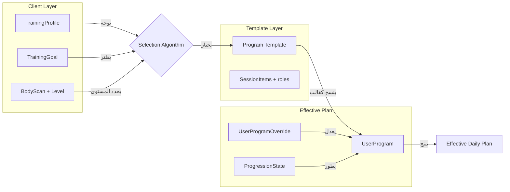

# تصميم البرامج المتوازن — Balanced Program Design

> **نقطة الانطلاق:** الـ Charter المعتمد في [Docs/New-Project/Training-Programs/Program-Charter.md](Docs/New-Project/Training-Programs/Program-Charter.md). هذه الوثيقة **تكملة** للـ Charter — تترجم المبادئ الست إلى قرارات تصميمية ملموسة.
>
> **هذه ليست خطة تنفيذ.** لا كود الآن. المخرج النهائي بعد إقرارك: ملف مرجعي `Program-Design.md` بجانب الـ Charter.

---

## القسم 1 — مراجعة مقترح Program-Design-Concept.md

### ما يُتبنّى (Aligned مع Charter — مفيد ومتوازن)


| الفكرة                                                                              | لماذا تستحق التبني                                                                                  |
| ----------------------------------------------------------------------------------- | --------------------------------------------------------------------------------------------------- |
| **Client/Coaching Profile** كيان مستقل عن User                                      | يحقق المبدأ 4 (Individualization). ينظف User من بيانات تدريبية. مصدر حقيقة واحد لقرارات التسكين.    |
| **Program Versioning + Fork Lineage**                                               | يحمي template النظام من التلوث بتقدم المستخدمين. قرار معماري ضروري.                                 |
| **Effective User Plan = Template + Overrides + Progression**                        | يحل خطر فعلي في `progression.service.ts` (يلمس template مباشرة). يعطي مرونة المتدرب دون كسر النظام. |
| **role لكل SessionItem** (warmup/main/accessory/cooldown/test)                      | يحقق ترتيب الجلسة العلمي بدون كيان جديد. حقل بسيط على ما هو موجود.                                  |
| **intent لكل SessionItem** (standard/power/eccentric)                               | يفعّل توصيات ACSM 2026 لـ Power RT و Eccentric Overload. حقل واحد.                                  |
| **Movement Pattern على Exercise** (push/pull/squat/hinge/lunge/carry/rotation/gait) | تصنيف بيوميكانيكي ضروري للـ volume per pattern. بدون engine، فقط enum.                              |
| **Allowed Substitutions كقائمة**                                                    | ادرب يختار البدائل بنفسه. لا rلمules engine. مرونة ذكية.                                            |
| **Entry/Exit Recommendations كـ JSON**                                              | Admin يكتب توصيات بسيطة (نص + شروط). لا engine معقد.                                                |
| **Assignment Rationale** على UserProgram                                            | شفافية للمتدرب: "لماذا اختير لي هذا البرنامج؟"                                                      |


### ما يُرفض (تعقيد زائد، يتعارض مع Charter)


| الفكرة المرفوضة                                        | السبب                                                                         |
| ------------------------------------------------------ | ----------------------------------------------------------------------------- |
| **Phase/Block** كيان منفصل (Periodization layer)       | الـ Charter صريح في Anti-Goal: لا periodization engine. ACSM 2026 تنفي تفوقه. |
| **Session Block** كيان منفصل (9 أنواع)                 | تعقيد مفرط. حقل `role` على SessionItem يحقق نفس الفائدة.                      |
| **Set Prescription** table منفصل                       | المبالغة. `weightPerSet` JSON على SessionItem يكفي للآن.                      |
| **Movement Taxonomy** كـ engine منفصل                  | enum `movementPattern` على Exercise كافٍ. لا حاجة لـ taxonomy service.        |
| **Substitution Rules Engine** ("لو لا بار → dumbbell") | قرار engineer لا rules engine. قائمة بدائل يدوية تكفي.                        |
| **Goal Prescription Profile** كـ table في DB           | ثوابت في الكود (مثل `archetype-defaults.ts`). لا تتغير، لا تستحق جدول.        |
| **Assessment Battery** معقدة (5 أنواع)                 | الموجود (`AssessmentTemplate` + `BodyScanResult`) يكفي. لا توسع الآن.         |


### ما يُبسَّط (الفكرة جيدة لكن التنفيذ المقترح ثقيل)


| الفكرة                                          | التبسيط المقترح                                      |
| ----------------------------------------------- | ---------------------------------------------------- |
| Phase/Block (foundation/build/intensify/deload) | حقل `weekType` enum بسيط على ProgramWeek (`normal    |
| Session داخلية (warmup/activation/main/...)     | `role` على SessionItem فقط. لا تجميع في "blocks".    |
| Day Focus (upper/lower/push/pull)               | `dayFocus` نص حر اختياري على ProgramDay — للعرض فقط. |


---

## القسم 2 — البنية المعمارية في 3 طبقات واضحة

الفكرة الجوهرية: فصل البرنامج إلى 3 طبقات مستقلة. كل طبقة لها مالك ومسؤولية واضحة.

### الطبقة 1: Client Layer (من هو المتدرب؟)

**المالك:** المتدرب + النظام (من التقييم)

- **TrainingProfile** (جديد): بيانات تدريبية كاملة منفصلة عن User
- **PAR-Q Result** (موجود جزئياً في BodyScanResult)
- **BodyScanResult + UserLevelProfile** (موجود)
- **TrainingGoal** (جديد كحقل على User)

هذه الطبقة تجيب: "من هو المتدرب، ما هدفه، ما قيوده، ما مستواه في كل محور؟"

### الطبقة 2: Template Layer (ما هو البرنامج؟)

**المالك:** Admin / Coach — **لا يتغير بتقدم المستخدمين**

- **Program** (موجود) + حقول جديدة: `programType`, `trainingGoal`, `version`, `forkedFromId`
- **ProgramWeek** (موجود) + `weekType` enum
- **ProgramDay** (موجود) + `dayFocus` نص اختياري
- **ProgramSession** (موجود)
- **ProgramSessionItem** (موجود) + `role`, `intent`, `allowedSubstitutions`

هذه الطبقة تجيب: "ما هي الوصفة التدريبية العامة؟ لمن صُممت؟ ما ترتيب التمارين وأهدافها؟"

### الطبقة 3: Effective Plan Layer (ماذا يفعل هذا المتدرب تحديداً؟)

**المالك:** النظام + المتدرب (تعديلاته)

- **UserProgram** (موجود): الاشتراك في البرنامج
- **UserProgramOverride** (جديد): تعديلات المتدرب (استبدال تمرين، تغيير وزن، تخطي يوم)
- **UserProgramExerciseProgressionState** (موجود): حالة التقدم لكل تمرين
- **ProgressionHistory** (موجود): سجل القرارات

هذه الطبقة تجيب: "ماذا سيفعل هذا المتدرب المحدد اليوم، بأي وزن، بأي تكرارات، بعد كل تعديلاته وتقدمه؟"

### كيف تتفاعل الطبقات الثلاث



**القاعدة الذهبية:** `Effective Plan = Template + Overrides + ProgressionState`

- النظام لا يلمس ProgramSessionItem الأصلي ابداً عند تقدم المتدرب.
- كل تعديل (يدوي أو تلقائي) يُحفظ في Override أو ProgressionState.
- عند عرض "خطة اليوم" للمتدرب، الـ API يدمج الثلاثة ويرجع الخطة الفعّالة.

---

## القسم 3 — الكيانات الجديدة (2 فقط)

### الكيان 1: TrainingProfile

**لماذا جديد وليس حقول على User؟**
- User فيه بالفعل حقول Auth + Settings + Subscription.
- TrainingProfile يتغير بالتقييم وبمرور الوقت، بينما User ثابت نسبياً.
- يمنع تضخم جدول User.

**الحقول:**

- `userId` (FK, unique) — علاقة 1:1
- `heightCm` Int?
- `weightKg` Float?
- `dateOfBirth` DateTime?
- `biologicalSex` String? — male/female (اختياري، للمقارنات المرجعية)
- `currentActivityLevel` String? — sedentary/light/moderate/active
- `trainingExperienceMonths` Int? — عمر تدريبي تقديري
- `resistanceExperience` String? — none/beginner/intermediate/advanced
- `availableDaysPerWeek` Int? — 2-7
- `maxSessionMinutes` Int? — أقصى مدة جلسة
- `availableEquipment` Json? — ["barbell", "dumbbell", "bands", "bodyweight_only"]
- `trainingLocation` String? — home/gym/mixed
- `knownInjuries` Json? — [{"region": "knee", "severity": "mild", "notes": "..."}]
- `painFlags` Json? — مناطق الألم الحالية
- `parqPassed` Boolean? — نتيجة PAR-Q
- `parqFlags` Json? — إشارات PAR-Q التي تحتاج متابعة
- `parqCompletedAt` DateTime?
- `updatedAt` DateTime

**ملاحظة:** بعض هذه البيانات موجودة بالفعل في `BodyScanResult` (مثل `parqPassed`, `parqFlags`). القرار: هل ننقلها إلى TrainingProfile أم نبقيها في BodyScanResult ونضع reference فقط في TrainingProfile؟ **اقتراحي:** نبقي PAR-Q في TrainingProfile (لأنه بوابة أمان دائمة)، ونبقي النتائج التفصيلية في BodyScanResult (لأنها مرتبطة بلحظة التقييم).

### الكيان 2: UserProgramOverride

**لماذا جديد؟**
- حالياً `UserProgram.customizations` هو JSON واحد كبير — صعب الاستعلام عنه، صعب تتبع التغييرات.
- المقترح الأصلي استخدم `materializeToNextItem` في `progression.service.ts` وهو يعدّل ProgramSessionItem مباشرة — **خطر حقيقي** لو البرنامج مستخدم من عدة متدربين.

**الحقول:**

- `id` String @id
- `userProgramId` (FK)
- `weekNumber` Int
- `dayNumber` Int
- `sessionItemId` String? — FK لـ ProgramSessionItem المحدد (null = override على مستوى اليوم)
- `overrideType` String — "substitute_exercise" | "adjust_prescription" | "skip_item" | "add_item"
- `data` Json — البيانات المعدلة (exerciseId جديد، أو sets/reps/weight معدلة)
- `reason` String? — لماذا التعديل (اختياري)
- `source` String — "user" | "progression_engine" | "coach"
- `createdAt` DateTime

**مثال عملي:**

```json
// المتدرب استبدل Barbell Squat بـ Goblet Squat (ألم ركبة)
{
  "overrideType": "substitute_exercise",
  "sessionItemId": "item-123",
  "data": { "newExerciseId": "goblet-squat-id" },
  "reason": "knee pain with heavy barbell",
  "source": "user"
}

// محرك التقدم رفع الوزن
{
  "overrideType": "adjust_prescription",
  "sessionItemId": "item-456",
  "data": { "weightKg": 67.5 },
  "source": "progression_engine"
}
```

---

## القسم 4 — حقول مضافة على كيانات موجودة

### على Program (Template)

| الحقل | النوع | الغرض |
|-------|------|-------|
| `programType` | Enum: SYSTEM / COACH / CUSTOM | القرار 1 في Charter |
| `trainingGoal` | Enum: STRENGTH / HYPERTROPHY / POWER / GENERAL_HEALTH | ما الهدف الأساسي لهذا البرنامج |
| `version` | Int @default(1) | حماية النسخ — كل تعديل Admin يرفع الرقم |
| `forkedFromId` | String? (FK self) | أصل البرنامج لو كان Custom fork |
| `ownerId` | String? (FK User) | مالك البرنامج (null = النظام، قيمة = مدرب/متدرب) |
| `entryRecommendations` | Json? | شروط/توصيات دخول يكتبها Admin بحرية |
| `exitRecommendations` | Json? | توصيات الخروج: البرنامج التالي، إعادة تقييم |
| `targetEquipment` | Json? | المعدات المطلوبة (للفلترة عند التسكين) |
| `weeklySessionTarget` | Int? | عدد الجلسات الأسبوعية المستهدفة |
| `estimatedSessionMinutes` | Int? | متوسط مدة الجلسة |

### على ProgramWeek

| الحقل | النوع | الغرض |
|-------|------|-------|
| `weekType` | Enum: NORMAL / DELOAD / TEST / INTRO | tag بسيط يضعه Admin — للعرض والتقارير فقط. لا engine. |

### على ProgramDay

| الحقل | النوع | الغرض |
|-------|------|-------|
| `dayFocus` | String? | نص حر: "Upper Body", "Push", "Full Body", etc. للعرض فقط. |
| `intensityLevel` | String? | "heavy" / "moderate" / "light" — Admin يختار. |

### على ProgramSessionItem

| الحقل | النوع | الغرض |
|-------|------|-------|
| `role` | Enum: WARMUP / ACTIVATION / MAIN / ACCESSORY / CORRECTIVE / COOLDOWN / TEST | الدور العلمي داخل الجلسة — يحدد الترتيب المنطقي |
| `intent` | Enum: STANDARD / POWER / ECCENTRIC / VELOCITY_BASED | نية الأداء — يؤثر على feedback أثناء التمرين |
| `allowedSubstitutions` | Json? | قائمة exercise IDs بديلة يحددها Admin/Coach |

### على Exercise (الموجود)

| الحقل | النوع | الغرض |
|-------|------|-------|
| `movementPattern` | Enum: PUSH / PULL / SQUAT / HINGE / LUNGE / CARRY / ROTATION / GAIT / HOLD / OTHER | تصنيف بيوميكانيكي — ضروري لـ volume per pattern |

### على UserProgram (الموجود)

| الحقل | النوع | الغرض |
|-------|------|-------|
| `assignmentReason` | Json? | لماذا اختير هذا البرنامج: `{"source": "auto_prescription", "factors": [...]}` |
| `templateVersion` | Int | أي نسخة من Template تم التسكين عليها |

---

## القسم 5 — ما يبقى ثوابت في الكود (لا جداول في DB)

### Goal Defaults (ملف `goal-defaults.ts` جديد بجانب `archetype-defaults.ts`)

```typescript
// ثوابت علمية من ACSM 2026 — لا تتغير، لا تستحق جدول
export const GOAL_DEFAULTS = {
  STRENGTH: {
    intensityRange: { min: 0.80, max: 0.85 },
    repRange: { min: 5, max: 8 },
    setRange: { min: 3, max: 4 },
    progressionPriority: ['load', 'reps', 'sets'],
    minWeeklyFrequency: 2,
  },
  HYPERTROPHY: {
    intensityRange: { min: 0.65, max: 0.75 },
    repRange: { min: 8, max: 12 },
    setRange: { min: 3, max: 5 },
    progressionPriority: ['sets', 'reps', 'load'],
    minWeeklySetsPerMuscle: 10,
  },
  POWER: {
    intensityRange: { min: 0.40, max: 0.60 },
    repRange: { min: 3, max: 6 },
    setRange: { min: 3, max: 4 },
    progressionPriority: ['load'],
    maxVelocityLoss: 0.25,
  },
  GENERAL_HEALTH: {
    intensityRange: { min: 0.60, max: 0.70 },
    repRange: { min: 10, max: 15 },
    setRange: { min: 2, max: 3 },
    progressionPriority: ['reps', 'sets', 'load'],
    minWeeklyFrequency: 2,
  },
};
```

### Session Role Order (ثابت — لا engine)

```typescript
export const SESSION_ROLE_ORDER = [
  'WARMUP',      // إحماء
  'ACTIVATION',  // تنشيط
  'MAIN',        // تمارين رئيسية
  'ACCESSORY',   // مساعدة
  'CORRECTIVE',  // تصحيحية
  'COOLDOWN',    // تهدئة
  'TEST',        // اختبار
];
```

هذا الترتيب يُستخدم عند:
- الفرز التلقائي داخل الجلسة (لو Admin لم يحدد sortOrder يدوياً)
- التحقق من منطقية الترتيب (warning لا blocking: "هل تريد وضع MAIN قبل WARMUP؟")
- **لكنه لا يمنع** Admin/Coach من ترتيب مختلف — مرونة كاملة

---

## القسم 6 — قرارات حاسمة تحتاج مراجعتك

### القرار A: متى يحصل Fork؟

عندما المتدرب يعدّل برنامج System/Coach، متى ننشئ Custom fork ومتى نكتفي بـ Override؟

**اقتراحي:**
- **Override** لكل التعديلات الصغيرة: تغيير وزن، استبدال تمرين ببديل مسموح، تخطي يوم.
- **Override** أيضاً لتعديلات Progression Engine (رفع وزن، زيادة تكرارات).
- **لا Fork أبداً تلقائياً.** Fork يحصل فقط لو المتدرب أراد إنشاء برنامج مخصص من الصفر مبنياً على برنامج موجود (action صريح: "انسخ وعدّل").
- **السبب:** الـ Fork يعقّد (نسخ كل الأسابيع والأيام والجلسات والعناصر). الـ Override أخف وأذكى.

### القرار B: مرونة صانع البرنامج

أين الحد بين "ما يفرضه النظام" و"ما يقرره صانع البرنامج"؟

**اقتراحي — 3 مستويات واضحة:**

- **مفروض من النظام (لا يُتجاوز):**
  - PAR-Q كبوابة قبل أول جلسة
  - Quality Gate قبل الترقية (formScore, completionRate, ROM, streak)
  - حماية Template من التعديل بتقدم المستخدمين

- **مُقترح من النظام (يمكن للـ Admin/Coach تجاوزه):**
  - ترتيب التمارين حسب role
  - rep/set ranges حسب Goal
  - نطاق الشدة (%1RM)
  - البرنامج التالي المقترح

- **حرية كاملة لصانع البرنامج:**
  - اختيار التمارين (بأي عدد وترتيب)
  - تحديد Sets/Reps/Duration/Weight لكل تمرين
  - تحديد أيام الراحة
  - تحديد weekType (deload أم لا)
  - تحديد dayFocus
  - تحديد role و intent لكل عنصر
  - تحديد البدائل المسموحة
  - كتابة entry/exit recommendations بحرية
  - إضافة ملاحظات نصية على أي مستوى

### القرار C: هل Coach role موجود الآن؟

من الاستكشاف السابق للمشروع، وجدت فقط Admin role في النظام. 

**اقتراحي:** لا نبني Coach role الآن. نكتفي بـ:
- `programType: COACH` على البرنامج
- `ownerId` يشير لـ User الذي أنشأ البرنامج
- لاحقاً عند بناء Coach features، نربط بالصلاحيات

### القرار D: كيف يعمل Effective Plan API؟

**اقتراحي:**

```
GET /api/mobile/user-programs/:id/effective-plan?week=2&day=3
```

الـ API يعمل merge بالترتيب:

1. يجلب Template (ProgramWeek → ProgramDay → ProgramSession → ProgramSessionItems)
2. يطبّق Overrides من UserProgramOverride (أحدث Override يكسب)
3. يطبّق ProgressionState (وزن/تكرارات/مستوى صعوبة محدّثة)
4. يرجع Effective Plan — هذا ما يراه المتدرب

**النتيجة:** مصدر حقيقة واحد، Template نظيف، وكل متدرب يرى خطته المخصصة.

---

## القسم 7 — Anti-Goals (ما لا يُبنى — تأكيد مع Charter)

بالإضافة إلى Anti-Goals في الـ Charter:

- **لا Phase/Block entity** — `weekType` enum كافٍ.
- **لا Session Block entity** — `role` enum على SessionItem كافٍ.
- **لا Set Prescription table** — JSON كافٍ.
- **لا Movement Taxonomy service** — enum `movementPattern` كافٍ.
- **لا Substitution Rules Engine** — قائمة `allowedSubstitutions` يدوية كافية.
- **لا Program Builder Wizard ذكي** يفرض قواعد صارمة — الـ Admin/Coach يبني بحرية مع warnings لا blocking.
- **لا "auto-deload"** أو "auto-phase" — Admin يحدد weekType يدوياً.
- **لا conflict detection** بين أيام (مثل: "لا تضع hinge ثقيل بعد lower ثقيل") — هذه مسؤولية صانع البرنامج.

---

## القسم 8 — ملخص التأثير على الكود الموجود

### Backend (Prisma Schema)

- **كيان جديد:** TrainingProfile (1:1 مع User)
- **كيان جديد:** UserProgramOverride (Many:1 مع UserProgram)
- **حقول جديدة على Program:** programType, trainingGoal, version, forkedFromId, ownerId, entryRecommendations, exitRecommendations, targetEquipment, weeklySessionTarget, estimatedSessionMinutes
- **حقول جديدة على ProgramWeek:** weekType
- **حقول جديدة على ProgramDay:** dayFocus, intensityLevel
- **حقول جديدة على ProgramSessionItem:** role, intent, allowedSubstitutions
- **حقل جديد على Exercise:** movementPattern
- **حقول جديدة على UserProgram:** assignmentReason, templateVersion
- **حقل جديد على User:** trainingGoal

### Backend (Services)

- **`effective-plan.service.ts`** (جديد): يدمج Template + Overrides + ProgressionState
- **`progression.service.ts`** (تعديل): يكتب في UserProgramOverride بدلاً من ProgramSessionItem
- **`prescription.service.ts`** (تعديل): يستخدم TrainingProfile + TrainingGoal في الفلترة

### Backend (ثوابت جديدة)

- **`goal-defaults.ts`** (جديد): ثوابت ACSM لكل هدف
- **`session-role-order.ts`** (جديد): ترتيب الأدوار

### Android

- **Onboarding flow** (تعديل): جمع بيانات TrainingProfile + PAR-Q
- **Session UI** (تعديل): عرض Effective Plan بدلاً من Template مباشرة

---

## القسم 9 — ملخص في 10 نقاط

1. **3 طبقات واضحة:** Client (من) / Template (ماذا) / Effective Plan (ماذا لهذا المتدرب).
2. **2 كيانات جديدة فقط:** TrainingProfile + UserProgramOverride.
3. **Template لا يُلمس** بتقدم المستخدمين — كل التعديلات في Overrides.
4. **صانع البرنامج حر** في بناء ما يشاء — النظام يقترح ولا يمنع.
5. **Goal Defaults** ثوابت في الكود — لا جداول.
6. **role + intent** حقول بسيطة على SessionItem — لا Session Block entity.
7. **weekType** tag بسيط — لا Phase/Block engine.
8. **movementPattern** enum على Exercise — لا Taxonomy engine.
9. **allowedSubstitutions** قائمة يدوية — لا Rules engine.
10. **Effective Plan API** = Template + Overrides + ProgressionState — مصدر حقيقة واحد.

---

## الخطوة التالية

بعد موافقتك على هذا التصميم، أكتبه في ملف `Docs/New-Project/Training-Programs/Program-Design.md` كمرجع رسمي بجانب الـ Charter. ثم ننتقل لتحديد أولوية الفجوات وخطة التنفيذ.
```


