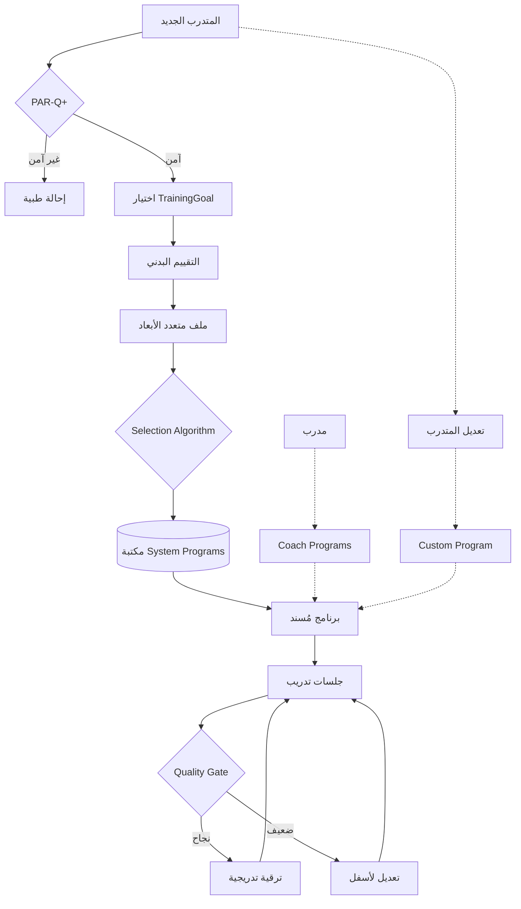

# Charter — مبادئ حاكمة وقرارات معمارية لمشروع POSE التدريبي

> **هذه ليست خطة تنفيذ.** هذه وثيقة مرجعية تأسيسية — كل قرار تطوير لاحق يجب أن يُقاس عليها. المخرج النهائي: ملف مرجعي في `Docs/New-Project/` (الاسم المقترح: `Training-Charter.md`) — لكن لا يُكتب الآن إلا بعد موافقتك على المحتوى أدناه.

---

## القسم 1 — المبادئ الستة الحاكمة

هذه هي **العقيدة التدريبية** للمشروع. أي ميزة جديدة لا تحترمها يجب أن تُرفض أو تُعاد صياغتها.

### المبدأ 1: Safety First (السلامة أولاً)
- لا برنامج بدون فحص أهلية مسبق (PAR-Q+ كبوابة).
- إحالة الحالات الطبية لطبيب مختص بدلاً من تحمّل العبء.
- Quality Gate إلزامي قبل أي ترقية تدرج.
- **مصدر علمي:** الدراسة الأمريكية + بحث `Program-research-1.md` (الفصل بين قرار السلامة وقرار التوصيف وقرار البرمجة).

### المبدأ 2: Specificity (التخصيص النوعي — مبدأ SAID)
- التكيف يتبع المنبه: لا توجد "أفضل تمارين" بالمطلق، بل أفضل تمارين *لهذا الهدف لهذا المتدرب الآن*.
- الهدف يحدد: الحمل، الحجم، السرعة، نوع التمرين، ترتيب التمارين.
- **مصدر علمي:** ACSM 2026 (Table 6) + NSCA + كلا البحثَين.

### المبدأ 3: Progressive Overload (الحمل التدريجي المنتظم)
- التحسن يتطلب ارتفاعاً مدروساً في المتطلبات — لكن قابل للاستشفاء وللاستمرار.
- تعديل **متغير واحد أو اثنين** فقط في المرة الواحدة (وزن، أو تكرارات، أو مجموعات).
- **مصدر علمي:** ACSM Classic + ACSM 2026 (≥80% 1RM للقوة، ≥10 sets/week/muscle للتضخم).

### المبدأ 4: Individualization (التفرد ومبدأ الحلقة الأضعف)
- "أنت قوي بقدر أضعف حلقة لديك" — البرنامج يبدأ من المحدِّد الأكبر.
- **ملف متعدد الأبعاد** بدلاً من تصنيف أحادي (مبتدئ/متوسط/متقدم).
- متدرّب قد يكون متقدماً في القوة ومبتدئاً في الحركية — وهذا طبيعي.
- **مصدر علمي:** بحثَي RE-Search + Final-Progression-Spec.

### المبدأ 5: Adherence > Perfection (الالتزام أهم من الكمال)
- **برنامج بسيط قابل للتنفيذ يتفوق على برنامج معقد على الورق.**
- الجرعة الدنيا الفعّالة + أقصى قابلية للالتزام.
- البرامج الرقمية والمدمجة فعّالة عند توفر الإشراف والتغذية الراجعة.
- **مصدر علمي:** ACSM 2026 ("الاستمرارية والاتساق" أهم من تعقيد البرامج) — وهي **النتيجة الأقوى** في الدراسة.

### المبدأ 6: Evidence-Based, Not Innovation-Based (مبني على الدليل)
- لا نخترع — نطبق ما تم تأسيسه علمياً.
- لا نضيف أي ميزة "مبتكرة" بدون مرجع علمي صريح.
- ACSM، NSCA، WHO هي المراجع الأساسية للمشروع.
- **مصدر علمي:** كل المراجع الثلاث.

---

## القسم 2 — القرارات المعمارية الحاكمة

قرارات نهائية مبنية على المبادئ السابقة وعلى استكشاف الكود الفعلي.

### القرار 1: ثلاثة أنواع برامج صريحة على Schema
بدلاً من الاعتماد الضمني الحالي على `isDefault` + `programId nullable`، نحتاج **حقل صريح** على `Program`:

```
enum ProgramType {
  SYSTEM    // مصمم من Admin/خبراء — يدخل في Auto-Prescription
  COACH     // مصمم من مدرب — يُسند يدوياً لمتدربين معينين
  CUSTOM    // نسخة شخصية للمتدرب (سواء أنشأها أو عدّل برنامجاً موجوداً)
}
```

**المبررات:**
- **System** = مكتبة البرامج الموثقة التي يختار منها `prescription.service.ts` تلقائياً (موجود في [backend/src/modules/prescription/prescription.service.ts](backend/src/modules/prescription/prescription.service.ts)).
- **Coach** = للحالات الخاصة التي لا تنطبق عليها برامج النظام، أو لخدمة مخصصة من مدرب.
- **Custom** = حق المتدرب في تعديل أي برنامج → النظام ينشئ نسخة `CUSTOM` تلقائياً (مفهوم Copy-on-Write).

**التحول التدريجي:**
- `Program.isDefault === true` ⟶ يُهجَّر إلى `ProgramType.SYSTEM`.
- `UserProgram.programId === null` (مع customizations) ⟶ يُهجَّر إلى `Program` من نوع `CUSTOM` مرتبط بالمستخدم.

### القرار 2: لا AI Generator — مكتبة + Selection Algorithm
- البرامج تُبنى **يدوياً** من Admin/Coach وفق المبادئ.
- النظام لا يولّد برامج من الصفر، بل يختار الأنسب من المكتبة.
- AI الموجود في المشروع له دور واحد فقط: **تقييم الأداء وقت التمرين** (Form Validation + Counting + Quality Scoring).
- **هذا قرار نهائي** ومتسق مع توصية ACSM 2026 بالبساطة، ومع اختيارك.

### القرار 3: Auto-Prescription محسّن بـ TrainingGoal
المحرك الموجود `prescriptionService.recommend` يصنّف حسب الأولوية الجسدية فقط (`SAFETY → CORRECTION → ...`). يحتاج إثراء بـ:

```
enum TrainingGoal {
  STRENGTH         // قوة — ≥80% 1RM، 5–8 reps
  HYPERTROPHY      // تضخم — ≥10 sets/week/muscle، 8–12 reps
  POWER            // قدرة — 30–60% 1RM بسرعة عالية، 3–6 reps
  GENERAL_HEALTH   // لياقة عامة — 60–70% 1RM، 10–15 reps
}
```

**أين يُحفظ:** حقل `trainingGoal` على `User` (افتراضي = `GENERAL_HEALTH`)، مع إمكانية تجاوزه على `ActivePlan`.

**أين يؤثر:**
1. اختيار البرنامج من مكتبة System.
2. أولوية محاور التقدم في `archetype-defaults.ts`.
3. الرسائل والاقتراحات في تقرير ما بعد الجلسة.

**المرجع الكامل:** [Docs/American-College-Prescription/11-Final-Progression-Spec.md](Docs/American-College-Prescription/11-Final-Progression-Spec.md) — جدول الأهداف والمحاور كامل.

### القرار 4: Progression Engine الحالي يكفي — لا إعادة بناء
المحرك الحالي ([backend/src/modules/progression/progression.service.ts](backend/src/modules/progression/progression.service.ts)) + [archetype-defaults.ts](backend/src/modules/progression/archetype-defaults.ts) يحقق:
- Quality Gate (formScore، completionRate، ROM، symmetry، stability).
- Streak-based promotion (جلستان متتاليتان قبل الترقية).
- 5 archetypes تغطي معظم الحالات.

**التحسين الوحيد المطلوب:** ربط `priorityOrder` بـ `TrainingGoal` (تغيير في كود واحد).

**ما لا يُبنى:** لا نضيف Periodization Engine، لا نضيف Block Periodization، لا نضيف Conjugate Periodization.

### القرار 5: PAR-Q كبوابة منفصلة قبل أول جلسة
- حالياً PAR-Q مدفون داخل `BodyScanResult.parqPassed` ويتم بعد التقييم البدني.
- المطلوب: **خطوة Onboarding صريحة** قبل أي تمرين، مستقلة عن التقييم البدني.
- النتيجة `parqPassed === false` ⟶ منع تلقائي من بدء أي جلسة + اقتراح إحالة طبية.
- **المرجع:** بحث `Program-research-1.md` (الفصل بين قرار السلامة وباقي القرارات).

### القرار 6: Beginner Mode افتراضي + Advanced اختياري
- المتدرّب العادي يرى: **الوزن المقترح + التكرارات + "ابدأ"**.
- لا يرى: %1RM، velocityLoss، tempo breakdown، إلا لو فعّل Advanced Mode من Settings.
- **المرجع:** Final-Progression-Spec.md (الخطوة 6).
- **يحقق:** المبدأ 5 (Adherence > Perfection) — تقليل الاحتكاك.

---

## القسم 3 — التوصيف العلمي المعتمد

### الأهداف التدريبية الأربعة
متوافقة مع ACSM 2026 + NSCA + Final-Progression-Spec.md — **لا تُغيَّر إلا بمراجعة علمية صريحة**.

- **STRENGTH:** %1RM 80–85 / Reps 5–8 / Sets 3–4 / أولوية: load → reps → sets
- **HYPERTROPHY:** %1RM 65–75 / Reps 8–12 / Sets 3–5 / أولوية: sets → reps → load
- **POWER:** %1RM 40–60 / Reps 3–6 / Sets 3–4 / أولوية: load (ضمن النطاق) + سرعة عالية
- **GENERAL_HEALTH:** %1RM 60–70 / Reps 10–15 / Sets 2–3 / أولوية: reps → sets → load

### تصنيف التمارين الأربعة (Counting Method × Weight Support)
ينطبق على كل تمرين في النظام — مبني على حقول موجودة فعلاً (`countingMethod` + `supportsWeight` على `Exercise`):

- **weighted_rep:** Squat, Deadlift, Bench Press → تقدم بـ (وزن + تكرارات)
- **bodyweight_rep:** Push-up, Pull-up → تقدم بـ (تكرارات + difficulty ladder)
- **weighted_hold:** Weighted Plank, Farmer's Walk → تقدم بـ (مدة + وزن)
- **bodyweight_hold:** Plank, Wall Sit → تقدم بـ (مدة + difficulty ladder)

**ملاحظة معمارية:** الـ enum الحالي `ExerciseArchetype` في Prisma فيه 5 قيم (`weighted_strength`, `bodyweight_dynamic`, `isometric_hold`, `mobility_rom`, `motor_control`). **يحتاج قرار:**
- إما توحيدها مع الـ 4 archetypes أعلاه، 
- أو إبقاؤهما طبقتين منفصلتين (5 archetypes للكود الحالي + 4 categories مشتقة منها للعرض).

سيُناقش هذا في الجلسة التالية بعد إقرار الـ Charter.

### Quality Gates المعتمدة
- formScore ≥ 70%
- completionRate ≥ 85%
- ROM ≥ 75%
- Streak: 2 جلسات متتالية
- (اختياري حسب الهدف) intensityPct ≥ 75% للقوة، velocityLoss ≤ 25% للقدرة، symmetry ≥ 70% للتمارين الثنائية

---

## القسم 4 — الفجوات الموثقة (Gaps) — لا تُنفَّذ الآن

تُسجَّل هنا لتُعالَج في خطط لاحقة — كل فجوة تستحق خطة منفصلة:

### Gap 1: TrainingGoal كحقل صريح على User
- **أين:** `backend/prisma/schema.prisma` (User model) + onboarding screen في Android.
- **حجم العمل:** صغير.
- **يفتح:** القرار 3 كاملاً.

### Gap 2: ProgramType enum (System/Coach/Custom)
- **أين:** `backend/prisma/schema.prisma` (Program model) + هجرة بيانات.
- **حجم العمل:** متوسط (هجرة + تحديث UI Admin + Mobile).
- **يفتح:** القرار 1 كاملاً.

### Gap 3: PAR-Q كخطوة Onboarding مستقلة
- **أين:** Android Onboarding flow (حالياً تسويقي فقط في [android-poc/.../OnboardingActivity.kt](android-poc/app/src/main/java/com/trainingvalidator/poc/ui/auth/OnboardingActivity.kt)) + backend endpoint.
- **حجم العمل:** متوسط.
- **يفتح:** القرار 5.

### Gap 4: اقتراح وزن تلقائي مبني على est1RM
- **أين:** Backend (suggestion service جديد) + UI شاشة بدء الجلسة.
- **حجم العمل:** متوسط.
- **يحقق:** قيمة كبيرة جداً للمتدرب.
- **المرجع:** Final-Progression-Spec.md (الخطوة 5).

### Gap 5: Volume per muscle group في التقارير الأسبوعية
- **أين:** Backend reports endpoint + Android Reports tab.
- **حجم العمل:** متوسط.
- **المرجع:** POSE-Integration-Roadmap.md (البند 7).

### Gap 6: Beginner Mode vs Advanced Mode في عرض التقارير
- **أين:** Android (`displayMode` على User Settings).
- **حجم العمل:** صغير.

---

## القسم 5 — ما لا يُبنى (Anti-Goals) — موثَّق صراحةً

تجنباً لانحراف Scope مستقبلاً، نوثق صراحةً ما **لن** يُبنى:

- ❌ **AI Program Generator** يولّد برامج من الصفر (يتعارض مع المبدأ 6 + قرارك).
- ❌ **Periodization Engine** معقد (Block, Undulating, Conjugate) — ACSM 2026 تنفي تفوقه عند وجود progressive overload مناسب.
- ❌ **Auto-Adjusting Rest Engine** — الراحة لا تؤثر بشكل حاسم (POSE-Integration-Roadmap.md، البند 12).
- ❌ **Equipment-Based Recommendations Engine** — نوع الجهاز لا يؤثر (الروادمب، البند 13).
- ❌ **Failure-Based Training prompts** — ACSM 2026 صريحة: الفشل ليس ضرورياً.
- ❌ **Linear Periodization مفروض على المبتدئ** — مفيد للنخبة فقط، يُترك خياراً للمدرب على Coach Programs.

---

## القسم 6 — مخطط القرارات الحاكمة (Mermaid)



---

## ملخص قابل للحفظ (الـ Charter في 10 أسطر)

1. **السلامة قبل كل شيء** — PAR-Q بوابة إلزامية.
2. **التخصيص قبل التعميم** — الهدف يحدد الجرعة.
3. **التدرج قبل القفز** — متغير واحد في المرة الواحدة.
4. **التفرد قبل القولبة** — الحلقة الأضعف توجه البرنامج.
5. **الالتزام قبل الكمال** — البساطة منتج، وليست قصور.
6. **الدليل قبل الابتكار** — لا اختراع بدون مرجع علمي.
7. **3 أنواع برامج صريحة:** System (تلقائي) / Coach (يدوي) / Custom (شخصي).
8. **مكتبة برامج + Selection Algorithm** — لا AI Generator.
9. **Progression Engine الحالي يكفي** — تحسينات صغيرة فقط.
10. **Beginner Mode افتراضي** — Advanced اختياري.

---

## الخطوة التالية بعد إقرارك

**فقط بعد موافقتك**، أكتب هذه الوثيقة في:
- المسار المقترح: `Docs/New-Project/Training-Charter.md`
- أو المسار البديل (لو تفضل): `Docs/Charter.md` في الجذر للتأكيد على مكانتها كمرجع رئيسي.

ثم نناقش معاً **أولوية الفجوات الست** أيها يبدأ التنفيذ أولاً (في خطة منفصلة).
