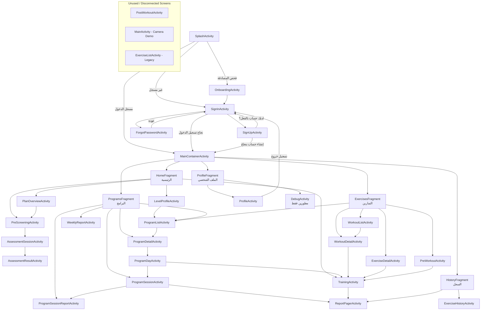

# مخطط مسارات وتفاصيل شاشات التطبيق (Android POC)

يهدف هذا الملف إلى تفصيل هيكل تطبيق Android، بما في ذلك جميع الشاشات (Activities و Fragments)، مسارات التنقل بينها (Navigation Flows)، توضيح الشاشات الغير مستخدمة أو المخفية، ووصف محتوى كل شاشة وأهميتها في التطبيق.

---

## 1. مخطط المسارات (Navigation Diagram)

يوضح المخطط التالي كيفية انتقال المستخدم بين شاشات التطبيق المختلفة:

---

## 2. تفاصيل جميع الشاشات المستخدمة وأهميتها

### أ. مسار المصادقة (Authentication Flow)
*   **`SplashActivity`:** شاشة البداية للتطبيق (Launcher). تقوم بتوجيه المستخدم حسب حالة الجلسة الخاصة به إلى الـ Onboarding، أو شاشة تسجيل الدخول، أو مباشرة إلى داخل التطبيق إذا كان مسجلًا.
*   **`OnboardingActivity`:** شاشات تعريفية بمميزات التطبيق للمستخدمين الجدد.
*   **`SignInActivity`:** شاشة تسجيل الدخول، وتعتبر بوابة العبور للتطبيق.
*   **`SignUpActivity`:** شاشة إنشاء حساب جديد.
*   **`ForgotPasswordActivity`:** شاشة استعادة كلمة المرور في حال فقدانها.

### ب. المسار الرئيسي (Main Navigation)
*   **`MainContainerActivity`:** الحاوية الأساسية للتطبيق التي تدير شريط التنقل السفلي (Bottom Navigation) وتتنقل بين الـ Fragments الخمسة الرئيسية.
    *   **`HomeFragment`:** الواجهة الرئيسية تعرض ملخص لتقدم المستخدم، روابط سريعة للبدء بالتدريب، خطة التطور، والتقييم الجسدي.
    *   **`ProgramsFragment`:** واجهة تتيح عرض البرامج التدريبية المخصصة للمستخدم وجداولها.
    *   **`ExercisesFragment`:** واجهة مكتبة التمارين الفردية وجلسات التمرين المستقلة.
    *   **`HistoryFragment`:** سجل يعرض التقارير وإحصائيات أداء التمارين السابقة.
    *   **`ProfileFragment`:** واجهة إعدادات الحساب والانتقال إلى تفاصيل الملف الشخصي أو شاشة المطورين.

### ج. مسار التقييم والتحليل الجسدي (Assessment Flow)
*   **`LevelProfileActivity`:** تعرض ملف مستوى لياقة المستخدم الحالي والتحسينات الممكنة.
*   **`PlanOverviewActivity`:** شاشة توضح الخطة الزمنية لتطور المستخدم.
*   **`PreScreeningActivity`:** استبيان الجاهزية الصحية للنشاط البدني (PAR-Q+) قبل إجراء أي مسح.
*   **`AssessmentSessionActivity`:** الجلسة الفعلية للمسح الحركي وتقييم الجسم باستخدام الكاميرا.
*   **`AssessmentResultActivity`:** تعرض نتائج المسح الحركي بعد انتهائه، وتقدم التوصيات المناسبة للحالة.

### د. مسار التدريب وبرامج التمارين (Training & Programs)
*   **`ProgramListActivity`:** قائمة بجميع البرامج التدريبية المتوفرة.
*   **`ProgramDetailActivity`:** تفاصيل برنامج تدريبي محدد والمستهدفات الخاصة به.
*   **`ProgramDayActivity`:** تفاصيل تمارين يوم محدد داخل البرنامج للانطلاق منه لعمل الجلسة.
*   **`ProgramSessionActivity`:** شاشة إدارة الجلسة التدريبية المكتملة ضمن البرنامج.
*   **`WorkoutListActivity`:** عرض قوائم التمارين المجمعة المتوفرة للتأدية الحرّة.
*   **`WorkoutDetailActivity`:** شاشة نظرة عامة قبل بدء التمرين توضح الخطة الزمنية للمراحل المختلفة للتدريب.
*   **`ExerciseDetailActivity`:** تفاصيل تمرين محدد تتضمن إرشادات توجيه الكاميرا، المفاصل الأساسية المطلوبة، وتجهيز الكاميرا.
*   **`PreWorkoutActivity`:** (شاشة بالتصميم الجديد) لتهيئة المستخدم نفسياً وبدنياً وتقديم توجيهات سريعة قبل بدء فتح الكاميرا.
*   **`TrainingActivity`:** **(أهم شاشة في التطبيق)** هي محرك الذكاء الاصطناعي والتتبع باستخدام الكاميرا (أو فيديو جاهز). تقوم بتحليل حركات الجسم لحظيًا وتوجيه المستخدم.

### هـ. مسار التقارير (Reports Flow)
*   **`ReportPagerActivity`:** شاشة قابلة للتمرير بكامل الشاشة تعرض تقارير وتفاصيل شاملة للأداء بعد انتهاء التمارين.
*   **`ProgramSessionReportActivity`:** تقرير تفصيلي يظهر للمستخدم بعد إتمام جلسة البرنامج.
*   **`WeeklyReportActivity`:** إحصاءات ملخصة عن مستوى تقدم المستخدم على مدار الأسبوع.
*   **`ExerciseHistoryActivity`:** توضح سجل التطور لأداء تمرين فردي على مدار الوقت.
*   **`ProfileActivity`:** لتعديل بيانات الملف الشخصي، تفضيلات الحساب وتسجيل الخروج.

---

## 3. الشاشات الغير مستخدمة والتي ليس لها مسارات واضحة

من خلال فحص الأكواد والـ Intents داخل التطبيق، تم تحديد الشاشات التالية كشاشات غير مستخدمة فعلياً في دورة حياة التطبيق للمستخدم، أو ليس لها مسار يوصل إليها:

1.  **`PostWorkoutActivity`:**
    *   **وصف الشاشة:** صُممت لتكون تقريراً بعد إنهاء التمرين (بالتصميم الجديد الحديث).
    *   **السبب:** لا يوجد أي كود استدعاء (Intent) ينقل المستخدم من `TrainingActivity` أو أي مكان آخر نحوها. يبدو أنها شاشة تم تجهيز واجهتها ولم يتم دمجها في الـ Flow النهائي بعد، حيث يتم الاعتماد حالياً على `ReportPagerActivity`.

2.  **`MainActivity`:**
    *   **وصف الشاشة:** شاشة ديمو تجريبية أولية (Camera Demo) كانت تستخدم لاختبار مكتبات تتبع المفاصل في بداية المشروع.
    *   **السبب:** تم تعويض هذه الشاشة بالـ `TrainingActivity` المتكاملة والحديثة. تم الإبقاء عليها في ملف الـ `AndroidManifest.xml` لكن لا يوجد أي زر أو مسار يفتحها الآن.

3.  **`ExerciseListActivity`:**
    *   **وصف الشاشة:** شاشة قائمة التمارين القديمة (Legacy).
    *   **السبب:** تم الإبقاء عليها بغرض التوافق (Compatibility) ربما لبعض الأكواد القديمة، لكن وظيفيا تم استبدالها بشكل كامل بـ `ExercisesFragment` في شريط التنقل السفلي الجديد. لا تستدعى من أي مكان.

4.  **`DebugActivity`:**
    *   **وصف الشاشة:** شاشة لعرض القياسات واختبار الميزات المخفية للمطورين.
    *   **السبب:** مسارها مخفي، فهي تستدعى من `ProfileFragment` غالباً بنقرات خاصة أو تكون مقفلة لعامة الناس. رغم أن لها مساراً برمجياً، إلا أنها تُعتبر خارج تدفق العمل الطبيعي للتطبيق.