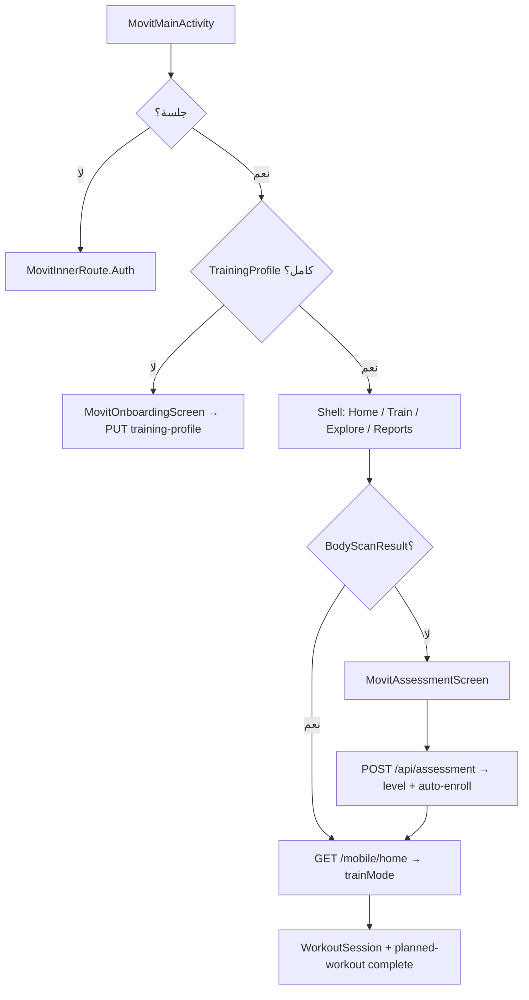

# توثيق المسار الحالي للمتدرب (Movit)

| | |
|---|---|
| **Status** | `ACTIVE` |
| **SSOT for** | Trainee journey as implemented in code |
| **Truth table** | [Journey-Index.md](../../Product-Master/Journey-Index.md) |
| **Verified** | 2026-06-22 |

هذا المجلد يصف **الوضع الحالي في الكود** (`kmp-app`, `backend`, `Admin-Dashboard`). الجدول التنفيذي والفجوات في Journey-Index فقط — هنا تفاصيل كل طبقة.

## الملفات

| الملف | المحتوى |
|--------|---------|
| [01-onboarding-and-training-profile.md](./01-onboarding-and-training-profile.md) | Onboarding KMP (7 خطوات) + `TrainingProfile` |
| [02-assessment-templates-and-resolve.md](./02-assessment-templates-and-resolve.md) | اختيار قالب التقييم (initial / progression) |
| [03-body-scan-level-profile.md](./03-body-scan-level-profile.md) | رفع Body Scan، `UserLevelProfile` |
| [04-prescription-and-program-enrollment.md](./04-prescription-and-program-enrollment.md) | التوصية والتسجيل في الخطة |
| [05-program-completion-reassessment.md](./05-program-completion-reassessment.md) | إكمال البرنامج، إعادة التقييم، `plan/complete` |
| [06-mobile-home-train-mode.md](./06-mobile-home-train-mode.md) | `GET /mobile/home` و`trainMode` |
| [07-admin-dashboard.md](./07-admin-dashboard.md) | صفحات الإدارة والـ API |
| [08-kmp-mobile.md](./08-kmp-mobile.md) | غلاف KMP، التبويبات، inner routes، فجوات العميل |

## مسار مبسّط

**فجوات معروفة:** `POST /mobile/plan/complete` غير مربوط من UI · أحداث البقاء غير منفّذة · Aha غير منفّذ · Booking ملغى.
