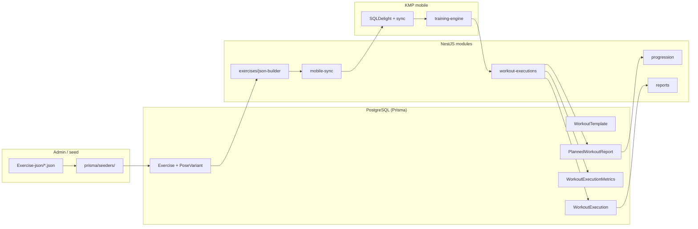
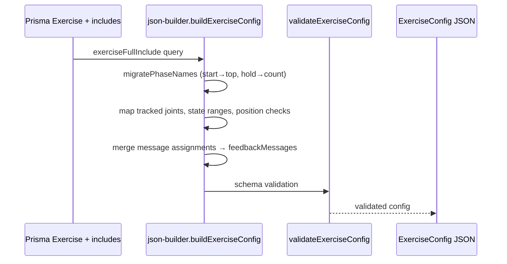

| | |
|---|---|
| **Status** | `ACTIVE` |
| **SSOT for** | Backend role in camera training (config, ingest, aggregation — no pose inference) |
| **Code** | `backend/src/modules/`, `backend/prisma/schema.prisma`, `backend/src/modules/exercises/json-builder.ts` |
| **Verified** | 2026-07-04 |

# Backend overview — camera training

The NestJS backend **does not run pose inference or the training engine**. Its role in camera training is:

1. **Exercise / workout config** — Prisma DB → Android/KMP JSON contract via `json-builder`
2. **Catalog sync** — bulk exercise + workout templates for offline mobile cache
3. **Session ingest** — persist per-exercise `WorkoutExecution` rows and planned-workout reports from mobile uploads
4. **Aggregation & downstream** — progression evaluation, admin analytics, report normalization

Pose detection, rep counting, and form scoring run **entirely on-device** in `kmp-app/core/training-engine/`.

---

## Architecture (backend slice)



---

## Module map (training-relevant)

| Module | Path | Role |
|--------|------|------|
| **json-builder** | `backend/src/modules/exercises/json-builder.ts` | **SSOT** DB → mobile `ExerciseConfig` JSON |
| **mobile-sync** | `backend/src/modules/mobile-sync/` | `GET /mobile/sync` — exercises, workouts, programs, audio manifests |
| **workout-templates** | `backend/src/modules/workout-templates/` | Published templates + `GET …/training-config` |
| **workout-executions** | `backend/src/modules/workout-executions/` | Upload executions, planned-workout lifecycle |
| **progression** | `backend/src/modules/progression/` | Post-workout difficulty adjustments |
| **reports** | `backend/src/modules/reports/` | Admin/user report aggregation (reads stored JSON + relational metrics) |
| **exercises** | `backend/src/modules/exercises/` | CRUD + config export helpers |

Controllers live beside services (e.g. `mobile-workout-executions.controller.ts`, `mobile-planned-workouts.controller.ts`, `mobile-sync.controller.ts`).

---

## Prisma models (training data)

### Config catalog

| Model | Table | Purpose |
|-------|-------|---------|
| `Exercise` | `exercises` | Slug, counting method, bilateral, weight support |
| `PoseVariant` | `pose_variants` | Tracked joints, position checks, message assignments |
| `PositionCheck` | `position_checks` | Landmark/world-axis validation rules (engine consumes via JSON) |
| `WorkoutTemplate` | `workout_templates` | Published workout definitions |
| `PlannedWorkout` | `planned_workouts` | Program calendar slot |
| `PlannedWorkoutItem` | `planned_workout_items` | Exercise rows within a planned workout |

### Runtime / metrics

| Model | Table | Scale | Purpose |
|-------|-------|-------|---------|
| `WorkoutExecution` | `workout_executions` | counts, duration | One exercise run (camera session) |
| `WorkoutExecutionMetrics` | `workout_execution_metrics` | **Int × 10** | Session-level kinematic aggregates |
| `RepMetrics` | `rep_metrics` | **Int × 10** | Per-rep metrics |
| `PlannedWorkoutReport` | `planned_workout_reports` | **Float 0–100** + JSON | Multi-exercise block report |
| `ProgressionHistory` | `progression_history` | mixed | Applied progression changes |

Key `WorkoutExecution` fields:

```prisma
// backend/prisma/schema.prisma (excerpt)
model WorkoutExecution {
  id              String
  userId          String
  exerciseId      String
  timestamp       DateTime
  durationMs      Int
  totalReps       Int
  countedReps     Int
  invalidReps     Int
  context         WorkoutExecutionContext  // program | free | explore_workout | …
  workoutGroupId  String?
  workoutTemplateId String?
  legacyReport    Json?                    // optional PostTrainingReport blob
  executionMetrics WorkoutExecutionMetrics?
  repMetrics       RepMetrics[]
}
```

---

## json-builder pipeline

**File:** `backend/src/modules/exercises/json-builder.ts`

Single transformation point from Prisma includes → mobile `ExerciseConfig` schema (`backend/src/lib/types/android-schema.ts`).

### Flow



### Consumers

| Consumer | Function |
|----------|----------|
| `mobile-sync.service.ts` | Embeds `buildExerciseConfig()` in sync payload `exercises[]` |
| `mobile-audio-manifest.service.ts` | Resolves message codes → audio file list |
| `workout-templates.service.ts` | `getTrainingConfig()` — full workout block for one template |
| `prisma/export-exercises-json-from-db.ts` | Export hand-editable JSON under `prisma/Exercise-json/` |
| `prisma/seeders/exercise-json-batch.ts` | Import JSON → DB (reverse direction) |

### Exercise JSON on mobile

1. **Cold start** — bundled `cold_offline_bundle.json` + optional sync
2. **Sync** — `GET /api/mobile/sync?updatedAfter=…` returns changed exercises
3. **Workout path** — `GET /api/mobile/workout-templates/{id}/training-config` returns nested exercise configs for a template
4. **Local cache** — `TrainingConfigRepository` (KMP) stores configs for offline training

Mobile deserializes JSON into `com.movit.core.training.config.ExerciseConfig` (`kmp-app/core/training-engine/.../ExerciseConfigModels.kt`).

---

## What the backend does NOT do

| Concern | Where it lives |
|---------|----------------|
| MediaPipe / pose landmarks | `kmp-app/core/pose-capture/` |
| Phase state machine, rep counting | `kmp-app/core/training-engine/` |
| ROM arc/line overlay drawing | `kmp-app/core/designsystem/` + `feature/training/` |
| Voice feedback scheduling | `FeedbackScheduler` in training-engine |
| Real-time form scoring | `RepCounter` + `ScoreCalculator` on device |

---

## Key gaps & legacy naming

### Dual metric stores

| Store | Format | Written by |
|-------|--------|------------|
| `WorkoutExecutionMetrics` / `RepMetrics` | Int × 10 in DB | `POST /mobile/workout-executions` |
| `PlannedWorkoutReport.report` | JSON with float aggregates | `POST /mobile/planned-workouts/complete` |
| `WorkoutExecution.legacyReport` | Full PostTrainingReport JSON | Optional on execution upload |

Progression reads relational metrics via `intX10ToFloat()` (`backend/src/lib/metrics/metrics-contract.ts`). Planned-workout summaries use float columns directly. **Same metric name can mean different scales depending on table** — see [03-Backend-Metrics-And-Reports.md](03-Backend-Metrics-And-Reports.md).

### Upload scale mismatch (known)

- Mobile `WorkoutUploadMapper` sends API floats **0–100** (divides internal int×10 by 10).
- `saveWorkoutExecution()` persists payload values **without** `floatToIntX10()` — values land in Int columns as-is.
- Read paths often divide by 10 when returning (`avgScore: … / 10`), partially masking the bug.

### Legacy naming aliases

| Legacy | Current | Where |
|--------|---------|-------|
| `workouts` | `workoutTemplates` | `mobile-sync` response aliases |
| `deletedWorkoutIds` | `deletedWorkoutTemplateIds` | sync delete lists |
| `POST …/report` | `POST …/complete` | planned-workout (report is backward-compat alias) |
| `sessionId` | `plannedWorkoutId` | `GET /mobile/progression/session/:id` |
| Phase `start` / `hold` | `top` / `count` | json-builder `PHASE_MIGRATION` |
| `android-schema` | KMP contract | types file name retained from Android era |

### Other gaps

- `floatToIntX10` exported but **not used** in workout-executions save path.
- Admin analytics and mobile history endpoints exist; several KMP reads are deferred (`MobileApiContractRegistry`).

---

## Related docs

- [02-Backend-API-Sessions-Reports.md](02-Backend-API-Sessions-Reports.md) — endpoint catalog
- [12-Mobile-API-Contract.md](12-Mobile-API-Contract.md) — KMP DTO parity
- [Exercise-JSON-Schema.md](../../Contracts/Exercise-JSON-Schema.md) — config schema
- [training-engine.md](../training-engine.md) — on-device engine
