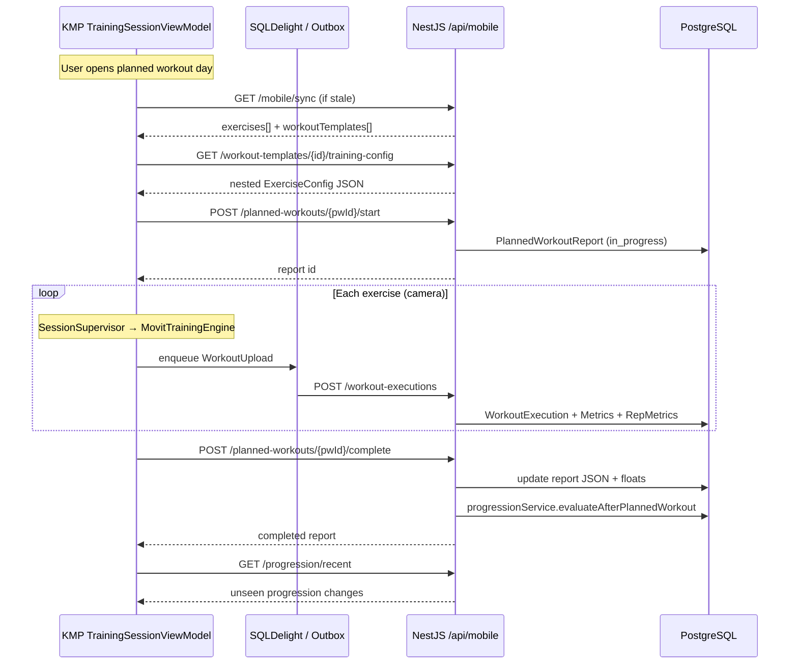

| | |
|---|---|
| **Status** | `ACTIVE` |
| **SSOT for** | Mobile training HTTP endpoints, DTOs, session lifecycle |
| **Code (backend)** | `backend/src/modules/workout-executions/`, `backend/src/modules/mobile-sync/`, `backend/src/modules/progression/` |
| **Code (KMP)** | `kmp-app/core/network/MovitMobileApi.kt`, `kmp-app/core/network/dto/TrainingApiDto.kt` |
| **Verified** | 2026-07-04 |

# Backend API — sessions & reports

All paths are under `/api/mobile/*` (KMP prepends base URL). Auth: `Authorization: Bearer <token>` via `verifyMobileToken()`.

Full route catalog: [API_ENDPOINTS.md](../../Contracts/API_ENDPOINTS.md) § Mobile Training.

---

## Endpoint summary

### Catalog & config

| Method | Path | Controller | Purpose |
|--------|------|------------|---------|
| GET | `/mobile/sync` | `MobileSyncController` | Incremental/full exercise + workout + program sync |
| GET | `/mobile/workout-templates` | `MobileWorkoutTemplatesController` | Published template list (Explore) |
| GET | `/mobile/workout-templates/:id/training-config` | `MobileWorkoutTemplatesController` | Full training config for one template |
| GET | `/mobile/workout-templates/:slug/audio-manifest` | `MobileWorkoutTemplatesController` | Cached voice clip manifest |
| GET | `/mobile/exercises/:slug/audio-manifest` | exercises mobile controller | Per-exercise audio manifest |

**Sync query params:** `updatedAfter` (ISO timestamp), `forceRefresh=true`. Unauthenticated sync returns 401 when token present but invalid; anonymous sync may return public catalog subset (see `mobile-sync.service.ts`).

### Planned workout lifecycle

| Method | Path | Controller | Notes |
|--------|------|------------|-------|
| POST | `/mobile/planned-workouts/:id/start` | `MobilePlannedWorkoutsController` | Creates/updates `PlannedWorkoutReport` (`in_progress`) |
| POST | `/mobile/planned-workouts/:id/complete` | `MobilePlannedWorkoutsController` | **Preferred** — finalize + trigger progression |
| POST | `/mobile/planned-workouts/:id/report` | `MobilePlannedWorkoutsController` | Legacy alias → `updatePlannedWorkoutReport` (no progression) |

### Per-exercise execution upload

| Method | Path | Controller | Notes |
|--------|------|------------|-------|
| POST | `/mobile/workout-executions` | `MobileWorkoutExecutionsController` | Single exercise camera run + metrics |
| POST | `/mobile/workout-executions/explore` | `MobileWorkoutExecutionsController` | Link multi-exercise explore block |
| GET | `/mobile/workout-executions` | same | History list (KMP not wired) |
| GET | `/mobile/workout-executions/stats` | same | Home stats (deferred in KMP) |
| GET | `/mobile/workout-executions/:exerciseId` | same | Per-exercise history (deferred) |

### Progression (post-training)

| Method | Path | Controller | Purpose |
|--------|------|------------|---------|
| GET | `/mobile/progression/history` | `ProgressionController` | Full change log |
| GET | `/mobile/progression/recent` | `ProgressionController` | Unseen changes (notifications) |
| GET | `/mobile/progression/planned-workout/:id` | `ProgressionController` | Changes for one block |
| GET | `/mobile/progression/session/:sessionId` | `ProgressionController` | Legacy alias (`sessionId` = planned workout id) |
| POST | `/mobile/progression/mark-seen` | `ProgressionController` | Body: `{ ids: string[] }` |

---

## DTO reference

KMP types: `kmp-app/core/network/src/commonMain/kotlin/com/movit/core/network/dto/TrainingApiDto.kt`  
Backend types: `backend/src/modules/workout-executions/workout-executions.types.ts`

### Planned workout

**Start — `PlannedWorkoutStartRequestDto` / `PlannedWorkoutStartPayload`**

| Field | Type | Required |
|-------|------|----------|
| `programId` | string? | optional |
| `weekNumber` | int | yes |
| `dayNumber` | int | yes |
| `startedAt` | long (epoch ms)? | optional |

**Complete — `PlannedWorkoutCompleteRequestDto` / `PlannedWorkoutCompletePayload`**

| Field | Type | Notes |
|-------|------|-------|
| `completedAt` | long? | epoch ms |
| `totalDurationMs` | int? | block duration |
| `totalExercises`, `totalSets`, `completedSets`, `totalReps` | int? | rollups |
| `avgAccuracy`, `avgFormScore` | float? | 0–100 |
| `rpe` | int? | 1–10 user exertion |
| `report` | JsonElement / object | nested `exerciseReports[]`, snapshots |

**Response — `PlannedWorkoutReportDto`:** mirrors DB `PlannedWorkoutReport` + `status` (`in_progress` | `completed`).

### Workout execution upload

**`WorkoutExecutionUploadRequestDto` / `WorkoutExecutionUploadPayload`**

| Field | Type | Required |
|-------|------|----------|
| `id` | UUID string | yes (client-generated) |
| `exerciseId` | string | yes (id or slug) |
| `timestamp` | long | yes |
| `durationMs` | int | yes |
| `totalReps`, `countedReps`, `invalidReps` | int | yes |
| `executionMetrics` | `ExecutionMetricsDto` | yes (mobile) |
| `repMetrics` | `RepMetricsDataDto[]` | optional |
| `weightKg`, `weightUnit` | float?, string | optional |
| `context` | string enum | `program`, `free`, `explore_workout`, `quick_start`, … |
| `workoutGroupId`, `workoutTemplateId` | string? | grouping |
| `legacyReport` | JSON | optional PostTrainingReport |

**`ExecutionMetricsDto`** (API floats 0–100): `avgRom`, `avgSymmetry`, `avgStability`, `avgFormScore`, `avgAlignmentAccuracy`, `avgTempo[]`, `totalTUT`, load fields (`totalVolume`, `est1RM`, …).

**`RepMetricsDataDto`:** `num`, `durationMs`, `worstState` (0–4), `score`, `side`, nested `metrics` (`rom`, `formScore`, …).

### Explore block

**`ExploreWorkoutUploadRequestDto`:** `workoutGroupId`, `context`, `executions[]` (same shape as single upload). Backend links existing executions by id or full-saves if sync not yet arrived.

---

## Session lifecycle (camera program workout)

### Free / explore path

- No `planned-workouts/start` unless user is in a program block.
- Each exercise still `POST /workout-executions` with `context=free` or `explore_workout`.
- Optional `POST /workout-executions/explore` groups executions under `workoutGroupId`.

---

## Backend service behaviors

### `saveWorkoutExecution` (`workout-executions.service.ts`)

1. Resolve exercise by id **or slug**
2. Transaction: upsert `WorkoutExecution`, replace metrics rows
3. `updateUserStats(userId)` unless bulk explore save
4. Return mapped response with metrics (read divides some fields by 10)

### `completePlannedWorkoutReport`

1. `normalizePlannedWorkoutReport()` — aggregate exercise snapshots, form score
2. Set `status=completed`, persist JSON `report` column
3. **Progression V2:** if `programId` + active `userProgram`, `progressionService.evaluateAfterPlannedWorkout()` for exercises in planned workout items
4. Non-fatal: progression errors logged, completion still succeeds

### `startPlannedWorkoutReport`

Creates report row with week/day; idempotent per user + planned workout.

---

## KMP client mapping

| Concern | File |
|---------|------|
| HTTP calls | `MovitMobileApi.kt` |
| Upload mapping (÷10) | `WorkoutUploadMapper.kt` |
| Offline queue | `TrainingSessionWriteCoordinator.kt`, `OutboxDispatcher` |
| Contract tests | `MovitMobileApiContractTest.kt`, `MobileApiContractRegistry.kt` |

---

## Error responses

Standard envelope: `{ success: false, error: string }` with HTTP 400/401/500.

Common validation:

- Executions: `"Missing required fields: id, exerciseId, executionMetrics"`
- Planned start: `"Missing required fields: weekNumber, dayNumber"`

---

## Related docs

- [12-Mobile-API-Contract.md](12-Mobile-API-Contract.md) — detailed contract + outbox policy
- [03-Backend-Metrics-And-Reports.md](03-Backend-Metrics-And-Reports.md) — metric scales
- [13-Data-Sync-In-Mobile.md](13-Data-Sync-In-Mobile.md) — offline sync (if present)
- [14-Report-And-Extracted-Metrics.md](14-Report-And-Extracted-Metrics.md) — report JSON shape
