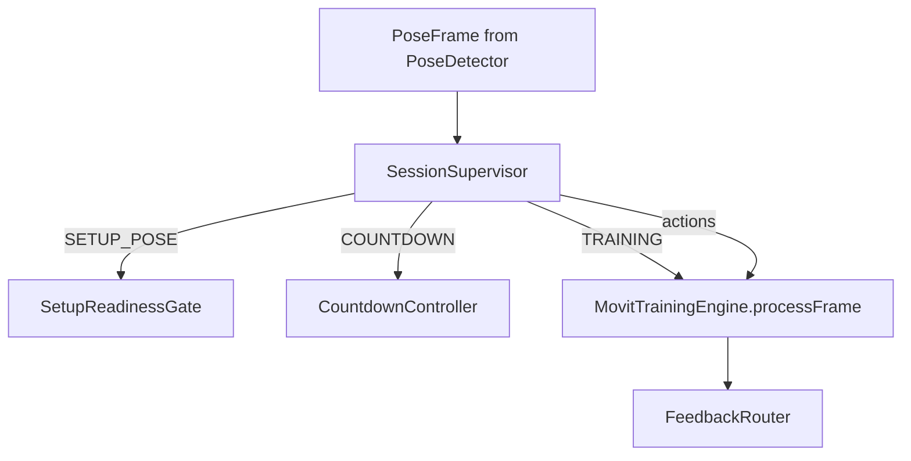

| | |
|---|---|
| **Status** | `ACTIVE` |
| **SSOT for** | MovitTrainingEngine, SessionSupervisor, per-frame pipeline |
| **Code** | `kmp-app/core/training-engine/`, `kmp-app/feature/training/` |
| **Verified** | 2026-07-04 |

# Training engine core

On-device SSOT for camera training evaluation. Parent overview: [training-engine.md](../training-engine.md).

---

## Module layout

```
kmp-app/
├── core/
│   ├── pose-capture/          # Camera → MediaPipe → PoseFrame
│   └── training-engine/       # Engine (this doc)
│       └── src/commonMain/kotlin/com/movit/core/training/
│           ├── session/       # MovitTrainingEngine, SessionSupervisor, orchestration
│           ├── engine/        # PhaseStateMachine, RepCounter, pipelines
│           ├── position/      # PositionValidator (NOT arc/line UI)
│           ├── bilateral/     # BilateralController
│           ├── visibility/    # VisibilityMonitor
│           ├── feedback/      # FeedbackScheduler, models
│           ├── config/        # ExerciseConfig deserialization
│           ├── geometry/      # Angles, virtual landmarks
│           ├── journal/       # MotionRecorder → WorkoutUpload
│           └── report/        # Session report builders
└── feature/
    └── training/              # TrainingSessionViewModel, UI
```

---

## Session stack

`TrainingSessionViewModel` (`feature/training/TrainingSessionViewModel.kt`) wires production flow:



| Component | Package | Role |
|-----------|---------|------|
| `SessionSupervisor` | `session` | Run state SSOT; NoPose auto-pause (4s) |
| `SetupReadinessGate` | `session` | Pre-run scene + start pose (not used during reps) |
| `CountdownController` | `session` | 3-2-1; frozen on bad pose |
| `MovitTrainingEngine` | `session` | Per-frame evaluation when supervisor allows |
| `FeedbackRouter` | `engine.feedback` | Voice/haptic delivery |

---

## SessionSupervisor states

**File:** `session/SessionRunState.kt`, `session/SessionSupervisor.kt`

```
IDLE → SETUP_POSE → COUNTDOWN → TRAINING ⇄ PAUSED / AUTO_PAUSED
                              ↘ COMPLETED
TRAINING → RESUME_SETUP → RESUME_COUNTDOWN → TRAINING (preserves rep count)
```

| State | Engine frames? | Notes |
|-------|----------------|-------|
| `SETUP_POSE` | No | SetupReadinessGate drives UI/voice |
| `COUNTDOWN` | No | Countdown ticks; invalid pose freezes |
| `TRAINING` | Yes | `SupervisorAction.ProcessFrame` |
| `PAUSED` / `AUTO_PAUSED` | No | Manual vs visibility/NoPose |
| `COMPLETED` | No | Summary + upload |

Signals: `SupervisorSignal` (UI, pose, engine events) → `SupervisorAction` (start engine, pause, show setup, …).

NoPose timing: grace 1s → warn 2s → auto-pause 4s.

---

## MovitTrainingEngine

**File:** `session/MovitTrainingEngine.kt`

Constructed per exercise from `ExerciseConfig` + optional `targetRepsOverride`, `sessionWeightKg`, `DeviceTiltPort`.

### Internal collaborators

| Component | Purpose |
|-----------|---------|
| `SessionOrchestrator` | Clock, pause, hold timer host |
| `FrameIngressGate` | Drop frame if prior still processing |
| `JointAngleTracker` | Tracked joint angles; respects bilateral flip |
| `AngleSmoother` | Rolling window (`TimingPolicy.smoothingWindowSize`, default 3) |
| `PhaseStateMachine` | UP_DOWN or HOLD phases |
| `StartPoseGate` | In-run start-position band check |
| `PositionValidator` | Configured position checks |
| `FramePipelineExecutor` | Ordered evaluation pipeline |
| `RepCounter` + `RepCompletionCoordinator` | Scoring + deferred rep completion |
| `BilateralController` | Side flip per config |
| `VisibilityMonitor` | Low visibility → pause path |
| `HoldExerciseCoordinator` | Hold timer FSM (HOLD method only) |
| `FrameFeedbackEmitter` | Throttled feedback candidates |

### `processFrame` order

1. Guard: not running / paused → return
2. No landmarks → presence bridge events
3. `FrameIngressGate.tryAcquire()` — drop if busy
4. Mirror landmarks if front camera
5. Extract angles (`JointAngleTracker`)
6. `VisibilityMonitor` — may short-circuit
7. **`FramePipelineExecutor.runMainPath`** (see below)
8. Feedback emission (throttled state messages)
9. `repCounter.updateJointEvals` when phase tracks quality
10. Joint errors → `repCounter.addError`
11. Position errors/warnings/tips → rep scoring inputs
12. **HOLD:** `HoldExerciseCoordinator.updateHoldTimer(phase == COUNT)`
13. **UP_DOWN:** `RepCompletionCoordinator.consumeIfPendingAndHandle()`

`stop()` → `ExerciseWorkoutSummary` via `ExerciseWorkoutSummaryBuilder`.

---

## FramePipelineExecutor (main path)

**File:** `engine/pipeline/FramePipelineExecutor.kt`

```
raw angles
  → AngleSmoother.smooth
  → StartPoseGate.isInStartPosition (in-run)
  → PhaseStateMachine.update
  → PositionValidator.validate (optional)
  → FrameEvaluationPipeline → JointEvaluator per joint
```

Returns `MainPathFrameResult` with phase, joint evals, position result, start-pose flag.

---

## HOLD vs UP_DOWN

| Aspect | UP_DOWN | HOLD |
|--------|---------|------|
| `CountingMethod` | `UP_DOWN` | `HOLD` |
| PSM phases | IDLE→START→DOWN→BOTTOM→UP→START | IDLE→COUNT |
| Rep trigger | Phase UP→START + timing gates | Hold timer completion |
| `RepCounter` | Zone peak scoring per rep | `calculateHoldScore` over state time |
| Coordinator | `RepCompletionCoordinator` | `HoldExerciseCoordinator` |
| Target | `targetReps` | `repCountingConfig.duration` (seconds) |

`ExerciseConfig.isHoldExercise()` ⇔ `countingMethod == HOLD`.

---

## Key files (quick index)

| File | Role |
|------|------|
| `session/MovitTrainingEngine.kt` | Engine entry, `processFrame`, `stop` |
| `session/SessionSupervisor.kt` | Run state machine |
| `session/SessionOrchestrator.kt` | Pause/hold/session clock |
| `session/HoldExerciseCoordinator.kt` | Hold timer logic |
| `session/TrainingGateFactory.kt` | Builds PositionValidator from config |
| `engine/PhaseStateMachine.kt` | Phase transitions + rep cycle gates |
| `engine/RepCounter.kt` | Rep scoring and counts |
| `engine/RepCompletionCoordinator.kt` | PSM completion → `completeRep()` |
| `engine/pipeline/FramePipelineExecutor.kt` | Frame evaluation order |
| `engine/JointEvaluator.kt` | State ranges → JointState |
| `position/PositionValidator.kt` | Landmark position checks |
| `bilateral/BilateralController.kt` | Active side / mirror |
| `visibility/VisibilityMonitor.kt` | Joint visibility policy |
| `journal/MotionRecorder.kt` | Persist upload journal |
| `report/MovitSessionReport.kt` | Planned workout report DTO |

---

## Feature layer integration

| File | Role |
|------|------|
| `feature/training/TrainingSessionViewModel.kt` | Supervisor actions, engine lifecycle, upload |
| `feature/training/MovitTrainingRoutes.kt` | Navigation + DI hooks |
| `feature/training/TrainingSessionScreen.kt` | Camera UI shell |

Pose boundary: `core/training-engine/.../boundary/PoseDetector.*.kt` delegates to `core/pose-capture/`.

---

## Related docs

- [05-Rep-Counting.md](05-Rep-Counting.md) — PSM + RepCounter detail
- [06-Arc-And-Line-Checks.md](06-Arc-And-Line-Checks.md) — ROM overlay vs position checks
- [08-Engine-Settings.md](08-Engine-Settings.md) — preferences wiring
- [training-engine.md](../training-engine.md) — canonical engine doc
