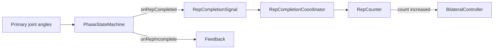

| | |
|---|---|
| **Status** | `ACTIVE` |
| **SSOT for** | Rep counting gates, scoring, bilateral behavior |
| **Code** | `kmp-app/core/training-engine/src/commonMain/kotlin/com/movit/core/training/engine/` |
| **Verified** | 2026-07-04 |

# Rep counting

Rep counting is a **two-stage** system: `PhaseStateMachine` (PSM) decides *when* a rep cycle completes; `RepCounter` decides *how* it scores and whether it counts.

---

## Architecture

---

## PhaseStateMachine gates

**File:** `engine/PhaseStateMachine.kt`

### UP_DOWN cycle

Phases: `IDLE → START → DOWN → BOTTOM → UP → START` (rep complete on `UP → START`).

| Gate | Condition | Result |
|------|-----------|--------|
| Enter START | All visible primaries in up range | From IDLE or return |
| Leave START | All left up range (below effective min − hysteresis) | → DOWN, start movement timer |
| Reach BOTTOM | All entered down range (≤ down effective max) | From DOWN |
| Complete rep | `UP → START` transition | Timing validation |
| Partial depth | `DOWN → START` without bottom | `NO_TARGET_DEPTH` incomplete |
| Partial return | `UP → BOTTOM` | `NO_FULL_RETURN` incomplete |
| Too fast | movement &lt; `minRepIntervalMs` | `TOO_FAST` |
| Too slow | movement &gt; `maxRepIntervalMs` | `TOO_SLOW` |
| Min phase duration | Any non-completion transition &lt; `minPhaseDurationMs` | Transition rejected |

**Strict vs legacy:** If per-joint `PhaseJointConfig` has up/down ranges → `updateUpDownStrict` (all visible joints must agree). Else `updateUpDownLegacy` uses min/max across angles.

**Hysteresis:** `stabilityPolicy.phaseHysteresisDegrees` (default 3°) on range exits.

### HOLD cycle

Phases: `IDLE → COUNT` when all hold-range joints in band; exit to `IDLE` when any leaves.

Rep completion is **not** PSM-driven for hold — `HoldExerciseCoordinator` calls `repCounter.completeRep()` on timer success.

### Config sources

| Parameter | Source |
|-----------|--------|
| `minRepIntervalMs`, `maxRepIntervalMs`, `minPhaseDurationMs` | `ExerciseConfig.phaseTimingConfig()` |
| Primary joint ranges | `exerciseConfig.primaryPhaseJointConfigs(poseVariantIndex)` |
| `countingMethod` | `ExerciseConfig.countingMethod` |

---

## RepCounter scoring

**File:** `engine/RepCounter.kt`

### Per-rep accumulation (UP_DOWN)

During a rep cycle, `updateJointEvals()` tracks:

- **Primary joints:** best quality per `UP_ZONE` / `DOWN_ZONE` via `PrimaryRepZoneTracker`
- **Secondary joints:** worst state seen
- **Position errors:** `addPositionError` (ERROR severity) — penalizes score, can uncount
- **Warnings/tips:** warning IDs tracked; −6 per warning at completion

### `completeRep()` outcome

1. **Hold path:** `ScoreCalculator.calculateHoldScore(stateTimeTracking)` — invalidation if poor hold quality
2. **Rep path:** `ScoreCalculator.calculateRepScore(accumulated, primaryJoints)`
3. Apply position penalties: −15 per position error, −6 per warning
4. Position errors force `isCounted = false` (unless already invalidated)
5. Emit `RepResult` with `worstState`, `phaseTimings`, errors

### Count buckets

| Field | Meaning |
|-------|---------|
| `count` | Total completed cycles |
| `countedCount` | Scored as valid reps |
| `uncountedCount` | Completed but not counted (form) |
| `invalidatedCount` | DANGER / invalid states |

`onTargetReached` when `count >= targetReps`.

---

## Thresholds & states

**Joint states** (priority order): `PERFECT < NORMAL < PAD < WARNING < DANGER < TRANSITION`

`EngineStateConfig.isRepCounted(state)` / `invalidatesRep(state)` govern fallback when no zone data.

**Rep incomplete reasons** (`RepIncompleteReason`): `NO_TARGET_DEPTH`, `NO_FULL_RETURN`, `TOO_FAST`, `TOO_SLOW` — routed to feedback in ViewModel.

---

## Bilateral

**File:** `bilateral/BilateralController.kt`

| `switchMode` | Behavior |
|--------------|----------|
| `EVERY_REP` | Flip side each counted rep |
| `AFTER_ALL_REPS` | Flip after `targetReps` on one side |
| Custom `switchEvery` | Flip every N reps |

`isFlipped` mirrors joint angle extraction and position check landmark mirroring (XOR with front camera).

`RepMetricsData.side` records active side on upload.

**Target reps:** For `AFTER_ALL_REPS`, engine may use `perSideTarget * 2` as session target.

---

## Edge cases

| Scenario | Behavior |
|----------|----------|
| Joint temporarily invisible | PSM uses `visibleJoints` subset; empty → phase unchanged |
| Brief visibility loss | `VisibilityMonitor` may pause before rep completes |
| `repCountedThisCycle` flag | Prevents double PSM completion signals |
| `minRepIntervalMs` on hold | Second hold segment ignored if too soon after last |
| Position error mid-rep | Accumulated; applied at `completeRep` |
| Phase transition too fast | `minPhaseDurationMs` blocks spurious transitions |
| Engine pause during UP | Rep cycle aborted; no completion until resume |
| Bilateral + front camera | Landmark mirroring XOR in PositionValidator |

---

## Tests

| Test | Coverage |
|------|----------|
| `PhaseStateMachineTest.kt` | Phase transitions, incomplete reasons |
| `MovitTrainingEngineParityTest.kt` | End-to-end rep counts on fixtures |
| `BilateralControllerParityTest.kt` | Side switching |
| `RepIncompleteFeedbackTest.kt` | Feedback on incomplete reps |

Fixtures: `commonTest/resources/fixtures/parity/*.json`

---

## Related docs

- [04-Training-Engine-Core.md](04-Training-Engine-Core.md) — pipeline context
- [06-Arc-And-Line-Checks.md](06-Arc-And-Line-Checks.md) — ROM display vs validation
- [10-Voice-Feedback.md](10-Voice-Feedback.md) — rep incomplete audio
