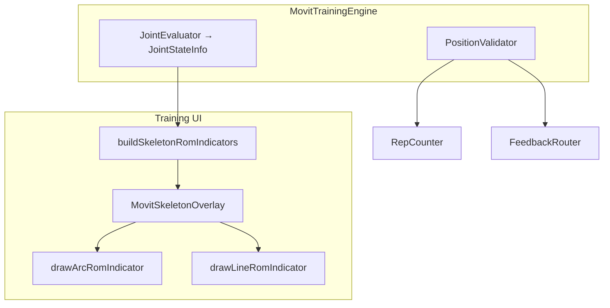
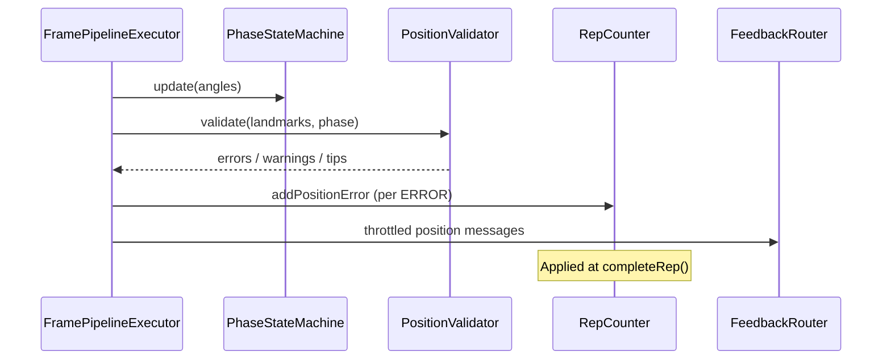

| | |
|---|---|
| **Status** | `ACTIVE` |
| **SSOT for** | Arc/Line ROM overlay vs engine position validation |
| **Code (UI)** | `kmp-app/feature/training/TrainingRomIndicatorMapper.kt`, `kmp-app/core/designsystem/.../MovitSkeletonOverlay.kt` |
| **Code (engine)** | `kmp-app/core/training-engine/.../position/PositionValidator.kt` |
| **Verified** | 2026-07-04 |

# Arc and line checks — ROM overlay vs position validation

> **CRITICAL distinction:** **Arc** and **Line** are **visual ROM indicators only** (skeleton overlay UX). They do **not** gate reps, score form, or replace config **position checks**. Engine validation for landmark/world rules lives in **`PositionValidator`**.

---

## Two systems side-by-side

| | Arc / Line ROM overlay | Position checks (engine) |
|--|------------------------|-------------------------|
| **Purpose** | Show joint angle + quality color on camera preview | Enforce form rules (alignment, distance, tilt, …) |
| **Affects rep count?** | No | Yes — errors can uncount rep |
| **Data source** | `JointStateInfo` from engine eval | `PositionCheck` config + landmarks |
| **User setting** | `indicatorType`: `arc` \| `line` | Exercise JSON only |
| **Package** | `designsystem` + `feature/training` | `core/training-engine/position` |



---

## Arc / Line — UI ROM overlay

### Types

**`SkeletonRomIndicatorStyle`** (`designsystem/components/MovitSkeletonOverlay.kt`):

| Style | Visual | Best for |
|-------|--------|----------|
| `ARC` | Curved ROM gauge at joint center | Default; knees/elbows |
| `LINE` | Linear track with moving indicator | User preference / legacy parity |

**`SkeletonRomIndicator`** fields: anchor points (proximal/joint/distal), `currentAngleDeg`, `rangeMinDeg`/`rangeMaxDeg`, `upStateRanges`/`downStateRanges`, `currentState` → color.

### Mapping engine → UI

**File:** `feature/training/TrainingRomIndicatorMapper.kt`

```kotlin
fun buildSkeletonRomIndicators(
    landmarks: List<SkeletonLandmarkPoint>?,
    jointStateInfos: Map<String, JointStateInfo>,
    indicatorType: String = "arc",  // "line" | "arc"
): List<SkeletonRomIndicator>
```

Rules:

- Only **primary** joints with up/down (or hold) state ranges
- Skips dimmed bilateral joints
- Supports elbow/knee anchor triples (hip-knee-ankle, shoulder-elbow-wrist)
- `invertAngles` from `JointStateInfo.invertIndicator`
- Hold exercises: `isHoldRange` when up == down ranges

### Rendering

**`MovitSkeletonOverlay`** (`designsystem`):

- `drawArcRomIndicator` — radius `DEFAULT_ARC_RADIUS_DP` (45dp), state-colored arc sweep
- `drawLineRomIndicator` — smoothed line track (`LINE_SMOOTHING_FACTOR`, center angle 90°)

Colors from `SkeletonRomGeometry.stateColorArgb(PERFECT|NORMAL|PAD|WARNING|DANGER)`.

### Composition site

**`TrainingSessionScreen.kt`** builds `romIndicators` and passes to `MovitSkeletonOverlay` over camera preview. Controlled by `MovitTrainingPreferencesState.indicatorType`.

**Not** used for: rep gates, position check pass/fail, backend metrics.

---

## Position checks — engine validation

### Config type

**`PositionCheck`** in exercise JSON (`config/ExerciseConfigTypes.kt`):

| Field | Role |
|-------|------|
| `id` | Stable check id (metrics + feedback) |
| `type` | `PositionCheckType` (distance, angle, alignment, …) |
| `landmarks` | `LandmarkGroup` primary/secondary |
| `condition` | Operator + threshold |
| `phases` | Active phases (`top`, `bottom`, `count`, `all`, …) |
| `severity` | ERROR / WARNING / TIP |
| `minErrorFrames` | Debounce (default 3 frames) |

Built from DB via `json-builder.ts` → `positionChecks[]` on pose variant.

### PositionValidator flow

**File:** `position/PositionValidator.kt`

```
validate(landmarks, currentPhase, isBilateralFlipped, isFrontCamera)
  1. Tilt-correct landmarks (DeviceTiltPort)
  2. PoseSceneDetector → live scene (region/posture/direction)
  3. Scene axis warnings vs expectation
  4. For each active check in current phase:
       - Mirror landmarks if bilateral XOR front camera
       - Evaluate threshold (camera-aware axis)
       - Frame counter → ERROR/WARNING/TIP after minErrorFrames
  5. Return PositionValidationResult(errors, warnings, tips, debugChecks)
```

**Scene locking:** First valid frame can lock scene for stable axis selection; warnings still use live detection.

### Engine consumption

**`FramePipelineExecutor`** calls validator after PSM update.

**`MovitTrainingEngine`** routes results to:

- `repCounter.addPositionError` / `addPositionWarning` / `addPositionTip`
- `FrameFeedbackEmitter` → `FeedbackRouter`

Position errors affect **scoring** (−15 each, uncount); warnings −6 penalty.

### Relation to joint state ranges

| Mechanism | Measures |
|-----------|----------|
| `JointEvaluator` + state ranges | **Angle quality** vs PERFECT/PAD/WARNING bands |
| `PositionValidator` | **Geometric** rules between landmarks / world axes |

Both can fire feedback; only position **errors** force uncounted reps.

---

## Validation flow (engine-only)



---

## Common confusion points

| Misconception | Reality |
|---------------|---------|
| "Line check failed" | Line style is cosmetic; check `PositionValidator` debug or `positionErrors` on `RepResult` |
| Arc color red | Joint **angle state** (JointEvaluator), not a separate "arc check" |
| Setup pose panel | Uses `SetupReadinessGate` + scene axes — separate from Arc/Line |
| Backend `positionChecks` in JSON | Consumed only on mobile engine, not server |

---

## Related docs

- [Positions-Check-Concept.md](../Positions-Check-Concept.md) — product concept
- [05-Rep-Counting.md](05-Rep-Counting.md) — position error scoring
- [09-Camera-Training-UI-UX.md](09-Camera-Training-UI-UX.md) — overlay composition
- [08-Engine-Settings.md](08-Engine-Settings.md) — `indicatorType` preference
