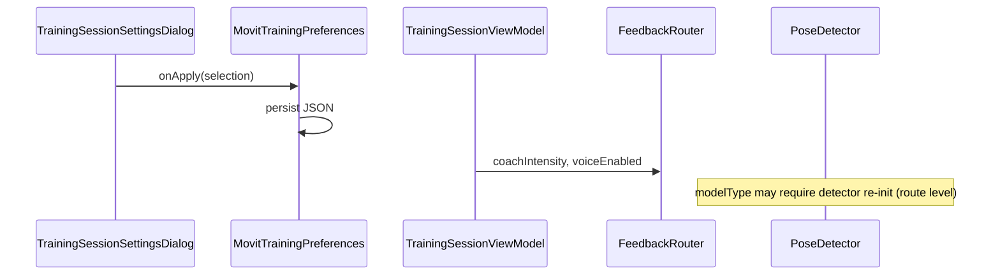

| | |
|---|---|
| **Status** | `ACTIVE` |
| **SSOT for** | Training preferences and per-exercise config wiring |
| **Code** | `kmp-app/core/data/.../MovitTrainingPreferences.kt`, `kmp-app/core/training-engine/.../config/` |
| **Verified** | 2026-07-04 |

# Engine settings

Settings split into **user preferences** (cross-session) and **per-exercise config** (from server JSON). This doc tracks what is wired into the live engine vs stored only.

---

## MovitTrainingPreferences

**File:** `core/data/src/commonMain/kotlin/com/movit/core/data/preferences/MovitTrainingPreferences.kt`

Persisted via `MovitLocalStore` key `TRAINING_PREFERENCES_JSON`.

### State shape

```kotlin
data class MovitTrainingPreferencesState(
    val modelType: String = "full",           // "full" | "heavy"
    val indicatorType: String = "arc",        // "arc" | "line"
    val voiceFeedbackEnabled: Boolean = true,
    val coachIntensity: String = "standard",  // calm | standard | strict
    val smoothingPreset: String = "custom",
    val smoothingMinCutoff: Float = 1.0f,
    val smoothingBeta: Float = 1.5f,
    val useLegacySmoothing: Boolean = false,
    val legacySmoothingAlpha: Float = 1.0f,
    val trainingDisplayMode: String = "beginner", // beginner | advanced
)
```

### Wired into runtime

| Preference | Consumer | Effect |
|------------|----------|--------|
| `indicatorType` | `TrainingSessionScreen` → `buildSkeletonRomIndicators` | Arc vs line ROM overlay |
| `voiceFeedbackEnabled` | `FeedbackRouter.voiceEnabled` | Gates `allowVoice` on signals |
| `coachIntensity` | `FeedbackRouter` → `FeedbackScheduler` | Cooldowns, max repeats, audible gap |
| `modelType` | Platform pose detector init (`MovitTrainingRoutes`) | MediaPipe model variant |
| `trainingDisplayMode` | UI density (where referenced) | Beginner vs advanced chrome |

Applied on session start from `MovitTrainingRoutes` / settings dialog `onApplyTrainingSettings`.

### NOT wired (gaps)

| Preference | Status |
|------------|--------|
| `smoothingPreset` | **Not read** by engine or pose-capture at runtime |
| `smoothingMinCutoff`, `smoothingBeta` | **Not wired** — no setter on `MovitTrainingPreferences` |
| `useLegacySmoothing`, `legacySmoothingAlpha` | **Not wired** |

**What actually smooths today:**

| Layer | Implementation | Config |
|-------|----------------|--------|
| Landmarks | `PoseLandmarkSmoother` (One-Euro) in `pose-capture` | Fixed params in platform detectors |
| Joint angles | `AngleSmoother` in engine | `TimingPolicy.smoothingWindowSize` (default 3) — **not** user preference |
| Device tilt | `DeviceTiltPort` | 120ms tau on Android/iOS |

User smoothing prefs are legacy carry-over from Android SettingsManager — persisted but inactive.

---

## Per-exercise config (ExerciseConfig)

**Source:** Server JSON via sync / `training-config` → `ExerciseConfig` Kotlin models (`config/ExerciseConfigModels.kt`).

| Config block | Engine use |
|--------------|------------|
| `countingMethod` | UP_DOWN vs HOLD |
| `poseVariants[]` | Joints, messages, position checks |
| `trackedJoints` | Angle extraction, visibility |
| `repCountingConfig` | Targets, duration (hold), min rep interval overrides |
| `phaseTiming` | PSM min/max phase durations |
| `bilateralConfig` | `BilateralController` |
| `feedbackMessages` | `FeedbackRouter` + random motivation |
| `reportMetrics` | Which metrics to extract for upload |
| `supportsWeight` / weight fields | Session weight + load metrics |

**Pose variant index:** `MovitTrainingEngine(poseVariantIndex)` — UI can select variant when multiple exist.

### Stability / timing policies

Constructed inside `MovitTrainingEngine` with defaults:

- `StabilityPolicy.default()` — phase hysteresis degrees
- `TimingPolicy.default()` — smoothing window, feedback cooldowns

Not exposed in training settings UI.

---

## Session-level overrides

| Override | Set by | Purpose |
|----------|--------|---------|
| `targetRepsOverride` | Workout flow / prescription | Planned reps ≠ config default |
| `sessionWeightKg` | User weight picker | Load metrics |
| `poseVariantIndex` | Flow args | Alternate camera angles |

---

## Settings apply flow



---

## Related docs

- [11-Training-Settings-UI.md](11-Training-Settings-UI.md) — dialog controls
- [06-Arc-And-Line-Checks.md](06-Arc-And-Line-Checks.md) — indicatorType
- [10-Voice-Feedback.md](10-Voice-Feedback.md) — coach intensity
- [Exercise-JSON-Schema.md](../../Contracts/Exercise-JSON-Schema.md) — server config schema
