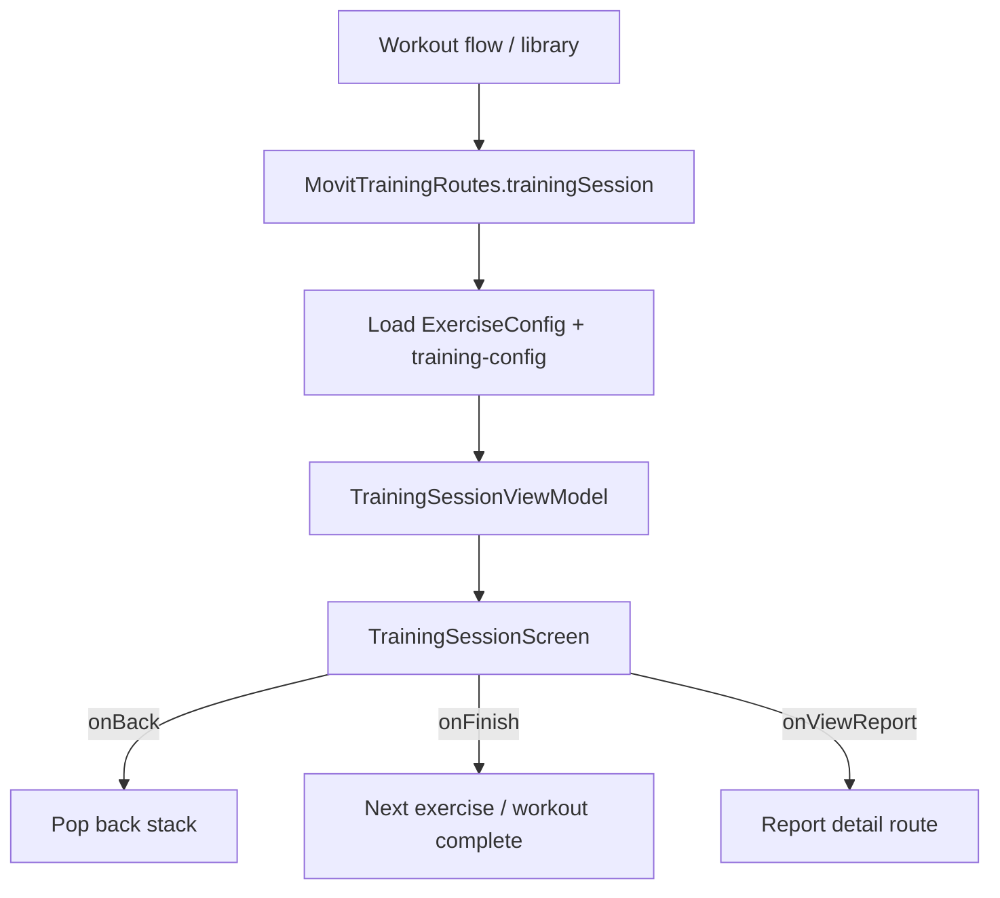

| | |
|---|---|
| **Status** | `ACTIVE` |
| **SSOT for** | Camera training screen layout, states, navigation |
| **Code** | `kmp-app/feature/training/` |
| **Verified** | 2026-07-04 |

# Camera training UI/UX

Production camera training UI lives in **`feature/training`** (Compose Multiplatform). The screen is a thin shell: camera preview slot + skeleton overlay + state chrome; logic is in `TrainingSessionViewModel`.

---

## Screen layout

**File:** `TrainingSessionScreen.kt`

```
┌─────────────────────────────────────────┐
│ TopChrome: Back | Exercise name | Flip | Settings │
├─────────────────────────────────────────┤
│                                         │
│  cameraSlot() — platform camera preview │
│  MovitSkeletonOverlay (landmarks + ROM) │
│  [camera switching dim overlay]         │
│                                         │
│  TrainingSessionStateOverlay (center)   │
│    - RestPanel OR WorkoutCompletePanel  │
│                                         │
├─────────────────────────────────────────┤
│ TrainingSessionLiveBottomBar (camera)   │
│   status | pause/stop + timer | reps    │
│ OR TrainingSessionNonCameraControls     │
└─────────────────────────────────────────┘
```

### Layers (bottom → top)

| Layer | Component | When visible |
|-------|-----------|--------------|
| Camera | `cameraSlot` lambda | `state.requiresCamera()` |
| Skeleton | `MovitSkeletonOverlay` | Camera + landmarks |
| ROM | `romIndicators` from mapper | Primary joints |
| Switching mask | Semi-transparent + spinner | `isCameraSwitching` |
| State overlay | Rest / complete panels | Rest or `COMPLETED` |
| Top chrome | Back, title, flip, settings | Always (success path) |
| Bottom bar | Live metrics + pause/stop | Camera path |

---

## Run states → UI mapping

**Source:** `SessionRunState` via `TrainingSessionUiState.runState`

| Run state | Center overlay | Bottom bar status | Bottom action |
|-----------|----------------|-------------------|---------------|
| `IDLE` | — | Ready | Start (if can resume) |
| `SETUP_POSE` | *(not composed — gap)* | Setup phase text | Start when ready |
| `COUNTDOWN` | *(not composed — gap)* | Countdown digit | Frozen chip if paused |
| `TRAINING` | — | Localized phase label | Stop → pause |
| `PAUSED` / `AUTO_PAUSED` | — | Frozen / paused | Resume |
| `RESUME_SETUP` / `RESUME_COUNTDOWN` | — | Setup / countdown | Resume flow |
| `COMPLETED` | `WorkoutCompletePanel` | Completed | Non-camera finish |
| Rest | `RestPanel` | — | Skip rest (non-camera bar) |

`liveStatusValue()` and `liveProgressMetric()` drive bottom bar text (reps `n/target` or hold duration).

---

## Navigation flow

**File:** `MovitTrainingRoutes.kt`



Route args typically include: `exerciseId`, `workoutTemplateId`, `plannedWorkoutId`, `targetReps`, program context.

**Settings:** Gear icon → `TrainingSessionSettingsDialog` → `onApplyTrainingSettings` updates preferences + `FeedbackRouter`.

---

## Supporting composables

| File | Components |
|------|------------|
| `TrainingSessionPanels.kt` | `SetupPosePanel`, `CountdownOverlay`, `RestPanel`, `WorkoutCompletePanel` |
| `TrainingSessionSettingsDialog.kt` | In-session settings modal |
| `TrainingRomIndicatorMapper.kt` | Engine state → ROM indicators |
| `designsystem/MovitSkeletonOverlay.kt` | Skeleton lines + arc/line ROM |
| `designsystem/VignetteEffect.kt` | Edge darkening for focus |

---

## UiState highlights

**`TrainingSessionUiState`** (ViewModel) feeds screen:

| Field | UI use |
|-------|--------|
| `landmarks`, `skeletonOverlayParity` | Overlay |
| `jointStateInfos` | ROM colors |
| `repCount`, `targetReps`, `holdStatus` | Progress metric |
| `phaseLabel`, `setupPhase` | Status text |
| `countdownValue` | Countdown display (bottom bar only today) |
| `elapsedLabel` | Timer on action button |
| `liveFormPercent` | Complete panel |
| `configUnavailable`, `errorMessage` | Error states |
| `isResting`, `workoutFlowPhase` | Rest UI |
| `reportDetailId`, `uploadNotice` | Post-session |

---

## Gaps (as-built)

### Panels exist but not composed on main screen

| Component | File | Expected UX | Current |
|-----------|------|-------------|---------|
| **`SetupPosePanel`** | `TrainingSessionPanels.kt` | Full setup guidance (axes chips, joint rows, reference image) during `SETUP_POSE` | **Not called** from `TrainingSessionScreen` — only bottom bar setup text |
| **`CountdownOverlay`** | `TrainingSessionPanels.kt` | Large 3-2-1 overlay | **Not composed** — countdown shown in bottom bar status only |
| **`VignetteEffect`** | `designsystem/VignetteEffect.kt` | Edge vignette during training | **Not composed** in training screen |

### Other UX gaps

| Gap | Notes |
|-----|-------|
| No on-screen feedback pills | By design — voice-first (`FeedbackScheduler` sets `showVisual = false`) |
| Setup voice only | `deliverSetupVoiceFeedback` in ViewModel; limited visual setup |
| Debug FPS | `debugFps` param exists but suppressed (`UNUSED_PARAMETER`) |
| Bilateral side hint | `showBilateralSideHint = false` on overlay |

---

## Error / offline paths

| Condition | UI |
|-----------|-----|
| `configUnavailable` | `MovitErrorState` — config missing |
| `errorMessage` | `MovitErrorState` with message |
| Upload pending | `uploadNotice` on complete panel |

---

## Related docs

- [06-Arc-And-Line-Checks.md](06-Arc-And-Line-Checks.md) — skeleton overlay
- [11-Training-Settings-UI.md](11-Training-Settings-UI.md) — settings dialog
- [10-Voice-Feedback.md](10-Voice-Feedback.md) — why no visual pills
- [04-Training-Engine-Core.md](04-Training-Engine-Core.md) — supervisor states
