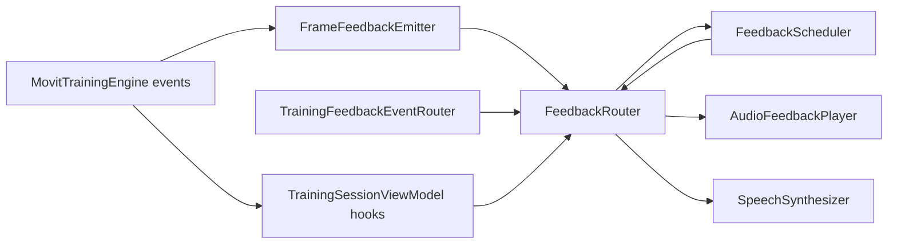

| | |
|---|---|
| **Status** | `ACTIVE` |
| **SSOT for** | Voice feedback pipeline, triggers, TTS vs cached audio |
| **Code** | `kmp-app/core/training-engine/.../feedback/`, `.../engine/feedback/` |
| **Verified** | 2026-07-04 |

# Voice feedback

Camera training uses a **voice-first** policy: live coaching is spoken (cached clips or TTS), not on-screen text pills during `TRAINING`.

---

## Pipeline overview



| Layer | Class | Role |
|-------|-------|------|
| Policy | `FeedbackScheduler` | Cooldowns, priority, repeat limits, voice-first channels |
| Routing | `FeedbackRouter` | Apply `voiceEnabled`, invoke platform playback |
| Event map | `TrainingFeedbackEventRouter` | Rep milestones, hold, target reached |
| Throttle | `FrameFeedbackEmitter` | Joint state / position message candidates |
| Setup | `SetupFeedbackSignals` + ViewModel | Pre-run voice hints |

---

## Voice-first policy

From `FeedbackScheduler.schedule()`:

```kotlin
val showVisual = false  // camera mode — no pills
val tone = FeedbackTone.NONE
// audible only when mode == CAMERA and severity rules pass
```

`FeedbackRouter.submit()` respects `voiceEnabled` — strips `allowVoice` when user disables voice in settings.

**Coach intensity** (`calm` | `standard` | `strict`) scales:

- Cooldown multipliers (0.75× – 1.6×)
- Max repeats per severity
- Minimum gap between audible messages (1.2s – 3s)

---

## FeedbackRouter delivery

**File:** `engine/feedback/FeedbackRouter.kt`

```
submit(signal) → scheduler.schedule → deliver(plan)
  VOICE + text:
    if audioPlayer != null → audioPlayer.play(signal)  // cached file
    else → speech.speak(text, priority)
  VOICE + empty text → audioPlayer.play(signal)  // clip-only
  haptics on CRITICAL/ERROR when plan allows
```

**TTS fallback (DS-6):** If prefetch missed a clip, `AudioFeedbackPlayer` fails over to `SpeechSynthesizer` with `FeedbackSignal.text` — same as legacy FeedbackManager.

**Prefetch:** Server `audio-manifest` endpoints list URLs; downloaded before session (`TrainingSessionAudioHooks`).

---

## Triggers catalog

### Lifecycle (`TrainingFeedbackEventRouter`)

| Trigger | Severity | Notes |
|---------|----------|-------|
| Rep completed (counted) | MOTIVATION streak | Every N reps → streak message |
| Rep count announcement | INFO/Audible | Every `repAudioInterval` (default 5) |
| Target reached | MOTIVATION | `forceAudible`, interrupt replace-lower |
| Hold grace started | WARNING | "Stay in position" |
| Hold resumed | SUCCESS | After brief exit |
| Hold completed | MOTIVATION | Duration substitution `{n}` |

### Engine frame (`FrameFeedbackEmitter` + joint/position)

| Source | Typical severity | Content |
|--------|------------------|---------|
| Joint state degradation | WARNING → ERROR | Localized state messages from config |
| Position check ERROR | ERROR | Check message text |
| Position WARNING/TIP | WARNING / TIP | Lower priority |
| Rep incomplete | ERROR | `NO_TARGET_DEPTH`, `TOO_FAST`, etc. |

### Setup (`TrainingSessionViewModel.deliverSetupVoiceFeedback`)

| Signal | When |
|--------|------|
| Scene axis hints | Region/posture/direction not OK |
| Start pose | Joint-specific setup messages |
| No pose during setup | Hint after supervisor flag |

Uses `feedbackRouter.submitSetup()` — dedicated cooldown group `setup`.

### Motivation

`MotivationalMessageCoordinator` + `tryDeliverRandomMessage()` — random encouraging lines when no active errors.

---

## FeedbackSignal model

**File:** `feedback/FeedbackModels.kt`

Key fields: `severity`, `text`, `messageCode`, `dedupeKey`, `cooldownGroup`, `interruptPolicy`, `allowVoice`, `forceAudible`, `kind` (SETUP, REP, HOLD, …).

Interrupt policies: `INTERRUPT`, `REPLACE_LOWER`, `WAIT_FOR_SLOT`, `SKIP_IF_BUSY`.

---

## TTS vs cached audio

| Path | When | Platform |
|------|------|----------|
| **Cached MP3** | `messageCode` maps to manifest file; `AudioFeedbackPlayer.play` | Android MediaPlayer / iOS AVAudioPlayer |
| **TTS** | No player, missing file, or text-only signal | `SpeechSynthesizer.android.kt` / `.ios.kt` |
| **Clip-only** | Empty `text`, filename in signal | Audio player |

Manifest sources:

- `GET /mobile/exercises/{slug}/audio-manifest`
- `GET /mobile/workout-templates/{slug}/audio-manifest`

System messages catalog seeded server-side (`system-messages-catalog.ts`) — codes align with exercise JSON assignments.

---

## Audio session (iOS)

`IosTrainingAudioSession.kt` configures ducking so TTS/clips mix with background audio.

---

## Tests

| Test | Coverage |
|------|----------|
| `FeedbackRouterTest.kt` | Delivery paths, voice gating |
| `FeedbackSchedulerParityTest.kt` | Cooldown parity vs legacy |
| `RepIncompleteFeedbackTest.kt` | Incomplete rep audio |

---

## Related docs

- [08-Engine-Settings.md](08-Engine-Settings.md) — voice + coach intensity prefs
- [11-Training-Settings-UI.md](11-Training-Settings-UI.md) — toggle in UI
- [09-Camera-Training-UI-UX.md](09-Camera-Training-UI-UX.md) — no visual pills by design
