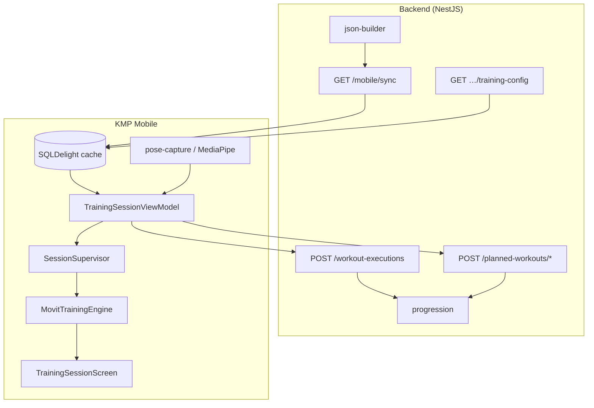

| | |
|---|---|
| **Status** | `ACTIVE` |
| **SSOT for** | Camera training engine documentation index |
| **Verified** | 2026-07-04 |

# Camera Training Engine — As Built

Code-first documentation for the **camera training** stack: backend config/ingest, KMP mobile API, on-device training engine, and production UI. Pose inference and rep scoring run **on mobile only**; the backend stores configs and uploaded metrics.

---

## Architecture

**Cross-links**

- Engine deep dive: [training-engine.md](../training-engine.md)
- REST catalog: [API_ENDPOINTS.md](../../Contracts/API_ENDPOINTS.md)
- Metrics framework: [Metrics-As-Built.md](../../Metrics/Metrics-As-Built.md)

---

## Document index

### Backend

| # | Doc | Summary |
|---|-----|---------|
| 01 | [01-Backend-Overview.md](01-Backend-Overview.md) | Backend role is config + ingest + aggregation only (no pose). Covers module map, Prisma models, `json-builder` pipeline, exercise JSON flow, dual metric stores, and legacy naming gaps. |
| 02 | [02-Backend-API-Sessions-Reports.md](02-Backend-API-Sessions-Reports.md) | All mobile training endpoints: sync, training-config, workout-executions POST, planned-workouts start/complete/report, progression. DTO tables and session lifecycle sequence diagram. |
| 03 | [03-Backend-Metrics-And-Reports.md](03-Backend-Metrics-And-Reports.md) | Int×10 relational metrics vs JSON report floats, `reports.service` aggregation, progression consumption via `intX10ToFloat`, and known ingest scale gaps. |

### Engine (on-device)

| # | Doc | Summary |
|---|-----|---------|
| 04 | [04-Training-Engine-Core.md](04-Training-Engine-Core.md) | `MovitTrainingEngine`, `SessionSupervisor`, `PhaseStateMachine`, per-frame pipeline, HOLD vs UP_DOWN, key files under `kmp-app/core/training-engine/`. |
| 05 | [05-Rep-Counting.md](05-Rep-Counting.md) | PSM rep-cycle gates, `RepCounter` scoring, thresholds, bilateral switching, and edge cases. |
| 06 | [06-Arc-And-Line-Checks.md](06-Arc-And-Line-Checks.md) | **Arc/Line = UI ROM overlay only**; position checks = `PositionValidator` engine path. Types and validation flow diagrams. |
| 07 | [07-Android-iOS-Engine-Parity.md](07-Android-iOS-Engine-Parity.md) | ~100% commonMain engine, 8+8 platform boundary files, parity test inventory. |
| 08 | [08-Engine-Settings.md](08-Engine-Settings.md) | `MovitTrainingPreferences`, per-exercise `ExerciseConfig`, what's wired vs not (smoothing prefs not wired). |

### UI & feedback

| # | Doc | Summary |
|---|-----|---------|
| 09 | [09-Camera-Training-UI-UX.md](09-Camera-Training-UI-UX.md) | `TrainingSessionScreen` layout, run states, navigation. Gaps: `SetupPosePanel`, `CountdownOverlay`, `VignetteEffect` not composed. |
| 10 | [10-Voice-Feedback.md](10-Voice-Feedback.md) | `FeedbackScheduler` / `FeedbackRouter`, voice-first policy, trigger catalog, cached audio vs TTS fallback. |
| 11 | [11-Training-Settings-UI.md](11-Training-Settings-UI.md) | `TrainingSessionSettingsDialog` controls and downstream effects. |

### Mobile data & reports

| # | Doc | Summary |
|---|-----|---------|
| 12 | [12-Mobile-API-Contract.md](12-Mobile-API-Contract.md) | KMP ↔ backend HTTP contract: `MovitMobileApi`, DTO parity, auth, outbox upload path. |
| 13 | [13-Data-Sync-In-Mobile.md](13-Data-Sync-In-Mobile.md) | *(If present)* SQLDelight cache, sync orchestrator, offline outbox, training-config ensure. |
| 14 | [14-Report-And-Extracted-Metrics.md](14-Report-And-Extracted-Metrics.md) | *(If present)* On-device report builder, `WorkoutUpload` journal, metrics extraction, `legacyReport`. |

---

## Quick code paths

| Concern | Path |
|---------|------|
| Engine entry | `kmp-app/core/training-engine/.../session/MovitTrainingEngine.kt` |
| Run state SSOT | `.../session/SessionSupervisor.kt` |
| Production VM | `kmp-app/feature/training/TrainingSessionViewModel.kt` |
| DB → JSON | `backend/src/modules/exercises/json-builder.ts` |
| Upload save | `backend/src/modules/workout-executions/workout-executions.service.ts` |
| Metric scale contract | `backend/src/lib/metrics/metrics-contract.ts` |

---

## Related architecture docs

| Doc | Topic |
|-----|-------|
| [Workout-Domain-Naming.md](../../Contracts/Workout-Domain-Naming.md) | PlannedWorkout vs WorkoutExecution naming |
| [Exercise-JSON-Schema.md](../../Contracts/Exercise-JSON-Schema.md) | Exercise config schema |
| [Positions-Check-Concept.md](../Positions-Check-Concept.md) | Position check product concept |
| [Bilateral-Design.md](../Bilateral-Design.md) | Bilateral exercise design |
