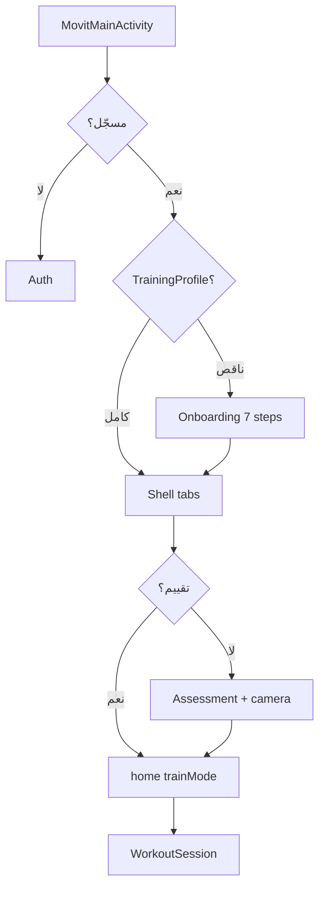

# Journey Index — As-built vs Planned

| | |
|---|---|
| **Status** | `ACTIVE` |
| **SSOT for** | User journey truth table (code vs blueprint) |
| **As-built detail** | [`../Architecture-As-Built/trainee-journey-current-state/`](../Architecture-As-Built/trainee-journey-current-state/) |
| **Planned detail** | [`Unified-User-Journey-Plan.md`](Unified-User-Journey-Plan.md) |
| **Verified** | 2026-06-22 |

---

## كيف تقرأ الجدول

| العمود | المعنى |
|--------|--------|
| **As-built** | ما يعمل في الكود اليوم |
| **Planned** | ما تصفه الخطة الموحّدة |
| **Gap** | ما يمنع اعتبار الميزة «منجزة» |

عند التعارض: **As-built + الكود** يفوزان.

---

## ملخص

| الحالة | تقريبًا |
|--------|---------|
| ✅ متوافق | 10 |
| 🟡 جزئي | 7 |
| 🔴 فجوة | 3 |
| ⏸ ملغى/مؤجّل | 2 |

---

## الجدول الرئيسي

| # | Capability | As-built (اليوم) | Planned | Gap |
|---|------------|------------------|---------|-----|
| 1 | **Onboarding UI** | `MovitOnboardingScreen` — 7 خطوات → `PUT /mobile/training-profile` | جمع أهداف، وقت، أيام، خصوصية | ✅ — [01](../Architecture-As-Built/trainee-journey-current-state/01-onboarding-and-training-profile.md) |
| 2 | **Training profile** | نفس الـ API + Prisma `TrainingProfile`؛ يُملأ من Onboarding | ربط بمسار أول دخول | ✅ |
| 3 | **Assessment resolve** | `GET /mobile/assessment-templates/resolve`؛ KMP يمرّر `mode` | initial + progression | ✅ — [02](../Architecture-As-Built/trainee-journey-current-state/02-assessment-templates-and-resolve.md) |
| 4 | **Body scan / level** | `MovitAssessmentScreen` + كاميرا حية (Android) → `POST /api/assessment` | Trust Before Training → مستوى 1–5 | ✅ أساس؛ تحسين المحتوى اختياري — [03](../Architecture-As-Built/trainee-journey-current-state/03-body-scan-level-profile.md) |
| 5 | **Prescription** | `prescriptionService.recommend` | برنامج مخصّص | 🟡 المحرك موجود؛ المحتوى CMS — [04](../Architecture-As-Built/trainee-journey-current-state/04-prescription-and-program-enrollment.md) |
| 6 | **Plan enroll** | `POST /mobile/plan/enroll` + تلقائي بعد أول تقييم | Active Plan واحد | ✅ |
| 7 | **Home / trainMode** | `GET /mobile/home` → `MovitHomeViewModel` / `MovitTrainViewModel` | Today's Mission | 🟡 المنطق موجود؛ UX أقل وضوحًا — [06](../Architecture-As-Built/trainee-journey-current-state/06-mobile-home-train-mode.md) |
| 8 | **Train mode (guided)** | `MovitTrainRoute` → `MovitInnerRoute.WorkoutSession` + `TrainingSessionViewModel` | مسار موجّه | ✅ — [08-kmp-mobile](../Architecture-As-Built/trainee-journey-current-state/08-kmp-mobile.md) |
| 9 | **Explore mode** | `MovitExploreRoute` — تمارين/برامج حرة | Free Gym + Quick Start | 🟡 موجود؛ فصل Train/Explore في Home أضعف |
| 10 | **Workout run** | `MovitTrainingEngine` + rep/hold + metrics | Every Rep Counts | ✅ |
| 11 | **Post-training report** | تقارير في `MovitReportsRoute` + metrics خادم | بطاقات Form/Safety/Control | 🟡 [Post-Training-Report-Review.md](Post-Training-Report-Review.md) |
| 12 | **Workout execution sync** | `POST /mobile/workout-executions` + planned-workout `complete` | نفس الحلقة | ✅ |
| 13 | **Reports hub** | `GET /mobile/reports/metrics` + تبويب Reports | تقارير أسبوعية | 🟡 API موجود؛ تجربة التطور قيد التحسين |
| 14 | **Progression engine** | `programCompletionService`, `nextAction` | تكيّف تلقائي | 🟡 قواعد خادم؛ Explore بلا progression |
| 15 | **Reassessment** | `reassessment_due` على home/train + `Assessment(mode=progression)` | إعادة تقييم دورية | 🟡 جدولة موجودة؛ `pending` vs `overdue` — [05](../Architecture-As-Built/trainee-journey-current-state/05-program-completion-reassessment.md) |
| 16 | **Retention / events** | لا عميل أحداث في KMP | محرك بقاء + beta events | 🔴 غير منفّذ — [17-Events](../../01-Business-Planning/17-Events-Implementation-Ticket.md) |
| 17 | **Payment** | `SubscriptionActivity` + بوابة موثّقة | اشتراك منتج | ⏸ مؤجّل في المنتج الحالي |
| 18 | **Admin content** | قوالب، برامج، تمارين | محتوى beta | 🟡 أدوات جاهزة — [21-Content-Readiness](../../01-Business-Planning/21-Content-Readiness.md) |
| 19 | **Privacy (on-device)** | Pose على الجهاز؛ لا رفع فيديو | نص قبل الكاميرا | 🟡 قرار محسوم؛ نص UI قد يكون ناقصًا |
| 20 | **Aha moment** | لا مسار موحّد | «حركة واحدة» في onboarding | 🔴 غير منفّذ — [19-Onboarding-and-Aha-Spec](../../01-Business-Planning/19-Onboarding-and-Aha-Spec.md) |
| — | **Booking** | — | حجز جلسات | ⏸ **ملغى** (أُزيل من backend وAdmin) |

---

## مسار مرجعي

---

## روابط

| طبقة | الوثيقة |
|------|---------|
| As-built (فهرس) | [trainee-journey-current-state/README.md](../Architecture-As-Built/trainee-journey-current-state/README.md) |
| KMP shell | [08-kmp-mobile.md](../Architecture-As-Built/trainee-journey-current-state/08-kmp-mobile.md) |
| Planned | [Unified-User-Journey-Plan.md](Unified-User-Journey-Plan.md) |
| محرك التدريب | [training-engine.md](../Engine/training-engine.md) |

---

## صيانة

عند PR يغيّر رحلة المستخدم: حدّث الصف + الملف في `trainee-journey-current-state/` + `Verified`.
