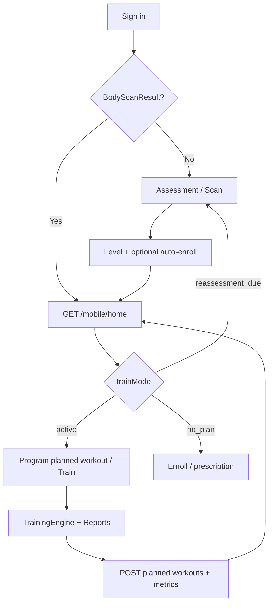

# Journey Index — As-built vs Planned

| | |
|---|---|
| **Status** | `ACTIVE` |
| **SSOT for** | User journey truth table (code vs blueprint) |
| **As-built detail** | [`../Architecture-As-Built/trainee-journey-current-state/`](../Architecture-As-Built/trainee-journey-current-state/) |
| **Planned detail** | [`Unified-User-Journey-Plan.md`](Unified-User-Journey-Plan.md) |
| **Verified** | 2026-05-29 |

---

## كيف تقرأ هذا الجدول

| العمود | المعنى |
|--------|--------|
| **As-built** | ما يعمل في الكود اليوم (`android-poc`, `backend`, `Admin-Dashboard`) |
| **Planned** | ما تصفه الخطة الموحّدة (مارس 2026) |
| **Gap** | فجوة يجب إغلاقها قبل اعتبار الميزة «منجزة» |

**قاعدة:** عند التعارض، **العمود As-built + الكود** يفوزان حتى تُحدَّث الخطة أو يُنفَّذ التغيير.

---

## ملخص تنفيذي

| الحالة | العدد (تقريبي) |
|--------|----------------|
| ✅ متوافق (يعمل كما في الخطة) | 8 |
| 🟡 جزئي (أساس موجود، UX/ربط ناقص) | 7 |
| 🔴 فجوة (مخطط لكن غير مربوط) | 5 |
| ⏸ مؤجّل / ملغى في التخطيط | 2 |

---

## الجدول الرئيسي

| # | Capability | As-built (اليوم) | Planned (الخطة) | Gap / ملاحظة |
|---|------------|------------------|-----------------|---------------|
| 1 | **Onboarding UI** | `OnboardingActivity` — 3 شاشات تعريفية → `SignInActivity` فقط | جمع أهداف، وقت، أيام، خصوصية، «لماذا نسأل» | 🔴 لا يملأ `TrainingProfile` — انظر [01-onboarding](../Architecture-As-Built/trainee-journey-current-state/01-onboarding-and-training-profile.md) |
| 2 | **Training profile** | `PUT /mobile/training-profile` + `TrainingProfile` في Prisma | نفس الحقول + ربط بـ onboarding | 🟡 API جاهز؛ واجهة جمع غير مربوطة بالـ POC |
| 3 | **Assessment resolve** | `GET /mobile/assessment-templates/resolve` (initial / progression) | تقييم أولي + إعادة تقييم like-for-like | ✅ |
| 4 | **Body scan / level** | `POST /api/assessment` → `BodyScanResult` + `UserLevelProfile` | Trust Before Training → مستوى 1–5 | ✅ أساس قوي؛ نصوص النتيجة قد تحتاج تحسين محتوى |
| 5 | **Prescription** | `prescriptionService.recommend` + سمات المستخدم | برنامج 28 يوم مخصّص | 🟡 المحرك موجود؛ محتوى البرنامج/التمارين مسؤولية CMS |
| 6 | **Plan enroll** | `POST /mobile/plan/enroll` + تلقائي بعد أول تقييم | Active Plan واحد واضح | ✅ |
| 7 | **Home / trainMode** | `GET /mobile/home` — `no_assessment`, `reassessment_due`, `no_plan`, `rest_day`, `active`, … | شاشة قيادة: Today's Mission + تقدم | 🟡 المنطق موجود؛ UX «مهمة اليوم» أقل وضوحاً من المخطط |
| 8 | **Train mode (guided)** | `ProgramWorkoutActivity` + `WorkoutTrainingEngine` + خطة أسبوع/يوم | مسار موجّه بالكامل | ✅ |
| 9 | **Explore mode** | `ExercisesFragment` / تمارين حرة + جلسات مستقلة | Free Gym + Quick Start + لا progression تلقائي | 🟡 التمارين الحرة موجودة؛ فصل Train/Explore في Home أضعف من المخطط |
| 10 | **Workout run training** | `TrainingEngine` + rep/hold + تقارير لكل تمرين | Every Rep Counts + coaching loop | ✅ |
| 11 | **Post-training report** | V1 UI (`ReportPagerActivity`); V2 metrics محسوبة غير معروضة بالكامل | بطاقات Form/Safety/Control + Quick Insight | 🟡 انظر [Post-Training-Report-Review.md](Post-Training-Report-Review.md) |
| 12 | **Backend workout execution sync** | `POST /mobile/workout-executions`, planned-workout `complete` → `WorkoutExecutionMetrics` / `RepMetrics` | نفس الحلقة | ✅ |
| 13 | **Reports hub** | `GET /mobile/reports/metrics` + `TrainFragment` | تقارير أسبوعية بمعنى واضح | 🟡 API موجود؛ تجربة «تطور» قيد التحسين |
| 14 | **Progression engine** | `programCompletionService`, `nextAction`, فتحات الخطة | تكيّف تلقائي بعد الجلسات | 🟡 قواعد موجودة؛ ربط Explore بلا progression صحيح |
| 15 | **Reassessment** | `ReassessmentSchedule`, `reassessment_due` على Home | إعادة تقييم أسبوع 2–4 لإثبات التطور | 🟡 جدولة موجودة؛ استعلام `pending` vs `overdue` يحتاج توحيد |
| 16 | **Retention / events** | أجزاء في الكود + [18-Retention-Engine-Code-Map](../../01-Business-Planning/18-Retention-Engine-Code-Map.md) | محرك بقاء + أحداث beta | 🟡 تذكرة [17-Events](../../01-Business-Planning/17-Events-Implementation-Ticket.md) |
| 17 | **Payment / booking** | بوابة دفع موثّقة في Operations | — | ⏸ الحجوزات **ملغاة** — `99-Archive/Cancelled-Features/` |
| 18 | **Admin content** | قوالب تقييم، برامج، تمارين، `Exercise-JSON-Schema` | محتوى 20 مستخدماً beta | 🟡 أدوات جاهزة؛ الجاهزية محتوى ([21-Content-Readiness](../../01-Business-Planning/21-Content-Readiness.md)) |
| 19 | **Privacy (on-device)** | Pose على الجهاز؛ لا رفع فيديو في المسار الأساسي | نص صريح قبل الكاميرا | 🟡 قرار منتج محسوم؛ UI نص الخصوصية قد يكون ناقصاً |
| 20 | **Aha moment** | تمرين تجريبي ممكن عبر مسارات متفرقة | «حركة واحدة» موجّهة في onboarding | 🔴 غير موحّد كمسار واحد — [19-Onboarding-and-Aha-Spec](../../01-Business-Planning/19-Onboarding-and-Aha-Spec.md) |

---

## مسار مبسّط (مرجع سريع)

---

## روابط التفصيل

| طبقة | الوثيقة |
|------|---------|
| As-built (كود) | [trainee-journey-current-state/README.md](../Architecture-As-Built/trainee-journey-current-state/README.md) |
| Planned (منتج) | [Unified-User-Journey-Plan.md](Unified-User-Journey-Plan.md) |
| Beta / قياس | [14-Beta-Measurement.md](../../01-Business-Planning/14-Beta-Measurement.md), [16-Correct-Planned Workout-Definition.md](../../01-Business-Planning/16-Correct-Planned Workout-Definition.md) |
| محرك التدريب | [training-engine.md](../Engine/training-engine.md) |

---

## صيانة هذا الملف

عند دمج PR يغيّر رحلة المستخدم:

1. حدّث الصف في الجدول + رمز الحالة.
2. حدّث الملف المناسب في `trainee-journey-current-state/` إن لزم.
3. غيّر `Verified` في الترويسة.
