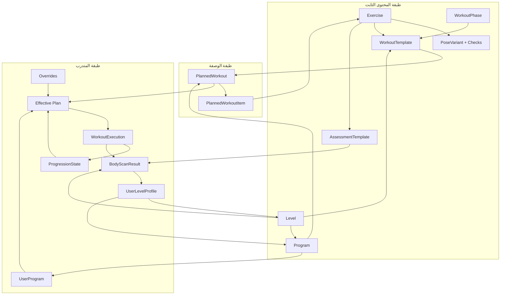
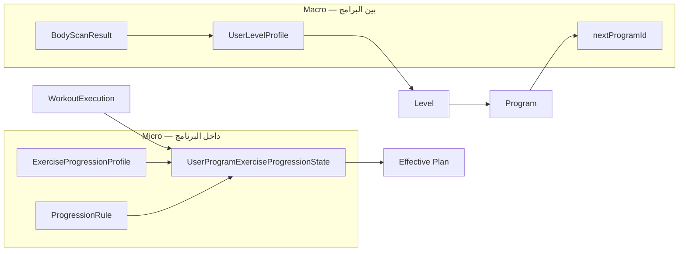

# طبقات التدريب في Movit — مرجع معماري

| | |
|---|---|
| **الحالة** | `ACTIVE` |
| **المرجع في الكود** | `backend/prisma/schema.prisma`, `backend/src/domain/workout-contract.ts` |
| **آخر مراجعة** | 2026-06-22 |

---

## الفكرة الأساسية

منصة Movit تفصل بين **محتوى ثابت** (مكتبة يُعاد استخدامها) و**خطة تنفيذية** (ما يفعله المتدرب الآن). التمارين هي الذرة؛ البرامج هي المسار؛ المستويات والتقييم يحددان **من يصل لأي مسار** و**بأي شدة**؛ محرك التقدم يعدّل الأهداف بعد كل أداء.



---

## طبقتان رئيسيتان

| الطبقة | السؤال الذي تجيب عليه | أمثلة في النظام |
|--------|------------------------|-----------------|
| **Catalog (قالب)** | ماذا *يمكن* أن يُدرَّب؟ | `Exercise`, `WorkoutTemplate`, `Program`, `AssessmentTemplate`, `Level` |
| **Runtime (تنفيذ)** | ماذا *يفعل* هذا المتدرب الآن؟ | `UserProgram`, `PlannedWorkout` المدمجة، `WorkoutExecution`, `BodyScanResult` |

القاعدة الذهبية للخطة الفعلية:

```text
Effective Plan = Program Template + ProgressionState + ManualOverrides
```

ترتيب الدمج ثابت: القالب أولاً، ثم حالة التقدم، ثم التعديلات اليدوية.

---

## 1. Exercise — ذرة المحتوى

**التعريف:** أصغر وحدة تدريبية قابلة للعدّ بالكاميرا. كل تمرين له عقد JSON موحّد مع الموبايل (`android-schema`).

### خصائص أساسية

| المجال | حقول ممثلة | الغرض |
|--------|------------|--------|
| الهوية | `slug`, `name`, `status` | مرجع ثابت عبر كل الطبقات |
| التصنيف | `category`, `muscles`, `equipment`, `tags` | فلترة وبحث |
| آلية العد | `countingMethod`, `repCountingConfig`, `isBilateral` | reps / hold / ثنائي الجانب |
| المحرك | `poseVariants[]` → `PoseVariant`, `PositionCheck` | تتبع المفاصل، رسائل feedback، TTS |
| البلوبرنت | `movementPattern`, `loadCapability`, `familyKey`, `familyOrder` | تجميع عائلات، تقدم، تحليلات |
| الأهداف | `supportsWeight`, `min/max/defaultWeight` | تحميل اختياري |
| التقدم | `ExerciseProgressionProfile`, `archetype` | محور الترقية (reps / load / duration / difficulty) |

### علاقات

- **يُستدعى من:** `WorkoutTemplateExercise`, `PlannedWorkoutItem`, `AssessmentTemplateExercise`
- **لا يحمل:** ترتيب يوم، أسبوع، أو برنامج — ذلك دور الطبقات الأعلى
- **عائلة التمارين (`familyKey`):** سلم صعوبة داخل نفس النمط (مثلاً `squat_pattern_family`: goblet → front squat → back squat)

### طبقة فرعية: Pose & Checks

`PoseVariant` يربط التمرين بزاوية كاميرا (`posePosition`) و`trackedJoints` و`positionChecks`. بدونها التمرين مجرد metadata؛ معها يصبح قابلاً للتنفيذ على الموبايل.

---

## 2. WorkoutTemplate — جلسة قابلة لإعادة الاستخدام

**التعريف:** تجميع مرتب من تمارين (مع أهداف sets/reps/duration/weight) داخل **مراحل** (إحماء / أساسي / تهدئة). يعيش في الكتالوج ويمكن استخدامه مستقلاً أو داخل برنامج.

### خصائص أساسية

| المجال | حقول | الغرض |
|--------|------|--------|
| الهوية | `slug`, `name`, `status`, `levelId` | كتالوج + ربط بمستوى صعوبة |
| المنشأ | `origin`: `STANDALONE` \| `PROGRAM_EMBEDDED` | قالب عام vs مدمج في برنامج |
| المراحل | `WorkoutTemplatePhase` → `WorkoutPhase` | ترتيب الإحماء والعمل والتهدئة |
| التمارين | `WorkoutTemplateExercise` | تمرين + `variantIndex` + أهداف لكل set |

### WorkoutPhase (كتالوج مراحل مشترك)

| slug | role | سلوك نموذجي |
|------|------|-------------|
| `warmup` | `WARMUP` | قابل للتخطي، مدة قصوى |
| `main` | `MAIN` | الجزء الأساسي |
| `cooldown` | `COOLDOWN` | تهدئة |

### علاقات

```text
WorkoutTemplate
  └── WorkoutTemplatePhase[]  (ترتيب)
        └── WorkoutTemplateExercise[]  → Exercise
```

- **مستقل:** يظهر في Explore / Quick Start على الموبايل
- **مدمج في برنامج:** `programId` + `origin = PROGRAM_EMBEDDED` — نسخة مرتبطة ببرنامج محدد
- **يُنسخ إلى:** `PlannedWorkout` عند بناء البرنامج (البرنامج يشير للقالب ويخصص العناصر عبر `PlannedWorkoutItem`)

---

## 3. Program — المسار التدريبي طويل المدى

**التعريف:** خطة متعددة الأسابيع تحدد **ماذا يتدرب المتدرب ومتى**، وليس كيف يُنفَّذ تمرين واحد تقنياً (ذلك عند Exercise).

### هيكل البرنامج

```text
Program
  └── ProgramWeek (weekNumber)
        └── ProgramDay (dayNumber, dayType)
              └── PlannedWorkout (كتلة يومية)
                    └── PlannedWorkoutItem (تمرين أو راحة)
                          └── Exercise
```

### خصائص البرنامج

| المجال | حقول | الغرض |
|--------|------|--------|
| النطاق الزمني | `durationWeeks`, `weeklyWorkoutTarget` | طول المسار وكثافة أسبوعية |
| المستوى | `levelMinId`, `levelMaxId` | لمن يُوصى بهذا البرنامج |
| التصنيف | `programType`, `ProgramAttribute[]` | SYSTEM / COACH / CUSTOM + domain/goal/equipment |
| السلسلة | `prerequisiteProgramId`, `nextProgramId` | مسار تقدم بين البرامج |
| التسكين | `autoAssignable`, `prescriptionPriority` | اختيار تلقائي vs يدوي |

### PlannedWorkout vs WorkoutTemplate

| | WorkoutTemplate | PlannedWorkout |
|---|-----------------|----------------|
| **السياق** | كتالوج | داخل يوم برنامج |
| **الربط** | مستقل أو مدمج | `dayId` + `workoutTemplateId` |
| **العناصر** | `WorkoutTemplateExercise` | `PlannedWorkoutItem` (قد تُستورد من القالب أو تُعدَّل) |
| **التقدم** | ثابت | يتأثر بـ `ProgressionState` و`Overrides` |

`PlannedWorkoutItem` يدعم نوع `exercise` أو `rest`، مع `sets`, `targetReps`, `targetDuration`, `weightKg`, `weightPerSet`.

---

## 4. Assessment — تشخيص القدرة

**التعريف:** طبقة **قياس** منفصلة عن التدريب. لا تُعدّ تمريناً عادياً رغم استخدام تمارين assessment من نفس مكتبة `Exercise`.

### مكونات التقييم

| الكيان | الدور |
|--------|--------|
| `AssessmentTemplate` | وصفة التقييم: تمارين، أوزان المجالات، نوع (`initial` / إعادة) |
| `AssessmentTemplateExercise` | تمرين في التقييم: `entryType` = `core` \| `adaptive`, عتبات ROM, `activationCondition` |
| `BodyScanResult` | نتيجة جلسة تقييم: `bodyScore`, `mobilityScore`, `controlScore`, `safetyScore`, `regions` |
| `UserLevelProfile` | لقطة مستوى المستخدم بعد التقييم: `overallLevel`, `domainLevels`, `limitingFactors` |

### تمارين التقييم النموذجية

- **Core:** تُنفَّذ دائماً (overhead squat, lunge, shoulder mobility)
- **Adaptive:** تُفعَّل حسب أداء تمرين سابق (مثلاً forward fold إذا ROM ضعيف في squat)

### علاقة Assessment ↔ Levels

التقييم **لا يُنشئ** مستوى جديداً — يُنتج `bodyScore` يُقارَن بـ `Level.entryThreshold` فيُصنَّف المستخدم (1–5: Foundation → Elite). النتيجة تغذي محرك الوصفة لاختيار البرنامج المناسب.

---

## 5. Level — شريط الصعوبة العالمي

**التعريف:** مرحلة عامة في رحلة المتدرب، **ليست** خاصة ببرنامج واحد. تحدد defaults للشدة عندما لا يحدد البرنامج أو التمرين قيماً أدق.

### المستويات الخمس

| # | code | entryThreshold | توجيه الشدة |
|---|------|----------------|-------------|
| 1 | foundation | 0 | bodyweight، تركيز سلامة |
| 2 | building | 25 | مقاومة خفيفة |
| 3 | intermediate | 45 | moderate |
| 4 | advanced | 65 | heavy |
| 5 | elite | 85 | max effort |

### defaults على مستوى Level

`defaultSetsMin/Max`, `defaultRepsMin/Max`, `defaultRestBetweenSetsMs`, `defaultWorkoutDurMin/Max`, `defaultWeeklyFreqMin/Max`, `defaultIntensityGuide`

### أين يُستخدم Level؟

| الكيان | الاستخدام |
|--------|-----------|
| `Program.levelMin/Max` | نطاق البرامج المناسبة |
| `WorkoutTemplate.levelId` | صعوبة قالب كتالوج |
| `Exercise.levelId` | (اختياري) تصنيف تمرين |
| `BodyScanResult.levelId` | مستوى بعد التقييم |
| `AssessmentTemplate.targetLevelId` | تقييم موجه لمستوى |

---

## طبقات الربط والتنفيذ

### UserProgram — تسجيل المتدرب في برنامج

نسخة شخصية من `Program`: `userId`, `programId`, `startDate`, `templateVersion`, `customizations`. نقطة البداية لكل ما هو خاص بالمستخدم داخل مسار البرنامج.

### ActivePlan — الجدول الحالي

`ActivePlan` → `ActivePlanProgram[]` (ترتيب البرامج القادمة/الحالية). يجيب: **أي برامج في خطته الآن؟**

### Effective Plan — ما يُعرض على الموبايل اليوم

الخدمة `effective-plan.service` تدمج:

1. هيكل البرنامج (`PlannedWorkout` + `PlannedWorkoutItem`)
2. `UserProgramExerciseProgressionState` (أهداف محدّثة لكل تمرين)
3. `UserProgramOverride` (تعديل كوتش/مستخدم)
4. `ExerciseSubstitution` (استبدال تمرين عند الحاجة)

### WorkoutExecution — تنفيذ تمرين واحد

سجل أداء فعلي: reps، ROM، جودة، مدة. يُغذّي `ProgressionHistory` ومحرك التقدم. **لا يُخلط** مع `PlannedWorkout` (المخطط) ولا `WorkoutTemplate` (الكتالوج).

### PlannedWorkoutReport — تقرير كتلة يومية

ملخص بعد إكمال `PlannedWorkout` كاملة (عدة تمارين)، مقابل `WorkoutExecution` الذي هو per-exercise.

---

## الترقية والتقدم (Progression)

### مستويان للتقدم



### Micro-progression (محرك التقدم)

| الكيان | الوظيفة |
|--------|---------|
| `ExerciseProgressionProfile` | قالب علمي لكل تمرين: `archetype`, محاور مسموحة (`repAxis`, `loadAxis`, `durationAxis`), `qualityGate`, `promotionPolicy`, `regressionPolicy`, `difficultyLadder` |
| `UserProgramExerciseProgressionState` | الحالة الحالية: `currentTargetReps`, `currentWeightKg`, `currentDifficultyCode`, `successStreak` / `regressionStreak` |
| `ProgressionRule` | قواعد عامة (scope: program أو exercise slug) — trigger + conditions + action |
| `ProgressionHistory` | سجل تدقيق لكل تغيير |

**منطق الترقية داخل التمرين:**

1. المتدرب ينفّذ التمرين → `WorkoutExecution` + metrics
2. `qualityGate` يقيّم (ROM، استقرار، اكتمال sets)
3. عند تحقيق `promotionPolicy` (مثلاً 3 جلسات ناجحة متتالية) → رفع محور واحد حسب `priorityOrder`
4. عند فشل متكرر → `regressionPolicy` (خفض حمل، تقليل reps، أو تمرين أسهل في `familyKey`)

**محاور الترقية الشائعة:** reps → load → duration → difficulty (حسب `ExerciseArchetype`)

### Macro-progression (بين المستويات والبرامج)

1. إكمال برنامج أو trigger إعادة تقييم
2. Body Scan جديد → `bodyScore` محدّث
3. `UserLevelProfile.overallLevel` قد يرتفع
4. محرك الوصفة يختار برنامجاً ضمن `levelMin–levelMax` أو `nextProgramId`
5. `ActivePlan` يُحدَّث ببرنامج جديد

---

## حلقة الحياة الكاملة للمتدرب

```text
PAR-Q / Training Profile
        ↓
Assessment (AssessmentTemplate → BodyScanResult)
        ↓
UserLevelProfile + Level classification
        ↓
Program selection (ActivePlan / UserProgram)
        ↓
Effective Plan (يوم ← PlannedWorkout ← items)
        ↓
WorkoutExecution (per exercise, pose engine)
        ↓
Progression Engine (micro) ──→ تحديث الأهداف التالية
        ↓
[نهاية برنامج / reassessment]
        ↓
Macro level-up + برنامج تالي
```

---

## جدول مرجع سريع

| الطبقة | ثابت / ديناميكي | يتغير بعد التدريب؟ | يُبنى من |
|--------|-----------------|-------------------|----------|
| Exercise | ثابت (كتالوج) | المحتوى التقني نادراً | JSON + Admin |
| PoseVariant | ثابت | نادراً | مع Exercise |
| WorkoutPhase | ثابت | لا | Seed |
| WorkoutTemplate | ثابت | نادراً | Admin / JSON |
| Program | ثابت (قالب) | إصدارات | Admin / seed |
| PlannedWorkout/Item | قالب برنامج | نعم عبر progression | Program seed |
| AssessmentTemplate | ثابت | نادراً | Seed |
| Level | ثابت | thresholds نادراً | Seed |
| UserProgram | ديناميكي | customizations | تعيين |
| ProgressionState | ديناميكي | كل جلسة ناجحة/فاشلة | محرك تلقائي |
| Override | ديناميكي | يدوي | كوتش/مستخدم |
| BodyScanResult | ديناميكي | كل تقييم | Assessment run |
| WorkoutExecution | ديناميكي | كل تمرين | الموبايل |

---

## مصطلحات يجب عدم الخلط بينها

| المصطلح | معناه في Movit | ليس |
|---------|----------------|-----|
| WorkoutTemplate | قالب كتالوج | جلسة المستخدم الفعلية |
| PlannedWorkout | كتلة تدريب داخل يوم برنامج | تنفيذ تمرين واحد |
| WorkoutExecution | تنفيذ تمرين واحد + metrics | البرنامج كاملاً |
| Assessment session | جلسة Body Scan | تمرين برنامج عادي |
| Level | مرحلة عالمية 1–5 | أسبوع البرنامج |
| familyKey | سلم صعوبة داخل عائلة حركة | تصنيف عضلة |

---

## مراجع ذات صلة

- [Workout-Domain-Naming.md](../Contracts/Workout-Domain-Naming.md) — تسميات API والجداول
- [Unified-User-Journey-Plan.md](./Unified-User-Journey-Plan.md) — رحلة المستخدم والحلقة المغلقة
- [Program-Blueprint.md](../../04-Research/Training-Programs/Program-Blueprint.md) — تفاصيل البرامج والوصفة
- `backend/prisma/seeders/README.md` — أوامر seed للمحتوى
