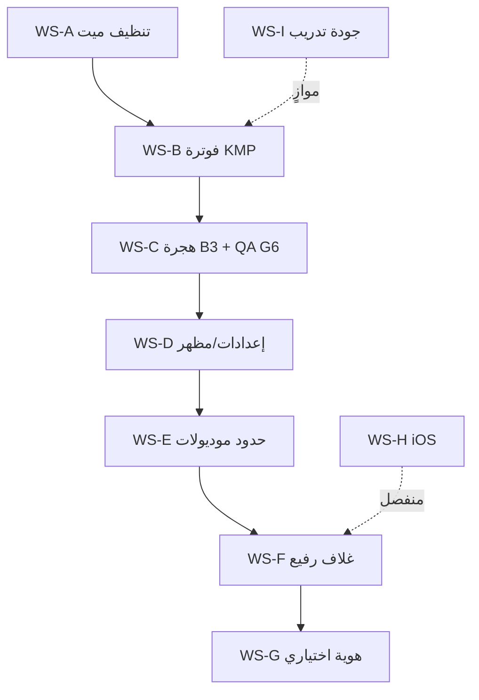

# خطة الانتقال الكامل 100% إلى KMP — بدون جسور (إعادة كتابة من واقع الكود)

**تاريخ الإصدار:** 2026-06-15 (إعادة كتابة كاملة)  
**الفرع:** `Base` / `codex/kmp-mobile-foundation`  
**النطاق:** Android إنتاج أولاً — ثم iOS كمسار منفصل  
**المبدأ الحاكم:** **لا جسور ولا حلول انتقالية.** كل وظيفة إما تُنقل إلى KMP أو تُبنى من جديد، ثم يُحذف المصدر القديم فوراً. لا `Legacy*`، لا `AuthManager` موازٍ، لا شاشات XML خارج Compose، لا أعلام rollback.

**مراجع الاستكشاف:** خمسة مسوحات على الكود الفعلي (يونيو 2026) + الوثائق السابقة.

---

## 0) الخلاصة التنفيذية — أين نحن الآن؟

### ما تحقق (لا يُعاد فتحه)

| الإنجاز | الدليل في الكود |
|---------|-----------------|
| **صدفة KMP هي التطبيق الوحيد** | `MovitMainActivity` = LAUNCHER الوحيد في `AndroidManifest.xml` |
| **حذف ~50 ألف سطر legacy UI/محرك** | لا `MainContainerActivity`، لا `TrainingActivity`، لا Fragments — بقي 11 ملف `poc/**` فقط |
| **محرك تدريب KMP** | `:core:training-engine` + `:core:pose-capture` + `:feature:training` |
| **18 وحدة KMP** | shell + 8 features + 7 core + shared + build-logic |
| **5 تبويبات + 16 مساراً داخلياً نشطاً** | Home, Train, Explore, Reports, Profile + library/training/account flows |
| **`MovitDataInstall` بلا `import poc.*`** | مسار البيانات KMP نظيف |
| **أعلام rollback محذوفة** | لا `movit.shell.*` في `gradle.properties`؛ لا `SplashActivity` |
| **AAB ~40 MB** | انخفاض من ~230 MB |
| **اختبارات وحدة كثيفة** | ~177 ملف `*Test.kt` على data/engine/library |

### ما يمنع «100% إنتاج بدون جسور»

| العائق | الحجم | الخطورة |
|--------|-------|---------|
| **`LegacyBillingHost` → `AuthManager`/`ApiClient`** | ~250 سطر + Retrofit | **حرجة** — مسار إيرادات |
| **`SubscriptionActivity` (XML/ViewBinding)** | ~576 سطر + layouts | **حرجة** — خارج KMP Compose |
| **`AnalyticsStorage` + `LegacyWorkoutSyncDrain`** | ~430 سطر | **حرجة** — هجرة بيانات قدامى |
| **`SettingsManager` + `AppSettings`** | ~790 سطر (معظمها ميت) | متوسطة — pose model prefs |
| **`AppThemeManager` في `PoseApp`** | ~46 سطر | منخفضة — مكرر مع `AndroidMovitPlatform` |
| **كود ميت داخل KMP** | `MovitTrainingKmpGate`, `ExerciseLive`, `TrainingStartAction.Legacy` | منخفضة — ضوضاء |
| **`feature:training-debug` في `shell` commonMain** | يُشحن في iOS framework | متوسطة — تلوث حدود الإنتاج |
| **`boundary/trainingdebug` في `core:pose-capture`** | أنواع debug في core | متوسطة |
| **موارد يتيمة** | ~90% من `strings.xml`، menus، assets matting | منخفضة — حجم/تعقيد |
| **`applicationId` = `com.movit.androidApp`** | هوية Movit (متوازية مع `com.movit.iosApp`) | ✅ تم |
| **QA ميداني غير مُثبت** | G1/G6/smoke | **حرجة** — قبل حذف B3 |
| **فجوات منتج التدريب** | throughput ~7fps، report UI، train calendar | **حرجة للمنتج** |
| **iOS** | pose stub، لا billing، لا Google | خارج نطاق Android 100% |

### الحكم

**Cutover هيكلي Android: ~85% مكتمل.**  
**Cutover «بدون جسور» للإنتاج: ~40% مكتمل** — لأن الفوترة والهجرة والـ HTTP legacy ما زالت حية.

---

## 1) تعريف «100% بدون جسور»

| المعيار | مطلوب | الوضع الحالي |
|---------|-------|--------------|
| صفر ملفات في `com.trainingvalidator.poc` | ✅ | ❌ 11 ملف |
| صفر Retrofit/Gson في `:app` | ✅ | ❌ للفوترة |
| صفر `ViewBinding`/XML layouts إنتاجية | ✅ | ❌ `SubscriptionActivity` |
| صفر `Legacy*` classes | ✅ | ❌ `LegacyBillingHost`, `LegacyWorkoutSyncDrain`, `LegacyWorkoutUpload` |
| صفر استيراد `poc.*` من أي مكان | ✅ | ❌ من `com.movit.billing` |
| LAUNCHER واحد → KMP shell | ✅ | ✅ |
| auth/session من `core:data` فقط | ✅ | ❌ billing يستخدم `AuthManager` |
| فوترة داخل KMP (Compose + `expect/actual`) | ✅ | ❌ Activity XML |
| هجرة بيانات قدامى مُثبتة ثم migrator محذوف | ✅ | ❌ B3 حي |
| smoke release على جهاز حقيقي | ✅ | ⏳ |
| iOS تدريب حي + فوترة | ✅ (منفصل) | ❌ |

---

## 2) جرد الكود المتبقي (واقع 2026-06-15)

### أ) `com.trainingvalidator.poc` — 11 ملف Kotlin (~1,800 سطر فعّال)

```
PoseApp.kt
network/ApiClient.kt · ApiConfig.kt · AuthApi.kt · AuthModels.kt
storage/AnalyticsStorage.kt · AuthManager.kt · LegacyWorkoutUpload.kt
training/config/AppSettings.kt · SettingsManager.kt
ui/theme/AppThemeManager.kt
```

**لا يُحذف أي ملف قبل استبدال وظيفته في KMP.**

### ب) `com.movit` — غلاف + جسور (~1,400 سطر)

| ملف | تصنيف | الإجراء |
|-----|-------|---------|
| `MovitMainActivity` | **غلاف شرعي** | يبقى — نقطة دخول Android |
| `MovitShellHost` | **غلاف شرعي** | يبقى — يُنظَّف من callbacks legacy |
| `MovitDataInstall` | **غلاف شرعي** | يبقى — يُزال `LegacyWorkoutSyncDrain` لاحقاً |
| `MovitShellDeepLinkParser` | **غلاف شرعي** | يبقى |
| `MovitPostLoginNavigator` | **غلاف شرعي** | يبقى |
| `LegacyWorkoutSyncDrain` | **جسر — يُحذف** | بعد G6 |
| `LegacyBillingHost` | **جسر — يُحذف** | WS-B1 |
| `SubscriptionActivity` | **جسر — يُحذف** | WS-B2 |
| `MovitTrainingEntryNavigator` | **ميت — يُحذف** | لا مستدعٍ حي |

### ج) `:feature:billing` — Android library (~199 سطر)

شبكة Retrofit منفصلة. **يُدمج في `core:network` Ktor** أو يُحذف بعد نقل endpoints.

### د) كود ميت داخل KMP (يُحذف فوراً — لا يحتاج نقل)

| العنصر | المسار |
|--------|--------|
| `MovitTrainingKmpGate` | `core:data` — يُضبط ولا يُقرأ |
| `TrainingStartAction.Legacy` | `feature:library/WorkoutFlowModels.kt` |
| `MovitInnerRoute.ExerciseLive` | `feature:shell` — لا navigation إليه |
| `DefaultWorkoutSessionRepository` | fallback «bridge not installed» |
| `Theme.TrainingValidatorPoC` | `res/values/themes.xml` |
| `brand_accent_legacy` | colors |
| `res/menu/bottom_nav_menu.xml` · `menu_report.xml` | يتيمة |

### هـ) موارد يتيمة (حذف بعد grep)

- ~90% من `values/strings.xml` و`values-ar/strings.xml` (تعليقات شاشات محذوفة)
- `debug/assets` ONNX/TFLite لـ matting (segmentation legacy)
- `assets/posture_mlp*` بلا مستهلك

### و) فرع `MO` (خارج الشجرة الحالية)

النظام القديم الكامل (~57k سطر) موجود على **فرع Git `MO`** للمرجعية والمقارنة فقط — **ليس هدف هذه الخطة**. لا يُعاد دمجه.

---

## 3) خريطة النظام KMP الحالي (18 وحدة)

| الوحدة | الغرض | الحالة |
|--------|--------|--------|
| `:app` | غلاف Android + MediaPipe/CameraX | إنتاج — يُرقّق |
| `:shared` | `PlatformInfo`, `AppResult` | إنتاج |
| `:core:model` | نماذج Explore | إنتاج |
| `:core:resources` | i18n en/ar | إنتاج |
| `:core:designsystem` | M3 + كتالوج | إنتاج |
| `:core:network` | Ktor + DTOs | إنتاج — يستوعب billing |
| `:core:data` | SQLDelight + sync + session | إنتاج |
| `:core:training-engine` | محرك تدريب خالص | إنتاج |
| `:core:pose-capture` | CameraX + MediaPipe | إنتاج Android / stub iOS |
| `:feature:shell` | shell + تنقل + iOS framework | إنتاج — يُنظَّف |
| `:feature:home` | تبويب Home (~93%) | إنتاج |
| `:feature:train` | تبويب Train (~90%) | إنتاج |
| `:feature:explore` | تبويب Explore (~91%) | إنتاج |
| `:feature:reports` | Reports + ReportDetail (~90%) | إنتاج |
| `:feature:account` | Auth/Onboarding/Assessment/Level/Profile | إنتاج (~75–86%) |
| `:feature:library` | مكتبة + جلسات + Prepare | إنتاج (~83–87%) |
| `:feature:training` | `TrainingSession` حي | إنتاج (~73–80%) |
| `:feature:training-debug` | مختبر pose/زوايا | **debug-only** |
| `:feature:billing` | Play Billing + MyFatoorah | **يُدمج/يُحذف** |

---

## 4) مقارنة الشاشات — Legacy MO ↔ KMP (ملخص)

| المجال | KMP | النسبة | فجوة حرجة |
|--------|-----|--------|-----------|
| Shell + تبويبات | ✅ 5 تبويبات | 100% | — |
| Home / Explore / Reports | ✅ | ~90% | HomeReportPreview لا يفتح ReportDetail |
| Train | ✅ | ~90% | تقويم — UX + `weekCalendars` جزئي |
| Auth / Onboarding / Profile | ✅ | ~85% | اشتراك → legacy Activity |
| Assessment / Level | ✅ | ~75% | iOS pose stub |
| Library (تمارين/برامج/جلسات) | ✅ | ~84% | — |
| تدريب حي `TrainingSession` | ✅ | ~73% | throughput، report UI، setup polish |
| فوترة | ❌ جسر XML | 0% KMP | **blocker إنتاج** |
| Training Debug Lab | ✅ debug | جديد | غير في release |

---

## 5) مسارات العمل الجديدة (WS-A → WS-H)

> **ترتيب إلزامي.** لا تخطّ خطوة. كل خطوة تنتهي بحذف الكود الذي استبدلته.

### WS-A — تنظيف فوري (كود ميت — لا جسور)

**الهدف:** إزالة الضوضاء التي تُوحي بوجود مسارين.

| # | المهمة | الملفات |
|---|--------|---------|
| A1 | حذف `MovitTrainingKmpGate` | `core:data/MovitTrainingKmpGate.kt`, `MovitDataInstall.kt` |
| A2 | حذف `TrainingStartAction.Legacy` + تبسيط `handleTrainingStart` | `WorkoutFlowModels.kt`, `MovitInnerHost.kt` |
| A3 | حذف `ExerciseLive` route + screen + VM | `MovitInnerRoute.kt`, `feature:training` |
| A4 | حذف `DefaultWorkoutSessionRepository` | `WorkoutSessionRepository.kt` |
| A5 | حذف `MovitTrainingEntryNavigator` | `app/.../navigation/` |
| A6 | حذف theme aliases + menus يتيمة | `res/values/themes.xml`, `res/menu/` |
| A7 | حذف `legacyAuthExitEnabled` + effect | `MovitAppShellViewModel.kt`, `MovitShellHost.kt` |

**بوابة A:** `assembleRelease` أخضر + لا مراجع مكسورة.

---

### WS-B — قطع جسور الفوترة والجلسة (حرجة)

**الهدف:** مسار إيرادات 100% KMP — صفر `AuthManager`/`ApiClient`/`LegacyBillingHost`.

| # | المهمة | التفاصيل |
|---|--------|----------|
| B1 | نقل token refresh للفوترة إلى Ktor | `core:network` — interceptor يستخدم `SecureSessionStore` |
| B2 | `BillingHost` actual يقرأ من `AndroidMovitPlatform` فقط | حذف `LegacyBillingHost.kt` |
| B3 | دمج `:feature:billing` APIs في `core:network` | حذف Retrofit من `:feature:billing` |
| B4 | شاشة اشتراك Compose في `feature:account` | `MovitSubscriptionScreen` → تنفيذ كامل (Play + MyFatoorah) |
| B5 | `expect/actual` للمنصّة حيث يلزم | Android: Play Billing SDK؛ iOS: StoreKit (WS-H) |
| B6 | حذف `SubscriptionActivity` + layouts XML + `viewBinding` من `:app` | `activity_subscription.xml`, `dialog_*` |
| B7 | حذف `LaunchLegacySubscription` effect | `MovitAppShellEffect.kt`, `MovitShellHost.kt` |
| B8 | حذف `AuthManager.kt`, `ApiClient.kt`, `ApiConfig.kt`, `AuthApi.kt`, `AuthModels.kt` | package `poc/network` + `poc/storage/AuthManager` |

**بوابة B:** شراء اشتراك كامل على جهاز حقيقي (Play + MyFatoorah) بدون أي `poc.*`.

---

### WS-C — هجرة بيانات قدامى ثم حذف B3

**الهدف:** صفر فقد executions/توكنات — ثم حذف migrator.

| # | المهمة | التفاصيل |
|---|--------|----------|
| C1 | QA ترقية من تثبيت legacy قديم | توكنات + executions معلّقة في `AnalyticsStorage` |
| C2 | تشغيل `SecureSessionMigrationTest` + سيناريوهات edge | وحدة ✅ موجودة |
| C3 | metric: طابور `AnalyticsStorage` فارغ بعد 30 يوم | telemetry |
| C4 | حذف `LegacyWorkoutSyncDrain` | `app/.../host/` |
| C5 | حذف `AnalyticsStorage.kt`, `LegacyWorkoutUpload.kt` | `poc/storage/` |

**بوابة C (G6):** جهاز حقيقي مُرقّى من legacy يعمل: login → train → report → logout → login.

---

### WS-D — توحيد الإعدادات والمظهر

| # | المهمة | التفاصيل |
|---|--------|----------|
| D1 | نقل pose model type إلى `MovitTrainingPreferences` | حذف قراءة `SettingsManager` من `PoseModelTypePreference` |
| D2 | نقل `app_settings.json` إلى `core:data` assets/config | حذف `AppSettings.kt` + `SettingsManager.kt` |
| D3 | حذف `AppThemeManager` من `PoseApp` | `AndroidMovitPlatform.themeMode()` فقط |
| D4 | تبسيط `PoseApp` → `MovitApplication` | تهيئة `MovitData.install` فقط |

**بوابة D:** صفر ملفات في `poc/**`.

---

### WS-E — تنظيف حدود الموديولات

| # | المهمة | التفاصيل |
|---|--------|----------|
| E1 | نقل `boundary/trainingdebug/*` من `core:pose-capture` إلى `feature:training-debug` | فصل debug عن core إنتاجي |
| E2 | فك `feature:training-debug` من `shell` commonMain | `expect/actual` stub في shell؛ `debugImplementation` على Android |
| E3 | مسار debug واحد: `MovitInnerRoute.TrainingDebugLab` فقط | حذف `TrainingDebugActivity` من debug manifest |
| E4 | حذف pilot activities إن لم تعد مطلوبة | `MovitShellPilotActivity`, `MovitExplorePilotActivity` |

**بوابة E:** `release` APK لا يحتوي رموز `training-debug`؛ iOS framework نظيف.

---

### WS-F — `:app` غلاف رفيع

| # | المهمة | التفاصيل |
|---|--------|----------|
| F1 | حذف package `com.trainingvalidator.poc` بالكامل | بعد WS-B + WS-C + WS-D |
| F2 | حذف Retrofit/Gson/OkHttp من `:app/build.gradle.kts` | |
| F3 | حذف `viewBinding` من `:app` | |
| F4 | دمج source sets `movitShellEnabled` + `movitShellHost` في `main` | تبسيط build |
| F5 | تنظيف `strings.xml` / drawables / assets يتيمة | grep مراجع |
| F6 | ✅ `applicationId` → `com.movit.androidApp` | WS-G — تم |

**بوابة F:** `:app` < 500 سطر Kotlin؛ AAB < 35 MB هدف.

---

### WS-G — هوية الحزمة (اختياري — قرار منتج)

| # | المهمة |
|---|--------|
| G1 | ✅ `applicationId` → `com.movit.androidApp` (قائمة Play جديدة — لا تحديث فوق legacy) |
| G2 | إن تغيّر: تحديث Play Console + deep links + `movit://` |

---

### WS-H — iOS (مسار منفصل — لا يُعلَن Android 100% عابر المنصات قبله)

| # | المهمة | الحالة |
|---|--------|--------|
| H1 | `IosPoseLandmarkerBridge` + MediaPipe pod | stub |
| H2 | StoreKit 2 في `expect/actual` billing | غير منفّذ |
| H3 | Google Sign-In iOS | معطّل (`supportsGoogleSignIn=false`) |
| H4 | `compileKotlinIosSimulatorArm64` على Mac/CI | غير مُثبت (G8) |
| H5 | training-debug iOS: image/video pose | placeholder |

---

### WS-I — جودة منتج التدريب (موازٍ — ليس حذف legacy)

| # | المهمة | الأولوية |
|---|--------|----------|
| I1 | QA §34.5: bilateral 24 reps، flip camera، setup voice | P0 |
| I2 | رفع throughput من `stable` بعد قياس `TrainingPipeline` | P1 |
| I3 | Report UI: `RepReplayPlayer` + `performanceMetrics`/`setSummaries` | P1 |
| I4 | Train calendar redesign (`weekCalendars` مصدر حقيقة) | P2 |
| I5 | Workout flow visual/a11y parity (صفحة 16 — 73%) | P2 |
| I6 | `AndroidPoseRefiner` / posture MLP (خارج النطاق حالياً) | P3 |

---

## 6) بوابات القبول (G1–G10)

| البوابة | الشرط | الحالة |
|---------|-------|--------|
| **G1** | تحليل ثابت: لا `poc.*` في feature/core/shell | ✅ |
| **G1b** | QA تشغيلي: smoke release 10 خطوات على جهاز | ⏳ |
| **G2** | parity تدريب من fixtures KMP فقط | ✅ |
| **G3** | تغطية تمارين: 5 archetypes + 10 slugs config-driven؛ MLP خارج النطاق | ✅ |
| **G4** | `MovitDataInstall` بلا `poc.*` | ✅ |
| **G5** | فوترة 100% KMP — لا `SubscriptionActivity` | ❌ |
| **G6** | ترقية legacy→KMP على جهاز حقيقي — صفر فقد | ⏳ |
| **G7** | قرار Android-first صريح لـ iOS | ✅ |
| **G8** | `assembleRelease` + unit tests أخضر | ✅ Android |
| **G8b** | lint/detekt أخضر | ⏳ |
| **G8c** | iOS compile على Mac/CI | ❌ |
| **G9** | صفر ملفات `poc/**` | ❌ |
| **G10** | صفر classes `Legacy*` | ❌ |

### Smoke checklist (G1b)

1. تثبيت fresh → Auth → Onboarding → Home  
2. Explore → ProgramDetail → enrollment  
3. Train → WorkoutSession → Prepare → TrainingSession (10 reps)  
4. ReportDetail (4 tabs)  
5. Profile → تغيير لغة/مظهر → logout → login  
6. Assessment flow (Android)  
7. اشتراك Pro → Play/MyFatoorah → عودة deep link  
8. offline: train بدون شبكة → sync عند العودة  
9. ترقية من تثبيت legacy (G6)  
10. ProGuard release: لا crash في المسارات أعلاه  

---

## 7) Definition of Done — إنتاج Android 100% بدون جسور

- [ ] صفر ملفات في `app/**/com/trainingvalidator/poc/`
- [ ] صفر `Legacy*` classes في المشروع
- [ ] صفر Retrofit في `:app` و`:feature:billing` (مُدمج في Ktor أو محذوف)
- [ ] صفر XML layouts إنتاجية (Compose فقط)
- [ ] `MovitShellHost` بلا callbacks `onLaunchLegacy*` / `onNavigateToLegacy*`
- [ ] LAUNCHER واحد: `MovitMainActivity`
- [ ] G1b smoke ✅ على 3+ أجهزة
- [ ] G6 ترقية legacy ✅
- [ ] G5 فوترة KMP ✅
- [ ] `assembleRelease` + unit tests ✅
- [ ] AAB موثّق < 40 MB
- [ ] وثائق Screen Inventory محدّثة (لا ذكر لشاشات محذوفة)

**لا يُعلَن Done قبل اكتمال كل البنود.**

---

## 8) ترتيب التنفيذ الموصى به



| الأسبوع | المسارات | المخرج |
|---------|----------|--------|
| 1 | WS-A + بداية WS-I (QA) | كود ميت محذوف؛ baseline QA |
| 2–3 | WS-B | فوترة KMP؛ حذف SubscriptionActivity |
| 3 | WS-C | QA G6؛ حذف AnalyticsStorage |
| 4 | WS-D + WS-E | صفر `poc/**`؛ حدود نظيفة |
| 5 | WS-F + smoke G1b | `:app` رفيع؛ إعلان Android Done |
| موازٍ | WS-I | throughput + report UI |
| لاحق | WS-H | iOS |

---

## 9) مخاطر وقرارات

| المخاطر | التخفيف |
|---------|---------|
| فقد بيانات عند حذف B3 مبكراً | لا حذف قبل G6 + metric طابور فارغ |
| كسر فوترة عند نقل B | اختبار Play sandbox + MyFatoorah staging قبل حذف legacy |
| تغيير `applicationId` يكسر تحديثات المتجر | WS-G اختياري — قرار منتج |
| ادّعاء 100% عابر المنصات | ممنوع حتى WS-H مكتمل |
| وثائق قديمة (يونيو 12) تُربك الفريق | تحديث `Screen-Inventory` و`Sync-App-Pages` في نفس PR مع WS-F |

---

## 10) ما أُنجز خارج الخطة السابقة (يُوثَّق هنا)

| البند | الموقع |
|-------|--------|
| `feature:training-debug` + `TrainingDebugLab` route | debug KMP lab |
| `MovitInnerRoute.Profile` من الأفاتار | inner stack |
| `HomeTrainModeHydrator` | إصلاح trainMode |
| `TrainApiMapper.mapWeekCalendar` | بداية تقويم API |
| `ReportFrameEvidenceMapper` | still captures في ReportDetail |
| إصلاحات parity §35.x (bilateral، setup voice، flip reset) | training-engine |
| حذف ضخم legacy UI قبل اكتمال الخطة السابقة | ~50k سطر |

---

## 11) مراجع

| المستند | الغرض |
|---------|--------|
| [`Android-KMP-Mobile-Screen-Inventory.md`](Android-KMP-Mobile-Screen-Inventory.md) | **يحتاج تحديث** — يصف legacy لم يعد موجوداً |
| [`Android-KMP-Training-Engine-Legacy-MO-vs-Current-Difference-Audit.md`](Android-KMP-Training-Engine-Legacy-MO-vs-Current-Difference-Audit.md) | فجوات محرك التدريب |
| [`Train-Calendar-Component-Redesign-Plan.md`](Train-Calendar-Component-Redesign-Plan.md) | WS-I4 |
| [`Android-KMP-Training-Debug-Mode-Full-Migration-Plan.md`](Android-KMP-Training-Debug-Mode-Full-Migration-Plan.md) | WS-E |
| فرع `MO` | مرجع تاريخي فقط — لا يُعاد دمجه |

---

## 12) سجل التنفيذ

| التاريخ | الحدث |
|---------|--------|
| 2026-06-14 | خطة أولية WS-1..WS-9 — حذف ~50k سطر، جسور B متبقية |
| 2026-06-15 | **إعادة كتابة كاملة** من 5 مسوحات كود — تعريف جديد «بدون جسور»، مسارات WS-A..WS-I |

---

*آخر تحديث: 2026-06-15 — مبني على استكشاف الكود الفعلي وليس على افتراضات الخطة السابقة.*
