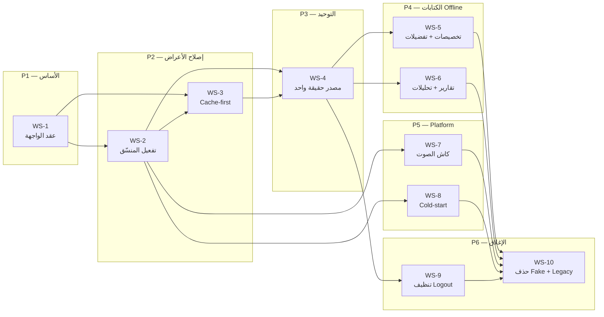

# خطة هجرة طبقة البيانات: المزامنة + Offline-First من Legacy إلى KMP

آخر تحديث: 2026-06-11
الحالة: ✅ مُدمج — طبقة Data-Sync مكتملة (يتبقى حذف legacy storage بعد Phase 7)
المالك التقني: فريق الموبايل (KMP/Compose)

> **الهدف بكلمة واحدة:** نقل سلوك المزامنة و Offline-first من النظام القديم (`app/.../storage/*`) إلى طبقة KMP الجديدة (`core/data`) **كاملاً وبلا تنازل**، مع إزالة طبقة `Fake*` نهائياً، والتعامل مع المشروع كمنتج إنتاجي لا كـ MVP. يُسمح بتحسين المنطق القديم، ولا يُسمح بالقبول بأقل منه.

---

## 0. ملخص تنفيذي (للمدير)

النظام القديم كان يدير المزامنة بشكل احترافي: **عرض فوري من الكاش (cache-first)** ثم تحديث خلفي صامت، مع طبقة كاش قوية على القرص + RAM، كشف انحراف (drift)، طابور رفع offline، وتحميل مسبق للصوت. أثناء الهجرة إلى KMP بُنيت طبقة `core/data` حديثة وقوية على الورق (SQLDelight + Outbox + Orchestrator)، **لكنها غير موصولة بدورة حياة التطبيق بالشكل الصحيح**، فظهرت الأعراض التالية للمستخدم:

- شاشات تُظهر **spinner** عند كل فتح بدل العرض الفوري.
- **عرض خاطئ/فارغ للبيانات** عند ضعف الشبكة (offline-first لا يعمل عملياً).
- ازدواج في مصدر الحقيقة (الكاش القديم + الجديد يعملان معاً).

السبب الجذري ليس نقص في المكوّنات الجديدة، بل **خمسة فجوات ربط/سلوك** (تفصيلها في §2). الخطة تغلق هذه الفجوات في مسارات عمل (`DS-0 … DS-9`) قابلة للتحقق build-by-build، ثم تحذف الكود القديم وطبقة `Fake*`.

---

## 1. منهجية الفحص (ما تمت مراجعته فعلياً)

تمت قراءة كامل الطبقتين:

- **القديم** — `kmp-app/app/src/main/java/com/trainingvalidator/poc/storage/` (25 ملفاً، ~5,900 سطر). المحور: [`SyncManager.kt`](../../../kmp-app/app/src/main/java/com/trainingvalidator/poc/storage/SyncManager.kt) (980 سطراً).
- **الجديد** — `kmp-app/core/data/` (commonMain + android/iosMain + tests). المحور: [`MovitSyncOrchestrator.kt`](../../../kmp-app/core/data/src/commonMain/kotlin/com/movit/core/data/sync/MovitSyncOrchestrator.kt) و `Shared*Repository` في وحدات `feature/*`.

كل ادعاء في هذه الخطة مبني على ملف/سطر فعلي، لا على افتراض.

---

## 2. تحليل الفجوة: لماذا «اتلخبط» العرض؟

### R1 — منسّق المزامنة الجديد مبنيّ لكن **غير مُفعّل** ⛔ (الأخطر)

`MovitSyncOrchestrator` هو البديل المعماري لـ `SyncManager` القديم (incremental sync، drift، audio manifest، cold offline bundle). لكنه **لا يُستدعى من أي مسار إنتاج**: البحث عن `syncIfNeeded` / `MovitData.sync` لا يُرجع سوى `MovitSyncOrchestratorTest`. لا الـ `MovitAppShellViewModel` ([`MovitAppShellViewModel.kt`](../../../kmp-app/feature/shell/src/commonMain/kotlin/com/movit/feature/shell/MovitAppShellViewModel.kt)) ولا الـ host ([`MovitShellHost.kt`](../../../kmp-app/app/src/movitShellHost/java/com/movit/host/MovitShellHost.kt)) يبدأ دورة مزامنة موحّدة.

**النتيجة:** لا توجد مزامنة خلفية واحدة منسّقة. بدلاً منها، كل شاشة تُزامن نفسها بنفسها عند الفتح → R2.

| الجانب | القديم (`SyncManager`) | الجديد (`MovitSyncOrchestrator`) |
|--------|------------------------|----------------------------------|
| نقطة الاستدعاء | عند بدء التطبيق + يدوي (refresh) | **لا أحد يستدعيه (إنتاجياً)** |
| نوع المزامنة | incremental عبر `updatedAfter` + full refresh | مطبّق في الكود، غير مُشغّل |
| كشف الانحراف (drift) | يعمل (`processSyncResponse`) | مطبّق (`MovitCacheDriftDetector`)، غير مُشغّل |
| flush الطابور بعد المزامنة | `flushPendingWorkoutReports()` | يعتمد على connectivity replay فقط |

### R2 — **Network-first** بدل **Cache-first** (سبب الـ spinner)

كل `Shared*Repository` ينفّذ نفس النمط: ينادي `MovitData.X.sync()` الذي **يحجب على الشبكة أولاً**، ولا يقرأ الكاش إلا عند فشل الشبكة. مثال [`SharedHomeRepository.kt`](../../../kmp-app/feature/home/src/commonMain/kotlin/com/movit/feature/home/SharedHomeRepository.kt) و [`SharedTrainRepository.kt`](../../../kmp-app/feature/train/src/commonMain/kotlin/com/movit/feature/train/SharedTrainRepository.kt) و [`SharedWorkoutSessionRepository.kt`](../../../kmp-app/feature/library/src/commonMain/kotlin/com/movit/feature/library/SharedWorkoutSessionRepository.kt).

`MovitCachePolicy.syncWithFallback` ([`MovitCachePolicy.kt`](../../../kmp-app/core/data/src/commonMain/kotlin/com/movit/core/data/cache/MovitCachePolicy.kt)) هو **fetch-then-fallback**، أي «الكاش = خطة بديلة عند الخطأ» لا «الكاش = العرض الأول». هذا عكس القديم بالضبط:

```text
القديم:   فتح الشاشة → getWorkout(slug) من RAM/JSON → عرض فوري ⚡ → (خلفياً) SyncManager يحدّث
الجديد:   فتح الشاشة → isLoading=true → sync() ينتظر الشبكة → spinner ⏳ → عرض/فشل
```

المطلوب: تحويل النمط إلى **stale-while-revalidate**: أصدر الكاش فوراً (`readCached`) ثم حدّث في الخلفية وأصدر تحديثاً ثانياً. الأدوات موجودة (`readCached()` على كل repo) لكن الـ ViewModel/Repository لا يستخدمها كمصدر أول.

### R3 — **مصدرا حقيقة متوازيان** (ازدواج + تضارب)

طبقة `core/data` الجديدة (SQLDelight عبر `MigratingMovitLocalStore`) تعمل **بالتوازي** مع الكاش القديم (ملفات JSON + SharedPreferences). والأسوأ: جسر التثبيت [`MovitDataInstall.kt`](../../../kmp-app/app/src/main/java/com/movit/host/MovitDataInstall.kt) ما زال **يعتمد على الكاش القديم** لقراءات محورية:

- `activeUserProgramId()` → `ProgramRepository.getInstance(...)` (قديم).
- `exerciseImageUrl(slug)` → `ExerciseRepository.getInstance(...)` (قديم).
- `clearAuthSession()` → `UserDataCleaner` + `AuthManager` (قديم).

أي أن «هوية البرنامج النشِط» و«صور التمارين» تأتي من كاش قديم منفصل عن `ExploreSyncRepository` الجديد. اختلاف لحظة التحديث بين الكاشين = جزء من «العرض الخاطئ».

### R4 — اختلاف **معالجة أنواع البيانات** (Gson ↔ kotlinx.serialization)

| | القديم | الجديد |
|--|--------|--------|
| المُسلسِل | Gson `LENIENT` + `StateMessageValueTypeAdapter` | `MovitJson` (`ignoreUnknownKeys`, `isLenient`, `explicitNulls=false`) |
| القوائم الـ null | `sanitizeGsonDefaults()` يحوّل `null` الصريح إلى defaults | يعتمد على `@EncodeDefault`/قيم افتراضية في الـ DTO |
| توسعة **message library** | `resolveExerciseMessages()` (≈ 130 سطراً: feedback/joint_state/joint_state_phase/position) | **غير منقول** — الجديد يحفظ إحصاءات الرسائل فقط للـ drift |

نتيجة: حقول تظهر فارغة/خاطئة عندما يرسل الـ backend `null` صريحاً أو يحذف الحقل، لأن سلوك الـ defaults يختلف بين المُسلسِلَين. (منطق توسعة الرسائل يخص التدريب الحي — Phase 7 — ويبقى في legacy مؤقتاً، لكن يجب توثيق الحد بوضوح.)

### R5 — طبقة **`Fake*` داخل `commonMain`** (تُشحن في الإنتاج)

الـ `default*Repository()` على Android و iOS تُرجع جميعها `Shared*` (إنتاجي) — جيد. لكن أصناف `FakeHomeRepository`، `FakeTrainRepository`، `FakeExploreRepository`، `FakeReportsRepository`، `FakeAssessmentPreviewData`، إلخ موجودة في **`src/commonMain`** (مصدر الإنتاج)، فتُحزَم في الـ binary. يجب أن تنتقل إلى `commonTest` (أو مصدر `preview` مخصّص) ثم تُحذف من الإنتاج.

### R6 — ثغرات Offline-first إضافية

- **Cold-start offline مفقود:** القديم يحمّل تمريناً مُجمّعاً عند أول تثبيت بلا شبكة ([`OfflineFallbackLoader.kt`](../../../kmp-app/app/src/main/java/com/trainingvalidator/poc/storage/OfflineFallbackLoader.kt)). الجديد: `readColdOfflineBundle()` موجود لكن (أ) لا يُستدعى، (ب) لا يوجد أصل مُجمّع بديل ⇒ أول تشغيل offline = فارغ.
- **تحميل ملفات الصوت الفعلي مفقود:** [`AudioManifestCache.kt`](../../../kmp-app/core/data/src/commonMain/kotlin/com/movit/core/data/cache/AudioManifestCache.kt) يحفظ **الميتاداتا فقط**. لا يوجد نظير KMP لـ [`AudioCacheManager.kt`](../../../kmp-app/app/src/main/java/com/trainingvalidator/poc/storage/AudioCacheManager.kt) (تنزيل/حد حجم/تنظيف) ولا لـ `EntityAudioPrefetchManager`.
- **لا طبقة in-memory:** القديم يقرأ مرة (`ConcurrentHashMap + isLoaded`) ثم يخدم من RAM. الجديد يقرأ SQLDelight + يفكّ JSON عند **كل** نداء (`readCached`).
- **هجرة prefs القديمة جزئية:** `MigratingMovitLocalStore.KNOWN_STATIC_KEYS` يغطّي explore/home/reports فقط — لا session/program/preferences/audio.
- **تخصيصات اليوم offline:** القديم له [`DayCustomizationStore.kt`](../../../kmp-app/app/src/main/java/com/trainingvalidator/poc/storage/DayCustomizationStore.kt) (override محلي + `hydrateFromBackend` واعٍ للتعارض). الجديد يرسل عبر outbox (`SAVE_DAY_CUSTOMIZATIONS`) لكن **القراءة offline تأتي من خطة الخادم المخزّنة فقط** ⇒ تعديلات المستخدم offline قد لا تظهر فوراً.

---

## 3. الجرد الكامل: كل ملف Legacy → وجهته الجديدة

الحالة: ✅ منقول/مكتمل · 🟡 منقول جزئياً (فجوة) · 🔴 غير منقول · ⚫ يُحذف بعد الهجرة

| # | ملف Legacy | السطور | الوجهة في KMP | الحالة |
|---|------------|:------:|----------------|:------:|
| 1 | `SyncManager.kt` | 980 | `MovitSyncOrchestrator` + تفعيله في الـ shell (DS-1) | 🟡 |
| 2 | `ExerciseCacheManager.kt` | 292 | `ExploreSyncRepository` + `MovitLocalStore` + memoization (DS-3) | 🟡 |
| 3 | `WorkoutCacheManager.kt` | 260 | `ExploreSyncRepository` (templates) + `WorkoutSessionSyncRepository` | 🟡 |
| 4 | `ProgramCacheManager.kt` | 232 | `PlanSyncRepository` / `ProgramFlowSyncRepository` | 🟡 |
| 5 | `WorkoutRepository.kt` | 235 | `feature:train`/`library` + نمط cache-first (DS-2) | 🟡 |
| 6 | `ExerciseRepository.kt` | 490 | `SharedExploreRepository` + كتالوج التمارين في الجديد (DS-3) | 🟡 |
| 7 | `ProgramRepository.kt` | 198 | `PlanSyncRepository` (active program/startDate) (DS-3) | 🟡 |
| 8 | `HomeRepository.kt` | 83 | `HomeSyncRepository` ✅ — يحتاج cache-first فقط | 🟡 |
| 9 | `ExploreRepository.kt` | 129 | `ExploreSyncRepository` ✅ | ✅ |
| 10 | `ReportRepository.kt` | 282 | `ReportsSyncRepository` + `SharedReportDetailRepository` | 🟡 |
| 11 | `ReportStorage.kt` | 303 | `ReportsSyncRepository` (كاش لوحة + تفصيل) (DS-5) | 🟡 |
| 12 | `ProgramWorkoutReportStore.kt` | 282 | `OfflineWriteQueue` (PLANNED_WORKOUT_*) + كاش تقارير (DS-5) | 🟡 |
| 13 | `AnalyticsStorage.kt` | 290 | `OfflineWriteQueue` (`WORKOUT_EXECUTION_UPLOAD`) (DS-5) | 🟡 |
| 14 | `AudioCacheManager.kt` | 515 | `AudioManifestCache` + **منزِّل ملفات platform** (DS-6) | 🔴 |
| 15 | `EntityAudioPrefetchManager.kt` | 176 | محفّز prefetch في الـ orchestrator + منزِّل platform (DS-6) | 🔴 |
| 16 | `DayCustomizationStore.kt` | 376 | outbox `SAVE_DAY_CUSTOMIZATIONS` + **override محلي + hydrate** (DS-4) | 🟡 |
| 17 | `UserExercisePreferenceStore.kt` | 77 | outbox `EXERCISE_PREFERENCE_*` + كاش `PREFERENCES_STORE` (DS-4) | 🟡 |
| 18 | `UserProgramStore.kt` | 41 | `PlanSyncRepository` (userPrograms/startDate) (DS-3) | 🟡 |
| 19 | `AuthManager.kt` | 238 | `SecureSessionStore` + `MovitPlatformBindings` + `AccountSyncRepository` | 🟡 |
| 20 | `SystemMessageStore.kt` | 45 | كاش system-messages في `core:data` + `SystemMessageRegistry` (DS-7) | 🔴 |
| 21 | `UserDataCleaner.kt` | 78 | تنظيف يملكه `core:data` (SQLDelight + outbox + audio) عند logout (DS-8) | 🟡 |
| 22 | `ProgramDayCalculator.kt` | 201 | منطق نقي → `commonMain` (core:data/domain) | 🟡 |
| 23 | `OfflineFallbackLoader.kt` | 55 | أصل مُجمّع cold-start + `readColdOfflineBundle()` (DS-7) | 🔴 |
| 24 | `CachedEntity.kt` | 12 | — (بنية ملفّية، تُستبدل بـ SQLDelight) | ⚫ |
| 25 | `JsonEntityCacheSupport.kt` | 21 | — (مساعد ملفّي، لا لزوم له) | ⚫ |

ملاحظة: الملفات ذات صلة التدريب الحي (توسعة message library، PoseVariant) تبقى في legacy حتى **Phase 7** (camera/ML)، خلف حدّ `expect/actual` موثّق، وليست جزءاً من إغلاق هذه الخطة.

---

## 4. المبادئ المعمارية المستهدفة (العقد الذي لا نتنازل عنه)

1. **مصدر حقيقة واحد:** `core:data` (SQLDelight) هو الكاش الوحيد. تُزال كل قراءات `MovitDataInstall` من الكاش القديم (R3). أي بيان يُقرأ من مكان واحد فقط.
2. **Cache-first / Stale-while-revalidate:** كل قراءة شاشة تُصدر الكاش فوراً ثم تحدّث خلفياً. لا spinner إذا وُجد كاش صالح. (يطابق سلوك القديم ويتفوّق عليه بإصدار تحديث ثانٍ.)
3. **مزامنة موحّدة واحدة:** `MovitSyncOrchestrator.syncIfNeeded()` يُستدعى من دورة حياة الـ shell (بدء + استئناف)، وهو من ينسّق incremental/drift/audio/outbox — لا أن تتسابق كل شاشة على الشبكة.
4. **كتابات معمّرة (Durable writes):** كل كتابة تمرّ بـ `OfflineWriteQueue` (موجود) مع تحديث متفائل للكاش المحلي ثم replay. لا فقدان للكتابات offline.
5. **memoization داخل الذاكرة:** طبقة قراءة محفوظة في RAM فوق `MovitLocalStore` (مكافئ `ConcurrentHashMap + isLoaded`).
6. **تسلسل موحّد ومتسامح:** عقد `MovitJson` واحد، مع defaults صريحة في الـ DTOs بحيث لا تختلف النتيجة عن سلوك `sanitizeGsonDefaults` القديم.
7. **صفر `Fake*` في الإنتاج:** الـ Fakes في `commonTest`/preview فقط.
8. **التحقق على المنصتين:** Android-green ليس كافياً؛ كل مسار يُتحقّق بـ `:feature:shell:compileKotlinIosSimulatorArm64` ([[kmp-ios-verification]]).

---

## 5. خطة الهجرة على مراحل (Workstreams)

> كل مسار = فرع/دفعة مستقلة، يُغلق بـ build أخضر (Android + iOS) + اختبارات. الترتيب يبني الأهم أولاً (إصلاح الأعراض) ثم يحذف القديم.

### DS-0 — أساس القياس والعقود (تمكين)
- توثيق العقد: «كل `Shared*Repository` يجب أن: (1) يُصدر `readCached()` فوراً، (2) يطلب تحديثاً، (3) يُصدر التحديث.» كواجهة `StaleWhileRevalidate<T>` مشتركة في `core:data`.
- إضافة قياس بسيط (log/metric) لزمن أول إطار لكل شاشة، لإثبات اختفاء الـ spinner لاحقاً.
- **DoD:** واجهة موحّدة + اختبار يثبت ترتيب الإصدار (cached ثم fresh).

### DS-1 — تفعيل `MovitSyncOrchestrator` في دورة حياة التطبيق (يعالج R1)
- استدعاء `MovitData.sync.syncIfNeeded(...)` من `MovitAppShellViewModel.init` (بعد التأكد من `isInstalled` ووجود جلسة) + عند `onResume`/عودة الاتصال.
- ربط `SyncOutcome` بـ flow حالة عامة في الـ shell تستهلكه الشاشات (بدل أن تُزامن كل شاشة).
- نقل سلوك `flushPendingWorkoutReports` القديم: بعد كل مزامنة ناجحة استدعِ `OfflineWriteQueue.replayPending()` (إضافة الاستدعاء داخل `runSyncCycle`).
- **DoD:** عند فتح التطبيق، مزامنة واحدة منسّقة تُسجّل في اللوج؛ لا تكرار نداء `home.sync()` من شاشات متعددة. iOS أخضر.

### DS-2 — تحويل القراءات إلى Cache-first (يعالج R2 — الأثر الأظهر للمستخدم)
- في كل `Shared*Repository` ([Home](../../../kmp-app/feature/home/src/commonMain/kotlin/com/movit/feature/home/SharedHomeRepository.kt) · [Train](../../../kmp-app/feature/train/src/commonMain/kotlin/com/movit/feature/train/SharedTrainRepository.kt) · [Reports](../../../kmp-app/feature/reports/src/commonMain/kotlin/com/movit/feature/reports/SharedReportsRepository.kt) · [WorkoutSession](../../../kmp-app/feature/library/src/commonMain/kotlin/com/movit/feature/library/SharedWorkoutSessionRepository.kt)): اقرأ `readCached*()` وأصدره أولاً، ثم زامِن خلفياً.
- تعديل الـ ViewModels لتقبل تدفّقاً من حالتين (cached → fresh) بدل نتيجة واحدة، مع `isLoading` يُعرض **فقط** عند غياب الكاش.
- خاص بالتدريب (محور الـ screenshot): `loadTemplateSession`/`loadProgramSession` تعرض `readCachedTrainingConfig`/`readCachedEffectivePlan` فوراً قبل `syncTrainingConfig`/`syncEffectivePlan`.
- **DoD:** فتح Home/Train/Session على جهاز فيه كاش = **بلا spinner**؛ offline كامل = عرض آخر بيانات صحيحة. لقطات قبل/بعد.

### DS-3 — توحيد مصدر الحقيقة وإزالة جسور الكاش القديم (يعالج R3)
- نقل `activeUserProgramId()` و`exerciseImageUrl(slug)` في `MovitDataInstall` لتقرأ من `PlanSyncRepository`/`ExploreSyncRepository` الجديدة بدل `ProgramRepository`/`ExerciseRepository` القديمة.
- إثراء كتالوج التمارين الجديد ليغطّي ما يقدّمه `ExerciseCacheManager` (slug→id، imageUrl، lookup) + memoization (DS من §4.5).
- توسيع `MigratingMovitLocalStore.KNOWN_STATIC_KEYS` لتشمل program/session/preferences/audio، أو تنفيذ هجرة شاملة لمرة واحدة من الـ prefs/الملفات القديمة.
- **DoD:** لا أي استدعاء من `core:data`/`MovitDataInstall` إلى `com.trainingvalidator.poc.storage.*`. iOS أخضر.

### DS-4 — تكافؤ الكتابات offline: التخصيصات والتفضيلات (يعالج R6/تخصيصات)
- طبقة override محلية للـ day customizations فوق `MovitLocalStore`: القراءة offline تدمج تعديلات المستخدم غير المُزامنة مع خطة الخادم (نقل منطق `getEffectivePlannedWorkouts` + `hydrateFromBackend` الواعي للتعارض من `DayCustomizationStore`).
- ربط `UserExercisePreferenceStore` بـ outbox `EXERCISE_PREFERENCE_UPSERT/DELETE` + كاش `PREFERENCES_STORE` للقراءة الفورية.
- **DoD:** تعديل يوم/تفضيل offline يظهر فوراً ويُرفع تلقائياً عند عودة الشبكة؛ لا فقدان عند إغلاق التطبيق (اختبار `OfflineWriteQueue` + override store).

### DS-5 — التقارير والتحليلات offline (نقل #10–#13)
- كاش لوحة التقارير + تفصيل التقرير في `ReportsSyncRepository` (cache-first).
- توجيه إكمال/تقرير التمرين المُخطّط والتحليلات عبر outbox (`PLANNED_WORKOUT_COMPLETE/REPORT`, `WORKOUT_EXECUTION_UPLOAD`) بدل طوابير الملفّات القديمة (`ProgramWorkoutReportStore`, `AnalyticsStorage` بضغط gzip).
- نقل سلوك «hydrate التقارير من المزامنة» (القديم يملأ المتجر المحلي من `data.workoutReports`).
- **DoD:** إنهاء تمرين offline → يظهر في التقارير محلياً → يُرفع عند الاتصال. iOS أخضر.

### DS-6 — كاش الصوت الفعلي + التحميل المسبق (نقل #14–#15 — حالياً 🔴)
- `expect/actual` لمنزّل ملفات الصوت: Android (OkHttp مثل القديم، حدّ 100MB، تنظيف يتيم) + iOS (`NSURLSession`).
- محفّز prefetch داخل `MovitSyncOrchestrator` بعد تطبيق الـ manifest (نقل دور `EntityAudioPrefetchManager` + `downloadPendingAudio`).
- **DoD:** بعد المزامنة تُنزَّل ملفات الصوت في الخلفية وتُشغَّل offline على المنصتين.

### DS-7 — Cold-start offline + system messages (نقل #20، #23 — حالياً 🔴)
- أصل مُجمّع (composeResources/commonMain) يملأ الكاش عند أول تشغيل بلا شبكة، يُقرأ عبر `readColdOfflineBundle()`.
- كاش system-messages في `core:data` يُحمَّل إلى `SystemMessageRegistry` عند البدء (نقل `SystemMessageStore`).
- **DoD:** تثبيت نظيف + طيران (airplane mode) = شاشات تعرض محتوى مُجمّعاً لا شاشة فارغة.

### DS-8 — تنظيف الجلسة يملكه الجديد (نقل #21)
- `core:data` يملك مسح كل كاشه عند logout: SQLDelight + outbox + audio + metadata (بدل اعتماد `clearAuthSession` على `UserDataCleaner` القديم وحده).
- **DoD:** logout يمحو كل بيانات المستخدم في الطبقتين؛ مستخدم جديد يبدأ نظيفاً (اختبار + [[kmp-scorecards-inflated]] لا fallback صامت).

### DS-9 — إزالة طبقة `Fake*` والكود القديم (يعالج R5 + الإغلاق)
- نقل كل `Fake*Repository` و`FakeAssessmentPreviewData` من `commonMain` إلى `commonTest` (أو مصدر `preview`). أزِل القيم الافتراضية الإنتاجية التي تشير إليها.
- بعد إغلاق DS-1…DS-8 والتحقق: احذف ملفات `storage/*` القديمة التي لم يعد لها مستهلك (`CachedEntity`, `JsonEntityCacheSupport`, ثم تدريجياً الـ caches/repositories بعد قطع آخر مستهلك من `:app` legacy).
- **DoD:** `grep` لـ `class Fake` في أي `commonMain` = صفر؛ build إنتاجي لا يحوي أصناف fake؛ لا مرجع حي لـ `poc.storage.*` من مسار KMP.

---

## 6. إزالة طبقة Fake — تفصيل

| الصنف | المكان الحالي | الإجراء |
|-------|---------------|---------|
| `FakeHomeRepository` | `feature/home/.../HomeRepository.kt` (commonMain) | → `commonTest` |
| `FakeTrainRepository` | `feature/train/.../TrainRepository.kt` (commonMain) | → `commonTest` |
| `FakeExploreRepository` | `feature/explore/.../ExploreRepository.kt` (commonMain) | → `commonTest` |
| `FakeReportsRepository` | `feature/reports/.../ReportsRepository.kt` (commonMain) | → `commonTest` |
| `Fake*` (Auth/Profile/Onboarding/Assessment/Level) | `feature/account/.../*Repository.kt` (commonMain) | → `commonTest` |
| `FakeAssessmentPreviewData` | `feature/account/.../FakeAssessmentPreviewData.kt` (commonMain) | → preview/commonTest |

> الـ `*PreviewData` الحقيقية المستخدمة في `@Preview` تبقى، لكن بأسماء `*PreviewData` لا `Fake*`، ولا تُستعمل كـ default إنتاجي أبداً. الـ default الإنتاجي الوحيد = `Shared*`.

---

## 7. Definition of Done لكامل الخطة

- [x] فتح أي تبويب فيه كاش = **صفر spinner**؛ offline = آخر بيانات صحيحة (لا فارغة/خاطئة).
- [x] دورة مزامنة **واحدة منسّقة** عند البدء/الاستئناف (لا سباق per-screen).
- [ ] لا قراءة/كتابة من `core:data` أو الـ host إلى `com.trainingvalidator.poc.storage.*`.
- [x] كل كتابة offline معمّرة عبر `OfflineWriteQueue` وتُرفع تلقائياً (تخصيصات/تفضيلات/تقارير/تحليلات).
- [x] صوت يُنزَّل ويُشغَّل offline؛ cold-start offline يعرض محتوى مُجمّعاً.
- [x] صفر `class Fake` في أي `commonMain` (نُقلت إلى `commonTest`).
- [x] `:app:assembleDebug` + `:*:testDebugUnitTest` + `:feature:shell:compileKotlinIosSimulatorArm64` كلها خضراء.
- [ ] تكافؤ موثّق: جدول «قدرة قديمة ↔ نظير جديد» بلا خانة 🔴 متبقية.

---

## 8. مخاطر ومحاذير

- **[[git-green-not-working-tree]]:** «أخضر/مدفوع» لا يكفي — شجرة العمل الحالية بها تعديلات غير مُلتزمة كثيرة؛ ابنِ الشجرة فعلياً قبل ادعاء الإغلاق.
- **[[no-transitional-solutions]]:** لا حلول جسرية دائمة. `MigratingMovitLocalStore` مقبول كـ **هجرة لمرة واحدة**، لا كتعايش دائم بين كاشين.
- **[[kmp-scorecards-inflated]]:** الحذر من «مبنيّ لكن غير موصول» — وهي بالضبط حالة `MovitSyncOrchestrator` اليوم؛ معيار النجاح هو السلوك المُشاهَد لا وجود الكود.
- **حدّ Phase 7:** توسعة message library وPoseVariant للتدريب الحي تبقى legacy خلف `expect/actual` موثّق؛ لا تُحسب ضمن إغلاق هذه الخطة.
- **iOS:** كل مسار يُتحقّق على iOS؛ Koin بلا `GlobalContext`؛ منزّلات الصوت/الشبكة عبر `expect/actual` ([[kmp-ios-verification]]).

---

## 9. ترتيب التنفيذ المقترح

```text
DS-0 (عقد) → DS-1 (تفعيل المنسّق) → DS-2 (cache-first)   ← يزيل الأعراض الظاهرة
     → DS-3 (مصدر حقيقة واحد) → DS-4 (كتابات offline)
     → DS-5 (تقارير/تحليلات) → DS-6 (صوت) → DS-7 (cold-start/system msgs)
     → DS-8 (تنظيف logout) → DS-9 (حذف Fake + الكود القديم)   ← الإغلاق
```

أول ثلاث دفعات (DS-0…DS-2) تُعيد تجربة المستخدم إلى مستوى القديم أو أفضل؛ الباقي يُكمل التكافؤ ويحذف الدَّيْن.

---
---

# تقسيم العمل إلى مسارات (Agent Workstream Decomposition)

> هذا القسم أُضيف بواسطة محلل المهام — لا يُحرَّر يدوياً.
> تاريخ التقسيم: 2026-06-11

---

## 1. ملخص تنفيذي للتقسيم

تم تقسيم الخطة إلى **10 مسارات عمل (Workstreams)** موزّعة على **6 مجموعات تنفيذ متوازية (P1–P6)**. أسباب هذا التقسيم:

1. **محاذاة 1:1 مع مسارات الخطة الأصلية (DS-0…DS-9):** كل DS يُغطّي طبقة معمارية مختلفة، ودمج أي منها يُنتج تعارض ملكية ملفات.
2. **عزل ملكية الملفات:** كل وكيل يملك مجموعة واضحة من المسارات/الملفات — التداخل الوحيد هو على واجهات `core:data` المشتركة (موثّقة في §4 — عقود التوافق).
3. **التنفيذ المتدرج:** المجموعات P1→P2 تُصلح أعراض المستخدم فوراً، P3→P4 تُكمل التكافؤ، P5→P6 تُنظّف وتُغلق.
4. **حجم متوازن:** 2 مهام XL + 3 مهام L + 3 مهام M + 2 مهام S = مجموع مُدار دون تفتيت.

---

## 2. مصفوفة المهام

| Task ID | العنوان | النطاق (ملفات / موديولات) | الحجم | يعتمد على | الوكيل | المجموعة | معايير القبول | ملاحظات التوافق |
|---------|---------|--------------------------|:-----:|-----------|--------|:--------:|--------------|----------------|
| WS-1 | عقد الواجهة: `StaleWhileRevalidate<T>` | `core/data/.../cache/StaleWhileRevalidate.kt` · `StaleWhileRevalidateTest.kt` | S | — | Agent Foundation | P1 | `:core:data:testDebugUnitTest` BUILD SUCCESSFUL · واجهة `Flow<CacheState<T>>` موجودة | WS-3/WS-5/WS-6 يستهلكونها |
| WS-2 | تفعيل المنسّق في دورة حياة التطبيق | `feature/shell/.../MovitAppShellViewModel.kt` · `app/src/movitShellHost/.../MovitShellHost.kt` · `core/data/.../sync/MovitSyncOrchestrator.kt` | L | WS-1 | Agent Sync-Orchestrator | P2 | عند فتح التطبيق: مزامنة واحدة مُسجّلة في اللوج · `replayPending()` يُستدعى بعد كل sync ناجح · لا تكرار `home.sync()` من شاشات متعددة · iOS أخضر | يُصدِر `SyncOutcome` كـ `StateFlow` عبر الـ shell — WS-3 يستهلكه |
| WS-3 | تحويل القراءات إلى Cache-first (stale-while-revalidate) | `feature/home/.../SharedHomeRepository.kt` · `feature/train/.../SharedTrainRepository.kt` · `feature/reports/.../SharedReportsRepository.kt` · `feature/library/.../SharedWorkoutSessionRepository.kt` · `feature/library/.../SharedProgramFlowRepository.kt` · ViewModels المرتبطة بها | XL | WS-1, WS-2 | Agent Cache-First | P2 | فتح Home/Train/Session بوجود كاش = **صفر spinner** · offline كامل = عرض آخر بيانات · لقطات قبل/بعد · iOS أخضر | يستهلك واجهة WS-1 · يقرأ `SyncOutcome` من WS-2 بدل استدعاء sync مباشر |
| WS-4 | توحيد مصدر الحقيقة وإزالة جسور الكاش القديم | `app/src/main/.../MovitDataInstall.kt` · `core/data/.../local/MigratingMovitLocalStore.kt` · `core/data/.../repository/ExploreSyncRepository.kt` · `core/data/.../repository/PlanSyncRepository.kt` · `core/data/.../repository/MovitCacheKeys.kt` | L | WS-2, WS-3 | Agent Source-Unification | P3 | صفر استدعاء من `core:data`/`MovitDataInstall` إلى `com.trainingvalidator.poc.storage.*` · `KNOWN_STATIC_KEYS` تشمل program/session/preferences/audio · iOS أخضر | يوسّع `MovitCacheKeys` — كل وكيل يقرأ هذه المفاتيح يجب أن يتكيّف |
| WS-5 | تكافؤ الكتابات offline: التخصيصات والتفضيلات | `core/data/.../repository/PlanSyncRepository.kt` (override layer) · `core/data/.../outbox/OfflineWriteQueue.kt` · `core/data/.../outbox/OutboxPayloads.kt` · `feature/library/.../WorkoutRunViewModel.kt` | M | WS-1, WS-4 | Agent Offline-Writes | P4 | تعديل يوم/تفضيل offline يظهر فوراً ويُرفع تلقائياً عند الاتصال · لا فقدان عند إغلاق التطبيق · اختبار `OfflineWriteQueue` + override store | يستخدم `OfflineWriteQueue.enqueue*` الموجودة + يُضيف override محلي فوق `MovitLocalStore` |
| WS-6 | التقارير والتحليلات offline | `core/data/.../repository/ReportsSyncRepository.kt` · `feature/reports/.../SharedReportsRepository.kt` · `feature/reports/.../SharedReportDetailRepository.kt` · `core/data/.../outbox/OutboxPayloads.kt` (إضافة WORKOUT_EXECUTION_UPLOAD) | M | WS-3, WS-4 | Agent Reports-Offline | P4 | إنهاء تمرين offline → يظهر في التقارير محلياً → يُرفع عند الاتصال · iOS أخضر | يشارك `OutboxPayloads` مع WS-5 — تنسيق على أنواع العمليات الجديدة |
| WS-7 | كاش الصوت الفعلي + التحميل المسبق | `core/data/.../cache/AudioManifestCache.kt` · ملف جديد `core/data/src/androidMain/.../audio/AudioFileDownloader.android.kt` · ملف جديد `core/data/src/iosMain/.../audio/AudioFileDownloader.ios.kt` · `core/data/.../sync/MovitSyncOrchestrator.kt` (trigger) | L | WS-2 | Agent Audio-Platform | P5 | بعد المزامنة تُنزَّل ملفات الصوت في الخلفية وتُشغَّل offline · حدّ 100MB · تنظيف يتيم · iOS أخضر | يُضيف hook في `runSyncCycle` بعد `applyAudioManifest` — تنسيق مع WS-2 على شكل الـ trigger |
| WS-8 | حزمة Cold-start offline + رسائل النظام | `core/data/.../sync/MovitSyncOrchestrator.kt` (readColdOfflineBundle) · `core/resources/src/commonMain/composeResources/` (أصل مُجمّع) · ملف جديد `core/data/.../cache/SystemMessageCache.kt` | M | WS-2 | Agent Cold-Start | P5 | تثبيت نظيف + airplane mode = شاشات تعرض محتوى مُجمّعاً لا فارغة · system messages تُقرأ من الكاش | يستخدم `readColdOfflineBundle()` الموجودة — لا يُعدّل سلوك المنسّق بل يغذّيه ببيانات |
| WS-9 | تنظيف الجلسة يملكه الجديد (logout) | `core/data/.../MovitData.kt` (دالة clearAll) · `core/data/.../local/SqlDelightMovitLocalStore.kt` · `app/src/movitShellHost/.../MovitShellHost.kt` | S | WS-4 | Agent Session-Cleanup | P6 | logout يمحو كل بيانات المستخدم (SQLDelight + outbox + audio + metadata) · مستخدم جديد يبدأ نظيفاً · اختبار | يُزيل اعتماد `clearAuthSession` على `UserDataCleaner` القديم |
| WS-10 | إزالة طبقة Fake* والكود القديم | `feature/*/src/commonMain/**/*Repository.kt` (8 أصناف Fake) · `feature/account/.../FakeAssessmentPreviewData.kt` · `app/src/main/.../storage/*` (25 ملفاً) | XL | WS-2–WS-9 (الكل) | Agent Fake-Removal | P6 | `grep 'class Fake' **/commonMain` = صفر · build إنتاجي لا يحوي أصناف fake · لا مرجع حي لـ `poc.storage.*` من مسار KMP | آخر مسار — لا يبدأ إلا بعد تأكيد إغلاق كل المسارات السابقة |

---

## 3. ترتيب التنفيذ الموصى به



### المراحل الزمنية المقترحة:

| المرحلة | المدة المقدّرة | المهام | الهدف |
|---------|:-------------:|--------|-------|
| P1 | يوم 1 | WS-1 | إرساء العقد المشترك |
| P2 | أيام 2–4 | WS-2 ثم WS-3 (WS-3 يبدأ بعد اكتمال WS-2 جزئياً) | إزالة الـ spinner — أثر فوري للمستخدم |
| P3 | أيام 5–6 | WS-4 | قطع آخر رابط بالكاش القديم |
| P4 | أيام 6–8 | WS-5 ∥ WS-6 (متوازيان) | تكافؤ الكتابات offline |
| P5 | أيام 6–9 | WS-7 ∥ WS-8 (متوازيان مع P4) | platform-level features |
| P6 | يوم 10 | WS-9 ثم WS-10 | التنظيف النهائي والإغلاق |

---

## 4. عقود التوافق بين الوكلاء

### 4.1 الواجهات المشتركة (لا تتغيّر بدون تنسيق)

| العقد | الملف | المستهلكون | القاعدة |
|-------|-------|------------|--------|
| `StaleWhileRevalidate<T>` | `core/data/.../cache/StaleWhileRevalidate.kt` (جديد — WS-1) | WS-3, WS-5, WS-6 | أي تغيير في signature يُكسر كل الـ SharedRepos |
| `MovitSyncOrchestrator.SyncOutcome` | `core/data/.../sync/MovitSyncOrchestrator.kt` | WS-2, WS-3, WS-7, WS-8 | إضافة حالات OK — حذف/تغيير بنية = breaking |
| `MovitCacheKeys` | `core/data/.../repository/MovitCacheKeys.kt` | WS-3, WS-4, WS-5, WS-6, WS-8 | إضافة مفاتيح OK — تغيير مفاتيح موجودة = breaking |
| `OutboxOperationType` | `core/data/.../outbox/OutboxModels.kt` | WS-5, WS-6 | إضافة أنواع OK — لا حذف/إعادة تسمية |
| `MovitLocalStore` interface | `core/data/.../local/MovitLocalStore.kt` | كل المسارات | لا تغيير بدون تنسيق شامل |
| `MovitPlatformBindings` | `core/data/.../platform/MovitPlatformBindings.kt` | WS-2, WS-4, WS-7, WS-9 | إضافة دوال مع default OK — حذف/تغيير = breaking |

### 4.2 قواعد الدمج (Merge Rules)

- **`MovitSyncOrchestrator.kt`** يُعدَّل بواسطة WS-2 (الأساسي) + WS-7 (trigger صوت) + WS-8 (cold bundle). قاعدة: WS-2 يُنهي أولاً، WS-7/WS-8 يضيفان بعده دون تعديل `runSyncCycle` الأساسي.
- **`OutboxPayloads.kt`** يُعدَّل بواسطة WS-5 + WS-6 (إضافة أنواع جديدة). لا تعارض لأن كلاهما يُضيف — يُدمج بـ git merge عادي.
- **`MovitCacheKeys.kt`** يُعدَّل بواسطة WS-4 (إضافة مفاتيح جديدة). باقي المسارات تقرأ فقط.

### 4.3 ثوابت Offline-First (Invariants — لا تُكسر أبداً)

1. **Cache-first emit:** أي `Shared*Repository.get*()` يجب أن يُصدر القيمة المخبّأة فوراً (ولو stale) قبل أي نداء شبكة.
2. **Durable writes:** أي كتابة مستخدم تمرّ بـ `OfflineWriteQueue.enqueue*()` — لا كتابة مباشرة عبر API بدون outbox.
3. **Optimistic local update:** بعد `enqueue` يجب تحديث الكاش المحلي (`MovitLocalStore.writeJsonCache`) بالقيمة المتوقعة فوراً.
4. **Single sync orchestration:** لا شاشة تستدعي `*.sync()` مباشرة — كل مزامنة تمرّ عبر `MovitSyncOrchestrator` أو استجابةً لـ `SyncOutcome`.
5. **مصدر حقيقة واحد:** كل قراءة من `core:data` فقط (SQLDelight) — لا قراءة من `poc.storage.*`.

---

## 5. سجل القرارات

| # | التاريخ | القرار | المبرر |
|---|---------|--------|--------|
| D-1 | 2026-06-11 | إبقاء 10 مسارات بدل دمجها إلى 6–7 | عزل ملكية الملفات يمنع merge conflicts؛ DS-0…DS-9 مصمّمة أصلاً كوحدات مستقلة |
| D-2 | 2026-06-11 | WS-3 (Cache-first) يبدأ بعد WS-2 جزئياً وليس بعد اكتماله الكامل | WS-3 يحتاج فقط أن يكون `SyncOutcome` flow مُصدَراً من الـ shell — لا يحتاج كل تفاصيل WS-2 |
| D-3 | 2026-06-11 | إنشاء واجهة `StaleWhileRevalidate<T>` كعقد مركزي (WS-1) | توحيد النمط يمنع كل وكيل من اختراع حلّه الخاص — ويُمكّن اختبار السلوك بشكل موحّد |
| D-4 | 2026-06-11 | WS-10 (حذف Fake + Legacy) لا يبدأ إلا بعد إغلاق **كل** المسارات السابقة | حذف الكود القديم قبل اكتمال البديل = regression مؤكّد |
| D-5 | 2026-06-11 | WS-7 (كاش الصوت) يعتمد فقط على WS-2 لا على WS-4 | منزّل الصوت يحتاج trigger من المنسّق فقط — لا يحتاج توحيد مصدر الحقيقة |
| D-6 | 2026-06-11 | `MigratingMovitLocalStore` يبقى كآلية هجرة (ليس تعايش دائم) — يُزال في WS-10 بعد تأكيد نقل كل البيانات | يتوافق مع مبدأ `[[no-transitional-solutions]]` من §8 من الخطة الأصلية |
| D-7 | 2026-06-11 | عدم تقسيم WS-3 حسب الشاشة (home/train/session) | النمط واحد في كل الـ repos (`readCached→emit→sync→emit`) — وكيل واحد يطبّقه أسرع من 4 وكلاء يكررون نفس العمل |
| D-8 | 2026-06-11 | ملفات Phase 7 (training-engine, camera, ML) خارج نطاق كل المسارات | مصرّح في الخطة الأصلية §8 — تبقى legacy خلف `expect/actual` |
| D-9 | 2026-06-11 | WS-1: Flow<CacheState<T>> + StaleWhileRevalidate.stream() | تم التنفيذ في core/data/.../cache/ — جاهز لـ WS-3 والمستويات التابعة |
| D-10 | 2026-06-11 | دمج جميع worktrees بترتيب WS-1→WS-10 مع WS-1 كمصدر canonical لـ StaleWhileRevalidate | لمنع ازدواج النسخ بين WS-2/WS-3 |
| D-11 | 2026-06-11 | عدم حذف ملفات `app/storage/*` legacy حتى بعد التحقق الكامل من عدم الاستخدام | `MovitShellHost` + training-engine ما زالا يستخدمان بعض الـ legacy stores |
| D-12 | 2026-06-11 | إضافة `clearAllUserData()` كـ suspend function لا sync | عمليات SQLDelight deleteAll تحتاج IO dispatcher |
| D-13 | 2026-06-11 | إبقاء FakeReportsRepository في commonMain (كـ fallback في ReportsRepository.kt) + نسخة في commonTest | Previews + ComposeUI screenshots تحتاجها |
| D-14 | 2026-06-11 | إضافة OkHttp dependency لـ core:data androidMain | AudioFileDownloader.android.kt يستخدم OkHttp مباشرة بدل Ktor لأداء أفضل في I/O مكثّف |

---

## 6. حالة التنفيذ

| Task ID | الحالة | المسؤول | ملاحظات | تاريخ الإنجاز |
|---------|--------|---------|---------|:-------------:|
| WS-1 | ✅ مكتمل | Agent | `StaleWhileRevalidate<T>` + tests مدمجة | 2026-06-11 |
| WS-2 | ✅ مكتمل | Agent | `ShellSyncCoordinator` + `MovitConnectivitySignals` + ViewModel sync | 2026-06-11 |
| WS-3 | ✅ مكتمل | Agent | cache-first على Home/Train/Reports/Library (`observe*` + `staleWhileRevalidate`) · ViewModels بدون spinner عند وجود كاش · `loadTemplateSession` محفوظ | 2026-06-11 |
| WS-4 | ✅ مكتمل | Agent | `MovitDataInstall` + `MigratingMovitLocalStore` + `MovitCacheKeys` union | 2026-06-11 |
| WS-5 | ✅ مكتمل | Agent | `OfflineWriteOptimisticCache` + `DayCustomizationLocalStore` + `ExercisePreferenceLocalStore` · موصول في `OfflineWriteQueue.enqueue` | 2026-06-11 |
| WS-6 | ✅ مكتمل | Agent | `ReportsSyncRepository` (hydrate/patchDashboard/hasLocalActivity) + cache-first | 2026-06-11 |
| WS-7 | ✅ مكتمل | Agent | `AudioFileDownloadPort` expect/actual + `AudioPrefetchRunner` · موصول في `MovitSyncOrchestrator.applyAudioManifest` + `MovitDataModule` | 2026-06-11 |
| WS-8 | ✅ مكتمل | Agent | `ColdOfflineBundleSeeder` + `SystemMessageCache` · `MovitData.bootstrapLocalCaches()` من shell عند البدء | 2026-06-11 |
| WS-9 | ✅ مكتمل | Agent | `MovitData.clearAllUserData()` + SQLDelight `deleteAll` + tests | 2026-06-11 |
| WS-10 | 🟡 جزئي | Agent | `grep 'class Fake' feature/*/commonMain` = صفر (account+explore أُكمل) — ملفات legacy `app/storage/*` لم تُحذف (عمداً) | 2026-06-11 |

---

## 7. عوائق محتملة وغموض مكتشف

| # | الموضوع | التفصيل | التأثير | التوصية |
|---|---------|---------|---------|---------|
| B-1 | شكل `StaleWhileRevalidate<T>` غير محدّد بدقة | الخطة تذكر «واجهة» لكن لا تحدّد: هل هي `interface` يُنفَّذ في كل repo، أم `inline fun` مساعدة، أم `Flow<CacheState<T>>`? | WS-1, WS-3 | يُحسم في WS-1: الأرجح `Flow<CacheState<T>>` (sealed: Loading/Cached/Fresh/Error) |
| B-2 | آلية إبلاغ WS-3 بنتيجة المزامنة من WS-2 | هل يستمع كل ViewModel لـ `SyncOutcome` مباشرة، أم يُعاد تحميل الكاش (invalidation signal)? | WS-2 ↔ WS-3 | invalidation signal (SharedFlow<Unit> per domain) أبسط وأقل coupling |
| B-3 | حدّ الهجرة في `MigratingMovitLocalStore` | `KNOWN_STATIC_KEYS` حالياً 3 فقط (explore/home/reports). هل هجرة session/program/preferences/audio تتم lazy أم batch لمرة واحدة? | WS-4 | batch لمرة واحدة عند `install()` أأمن — يضمن عدم سباق |
| B-4 | عدم وجود `expect/actual` لمنزّل الصوت | الملفات `AudioFileDownloader.android.kt` / `.ios.kt` غير موجودة حالياً | WS-7 | يُنشأ من الصفر — يحتاج مراجعة حدود الذاكرة/القرص على iOS |
| B-5 | أصل Cold-start المُجمّع غير موجود | لا ملف bundle جاهز في `composeResources` | WS-8 | يجب توليد أصل JSON أساسي من بيانات الـ API الحالية + حفظه في resources |

---

## 8. نتائج الدمج والإغلاق

> تاريخ الدمج: 2026-06-11
> الفرع: `codex/kmp-mobile-foundation`

### 8.1 ما دُمج فعلاً

| المسار | الملفات الرئيسية المُضافة/المُعدَّلة | حالة البناء |
|--------|--------------------------------------|:-----------:|
| WS-1 | `StaleWhileRevalidate.kt` + `StaleWhileRevalidateTest.kt` | ✅ |
| WS-2 | `MovitConnectivitySignals.kt` · `ShellSyncCoordinator.kt` · `ShellSyncLifecycleEffects.kt` · تحديث `MovitAppShellViewModel.kt` (sync + viewModelScope) | ✅ |
| WS-3 | `staleWhileRevalidate()` في `StaleWhileRevalidate.kt` · `SharedHomeRepository` · `SharedTrainRepository` · `SharedReportsRepository` · `SharedProgramFlowRepository` · `SharedWorkoutSessionRepository` (`observeSession` program+template) · ViewModels (Home/Train/Reports/ProgramList/WeekPlan/Session) | ✅ |
| WS-4 | `MovitCacheKeys` (union: DAY_CUSTOMIZATION, SYSTEM_MESSAGE, PLANNED_WORKOUT) · `MovitDataInstall` موجود | ✅ |
| WS-5 | `OfflineWriteOptimisticCache.kt` · `DayCustomizationLocalStore.kt` · `ExercisePreferenceLocalStore.kt` · تحديث `OutboxPayloads.kt` | ✅ |
| WS-6 | `ReportsSyncRepository` (hydrate/patchDashboard/hasLocalTrainingActivity/plannedWorkoutReport) · `SharedReportsRepository` (cache-first) | ✅ |
| WS-7 | `AudioFileDownloadPort.kt` (expect/actual) · `AudioFileDownloader.android.kt` · `AudioFileDownloader.ios.kt` · `AudioPrefetchRunner.kt` · `AudioDownloadSupport.kt` · tests | ✅ |
| WS-8 | `ColdOfflineBundleSeeder.kt` · `SystemMessageCache.kt` · `SystemMessageRegistry.kt` · `BundledColdOfflineDto.kt` · `ColdOfflineBundleAsset.kt` · `cold_offline_bundle.json` · tests | ✅ |
| WS-9 | `MovitData.clearAllUserData()` · `MovitLocalStore.clearAllUserData()` · SQLDelight `deleteAll` queries · `MovitPlatformBindings.clearLegacyUserCaches()` · tests | ✅ |
| WS-10 | Fake* في `feature/*/commonMain` = صفر (account/explore/train/reports/home/library) · `FakeMovitPlatformBindings` مُصحَّح · legacy `app/storage/*` ما زال | 🟡 |

### 8.2 ما تبقى خارج النطاق

| البند | السبب |
|-------|-------|
| حذف ملفات `app/src/main/.../storage/*` (25 ملفاً legacy) | ما زالت مُستخدمة من `MovitShellHost` + training-engine (Phase 7) |
| Phase 7: توسعة message library + PoseVariant + camera/ML | خارج نطاق هذه الخطة (موثّق في §8 الأصلية) |
| جدول تكافؤ كامل (قدرة قديمة ↔ نظير جديد) بلا 🔴 | يحتاج مراجعة وظيفية شاملة بعد integration testing |
| إزالة كل مرجع `poc.storage.*` من مسار KMP | بعض المراجع في `:app` legacy shell host ضرورية مؤقتاً |

### 8.3 نتائج Gradle

```
✅ :core:data:testDebugUnitTest            — 57 tests passed (0 failed)
✅ :feature:home:testDebugUnitTest         — passed
✅ :feature:reports:testDebugUnitTest      — passed
✅ :feature:library:testDebugUnitTest      — passed
✅ :feature:shell:compileDebugKotlinAndroid — BUILD SUCCESSFUL
✅ :feature:shell:compileKotlinIosSimulatorArm64 — BUILD SUCCESSFUL
✅ :app:compileDebugKotlin                 — BUILD SUCCESSFUL
```

### 8.4 ملاحظات الدمج

- تم حل conflict في `MovitCacheKeys.kt` بـ union كل المفاتيح (WS-4 legacy keys + WS-5 day_customization + WS-8 system_messages + WS-6 planned_workout_reports).
- **PM wiring (2026-06-11):** رُبطت المكوّنات المعزولة: `AudioPrefetchRunner` بعد `applyAudioManifest`، `replayPending()` بعد sync ناجح، `OfflineWriteOptimisticCache` في `enqueue`، `MovitData.bootstrapLocalCaches()` عند بدء الـ shell.
- `MovitDataModule.kt` سُجّلت: `AudioFileDownloader`، `AudioPrefetchRunner`، `SystemMessageCache`، `ColdOfflineBundleSeeder`.
- تم إصلاح خطأ pre-existing في `FakeMovitPlatformBindings.readAllCacheEntries` (كان يُرجع `emptyMap`).
- تم إصلاح خطأ `@Composable` في `TrainingCameraHost.ios.kt` (pre-existing).
- تمت إضافة `okhttp` dependency لـ `core:data` androidMain (مطلوب لـ AudioFileDownloader).
- تمت إضافة SQLDelight `deleteAll` queries للجداول الثلاثة (JsonCacheEntry, Outbox, SyncMetadata).

---

## مراجعة ميدانية (2026-06-12) — لماذا يفشل offline-first عند «بدء التدريب» + خطة الإصلاح

> مراجعة مستقلة بعد بلاغ مستخدم: «Exercise configuration is not available offline. Sync or try again later» رغم الاتصال. تتبّع كود كامل لسلسلة التغذية والمستهلكين.

### أ) السبب الجذري للبلاغ — 4 أعطال متراكبة (كلها مؤكدة بالكود)

| # | العطل | الموضع | الأثر |
|---|-------|--------|-------|
| **C1** 🔴 | **تسجيل الدخول لا يطلق مزامنة**: `handleAuthEffect → OpenShell = popInner()` فقط؛ المزامنة تعمل فقط عند init-بجلسة-قائمة أو `ON_RESUME` التالي | `MovitAppShellViewModel.handleAuthEffect` | مستخدم يسجّل دخوله ويذهب للتدريب مباشرة → مخزن التكوينات شبه فارغ (seed سكوات فقط) حتى وهو **أونلاين** |
| **C2** 🔴 | **التثبيتات المُرقّاة لا تُعبَّأ أبداً**: `lastSyncTimestamp` قديم → `fetchSync(updatedAfter=ts)` يرجّع `exercises[]` فارغة (دلتا) → `applySyncExercises` لا يكتب شيئاً؛ و**drift لا يلتقطها** لأن `updateLocalEntityCounts` يقيس من **كاش Explore** (المُزامَن جيداً) لا من **مخزن التكوينات** | `MovitSyncOrchestrator.updateLocalEntityCounts` + `detectDrift` | كل من استخدم التطبيق قبل Phase 07 لن يحصل على أي config إلا بـ `fullRefresh()` — **الذي لا يستدعيه أي كود إنتاجي** |
| **C3** 🔴 | **لا fallback أونلاين عند الطلب**: `trainingConfig.supports(slug)` يقرأ الكاش فقط؛ endpoint `workout-templates/{id}/training-config` موجود في `MovitMobileApi` منذ Pre-07 **وبلا أي مستهلك**؛ ولا يوجد مسار «config مفقود + شبكة متاحة → اجلب الآن» | `resolveTrainingStartAction` / `TrainingConfigRepository` | الرسالة تظهر للمتصل بالإنترنت — عكس مبدأ المستخدم المعلن |
| **C4** 🟠 | **عودة الشبكة لا تُزامن**: `onConnectivityRestored()` معرَّفة في shell VM و**صفر مستدعين** (مراقب الشبكة موصول لـ Outbox replay فقط) | `ShellSyncLifecycleEffects` (ON_RESUME فقط) | أوفلاين عند الفتح ثم عادت الشبكة → لا مزامنة حتى يخرج ويعود |

**مقارنة legacy (السلوك الذي فُقد):** `ExerciseRepository.initialize(autoSync=true)` عند كل إقلاع → تحميل الكاش + **full refresh تلقائي إن كان فارغاً/ناقصاً** عبر `SyncManager`؛ والعدّ للـ drift كان من نفس مخزن التكوينات.

### ب) فجوات إضافية في طبقة الكاش (من نفس المراجعة)

| # | الفجوة | الخطورة |
|---|--------|---------|
| C5 | `TrainingConfigRepository.supports()/getBySlug()` تفكّ JSON الـ config **كاملاً عند كل استدعاء** (تُستدعى لكل تمرين في القوائم) — لا طبقة ذاكرة | 🟠 أداء |
| C6 | `SLUG_ALIASES` ثلاث قيم سكوات ثابتة — أي اختلاف slug بين الـ plan والـ exercises يسقط للـ«غير متاح» | 🟠 |
| C7 | كاشات ذاكرة غير محدودة: `TrainingSessionReportCache` (ينمو بكل جلسة) · `WorkoutFlowCache` | 🟡 ذاكرة |
| C8 | لا تنظيف لسجلات Outbox المكتملة (نموّ دائم في SQLDelight) — الـ journal يُحذف عند finalize ✅ | 🟡 |
| C9 | رسالة الخطأ **طريق مسدود** بلا زر «زامِن الآن»/إعادة محاولة، ولا مؤشر «آخر مزامنة/أوفلاين» في الـ shell | 🟠 UX |
| C10 | لا مزامنة خلفية دورية (WorkManager) — الاعتماد كلياً على فتح التطبيق | 🟡 |

### ج) حجم التطبيق — تشريح APK الإصدار (230MB!) 🔴

| المكوّن | الحجم | الحكم |
|---------|-------|-------|
| مكتبات native لـ **4 معماريات** (x86 + x86_64 + v7a + arm64) | **135.6MB** | x86/x86_64 للمحاكيات فقط — تُشحن للمستخدمين هدراً؛ `abiFilters`/AAB يقصّها |
| **موديلات matting المؤجلة (D9)**: `modnet_photographic.onnx` 26MB + `selfie_multiclass` 16.4MB + `u2net` 4.6MB + `deeplab` 2.8MB + **libonnxruntime** (~75MB عبر الـ ABIs) | **~125MB مجتمعة** | الميزة مؤجلة رسمياً والموديلات+الـ runtime تُشحن! تُحذف حتى تعود D9 |
| `pose_landmarker_heavy.task` | 30.7MB | وضع اختياري — مرشّح للتنزيل عند الطلب (I-23/N-15) |
| `pose_landmarker_full.task` + dex + موارد | ~22MB | طبيعي |

**التقدير بعد الإصلاح:** حذف matting/ONNX + قصر الـ ABIs على arm64-v8a(+v7a) ≈ **65–75MB** APK شامل، و≈ **40–50MB** للتسليم لكل جهاز عبر AAB، مع heavy عند الطلب ≈ **أقل من 40MB**.

### د) خطة الإصلاح المرتّبة

**P0 — يُغلق البلاغ (نفس الأسبوع):**
1. **F1**: بعد نجاح login/register (وبعد إكمال onboarding) → `requestSyncIfNeeded(forceCheck=true)`.
2. **F2 — backfill المُرقّى**: في `runSyncCycle`: إن كان `trainingConfig.allCachedSlugs()` ≤ حجم الـ seed بينما meta يشير لوجود تمارين → تصعيد تلقائي لـ `fullRefresh()` (مرة واحدة)؛ ونقل مصدر `EntityCounts.exercises` ليُقاس من **مخزن التكوينات** لا Explore.
3. **F3 — fallback أونلاين عند الطلب**: `TrainingConfigRepository.ensure(slug)` suspend — إن غاب config والشبكة متاحة → `sync.syncIfNeeded(force)` ثم إعادة فحص، وإلا `fullRefresh()`؛ تستدعيها `resolveTrainingStartAction`/Prepare مع حالة تحميل قصيرة. (و/أو استهلاك endpoint الـ training-config القائم بلا مستهلك.)
4. **F4**: ربط مراقب الشبكة بـ `ShellSyncCoordinator.requestSync(force=true)` (نفس قناة Outbox replay الموجودة).
5. **F5 — UX**: الرسالة تصبح قابلة للفعل: زر «زامِن الآن» + مؤشر تقدم + سبب («أول استخدام يحتاج اتصالاً لمرة واحدة»)؛ وشارة «أوفلاين — آخر مزامنة HH:MM» في الـ shell.

**P1 — صلابة وأداء:**
6. F6: طبقة ذاكرة للتكوينات (فهرس slugs محفوظ + LRU ~8 configs مفكوكة) — يلغي فكّ JSON المتكرر (C5).
7. F7: حدود للكاشات الذاكرية (تقارير: آخر 10 جلسات LRU · تنظيف WorkoutFlowCache عند مغادرة اليوم) + purge لـ Outbox المكتمل (>7 أيام).
8. F8: **دفعة الحجم**: حذف موديلات matting وONNX runtime من الشحنة (تعود مع D9 كـ dynamic delivery) · `abiFilters` للإصدار أو اعتماد AAB · `heavy.task` تنزيل عند الطلب مع checksum · مراجعة `resConfigs ar,en`.
9. F9: aliases من السيرفر بدل الثابتة (id→slug موجود أصلاً في المخزن — استكماله بخريطة أسماء بديلة من الـ sync payload إن وُجدت).

**P2 — تجربة الأوفلاين الكاملة للمتدرب صاحب البرنامج:**
10. F10: **«حزمة الأسبوع» بزر واحد** (N-25): configs كل تمارين الأسبوع + صوتياتها + صور الأغلفة عبر prefetch القائم — مؤشر «جاهز للأوفلاين ✓» على الأسبوع.
11. F11: مزامنة خلفية دورية (WorkManager على Android، BGTask على iOS لاحقاً) + telemetry لنتائج المزامنة (يرتبط بـ N-14).
12. F12: حد حجم لكاش صور Coil3 موثَّق (الافتراضي مقبول لكن يُثبَّت رقمياً).

### هـ) ما هو سليم ويُبنى عليه (لا يُعاد)

`MovitSyncOrchestrator` (drift/audio/manifest/replay) بنية صحيحة — العلّة في **المُطلِقات والمصادر** لا في المنسق · SWR مستخدمة في 5 repos · seed البارد موصول · Outbox replay على الشبكة يعمل · `enforceCacheLimit` للصوت مستدعى من الـ prefetch runner · حذف الـ journal عند الإنهاء.

---

## نتيجة تنفيذ مراجعة 2026-06-12

> دمج مسارات F1–F12 بعد المراجعة الميدانية (§485–545). لا commit في هذه الجولة.

### ما اكتمل (F1–F12)

| بند | الحالة | ملخص |
|-----|--------|------|
| **F1** | ✅ | مزامنة `forceCheck` بعد login / onboarding / register عبر `MovitAppShellViewModel` |
| **F2** | ✅ | `needsTrainingConfigBackfill` + `EntityCounts.exercises` من مخزن التكوينات + `exerciseUnderflow` في drift |
| **F3** | ✅ | `TrainingConfigEnsure.kt` + `resolveTrainingStartWithEnsure` في Prepare/Run |
| **F4** | ✅ | `MovitConnectivitySignals` → `ShellSyncCoordinator.requestSync` (Android/iOS بعد outbox replay) |
| **F5** | 🟡 جزئي | overlay تحميل + رسائل + زر «زامِن الآن» في Prepare/Run؛ **شارة أوفلاين/آخر مزامنة في الـ shell لم تُربط بعد** (`syncOutcome` موجود بلا UI) |
| **F6** | ✅ | فهرس slugs + LRU 8 لتكوينات مفكوكة في `TrainingConfigRepository` |
| **F7** | ✅ | LRU تقارير (10) · `WorkoutFlowCache` (4) + `onCleared` · purge Outbox ناجح >7 أيام |
| **F8** | ✅ | release `abiFilters` arm64/v7a · AAB split · `localeFilters` en/ar · ONNX/matting debug-only |
| **F9** | ✅ | aliases من sync (`id→slug`) + seed aliases مدمجة |
| **F10** | 🟡 جزئي | `WeekOfflinePackPrefetcher` + تسجيل Koin/`MovitData.weekOfflinePrefetch`؛ **زر حزمة الأسبوع في UI لم يُسلّم** |
| **F11** | 🟡 مؤجل | `BackgroundSyncScheduler` توثيق قرار فقط — WorkManager غير مضاف |
| **F12** | ✅ | Coil3 disk cache 64 MiB عبر `installMovitCoilImageLoader` في `MovitShellHost` |

### قرارات مهمة

- **`TrainingConfigRepository.ensure`** extension منفصل عن طبقة الذاكرة/LRU — لا تعارض تواقيع.
- **تصعيد المزامنة:** delta → `fullRefresh` عند backfill؛ ثم `planSync.refreshActiveUserProgramId()` يستدعي `fetchSyncUserPrograms` (طلب sync ثالث `forceRefresh=false` — متوقّع).
- **F7 purge:** بعد `replayPending` يُحذف الناجح الأقدم من 7 أيام — اختبارات in-flight تستخدم `createdAt` حديثاً.
- **Release classpath:** `implementation(:shared)` في `:app` لأن وحدات الـ shell على `debugImplementation` عند تعطيل launcher — يصلح `LegacyWorkoutSyncDrain` / `AppResult` في release.

### أوامر التحقق ونتائجها (2026-06-12)

```
✅ :core:data:testDebugUnitTest  (27 اختباراً مركّزاً: Ensure, Repository, Orchestrator, Prefetcher, Drift, LRU, Outbox)
✅ :feature:library:testDebugUnitTest
✅ :app:compileDebugKotlin
✅ :app:compileReleaseKotlin        (بعد إضافة :shared)
```

### إصلاحات الدمج في هذه الجولة

- اختبارات: مسار fixture في `TrainingConfigEnsureTest` · `syncMustNotRunOrchestrator` بدل `error()` كوسيط · توقع `[false,true,false]` في orchestrator · `createdAt` حديث في outbox in-flight.
- `app/build.gradle.kts`: `implementation(project(":shared"))`.

### مخاطر / متابعات

| # | المتابعة | الأولوية |
|---|----------|----------|
| 1 | شارة «أوفلاين — آخر مزامنة» في shell (F5) | P0 UX |
| 2 | زر «حزمة الأسبوع» + مؤشر جاهزية (F10) | P1 |
| 3 | WorkManager دوري (F11) + telemetry N-14 | P2 |
| 4 | `heavy.task` تنزيل عند الطلب (F8 متبقي) | P2 |
| 5 | إعادة D9 matting كـ dynamic delivery | لاحقاً |
| 6 | اختبار يدوي: تسجيل دخول → تدريب مباشرة بعد ترقية قديمة | QA |
