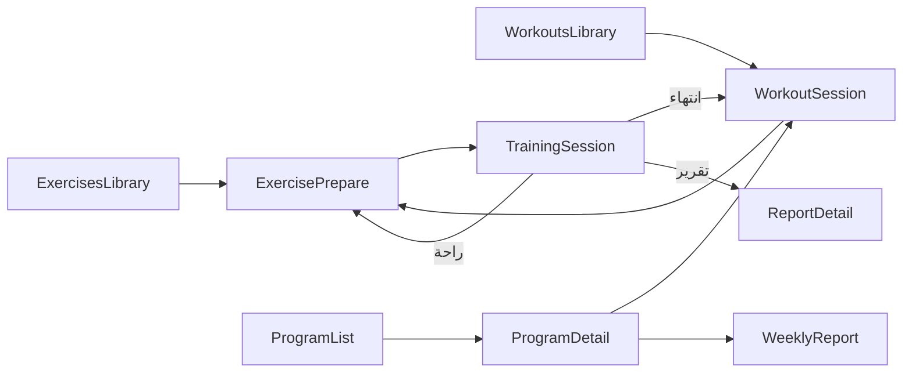

# جرد شامل لشاشات تطبيق android-poc (KMP + Legacy)

> **تاريخ الجرد:** 2026-06-12  
> **النطاق:** `android-poc/` — النظام الجديد (Compose Multiplatform) والنظام القديم (Android Views/XML) الموازي  
> **الهدف:** توثيق كل شاشة — وظيفتها، طريقة الوصول، وما تتصل به — مع تركيز خاص على الصفحات الداخلية والمخفية والميتة.

---

## 1. منهجية البحث (خطوة بخطوة)

### 1.1 اكتشاف نقاط الدخول

| الخطوة | الأداة / الملف | ماذا يُستخرج |
|--------|----------------|--------------|
| 1 | `app/src/main/AndroidManifest.xml` + `app/src/debug/AndroidManifest.xml` | كل `Activity` مسجّلة (LAUNCHER، deep link، debug-only) |
| 2 | `SplashActivity.kt` → `MovitPostLoginNavigator.kt` | مسار الإقلاع: أول تشغيل / تسجيل دخول / KMP shell vs legacy |
| 3 | `attachMovitShellHost()` في `MovitShellHost.kt` | ربط Compose shell بالإنتاج والـ pilot |
| 4 | `MainViewController.kt` (iOS) | نقطة دخول iOS |

### 1.2 اكتشاف شاشات KMP

| الخطوة | النمط | النتيجة |
|--------|-------|---------|
| 1 | `**/*Route*.kt` و `**/*Screen*.kt` | 26 ملف Route · 51 ملف Screen |
| 2 | `MovitAppDestination.kt` | 5 تبويبات رئيسية |
| 3 | `MovitInnerRoute.kt` + `MovitInnerHost.kt` | 17 نوع مسار داخلي (stack) |
| 4 | `MovitAppShellViewModel.kt` | كل `pushInner` / `navigateTo` — من أين يُفتح كل مسار |
| 5 | `grep pushInner(MovitInnerRoute` | التحقق من المسارات الميتة (مثل `ExerciseLive`) |
| 6 | `enum` داخل UiState | شاشات فرعية: `AuthScreen` · `AssessmentPhase` · خطوات Onboarding · `ReportsTab` · `ReportDetailPage` · `ProfilePicker` · `SessionRunState` |

### 1.3 اكتشاف Legacy

| الخطوة | النمط | النتيجة |
|--------|-------|---------|
| 1 | `AndroidManifest.xml` | 20+ Activity |
| 2 | `**/*Fragment*.kt` في `app/src/main` | تبويبات `MainContainerActivity` + fragments التقارير والأونبوردينغ |
| 3 | `MovitTrainingEntryNavigator.kt` | جسر legacy → KMP shell عبر Intent extras |
| 4 | `grep class.*Activity` غير موجود في Manifest | أنشطة ميتة (`ReportPagerActivity` · `ProgramSessionReportActivity`) |

### 1.4 تصنيف الحالة

| الحالة | التعريف |
|--------|---------|
| **نشطة (KMP)** | Route/Activity موصول بالتنقل أو الإقلاع |
| **فرعية داخل شاشة** | `when` على enum داخل نفس Composable/Activity |
| **Overlay** | طبقة فوق التبويب بدون `MovitInnerRoute` (مثل الاشتراك) |
| **Debug / مخفية** | مسجّلة في debug manifest أو adb فقط |
| **ميتة** | كود موجود بدون مراجع تنقل أو غير مسجّل في Manifest |
| **Legacy فقط** | Views/XML — تُستخدم عند `MOVIT_SHELL_LAUNCHER_ENABLED=false` أو لمسارات لم تُهاجر بعد |

---

## 2. بنية التنقل في KMP

**لا يوجد Jetpack `NavHost`.** التنقل مخصص:

```
SplashActivity (Android LAUNCHER)
    └─► MovitMainActivity / MainContainerActivity (حسب BuildConfig)
            └─► MovitAppShellHost
                    ├─► MovitFloatingNavBar → 5 تبويبات (MovitAppDestination)
                    └─► innerStack: List<MovitInnerRoute>  ← شريط التنقل يختفي
```

| الطبقة | الملف المرجعي |
|--------|---------------|
| Shell | `feature/shell/.../MovitAppShell.kt` |
| ViewModel التنقل | `feature/shell/.../MovitAppShellViewModel.kt` |
| ربط الشاشات الداخلية | `feature/shell/.../MovitInnerHost.kt` |
| تعريف المسارات | `feature/shell/.../MovitInnerRoute.kt` |

```mermaid
flowchart TB
    subgraph shell [MovitAppShell]
        Tabs[5 Tabs — bottom nav]
        Stack[innerStack — back only]
    end
    Tabs --> Home & Train & Explore & Reports & Profile
    Stack --> Library & Training & Account flows
```

---

## 3. نقاط الدخول

### 3.1 Android — إنتاج

| النشاط | المسار | الوظيفة | يتصل بـ |
|--------|--------|---------|---------|
| `SplashActivity` | `app/.../ui/auth/SplashActivity.kt` | شاشة إقلاع + أنيميشن (2.5 ث) | حسب الحالة → انظر الجدول أدناه |
| `MovitMainActivity` | `app/src/movitShellEnabled/...` | حاوية KMP shell | `attachMovitShellHost()` → `MovitAppShellHost` |
| `MovitMainActivity` (معطّل) | `app/src/movitShellDisabled/...` | stub يعيد التوجيه فوراً | `MainContainerActivity` |
| `MainContainerActivity` | `app/.../ui/main/MainContainerActivity.kt` | Legacy: 4 fragments | Home · Train · Explore · History |

**قرار `SplashActivity` بعد التأخير:**

| الشرط | الوجهة |
|-------|--------|
| `is_first_launch == true` | `OnboardingActivity` (legacy تعريف بالتطبيق) |
| غير مسجّل أو token منتهي | `SignInActivity` |
| مسجّل لكن الملف الشخصي غير مكتمل | `ProfileOnboardingActivity` |
| مسجّل ومكتمل | `MovitPostLoginNavigator.homeActivityClass()` → KMP أو Legacy |

### 3.2 Android — Debug

| النشاط | الوصول | الوظيفة |
|--------|--------|---------|
| `MovitShellPilotActivity` | **LAUNCHER** في debug build | shell كامل + `trainingKmpEnabled=true` |
| `MovitExplorePilotActivity` | adb / intent صريح | Explore معزول للـ QA |
| `MovitDesignSystemCatalogActivity` | adb | كتالوج مكونات التصميم |

### 3.3 iOS

| الدالة | المسار | الوظيفة |
|--------|--------|---------|
| `MainViewController()` | `feature/shell/src/iosMain/.../MainViewController.kt` | `MovitAppShellRoute` مباشرة (بدون Splash legacy) |

---

## 4. التبويبات الرئيسية (KMP) — 5 شاشات

الملف: `feature/shell/.../MovitAppDestination.kt`  
**الوصول:** `MovitFloatingNavBar` — يختفي عند وجود `innerRoute`.

| # | Enum | route | Screen | Route Composable | الوظيفة المختصرة |
|---|------|-------|--------|------------------|------------------|
| 1 | `Home` | `home` | `MovitHomeScreen` | `MovitHomeRoute` | لوحة اليوم: خطة، مستوى، catch-up، اختصارات |
| 2 | `Train` | `train` | `MovitTrainScreen` | `MovitTrainRoute` | برنامج الأسبوع الحالي، جلسات، تقارير أسبوعية |
| 3 | `Explore` | `explore` | `MovitExploreScreen` | `MovitExploreRoute` | اكتشاف: تمارين · تمارين مجمّعة · برامج |
| 4 | `Reports` | `reports` | `MovitReportsScreen` | `MovitReportsRoute` | مركز التقارير (3 تبويبات داخلية) |
| 5 | `Profile` | `profile` | `MovitProfileScreen` | `MovitProfileRoute` | حساب، إعدادات، اشتراك |

### 4.1 شاشات فرعية داخل التبويبات (ليست inner routes)

#### Reports — 3 تبويبات (`ReportsTab`)

| التبويب | اللوحة | الوظيفة |
|---------|--------|---------|
| `Overview` | `ReportsOverviewPanel` | KPIs، ملخص الأداء |
| `Exercises` | `ReportsExercisesPanel` | تقارير لكل تمرين — النقر → `ReportDetail` |
| `Trends` | `ReportsTrendsPanel` | اتجاهات زمنية |

#### Profile — Overlays (`ProfilePicker` + اشتراك)

| الطبقة | الملف | الوصول | الوظيفة |
|--------|-------|--------|---------|
| `MovitSubscriptionScreen` | `MovitProfileRoute.kt` | «عرض الخطط» / «إدارة الاشتراك» | واجهة اشتراك KMP؛ الدفع الفعلي → `SubscriptionActivity` legacy |
| `ProfilePicker.Language` | `MovitProfileScreen.kt` | إعدادات اللغة | منتقي اللغة |
| `ProfilePicker.Appearance` | نفس الملف | المظهر | فاتح / داكن / نظام |
| `ProfilePicker.LogoutConfirm` | نفس الملف | تسجيل الخروج | تأكيد الخروج |

---

## 5. المسارات الداخلية (`MovitInnerRoute`) — 14 نوعاً

الملف: `feature/shell/.../MovitInnerRoute.kt`  
**الوصول:** `pushInner()` من ViewModel أو deep link.  
**الرجوع:** زر back أو `popInner()` — يُخفى شريط التبويبات.

### 5.1 مكتبة البرامج والتمارين (`feature/library`)

| MovitInnerRoute | Screen | Route | الوظيفة |
|-----------------|--------|-------|---------|
| `ExercisesLibrary` | `ExercisesLibraryScreen` | `ExercisesLibraryRoute` | قائمة تمارين قابلة للبحث والفلترة |
| `WorkoutsLibrary` | `WorkoutsLibraryScreen` | `WorkoutsLibraryRoute` | قائمة تمارين مجمّعة (workouts) |
| `ProgramList` | `ProgramListScreen` | `ProgramListRoute` | قائمة البرامج التدريبية |
| `ProgramDetail(id, week?)` | `ProgramDetailScreen` | `ProgramDetailRoute` | تفاصيل برنامج + اختيار أسبوع/يوم وجلسات اليوم |
| `WeeklyReport(id, week)` | `WeeklyReportScreen` | `WeeklyReportRoute` | تقرير أسبوعي + مشاركة |
| `WorkoutSession(workoutId)` | `WorkoutSessionScreen` | `WorkoutSessionRoute` | جلسة مخطّطة (برنامج أو workout) |
| `ExercisePrepare(...)` | `ExercisePrepareScreen` | `ExercisePrepareRoute` | تفاصيل/تحضير التمرين وبدء التدريب أو **راحة** (`prepareMode=rest`) |

**مفتاح الجلسة المخططة:** `session:{programId}:{week}:{day}:{plannedWorkoutId}` — `WorkoutSessionKeys.kt`  
**معاينة:** `workoutId = "preview"` من Train (وضع dev/QA).

#### تدفق التدريب الكامل (KMP)



### 5.2 محرك التدريب الحي (`feature/training`)

| MovitInnerRoute | Screen | Route | الوظيفة |
|-----------------|--------|-------|---------|
| `TrainingSession(...)` | `TrainingSessionScreen` | `TrainingSessionRoute` | تمرين حي بالكاميرا + pose engine |
| `ExerciseLive(...)` | `ExerciseLiveScreen` | `ExerciseLiveRoute` | **نسخة قديمة** من الجلسة الحية — **ميتة** (انظر §8) |

#### حالات داخل `TrainingSessionScreen` (`SessionRunState`)

| الحالة | الوظيفة |
|--------|---------|
| `IDLE` | قبل البدء |
| `SETUP_POSE` / `RESUME_SETUP` | ضبط وضعية الجسم |
| `COUNTDOWN` / `RESUME_COUNTDOWN` | عد تنازلي |
| `TRAINING` | التمرين الفعلي + HUD |
| `AUTO_PAUSED` | إيقاف تلقائي |
| `COMPLETED` | انتهاء — عرض تقرير أو العودة للتدفق |

**الدخول:** `ExercisePrepare` → `TrainingStartAction.KmpLive` → `TrainingSession`.  
**إذا legacy فقط:** snackbar `training_config_first_use_online`.

### 5.3 التقارير (`feature/reports`)

| MovitInnerRoute | Screen | Route | الوظيفة |
|-----------------|--------|-------|---------|
| `ReportDetail(reportId)` | `ReportDetailScreen` | `ReportDetailRoute` | تقرير تمرين مفصّل |

#### صفحات داخل `ReportDetailScreen` (`ReportDetailPage`)

| الصفحة | المحتوى |
|--------|---------|
| `Overview` | ملخص الأداء |
| `Form` | جودة الحركة / المفاصل |
| `Fatigue` | إجهاد |
| `Tips` | نصائح + تصدير/مشاركة |

### 5.4 الحساب (`feature/account`)

| MovitInnerRoute | Screen | Route | الوظيفة |
|-----------------|--------|-------|---------|
| `Auth` | `MovitAuthScreen` | `MovitAuthRoute` | تسجيل دخول / تسجيل / استعادة كلمة المرور |
| `ProfileOnboarding` | `MovitOnboardingScreen` | `MovitOnboardingRoute` | إعداد الملف التدريبي (7 خطوات) |
| `Assessment(mode)` | `MovitAssessmentScreen` | `MovitAssessmentRoute` | فحص صحي + مسح جسد + نتائج |
| `LevelProfile` | `MovitLevelScreen` | `MovitLevelRoute` | المستوى والتقدم |

#### شاشات فرعية — Auth (`AuthScreen`)

| الشاشة | الوظيفة | يتصل بـ |
|--------|---------|---------|
| `Splash` | شعار + تحميل | `Intro` أو `SignIn` (bootstrap) |
| `Intro` | شرائح تعريف (صفحات) | `SignIn` |
| `SignIn` | بريد + كلمة مرور + Google | shell (pop) أو `ProfileOnboarding` |
| `SignUp` | إنشاء حساب | `SignIn` |
| `Forgot` | استعادة كلمة المرور | `SignIn` |

**الوصول التلقائي:** بدون جلسة → `innerStack` يبدأ بـ `Auth` (`resolveStartupInnerStack`).  
**انتهاء الجلسة:** `MovitData.onSessionExpired` → `Auth`.

#### شاشات فرعية — Onboarding (7 خطوات)

| الخطوة | الثابت | المحتوى |
|--------|--------|---------|
| 1 | `STEP_AGE_GENDER` | العمر والجنس |
| 2 | `STEP_BODY_METRICS` | الطول والوزن |
| 3 | `STEP_EXPERIENCE` | خبرة المقاومة + أيام/أسبوع |
| 4 | `STEP_GOAL` | الهدف التدريبي |
| 5 | `STEP_WEEKDAYS` | أيام التمرين |
| 6 | `STEP_LOCATION` | المكان + المعدات |
| 7 | `STEP_SUMMARY` | ملخص + إقرار صحي |

**الوصول:** بعد Auth · من Profile («الملف التدريبي») · gate تلقائي عند أول دخول (`ensureOnboardingGateIfNeeded`).

#### شاشات فرعية — Assessment (`AssessmentPhase`)

| المرحلة | الوظيفة | يتصل بـ |
|---------|---------|---------|
| `PreScreening` | أسئلة السلامة | `BodyScan` أو back |
| `BodyScan` | كاميرا + pose (`AssessmentCameraHost`) | `Results` |
| `Results` | نتائج + توصيات | Home · Explore · back |

**أوضاع:** `mode=initial` (افتراضي) · `progression` (من Level).

---

## 6. جدول الوصول: من أين → إلى أين (KMP)

### 6.1 من تبويب Home

| الإجراء في UI | الوجهة |
|---------------|--------|
| «ابدأ خطة اليوم» | تبويب Train |
| Body scan / reassessment | `Assessment` |
| بطاقة المستوى | `LevelProfile` |
| برنامج نشط | `ProgramDetail` |
| Catch-up day | `WorkoutSession(session:...)` |
| تقرير حديث | `ReportDetail` |
| اختصارات explore/reports/profile/train | تبويب مقابل |
| إشعارات ذكية (reassessment_due…) | Assessment / Train / Level |

### 6.2 من تبويب Train

| الإجراء | الوجهة |
|---------|--------|
| جلسة اليوم | `WorkoutSession` أو `preview` |
| قائمة البرامج | `ProgramList` |
| تفاصيل برنامج | `ProgramDetail` |
| أسبوع محدد داخل البرنامج | `ProgramDetail(id, week)` |
| تقرير أسبوعي | `WeeklyReport` |
| Assessment | `Assessment` |
| explore / reports | تبويب |

### 6.3 من تبويب Explore

| الإجراء | الوجهة |
|---------|--------|
| مكتبة التمارين | `ExercisesLibrary` → `ExercisePrepare` |
| مكتبة الـ workouts | `WorkoutsLibrary` → `WorkoutSession` |
| البرامج | `ProgramList` → `ProgramDetail` |
| عنصر في الشبكة | حسب النوع: Exercise / Workout / Program |

### 6.4 من تبويب Reports

| الإجراء | الوجهة |
|---------|--------|
| تمرين في تبويب Exercises | `ReportDetail` |
| «ابدأ التدريب» (حالة فارغة) | تبويب Train |
| ترقية Pro | `SubscriptionActivity` (legacy) على Android |

### 6.5 من تبويب Profile

| الإجراء | الوجهة |
|---------|--------|
| تسجيل الدخول | `Auth` |
| الملف التدريبي | `ProfileOnboarding` |
| التقييم | `Assessment` |
| المستوى | `LevelProfile` |
| الاشتراك | overlay `MovitSubscriptionScreen` → legacy billing |
| تسجيل الخروج | `Auth` (بعد تأكيد) |

### 6.6 من Level

| الإجراء | الوجهة |
|---------|--------|
| إعادة التقييم | `Assessment(mode=progression)` |
| استكشاف برامج | تبويب Explore (pop all) |

### 6.7 من Assessment (بعد النتائج)

| الإجراء | الوجهة |
|---------|--------|
| الرئيسية | تبويب Home |
| استكشاف | تبويب Explore |

---

## 7. Deep Links وجسر Legacy → KMP

### 7.1 Intent extras (`MovitTrainingEntryNavigator`)

الملف: `app/.../navigation/MovitTrainingEntryNavigator.kt`  
المحلل: `app/.../host/MovitShellDeepLinkParser.kt`

| route constant | القيمة | المعاملات | InnerRoute |
|----------------|--------|-----------|------------|
| `ROUTE_WORKOUT_SESSION` | `workout_session` | sessionKey | `WorkoutSession` |
| `ROUTE_WORKOUT_SESSION_LOCAL` | `workout_session_local` | workoutId + JSON config | `WorkoutSession` (+ seed cache) |
| `ROUTE_EXERCISE_PREPARE` | `exercise_prepare` | exerciseId, workoutId? | `ExercisePrepare` |
| `ROUTE_ASSESSMENT` | `assessment` | — | `Assessment` |
| `ROUTE_PROGRAM_DETAIL` | `program_detail` | programId, week? | `ProgramDetail` |

**Extras:** `movit.shell.route` · `movit.shell.arg` · `movit.shell.arg2` · `movit.shell.workout_config_json`

**مستدعون legacy (أمثلة):** `HomeFragment` · `TrainFragment` · `ExploreFragment` · `ExerciseDetailActivity` · `WorkoutDetailActivity` · `ProgramDayActivity` · `PreScreeningActivity` · `QuickStartActivity`

**هدف النشاط:** `MovitMainActivity` (release) أو `MovitShellPilotActivity` (debug)

### 7.2 اشتراك

| الرابط | الوجهة |
|--------|--------|
| `waytofix://subscription/result` | `SubscriptionActivity` (في Manifest) |

---

## 8. شاشات ميتة / غير قابلة للوصول / كود يتيم

| العنصر | الموقع | السبب |
|--------|--------|-------|
| `MovitInnerRoute.ExerciseLive` | `MovitInnerRoute.kt` | معرّف في `MovitInnerHost` لكن **لا يوجد `pushInner(ExerciseLive)`** في أي ViewModel |
| `ExerciseLiveScreen` / `ExerciseLiveViewModel` | `feature/training` | يُستبدل بـ `TrainingSessionRoute` |
| `MovitPlaceholderScreen` | `feature/shell` | **لا مراجع** في composables |
| `MovitComponentsRoute` | `feature/shell` | غير موصول — الكتالوج يُستدعى مباشرة من Activity |
| `MovitAppShellEvent.ExploreItemSelected` | shell | يُعالج في ViewModel لكن **لا يُصدَر من UI** (اختبارات فقط) |
| `WorkoutCustomizeScreen` + `WorkoutCustomizeViewModel` | `feature/library` | حُذفا من KMP؛ النسخة الفعالة legacy فقط |
| `ReportPagerActivity` | `app/.../report/` | كود موجود · **غير مسجّل** في Manifest (استُبدل بـ `WorkoutReportActivity`) |
| `ProgramSessionReportActivity` | `app/.../programs/` | نفس الحالة |
| `movitShellDisabled/MovitMainActivity` | app | stub إعادة توجيه فقط |

---

## 9. شاشات Debug / مخفية / كتالوج

| الشاشة | الملف | الوصول | الوظيفة |
|--------|-------|--------|---------|
| KMP Shell كامل | `MovitShellPilotActivity` | debug LAUNCHER | QA للـ shell + training KMP مفعّل دائماً |
| Explore معزول | `MovitExplorePilotActivity` | adb | معاينة Explore بدون shell كامل |
| Design System Catalog | `MovitDesignSystemCatalogActivity` | adb | `MovitComponentsTabScreen` |
| كتالوج المكونات | `MovitComponentsTabScreen` | عبر Activity أعلاه | ~30 قسم معاينة (ألوان، أزرار، بطاقات، charts، nav…) |

**أقسام الكتالوج** (`MovitComponentsCatalogContent`): Palette · Typography · Buttons · Cards · Metrics · Macro · Search · FilterRow · MediaCards · ProgramCard · WorkoutCards · DifficultyDots · ExerciseCards · States · Placeholder · RTL · FilterChips · EmptyState · ExtendedTokens · ButtonsExtended · IconBox · Tags · Segmented · StatCards · Charts · ListRows · Coach · FloatingNav · FloatingControls · HeroAccent · WeekSession · Feedback · Premium · Skeleton

---

## 10. النظام القديم (Legacy) — شاشات موازية

تُستخدم عند `MOVIT_SHELL_LAUNCHER_ENABLED=false` أو لمسارات لم تُهاجر بالكامل (فوترة، بعض التقارير).

### 10.1 تبويبات `MainContainerActivity` (4 — بدون Profile في الـ bottom nav)

| التبويب | Fragment | الوظيفة |
|---------|----------|---------|
| Home | `HomeFragment` | لوحة رئيسية legacy |
| Train | `TrainFragment` | تدريب وبرامج |
| Explore | `ExploreFragment` | استكشاف |
| Reports | `HistoryFragment` | مركز تقارير (3 tabs) |

**Profile legacy:** من أيقونة الأفاتار في `HistoryFragment` → `ProfileActivity`

### 10.2 Activities المصادقة والأونبوردينغ

| Activity | الوظيفة | يتصل بـ |
|----------|---------|---------|
| `OnboardingActivity` | تعريف أول تشغيل (legacy) | `SignIn` |
| `SignInActivity` | تسجيل دخول | home أو `ProfileOnboarding` |
| `SignUpActivity` | تسجيل | `SignIn` |
| `ForgotPasswordActivity` | استعادة | `SignIn` |
| `ProfileOnboardingActivity` | ملف تدريبي (fragments خطوة بخطوة) | home |

**Fragments الأونبوردينغ legacy:** `StepAgeGenderFragment` · `StepBodyMetricsFragment` · `StepExperienceFragment` · `StepGoalFragment` · `StepWeekdaysFragment` · `StepLocationEquipmentFragment` · `StepSummaryFragment`

### 10.3 Activities المكتبة والبرامج

| Activity | الوظيفة |
|----------|---------|
| `ExerciseListActivity` | قائمة تمارين |
| `ExerciseDetailActivity` | تفاصيل تمرين → قد يوجّه لـ KMP shell |
| `ExerciseHistoryActivity` | سجل تمرين |
| `WorkoutListActivity` | قائمة workouts |
| `WorkoutDetailActivity` | تفاصيل workout قبل البدء |
| `WorkoutCustomizeActivity` | تخصيص التمرين قبل البدء |
| `QuickStartActivity` | بناء workout حر |
| `ProgramListActivity` | قائمة برامج |
| `ProgramDetailActivity` | تفاصيل برنامج |
| `ProgramDayActivity` | يوم برنامج |
| `WeeklyReportActivity` | تقرير أسبوعي |
| `PlanOverviewActivity` | نظرة عامة على الخطة |

### 10.4 Activities التقييم والمستوى

| Activity | الوظيفة |
|----------|---------|
| `PreScreeningActivity` | فحص صحي → قد يوجّه لـ KMP Assessment |
| `AssessmentResultActivity` | نتائج التقييم |
| `LevelProfileActivity` | المستوى |

### 10.5 Activities التقارير والحساب

| Activity | الوظيفة |
|----------|---------|
| `WorkoutReportActivity` | تقرير موحّد (single/multi exercise) — **نشط** |
| `ReportPagerActivity` | **ميت** — غير في Manifest |
| `ProgramSessionReportActivity` | **ميت** — غير في Manifest |
| `ProfileActivity` | الملف الشخصي legacy |
| `SubscriptionActivity` | اشتراك + deep link `waytofix://` |

### 10.6 Fragments داخل `WorkoutReportActivity` / التقارير

| Fragment | الوظيفة |
|----------|---------|
| `WorkoutSummaryFragment` | ملخص جلسة متعددة التمارين |
| `ReportPageFragment` | حاوية صفحات تقرير |
| `PerformanceOverviewFragment` | نظرة عامة |
| `FormDetailsFragment` | شكل الحركة |
| `ControlFatigueFragment` | إجهاد |
| `SafetyDetailsFragment` | سلامة |
| `BestWorstComparisonFragment` | أفضل/أسوأ |
| `ProgressionFragment` | تقدم |
| `TipsExportFragment` | نصائح وتصدير |
| `ExerciseReportContainerFragment` | حاوية تقرير تمرين |

### 10.7 Fragments تبويبات Reports legacy

| Fragment | التبويب |
|----------|---------|
| `ReportsOverviewFragment` | Overview |
| `ReportsExercisesFragment` | Exercises |
| `ReportsTrendsFragment` | Trends |

### 10.8 Explore legacy

| Fragment | الوظيفة |
|----------|---------|
| `ExercisesFragment` | قائمة تمارين داخل Explore |

---

## 11. ملخص إحصائي

| الفئة | العدد |
|-------|-------|
| تبويبات KMP رئيسية | **5** |
| أنواع `MovitInnerRoute` | **14** (13 نشطة + 1 ميتة `ExerciseLive`) |
| شاشات KMP (Screen composables) | **~32** شاشة/لوحة رئيسية |
| شاشات فرعية (enum داخل شاشة) | **~25** حالة/خطوة |
| Activities legacy (Manifest) | **~22** |
| Fragments legacy | **~25** |
| Debug Activities | **3** |
| مسارات ميتة موثّقة | **8** عناصر |

---

## 12. خريطة الملفات المرجعية

| الغرض | المسار |
|-------|--------|
| تعريف المسارات الداخلية | `feature/shell/.../MovitInnerRoute.kt` |
| ربط Route → Screen | `feature/shell/.../MovitInnerHost.kt` |
| منطق التنقل | `feature/shell/.../MovitAppShellViewModel.kt` |
| Shell UI | `feature/shell/.../MovitAppShell.kt` |
| مكتبة/برامج | `feature/library/.../MovitLibraryRoutes.kt` |
| تدريب حي | `feature/training/.../MovitTrainingRoutes.kt` |
| تقارير | `feature/reports/.../MovitReportsRoute.kt` |
| حساب | `feature/account/.../Movit*Route.kt` |
| Deep link parser | `app/.../host/MovitShellDeepLinkParser.kt` |
| جسر legacy | `app/.../navigation/MovitTrainingEntryNavigator.kt` |
| قرار KMP vs legacy | `app/.../navigation/MovitPostLoginNavigator.kt` |
| Manifest | `app/src/main/AndroidManifest.xml` |

---

## 13. ملاحظات للهجرة

1. **مسار التدريب الحي:** المسار الفعلي `ExercisePrepare` → `TrainingSession` — وليس `ExerciseLive`.
2. **الاشتراك:** واجهة KMP (`MovitSubscriptionScreen`) تعرض الخطط؛ الدفع عبر `SubscriptionActivity` legacy على Android.
3. **Auth عند الإقلاع:** في KMP shell، المصادقة inner route — في legacy، Activities منفصلة قبل الوصول للـ home.
4. **Feature flag:** `MOVIT_SHELL_LAUNCHER_ENABLED` يحدد whether post-login يفتح `MovitMainActivity` أو `MainContainerActivity`.
5. **Pilot debug:** `MovitShellPilotActivity` يفرض `trainingKmpEnabled=true` بينما release يعتمد على `BuildConfig`.

---

*هذا المستند ناتج جرد آلي+يدوي على شجرة `android-poc` بتاريخ 2026-06-12. للمقارنة مع نسب الإكمال الوظيفي راجع [`Sync-App-Pages.md`](Sync-App-Pages.md) و [`Page-Scorecards.md`](Page-Scorecards.md).*
