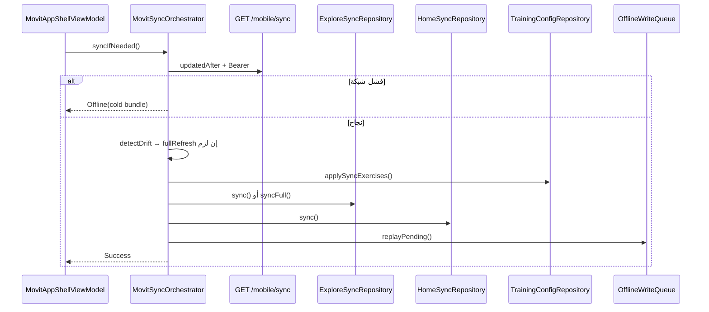

# مراجعة جلب ومزامنة البيانات — النظام القديم مقابل KMP

> **تاريخ المراجعة:** 2026-06-13  
> **النطاق:** `kmp-app/` (KMP + Legacy) و `backend/`  
> **الغرض:** توثيق دقيق لطريقة جلب ومزامنة البيانات في النظام الجديد، ومقارنتها بالنظام القديم في كل المراحل.

---

## جدول المحتويات

1. [منهجية المراجعة](#1-منهجية-المراجعة)
2. [ملخص تنفيذي](#2-ملخص-تنفيذي)
3. [البنية العامة](#3-البنية-العامة)
4. [عقد المزامنة في الـ Backend](#4-عقد-المزامنة-في-ال-backend)
5. [دورة حياة المزامنة](#5-دورة-حياة-المزامنة)
6. [التخزين المحلي](#6-التخزين-المحلي)
7. [المجالات بالتفصيل](#7-المجالات-بالتفصيل)
   - [7.1 Exercise — Config / Messages / Images](#71-exercise--config--messages--images)
   - [7.2 System Messages](#72-system-messages)
   - [7.3 Workouts](#73-workouts)
   - [7.4 Programs](#74-programs)
   - [7.5 Training Profile](#75-training-profile)
   - [7.6 User Profile and Settings](#76-user-profile-and-settings)
8. [الكتابات والمزامنة العكسية (Offline Writes)](#8-الكتابات-والمزامنة-العكسية-offline-writes)
9. [الحزمة الباردة (Cold Offline Bundle)](#9-الحزمة-الباردة-cold-offline-bundle)
10. [جدول مقارنة شامل](#10-جدول-مقارنة-شامل)
11. [الفجوات الحرجة والمخاطر](#11-الفجوات-الحرجة-والمخاطر)
12. [الملفات المرجعية](#12-الملفات-المرجعية)

---

## 1. منهجية المراجعة

### 1.1 خطوات البحث

| الخطوة | الإجراء | المسارات |
|--------|---------|----------|
| 1 | تتبع نقطة الدخول | `MovitData.install()` → `MovitAppShellViewModel` → `MovitSyncOrchestrator` |
| 2 | مقارنة المنسّق القديم | `SyncManager.kt` مقابل `MovitSyncOrchestrator.kt` سطراً بسطر |
| 3 | تتبع payload الـ API | `backend/src/modules/mobile-sync/` + `PlanSyncDto.kt` |
| 4 | تتبع كل مجال بيانات | مستودعات `core/data/repository/*` + طبقة `feature/*/Shared*Repository` |
| 5 | التحقق من الفجوات | بحث عن `hydrateFrom*` و `systemMessages` و `messageLibrary` في KMP |
| 6 | Legacy المتبقي | `com.trainingvalidator.poc.storage.*` و `ExerciseRepository` |

### 1.2 مصادر الحقيقة

- **السيرفر:** `GET /api/mobile/sync` هو الحزمة المركزية للكتالوج؛ لا يوجد endpoint باسم `bootstrap` أو `bundle` في الـ backend.
- **العميل KMP:** `MovitSyncOrchestrator` + مستودعات متخصصة + `SQLDelight` عبر `MovitLocalStore`.
- **العميل القديم:** `SyncManager` + ملفات JSON منفصلة + `SharedPreferences`.

---

## 2. ملخص تنفيذي

النظام الجديد KMP **منظم بشكل أفضل** (طبقة بيانات موحّدة، Koin، SQLDelight، outbox للكتابات، stale-while-revalidate)، لكن **الهجرة غير مكتملة**:

- مساران للمزامنة يعملان **بالتوازي** على Android: `MovitSyncOrchestrator` (Shell KMP) و `SyncManager` (شاشات legacy).
- أجزاء مهمة من payload `/sync` **مُنفَّذة كمكوّنات KMP لكن غير موصولة** في `MovitSyncOrchestrator`:
  - `systemMessages` (بعد cold seed)
  - دمج `messageLibrary` في configs التمارين
  - `userExercisePreferences`
  - `plannedWorkoutReports`
  - `userPrograms[].customizations` → `DayCustomizationLocalStore`
- البرامج والـ workouts في KMP تُجلب عبر **`/explore` منفصل** وليس مباشرة من `workoutTemplates`/`programs` في sync (عكس Legacy الذي يخزّنها من sync مباشرة).

---

## 3. البنية العامة

### 3.1 النظام الجديد (KMP)

```
┌─────────────────────────────────────────────────────────────┐
│  Feature Layer (Compose Multiplatform)                      │
│  shell / home / explore / library / account / train / reports│
│  Shared*Repository → stale-while-revalidate / ensure        │
└──────────────────────────┬──────────────────────────────────┘
                           │ MovitData.*
┌──────────────────────────▼──────────────────────────────────┐
│  MovitSyncOrchestrator                                      │
│  + TrainingConfigEnsure + OfflineWriteQueue                 │
│  + ColdOfflineBundleSeeder                                  │
└───┬──────────┬──────────┬──────────┬──────────────────────┘
    │          │          │          │
 Explore    Home/Reports  Training   AudioManifest
 SyncRepo   Plan/Program  ConfigRepo + PrefetchRunner
    │          │          │          │
    └──────────┴──────────┴──────────┘
                         │
              MigratingMovitLocalStore
                         │
                   SQLDelight
         (json_cache_entry + outbox + sync_metadata + journal)
                         │
              MovitPlatformBindings
         (auth, prefs migration, activeUserProgramId)
```

### 3.2 النظام القديم (Legacy Android)

```
Fragments / Activities
        ↓
ExerciseRepository (singleton) ──→ SyncManager
        ↓                              ↓
WorkoutRepository / ProgramRepository   GET /api/mobile/sync
        ↓                              ↓
ExerciseCacheManager (JSON files)   messageLibrary merge
WorkoutCacheManager                 systemMessages save
ProgramCacheManager                 userPrograms + customizations
AudioCacheManager                   audio download
SharedPreferences stores
```

### 3.3 الجسر بين النظامين

- `MovitDataInstall.kt` يربط `AuthManager` و `ApiConfig` و SharedPreferences بـ `MovitPlatformBindings`.
- التوكنات والجلسة **مشتركة** بين KMP و Legacy.
- `LegacyWorkoutSyncDrain` ينقل تنفيذات قديمة إلى Outbox KMP.

---

## 4. عقد المزامنة في الـ Backend

### 4.1 النقطة المركزية: `GET /api/mobile/sync`

**Query parameters:**

| المعامل | الوظيفة |
|---------|---------|
| `updatedAfter` | ISO timestamp — مزامنة تزايدية (delta) |
| `forceRefresh=true` | يتجاهل `updatedAfter` — مزامنة كاملة |

**Response envelope:**

```typescript
{
  success: boolean;
  timestamp: string;      // يُخزَّن للمزامنة التالية
  data: SyncData;
  meta: SyncMeta;
}
```

### 4.2 محتوى `SyncData`

| الحقل | الوصف | Delta؟ |
|-------|-------|--------|
| `exercises[]` | `ExerciseConfigWithMeta` — assignments بدون نصوص مضمّنة | نعم (`updatedAt`) |
| `messageLibrary[]` | نصوص الرسائل المنفصلة عن التمارين | جزئي (تمارين الدفعة فقط) |
| `systemMessages[]` | رسائل النظام بالمفتاح `code` | كامل عند وجودها |
| `deletedExerciseIds[]` | tombstones | نعم |
| `workoutTemplates[]` | `WorkoutExport` كامل | نعم |
| `deletedWorkoutTemplateIds[]` | tombstones | نعم |
| `programs[]` | `ProgramExport` | نعم |
| `deletedProgramIds[]` | tombstones | نعم |
| `audioManifest` | `{ baseUrl, files[] }` | merge/partial |
| `userPrograms[]` | enrollments + customizations | **كامل دائماً** (مع token) |
| `userExercisePreferences[]` | تفضيلات standalone | **كامل دائماً** |
| `plannedWorkoutReports[]` | تقارير مكتملة | **كامل دائماً** |

### 4.3 آليات الإصدار (بدون ETags)

- **لا ETags** ولا `If-None-Match` في الـ backend.
- **Delta sync:** `updatedAt > updatedAfter` للكتالوج + قوائم حذف.
- **كشف drift للرسائل:** `meta.messageLibraryStats.fingerprint` (max updatedAt + counts).
- **كشف drift للكيانات:** `meta.totalExercises` مقابل العدد المحلي.
- **`meta.isFullSync`:** `true` عند عدم وجود `updatedAfter` أو `forceRefresh=true`.

### 4.4 Endpoints منفصلة (ليست sync bulk)

| المجال | Endpoint |
|--------|----------|
| Explore خفيف | `GET /api/mobile/explore` |
| Home dashboard | `GET /api/mobile/home` |
| Training config لقالب | `GET /api/mobile/workout-templates/{id}/training-config` |
| برنامج كامل | `GET /api/mobile/programs/{id}` |
| خطة فعّالة | `GET /api/mobile/user-programs/{id}/effective-plan` |
| ملف تدريب | `GET/PUT /api/mobile/training-profile` |
| ملف مستخدم | `GET/PATCH /api/mobile/auth/profile` |
| إعدادات | `PATCH /api/mobile/auth/settings` |
| تقارير Pro | `GET /api/mobile/reports/dashboard` |

---

## 5. دورة حياة المزامنة

### 5.1 محفزات المزامنة — KMP

| الحدث | الملف | السلوك |
|-------|-------|--------|
| إقلاع مع جلسة | `MovitAppShellViewModel.init` | `bootstrapLocalCaches()` ثم `syncIfNeeded()` |
| `onAppResumed()` | Shell | `syncIfNeeded()` |
| استعادة الاتصال | `MovitConnectivitySignals` | `syncIfNeeded(forceCheck=true)` |
| فاصل 5 دقائق | `DEFAULT_MIN_SYNC_INTERVAL_MS` | تخطي إن `syncBusy` أو ضمن الفاصل |
| قبل التدريب | `TrainingConfigEnsure` | `forceCheck` → `fullRefresh` → fetch per-template |
| بعد sync ناجح | orchestrator | `offlineWrites.replayPending()` |
| Background periodic | `BackgroundSyncScheduler` | **غير مُنفَّذ** |

### 5.2 محفزات المزامنة — Legacy

| الحدث | السلوك |
|-------|--------|
| `ExerciseRepository.initialize()` | cache فوري → sync خلفي |
| `TrainFragment` / `ExercisesFragment` | `checkForUpdates()` |
| `onResume` في Home | `HomeRepository.sync()` |
| فاصل 5 دقائق | نفس المنطق في `SyncManager` |

### 5.3 مخطط دورة KMP



### 5.4 حالات النتيجة — KMP

| الحالة | المعنى |
|--------|--------|
| `Success` | بيانات محدّثة (home, explore, reports) |
| `Offline` | قراءة من cold bundle / cache |
| `Skipped` | busy أو ضمن الفاصل الزمني |
| `Error` | لا جلسة ولا cache |

---

## 6. التخزين المحلي

### 6.1 KMP — SQLDelight

| الجدول | الاستخدام |
|--------|-----------|
| `json_cache_entry` | home, explore, exercise configs, program cache, session cache, preferences… |
| `sync_metadata` | `lastSyncTimestamp`, entity counts, message stats |
| `outbox_entry` | كتابات offline مع replay |
| `session_journal` | سجل جلسات التدريب |

**مفاتيح الكاش:** `MovitCacheKeys` — store + key لكل كيان.

**ترحيل:** `MigratingMovitLocalStore` ينقل بيانات SharedPreferences/Android legacy عند أول استخدام.

### 6.2 Legacy — ملفات JSON + SharedPreferences

| التخزين | المسار / المفتاح |
|---------|------------------|
| Exercise configs | `files/exercise_cache/exercises/{slug}.json` |
| Workouts | `files/workout_cache/` |
| Programs | `files/program_cache/` |
| Audio | `files/audio_cache/{ar,en}/` + `manifest.json` |
| System messages | `system_message_store` (SharedPreferences) |
| User programs | `UserProgramStore` (prefs) |
| Day customizations | `DayCustomizationStore` |
| Exercise preferences | `UserExercisePreferenceStore` |
| Home | `home_cache` |
| Auth / settings | `AuthManager` → `app_prefs` |

### 6.3 الفرق الجوهري

| الجانب | Legacy | KMP |
|--------|--------|-----|
| قاعدة البيانات | لا Room — JSON files | SQLDelight موحّد |
| فصل الكيانات | مجلد لكل نوع | جدول JSON واحد بمفاتيح |
| التوكنات | `AuthManager` + Keychain | نفس `MovitPlatformBindings` (مشترك) |
| LRU للـ configs | لا | `MovitLruCache` (8 سجلات) |

---

## 7. المجالات بالتفصيل

### 7.1 Exercise — Config / Messages / Images

#### ما هو Exercise Config؟

- `ExerciseConfig` من `android-schema` — pose variants, counting, message **assignments** (مراجع فقط).
- النصوص الفعلية في `messageLibrary` على السيرفر.
- الصور: `imageUrl` على التمرين + `positionImageUrl` في variants.

#### المرحلة 1: الجلب من السيرفر

| | Legacy | KMP |
|---|--------|-----|
| المصدر الرئيسي | `GET /api/mobile/sync` → `exercises[]` | نفس الـ endpoint |
| Fallback | لا يوجد ensure منفصل | `GET /workout-templates/{id}/training-config` |
| Explore metadata | `ExploreRepository` منفصل | `GET /api/mobile/explore` → `exercises[]` (metadata فقط) |

#### المرحلة 2: معالجة الرسائل (messageLibrary)

| | Legacy | KMP |
|---|--------|-----|
| الدمج | `SyncManager.resolveExerciseMessages()` — يدمج `messageLibrary` في `StateMessages` قبل الحفظ | **لا يوجد دمج** — يحفظ JSON خام من sync |
| Delta بدون تمارين | يُطبّق library على cache موجود | **لا يُطبَّق** — drift يُكتشف فقط |
| fingerprint | `saveMessageStats()` + إعادة full refresh | `MovitSyncMetadataStore.writeMessageStats()` + full refresh |

**تأثير:** في KMP، محرك التدريب يحتاج حل رسائل منفصل (`SystemMessageRegistry` + resolver) أو دمج library — حالياً الـ assignments موجودة لكن النصوص قد تكون ناقصة إن لم تُدمَج.

#### المرحلة 3: التخزين

| | Legacy | KMP |
|---|--------|-----|
| الموقع | `exercise_cache/exercises/{slug}.json` | `MovitCacheKeys.EXERCISE_CONFIG_STORE` |
| الفهرس | metadata.json | `slug_index` + `slug_aliases` + `exerciseId→slug` |
| Full sync | يمسح ويعيد | `applySyncExercises(isFullSync=true)` يمسح الكل |
| الحذف | `removeExercises(deletedIds)` | `deletedExerciseIds` في repository |

#### المرحلة 4: Ensure قبل التدريب

**KMP فقط** — `TrainingConfigEnsure.kt`:

```
1. supports(slug)? → Available
2. offline? → Unavailable(Offline)
3. syncIfNeeded(forceCheck=true)
4. fullRefresh()
5. fetchWorkoutTrainingConfig(templateId) → applySyncExercises
6. لا يزال مفقوداً → Unavailable(NotFoundAfterSync)
```

Legacy: `ExerciseRepository.getExercise()` يقرأ من cache فقط؛ sync يحدث عبر `initialize()`.

#### المرحلة 5: الصور

| | Legacy | KMP |
|---|--------|-----|
| التخزين | **لا cache محلي** — URLs في JSON | **لا cache محلي** — URLs من explore |
| العرض | Coil عند الطلب | Coil (مخطط prefetch في `WeekOfflinePackPrefetcher` — TODO) |
| مصدر URL | داخل exercise config أو explore | `ExploreSyncRepository.exerciseImageUrl(slug)` |

#### المرحلة 6: الصوت

| | Legacy | KMP |
|---|--------|-----|
| Manifest | من sync → `AudioCacheManager` | `AudioManifestCache` + `AudioPrefetchRunner` |
| التنزيل | `SyncManager.downloadPendingAudio()` خلفي | `audioPrefetchRunner.afterManifestApplied()` |
| Per-exercise | `EntityAudioPrefetchManager` | `MovitMobileApi.fetchExerciseAudioManifest` |

---

### 7.2 System Messages

رسائل العد التنازلي، التحذيرات، إلخ — مفتاحها `code` وليس `id`.

#### Legacy

```
sync → systemMessages[]
  → SystemMessageStore.save() (SharedPreferences)
  → SystemMessageRegistry (ذاكرة) عند الإقلاع
  → FeedbackManager / MobileMessageResolver
```

#### KMP

```
ColdOfflineBundleSeeder → systemMessageCache.save() [أول تشغيل فقط]
MovitData.bootstrapLocalCaches() → SystemMessageCache.loadIntoRegistry()

⚠️ MovitSyncOrchestrator لا يستدعي systemMessageCache.save() من sync response
```

#### الفرق الحرج

| الجانب | Legacy | KMP |
|--------|--------|-----|
| تحديث من sync | **نعم** كل مزامنة | **لا** — فقط cold bundle |
| التخزين | SharedPreferences | SQLDelight `system_message_cache` |
| Runtime | `SystemMessageRegistry` | نفس النمط (`SystemMessageCache.loadIntoRegistry`) |

**النتيجة:** رسائل النظام في KMP **تتجمد** عند قيم cold bundle ما لم يُوصَل تطبيق sync.

---

### 7.3 Workouts

#### Legacy

- `workoutTemplates[]` من `/sync` → `WorkoutCacheManager` (JSON per slug).
- Delta + tombstones `deletedWorkoutTemplateIds`.
- `WorkoutRepository` يقرأ من cache فقط؛ sync عبر `ExerciseRepository`.

#### KMP

- **لا يخزّن** `workoutTemplates` من `/sync` مباشرة.
- `ExploreSyncRepository` يجلب بطاقات خفيفة من `/explore` (metadata: id, slug, name, cover, exerciseCount).
- التفاصيل الكاملة عند الطلب:
  - `ProgramFlowSyncRepository` → `GET /programs/{id}`
  - `WorkoutSessionSyncRepository` → `effective-plan`, `training-config`
- `WeekOfflinePackPrefetcher` — تحضير أسبوع offline (جزئي).

#### الفرق

| الجانب | Legacy | KMP |
|--------|--------|-----|
| مصدر القائمة | sync bulk | `/explore` |
| التفاصيل الكاملة | في cache من sync | fetch عند الطلب + `session_cache` |
| Delta workouts | من sync | من explore `updatedAfter` منفصل |
| Full workout export offline | ممكن بعد sync | يعتمد على explore + session fetches |

---

### 7.4 Programs

#### Legacy

- `programs[]` من `/sync` → `ProgramCacheManager`.
- `userPrograms[]` → `UserProgramStore` + `DayCustomizationStore.hydrateFromBackend()`.
- `plannedWorkoutReports[]` → `ProgramWorkoutReportStore`.
- `ProgramRepository.getOrFetchProgram()` → cache أو sync.

#### KMP

- قائمة البرامج: `ExploreSyncRepository` (بطاقات).
- تفاصيل البرنامج: `ProgramFlowSyncRepository` → `GET /programs/{id}` → `program_cache`.
- التسجيل: `PlanSyncRepository.enrollProgram()` → `POST /plan/enroll` + `fetchSyncUserPrograms`.
- `activeUserProgramId` على `MovitPlatformBindings` (ليس في explore).
- `DayCustomizationLocalStore.hydrateFromBackend()` — **موجود لكن غير مستدعى من orchestrator**.
- `ReportsSyncRepository.hydrateFromSync()` — **موجود لكن غير مستدعى**.

#### الفرق

| الجانب | Legacy | KMP |
|--------|--------|-----|
| Program export في cache | من sync مباشرة | fetch per-id |
| userPrograms | يُحفظ كاملاً من sync | `PlanSyncRepository` يحدّث active id فقط |
| customizations | hydrate من sync | **غير موصول** |
| plannedWorkoutReports | hydrate من sync | **غير موصول** |
| effective-plan | API + merge overrides | API؛ `mergeEffectivePlanWithDayOverrides` **غير مستخدم** |

---

### 7.5 Training Profile

**ليس جزءاً من `/api/mobile/sync`** في كلا النظامين.

| المرحلة | Legacy | KMP |
|---------|--------|-----|
| القراءة | `GET /api/mobile/training-profile` مباشرة | `AccountSyncRepository.fetchTrainingProfile()` |
| الكتابة | `PUT /api/mobile/training-profile` | نفس الـ API |
| Cache محلي | **لا** — ذاكرة في Activity/ViewModel | **لا** — شبكة كل مرة |
| بوابة الإعداد | `OnboardingGate` + `ProfileOnboardingActivity` | `MovitOnboardingEffect` + shell routes |
| Level profile | `GET /level-profile` من Home | `AccountSyncRepository` |

**الفرق:** طبقة العرض مختلفة (Activities vs Compose)؛ عقد الـ API **متطابق**.

---

### 7.6 User Profile and Settings

#### Legacy

```
AuthManager (app_prefs): name, email, language, voice, notifications, pro, stats
AndroidSecureSessionStore: tokens
GET /auth/profile → AuthManager.updateUser()
PATCH /auth/settings → AuthManager.updateSettings()
SettingsManager: إعدادات تدريب محلية (MediaPipe model, indicators…) من assets + prefs
```

#### KMP

```
MovitPlatformBindings: persistAuthSession / clearAuthSession
AccountSyncRepository: login, profile, settings, logout
SharedProfileRepository: واجهة feature فوق AccountSyncRepository
لا كاش KMP لـ profile — كل قراءة شبكة
```

#### تفضيلات التمارين (Exercise Preferences)

| | Legacy | KMP |
|---|--------|-----|
| من sync | `UserExercisePreferenceStore.hydrateFromSync()` | `ExercisePreferenceLocalStore.hydrateFromSync()` — **غير مستدعى** |
| كتابة | `PUT /exercise-preferences/{id}` | `OfflineWriteQueue.enqueueExercisePreferenceUpsert` |
| تخزين | SharedPreferences | SQLDelight `exercise_preferences_cache` |

#### الفرق

| الجانب | Legacy | KMP |
|--------|--------|-----|
| الجلسة | AuthManager | MovitPlatformBindings (مشترك عبر MovitDataInstall) |
| Profile cache | في AuthManager prefs | لا — fetch مباشر |
| Settings تدريب محلية | SettingsManager | `MovitTrainingPreferences` (KMP محلي) |
| Logout cleanup | `UserDataCleaner` (جزئي) | `MovitData.clearAllUserData()` (أشمل) |

---

## 8. الكتابات والمزامنة العكسية (Offline Writes)

**KMP فقط** — نمط Outbox احترافي غير موجود بنفس الشكل في Legacy:

```
إجراء مستخدم
  → MobileWriteSyncRepository (optimistic patch للكاش)
  → OfflineWriteQueue.enqueue
  → إن online: replayPending() فوراً
  → عند استعادة الاتصال: orchestrator → replayPending()
```

**عمليات Outbox:**

- `PLANNED_WORKOUT_START` / `COMPLETE` / `REPORT`
- `PLAN_COMPLETE`
- `EXERCISE_PREFERENCE_UPSERT` / `DELETE`
- `USER_PROGRAM_OVERRIDE` / `UPDATE`
- `WORKOUT_EXECUTION_UPLOAD`
- `PROGRESSION_MARK_SEEN`

**Legacy:** `ProgramWorkoutReportStore` طابور تقارير + `flushPendingWorkoutReports()` بعد sync.

---

## 9. الحزمة الباردة (Cold Offline Bundle)

**الملف:** `core/resources/.../cold_offline_bundle.json`

| المحتوى | موجود؟ | ملاحظة |
|---------|--------|--------|
| `home` | نعم | لوحة وهمية offline-first |
| `explore` | نعم | برنامج + workout واحد؛ **`exercises: []`** |
| `systemMessages` | نعم | ~9 رسائل أساسية |
| exercise configs | **لا** | حُذف `exercise_seed_squat.json` |
| audio manifest | لا | |
| reports | لا | |

**Legacy fallback:** `assets/offline_fallback/desk_test.json` — مسار منفصل.

**النتيجة:** التدريب الكامل (pose detection) **يتطلب أول sync أونلاين** في KMP.

---

## 10. جدول مقارنة شامل

| المجال | Legacy | KMP | الحالة |
|--------|--------|-----|--------|
| Sync orchestrator | `SyncManager` | `MovitSyncOrchestrator` | **متوازيان** على Android |
| Exercise config | JSON files | SQLDelight | ✅ migrated |
| messageLibrary merge | ✅ في SyncManager | ❌ غير موصول | 🔴 فجوة |
| systemMessages من sync | ✅ | ❌ (cold فقط) | 🔴 فجوة |
| Exercise images | URLs + Coil | URLs + Coil | متطابق |
| Audio manifest | AudioCacheManager | AudioManifestCache | ✅ migrated |
| Workouts list | من sync | من `/explore` | ⚠️ مصدر مختلف |
| Workouts detail | cache sync | fetch on demand | ⚠️ |
| Programs list | من sync | من `/explore` | ⚠️ |
| Programs detail | cache sync | `program_cache` per-id | ⚠️ |
| userPrograms | UserProgramStore | active id فقط | ⚠️ جزئي |
| Day customizations | hydrate من sync | store موجود، غير موصول | 🔴 |
| plannedWorkoutReports | hydrate من sync | hydrate موجود، غير موصول | 🔴 |
| Exercise preferences | hydrate من sync | store موجود، غير موصول | 🔴 |
| Training profile | API مباشر | API مباشر | ✅ |
| User profile/settings | AuthManager | AccountSyncRepository | ✅ (بدون cache) |
| Home | HomeRepository | HomeSyncRepository | ✅ |
| Reports Pro | جزئي legacy | ReportsSyncRepository | ✅ |
| Offline writes | تقارير فقط | Outbox كامل | ✅ تحسين |
| Background sync | ضمني (fragments) | غير مُنفَّذ | 🔴 |
| Storage | JSON + prefs | SQLDelight | ✅ |

---

## 11. الفجوات الحرجة والمخاطر

### 11.1 فجوات يجب إغلاقها في `MovitSyncOrchestrator`

بعد `trainingConfig.applySyncExercises()` يجب إضافة (كما في Legacy `processSyncResponse`):

1. `systemMessageCache.save(payload.systemMessages)`
2. دمج `messageLibrary` في exercise configs أو resolver موحّد
3. `exercisePreferenceLocalStore.hydrateFromSync(payload.userExercisePreferences)`
4. `reportsSync.hydrateFromSync(payload.plannedWorkoutReports)`
5. لكل `userProgram`: `dayCustomizationStore.hydrateFromBackend(...)`

### 11.2 ازدواجية المزامنة

- شاشات legacy (`TrainFragment`, `ExercisesFragment`) ما زالت تستدعي `ExerciseRepository` → `SyncManager`.
- Shell KMP يستدعي `MovitSyncOrchestrator`.
- **خطر:** كاشان منفصلان (JSON legacy vs SQLDelight) قد يتباينان.

### 11.3 التدريب offline

- Cold bundle لا يحتوي exercise configs.
- `TrainingConfigEnsure` يفشل بـ `Offline` بدون sync سابق.

### 11.4 أخرى

- `BackgroundSyncScheduler` — WorkManager مؤجل.
- `mergeEffectivePlanWithDayOverrides` — غير مستخدم في `WorkoutSessionSyncRepository`.
- رفع `workout-executions` — تعليق أن مسار OkHttp legacy ما زال للإنتاج.

---

## 12. الملفات المرجعية

### KMP — طبقة البيانات

| الملف | الدور |
|-------|--------|
| `core/data/.../MovitData.kt` | نقطة الدخول |
| `core/data/.../sync/MovitSyncOrchestrator.kt` | منسّق المزامنة |
| `core/data/.../repository/TrainingConfigRepository.kt` | كاش configs |
| `core/data/.../repository/TrainingConfigEnsure.kt` | ensure قبل التدريب |
| `core/data/.../repository/ExploreSyncRepository.kt` | explore + صور |
| `core/data/.../repository/HomeSyncRepository.kt` | home dashboard |
| `core/data/.../repository/PlanSyncRepository.kt` | enroll + active program |
| `core/data/.../repository/ProgramFlowSyncRepository.kt` | تفاصيل برنامج |
| `core/data/.../repository/WorkoutSessionSyncRepository.kt` | جلسات + effective plan |
| `core/data/.../repository/AccountSyncRepository.kt` | auth + profile + training profile |
| `core/data/.../repository/ReportsSyncRepository.kt` | تقارير Pro |
| `core/data/.../cache/ColdOfflineBundleSeeder.kt` | بذر أول تشغيل |
| `core/data/.../cache/SystemMessageCache.kt` | رسائل النظام |
| `core/data/.../outbox/OfflineWriteQueue.kt` | كتابات offline |
| `core/network/.../MovitMobileApi.kt` | عميل HTTP |
| `core/network/.../dto/PlanSyncDto.kt` | شكل sync payload |

### KMP — Shell والميزات

| الملف | الدور |
|-------|--------|
| `feature/shell/.../MovitAppShellViewModel.kt` | bootstrap + sync lifecycle |
| `feature/shell/.../ShellSyncCoordinator.kt` | جسر connectivity |
| `feature/library/.../TrainingStartResolver.kt` | ensure + بدء تدريب |
| `feature/library/.../Shared*Repository.kt` | stale-while-revalidate |

### Legacy

| الملف | الدور |
|-------|--------|
| `app/.../storage/SyncManager.kt` | منسّق المزامنة القديم |
| `app/.../storage/ExerciseRepository.kt` | مستودع التمارين + sync |
| `app/.../storage/*CacheManager.kt` | JSON caches |
| `app/.../storage/SystemMessageStore.kt` | رسائل النظام |
| `app/.../storage/DayCustomizationStore.kt` | تخصيصات الأيام |
| `app/.../storage/UserExercisePreferenceStore.kt` | تفضيلات |
| `app/.../host/MovitDataInstall.kt` | جسر KMP |

### Backend

| الملف | الدور |
|-------|--------|
| `backend/src/modules/mobile-sync/mobile-sync.controller.ts` | routes |
| `backend/src/modules/mobile-sync/mobile-sync.service.ts` | منطق sync + explore |
| `backend/src/modules/mobile-sync/mobile-sync.types.ts` | أنواع SyncData |
| `backend/src/lib/types/android-schema.ts` | ExerciseConfig schema |
| `backend/src/modules/exercises/json-builder.ts` | بناء config من DB |

---

## خاتمة

النظام الجديد KMP يبني أساساً أقوى (SQLDelight، outbox، orchestrator موحّد، multiplatform)، لكن **سلوك المزامنة لم يُنقل بالكامل من `SyncManager`**. أهم الفجوات: رسائل النظام، دمج messageLibrary، تفضيلات التمارين، تقارير البرامج، وتخصيصات الأيام — كلها مُنفَّذة كمكوّنات KMP لكن **غير موصولة** في دورة المزامنة الرئيسية.

**الخطوة التالية الموصى بها:** توسيع `MovitSyncOrchestrator.runSyncCycle()` ليطبّق نفس خطوات `SyncManager.processSyncResponse()` لبيانات المستخدم والرسائل، ثم إيقاف استدعاء `SyncManager` من شاشات legacy المتبقية.
