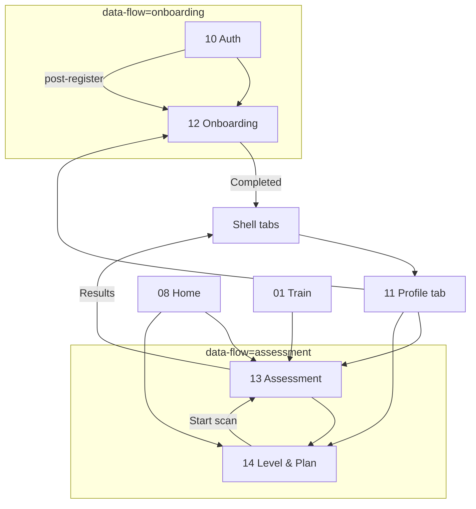
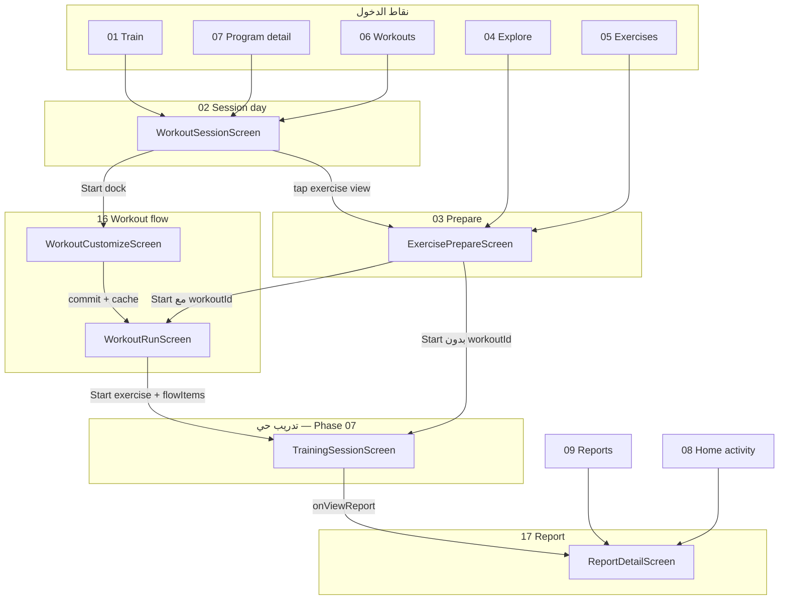
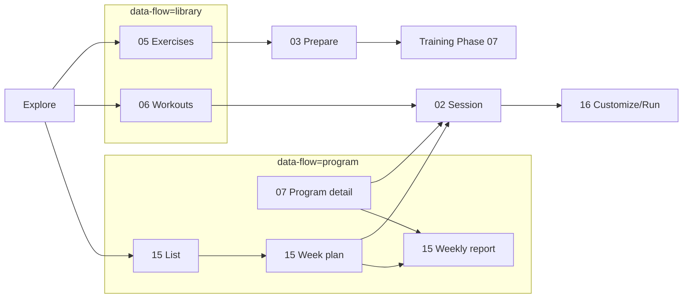

# تدقيق الفجوات — KMP الجديد مقابل Legacy والـ Prototype

**تاريخ التجميع:** 2026-06-12  
**النطاق:** 18 صفحة (00–17) — المسارات الأساسية والمنطق الأساسي  
**المنهجية:** 4 وكلاء مراجعة مستقلين × (Prototype HTML ↔ Legacy `kmp-app/app/src/main` ↔ KMP `kmp-app/feature/*`)

**مراجع:** [Android-KMP-Mobile-UI-UX-Phase-05-Page-By-Page-Modernization-Plan.md](Android-KMP-Mobile-UI-UX-Phase-05-Page-By-Page-Modernization-Plan.md) · [Page-Scorecards.md](Page-Scorecards.md) · [Sync-App-Pages.md](Sync-App-Pages.md) · [prototypes/](prototypes/)

**تصنيف الفروق:** `مطابق` | `تحسين مقصود` | `فجوة وظيفية` | `فجوة بصرية` | `مؤجل Phase 07` | `غائب`

---

## إغلاقات 2026-06-12

| الفجوة | الإجراء |
|--------|---------|
| **P0 #1 — تجاوز Program Detail (07)** | أُغلقت: Home `ViewProgramClicked` → `OpenProgramDetail`؛ Explore `OpenProgramDetail` / `NavigateToItem(Program)` → `MovitInnerRoute.ProgramDetail`؛ Train `StartProgramClicked` → `OpenProgramDetail`؛ ProgramList `onProgramClick` → `ProgramDetail` قبل WeekPlan |
| **تسمية `OpenProgramDetail`** | أُغلقت: الـ effect يوجّه الآن إلى `ProgramDetailScreen` وليس `ProgramWeekPlan` |
| **Explore Flow Reset** | أُغلقت: Explore → `ExerciseDetail` قبل Prepare؛ See all Ex/Workouts → صفحات مكتبة مع pagination؛ Program Detail → اختيار يوم + panel جلسات اليوم؛ Rest مربوط بعد `TrainingSession` داخل WorkoutRun؛ Train/Home يعيدان استخدام نفس inner routes |

> **ما بقي مفتوحاً في 07:** Edit tab persistence · محرر الجلسات · camera/pose polish — خارج نطاق إصلاح التنقل.

---

## ملخص تنفيذي عبر التطبيق

| القسم | الصفحات | فجوات حرجة | Scorecards (متوسط) |
|-------|---------|------------|-------------------|
| [1 — التبويبات الرئيسية](#القسم-1--التبويبات-الرئيسية-08--01--04--09) | 08 · 01 · 04 · 09 | **6** | 90–93% |
| [2 — الحساب والتقييم](#القسم-2--الحساب-والتقييم-10-14) | 10–14 | **17** | 68–92% |
| [3 — تدفق التدريب](#تدقيق-فجوات--تدفق-التدريب-section-03) | 02 · 03 · 16 · 17 | **4** | 82–95% |
| [4 — المكتبة والبرامج](#مراجعة-فجوات--القسم-04-المكتبة-والبرامج) | 00 · 05–07 · 15 | **5** | 82–84% |
| **الإجمالي** | **18 صفحة** | **~37** | — |

> **تعريف «فجوة حرجة»:** `فجوة وظيفية` أو `غائب` أو `مؤجل Phase 07` ذات أثر على الإطلاق — لا تشمل QA بصري/font-scale فقط.

### أهم الفجوات المتقاطعة (P0)

| # | الفجوة | الصفحات المتأثرة | التصنيف |
|---|--------|------------------|---------|
| 1 | ~~**تجاوز Program Detail (07)**~~ — **✅ أُغلق 2026-06-12** | Home · Explore · Train · ProgramList | — |
| 2 | **تدريب حي / كاميرا / pose** — `TrainingSession` موجود لكن polish غير مكتمل | 03 · 16 · Assessment 13 | مؤجل Phase 07 |
| 3 | **Assessment** — pose ML polish على iOS | 13 | مؤجل Phase 07 |
| 4 | ~~**Level** — region breakdown و limiting factors~~ | 14 | **مغلق 2026-06-12** |
| 5 | **Bootstrap إنتاج** — `SplashActivity` LAUNCHER *(خارج نطاق Phase 05)*؛ Google iOS SDK؛ StoreKit billing | 10–11 | فجوة وظيفية (جزئي: Android billing + iOS UX موثّق) |
| 6 | ~~**Customize (16)** — drag-reorder · حذف · reps~~ | 16 | **مغلق 2026-06-12** |
| 7 | ~~**Prepare يتجاوز WorkoutRun** داخل الجلسة~~ | 03 · 16 | **مغلق 2026-06-12** |

### ما يعمل بشكل جيد (لا فجوات حرجة)

- **Reports (09)** و **Report detail (17)** — أعلى نضجاً (90–95%)
- **Home (08)** — API + UDF + inner routes (فجوات تنقل محدودة)
- **Session day (02)** — حفظ · multi-workout · catch-up · skip-warmup
- **Library 05–06** — قوائم + فلاتر + تنقل Prepare/Session
- **Program flow 15** — list/week/report (مع فجوات share iOS)

### توصيات أولوية

| الأولوية | البند |
|----------|-------|
| **P0** | إصلاح مسارات التنقل → `ProgramDetailScreen` قبل WeekPlan |
| **P0** | Assessment iOS + body map + safety gates |
| **P0** | Level regions/limiting factors |
| **P1** | Edit tab persistence (07) — خارج نطاق customize 16 |
| **P1** | KMP launcher/bootstrap + iOS Google + billing |
| ~~**P1**~~ | ~~Prepare → WorkoutRun parity داخل الجلسة~~ — **مغلق 2026-06-12** |
| **Phase 07** | `TrainingSession` camera/pose polish · `AssessmentEngine` |

---

## التفاصيل حسب القسم

# القسم 1 — التبويبات الرئيسية (08 · 01 · 04 · 09)

> **تاريخ المراجعة:** 2026-06-12  
> **المنهجية:** مقارنة Prototype HTML ↔ Legacy (`kmp-app/app/src/main`) ↔ KMP (`feature/home|train|explore|reports` + `feature/shell`)  
> **مراجع:** [`Page-Scorecards.md`](../Page-Scorecards.md) · [`Sync-App-Pages.md`](../Sync-App-Pages.md) · `prototypes/08-home.html` · `01-train.html` · `04-explore.html` · `09-reports.html`

---

## ملخص تنفيذي

| الصفحة | Scorecard | الحالة العامة | فجوات حرجة (وظيفية) |
|--------|-----------|---------------|---------------------|
| **08 Home** | 94% | مسار أساسي مكتمل؛ pull-to-refresh + catch-up UI | 2 |
| **01 Train** | 91% | 5+ حالات dashboard؛ pull-to-refresh | 1 |
| **04 Explore** | 91% | أقسام كاملة + فلاتر + pull-to-refresh | 1 |
| **09 Reports** | 90% | 3 تبويبات + Pro gate + Report Detail | 0 |

**إجمالي الفجوات الحرجة (وظيفية) عبر التبويبات الأربعة: 4**

**أهم 3 فجوات:**

1. **Explore — بطاقة البرنامج** تفتح `ProgramWeekPlan` (15) بدل `ProgramDetail` (07) كما في `04-explore.html` *(Home/Train أُغلقا — 2026-06-12)*.
2. **Train — stepper sets** لا persist عبر `DayCustomizationStore` (UI محلي فقط).
3. **Home — Report preview** يفتح تبويب Reports فقط (ليس Report detail 17).

**تحسينات مقصودة (ليست فجوات):** بنية KMP مشتركة · Material 3 · `Movit*` DS · i18n ar/en · iOS compile · Explore أقسام Programs · Reports Pro upsell عبر `LaunchLegacySubscription` · نشاط Home → `ReportDetail` (17).

**مؤجل Phase 07:** كاميرا/pose في Assessment (مدخل Body scan من Home) · polish جلسة حية.

---

## 08 — Home

**Prototype:** `08-home.html` — `state-switch`: `active` · `scan` · `alert` · `empty`  
**Legacy:** `HomeFragment` + `HomeRepository` → `GET /api/mobile/home`  
**KMP:** `MovitHomeScreen` · `MovitHomeViewModel` · `SharedHomeRepository` · `HomeApiMapper`

### مسار التنقل

| نقطة الدخول | Prototype | Legacy | KMP |
|-------------|-----------|--------|-----|
| تبويب رئيسي (Navbar) | ✅ | `MainContainerActivity` tab Home | `MovitAppDestination.Home` في `MovitShellFloatingDestinations` |
| Avatar / Profile | header avatar | `ProfileActivity` | `MovitHomeEffect.OpenProfile` → تبويب Profile |
| Start workout / Today plan | زر primary | `ProgramWorkoutActivity` عبر `navigateToPlannedWorkout` | `StartTodayPlanClicked` → `OpenTrain` (تبويب Train) |
| View program | `btn--outline` | `ProgramDetailActivity` (slug) | `ViewProgramClicked` → `OpenProgramDetail` (07) ✅ |
| Body scan | lime accent CTA | `PreScreeningActivity` | `OpenAssessment` → `MovitInnerRoute.Assessment` |
| Level card | hero level | `LevelProfileActivity` | `OpenLevel` → `MovitInnerRoute.LevelProfile` |
| Journey → View plan | `14-level-plan.html` | `PlanOverviewActivity` | `ViewPlanClicked` → Level inner |
| Recent activity row | → `09-reports` / detail | تقرير تمرين | `RecentActivityClicked(id)` → `OpenReportDetail` (exerciseId/slug) |
| Report preview card | → reports | — | `HomeReportPreview` → **تبويب Reports فقط** ⚠️ |
| Quick actions Explore/Reports | tiles | tab switch | `OpenExplore` / `OpenReports` |
| Alert banner | insight warning | تنقل حسب نوع التنبيه | `AlertClicked(type)` → Train / Assessment / Level |

**Deep links / inner stack:** `MovitAppShellViewModel.handleHomeEffect` — لا deep link URI مستقل؛ التنقل عبر effects → tab أو `pushInner`.

### الحالات

| حالة Prototype | مصدر البيانات | Legacy (`trainMode.status`) | KMP (`HomeApiMapper`) |
|----------------|---------------|----------------------------|------------------------|
| `active` | برنامج + اليوم | `active` | `todayPlan` + `activeProgram` + metrics |
| `scan` | Body scan CTA | `no_assessment` | `showBodyScanCta = true` |
| `alert` | plan adjusted | `alerts[]` / progression | `alert` أو `insightMessage` |
| `empty` | no program | `no_plan` | `showNoProgramEmpty` |
| *(إضافي)* | — | `rest_day` · `program_complete` · `reassessment_due` | `todayPlan` مخصص لكل حالة |
| Loading | — | cache ثم sync | `MovitLoadingState` |
| Error | — | fallback cache | `MovitErrorState` + retry |

**مُغلق 2026-06-12:** `PullToRefreshBox` · catch-up UI (`catchUpSuggestion` → `OpenCatchUpDay` → Session 02 بمفتاح `_auto`).

### المنطق

| الطبقة | التفاصيل |
|--------|----------|
| **ViewModel** | `MovitHomeViewModel` — UDF؛ `observeDashboard()` flow |
| **Repository** | `SharedHomeRepository` — `staleWhileRevalidate(screenId="home")` |
| **API** | `MovitData.home.sync()` → `GET api/mobile/home` (`MovitMobileApi`) |
| **Mapper** | `HomeApiMapper` — metrics · level · alerts · journey · `recentWorkouts` |
| **اختبارات** | `MovitHomeStateTest` · `HomeApiMapperTest` · `HomeSummaryCalculatorTest` · shell |

### المكونات

| Prototype / Legacy | KMP `Movit*` |
|--------------------|--------------|
| `dashboard-hero` | `HomeHeroSummary` + `MovitDashboardHero` |
| `metric-row` | `MovitStatTileRow` |
| level hero | `HomeLevelCard` |
| `insight--warning` | `MovitInsightCard` |
| `state-card` program/today | `HomeActiveProgramSection` · `TodayPlanCard` |
| `accent--lime` scan | `MovitAccentBlock` |
| `empty-state` | `MovitEmptyState` |
| journey `list-row` | `MovitListGroup` / `MovitListRow` |
| `act-row` activity | `MovitListRow` + FitnessCenter icon |
| `quick-grid` | `HomeQuickActions` + `MovitIconBox` |
| SwipeRefresh | `PullToRefreshBox` ✅ |

### Actions / CTAs الرئيسية

| CTA | النتيجة KMP |
|-----|-------------|
| Start workout | تبويب Train |
| Start scan | Assessment (13) |
| Browse programs (empty) | Explore |
| View program | `ProgramDetail` (07) |
| All reports / activity | Reports tab أو Report Detail (17) |
| View plan | Level (14) |

### جدول الاختلافات

| البند | Prototype | Legacy | KMP | التصنيف |
|-------|-----------|--------|-----|---------|
| تبويب رئيسي + hero + metrics | ✅ | ✅ | ✅ | **مطابق** |
| 4 حالات state-switch + حالات API إضافية | ✅ | ✅ | ✅ | **مطابق** |
| Level → Level profile | ✅ | ✅ | ✅ inner | **مطابق** |
| Body scan CTA | ✅ | ✅ | ✅ (placeholder كاميرا Phase 07) | **مؤجل Phase 07** (التدريب الحي) · CTA **مطابق** |
| Activity → Report detail | ✅ | جزئي | ✅ `OpenReportDetail(exerciseId)` | **مطابق** |
| View program → Program detail (07) | ضمني | `ProgramDetailActivity` | `OpenProgramDetail` (07) | **مطابق** *(2026-06-12)* |
| Report preview → detail | → reports | — | تبويب Reports فقط | **فجوة وظيفية** |
| Pull-to-refresh | — | `SwipeRefreshLayout` | `PullToRefreshBox` | **مطابق** *(2026-06-12)* |
| Catch-up suggestion على Home | — | `bindCatchUpUi` | `MovitInsightCard` + Session 02 | **مطابق** *(2026-06-12)* |
| Material 3 + `home_*` i18n | — | XML | Compose DS | **تحسين مقصود** |
| Dark mode QA | toggle في proto | ✅ | tokens سليمة؛ QA يدوي | **فجوة بصرية** (QA فقط) |
| RTL ellipsis على hero | — | — | `MovitDashboardHero` | **تحسين مقصود** |

---

## 01 — Train

**Prototype:** `01-train.html` — `state-switch`: `noprogram` · `active` · `restday` · `daydone` · `complete`  
**Legacy:** `TrainFragment` — `ProgramRepository` + `HomeRepository` + charts MPAndroid  
**KMP:** `MovitTrainScreen` · `MovitTrainViewModel` · `SharedTrainRepository` · `TrainApiMapper`

### مسار التنقل

| Action | Prototype | Legacy | KMP |
|--------|-----------|--------|-----|
| تبويب Train | ✅ | `MainContainerActivity` | `MovitAppDestination.Train` |
| No program → Start program | بطاقات برامج | `ProgramListActivity` / enroll | `StartProgramClicked` → `OpenProgramWeekPlan` |
| Browse programs | نص أسفل | `ProgramListActivity` | `OpenProgramList` → inner 15 |
| Start session | داخل sess-card | `ProgramWorkoutActivity` | `OpenProgramWorkout` → `WorkoutSession` (02) |
| View full reports / journey | أزرار | `WeeklyReportActivity` · Reports | `OpenWeeklyReport` / `OpenReports` |
| Program complete → What's next | CTA | `ProgramListActivity` | `OpenProgramList` |
| Assessment (no assessment) | — | `PreScreeningActivity` | `OpenAssessment` |
| Avatar | header | `ProfileActivity` | عبر shell scaffold (إن وُجد) |

### الحالات

| Prototype | KMP `TrainDashboardStatus` | ملاحظات |
|-----------|---------------------------|---------|
| `noprogram` | `NoPlan` | + `NoAssessment` · `ReassessmentDue` |
| `active` | `ActivePlan` | جلسات متعددة قابلة للطي |
| `restday` | `RestDay` | بطاقة راحة + غدًا |
| `daydone` | `CompletedToday` | banner يوم مكتمل |
| `complete` | `ProgramComplete` | trophy + View journey / What's next |
| — | Loading / Error | `MovitLoadingState` · `MovitErrorState` |

مصدر الحالة: `trainMode.status` من **`GET /api/mobile/home`** (نفس home API) + `explore` cache لبطاقات NoPlan.

### المنطق

| الطبقة | التفاصيل |
|--------|----------|
| **ViewModel** | `MovitTrainViewModel` — week index · effects |
| **Repository** | `SharedTrainRepository` — `staleWhileRevalidate("train")` |
| **API** | `MovitData.home.sync()` + `MovitData.explore.readCached()` للبرامج المميزة |
| **Mapper** | `TrainApiMapper` — week preview · sessions · form trend · KPI report |
| **اختبارات** | `MovitTrainStateTest` (10+) · `TrainApiMapperTest` |

### المكونات

| Prototype | Legacy | KMP |
|-----------|--------|-----|
| hero active program | identity card | `TrainStatusBanner` + program block في banner |
| `week` + nav | calendar Recycler | `TrainWeekPreview` + أزرار ←/→ |
| `sess-card` expandable | custom expand + stepper | `MovitSessionCard` + `MovitStepper` |
| form trend chart | MPAndroid LineChart | `TrainReportSection` + `MovitLineChart` |
| program report KPI | ReportAggregator | `TrainReportSection` kpi grid |
| prog-card (no plan) | Recycler | `TrainFeaturedProgramCard` + `MovitRemoteImage` |
| readiness | — | `TrainReadinessCard` |
| quick actions | — | `TrainQuickActions` |

### Actions / CTAs الرئيسية

| CTA | الحالة | KMP effect |
|-----|--------|------------|
| Start session | ActivePlan | `OpenProgramWorkout` |
| Start program (بطاقة) | NoPlan | `OpenProgramWeekPlan(week=1)` |
| Browse programs | متعدد | `OpenProgramList` |
| View day summary / reports | CompletedToday | `OpenWeeklyReport` أو Reports |
| View journey | ProgramComplete | `OpenWeeklyReport` |
| What's next | ProgramComplete | `OpenProgramList` |

### جدول الاختلافات

| البند | Prototype | Legacy | KMP | التصنيف |
|-------|-----------|--------|-----|---------|
| 5 حالات dashboard | ✅ | ✅ | ✅ (+ assessment states) | **مطابق** |
| Week navigation | ✅ | ✅ | ✅ `weekOptions` | **مطابق** |
| جلسات expandable + Start | ✅ | ✅ | ✅ `MovitSessionCard` | **مطابق** |
| Stepper sets في الجلسة | ✅ UI | يحفظ عبر `DayCustomizationStore` | UI محلي فقط — **لا persist** | **فجوة وظيفية** |
| Form trend + delta | ✅ | ✅ chart | ✅ + a11y | **مطابق** |
| Program report KPI | ✅ | ✅ | ✅ | **مطابق** |
| Program complete trophy/CTAs | ✅ | ✅ | ✅ | **مطابق** |
| صور برامج/جلسات | ✅ | Coil | `MovitRemoteImage` KMP | **تحسين مقصود** |
| Pull-to-refresh | — | ✅ | `PullToRefreshBox` | **مطابق** *(2026-06-12)* |
| Session thumbnails iOS | — | — | Coil KMP | **مطابق** (2026-06-12) |
| Font-scale QA يدوي | — | — | — | **فجوة بصرية** (QA) |

---

## 04 — Explore

**Prototype:** `04-explore.html` — `data-flow="library"`  
**Legacy:** `ExploreFragment` — `ExerciseRepository` + `WorkoutRepository` (محلي/sync)  
**KMP:** `MovitExploreScreen` · `MovitExploreViewModel` · `ExploreRepository` (API cache)

### مسار التنقل

| Action | Prototype | Legacy | KMP |
|--------|-----------|--------|-----|
| تبويب Explore | ✅ | tab | `MovitAppDestination.Explore` |
| Workout card | `02-session.html` | `WorkoutDetailActivity` | `OpenWorkoutSession` → `WorkoutSession` (02) — **أقرب للـ prototype** |
| Exercise card | `03-prepare.html` | `ExerciseDetailActivity` | `OpenExerciseDetail` → `ExerciseDetail` → Prepare |
| Program card | `07-program.html` | **لا قسم programs** | `OpenProgramDetail` → `ProgramDetailScreen` |
| See all workouts | `06-workouts.html` | scroll/filter | `OpenWorkoutsLibrary` (pagination) |
| See all exercises | `05-exercises.html` | scroll/filter | `OpenExercisesLibrary` (pagination) |
| See all programs | — | — | `OpenProgramList` (15) |
| Featured recommended | feature-card | — | `ExploreHero` → workout/exercise |
| Filter button | filter-btn | bottom sheet جزئي | `secondaryFiltersVisible` + chips |

### الحالات

| الحالة | KMP |
|--------|-----|
| Loading | `MovitLoadingState` |
| Error + retry | `MovitErrorState` |
| Empty (بعد فلترة) | `MovitEmptyState` |
| Data | أقسام Recommended / Workouts / Exercises / Programs |
| Refreshing | `PullToRefreshBox` + `isRefreshing` |

لا `state-switch` في prototype؛ الحالات منطقية من الفلاتر والـ API.

### المنطق

| الطبقة | التفاصيل |
|--------|----------|
| **ViewModel** | `MovitExploreViewModel` — فلاتر · scroll targets |
| **Repository** | `defaultExploreRepository()` → `GET api/mobile/explore` |
| **Filters** | `ExploreContentFilter` · `ExploreWorkoutFilter` · muscle strip · category chips |
| **اختبارات** | `MovitExploreStateTest` (14+) · theme boundary |

### المكونات

| Prototype | Legacy | KMP |
|-----------|--------|-----|
| `library-toolbar` search+chips | chips + search | `ExploreSearchSection` · `ExploreFilterSection` |
| `muscle-strip` | جزئي (workout filters) | `ExploreMuscleStrip` |
| `workout-intro` | — | `ExploreWorkoutIntro` |
| `wide-media-card` + focus pill | Recycler rows | `MovitMediaCard` + focus meta |
| `media-card-grid` | grid | `ExploreExerciseList` |
| `prog-card` programs | **غائب** | `MovitProgramCard` |
| notifications bell | ✅ header | **غائب** في KMP scaffold |
| pull-to-refresh | — | ✅ `PullToRefreshBox` |

### Actions / CTAs الرئيسية

- نقرة عنصر: حسب `ExploreItemType` → Session / Prepare / WeekPlan  
- See all: library inner routes (05–06) أو Program list (15)  
- Filter: toggle chips + sheet

### جدول الاختلافات

| البند | Prototype | Legacy | KMP | التصنيف |
|-------|-----------|--------|-----|---------|
| بحث + فلاتر All/Exercises/Workouts/Programs | ✅ | جزئي (بدون Programs) | ✅ كامل | **تحسين مقصود** (Programs) |
| muscle-strip + workout-intro + focus pills | ✅ | جزئي | ✅ | **مطابق** |
| صور وسائط | ✅ | Coil | `MovitRemoteImage` | **تحسين مقصود** |
| Workout → session builder | 02-session | WorkoutDetail | WorkoutSession (02) | **تحسين مقصود** (محاذاة prototype) |
| Exercise → prepare | 03 | ✅ | ✅ | **مطابق** |
| Program → Program detail (07) | ✅ | غائب | Week plan (15) | **فجوة وظيفية** |
| قسم Programs كامل | ✅ | غائب | ✅ | **تحسين مقصود** |
| Pull-to-refresh | — | Legacy ✅ | ✅ KMP | **مطابق** |
| أيقونة إشعارات header | ✅ | — | غائب | **فجوة بصرية** |
| `explore_a11y_*` | — | — | ✅ | **تحسين مقصود** |

---

## 09 — Reports

**Prototype:** `09-reports.html` — `state-switch`: `data` · `empty` · `locked` · `loading` + tabs Overview/Exercises/Trends  
**Legacy:** `HistoryFragment` + `ReportsHubViewModel` + 3 child fragments + `SwipeRefreshLayout`  
**KMP:** `MovitReportsScreen` · `MovitReportsViewModel` · `SharedReportsRepository`

### مسار التنقل

| Action | Prototype | Legacy | KMP |
|--------|-----------|--------|-----|
| تبويب Reports | ✅ | tab | `MovitAppDestination.Reports` |
| Exercise row | — | `WorkoutReportActivity` | `OpenReportDetail` → inner 17 |
| Empty → Start training | زر | tab Train | `OpenTrain` |
| Locked → Upgrade | زر | `SubscriptionActivity` | `OpenUpgrade` → `LaunchLegacySubscription` |
| Pull refresh | نص hint | swipe | `PullToRefreshBox` |

### الحالات

| Prototype | Legacy `ReportsHubUiState` | KMP `ReportsHubState` |
|-----------|---------------------------|----------------------|
| `loading` | Loading | `isLoading` + skeleton |
| `empty` | Empty | Empty + CTA |
| `locked` | Locked (Pro) | Locked + Upgrade |
| `data` | Success | Success + 3 tabs |
| error | Error | Error + retry |

### المنطق

| الطبقة | التفاصيل |
|--------|----------|
| **ViewModel** | `MovitReportsViewModel` — tab · refresh |
| **Repository** | `SharedReportsRepository` — Pro gate · `staleWhileRevalidate("reports")` |
| **API** | `GET api/mobile/reports/dashboard` (+ metrics للتفصيل 17) |
| **Mapper** | `ReportsApiMapper` — KPI · charts · improvement · attendance · fatigue |
| **اختبارات** | `MovitReportsStateTest` · `ReportsApiMapperTest` |

### المكونات

| Prototype | Legacy | KMP |
|-----------|--------|-----|
| `reports-tabs` underline | TabLayout + ViewPager2 | `MovitUnderlineTabRow` |
| KPI grid | fragments | Overview section |
| form line chart | custom | `MovitLineChart` |
| weekly bars | custom | `MovitBarChart` |
| `ex-report` + score-pill | list | Exercises tab + tinted pills |
| trends insight + volume + fatigue | TrendsFragment | Trends tab sections |
| SwipeRefresh | ✅ | `PullToRefreshBox` |

### Actions / CTAs الرئيسية

| CTA | KMP |
|-----|-----|
| Upgrade (locked) | `SubscriptionActivity` (Android) |
| Start training (empty) | تبويب Train |
| Exercise row | `ReportDetailScreen` (17) |
| Pull to refresh | `RefreshRequested` → `getReportsDashboard(refresh=true)` |

### جدول الاختلافات

| البند | Prototype | Legacy | KMP | التصنيف |
|-------|-----------|--------|-----|---------|
| 3 tabs + underline styling | ✅ | ✅ | ✅ | **مطابق** |
| 4 hub states | ✅ | ✅ | ✅ | **مطابق** |
| Pro gate + upsell | ✅ | ✅ | ✅ `LaunchLegacySubscription` | **مطابق** |
| Overview KPI + charts | ✅ | ✅ | ✅ | **مطابق** |
| Exercises + score pills ملونة | ✅ | ✅ | ✅ | **مطابق** |
| Trends: improvement + volume + attendance + fatigue | ✅ | ✅ | ✅ | **مطابق** |
| Navigation → Report detail (17) | — | ✅ | ✅ | **مطابق** |
| Pull-to-refresh | hint | ✅ | ✅ | **مطابق** |
| Chart a11y نقطة بنقطة | — | — | ملخص فقط `reports_a11y_*` | **تحسين مقصود** (مقبول Phase 05) |
| Share/export من Hub | — | جزئي | في 17 فقط | **غائب** على Hub (ليس حرجاً للتبويب) |
| Visual polish charts | SVG دقيق | XML | Compose — فروق spacing | **فجوة بصرية** طفيفة |

---

## Shell — تنقل مشترك للتبويبات

| البند | الحالة |
|-------|--------|
| 4 تبويبات + Profile في floating nav | `MovitShellFloatingDestinations` |
| Tab labels i18n | `nav_*` · `dest_*_subtitle` |
| Inner stack | `MovitInnerHost` — Session · Prepare · ReportDetail · Program flows |
| Back | `BackHandler` + shell tests |
| RTL | `MovitLocaleProvider` |

**Effects routing (ملخص):**

- Home → Train / Explore / Reports / Profile / Assessment / Level / ReportDetail  
- Train → ProgramList · ProgramWeekPlan · WeeklyReport · WorkoutSession · Assessment · Explore · Reports  
- Explore → ExercisesLibrary · WorkoutsLibrary · ProgramList · **ProgramWeekPlan** · WorkoutSession · ExercisePrepare  
- Reports → Train · Upgrade · ReportDetail  

---

## ملحق — تصنيفات مرجعية

| التصنيف | المعنى |
|---------|--------|
| **مطابق** | نفس المسار والمنطق الجوهري بين KMP وPrototype/Legacy |
| **تحسين مقصود** | اختلاف مقصود (KMP · M3 · iOS · محاذاة prototype أحدث) |
| **فجوة وظيفية** | سلوك أو API أو تنقل ناقص يؤثر على المستخدم |
| **فجوة بصرية** | polish · QA · عنصر UI ثانوي |
| **مؤجل Phase 07** | كاميرا · pose · training engine |
| **غائب** | غير منفذ ولا مُخطط في Phase 05 |

---

## روابط التنفيذ

| صفحة | KMP رئيسي | Legacy |
|------|-----------|--------|
| 08 | `feature/home/.../MovitHomeScreen.kt` | `ui/home/HomeFragment.kt` |
| 01 | `feature/train/.../MovitTrainScreen.kt` | `ui/programs/TrainFragment.kt` |
| 04 | `feature/explore/.../MovitExploreScreen.kt` | `ui/explore/ExploreFragment.kt` |
| 09 | `feature/reports/.../MovitReportsScreen.kt` | `ui/reports/HistoryFragment.kt` |
| Shell | `feature/shell/.../MovitAppShellViewModel.kt` | `ui/main/MainContainerActivity.kt` |


---

# القسم 2 — الحساب والتقييم (10–14)

**تاريخ المراجعة:** 2026-06-12  
**المراجع:** Prototypes `10-auth.html` … `14-level-plan.html` · KMP `kmp-app/feature/account` · Legacy `kmp-app/app/src/main` · [`Page-Scorecards.md`](../Page-Scorecards.md) · [`Sync-App-Pages.md`](../Sync-App-Pages.md) · [`Onboarding-Page-Modernization-Spec.md`](../Page-Specs/Onboarding-Page-Modernization-Spec.md)

**تصنيف الفروق:** `مطابق` | `تحسين مقصود` | `فجوة وظيفية` | `فجوة بصرية` | `مؤجل Phase 07` | `غائب`

**Scorecards (canonical):** Auth **92%** · Profile **90%** · Onboarding **90%** · Assessment **82%** · Level **84%**

---

## خريطة التدفق العامة



| المصدر | مسار KMP (`MovitInnerRoute`) | Legacy |
|--------|------------------------------|--------|
| Shell init | `resolveStartupInnerStack` → `Auth` أو `ProfileOnboarding` أو shell | `SplashActivity` → `OnboardingActivity` / `SignInActivity` / `ProfileOnboardingActivity` / `MovitMainActivity` |
| بعد login | `emitPostAuthNavigation` → `OpenOnboarding` \| `OpenShell` | `SignInActivity` → onboarding gate → home |
| Profile | تبويب Account → effects | `ProfileActivity` (Activity منفصلة) |
| Assessment legacy entry | `MovitInnerRoute.Assessment` | `PreScreeningActivity` → `MovitTrainingEntryNavigator.openAssessment` → shell |
| Level legacy | `MovitInnerRoute.LevelProfile` | `LevelProfileActivity` + `PlanOverviewActivity` (شاشتان) |

---

## 10 — Auth (`MovitAuthScreen`)

**Prototype:** `10-auth.html` — `state-switch`: splash · intro · signin · signup · forgot  
**KMP:** `MovitAuthScreen.kt` · `MovitAuthViewModel.kt` · `SharedAuthRepository.kt` · `GoogleSignInHost`  
**Legacy:** `SplashActivity` · `OnboardingActivity` · `SignInActivity` · `SignUpActivity` · `ForgotPasswordActivity`

### مسار التنقل

| الخطوة | Prototype | KMP | Legacy |
|--------|-----------|-----|--------|
| إطلاق التطبيق | Splash → Intro (أول مرة) → Sign in | Shell يدفع `MovitInnerRoute.Auth`؛ ViewModel يبدأ `Splash` ثم bootstrap | `SplashActivity` LAUNCHER (2.5s) |
| أول تشغيل | Intro 3 شرائح + Skip | `Intro` 3 صفحات + Skip → `intro_seen` في `movit_auth` prefs | `OnboardingActivity` (slides منفصلة عن auth KMP) |
| جلسة نشطة | — | `ActiveSession` → `emitPostAuthNavigation` مباشرة | token صالح → onboarding gate → home |
| بعد login/register | — | `OpenOnboarding` إذا `!isOnboardingCompleted` وإلا `OpenShell` (pop inner) | `ProfileOnboardingActivity` أو `MovitPostLoginNavigator.homeActivityClass()` |
| Google | Continue with Google | `GoogleSignInHost` + `POST api/mobile/auth/google` | `GoogleSignInHelper` + `ApiClient.authApi` |
| Forgot | Reset link + success | `Forgot` panel + `forgotPasswordSent` | `ForgotPasswordActivity` |

### الحالات

| الحالة | Prototype | KMP | Legacy |
|--------|-----------|-----|--------|
| Splash | شعار + progress bar + version | `AuthSplashPanel` + delay 1.8s | animation + version |
| Intro | dots + Continue/Skip | `introPage` 0..2 | `OnboardingActivity` |
| Sign in/up | forms + inline errors | `isLoading` · `errorMessage` · validation keys `auth_error_*` | Toast + field validation |
| Forgot sent | — (implicit) | success panel parity | success UI |
| Google pending | — | `pendingGoogleSignIn` | activity result |

### المنطق (API · bootstrap · routing)

- **API:** `SharedAuthRepository` → `MovitData.account.login|register|googleAuth|forgotPassword`
- **Bootstrap:** `AuthBootstrapContext.fromMovitData()` · `resolveBootstrapTarget()` · `MovitAppShellViewModel.resolveStartupInnerStack()`
- **Shell:** `MovitAuthEffect` → `AuthEffectReceived` → pop / push onboarding / snackbar
- **Legacy launcher:** `SplashActivity` ما زال `LAUNCHER` في Manifest؛ KMP auth داخل shell عند `MOVIT_SHELL_LAUNCHER_ENABLED`

### المكونات

| Prototype | KMP DS | Legacy |
|-----------|--------|--------|
| auth-logo · auth-form · auth-divider | `MovitButton` · `OutlinedTextField` · `LinearProgressIndicator` (splash) | Material XML layouts |
| onboard-dots | page indicator في Intro | ViewPager slides |
| Remember me checkbox | `Checkbox` | XML checkbox |
| Google outline button | `MovitButton` Outlined | Material button |

### جدول الاختلافات

| البند | Prototype | Legacy | KMP | التصنيف |
|-------|-----------|--------|-----|---------|
| 5 شاشات auth في ملف واحد | ✅ | Activities منفصلة | ✅ `AuthScreen` enum | مطابق |
| POST login/register | — | ✅ | ✅ | مطابق |
| Google OAuth | ✅ | ✅ Android | ✅ Android · iOS blocker موثّق + UX | **مؤجل** (iOS SDK bridge) · Android **مطابق** |
| Intro 3 صفحات | ✅ | `OnboardingActivity` منفصل | ✅ داخل `MovitAuthScreen` | تحسين مقصود |
| Splash كـ launcher إنتاجي | — | ✅ `SplashActivity` | inner route فقط | **فجوة وظيفية** *(خارج النطاق — Phase 05 debug-only shell؛ لا تغيير Manifest)* |
| Forgot success panel | — | ✅ | ✅ | مطابق |
| validation i18n | — | جزئي | ✅ `auth_error_*` en/ar | تحسين مقصود |
| Sign up بدون Google divider | signup بلا Google | — | signup بلا Google (prototype parity) | مطابق |

---

## 11 — Profile (`MovitProfileScreen`)

**Prototype:** `11-profile.html` — `state-switch`: free · pro · sub  
**KMP:** `MovitProfileScreen.kt` · `MovitProfileViewModel.kt` · `SharedProfileRepository.kt` · `MovitSubscriptionScreen.kt`  
**Legacy:** `ProfileActivity` · `SubscriptionActivity`

### مسار التنقل

| المصدر | الوجهة | KMP effect / route |
|--------|--------|-------------------|
| Shell tab Account | — | `MovitProfileRoute` في `MovitAppShell.kt` |
| Sign in prompt | Auth | `OpenAuth` → `MovitInnerRoute.Auth` |
| Training profile | Onboarding 12 | `OpenOnboarding` → `ProfileOnboarding` |
| Assessment | 13 | `OpenAssessment` |
| Level | 14 | `OpenLevel` → `LevelProfile` |
| View/Manage Pro | Subscription | `OpenSubscription` → `MovitSubscriptionScreen` أو `LaunchLegacySubscription` |
| Logout | Auth stack | `LoggedOut` → push Auth |

### الحالات

| الحالة | Prototype | KMP | Legacy |
|--------|-----------|-----|--------|
| Signed-out | — | `MovitEmptyState` + Sign in CTA | redirect `SignInActivity` |
| Loading | — | `MovitLoadingState` | progress |
| Error | — | `MovitErrorState` | Toast |
| Free / Pro | `free` · `pro` | `ProCard` + `MovitTag` Gold | bind Pro UI |
| Subscription | `sub` | overlay `MovitSubscriptionScreen` | `SubscriptionActivity` |
| Pickers | — | Language · Appearance · Logout confirm dialogs | AlertDialog |

### المنطق

- **API:** `GET` profile session · `GET /api/mobile/training-profile` → `TrainingProfileSummaryMapper`
- **Settings:** language/theme/haptic/audio → shell effects `LanguageChanged` · `ThemeModeChanged`
- **Logout:** repository + `UserDataCleaner` parity عبر shell
- **Subscription billing:** `MovitSubscriptionScreen` Subscribe/Restore → `OpenSubscription` → `LaunchLegacySubscription` (Android)؛ iOS رسالة `profile_subscription_ios_unavailable`

### المكونات

| Prototype | KMP | Legacy |
|-----------|-----|--------|
| profile-hero + edit badge | `MovitAvatar` + edit icon (stub message) | `bindUserAvatar` |
| pro-card Free/Pro | `ProCard` · `MovitTag` Gold | XML pro section |
| settings-group rows | `MovitListCard` · `MovitListRow` · toggles | `activity_profile.xml` |
| sub plan pricing | `MovitSubscriptionScreen` static | `SubscriptionActivity` |

### جدول الاختلافات

| البند | Prototype | Legacy | KMP | التصنيف |
|-------|-----------|--------|-----|---------|
| Hero avatar + name/email | ✅ | ✅ | ✅ | مطابق |
| Edit profile / avatar upload | edit badge | قريباً | `profile_edit_coming_soon` i18n (parity legacy) | **مؤجل** (upload API غائب) |
| Pro Free/Active cards | ✅ | ✅ | ✅ | مطابق |
| Training profile summary | — | ✅ fetch | ✅ API mapper | مطابق |
| Language + Appearance | ✅ | ✅ | ✅ shell sync | مطابق |
| Haptic / audio toggles | — | voice + haptic | ✅ | تحسين مقصود |
| Exercise settings dialog | — | ✅ | — | غائب (خارج prototype) |
| Subscription billing حقيقي | Subscribe now | Play Billing | `MovitSubscriptionScreen` → `LaunchLegacySubscription` (Android) | **مطابق** *(2026-06-12)* · iOS StoreKit **مؤجل** |
| روابط Assessment/Level/Onboarding | — | intents | inner routes | مطابق |
| More menu (⋮) | ✅ | — | — | فجوة بصرية |
| Lifetime stats | — | ✅ | — | غائب |

---

## 12 — Onboarding (`MovitOnboardingScreen`)

**Prototype:** `12-profile-onboarding.html` — 7 خطوات wizard  
**KMP:** `MovitOnboardingScreen.kt` · `MovitOnboardingViewModel.kt` · `OnboardingData.kt` · `SharedOnboardingRepository.kt`  
**Legacy:** `ProfileOnboardingActivity` + 7 fragments · `OnboardingViewModel`

**Page-Spec:** [`Onboarding-Page-Modernization-Spec.md`](../Page-Specs/Onboarding-Page-Modernization-Spec.md)

### مسار التنقل

| المصدر | السلوك |
|--------|--------|
| Auth post-register | `OpenOnboarding` → push `ProfileOnboarding` |
| Shell bootstrap | signed-in + incomplete profile → startup stack = onboarding only |
| Profile → Training profile | `OpenOnboarding` |
| Completed | `MovitOnboardingEffect.Completed` → shell pop inner |
| Back على خطوة 0 | pop inner (finish wizard) |

### الحالات

| الحالة | KMP |
|--------|-----|
| Steps 1–7 | `step` 0..6 · `MovitProgressBar` · `progressPercent` |
| Validation error | `validationErrorKey` → `onboarding_error_*` |
| Submitting | `isSubmitting` disables Continue |
| Submit failure | `submitErrorMessage` + retry banner |
| canContinue | `OnboardingData.isStepValid(step)` |

### المنطق

- **API:** `PUT /api/mobile/training-profile` via `OnboardingData.toTrainingProfileRequest()` — parity `ProfileOnboardingActivity.toPayload`
- **Validation:** age 13–90 · height 120–220 · weight 30–200 · home → auto `bodyweight` equipment · disclaimer required step 7
- **Weekdays:** index 0=Sun … 6=Sat · عرض Mon-first

### المكونات

| الخطوة | Prototype | KMP |
|--------|-----------|-----|
| 1 About | age + gender grid | ✅ gender cards 3 أعمدة |
| 2 Metrics | height/weight grid | ✅ |
| 3 Experience | chips مستوى + chips مدة تدريب | resistance chips + **slider** جلسات/أسبوع |
| 4 Goal | goal cards | ✅ |
| 5 Days | week-grid | ✅ Mon-first grid |
| 6 Location/equipment | location + equip-grid | ✅ cards |
| 7 Summary | summary rows + disclaimer | ✅ |

### جدول الاختلافات

| البند | Prototype | Legacy | KMP | التصنيف |
|-------|-----------|--------|-----|---------|
| 7 خطوات + progress | ✅ | ✅ ViewPager | ✅ | مطابق |
| PUT training-profile | — | ✅ | ✅ mapping parity | مطابق |
| Experience UI | chips مدة (New / 6–12mo …) | slider sessions | slider sessions | فجوة بصرية (prototype) · مطابق legacy |
| resistance level chips | ✅ 3 chips | ✅ | ✅ | مطابق |
| Step icons / hero lime step 3 | ✅ | جزئي | ✅ eyebrow cards | فجوة بصرية (طفيفة) |
| font-scale 200% QA | — | — | جزئي a11y | فجوة بصرية |
| A11y selection states | — | — | ✅ 2026-06-12 | تحسين مقصود |

---

## 13 — Assessment (`MovitAssessmentScreen`)

**Prototype:** `13-assessment.html` — `state-switch`: prescreen · session · result  
**KMP:** `MovitAssessmentScreen.kt` · `MovitAssessmentViewModel.kt` · `SharedAssessmentRepository.kt` · `AssessmentApiMapper.kt` · `AssessmentBodyScanEngine.kt` · `AssessmentCameraHost`  
**Legacy:** `PreScreeningActivity` → `MovitTrainingEntryNavigator` → KMP assessment · `AssessmentResultActivity` (نتائج legacy منفصلة)

> **ملاحظة:** لا يوجد `AssessmentSessionActivity` في Legacy الحالي؛ مسار الفحص الحي يُوجَّه إلى shell assessment (`ROUTE_ASSESSMENT`).

### مسار التنقل

| المرحلة | Prototype | KMP | Legacy |
|---------|-----------|-----|--------|
| Entry | Home / Profile CTA | `pushInner(Assessment)` من Home · Profile · Train · Level | `PreScreeningActivity.createIntent` |
| PreScreening | PAR-Q + Continue | `AssessmentPhase.PreScreening` · 7 أسئلة | `ParqQuestions` ×7 · switches |
| Body scan | camera + movements | `BodyScan` + `AssessmentCameraHost` | → shell KMP (لا TrainingActivity منفصل) |
| Results | regions + insights + CTAs | `Results` · Browse / Home | `AssessmentResultActivity` (sections إضافية) |
| Back | float header | `NavigateBack` / phase back | finish activity |

### الحالات

| الحالة | KMP fields |
|--------|------------|
| PAR-Q | `parqAnswers` Map · progress a11y · physician snackbar on Yes |
| Body scan | `scanProgressPercent` · `scanMovementIndex` · `isPoseDetected` · `isScanComplete` · `isResolvingTemplate` |
| Results loading | `isLoadingResults` |
| Error | `scanErrorMessage` |

### المنطق

- **PAR-Q:** parity `ParqQuestions` · legacy dialog on Yes vs KMP snackbar (سلوك مختلف)
- **Template:** `repository.resolveTemplate(mode=initial)` → `AssessmentBodyScanEngine`
- **Frames:** Android `CameraXFrameSource` + pose frames؛ iOS stub error
- **Submit:** `repository.submitBodyScan` → level-profile API · fallback local results on failure
- **Shell effects:** `OpenExplore` · `OpenHome` · `NavigateBack`

### المكونات

| Prototype | KMP | Legacy Result |
|-----------|-----|---------------|
| insight warning PAR-Q | ✅ | disclaimer card |
| yn pill buttons | ✅ Yes/No | Switch widgets |
| scan-stage + dashed frame | ✅ 340dp ink box | — |
| progress ring 67% | scan card + engine progress | — |
| region metric-grid | `RegionTile` FlowRow | body map colored regions |
| insights state-cards | `MovitCard` insights | hypothesis cards |
| domain scores | `DomainMetricTile` | domain radar |

### جدول الاختلافات

| البند | Prototype | Legacy | KMP | التصنيف |
|-------|-----------|--------|-----|---------|
| 3 phases PAR-Q / scan / results | ✅ | ✅ | ✅ | مطابق |
| 7 أسئلة PAR-Q | 3 shown in HTML | 7 | 7 | مطابق |
| PAR-Q Yes warning | — | AlertDialog consent | snackbar `assessment_parq_physician_warning` | تحسين مقصود |
| كاميرا body scan Android | صورة + overlay | Training/pose pipeline | CameraX + `AssessmentBodyScanEngine` | مطابق (Android) |
| كاميرا iOS | — | — | preview AVFoundation + guided scan bridge | **مغلق 2026-06-12** (pose ML **مؤجل Phase 07**) |
| Body map visualization | — | ✅ `AssessmentResultActivity` | ✅ `MovitBodyMap` + region tiles | **مغلق 2026-06-12** |
| Safety gates / restrictions | — | ✅ section 5 | ✅ `AssessmentSafetyGateEngine` + cards | **مغلق 2026-06-12** |
| Hypothesis cards كاملة | insights | ✅ | insights مبسّطة | فجوة وظيفية |
| AssessmentEngine مشترك KMP | — | native assessment module | `AssessmentBodyScanEngine` محلي | مؤجل Phase 07 |
| Progression assessment type | — | `AssessmentType.PROGRESSION` extra | `Assessment(mode=progression)` من Level retake | **مغلق 2026-06-12** |
| font-scale QA | — | — | — | فجوة بصرية |

---

## 14 — Level & Plan (`MovitLevelScreen`)

**Prototype:** `14-level-plan.html` — `state-switch`: level · plan (تبويبان في header واحد)  
**KMP:** `MovitLevelScreen.kt` · `MovitLevelViewModel.kt` · `LevelApiMapper.kt` · `LevelCelebrationPreferences.kt`  
**Legacy:** `LevelProfileActivity` + `PlanOverviewActivity` (Activity منفصلتان)

### مسار التنقل

| المصدر | KMP | Legacy |
|--------|-----|--------|
| Home level card | `OpenLevel` | intent LevelProfile |
| Profile | `OpenLevel` | same |
| Tab Plan | `TabSelected(PlanOverview)` داخل شاشة واحدة | `PlanOverviewActivity` منفصلة |
| Retake scan | `StartScanClicked` → Assessment | PreScreening intent |
| Browse programs | `BrowseProgramsClicked` → Explore tab | ProgramListActivity |
| Back | `popInner` | finish |

### الحالات

| الحالة | KMP |
|--------|-----|
| Loading | `isLoading` |
| Error + retry | `errorMessage` |
| Level tab | `LevelProfileContent` |
| Plan tab | `PlanOverviewContent` · empty plan message |
| Level-up | `levelUpCelebration` overlay |

### المنطق

- **API:** `GET level-profile` + `GET plan` merged في `LevelApiMapper` → `LevelProfileUi`
- **Fake fallback:** عند فailure — preview/dev data (موثّق في scorecard)
- **Celebration:** `LevelCelebrationPreferences.lastSeenLevel` vs `levelNumber`

### المكونات

| Prototype | KMP | Legacy Level |
|-----------|-----|--------------|
| float-header dual tabs | `LevelFloatingHeader` + `MovitFloatPill` | — (activities منفصلة) |
| dashboard-hero lime + ring | `MovitDashboardHero` Lime + `LevelRing` | hero number + badge |
| domain-row bars | `DomainRow` + `MovitProgressBar` | radar + domain scores |
| retake scan accent | `MovitAccentBlock` Lime | CTA section |
| recommended programs row | `MovitListRow` trophy | program recommendations |
| timeline plan phases | `PlanTimeline` + status cards | PlanOverview timeline |
| Browse all programs | ✅ button | ✅ |

### جدول الاختلافات

| البند | Prototype | Legacy | KMP | التصنيف |
|-------|-----------|--------|-----|---------|
| Level + Plan في UI واحدة | ✅ tabs | شاشتان | ✅ tabs | تحسين مقصود |
| Body score ring | ✅ | ✅ | ✅ | مطابق |
| Domain breakdown | ✅ 3 domains | ✅ 4 + radar | ✅ list bars | مطابق (بدون radar) |
| Region body breakdown | — | ✅ section 3 | ✅ `LevelRegionUi` rows | **مغلق 2026-06-12** |
| Limiting factors | — | ✅ highlighted | ✅ `LevelLimitingFactorUi` cards | **مغلق 2026-06-12** |
| Level-up celebration | — | ✅ | ✅ overlay 2026-06-12 | مطابق |
| Plan timeline Done/Active/Upcoming | ✅ | ✅ | ✅ | مطابق |
| Phase highlight (score delta) | ✅ state-card | ✅ | ✅ `PlanPhaseStateCard` | مطابق |
| fake fallback on API fail | — | error states | error / no-profile / local-results banner | **مغلق 2026-06-12** |
| font-scale QA | — | — | — | فجوة بصرية |

---

## ملخص تنفيذي

### النسب والجاهزية

| # | الصفحة | Scorecard | Functional | أخطر فجوة |
|---|--------|-----------|------------|-----------|
| 10 | Auth | 92% | 92% | Launcher legacy · iOS Google |
| 11 | Profile | 90% | 92% | Billing · avatar edit |
| 12 | Onboarding | 90% | 92% | Experience chips vs slider |
| 13 | Assessment | 82% | 72% | iOS camera · body map · safety gates |
| 14 | Level | 84% | 82% | Region/limiting breakdown |

### إحصائيات الفجوات (من جداول الصفحات)

| التصنيف | العدد |
|---------|-------|
| مطابق | 28 |
| تحسين مقصود | 6 |
| فجوة وظيفية | 12 |
| فجوة بصرية | 5 |
| مؤجل Phase 07 | 2 |
| غائب | 5 |
| **الفجوات الحرجة** (`فجوة وظيفية` + `غائب`) | **17** |

> **تعريف «حرجة»:** تؤثر على مسار المستخدم الأساسي أو parity وظيفي مع Legacy — لا تشمل QA بصري/font-scale فقط.

### أهم 3 فجوات (أولوية تنفيذ)

1. **تقييم الجسم — كاميرا/pose ومحرك التقييم (13)**  
   iOS بدون كاميرا؛ Android يعمل لكن `AssessmentEngine` الموحّد وpolish pose **مؤجل Phase 07**. Legacy كان يعتمد pipeline تدريب كامل؛ KMP يحتاج إغلاق الحلقة على iOS + body map + safety gates من `AssessmentResultActivity`.

2. **Level profile — region breakdown و limiting factors (14)**  
   Legacy `LevelProfileActivity` يعرض تفصيل مناطق الجسم والعوامل الم limiting؛ KMP يقتصر على domain bars. هذا يؤثر على قرار المستخدم لإعادة الفحص واختيار البرنامج.

3. **Bootstrap الإنتاج — Launcher + OAuth متعدد المنصات (10–11)**  
   `SplashActivity` ما زال LAUNCHER؛ auth KMP inner-only. iOS `GoogleSignInHost` stub. Subscription billing placeholder. يمنع parity «app store ready» رغم scorecards العالية.

### ما أُغلق مؤخراً (2026-06-10 — 2026-06-12)

- Google Sign-In Android bridge + API  
- `auth_error_*` · training profile summary API  
- Onboarding PUT parity + a11y selection  
- Assessment PAR-Q×7 · domain/region tiles · physician warning  
- Assessment body map · safety gates · iOS guided scan · progression mode (2026-06-12)  
- Level celebration · recommended programs · plan timeline  
- Level region breakdown · limiting factors · no-profile error state (2026-06-12)  
- Shell routing tests (19+) لـ auth/onboarding/assessment/level  

### Gradle / Tests

`:feature:account:testDebugUnitTest` ✅ · `:feature:shell:testDebugUnitTest` ✅ (bootstrap + profile effects)

### توصيات Phase

| الأولوية | البند | الهدف |
|----------|-------|--------|
| P0 | Assessment iOS camera + body map + safety gates | إغلاق 13 functionally |
| P0 | Level regions/limiting factors | parity Legacy 14 |
| P1 | KMP launcher/bootstrap (Splash → shell) | إزالة dual-path |
| P1 | iOS Google + billing KMP | 10–11 production |
| P2 | Onboarding experience chips (prototype) | visual parity 12 |
| Phase 07 | AssessmentEngine + pose polish | core differentiation |

---

*مرجع cross-page: [`Sync-App-Pages.md`](../Sync-App-Pages.md) § Auth & Onboarding · § Assessment & Level · [`Page-Scorecards.md`](../Page-Scorecards.md) §10–14*


---

# تدقيق فجوات — تدفق التدريب (Section 03)

**التاريخ:** 2026-06-12  
**النطاق:** صفحات 02 · 03 · 16 · 17 (`data-flow=training`)  
**المصادر:** prototypes `02-session.html` · `03-prepare.html` · `16-workout-flow.html` · `17-report-detail.html` · [`Page-Scorecards.md`](../Page-Scorecards.md) · [`Sync-App-Pages.md`](../Sync-App-Pages.md) · KMP (`feature/library` · `feature/training` · `feature/reports` · `MovitInnerHost.kt`) · Legacy Android (`kmp-app/app/...`)

**تصنيف الفجوات:** `مطابق` | `تحسين مقصود` | `فجوة وظيفية` | `فجوة بصرية` | `مؤجل Phase 07` | `غائب`

---

## 1. ملخص تنفيذي

| الصفحة | Proto | KMP | Legacy (مرجع) | Scorecard | حالة عامة |
|--------|-------|-----|---------------|-----------|-----------|
| 02 Session day | `02-session.html` | `WorkoutSessionScreen` | `ProgramWorkoutActivity` *(مُزال — يُستبدل بـ KMP)* | **90%** | محرر يوم + a11y موسّع · thumbnails iOS عبر `MovitRemoteImage` |
| 03 Prepare & rest | `03-prepare.html` | `ExercisePrepareScreen` | `PreWorkoutActivity` *(مُزال)* → `ExerciseDetailActivity` (جسر) | **88%** | Prepare/Rest مكتملان؛ مسار `workoutId` → Run؛ كاميرا حية مؤجلة |
| 16 Workout flow | `16-workout-flow.html` | `WorkoutCustomizeScreen` · `WorkoutRunScreen` | `WorkoutCustomizeActivity` · `WorkoutRunActivity` *(مُزال)* | **82%** | customize parity مع Legacy (reorder · حذف · reps)؛ visual parity جزئي |
| 17 Report detail | `17-report-detail.html` | `ReportDetailScreen` | `WorkoutReportActivity` | **94–95%** | share iOS + mapper joints جاهز؛ `jointBreakdown` backend · screenshot مؤجل |

**الفجوات الحرجة (فجوة وظيفية + مؤجل Phase 07 ذات أثر على الإطلاق):** **4**

**أهم فجوة متبقية:**
1. **جلسة التدريب الحية (`TrainingSession`)** — بديل `TrainingActivity` موجود في `feature:training` لكن polish الكاميرا/pose والتكامل الإنتاجي الكامل **مؤجل Phase 07** (المدخل: `TrainingStartAction.KmpLive` من `WorkoutRun` فقط).

**أُغلق 2026-06-12:** Customize 16 (drag-reorder · حذف · reps + `WorkoutFlowSaveEncoder` reorder/remove) · Prepare(`workoutId`) Start → `WorkoutRun` · Session 02 iOS thumbnails + a11y dock · Report 17 iOS share (`UIActivityViewController`).

---

## 2. خريطة التدفق (KMP vs Legacy vs Prototype)



### 2.1 سلسلة Session → Customize → Run → Prepare → TrainingSession

| الخطوة | Prototype | KMP (`MovitInnerHost.kt`) | Legacy | التصنيف |
|--------|-----------|---------------------------|--------|---------|
| فتح يوم البرنامج | `02-session` view/edit | `WorkoutSessionRoute` ← `SharedWorkoutSessionRepository` | `MovitTrainingEntryNavigator.openPlannedWorkout` → shell | **مطابق** |
| Start الجلسة | dock Start | `onStartWorkout` → `WorkoutCustomize` | نفس المسار عبر shell | **مطابق** |
| Customize | `16` customize | `WorkoutCustomizeRoute` · reorder/delete/reps · `WorkoutFlowSaveEncoder` | `WorkoutCustomizeActivity` (ما زال في manifest) | **مطابق** (2026-06-12) |
| Run sequencer | `16` run | `WorkoutRunRoute` · `WorkoutFlowCache` | `openWorkoutRunWithLocalConfig` → shell | **مطابق** (UI shell) |
| Start exercise | زر Start exercise | `handleTrainingStart(KmpLive)` → `TrainingSession` | كان `TrainingActivity` *(مُزال من الكود)* | **مؤجل Phase 07** |
| نقرة تمرين (view) | — | `ExercisePrepare(exerciseId, workoutId)` → عرض فقط | `openExercisePrepare` | **مطابق** |
| Prepare Start | `03` prepare | مع `workoutId` → `WorkoutRun`؛ بدون → `TrainingSession` | `ExerciseDetailActivity` → shell prepare | **مطابق** (2026-06-12) |
| بعد التدريب | — | `onFinish` → `WorkoutRun` أو back · `onViewReport` → `ReportDetail` | `WorkoutReportActivity` | **تحسين مقصود** (تنسيق داخل `TrainingSession` عبر `flowItems`) |
| Explore تمرين منفرد | `03` | `ExercisePrepare` بدون `workoutId` → `TrainingSession` | `ExerciseDetailActivity` | **مطابق** |

**ملاحظة Legacy:** `ProgramWorkoutActivity` · `PreWorkoutActivity` · `WorkoutRunActivity` · `TrainingActivity` **غير موجودة** في الشجرة الحالية؛ التوثيق القديم يشير إليها كمرجع سلوكي. الأنشطة الباقية: `WorkoutCustomizeActivity` · `WorkoutReportActivity` · `ExerciseDetailActivity` + جسر `MovitTrainingEntryNavigator`.

---

## 3. صفحة 02 — Session day

**الملفات KMP:** `WorkoutSessionScreen.kt` · `WorkoutSessionViewModel.kt` · `SessionPlannedWorkoutCards.kt` · `WorkoutSessionSaveEncoder.kt` · `SharedWorkoutSessionRepository.kt`

### 3.1 مقارنة Prototype (`02-session.html`)

| البند | Prototype | KMP | Legacy | التصنيف |
|-------|-----------|-----|--------|---------|
| حالات state-switch (view/edit/swap/editsheet) | 4 حالات | edit mode + 4 bottom sheets (Swap/Edit/Add/Rest) | محرر يوم كامل | **مطابق** |
| day header + stats strip | 6 exercises · ~45m · 18 sets | `MovitStatsStrip` ديناميكي | نعم | **مطابق** |
| أقسام Warm-up / Main / Cool-down | نعم | `sectionsForTraining()` + coral rest blocks | نعم | **مطابق** |
| thumbnails على البطاقات | صور unsplash | `SessionExerciseThumbnail` + `MovitRemoteImage` (Coil 3 KMP) | نعم | **مطابق** (2026-06-12) |
| drag-reorder | implied في edit | `onMoveBlock` + persist | نعم | **مطابق** |
| swap / edit details / delete | نعم | sheets كاملة | نعم | **مطابق** |
| multi-workout day cards | — | `SessionPlannedWorkoutCards` | planned workouts | **تحسين مقصود** |
| catch-up dialog | — | `SessionCatchUpResolver` | catch-up legacy | **تحسين مقصود** |
| skip warm-up | — | `withoutWarmup()` + `skipped` في encoder | نعم | **مطابق** |
| Start → Customize | dock | `MovitInnerRoute.WorkoutCustomize` | customize/run | **مطابق** |
| حفظ الجلسة | — | `persistSession` → `saveDayCustomizations` API | `DayCustomizationStore` | **مطابق** |
| a11y | — | `session_a11y_*` على swap/edit/delete/reorder/start/skip-warmup/edit dock | — | **مطابق** (2026-06-12؛ Prepare 03 جزئي) |

### 3.2 حفظ الجلسة (Session save)

| الجانب | KMP | Legacy | التصنيف |
|--------|-----|--------|---------|
| ترميز التخصيصات | `WorkoutSessionSaveEncoder.encodeDayUpdate` | `DayCustomizationStore` | **مطابق** |
| warmup skipped | `skipped: true` على عناصر WARMUP | مماثل | **مطابق** |
| offline-first | `staleWhileRevalidate` في repository | cache محلي | **مطابق** |
| اختبارات | `WorkoutSessionStateTest` · `Phase05GapLogicTest` | — | **مطابق** |

---

## 4. صفحة 03 — Prepare & Rest

**الملفات KMP:** `ExercisePrepareScreen.kt` · `ExercisePrepareViewModel.kt` · `ExercisePrepareMedia.kt`

### 4.1 state-switch: Prepare / Rest

| البند | Prototype `03-prepare.html` | KMP | Legacy (`ExerciseDetailActivity`) | التصنيف |
|-------|----------------------------|-----|-----------------------------------|---------|
| Prepare: hero 1:1 + looping pill | نعم | `MovitAsyncImage` + hero | تفاصيل + variant | **مطابق** |
| stats strip (sets/reps/rest/equipment) | 4 خلايا | `MovitStatsStrip` | نعم | **مطابق** |
| setup guide (3-axis + distance) | `setup-guide-card` | `axesLabel` + `distanceTip` + pose ref | زوايا/variants | **مطابق** |
| pose variant picker | — | `FilterChip` row + `ExercisePrepareMedia` | variant chips | **تحسين مقصود** |
| instructions مرقّمة | نعم | `InstructionStep` | نعم | **مطابق** |
| target muscles | نعم | chips | نعم | **مطابق** |
| Prepare dock: Ready + Start | نعم | `MovitActionDock` | Start Training | **مطابق** |
| Rest: Up Next flag | `up-next-flag` | `ExercisePrepareMode.Rest` + upNext | rest timer legacy | **مطابق** |
| Rest dock: Pause / +15s / Skip | نعم | `toggleRestPause` · `addRestTime` · `skipRest` | نعم | **مطابق** |
| Rest ticker حي | نعم | tick 1s + auto-return عند 0 (`enableRestTicker`) | نعم | **مطابق** |
| session progress bar في الهيدر | `progress-session-bar` | `headerProgressPercent` | — | **مطابق** |
| Start → تدريب | كاميرا | `KmpLive` → `TrainingSession` | shell prepare | **مؤجل Phase 07** (polish) |
| `Legacy` start action | — | snackbar `prepare_training_bridge_unavailable` | — | **غائب** (legacy route مُزال) |
| i18n `prepare_*` | EN | ar/en عبر `:core:resources` | strings.xml | **مطابق** |
| a11y | — | ~50% scorecard | — | **فجوة بصرية** |
| iOS hero | — | `MovitAsyncImage.ios` → `MovitRemoteImage` عند URL | — | **مطابق** (2026-06-12) |

---

## 5. صفحة 16 — Workout flow

**الملفات KMP:** `WorkoutCustomizeScreen.kt` · `WorkoutRunScreen.kt` · `WorkoutCustomizeViewModel.kt` · `WorkoutRunViewModel.kt` · `WorkoutFlowSaveEncoder.kt` · `WorkoutFormInsightLoader.kt`

### 5.1 Customize

| البند | Prototype `16` customize | KMP | Legacy `WorkoutCustomizeActivity` | التصنيف |
|-------|-------------------------|-----|-----------------------------------|---------|
| عنوان + subtitle | نعم | `WorkoutFlowConfigUi` | نعم | **مطابق** |
| sets stepper لكل تمرين | نعم | `MovitStepper` 1–10 | نعم | **مطابق** |
| rest segmented 45/60/90 | نعم | `MovitSegmentedControl` | نعم | **مطابق** |
| action dock Start | نعم | `commitForRun` | نعم | **مطابق** |
| drag-reorder تمارين | — | `moveExercise` + long-press drag handle | `ItemTouchHelper` | **مطابق** (2026-06-12) |
| حذف تمرين | — | `deleteExercise` + أيقونة حذف | `btnRemove` | **مطابق** (2026-06-12) |
| تعديل reps لكل تمرين | في subtitle | `MovitStepper` reps 1–100 | dialog edit reps | **مطابق** (2026-06-12) |
| persist customization | — | `WorkoutFlowSaveEncoder` → `saveFlowCustomization` | local + sync | **مطابق** (2026-06-12) |
| `WorkoutFlowCache` | — | in-memory handoff | JSON intent | **مطابق** |

### 5.2 Run sequencer

| البند | Prototype `16` run | KMP | Legacy `WorkoutRunActivity` | التصنيف |
|-------|-------------------|-----|----------------------------|---------|
| EXERCISE n OF m | نعم | `workout_flow_exercise_of` | نعم | **مطابق** |
| progress bar | `run-progress` | `MovitProgressBar` + a11y | نعم | **مطابق** |
| set X of Y · reps | نعم | `currentSet` (ثابت=1 عند load) | يتقدم | **فجوة وظيفية** (عرض فقط؛ التقدم الحقيقي داخل `TrainingSession` عبر `flowItems`) |
| sequence done/active/pending | نعم | `sequenceItems()` | نعم | **مطابق** |
| previous-form insight | `insight--success` 94% | `WorkoutFormInsightLoader` → API | metrics cache | **مطابق** (2026-06-12) |
| Start exercise | نعم | `trainingStartAction()` + `flowItems` | `TrainingActivity` | **مؤجل Phase 07** |
| orchestration متعدد التمارين | داخل run | `TrainingSessionFlowCoordinator` داخل `TrainingSession` | `WorkoutTrainingEngine` | **تحسين مقصود** (معمارية مختلفة) |
| visual parity | prototype كامل | scorecard Visual **50%** | XML themes | **فجوة بصرية** |
| a11y | — | أساسي `workout_flow_a11y_*` | — | **فجوة بصرية** |

### 5.3 customize persist · previous-form metrics

| البند | الحالة | الدليل | التصنيف |
|-------|--------|--------|---------|
| Persist customize إلى API | ✅ مُغلق | `WorkoutCustomizeViewModel.persistCustomization` · `Phase05GapLogicTest.workoutFlowSaveEncoder_*` | **مطابق** |
| Previous-form من API (لا fake) | ✅ مُغلق | `WorkoutFormInsightLoader.load` → `syncExerciseMetrics` | **مطابق** |
| Fake preview عند غياب API | fallback null | لا يعرض insight | **مطابق** |

---

## 6. صفحة 17 — Report detail

**الملفات KMP:** `ReportDetailScreen.kt` · `ReportDetailViewModel.kt` · `ReportDetailApiMapper.kt` · `ReportDetailShareFormatter.kt` · `ReportPlatformShare`

### 6.1 أربع صفحات (Overview / Form / Fatigue / Tips)

| البند | Prototype `17` | KMP | Legacy `WorkoutReportActivity` | التصنيف |
|-------|---------------|-----|----------------------------------|---------|
| 4 صفحات + dots | `data-report-page` 0–3 | `ReportDetailPage` enum + dots | horizontal ViewPager2 | **مطابق** |
| Overview: score 56sp + badge | 92 + Personal best | `formScore` + `MovitTag` | نعم | **مطابق** |
| metric tiles sets/reps/duration | نعم | `MovitStatTileRow` | نعم | **مطابق** |
| overview insight | نعم | `MovitInsightCard` | fragments | **مطابق** |
| Joint analysis bars | Knees/Hips/Spine | `mapJoints(jointBreakdown)` | نعم | **مطابق** عند توفر API |
| joints فارغة | بيانات ثابتة في proto | `jointsEmptyReason`: `ApiPending` / `SessionUntracked` | — | **فجوة وظيفية** (backend) |
| Best vs worst rep | compare-cols | `repCompare` tinted | نعم | **مطابق** |
| Fatigue index + chart by set | نعم | `MovitBarChart` + `fatigueProgressPercent` | نعم | **مطابق** |
| Coaching tips | page 3 | `tips` list | fragments | **مطابق** |
| Share زر علوي | float-pill share | `onShare` + `MovitFloatPill` | `shareReport()` | **مطابق** (نص) |
| Share screenshot | — | **لا** | `captureScreenshot` + FileProvider | **مؤجل Phase 06/07** |
| Export report | زر outline page 3 | `onExport` → نفس formatter | — | **مطابق** (نص) |
| Share Android | — | `ACTION_SEND` chooser | نعم | **مطابق** |
| Share iOS | — | `UIActivityViewController` في `ReportPlatformShare.ios.kt` | — | **مطابق** (2026-06-12) |
| Multi-exercise vertical pager | — | **لا** (per-exercise فقط) | `isMultiExerciseMode` | **غائب** (خارج نطاق 17 per-exercise) |
| metrics API | — | `GET /api/mobile/reports/metrics?scope=exercise` | `ReportViewModel` | **مطابق** |
| اختبارات | — | 7+ (state · mapper · share formatter) | — | **مطابق** |

### 6.2 ملاحظة shell

`ReportDetailRoute` يشارك عبر `rememberReportShareAction` (Android chooser · iOS `UIActivityViewController`). عند الفشل، `MovitInnerHost` يمرّر `ShareText` إلى shell بدل snackbar «قريباً».

---

## 7. `feature:training` — TrainingSession (ما بعد Prepare/Run)

| البند | KMP | Legacy `TrainingActivity` | التصنيف |
|-------|-----|---------------------------|---------|
| وجود الموديول | `feature:training` ✅ | **مُزال** من manifest | **تحسين مقصود** |
| كاميرا + pose overlay | `TrainingSessionCameraHost` + skeleton HUD | production-grade | **مؤجل Phase 07** |
| `MovitTrainingEngine` | `core:training-engine` | engine Android | **تحسين مقصود** (common) |
| flowItems متعدد التمارين | `TrainingSessionFlowCoordinator` | `WorkoutTrainingEngine` | **مطابق** (جزئي) |
| حفظ الجلسة / رفع report | `TrainingSessionWriteCoordinator` · `MovitSessionReport` | `ReportGenerator` schema | **مؤجل Phase 07** (عقد JSON) |
| انتقال للتقرير | `onViewReport` → `ReportDetail` | `WorkoutReportActivity` | **مطابق** |
| اختبارات | `TrainingSessionViewModelTest` | — | جزئي |

---

## 8. جدول الفجوات المجمّع

| # | الصفحة | البند | التصنيف | أولوية |
|---|--------|-------|---------|--------|
| 1 | 16/03 | كاميرا/pose حية + polish `TrainingSession` | مؤجل Phase 07 | حرجة |
| ~~2~~ | ~~16~~ | ~~customize: drag / حذف / reps~~ | **مغلق** | — |
| ~~3~~ | ~~03/16~~ | ~~Prepare(workoutId) → WorkoutRun~~ | **مغلق** | — |
| 4 | 16 | Visual parity ~50% | فجوة بصرية | متوسطة |
| ~~5~~ | ~~02~~ | ~~iOS thumbnails~~ | **مغلق** | — |
| 6 | 03 | a11y Prepare ~50% | فجوة بصرية | منخفضة |
| 7 | 17 | joints `jointBreakdown` غير مثبت في الإنتاج (backend) | فجوة وظيفية | متوسطة |
| 8 | 17 | Share screenshot (legacy parity) | مؤجل Phase 06/07 | متوسطة |
| ~~9~~ | ~~17~~ | ~~iOS share sheet~~ | **مغلق** | — |
| 10 | 17 | Multi-exercise report pager | غائب | منخفضة (خارج per-exercise) |
| 11 | 02/16 | تنسيق داخل `TrainingSession` بدل `WorkoutRun` للتقدم | تحسين مقصود | — |
| 12 | 02 | multi-workout cards · catch-up · skip-warmup | تحسين مقصود | — |
| 13 | 16 | persist customize + previous-form API | مطابق | — |
| 14 | 03 | Rest state-switch كامل + ticker | مطابق | — |
| 15 | 02 | Session save API + drag-reorder | مطابق | — |

---

## 9. مؤجل صراحةً لـ Phase 07

من [`Android-KMP-Mobile-UI-UX-Phase-07-Training-Engine-Migration-Plan.md`](../Android-KMP-Mobile-UI-UX-Phase-07-Training-Engine-Migration-Plan.md) و [`Sync-App-Pages.md`](../Sync-App-Pages.md):

| البند | الوصف |
|-------|--------|
| كاميرا/pose حية | overlay · countdown · setup gate · flip camera polish |
| `TrainingActivity` parity | استبدال كامل لمسار legacy المحذوف |
| `WorkoutTrainingEngine` intent | workout-mode orchestration إنتاجي |
| `MovitSessionReport` → API | نفس schema `ReportGenerator` لـ planned-workouts |
| Frame captures | v1 بدون segmentation |
| AssessmentEngine | خارج نطاق training flow لكن مرتبط بالكاميرا |

**المدخل الحالي (Phase 05):** `TrainingStartAction.KmpLive` → `TrainingSession` من `WorkoutRun` 16؛ من Prepare 03 فقط عند غياب `workoutId` (تمرين منفرد من Explore/Library).

---

## 10. Gradle / اختبارات

| الموديول | النتيجة | ملاحظة |
|----------|---------|--------|
| `:feature:library:testDebugUnitTest` | **66/66 ✅** | `WorkoutFlowStateTest` · `Phase05GapLogicTest` (reorder/delete/reps encoder) |
| `:feature:reports:testDebugUnitTest` | ✅ | audit 17 |
| `Phase05GapLogicTest` | ✅ | skip-warmup · catch-up · persist · previous-form |

---

## 11. توصيات الإغلاق (ترتيب مقترح)

1. **Phase 07:** إغلاق `TrainingSession` بصرياً/سلوكياً + عقد report JSON.
2. ~~**16 Customize**~~ · ~~**مسار Prepare**~~ · ~~**02/03 iOS thumbnails**~~ · ~~**17 iOS share**~~ — **مغلق 2026-06-12**.
3. **17:** تثبيت `jointBreakdown` في API الإنتاج (العميل جاهز عبر `ReportDetailApiMapper`).
4. **16:** visual parity prototype (~50% scorecard).
5. **03:** a11y Prepare المتبقي (~50% scorecard).

---

## 12. مراجع الملفات

| الطبقة | مسار |
|--------|------|
| Shell routes | `kmp-app/feature/shell/.../MovitInnerHost.kt` |
| Session | `kmp-app/feature/library/.../WorkoutSession*.kt` |
| Prepare | `kmp-app/feature/library/.../ExercisePrepare*.kt` |
| Workout flow | `kmp-app/feature/library/.../WorkoutCustomize*.kt` · `WorkoutRun*.kt` · `WorkoutFlow*.kt` |
| Training live | `kmp-app/feature/training/.../TrainingSession*.kt` |
| Report | `kmp-app/feature/reports/.../ReportDetail*.kt` |
| Legacy جسر | `kmp-app/app/.../MovitTrainingEntryNavigator.kt` |
| Legacy customize/report | `WorkoutCustomizeActivity.kt` · `WorkoutReportActivity.kt` |
| Scorecards | `Docs/02-Roadmaps-And-Plans/UI-UX/Page-Scorecards.md` |

---

*مُولَّد: gap audit section 03 — training flow · 2026-06-12*


---

# مراجعة فجوات — القسم 04: المكتبة والبرامج

**التاريخ:** 2026-06-12  
**النطاق:** Prototype 00 · 05 · 06 · 07 · 15 ↔ KMP (`feature/library`, `core/designsystem`) ↔ Legacy Android  
**المراجع:** [`Page-Scorecards.md`](../Page-Scorecards.md) · [`Sync-App-Pages.md`](../Sync-App-Pages.md) · [`Page-Specs/Program-Detail-Page-Spec.md`](../Page-Specs/Program-Detail-Page-Spec.md) · [`Page-Specs/Program-Flow-Page-Spec.md`](../Page-Specs/Program-Flow-Page-Spec.md)

---

## ملخص تنفيذي

| المؤشر | القيمة |
|--------|--------|
| **Scorecards (canonical)** | 00 ~82% · 05–06 84% · 07 84% · 15 83% |
| **إجمالي بنود الفجوات** | 28 |
| **فجوات حرجة** | **5** |
| **مطابق / شبه مطابق** | 14 |
| **تحسين مقصود** | 4 |
| **مؤجل Phase 07** | 1 |

### أهم 3 فجوات

1. ~~**تبويب Edit (07):** غياب `edit-day` · `session-edit` · drag/reorder · محرر معاملات التمرين~~ — **أُغلق 2026-06-12:** `ProgramEditDaySection` + drag handle + `param-row` (sets/reps/weight/rest) + remove session/exercise.
2. **ربط التنقل ↔ صفحة 07:** `ProgramDetailScreen` مُنفَّذ لكن المسارات الرئيسية (Train · Explore · ProgramList) تفتح `ProgramWeekPlan` مباشرة؛ Legacy يمر عبر `ProgramDetailActivity` للتسجيل والنظرة العامة.
3. ~~**حفظ التخصيص (07 Edit):** `onSaveEdit()` يحدّث حالة محلية + toast فقط~~ — **أُغلق 2026-06-12:** `MovitData.workoutSession.saveDayCustomizations` → `PUT api/mobile/user-programs/{id}` عبر outbox.

### تصنيف الفجوات

| التصنيف | المعنى |
|---------|--------|
| **مطابق** | تطابق وظيفي/بصري مقبول مع النموذج أو Legacy |
| **تحسين مقصود** | اختلاف موثّق ومقبول (اختصار مسار، DS موحّد، KMP-first) |
| **فجوة وظيفية** | سلوك أو API أو تدفق مفقود يؤثر على المستخدم |
| **فجوة بصرية** | UI/تسلسل بصري ناقص دون كسر التدفق |
| **مؤجل Phase 07** | كاميرا/pose/training polish — خارج Phase 05 |
| **غائب** | غير موجود في KMP |

---

## خريطة التدفقات



### مقارنة مسار library → detail → enrollment → session

| الخطوة | Prototype | Legacy | KMP الحالي | التصنيف |
|--------|-----------|--------|------------|---------|
| Explore → قائمة تمارين | `05-exercises.html` | `ExerciseListActivity` → fragment | `ExercisesLibraryScreen` | **مطابق** |
| تمرين → بدء | `03-prepare.html` | `PreWorkoutActivity` | `ExercisePrepare` → `TrainingSession` (KmpLive) | **مؤجل Phase 07** (polish كاميرا) |
| Explore → قائمة تمارين مجمّعة | `06-workouts.html` | `WorkoutListActivity` → `WorkoutDetailActivity` | `WorkoutsLibraryScreen` → `WorkoutSession` مباشرة | **تحسين مقصود** (تخطي detail وسيط) |
| Explore/Train → برنامج | `07-program.html` | `ProgramDetailActivity` | `ProgramWeekPlan` (أسبوع 1) — **يتجاوز 07** | **فجوة وظيفية** (parity Legacy + محتوى النموذج 07) |
| Program list → برنامج | — (15 list منفصل) | `ProgramListActivity` → **Detail** | `ProgramListScreen` → **WeekPlan** | **فجوة وظيفية** |
| التسجيل enroll | CTA في 07 | API في Detail | `enrollProgram` في `ProgramDetailViewModel` فقط عند فتح 07 | **فجوة وظيفية** (التسجيل غير متاح من المسار المختصر) |
| بدء الجلسة | dock في 07 / week | `ProgramDayActivity` → workout | `WorkoutSession` عبر `sessionKey` | **مطابق** |
| تقرير أسبوعي | journey header 07 / 15 | `WeeklyReportActivity` | `WeeklyReportScreen` + Share Android | **مطابق** (مع فجوات فرعية أدناه) |

**ملاحظة:** [`Program-Flow-Page-Spec.md`](../Page-Specs/Program-Flow-Page-Spec.md) يوثّق اختصار Explore → `ProgramWeekPlan` كقرار تصميم؛ Legacy وPrototype يفصلان **قائمة/تفصيل (07)** عن **خطة الأسبوع (15 week)**.

---

## 00 — Components (`MovitComponentsScreen`)

**الملفات KMP:** `core/designsystem/.../MovitComponentsScreen.kt` · `MovitCatalogContentSections.kt` · `MovitCatalogPremiumSections.kt`  
**Legacy:** مكوّنات XML مبعثرة — لا شاشة كتالوج  
**Scorecard:** ~82%

| البند | Prototype `00-components.html` | KMP | Legacy | التصنيف |
|-------|-------------------------------|-----|--------|---------|
| Foundations (palette · typography) | ✅ | `MovitCatalogPaletteBlock` · `TypographyBlock` | XML colors | **مطابق** |
| Buttons · chips · segmented | ✅ | `MovitCatalogButtonsBlock` · `FilterChips` · `Segmented` | views متفرقة | **مطابق** |
| Stat cards · rings · metrics | ✅ | `MetricsBlock` · `StatCards` · `RingChart` | جزئي | **مطابق** |
| Charts (bar · line · wave) | bar + line + wave | `MovitBarChart` · `MovitLineChart` | charts في Reports | **فجوة بصرية** (wave chart غير معروض في الكتالوج) |
| Macro calories card | قسم Progress | `MovitMacroCaloriesCard` + `MovitCatalogMacroSection` | — | **مطابق** (أُغلق 2026-06) |
| Coach card | — (ضمن premium) | `MovitCoachCard` + `MovitCatalogCoachSection` | — | **مطابق** |
| Filter row · media cards | ✅ | `MovitFilterRow` · `MovitMediaCard` | — | **مطابق** |
| Program card · workout scroll · difficulty dots | ✅ | `MovitProgramCard` · `MovitWorkoutScrollCard` · `MovitDifficultyDots` | program items | **مطابق** |
| Session components · week strip | ✅ | `MovitSessionCard` · `MovitCatalogWeekSessionSection` | train/session | **مطابق** |
| Forms / settings rows | `set-row` · switches | `MovitListRow` جزئياً | Profile settings | **فجوة بصرية** (لا قسم settings rows كامل) |
| Avatars · detail header | قسم Misc | غير مكرر في الكتالوج | avatar في Home | **فجوة بصرية** |
| Glass float-pill على hero | في premium | مستخدم في Report Detail فقط | — | **فجوة بصرية** |
| i18n الكتالوج | EN في HTML | `catalog_*` ar/en للأقسام الجديدة؛ palette/buttons قديمة EN جزئياً | — | **فجوة بصرية** |
| A11y theme chips | — | بدون `contentDescription` كامل | — | **فجوة بصرية** |
| Unit tests للكتالوج | — | لا ملف اختبار مخصص | — | **فجوة وظيفية** (منخفضة — شاشة debug) |

---

## 05 — Exercises (`ExercisesLibraryScreen`)

**الملفات KMP:** `ExercisesLibraryScreen.kt` · `LibraryListViewModel.kt` · `LibraryToolbar.kt` · `ExerciseGridCard.kt`  
**Legacy:** `ExerciseListActivity` → `ExercisesFragment`  
**Scorecard:** 84% (ضمن 05–06)

| البند | Prototype | KMP | Legacy | التصنيف |
|-------|-----------|-----|--------|---------|
| رجوع Explore + عداد عناصر | float-pill + tag | `MovitInnerPageHeader` + `MovitTag` | toolbar | **مطابق** |
| بحث + زر فلتر | ✅ | `LibraryToolbar` + sheet | fragment filters | **مطابق** |
| شريط chips أفقي | `filter-strip` | `MovitFilterRow` / chips في toolbar | chips | **مطابق** |
| ملخص نتائج | `result-summary` | `library_result_exercises` | — | **مطابق** |
| شبكة media-card | `media-card-grid` | `LazyVerticalGrid` + `ExerciseGridCard` | RecyclerView grid | **مطابق** |
| badges (lime/coral/…) | kicker tags | `resolveLibraryBadge` | badges | **مطابق** |
| See more | زر يوسّع القائمة | `onSeeMore` | pagination ضمني | **مطابق** |
| صور الوسائط | unsplash | `LibraryMediaImage` → `MovitRemoteImage` | Coil | **مطابق** |
| empty / error | — | `MovitEmptyState` · `MovitErrorState` | empty layout | **تحسين مقصود** |
| i18n ar/en | EN فقط في HTML | `library_*` كامل | strings.xml | **تحسين مقصود** |
| التدفق → Prepare | `03-prepare.html` | `MovitInnerHost` → `ExercisePrepare` | `PreWorkoutActivity` | **مطابق** |
| A11y كامل | aria-labels جزئية | `library_a11y_*` أساسي | محدود | **فجوة بصرية** (font-scale QA) |
| اختبارات الموديول | — | 5 فشل في 02/16 (Looper) — خارج 05 | — | **غائب** (ليس فجوة 05) |

---

## 06 — Workouts (`WorkoutsLibraryScreen`)

**الملفات KMP:** `WorkoutsLibraryScreen.kt` · `WideWorkoutCard.kt`  
**Legacy:** `WorkoutListActivity` → `WorkoutDetailActivity`  
**Scorecard:** 84% (ضمن 05–06)

| البند | Prototype | KMP | Legacy | التصنيف |
|-------|-----------|-----|--------|---------|
| قائمة `wide-media-card` | ✅ عمودي | `WideWorkoutCard` في scroll | RecyclerView linear | **مطابق** |
| focus pill (lime/primary) | `focus` / `focus lime` | badge + focus من explore item | — | **مطابق** |
| meta (تمارين · دقائق · تركيز) | `cap` rows | metadata في البطاقة | meta في item | **مطابق** |
| featured أول بطاقة | `is-featured` | أول عنصر أو badge | — | **فجوة بصرية** (لا class مميز صريح دائماً) |
| فلاتر + بحث | مثل 05 | مشترك `LibraryListViewModel` | — | **مطابق** |
| التدفق عند النقر | `02-session.html` | `WorkoutSession` مباشرة | `WorkoutDetailActivity` | **تحسين مقصود** |
| i18n · صور · a11y | — | مثل 05 | — | **مطابق** / **فجوة بصرية** (a11y QA) |

---

## 07 — Program detail (`ProgramDetailScreen`)

**الملفات KMP:** `ProgramDetailScreen.kt` · `ProgramDetailViewModel.kt` · `ProgramDetailMapper.kt` · `components/ProgramDetailComponents.kt`  
**Legacy:** `ProgramDetailActivity` (+ انتقال إلى `ProgramDayActivity` · `WeeklyReportActivity`)  
**Scorecard:** 84%

### Overview tab

| البند | Prototype | KMP | Legacy | التصنيف |
|-------|-----------|-----|--------|---------|
| Hero + kickers + وصف | ✅ | `ProgramHeroSection` + `MovitRemoteImage` | header + image | **مطابق** |
| Tabs Overview \| Edit | `program-tabs` | `MovitSegmentedControl` | tabs محدودة | **مطابق** |
| Stat grid 2×2 | duration · weekly · session · load | `ProgramStatGrid` + `program_stat_*` | stats في layout | **مطابق** |
| Copy card عند التسجيل | gradient card | `ProgramCopyCard` | enroll state | **مطابق** |
| Week strip + progress | `week-pill` | `ProgramWeekStrip` | accordion weeks | **مطابق** |
| Week card + day timeline | Done/Next/Rest | `ProgramWeekCard` + day rows | week adapter | **مطابق** |
| Detail cards (3) | goal · sessions · calendar | `ProgramDetailCardsSection` | نصوص ثابتة | **مطابق** |
| Dock CTA | `action-dock` | `ProgramStartDock` | `btnStartProgram` | **مطابق** |
| Weekly report من journey | رابط في header | `onViewWeeklyReport` → route 15 | `btnWeeklyReport` | **مطابق** |
| Enrollment API | ضمني عند Start | `MovitData.plan.enrollProgram` | API enroll | **مطابق** (عند الوصول لـ 07 فقط) |
| أسابيع من API | — | `ProgramDetailApiMapper` عند `MovitData` | export JSON | **مطابق** |
| A11y week strip / dock / hero | — | أساسي مضاف 2026-06-12 | محدود | **فجوة بصرية** (font-scale · day rows) |

### Edit tab (تركيز المراجعة)

| البند | Prototype `07-program.html` | KMP `ProgramEditPanel` | Legacy | التصنيف |
|-------|----------------------------|------------------------|--------|---------|
| edit-note | ✅ | ✅ Surface lime | — | **مطابق** |
| reason grid (4) | ✅ | ✅ `ProgramReasonGrid` | — | **مطابق** |
| scope list (4) | ✅ مع cap tags | ✅ بدون cap جانبي | — | **فجوة بصرية** |
| impact card | 4 صفوف incl. sync payload | 3 صفوف | — | **فجوة بصرية** |
| settings (تاريخ · هدف أسبوعي · pause) | ✅ | ✅ `ProgramSettingsStack` | pause/resume جزئي | **مطابق** |
| **edit-day / session stack** | ✅ عناوين + tag Edited | ✅ `ProgramEditDaySection` | تعديل في session منفصل | **مطابق** (أُغلق 2026-06-12) |
| **drag handle + reorder** | `drag` + ترتيب جلسات | ✅ `ProgramEditDragHandle` | محدود | **مطابق** (أُغلق 2026-06-12) |
| mini-actions (rename · move · swap · remove) | ✅ | remove session/exercise · reset day | — | **فجوة وظيفية** (rename/swap/add لاحقاً) |
| **exercise param editor** (sets/reps/weight/rest) | `param-row` 4 أعمدة | ✅ `ProgramEditExerciseParamRow` | customize في workout | **مطابق** (أُغلق 2026-06-12) |
| Add exercise to session | زر + | **غائب** | — | **فجوة وظيفية** |
| Reset day | sec-link | **غائب** | — | **فجوة وظيفية** |
| Save → API sync | toast + sync payload | ✅ `ProgramEditSaveEncoder` + `saveDayCustomizations` | API customize | **مطابق** (أُغلق 2026-06-12) |
| Cancel/Save dock في Edit | `program-cta--edit` | Row أسفل الشاشة | — | **مطابق** |

### ربط التنقل بصفحة 07

| المدخل | المتوقع (Legacy / Proto) | KMP فعلياً | التصنيف |
|--------|--------------------------|------------|---------|
| `MovitExploreEffect.OpenProgramDetail` | `ProgramDetail` | `ProgramWeekPlan(week=1)` | **فجوة وظيفية** · **حرجة** |
| `MovitTrainEvent.StartProgramClicked` | Detail أو enroll | `OpenProgramWeekPlan` | **تحسين مقصود** + **فجوة وظيفية** vs Legacy |
| `ProgramListScreen` على بطاقة | `ProgramDetailActivity` | `ProgramWeekPlan` | **فجوة وظيفية** |
| `MovitInnerRoute.ProgramDetail` | — | Route موجود + `ProgramDetailRoute` | **مطابق** (لكن **غائب** من التدفقات اليومية) |

---

## 15 — Program flow (`ProgramList` · `ProgramWeekPlan` · `WeeklyReport`)

**الملفات KMP:** `ProgramListScreen.kt` · `ProgramWeekPlanScreen.kt` · `WeeklyReportScreen.kt` · `SharedProgramFlowRepository.kt`  
**Legacy:** `ProgramListActivity` · `ProgramDayActivity` · `WeeklyReportActivity`  
**Scorecard:** 83%

### List (`data-state=list`)

| البند | Prototype | KMP | Legacy | التصنيف |
|-------|-----------|-----|--------|---------|
| عنوان Programs + رجوع | float-header | `MovitInnerPageHeader` | toolbar | **مطابق** |
| فلاتر chips | All/Beginner/… | `MovitFilterRow` | ChipGroup مستوى | **مطابق** |
| بطاقات برامج + صورة | `prog-card` | `MovitProgramCard` + `coverImageUrl` | item_program_card | **مطابق** |
| badge Active/Beginner | gpill | `badge` · `levelLabel` | featured badge | **مطابق** |
| النقر → التفصيل | ضمني → week في proto switch | **WeekPlan** (ليس 07) | **ProgramDetail** | **فجوة وظيفية** (انظر 07) |
| API | — | `SharedProgramFlowRepository` | `ProgramRepository` | **مطابق** |

### Week plan (`data-state=week`)

| البند | Prototype | KMP | Legacy | التصنيف |
|-------|-----------|-----|--------|---------|
| عنوان Week N | ✅ | header ديناميكي | toolbar week | **مطابق** |
| اسم البرنامج + subtitle | ✅ | نصوص من `weekPlan` | program name | **مطابق** |
| day pills (done/today/planned/rest) | ألوان lime/primary | `ProgramDayPill` + semantics | day adapter | **مطابق** |
| نقر يوم → جلسة | chevron على today | `onDayClick` → `WorkoutSession` | `ProgramDayActivity` → training entry | **مطابق** |
| CTA Open today's session | زر primary | `program_flow_open_today` | زر مماثل | **مطابق** |
| رابط تقرير الأسبوع | — في proto week | زر outlined إضافي | — | **تحسين مقصود** |
| A11y day pills | — | `program_flow_a11y_*` أساسي | — | **فجوة بصرية** |

### Weekly report (`data-state=weekly`)

| البند | Prototype | KMP | Legacy | التصنيف |
|-------|-----------|-----|--------|---------|
| Hero lime + ملخص | `dashboard-hero--lime` | `WeeklyReportHero` | hero layout | **مطابق** |
| Metric tiles (3) | sessions · form · reps | `MovitStatTileRow` | metrics | **مطابق** |
| Bar chart يومي | `chart-panel` | `MovitBarChart` | chart | **مطابق** |
| Share report | outline button | Share Android via `MovitAppShellEffect.ShareText` | share intent | **مطابق** (Android) |
| قائمة كل الأسابيع | — في proto مفرد | `weekSummaries` + cards | متعدد في legacy | **تحسين مقصود** (أُغلق 2026-06-12) |
| iOS share sheet | — | ✅ `UIActivityViewController` في `IosShareBridge` | — | **مطابق** (أُغلق 2026-06-12) |
| week-over-week metrics عميقة | — | fallback عند غياب backend | جزئي | **فجوة وظيفية** |
| A11y chart + week list | — | ملخص chart فقط | — | **فجوة بصرية** |

### ربط Shell (Train / Explore)

| Effect | Route | الحالة |
|--------|-------|--------|
| `OpenProgramList` | `ProgramList` | **مطابق** |
| `OpenProgramWeekPlan` | `ProgramWeekPlan` | **مطابق** |
| `OpenWeeklyReport` | `WeeklyReport` | **مطابق** |
| `OpenProgramDetail` | `ProgramWeekPlan` ⚠️ | **فجوة وظيفية** (اسم effect ≠ وجهة) |

---

## مكوّنات DS المشتركة (كتالوج ↔ صفحات المكتبة)

| المكوّن | في 00 | مستخدم في 05–07–15 | التصنيف |
|---------|-------|---------------------|---------|
| `MovitFilterRow` | ✅ catalog | 05–06 · 15 list | **مطابق** |
| `MovitMediaCard` / exercise grid | ✅ | 05 | **مطابق** |
| `MovitProgramCard` | ✅ | 15 list | **مطابق** |
| `MovitBarChart` | ✅ charts | 15 weekly | **مطابق** |
| `MovitInnerPageHeader` | ✅ floating nav | كل الصفحات الداخلية | **مطابق** |
| `MovitSegmentedControl` | ✅ | 07 tabs | **مطابق** |
| Session drag handle | في 07 proto edit | `ProgramEditDragHandle` في **07** + `SessionExerciseCard` في **02** | **مطابق** (أُغلق 2026-06-12) |

---

## فجوات حرجة (5)

| # | الصفحة | الوصف | التصنيف |
|---|--------|--------|---------|
| 1 | ~~**07**~~ | ~~غياب محرر الجلسات/التمارين في Edit~~ | **أُغلق** (add exercise · rename لاحقاً) |
| 2 | ~~**07**~~ | ~~`onSaveEdit` لا يُ persisted~~ | **أُغلق** |
| 3 | **07 / 15 / Explore / Train** | المسارات الرئيسية تتجاوز `ProgramDetailScreen`؛ التسجيل والـ Overview غير متاحين من list/explore | فجوة وظيفية |
| 4 | **07** | تسمية `OpenProgramDetail` بينما الوجهة `ProgramWeekPlan` — التباس وكسر توقع النموذج 07 | فجوة وظيفية |
| 5 | ~~**15**~~ | ~~iOS share sheet غير مكتمل للتقرير الأسبوعي~~ | **أُغلق** |

> **ليست حرجة ضمن هذا القسم:** polish كاميرا/pose بعد Prepare/Session (**مؤجل Phase 07**) · 5 اختبارات library فاشلة في مسارات 02/16 · QA يدوي dark/font-scale.

---

## توصيات أولوية

1. **ربط التنقل:** `ProgramList` و/أو Explore program card → `MovitInnerRoute.ProgramDetail` مع CTA فرعي لـ WeekPlan؛ أو إعادة تسمية effects لتطابق السلوك.
2. **Edit tab Phase 05.1:** استخراج أنماط drag من `SessionExerciseCard` إلى `ProgramEditPanel` + ربط `saveDayCustomizations`.
3. **Share iOS:** `expect/actual` share لـ `WeeklyReportEffect.ShareRequested`.
4. **A11y pass:** 07 week rows · 15 chart · 00 theme chips.
5. **اختبارات:** `ProgramDetailViewModelTest` لتغطية save API عند إضافة الربط.

---

## تحقق Gradle (مرجع)

```bash
./gradlew :feature:library:testDebugUnitTest    # 52/57 — فشل 5 في 02/16
./gradlew :feature:shell:testDebugUnitTest
./gradlew :feature:library:compileKotlinIosSimulatorArm64
```

---

*مُولَّد من مراجعة كود 2026-06-12 — يُحدَّث مع [`Page-Scorecards.md`](../Page-Scorecards.md) عند إغلاق فجوات.*

---

## ملحق — ملفات الأقسام المنفصلة

| القسم | الملف |
|-------|-------|
| 1 — التبويبات | [generated/gap-audit-section-01-main-tabs.md](generated/gap-audit-section-01-main-tabs.md) |
| 2 — الحساب | [generated/gap-audit-section-02-account.md](generated/gap-audit-section-02-account.md) |
| 3 — التدريب | [generated/gap-audit-section-03-training-flow.md](generated/gap-audit-section-03-training-flow.md) |
| 4 — المكتبة | [generated/gap-audit-section-04-library-programs.md](generated/gap-audit-section-04-library-programs.md) |

*آخر تحديث: 2026-06-12 — مراجعة 4 وكلاء مستقلين*