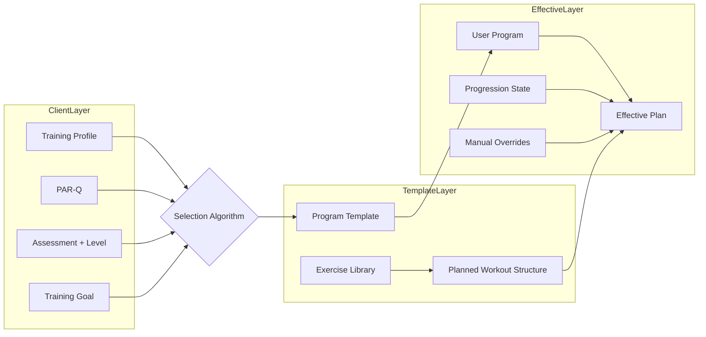

# مخطط منظومة البرامج التدريبية في POSE

> الوثيقة المرجعية النهائية لبناء منظومة البرامج التدريبية في POSE.
>
> هذه الوثيقة تركز على الخطة المعتمدة نفسها: ما الذي سنبنيه، كيف سيتكامل، وما الذي سيبقى خارج النطاق.

---

## الغرض

هذه الوثيقة تعتمد النموذج النهائي لمنظومة البرامج التدريبية في POSE، وتحدد:

- شكل البرنامج داخل النظام
- طبقات المنظومة وعلاقاتها
- العقد المنظمة للتسكين التلقائي
- حدود التدرج والتخصيص
- مستوى المرونة المسموح به لصانع البرنامج
- ما يدخل في النطاق وما يبقى خارج النطاق

الوثيقة هي المرجع الأساسي لأي تطوير لاحق يتعلق بـ:

- البرامج
- التسكين التلقائي
- التدرج
- التخصيص
- الاختبارات وإعادة التقييم
- تجربة المدرب والمتدرب

---

## الملخص التنفيذي

منظومة البرامج في POSE تعتمد على 4 ركائز:

1. **مكتبة برامج يدوية قوية** يبنيها Admin أو Coach.
2. **Selection Algorithm** يختار البرنامج الأنسب من المكتبة.
3. **Progression Engine** يطور المتدرب داخل البرنامج.
4. **Effective Plan Layer** تولد الخطة الفعلية لكل متدرب من خلال دمج:
   - Template
   - Progression State
   - Manual Overrides

البرنامج في POSE ليس قائمة تمارين، بل **وصفة تدريبية قابلة للتسكين والتخصيص والتطور**.

---

## المبادئ الحاكمة

### 1. السلامة أولاً

- لا يبدأ أي برنامج بدون فحص أهلية مسبق.
- PAR-Q بوابة مستقلة قبل أول برنامج.
- الحالات غير الآمنة تُحال إلى مختص.
- لا ترقية بدون Quality Gate.

### 2. التخصيص النوعي

- الهدف هو ما يحدد الحمل والحجم والسرعة والترتيب.
- لا توجد أفضل تمارين بالمطلق، بل أفضل اختيار لهذا الهدف ولهذا المتدرب.

### 3. الحمل التدريجي

- التقدم يحدث عبر زيادة مدروسة في المتطلبات.
- التعديل الافتراضي يكون على متغير واحد أو اثنين في كل مرة.

### 4. التفرد ومبدأ الحلقة الأضعف

- المتدرب لا يُختزل إلى مستوى واحد عام.
- البرنامج يبدأ من المحدد الأكبر للأداء أو الأمان أو الالتزام.

### 5. الالتزام أهم من الكمال

- الخطة القابلة للتنفيذ أفضل من الخطة المثالية غير القابلة للالتزام.
- البساطة شرط جودة، وليست تقليلاً من الاحتراف.

### 6. الدليل قبل الابتكار

- لا نبني محركات أو طبقات إضافية بلا قيمة واضحة.
- القرارات الأساسية يجب أن تبقى متسقة مع ACSM وNSCA والأبحاث المرجعية للمشروع.

---

## تعريف المنظومة

المنظومة تعتمد على:

- **Program Library**: مكتبة برامج ثابتة ومصممة يدوياً.
- **Client Profile**: ملف تدريبي وصحي يصف المتدرب.
- **Selection Algorithm**: يرشح البرنامج الأنسب من المكتبة.
- **Effective Plan**: النسخة التنفيذية الفعلية للمستخدم.
- **Progression Engine**: يضبط التقدم داخل البرنامج.
- **Assessment Cycle**: تقييم أولي، تقييم مستمر، وإعادة تقييم عند الحاجة.

---

## طبقات المنظومة



### Client Layer

تمثل المتدرب نفسه، وتشمل:

- `TrainingProfile`
- `PAR-Q`
- `BodyScanResult`
- `UserLevelProfile`
- `TrainingGoal`

### Template Layer

تمثل البرنامج كنموذج ثابت، وتشمل:

- `Program`
- `ProgramWeek`
- `ProgramDay`
- `PlannedWorkout`
- `PlannedWorkoutItem`
- `Exercise`

### Effective Plan Layer

تمثل ما سينفذه هذا المتدرب الآن، وتشمل:

- `UserProgram`
- `UserProgramExerciseProgressionState`
- `UserProgramOverride`
- `ProgressionHistory`

### القاعدة الذهبية

`Effective Plan = Template + ProgressionState + ManualOverrides`

وترتيب الدمج ثابت:

1. Template
2. Progression State
3. Manual Overrides

---

## أنواع البرامج

### `SYSTEM`

- برنامج من مكتبة النظام
- مملوك للنظام أو Admin
- مؤهل للتسكين التلقائي عند اكتمال العقد المنظمة

### `COACH`

- برنامج عام ينشئه Coach أو Admin
- يمكن استخدامه يدوياً لعدة متدربين
- يمكن السماح له بالدخول في التسكين التلقائي إذا كان `autoAssignable = true`
- تفعيل `autoAssignable` يتطلب موافقة Admin — Coach لا يستطيع تفعيلها بنفسه

> **ملاحظة v1:** Coach role كنظام صلاحيات مستقل خارج نطاق الإصدار الأول. حالياً `programType = COACH` و `appliedBy = COACH` يعنيان ownership/origin فقط. التطبيق التقني في v1: User بصلاحيات Admin محدودة، يُحدد لاحقاً.

### `CUSTOM`

- برنامج خاص بمتدرب واحد
- قد يكون مبنياً من الصفر أو ناتج Fork صريح
- لا يغير البرنامج الأصلي

---

## أبعاد البرنامج الأساسية

كل برنامج يحمل 3 أبعاد مستقلة:

### نوع البرنامج

`SYSTEM | COACH | CUSTOM`

### مجال البرنامج

`TRAINING | MOBILITY | THERAPEUTIC`

### الهدف التدريبي

يُستخدم عندما يكون البرنامج تدريبياً بالمعنى الأدائي أو العام:

- `STRENGTH`
- `HYPERTROPHY`
- `POWER`
- `GENERAL_HEALTH`

---

## دورة حياة المتدرب داخل المنظومة

```mermaid
flowchart TD
    newUser["متدرب جديد"] --> parqGate{"PAR-Q"}
    parqGate -- "غير آمن" --> referral["إحالة طبية أو مراجعة مختص"]
    parqGate -- "آمن" --> profile["استكمال Training Profile"]
    profile --> assessment["Body Scan + Level Profile"]
    assessment --> goal["تحديد Training Goal"]
    goal --> selectProgram{"Selection Algorithm"}
    selectProgram --> assign["User Program"]
    assign --> effectivePlan["Effective Plan"]
    effectivePlan --> workoutRuns["تنفيذ التمارين (workout runs)"]
    planned workouts --> qualityGate{"Quality Gate"}
    qualityGate -- "نجاح" --> progression["تحديث Progression State"]
    qualityGate -- "ضعيف" --> adjust["تعديل أو تراجع"]
    progression --> effectivePlan
    adjust --> effectivePlan
    effectivePlan --> exitReview["Exit Review / Reassessment"]
    exitReview --> nextDecision{"Next Program Decision"}
    nextDecision --> selectProgram
```

---

## الهيكل النهائي للبرنامج

```text
Program
  -> ProgramWeek
    -> ProgramDay
      -> PlannedWorkout
        -> PlannedWorkoutItem
          -> Exercise
```

### Program

أكبر وحدة تدريبية في النظام، وتحمل:

- نوع البرنامج
- مجال البرنامج
- الهدف التدريبي
- شروط التسكين
- حدود الأمان
- منطق الانتقال بعده
- النسخة والملكية

### ProgramWeek

وحدة تنظيمية خفيفة داخل البرنامج.

النوع المعتمد:

- `NORMAL`
- `DELOAD`

### ProgramDay

يحمل:

- `isRestDay`
- `dayFocus`

### PlannedWorkout

الوحدة التنفيذية داخل اليوم، وتحمل:

- اسم الجلسة
- ترتيبها
- مدتها التقديرية
- عناصر الجلسة المرتبة

### PlannedWorkoutItem

وحدة الوصفة داخل الجلسة، وتحمل:

- التمرين أو الراحة
- الوصفة الأساسية
- الدور داخل الجلسة
- نية الأداء عند الحاجة
- البدائل المسموحة
- ملاحظات المدرب

### Exercise

هوية الحركة داخل المكتبة، وتحمل:

- النمط الحركي
- طريقة العد
- قابلية الحمل الخارجي
- المعدات
- الصعوبة العامة
- العائلة إن وجدت

---

## النموذج المرجعي للكيانات

### `TrainingProfile`

كيان مستقل 1:1 مع `User`.

يحمل البيانات التشغيلية اللازمة للتسكين والتخصيص، مثل:

- الطول
- الوزن
- العمر أو تاريخ الميلاد
- مستوى النشاط الحالي
- العمر التدريبي
- خبرة المقاومة
- عدد الأيام المتاحة
- الحد الأقصى لمدة الجلسة
- المعدات المتاحة
- مكان التدريب
- الإصابات المعروفة
- الألم الحالي
- نتيجة PAR-Q
- إشارات PAR-Q

### `Program`

الحقول الأساسية:

- `programType`
- `programDomain`
- `trainingGoal`
- `autoAssignable`
- `version`
- `ownerId`
- `forkedFromId`
- `isPublished`
- `levelRangeMin`
- `levelRangeMax`
- `contraindications`
- `targetEquipment`
- `targetDomain`
- `targetRegions`
- `prescriptionPriority`
- `entryRecommendations`
- `exitRecommendations`
- `coachingNotes`
- `prerequisiteProgramId`
- `nextProgramId`
- `weeklyPlannedWorkoutsTarget`
- `estimatedWorkoutMinutes`

### `ProgramWeek`

الحقول الأساسية:

- `weekNumber`
- `weekType`
- `name`
- `description`

### `ProgramDay`

الحقول الأساسية:

- `dayNumber`
- `isRestDay`
- `dayFocus`
- `name`

### `PlannedWorkout`

الحقول الأساسية:

- `name`
- `sortOrder`
- `estimatedDurationMin`

### `PlannedWorkoutItem`

الحقول الأساسية:

- `sortOrder`
- `type`
- `exerciseId`
- `sets`
- `targetReps`
- `targetDuration`
- `restBetweenSetsMs`
- `restDurationMs`
- `weightKg`
- `weightPerSet`
- `role`
- `intent`
- `allowedSubstitutions`
- `coachingNotes`

#### `role`

القيم المعتمدة:

- `WARMUP`
- `ACTIVATION`
- `MAIN`
- `ACCESSORY`
- `CORRECTIVE`
- `COOLDOWN`
- `TEST`

#### `intent`

القيم المعتمدة:

- `STANDARD`
- `POWER`
- `ECCENTRIC`
- `VELOCITY_BASED`

### `Exercise`

الحقول المعتمدة لهوية التمرين:

- `movementPattern`
- `countingMethod`
- `loadCapability`
- `equipment`
- `difficulty`
- `familyKey`
- `familyOrder`

#### `movementPattern`

القيم المرجعية:

- `SQUAT`
- `HINGE`
- `LUNGE`
- `PUSH_HORIZONTAL`
- `PUSH_VERTICAL`
- `PULL_HORIZONTAL`
- `PULL_VERTICAL`
- `CARRY`
- `ROTATION`
- `GAIT`
- `JUMP_LAND`
- `CORE_BRACE`
- `MOBILITY_DRILL`
- `OTHER`

#### `countingMethod`

- `REPS`
- `HOLD`

#### `loadCapability`

- `BODYWEIGHT_ONLY`
- `EXTERNAL_LOAD_OPTIONAL`
- `EXTERNAL_LOAD_REQUIRED`

### `UserProgram`

يحمل:

- علاقة المتدرب بالبرنامج
- النسخة المسندة من الـ Template
- سبب الإسناد
- حالة الاشتراك

الحقول الأساسية:

- `programId`
- `userId`
- `templateVersion`
- `assignmentReason`
- `startDate`
- `isActive`

### `UserProgramOverride`

هذا الكيان مخصص **للتعديلات البشرية فقط**.

يحمل:

- استبدال تمرين
- تعديل وصفة عنصر
- تخطي عنصر
- إضافة عنصر
- ملاحظات التعديل
- سبب التعديل
- من قام به

الحقول الأساسية:

- `userProgramId`
- `weekNumber`
- `dayNumber`
- `plannedWorkoutItemId`
- `overrideType`
- `reasonCode`
- `data`
- `appliedBy`
- `createdAt`

#### `overrideType`

- `REPLACE_EXERCISE`
- `ADJUST_PRESCRIPTION`
- `SKIP_ITEM`
- `ADD_ITEM`

#### `reasonCode`

- `PAIN_AVOIDANCE`
- `EQUIPMENT_UNAVAILABLE`
- `TIME_CONSTRAINT`
- `PREFERENCE`
- `COACH_RECOMMENDATION`
- `OTHER`

#### `appliedBy`

- `USER`
- `COACH`

#### دورة حياة الـ Override

- Overrides **دائمة افتراضياً** حتى يحذفها المستخدم أو Coach يدوياً.
- لا يوجد انتهاء صلاحية تلقائي في v1.
- عند نهاية البرنامج أو الانتقال لبرنامج جديد، Overrides البرنامج السابق تبقى محفوظة لكنها لا تنتقل للبرنامج الجديد.

### `UserProgramExerciseProgressionState`

هذا الكيان مخصص **للتدرج التلقائي فقط**.

يحمل الحالة الفعلية الحالية لكل تمرين داخل برنامج مستخدم، مثل:

- الوزن الحالي
- التكرارات الحالية
- المدة الحالية
- عدد المجموعات الحالية
- مستوى الصعوبة الحالي
- streaks

### `ProgressionHistory`

يحفظ قرارات التدرج والتراجع للأغراض التفسيرية والتتبعية.

---

## عقد التسكين التلقائي

ليس كل برنامج في المكتبة يدخل في التسكين التلقائي.

البرنامج يكون مؤهلاً للتسكين عندما:

- `isPublished = true`
- `programType = SYSTEM`  
  أو `programType = COACH` مع `autoAssignable = true`
- الحقول المنظمة مكتملة

### الحقول المنظمة المطلوبة للتسكين

- `programType`
- `programDomain`
- `trainingGoal` عندما يكون البرنامج من مجال `TRAINING`
- `levelRangeMin`
- `levelRangeMax`
- `contraindications`
- `targetEquipment`
- `targetDomain`
- `targetRegions`
- `prescriptionPriority`

### الحقول التفسيرية المساندة

هذه لا تتحكم في الفلترة الآلية، لكنها تُستخدم للعرض والتوضيح:

- `entryRecommendations`
- `exitRecommendations`
- `coachingNotes`

### مخرجات الإسناد

كل إسناد برنامج يجب أن يُوثق في `assignmentReason` ويشمل:

- `source`
- `matchedFactors`
- `limitingFactor`

مثال:

```json
{
  "source": "selection_algorithm",
  "matchedFactors": ["trainingGoal", "levelRange", "equipment", "targetDomain"],
  "limitingFactor": "mobility"
}
```

### كيف يحدد النظام `limitingFactor`

1. يقرأ `UserLevelProfile.domainLevels` (مثل: strength=3, mobility=1, endurance=2)
2. يأخذ المحور الأقل مستوى كـ `limitingFactor`
3. إذا وُجد `safetyGateCode` نشط من PAR-Q أو BodyScanResult → safety يفوز كـ limitingFactor بغض النظر عن المستويات
4. `limitingFactor` يؤثر على ترجيح البرامج عند التسكين: البرنامج الذي يعالج المحدِّد الأكبر يحصل على أولوية أعلى

---

## نموذج التأليف المعتمد

منظومة التأليف تعتمد مستويين واضحين:

### Manual Authoring

يسمح ببناء أي برنامج للاستخدام اليدوي أو كـ Draft، ويحتاج فقط إلى:

- الهيكل
- التمارين
- الوصفة الأساسية
- الدور داخل الجلسة

### Auto-Assignment Ready

يضيف العقد المنظمة اللازمة حتى يصبح البرنامج مؤهلاً للتسكين التلقائي.

بهذا:

- لا يُجبر صانع البرنامج على ملء كل الحقول من البداية
- ولا يدخل Auto-Prescription إلا البرامج المنظمة فعلاً

---

## الخطة الفعلية للمستخدم

### المبدأ

المستخدم لا يرى الـ Template الخام، بل يرى النسخة التنفيذية بعد الدمج.

### ترتيب الدمج

1. Template
2. Progression State
3. Manual Overrides

### الـ API المرجعي

```text
GET /api/mobile/user-programs/:id/effective-plan?week=2&day=3
```

### نتيجة الـ API

يعيد:

- الجلسات الفعلية لليوم
- العناصر بعد حل التدرج
- العناصر بعد تطبيق التعديلات البشرية
- القيم النهائية القابلة للتنفيذ داخل الواجهة

---

## التدرج داخل البرنامج

### الأساس المعتمد

محرك التدرج الحالي يبقى هو الأساس، مع تطويره ليصبح:

- مرتبطاً بالهدف التدريبي
- كاتباً في `UserProgramExerciseProgressionState`
- غير ملامس للـ Template
- مفسراً عبر `ProgressionHistory`

### مجالات القياس الأساسية

- `formScore`
- `completionRate`
- `ROM`
- `est1RM`
- `velocityLoss`

### Quality Gate

التدرج لا يحدث إلا عند تحقق بوابة الجودة المعتمدة.

### Suggestion Layer

طبقة عرض فقط — لا تحفظ شيئاً في قاعدة البيانات.

قبل الجلسة، تُعرض للمستخدم توصية تنفيذية تُحسب لحظياً من خلال سلسلة fallback:

1. **ProgressionState** (القيم الحالية بعد التدرج) — المصدر الأول
2. **Template** (weightKg/targetReps الأصلية من PlannedWorkoutItem) — fallback إذا لم يوجد ProgressionState
3. **Goal Defaults** (من ملف `goal-defaults.ts`) — fallback إذا لم يوجد قيم في Template

التوصية تشمل عند الحاجة:

- الوزن المقترح
- التكرارات المقترحة
- المجموعات المقترحة
- المدة المقترحة

المستخدم يستطيع تجاوز أي قيمة مقترحة قبل بدء الجلسة.

### مبدأ العرض

- **Beginner Mode** هو الوضع الافتراضي
- **Advanced Mode** يعرض المؤشرات المتقدمة مثل `%1RM` و`velocityLoss`

---

## الأهداف التدريبية المعتمدة

### `STRENGTH`

- الأولوية: الحمل
- النطاق الإرشادي: 80% إلى 85% من 1RM
- التكرارات: 5 إلى 8
- المجموعات: 3 إلى 4
- أولوية التدرج: `load -> reps -> sets`

### `HYPERTROPHY`

- الأولوية: الحجم
- النطاق الإرشادي: 65% إلى 75% من 1RM
- التكرارات: 8 إلى 12
- المجموعات: 3 إلى 5
- المرجع العملي للحجم الأسبوعي: `>= 10 مجموعات أسبوعياً لكل مجموعة عضلية` عند تصميم البرامج والتقارير
- أولوية التدرج: `sets -> reps -> load`

### `POWER`

- الأولوية: السرعة ونية الأداء
- النطاق الإرشادي: 40% إلى 60% من 1RM
- التكرارات: 3 إلى 6
- المجموعات: 3 إلى 4
- أولوية التدرج: حمل مضبوط داخل النطاق مع سرعة عالية

### `GENERAL_HEALTH`

- الأولوية: الأمان والالتزام والتكرار
- النطاق الإرشادي: 60% إلى 70% من 1RM
- التكرارات: 10 إلى 15
- المجموعات: 2 إلى 3
- أولوية التدرج: `reps -> sets -> load`

---

## عائلات التمارين و Difficulty Ladders

### النموذج المعتمد

عائلات التمارين في الإصدار الأول تبقى **محدودة وموجَّهة**، وليست طبقة إلزامية على كل تمارين المكتبة.

### الحقول المعتمدة

- `familyKey`
- `familyOrder`

### الاستخدام

تُستخدم فقط مع التمارين التي تستفيد فعلاً من التدرج بالصعوبة، مثل:

- Push-up ladders
- Plank ladders
- Squat ladders
- Curated mobility ladders

### مثال

`push_horizontal_bodyweight`

- Wall Push-up
- Incline Push-up
- Knee Push-up
- Standard Push-up
- Diamond Push-up
- Archer Push-up

### العلاقة مع التدرج

العائلة تُستخدم عندما يكون مسار التقدم الطبيعي مبنياً على:

- زيادة الصعوبة
- الجودة
- الثبات

ولا تُستخدم كبديل لمسارات التدرج المبنية على الحمل الخارجي.

### العلاقة مع البدائل

- **Family** = مسار تقدم طبيعي داخل نفس السلسلة
- **allowedSubstitutions** = بدائل مسموحة قد تكون داخل العائلة أو خارجها

---

## الاختبارات وإعادة التقييم

### التقييم الأولي

يحدث خارج البرنامج، ويشمل:

- `PAR-Q`
- `TrainingProfile`
- `BodyScanResult`
- `UserLevelProfile`
- `TrainingGoal`

وظيفته:

- تحديد الأهلية
- بناء Baseline
- تغذية التسكين التلقائي

### التقييم المستمر

يحدث داخل الجلسات نفسها عبر المؤشرات الناتجة عن الأداء.

وظيفته:

- دعم Quality Gate
- التدرج أو التراجع
- كشف plateau أو الحاجة لإعادة الضبط

### عناصر الاختبار داخل البرنامج

تُبنى من خلال `role = TEST`.

وتُستخدم فقط عندما توجد **نتيجة قرارية واضحة** ستتغير بناءً عليها، مثل:

- الانتقال لبرنامج جديد
- الانتقال داخل Difficulty Ladder
- إعادة ضبط المستوى
- قرار أمان

### إعادة التقييم النهائي

تحدث عند:

- نهاية البرنامج
- Plateau
- الحاجة إلى مراجعة أوسع

ومخرجاتها تؤثر على:

- الاستمرار
- التكرار
- الانتقال لبرنامج لاحق
- الرجوع لبرنامج تصحيحي

---

## المرونة المعتمدة

### أشياء مفروضة من النظام

- PAR-Q قبل أول برنامج
- Quality Gate قبل أي ترقية
- حماية الـ Template

### أشياء يوصي بها النظام

- نطاقات الحمل والمجموعات والتكرارات حسب الهدف
- ترتيب الأدوار داخل الجلسة
- التوصية التنفيذية قبل الجلسة
- البرنامج التالي المقترح

### أشياء يحددها صانع البرنامج بحرية

- اختيار التمارين
- ترتيب الجلسة
- عدد العناصر
- توزيع الأيام
- أيام الراحة
- `dayFocus`
- `role`
- `intent`
- استخدام العائلات أو تجاهلها
- البدائل المسموحة
- ملاحظات المدرب
- قرار Fork

---

## Override و Fork

### Override

يُستخدم للتغييرات:

- الموضعية
- المحدودة
- المؤقتة أو المرحلية
- التي لا تغير هوية البرنامج

أمثلة:

- استبدال تمرين
- تعديل وصفة عنصر
- تخطي عنصر
- إضافة عنصر محدود

### Fork

يُستخدم عندما:

- يراد إنشاء برنامج خاص واسع التخصيص
- تتغير هوية البرنامج الأصلية
- يصبح التعديل مقصوداً كبرنامج مستقل

### القاعدة

- الافتراضي هو `Override`
- الـ `Fork` يكون فعلاً صريحاً
- لا يحدث `Fork` تلقائياً

---

## ما يبقى في الكود وليس في قاعدة البيانات

### Goal Defaults

ملف مرجعي مثل `goal-defaults.ts` يحتوي:

- نطاقات الشدة
- نطاقات التكرارات
- نطاقات المجموعات
- ترتيب أولويات التدرج

### Progression Mapping

الربط بين محرك التدرج الحالي والنموذج الجديد يبقى في الكود، وليس في قاعدة البيانات.

### Planned Workout Role Order

ملف مرجعي مثل `workout-block-role-order.ts` يحتوي الترتيب الافتراضي:

1. `WARMUP`
2. `ACTIVATION`
3. `MAIN`
4. `ACCESSORY`
5. `CORRECTIVE`
6. `COOLDOWN`
7. `TEST`

ويُستخدم هذا الترتيب:

- كاقتراح
- كترتيب افتراضي
- كتحذير خفيف عند وجود ترتيب غير منطقي

### Selection Rules

منطق التسكين والترجيح والنقاط يبقى في الكود، ويقرأ فقط الحقول المنظمة.

### Family Catalog

كتالوج العائلات الموجَّهة يمكن أن يبدأ كمرجع خفيف في الكود أو الإعدادات، وليس ككيان مستقل في الإصدار الأول.

---

## ما نرفض بناءه

- AI Program Generator
- Periodization Engine معقد
- Phase/Block entity
- Planned Workout Block entity
- Set Prescription table
- Exercise Tree صارم
- Test Engine منفصل
- Movement Taxonomy service
- Substitution Rules Engine
- Auto-deload engine
- Auto-phase engine
- Equipment-based recommendation engine
- Failure-based prompts
- Program Builder صارم يمنع قرارات صانع البرنامج

---

## التوصيف العلمي والاجتهاد التصميمي

### مبني على ACSM 2026 مباشرة

- الأهداف التدريبية الأربعة ونطاقاتها (STRENGTH, HYPERTROPHY, POWER, GENERAL_HEALTH)
- Quality Gate criteria (formScore, completionRate, ROM, streak)
- الفشل العضلي ليس ضرورياً — RIR 2-3 كافٍ
- Periodization المعقد لا يتفوق عند وجود progressive overload مناسب
- ROM الكامل يحسن القوة
- ترتيب التمارين — الأساسية أولاً
- Intensity %1RM كمتغير رئيسي للقوة
- Volume per muscle كمتغير رئيسي للتضخم
- Power RT (concentric بأقصى سرعة) للقدرة

### اجتهاد تصميمي لـ POSE (منطقي لكن ليس ACSM مباشرة)

- `programDomain = THERAPEUTIC` — توسعة منتج
- `role = CORRECTIVE` و `role = TEST` — تصنيف داخلي للجلسة
- `weekType = DELOAD` — مفهوم منتج وليس ACSM requirement
- Exercise Family system — نظام تدرج بالصعوبة خاص بالمنتج
- Effective Plan architecture (3 طبقات) — معمارية هندسية
- Selection Algorithm — منطق تسكين خاص بالمنتج
- UserProgramOverride ككيان مستقل — قرار هندسي
- `intent = VELOCITY_BASED` — مؤجل التفعيل في v1

> هذا التمييز ليس نقداً — بل شفافية. الاجتهاد التصميمي مبني على منطق سليم، لكن لا يجب تقديمه كأنه مسلّمة علمية.

---

## التسلسل المرجعي للتنفيذ بعد اعتماد المخطط

### المرحلة 1: تثبيت الدومين

- `trainingGoal`
- `programType`
- `programDomain`
- `TrainingProfile`
- فصل Progression State عن Manual Overrides

### المرحلة 2: Effective Plan

- `UserProgramOverride`
- Effective Plan API
- حماية الـ Template

### المرحلة 3: Auto-Assignment Contract

- structured eligibility fields
- validator for auto-assignable programs
- `assignmentReason`

### المرحلة 4: Progression + Suggestion

- Goal-aware progression
- suggestion layer
- beginner/advanced display modes

### المرحلة 5: Curated Ladders + Reassessment

- `familyKey`
- `familyOrder`
- curated ladders
- `role = TEST`
- exit review flow

---

## الخلاصة النهائية

الخطة المعتمدة في POSE هي:

1. مكتبة برامج يدوية قوية
2. تسكين يعتمد على `Profile + Goal + Assessment`
3. برنامج أصلي ثابت لا يتلوث
4. خطة فعلية خاصة بكل متدرب
5. تدرج تلقائي منفصل عن التعديلات البشرية
6. مرونة حقيقية لصانع البرنامج
7. اختبار مدمج يخدم القرار
8. تعقيد أقل ومعنى تدريبي أعلى

إذا التزمنا بهذا المخطط، سنحصل على منظومة:

- متماسكة علمياً
- مرنة عملياً
- واضحة برمجياً
- قابلة للصيانة
- قابلة للتوسع على المدى الطويل
