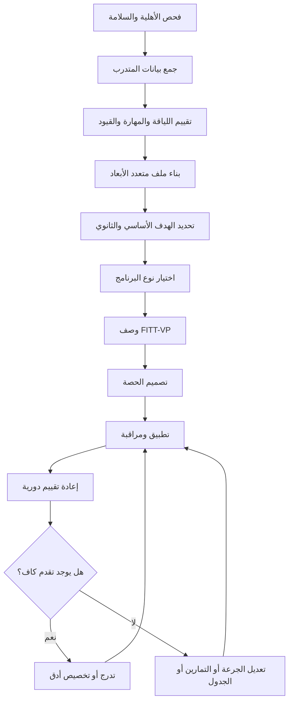
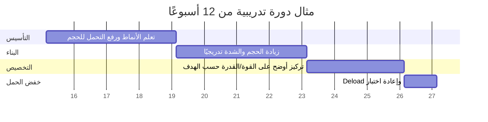

# تصميم برامج تدريب علمية ومهنية مفصّلة بحسب الأهداف والمستويات

## الملخص التنفيذي

تصميم برنامج تدريبي جيد ليس عملية “اختيار تمارين” بقدر ما هو عملية **وصف جرعة تدريبية** تبدأ من الهدف، وتُقيَّد بمستوى المتدرّب، ومخاطره الصحية، وبيئته، وتاريخه التدريبي، ثم تُترجم إلى حجم وشدة وتكرار وتدرّج ومراقبة. لهذا السبب، فإن أفضل البرامج ليست بالضرورة الأكثر تعقيدًا، بل الأكثر **ملاءمةً وقابليةً للاستمرار**. أحدث ملخصات entity["organization","الكلية الأمريكية للطب الرياضي","sports medicine society"] تؤكد أن الانتقال من “لا تدريب” إلى “أي تدريب منتظم” ينتج أكبر مكاسب أولية، وأن التخصيص بحسب الهدف والالتزام والسلامة أهم من الوصفات الجامدة الموحدة. citeturn4view6turn27view0turn30view1turn30view2

عمليًا، لا يكفي تصنيف المتدرّب إلى مبتدئ أو متوسط أو متقدم على أساس عدد الأشهر فقط. المعايرة الأدق تكون متعددة الأبعاد: **الاستعداد الصحي، الكفاءة الحركية، القدرة الفسيولوجية، تحمل الحجم التدريبي، والمهارة الخاصة بالمهمة**. يمكن أن يكون شخص ما “متقدمًا” في القوة لكنه “مبتدئًا” في التحمل أو الهبوط والاتزان أو المهارة الرياضية. لذلك يجب أن يُبنى البرنامج على “ملف أداء” لا على لقب واحد. هذا يتماشى مع مبادئ الخصوصية والتدرج ومع تصنيفات entity["organization","الرابطة الوطنية للقوة والتكييف","strength conditioning org"] للحركة الأساسية والتطور طويل المدى. citeturn8search5turn4view9turn31view0

تختلف **اختيارات التمارين** باختلاف الهدف. فالقوة القصوى تستفيد أكثر من أحمال أعلى وتمارين أساسية متعددة المفاصل؛ والتضخم العضلي يستجيب بصورة قوية للحجم الأسبوعي الكافي مع مرونة أكبر في نوع الأداة؛ والقدرة تتطلب أحمالًا خفيفة إلى متوسطة مع نية حركية انفجارية؛ والتحمل القلبي التنفسي يعتمد على العمل الهوائي المستمر أو الفترات؛ والوزن/الدهون يستفيد غالبًا من دمج التحمل مع المقاومة مع ضبط الطاقة الغذائية؛ والمرونة والحركية قد تتحسنان بالتمطيط، وبجرعات مقاومة عبر مدى حركي كامل أيضًا؛ والمهارة تُبنى بممارسة نوعية ذات تغذية راجعة مناسبة وتدرج في التعقيد. citeturn27view0turn29view3turn6view2turn13search1turn13search2turn14search3turn20search5turn38search2turn38search13

النمذجة الزمنية أو **الفترة التدريبية** مفيدة، لكنها ليست عقيدة واحدة. الدليل يميل إلى أن البرمجة الدورية قد تمنح أفضلية لمكاسب القوة القصوى، خصوصًا لدى المتدربين المتمرّسين، لكن هذه الأفضلية تصبح أصغر أو أقل ثباتًا عندما تكون الأحجام متساوية أو عندما يكون الهدف هو الصحة العامة أكثر من الأداء الأقصى. لهذا فالمتعلم العام أو العميل الصحي غالبًا ما يحتاج برنامجًا بسيطًا ثابتًا ومراقَبًا؛ بينما يستفيد المتقدم أو الرياضي من بنية زمنية أوضح، وتبديل مقصود في الحجم والشدة والاختصاص. citeturn7search2turn7search3turn7search5turn30view2

البرامج عبر الإنترنت أو البرامج المدمجة ليست “خيارًا أدنى” تلقائيًا؛ الأدلة الحديثة تشير إلى أن التدخلات الرقمية والبرامج المدمجة والتدريب عن بُعد يمكن أن تحسن النشاط البدني والوظيفة والقوة—خصوصًا عندما يتوفر **إشراف، وتغذية راجعة، وتتبع للالتزام، وتكييف للجرعة**. وفي المقابل، إعادة التأهيل تختلف في منطقها عن اللياقة العامة: فهي أكثر اعتمادًا على الأعراض، وشفاء الأنسجة، ومعايير التقدّم الوظيفية، وليس على التقويم وحده. citeturn12search0turn12search3turn12search10turn12search12turn13search3turn13search19

## المنهجية والافتراضات

أُعِدَّ هذا التقرير بالاعتماد أولًا على المصادر الرسمية والبيانات الأولية أو شبه الأولية: وثائق entity["organization","منظمة الصحة العالمية","un health agency"]، وبيانات المواقف الرسمية من ACSM وNSCA، ومعايير entity["organization","الجمعية الأمريكية لأمراض الصدر","respiratory medicine society"] لاختبار المشي، ووثائق entity["organization","الجمعية الدولية للتغذية الرياضية","sports nutrition society"] للتغذية الرياضية، ثم روجعت النتائج في ضوء مراجعات منهجية ومراجعات شمولية وتحليلات تلوية حديثة. وحيثما توافرت موارد عربية رسمية، أُدرجت—خصوصًا صفحات ومنشورات منظمة الصحة العالمية العربية والإقليمية—مع الإشارة إلى أن معظم الإرشادات التقنية التفصيلية المنشورة ما تزال بالإنجليزية. citeturn19search0turn18view0turn19search1turn40search13turn7search1turn33view0turn14search2

**افتراضات التقرير**: الأمثلة التطبيقية أدناه موجهة في الأصل إلى بالغين أصحاء ظاهرًا بعمر 18 سنة فأكثر ما لم يُذكر خلاف ذلك. وعندما يكون لدى المتدرّب مرض قلبي/استقلابي/كلوي معروف، أو أعراض جهدية، أو حالة طبية غير مستقرة، أو سياق إصابة/جراحة، فإن البرنامج يجب أن يبدأ بفحص أهليّة ما قبل المشاركة، وقد يحتاج إلى إحالة أو إشراف سريري. كما أن القوالب الخاصة بإعادة التأهيل هنا **إطار تصميمي** عام وليست بروتوكولًا علاجيًا فرديًا. citeturn29view0turn23search0turn23search6turn34view4

ومن المهم أيضًا الفصل بين ثلاثة مستويات للقرار: **قرار السلامة** (هل يمكن البدء؟)، و**قرار التوصيف** (ما الملف الحالي؟)، و**قرار البرمجة** (ما الجرعة الأنسب الآن؟). كثير من الأخطاء تحدث حين يُختصر التقييم إلى سؤال واحد مثل “كم مرة تتمرن؟” أو “هل تريد خسارة وزن؟”، مع تجاهل التاريخ الطبي، والالتزام الواقعي، والمهارة، ومحددات البيئة. citeturn23search0turn27view0turn30view1

## الأطر العلمية الحاكمة

أهم إطارين حاكمين لأي برنامج جيد هما **الخصوصية** و**الحمل الزائد التدريجي**. الخصوصية—المعبَّر عنها غالبًا بمبدأ SAID، أي التكيف النوعي مع المطلب المفروض—تعني أن الجسم يتكيّف مع نوع الجهد، وسرعته، ومداه، وموقعه، وطابعه الطاقي والمهاري؛ ولذلك لا توجد “أفضل تمارين” بالمطلق، بل أفضل تمارين **لهذا الهدف ولهذا المتدرّب في هذا الوقت**. أما الحمل الزائد فيعني أن التحسن يتطلب ارتفاعًا مدروسًا في المتطلبات، لكن هذا الارتفاع يجب أن يبقى قابلًا للاستشفاء والتكرار والالتزام. citeturn9search0turn8search5turn6view3

إطار **FITT-VP** يبقى من أفضل الأدوات العملية لترجمة هذه الفلسفة إلى وصفة: التكرار، الشدة، الزمن، النوع، الحجم، والتدرّج. هذا الإطار لا يخص التحمل فقط؛ بل يمكن تطبيقه على المقاومة، والمرونة، والتدريب العصبي الحركي، والبرامج العلاجية، وحتى التدريب المدمج عبر الإنترنت. وتوصيات ACSM وWHO للبالغين تضع خط أساس صحيًا عامًا: 150–300 دقيقة أسبوعيًا من النشاط الهوائي المعتدل أو 75–150 دقيقة من الشديد، مع نشاط تقوية عضلية لعضلات الجسم الرئيسية في يومين أو أكثر أسبوعيًا. citeturn41search1turn41search2turn3search15turn14search16turn19search0

أما **الفترة التدريبية** فيُفهم منها التخطيط المقصود لتوزيع التركيزات التدريبية عبر الزمن على مستوى الدورة الكبرى والمتوسطة والأسبوع. الأدلة الحالية لا تُظهر تفوقًا مطلقًا لكل أشكال الفترة على كل البرمجات الأخرى، لكنها تميل إلى فائدة لصالح البرمجة الدورية في القوة القصوى، خاصة لدى المتمرّسين، مع احتمال فائدة إضافية للنماذج المتموجة في بعض السياقات. في المقابل، توضح ACSM 2026 أن معظم البالغين الأصحاء لا يحتاجون إلى تعقيد مفرط—مثل الوصول الدائم للفشل أو تعقيد دورات لا يمكن الالتزام بها—كي يحققوا نتائج جيدة. citeturn7search2turn7search3turn7search5turn30view2

يضاف إلى ذلك مبدأ **الجرعة الدنيا الفعّالة مع أقصى قابلية للالتزام**. الالتزام طويل المدى ليس مجرد عامل نفسي جانبي؛ بل هو متغير تصميمي أساسي. الأدلة السلوكية تشير إلى أن الدافعية الذاتية، والكفاءة المدركة، والدعم والإشراف، والمتعة، والقدرة على دمج التدريب في الجدول الواقعي، كلها تؤثر بقوة في الاستمرار. لهذا فبرنامج أقل “كمالية” وأكثر قابلية للتنفيذ كثيرًا ما يكون أفضل من برنامج مثالي على الورق لكنه لا يُحافَظ عليه. citeturn30view1turn17search3turn17search15turn17search9

المخطط التالي يركّب هذه الأطر في سير عمل برمجي عملي. وهو **تركيب تطبيقي** مبني على مبادئ الخصوصية والـFITT-VP والفحص المسبق والتدرّج والمراقبة. citeturn23search0turn41search1turn8search5turn27view0

## تقييم المتدرّب ومعايرة المستوى

الباب الحقيقي لأي برنامج ناجح هو **ما المعلومات التي يجب جمعها قبل وصف الجرعة**. في الحد الأدنى، ينبغي جمع: العمر؛ الجنس؛ التاريخ الطبي والأدوية والإصابات السابقة؛ مستوى النشاط الحالي؛ التاريخ التدريبي؛ نتائج الاختبارات الحالية؛ الهدف الأساسي والثانوي؛ القيود الزمنية؛ توفر المعدات والمكان؛ الخبرة التقنية؛ التفضيلات والتحفيز؛ جودة النوم والتوتر؛ والقدرة على المتابعة. هذه المعلومات لا تُجمع من باب “الاستكمال الإداري”، بل لأنها تغيّر مباشرةً قرار الشدة والنوع والحجم والسرعة والتواتر والإشراف المطلوب. citeturn23search0turn27view0turn31view0turn15search6turn17search15

الجدول التالي يختصر **البيانات المطلوبة** عند المدخل الأولي، ولماذا تُهم برمجيًا:

| المجال | ماذا يُجمع؟ | لماذا يؤثر في البرنامج؟ |
|---|---|---|
| الخصائص الأساسية | العمر، الجنس، الطول، الوزن، نمط الحياة | تغيّر الاستجابة، والقدرة على الاستشفاء، واختيار المقارنات المرجعية |
| الخطر الصحي | أمراض معروفة، أعراض جهدية، جراحات، أدوية، موانع | تحدد الأهلية، والحاجة لإحالة/إشراف، ونوع الاختبارات الآمنة |
| التاريخ التدريبي | السنوات، الانتظام، الأحجام السابقة، الإصابات المرتبطة بالتدريب | يحدد تحمّل الحمل و”العمر التدريبي” الحقيقي |
| الملف الحالي | نتائج التحمل، القوة، المرونة، التوازن، المهارة، تركيب الجسم | يحدد الأولويات ونقاط الاختناق |
| الهدف | صحة، أداء، خفض دهون، تضخم، مرونة، وقاية، اكتساب مهارة | يوجه اختيار الأنواع والتمارين ومقاييس المتابعة |
| القيود اللوجستية | الأيام المتاحة، المدة، المعدات، المكان، السفر | تحدد قابلية التنفيذ، وتفضّل أدوات أو نماذج معينة |
| السلوك والالتزام | الدافعية، الكفاءة الذاتية، النوم، التوتر، الالتزام السابق | تحدد الجرعة المبدئية، والحاجة لإشراف أو نمط مدمج |

مصادر الجدول: citeturn23search0turn27view0turn17search3turn17search15turn15search6

أما **معايرة المستوى**، فالمنهج الأكثر صلابة هو اعتبار “المستوى” نتيجة مصفوفة لا عنوانًا أحاديًا. أوصي بترميز المتدرّب على أربعة محاور:  
**الاستعداد الصحي**، **الكفاءة الحركية الأساسية**، **السعة الفسيولوجية/البدنية**، و**الخبرة/التحمل للحجم**.  
وعليه يمكن أن يكون المتدرّب: مبتدئًا حركيًا، متوسطًا فسيولوجيًا، ومتقدمًا في الالتزام—وهو ملف مختلف تمامًا عن شخص قوي جدًا لكنه قليل التحمل أو ضعيف الاتزان. هذا النهج أقرب للدليل من ربط المستوى فقط بعدد الأشهر. citeturn4view9turn31view0turn27view0

ولتحويل هذا الملف إلى قرارات، يلزم تقييم المجالات التالية بوسائل مختبرية أو ميدانية مناسبة:

| المجال | المعيار الأفضل عند الإمكان | بديل ميداني عملي | كيف يؤثر في القرار البرمجي؟ |
|---|---|---|---|
| اللياقة القلبية التنفسية | CPET وقياس VO₂max/VO₂peak | 6MWT، اختبارات دون قصوى، اختبارات مشي/خطوة معيارية | يحدد حجم التحمل، مناطق الشدة، وقابلية HIIT |
| القوة القصوى | 1RM مباشر أو موثوق التقدير | 3–5RM/تقدير 1RM، قوة القبضة كمؤشر سريع | يحدد الشدة الأولية، واختيار الأحمال والتمارين |
| تحمل القوة | اختبارات تكرار موحدة | جلوس-وقوف 30 ثانية أو 1 دقيقة، ضغط أرضي معدل | يحدد الكثافة، الدارات، والاسترخاء بين الجولات |
| القدرة | منصات قفز/CMJ | قفز رأسي أو اختبارات رمي/وثب بسيطة | يحدد إدخال البلايومتريكس والتدريب الانفجاري |
| المرونة | قياس ROM بالمقياس الزاوي | Sit-and-Reach، Chair Sit-and-Reach | يحدد الحاجة للتمطيط أو العمل عبر ROM كامل |
| الحركية | قياس ROM نوعي للمفاصل | Weight-Bearing Lunge Test، فحوص كتف/ورك | يحدد التعديلات الفنية ونطاق الحركة |
| التوازن/التحكم | مختبر اتزان/منصات قوة | وقوف أحادي الساق، اختبارات توازن عملية | يحدد إدخال توازن/هبوط/مهام أحادية |
| المهارة | اختبار أداء نوعي خاص بالرياضة | دقة/زمن/فيديو/تصنيف فني واحتفاظ | يحدد جرعة الممارسة، نوع التغذية الراجعة، والتعقيد |
| تركيب الجسم | DXA | BIA أو skinfolds المعيارية | يحدد نجاح خفض الدهون/الحفاظ على الكتلة |
| الاستعداد النفسي | مقاييس نفسية معيارية حسب السياق | RPE، sRPE، استبيانات رفاه/جاهزية، مذكرات التزام | يحدد الجرعة اليومية وخطر الإفراط وانخفاض الالتزام |

مصادر الجدول: CPET كمعيار ذهبي للياقة القلبية التنفسية citeturn39search1turn39search6؛ بروتوكول 6MWT ومعاييره الأساسية citeturn33view0turn34view4turn35view0؛ موثوقية 1RM citeturn10search1؛ استخدام CMJ/SJ للقوة والقدرة السفلية citeturn10search10turn10search6؛ صلاحية Sit-and-Reach وكونه اختبارًا ميدانيًا شائعًا لكنه متوسط الصلاحية للهمسترنج وحدها citeturn37search0turn37search11؛ موثوقية Weight-Bearing Lunge Test citeturn22search3turn22search19؛ تقييم BIA وDXA وقيود كل منهما citeturn11search1turn11search2turn11search6turn11search20؛ فاعلية القياسات الذاتية مثل sRPE والرفاه اليومي في المراقبة citeturn24search0turn24search2turn17search8turn24search12

ينبغي الحذر من اختزال “التقييم الحركي” إلى شاشة واحدة تدّعي التنبؤ بالإصابة. فالأدلة على أدوات مثل FMS لا تدعم الاعتماد عليها منفردة كأداة تنبؤ إصابي قوية؛ الأفضل استخدامها—إن استُخدمت—كمحادثة عن الجودة الحركية ونقاط الضعف، ضمن منظومة أوسع تشمل الأحمال، والسجل الإصابي، والقدرات، والتعرض الرياضي. citeturn10search3turn10search11

**الملفات المختلطة** هي قلب التفصيل البرمجي. فإذا كان المتدرّب يتمتع بمرونة مرتفعة لكن تحمّله منخفض، فالخطأ هو بناء الحصة حول مزيد من التمطط؛ القرار الأفضل عادةً هو إبقاء المرونة بجرعة صيانة منخفضة وتوجيه “ميزانية الوقت” نحو بناء قاعدة هوائية تدريجية. وإذا كانت قوته عالية لكن حركية الكاحل/الورك أو جودة الهبوط ضعيفة، فيلزم ضبط العمق، والسرعة، والتحميل الأحادي، وتمارين الهبوط والتنقل، بدل مجرد زيادة الوزن. وإذا كان تحمله جيدًا لكن قوته منخفضة، فإضافة مقاومة منتظمة ترفع الاقتصاد الحركي والوظيفة والمناعة الإصابية. هذه أمثلة **استنتاجية تطبيقية** مبنية على مبادئ الخصوصية، ونتائج المقاومة الحديثة، وأدبيات الحركية والتحمل. citeturn8search5turn30view2turn22search3turn3search15turn22search16

## منطق بناء البرنامج واختيار التمارين

يمكن تقسيم **أنواع البرامج التدريبية** إلى عشرة أصناف عملية، ليس لأنها منفصلة تمامًا، بل لأنها تساعد في اتخاذ قرار التصميم:

| نوع البرنامج | متى يُفضّل؟ | البنية الغالبة | ما الذي يميّز اختيار التمرين؟ |
|---|---|---|---|
| قوة | رفع القوة القصوى والقدرة على إنتاج العزم | مقاومة أساسية، أحمال أعلى، راحات أطول | تمارين متعددة المفاصل، ROM كامل، ترتيب الأولويات أول الحصة |
| تحمل | تحسين VO₂/الاقتصاد/السعة الهوائية | مستمر، Tempo، فترات، أحيانًا HIIT | نمط حركي نوعي للنشاط: جري/دراجة/تجديف/مشي |
| مرونة/حركية | رفع ROM أو إزالة قيد حركي | تمطيط + تحريك + أحيانًا مقاومة عبر ROM | تمارين نوعية للمفصل/النسيج المحدِّد |
| مهارة | تعلم أو تثبيت أداء حركي | ممارسة نوعية + تغذية راجعة + احتفاظ/نقل | تمرين يحاكي المهمة أو يضع قيدًا يقود للحل |
| HIIT | كفاءة زمنية ورفع CRF بسرعة نسبيًا | فترات عالية مع استشفاء مبرمج | يجب أن يتناسب النمط مع القدرة والخطر |
| إعادة تأهيل | ما بعد إصابة/ألم/جراحة | تحميل قائم على المعيار والأعراض | تدرج في ROM والتحميل والسرعة أكثر من “الشكل النهائي” |
| نوعي رياضيًا | نقل مباشر للأداء الرياضي | مقاومة + سرعة + رشاقة + مهارة | مراعاة المراكز، الطاقة، المواقف، التعرض، التقويم |
| لياقة عامة | صحة ووظيفة والتزام طويل المدى | خليط مقاومة + هوائي + حركية | بساطة وشمول وتكرار قابل للاستمرار |
| مبني على الفترة | أهداف متعددة عبر الزمن | مراحل تأسيس/بناء/تخصيص/خفض حمل | يتغير التركيز المقصود أسبوعيًا/مرحليًا |
| رقمي/مدمج | قيود حضور، أو حاجة لمتابعة منخفضة الكلفة | جلسات متزامنة/غير متزامنة + تتبع | أولوية للوضوح، الفيديو، مؤشرات الالتزام، وسهولة الأدوات |

مصادر الجدول: citeturn27view0turn29view3turn13search1turn13search2turn12search0turn12search3turn12search10turn13search3turn13search19turn38search2

اختيار التمارين يجب أن يتغير بوضوح مع الهدف. في القوة، دلائل ACSM 2026 ترجّح أحمالًا أثقل (نحو 80% 1RM فأكثر) لجلستين أو أكثر أسبوعيًا مع 2–3 مجموعات لكل تمرين، بينما التضخم يتحسن خصوصًا مع حجم أسبوعي أعلى يقارب 10 مجموعات لكل مجموعة عضلية، ويظل ممكنًا عبر الحديد الحر أو الأجهزة أو الأشرطة أو وزن الجسم. وفي القدرة، يكون المنطق هو الجمع بين قوة أساسية وبين أحمال خفيفة إلى متوسطة تُنفَّذ بسرعة عالية مع نية انفجارية. في المقابل، برامج التحمل أو خفض الدهون تعطي وزنًا أكبر لجرعة العمل الهوائي الكلية، مع إبقاء المقاومة للمحافظة على القوة والكتلة والوظيفة. citeturn27view0turn29view3turn30view2turn14search3turn40search15

أما **تدريب المهارة**، فاختيار تمرينه يختلف جذريًا عن تدريب الصفة البدنية. فالتمرين المهاري ليس “نسخة خفيفة” من التمرين المقاوم؛ بل مهمة تعلّم ينبغي أن تراعي جودة الممارسة، ومستوى التحدي، والتوازن بين التكرار والتنوع، ونوع التغذية الراجعة وتوقيتها. أدبيات اكتساب المهارة الحديثة تركز على الجودة، والاحتفاظ، والنقل إلى الموقف الحقيقي، أكثر من مجرد تحسين الأداء الآني داخل الحصة. citeturn38search2turn38search4turn38search5turn38search13

وفي الوقاية من الإصابة، لا يكفي “التمرين المناسب” إذا كانت الأحمال غير مضبوطة. البرامج المبنية على الإحماء العصبي العضلي—مثل نماذج كرة القدم متعددة المكونات—خفضت الإصابات في كرة القدم في التحليلات التلوية، لكن الأثر يعتمد بقوة على الالتزام وجودة التنفيذ. بالمثل، في العدائين مثلًا، لا يبدو أن كل برامج الوقاية تعطي نفس الأثر، ما يبرز أهمية التخصيص بدل النسخ الحرفي. citeturn16search1turn16search7turn16search24turn16search11

ولتسهيل البناء البرنامجي، أقترح **تصنيفًا عمليًا متعدد المحاور للتمارين**:

| محور التصنيف | الفئات المقترحة | أمثلة |
|---|---|---|
| الهدف التكيفي | قوة، تضخم، قدرة، تحمل قوة، لياقة هوائية، حركية، توازن، مهارة، تحميل علاجي | سكوات ثقيل، قفز، جري Zone 2، إيزومتريك |
| النمط الحركي | Squat، Hinge، Lunge، Push أفقي/عمودي، Pull أفقي/عمودي، دوران/مقاومة دوران، Carry، Gait، Jump/Land | Goblet squat، RDL، Split squat، Row، Pull-up |
| النظام الطاقي | ألبي/فوسفاجيني، لاهوائي جلايكوليتي، هوائي، مختلط | Sprint قصير، 400م، Tempo، Intervals |
| شكل الانقباض والتحميل | مركّز، لا مركزي، إيزومتري، Stretch-Shortening | Pause squat، Nordic، Wall sit، Bounding |
| درجة التعقيد | مغلق/مفتوح، متوقع/تفاعلي، ثنائي/أحادي، ثابت/ديناميكي | آلة ضغط، قفز واستجابة بصرية، قطع اتجاه |
| اللوجستيات | وزن جسم، أشرطة، دمبل، بار، جهاز، حبل، كرة طبية، منزل/صالة/ملعب | Push-up، band row، barbell squat، med-ball throw |

هذا التصنيف **اقتراح تركيبي** مبني على الأنماط الحركية الأساسية لدى NSCA، وعلى مبدأ الخصوصية، وعلى ما نعرفه عن اختلاف المسارات التكيفية بين القوة والقدرة والمهارة. فائدته أنه يمنع الوقوع في لغة عامة جدًا مثل “تمارين رجل” أو “كارديو”، ويحوّل البرمجة إلى تركيب منطقي يمكن تغييره بمحور واحد في كل مرة. citeturn4view9turn8search5turn31view0

## مكونات البرنامج وإدارته عبر الزمن

أي برنامج مهني ينبغي أن يُبنى كحصة متكاملة، لا كقائمة تمارين منفصلة. وعادةً ما تتضمن الحصة: **إحماءً موجّهًا، عملًا رئيسيًا، عملًا مساعدًا، تهدئة/استعادة، ثم توثيقًا ومؤشرات متابعة**. ويُفضَّل أن يكون الإحماء ديناميكيًا ووظيفيًا ويرفع الحرارة ويحضّر المفاصل والأنسجة والنمط العصبي المطلوب، بدل الاعتماد على تمطيط ثابت طويل قبل الأداء القوي أو السريع. التمطيط الثابت له مكان معتبر لتحسين ROM أو في نهاية الحصة، لكنه ليس دائمًا الخيار الأفضل قبل مهام القوة/القدرة. citeturn25search14turn25search3turn25search19

العمل الرئيسي يجب أن يحمل “جوهر الهدف”. فإذا كان الهدف قوةً، وُضعت الرفعات/الأنماط الأساسية أولًا. وإذا كان الهدف قدرةً، وُضعت القفزات أو الرفعات الانفجارية قبل التعب المحيطي. وإذا كان الهدف تحملًا، فينبغي تحديد نوع الجرعة بوضوح: قاعدة هوائية، Tempo، فترات، أو تعرّض نوعي للمنافسة. أما العمل المساعد فيغطي الثغرات: أحادي الطرف، العضلات الأقل تعرّضًا، الحركية، التوازن، أو العمل الوقائي. citeturn5view1turn6view2turn29view3turn13search1

التهدئة ليست عنصرًا سحريًا، لكنها نافعة حين يكون الهدف خفض التوتر الفسيولوجي، أو إعادة التنفس والإيقاع، أو إدراج تمطيط ثابت قصير، أو تدوين الملاحظات الذاتية. وفي إدارة الاستشفاء، توجد ثلاثة عناصر ثابتة نسبيًا عبر جميع الأهداف: **النوم الجيد، كفاية الطاقة الغذائية، ورصد التعب**. للبالغين، النوم الأقل من 7 ساعات يرتبط بضعف الاستشفاء والصحة؛ وفي الرياضة، توصي خبرات الأداء بالنظر إلى النوم كجزء بنائي من البرنامج لا كخيار شخصي منفصل. citeturn15search6turn15search12turn15search13

غذائيًا، لا يلزم أن يتحول كل برنامج إلى خطة تغذية مفصلة، لكن يجب أن يحدد مبادئه: إذا كان الهدف خفض الدهون، فالتدريب وحده أفضل حين يُدمج مع تدخل غذائي مناسب؛ وإذا كان الهدف تضخمًا أو الحفاظ على الكتلة أثناء خفض الوزن، فينبغي تأمين بروتين كافٍ وتوزيعه جيدًا خلال اليوم، مع جرعات لكل وجبة تقع عادةً في مجال 20–40 غ من البروتين عالي الجودة أو قرابة 0.25 غ/كغ، مع الحاجة إلى الطرف الأعلى في كبار السن غالبًا. citeturn14search3turn14search19turn14search2turn14search6

في التدرّج، القاعدة الذهبية هي **تعديل متغير واحد أو اثنين في المرة الواحدة**: زيادة الحمل، أو المجموعات، أو التكرار، أو الشدة الداخلية، أو الكثافة الزمنية، أو التواتر. في المقاومة، ما زالت قاعدة ACSM الكلاسيكية مفيدة: إذا استطاع المتدرّب أداء 1–2 تكرار فوق الهدف في حصتين متتاليتين، يمكن عادةً رفع الحمل بنحو 2–10% بحسب التمرين والمستوى. أما في البرامج العلاجية، فالتقدّم غالبًا تحكمه الأعراض والوظيفة والمعايير النوعية أكثر من وزن الحديد وحده. citeturn6view3turn13search3turn13search19

الجدول التالي يوجز **المكونات الأساسية للحصة/البرنامج**:

| المكوّن | ماذا يحتوي؟ | متى يكون محوريًا؟ | أخطاء شائعة |
|---|---|---|---|
| الإحماء | رفع حرارة + تنشيط + حركية + بروفة للمهارة | دائمًا، وبالأخص القوة/السرعة/المهارة | إطالة عامة لا ترتبط بالحصة |
| العمل الرئيسي | الرفعات الأساسية أو الفترات أو المهام المهارية | دائمًا | وضعه بعد تعب كبير |
| العمل المساعد | أحادي، عزل، توازن، حركية، وقاية | لسد الثغرات | تضخيمه حتى يزاحم الهدف |
| التهدئة | خفض الشدة، تنفس، تمطيط موجه | مفيد حسب السياق | اعتبارها إلزامية مطولة دائمًا |
| الاستشفاء | نوم، غذاء، أيام أخف، خفض حمل أو Deload | أساسي لجميع المستويات | تجاهله مع زيادة الشدة |
| المراقبة | sRPE، حجم خارجي، نوم، رفاه، اختبارات دورية | أساسي مع التقدم أو ارتفاع الطموح | جمع بيانات لا تغيّر القرار |

مصادر الجدول: citeturn25search14turn25search3turn15search6turn24search0turn24search2turn24search18turn6view3

المخطط الزمني التالي يوضح مثالًا مبسطًا على **دورة 12 أسبوعًا** لبرنامج هدفه الأساسي القوة الوظيفية مع تضخم ثانوي، وهو تركيب تطبيقي محافظ يناسب أكثر المتدرّبين المتوسطين من غير الرياضيين النخبة. في برامج الصحة العامة قد يكون النموذج الأبسط كافيًا، بينما في الأهداف القصوى يمكن زيادة التخصيص أو التموج. citeturn7search2turn7search3turn30view2

## قوالب عملية وبرامج نموذجية

لجعل التقرير قابلاً للاستخدام، أقدّم هنا **قوالب عملية** وخططًا نموذجية. هذه النماذج ليست بدائل عن التقييم؛ بل أمثلة على ترجمة الدليل إلى برنامج.

### قالب استمارة جمع المعلومات

| الحقل | مثال عملي |
|---|---|
| الهدف الأساسي | خفض دهون مع الحفاظ على الكتلة |
| الهدف الثانوي | تحسين اللياقة العامة وتقليل ألم الركبة الخفيف |
| الزمن المتاح | 4 أيام/أسبوع، 45–60 دقيقة |
| البيئة والمعدات | منزل + دمبل + أشرطة + مشي خارجي |
| التاريخ الطبي | لا مرض معروف، لا أعراض جهدية، إصابة سابقة بالكاحل |
| التاريخ التدريبي | متقطع، دون انتظام في آخر 12 شهرًا |
| الاختبارات الحالية | 6MWT، Sit-to-Stand، Push-up معدل، WBLT |
| النوم/الضغط | 6 ساعات نوم، ضغط عمل مرتفع |
| الالتزام الواقعي | أفضل تدريب صباحي قصير |
| تفضيلات | يكره الجري الطويل، يحب الدوائر والمشي السريع |

هذا القالب مشتق مباشرةً من منطق الفحص المسبق، والالتزام، والبرمجة المخصصة. citeturn23search0turn17search15turn27view0

### برنامج مبتدئ للصحة العامة وخفض الدهون

**الافتراض:** بالغ/ـة سليم/ـة ظاهرًا، مستوى حركي مقبول، لا مانع طبي، هدفه/ـا الأساسي تحسين الصحة وخفض الدهون، والوقت المتاح 4–5 وحدات قصيرة أسبوعيًا.

| اليوم | المكوّن |
|---|---|
| يوم المقاومة الأول | Squat variation 3×6–8، Hip hinge 3×8، Push 3×8–10، Row 3×8–10، Carry أو Core 2–3 جولات |
| يوم هوائي | 30–45 دقيقة مشي سريع/دراجة عند شدة محادثة مريحة نسبيًا |
| يوم المقاومة الثاني | Lunge 3×8/ساق، Press أفقي 3×8–10، Pull عمودي/معدل 3×6–10، Glute bridge أو RDL 3×8–10، تمارين حركية للكاحل/الورك |
| يوم هوائي أو نشاط يومي مرتفع | 30–45 دقيقة أو 8–10 آلاف خطوة حسب المستوى |
| يوم المقاومة الثالث | Circuit خفيف-متوسط: 5–6 تمارين × 2–3 جولات، مع RPE متوسط |

**قواعد التقدّم:**  
في أول 2–3 أسابيع تكون الأولوية للجودة الفنية والاعتياد. بعدها يمكن رفع الحمل أو التكرارات تدريجيًا. إذا تعذر رفع الزمن الكلي، فالميل الأول يكون إلى **الحفاظ على المقاومة الأساسية** وزيادة الحجم الهوائي بالتدرّج، لأن خفض الدهون يرتبط بقوة أكبر بمجموع العمل والطاقة، مع بقاء المقاومة مهمة للحفاظ على الوظيفة والكتلة. هذا النموذج ينسجم مع توصيات WHO/ACSM العامة ومع مراجعات خفض الوزن التي تفضل الدمج بين التحمل والمقاومة. citeturn3search15turn14search16turn14search3turn14search19turn27view0

### برنامج متوسط للتضخم العضلي

**الافتراض:** متدرّب متوسط بخبرة تقنية مقبولة، هدفه تضخم عضلي أساسي، وقادر على 4 أيام أسبوعيًا.

| اليوم | التركيز | مثال |
|---|---|---|
| علوي أول | Push/Pull أفقي | Bench أو Push-up محمّل، Row، Raise، Triceps، Biceps |
| سفلي أول | Knee dominant | Squat، Split squat، Leg curl/Nordic progression، Calf |
| علوي ثان | Push/Pull عمودي | Overhead press، Pull-down/Chin-up، Chest-supported row، Accessories |
| سفلي ثان | Hip dominant | RDL أو Deadlift variation، Hip thrust، Lunge، Core |

**الجرعة المبدئية المقترحة:** 10–14 مجموعة أسبوعية تقريبًا لكل مجموعة عضلية رئيسية، أغلبها في نطاق 6–12 تكرار، مع بعض العمل الأخف أو الأثقل بحسب الاستجابة، وراحة 1–2 دقيقة في معظم المساعدات وراحة أطول في الأساسيات. لا حاجة إلى الفشل العضلي في كل المجموعات، ولا إلى تعقيد مفرط في الأدوات؛ المهم هو الحجم الكافي والالتزام وجودة التنفيذ. عند التوقف عن التقدم يمكن رفع الحجم أو إعادة توزيع المجموعات قبل اللجوء للتقنيات المتقدمة. citeturn27view0turn6view4turn20search7turn8search18turn30view2

### برنامج لتحمّل الجري مع دعم قوة

**الافتراض:** متدرّب هدفه إنهاء سباق 10 كم أو تحسين تحمله، ولا يملك تاريخ إصابي حادًا.

| اليوم | الوحدة |
|---|---|
| يوم جودة | فترات متوسطة مثل 4–6 × 3 دقائق عند شدة مرتفعة مضبوطة مع استشفاء مناسب |
| يوم قوة | Squat أو Trap-bar، Hinge، Push، Pull، Single-leg، Calf، Core |
| يوم سهل | 30–50 دقيقة جري/مشي أو دراجة منخفضة إلى متوسطة |
| يوم Tempo | 15–25 دقيقة Tempo أو فترات عتبة |
| يوم قوة خفيفة/وقاية | أحادية الطرف، همسترنج، هبوط/اتزان، حركية كاحل/ورك |
| يوم طويل | جري طويل متدرج حسب المستوى |
| يوم راحة | راحة أو مشي سهل |

هذا النموذج يترجم مبدأ أن التحمل يحتاج إلى جرعة نوعية هوائية، لكن مقاومة مرتين أسبوعيًا مفيدة للحفاظ على القوة والوظيفة والاقتصاد والمقاومة للإصابة. في حال ضيق الوقت، يكون إدخال HIIT منطقيًا لكفاءته الزمنية، لكن لا ينبغي أن يستبدل القاعدة الهوائية بالكامل عند الأهداف التحملية الصريحة. citeturn13search1turn13search2turn20search20turn22search16

### قالب عام لبرنامج مدمج عبر الإنترنت

**الافتراض:** متدرّب لا يستطيع الحضور المستمر للصالة، لكنه يملك حدًا أدنى من الأدوات المنزلية، ويمكنه رفع فيديو/بيانات أسبوعية.

| العنصر | البنية الموصى بها |
|---|---|
| جلسة متزامنة أسبوعية | مراجعة تقنية، ضبط الأحمال، حل العوائق |
| جلستان غير متزامنتين | فيديوهات واضحة + RPE مستهدف + بدائل حسب المعدات |
| وحدة نشاط حر | مشي/دراجة/HIIT مبسط حسب الهدف |
| لوحة متابعة | sRPE، مدة الجلسة، النوم، الضغط، الالتزام |
| إعادة تقييم كل 4–6 أسابيع | نفس الاختبارات الأساسية للمقارنة |

الأدلة الحديثة تدعم فاعلية النماذج الرقمية والمختلطة عندما يتوفر الإشراف النسبي، والتذكير، والقياس الذاتي المنظم، وتغذية راجعة تقنية أو سلوكية. وأهم نقطة تصميمية هنا هي **خفض الاحتكاك**: برنامج واضح، بدائل قليلة لكن مدروسة، ومؤشرات متابعة تؤدي فعلًا إلى تعديل البرنامج. citeturn12search0turn12search3turn12search10turn12search18turn24search18

### قالب عام لإعادة تأهيل تدريبي

**الافتراض:** المتدرّب تحت إشراف سريري أو بعد تصريح واضح يسمح بالتمرين، والهدف العودة الوظيفية لا مجرد “الحفاظ على النشاط”.

| المرحلة | الهدف | معيار التقدّم |
|---|---|---|
| حماية مبكرة | تخفيف الأعراض، الحفاظ على ROM المسموح، تحميل منخفض/إيزومتري | ألم/تورم تحت السيطرة، تحمل الجرعة الأساسية |
| استعادة | ROM وظيفي، قوة أولية، تحمّل موضعي | تحسن ROM، قوة مقبولة، جودة حركة |
| بناء | قوة أبطأ وأثقل تدريجيًا، توازن، أحادي الطرف | تماثل أفضل، تحمل حجم أكبر، جودة هبوط/دفع |
| عودة للأداء | سرعة، قدرة، تغير اتجاه، مهارة خاصة | اجتياز اختبارات وظيفية/نوعية مناسبة للسياق |

في إعادة التأهيل، التدرّج عادةً **قائم على المعيار والأعراض** بقدر ما هو قائم على الزمن. لذلك لا تُنسخ برامج التضخم أو القوة مباشرة على سياق إصابي. كما أن بعض البروتوكولات الجراحية المتخصصة—مثل ACL—توضح صراحةً أن التقدم يكون زمنيًا ومعياريًا معًا، لا زمنيًا فقط. citeturn13search3turn13search19

### مصفوفة سريعة لاتخاذ القرار

إذا أردت تبسيط كل ما سبق إلى قاعدة عملية واحدة فلتكن هذه:  
**ابدأ مما يحدّ الهدف أكثر من غيره، واحتفظ بالبقية بجرعة صيانة.**  
إذا كان المحدِّد هو التحمل، امنح التحمل الحصة الأكبر من الوقت واحفظ القوة بجرعتين أسبوعيتين. وإذا كان المحدِّد هو القوة أو الكتلة، اجعل المقاومة هي المحور، ثم أضف الجرعة الهوائية التي تحافظ على الصحة ولا تفسد الاستشفاء. وإذا كان المحدِّد مهاريًا، فليكن جوهر الحصة ممارسة نوعية عالية الجودة، مع صفات بدنية داعمة لا مزاحمة. وإذا كان المحدِّد هو الأمان أو الألم أو الالتزام، فليتراجع “البرنامج المثالي” لمصلحة “البرنامج الممكن”. هذه الخلاصة هي الأكثر اتساقًا مع الأدلة الحديثة على الخصوصية، والالتزام، والتحميل، والتخصيص. citeturn8search5turn30view1turn30view2turn17search15