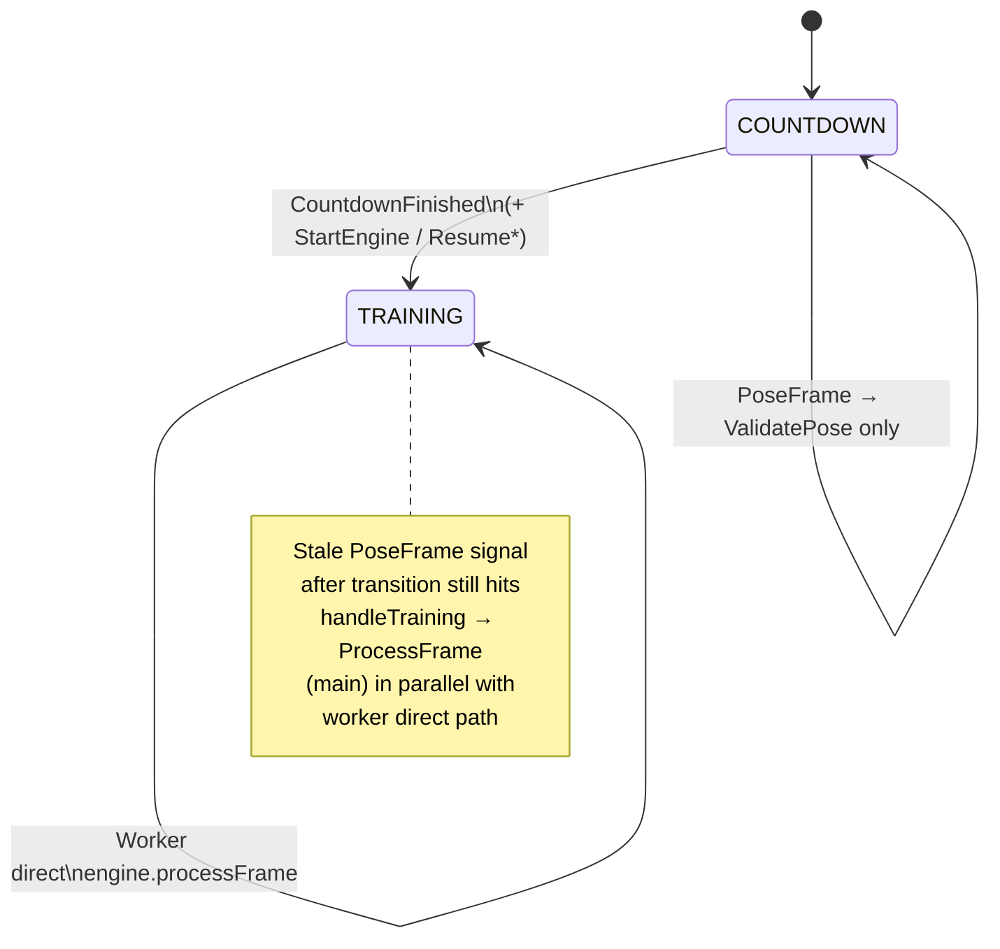
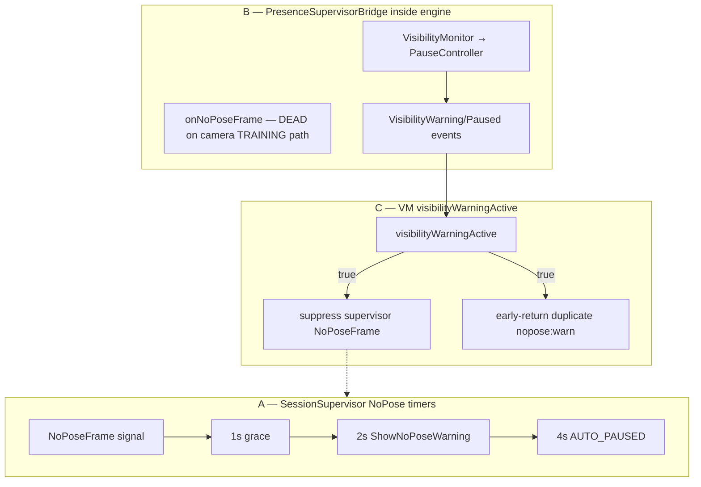
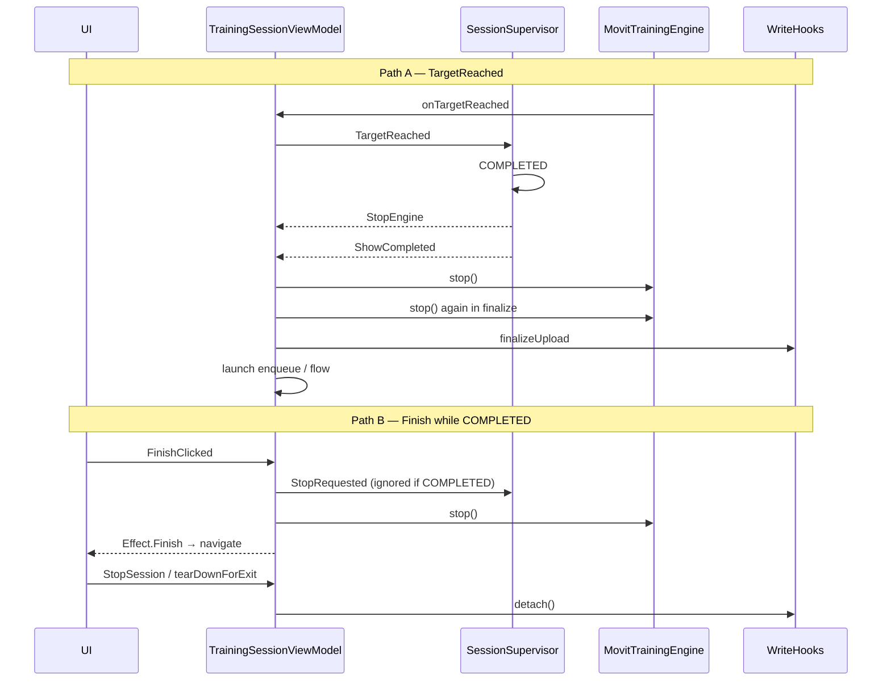
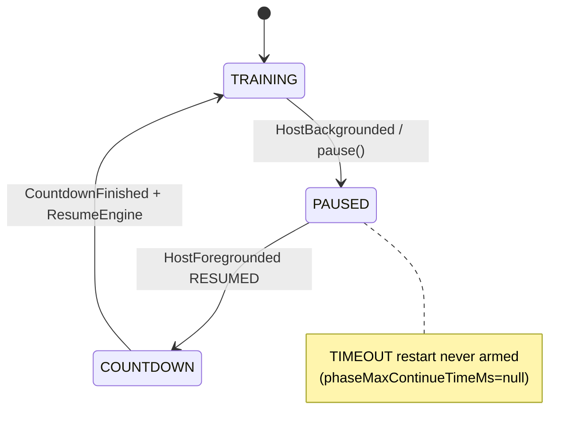

# Camera Training Engine — Comprehensive Review

> مراجعة شاملة لمحرك أداء التمارين أمام الكاميرا (`kmp-app`). **قراءة فقط — بلا تعديلات كود.**
>
> **تاريخ**: 2026-07-10  
> **الوكلاء**: A/C/D/E/F/G = Cursor Grok 4.5 (`grok-4.5-xhigh`) · B/H/I/J/K + frame-flow = Composer 2.5 · تحقق عدائي P0/P1 = Grok 4.5  
> **المرجع**: `Camera-Engine-Review-Brief.md`

---

# Camera Training Engine — Review Index (`00-INDEX`)

> **Date**: 2026-07-10  
> **Scope**: `kmp-app` pose-capture + training-engine + feature/training (read-only)  
> **Agents**: Tracks A,C,D,E,F,G → `grok-4.5-xhigh`; Tracks B,H,I,J,K + frame-flow → `composer-2.5`; Adversarial P0/P1 → `grok-4.5-xhigh`  
> **Single consolidated deliverable**: [`CAMERA-ENGINE-COMPREHENSIVE-REVIEW.md`](./CAMERA-ENGINE-COMPREHENSIVE-REVIEW.md)

## 1. All findings (Severity → Track)

| ID | Title | Severity | Type | Status | Effort | Verified-by |
|----|-------|----------|------|--------|--------|-------------|
| E-01 | `assemble` drops all world 3D angles after virtual landmark append | P0 | Correctness | CONFIRMED | S | adversarial-grok-4.5-xhigh |
| J-02 | `MovitTrainingEngine` throws uncaught `error()` on missing pose var... | P0 | Correctness | CONFIRMED | M | adversarial-grok-4.5-xhigh |
| A-05 | TOCTOU recycle race between takeSnapshotJpeg copy and detectAsync | P1 | Concurrency | CONFIRMED | S | adversarial-grok-4.5-xhigh |
| A-07 | bindingInProgress silently drops lens-switch bind — frames can stall | P1 | Concurrency | CONFIRMED | M | adversarial-grok-4.5-xhigh |
| B-01 | iOS ignores throughput analysis resolution (runs at PresetHigh nati... | P1 | Correctness | CONFIRMED | M | adversarial-grok-4.5-xhigh |
| B-02 | Front-camera capture mirroring diverges from Android unmirrored ML ... | P1 | Correctness | NEEDS-DATA | S | adversarial-grok-4.5-xhigh |
| C-01 | Dual-thread `processFrame` race at countdown→training transition | P1 | Concurrency | CONFIRMED | M | adversarial-grok-4.5-xhigh |
| C-02 | `FrameIngressGate` non-atomic / no memory visibility | P1 | Concurrency | CONFIRMED | S | adversarial-grok-4.5-xhigh |
| C-10 | Unsynchronized `SessionSupervisor.processSignal` from Main + Default | P1 | Concurrency | CONFIRMED | M | adversarial-grok-4.5-xhigh |
| E-05 | Shared `PoseFrameAssembler` elbow estimator race / cross-consumer b... | P1 | Concurrency | CONFIRMED | M | adversarial-grok-4.5-xhigh |
| F-01 | Multiple UiState copies per pose frame (TRAINING 2–3, setup 3–4) | P1 | Performance | CONFIRMED | M | adversarial-grok-4.5-xhigh |
| F-02 | Monolithic `collectAsState` → full-screen recomposition at pose rate | P1 | Performance | CONFIRMED | L | adversarial-grok-4.5-xhigh |
| G-01 | Finish can navigate/detach before finalize upload completes | P1 | Correctness | CONFIRMED | M | adversarial-grok-4.5-xhigh |
| G-02 | Preference rebuild replaces engine outside TRAINING and orphans jou... | P1 | Correctness | CONFIRMED | M | adversarial-grok-4.5-xhigh |
| J-01 | `applyFlowExercise` clamps pose variant using previous exercise config | P1 | Correctness | CONFIRMED | S | adversarial-grok-4.5-xhigh |
| J-03 | `validationIssues()` never enforced before engine build | P1 | Correctness | CONFIRMED | S | adversarial-grok-4.5-xhigh |
| A-01 | Per-frame Bitmap allocation without reuse (toBitmap + rotate) *(severity downgraded P1→P2)* | P2 | Performance | CONFIRMED | M | adversarial-grok-4.5-xhigh |
| A-02 | inferenceInFlight held through post-inference assemble/emit | P2 | Performance | CONFIRMED | S | pending |
| A-04 | takeSnapshotJpeg full-frame copy + JPEG on IO; high replay cadence | P2 | Performance | CONFIRMED | M | pending |
| A-06 | dispose() never called; stop() leaves landmarker + executor warm | P2 | Memory | CONFIRMED | S | pending |
| A-08 | pendingProviderReady overwritten — lost bind callback | P2 | Concurrency | CONFIRMED | S | pending |
| A-12 | Five stacked backpressure layers — roles overlap; device proof needed | P2 | Architecture | NEEDS-DATA | M | pending |
| A-13 | persistSnapshot takes two independent JPEGs (full then thumb) | P2 | Correctness | CONFIRMED | S | pending |
| A-14 | Heavy-model warmUp can close live PoseLandmarker under traffic | P2 | Concurrency | CONFIRMED | M | pending |
| A-15 | Post-result path allocates many Landmark lists while gate held | P2 | Performance | CONFIRMED | M | pending |
| B-03 | No inference-in-flight gate on iOS pose detection | P2 | Performance | CONFIRMED | S | pending |
| B-04 | Pose timestamps use wall-clock on iOS vs monotonic uptime on Android | P2 | Correctness | CONFIRMED | S | pending |
| B-05 | Lens-switch hygiene missing `LensSwitchFrameGate` and `resetElbowEs... | P2 | Correctness | CONFIRMED | S | pending |
| B-06 | Swift→Kotlin flat landmark bridge allocates per frame | P2 | Performance | CONFIRMED | M | pending |
| B-08 | iOS MediaPipe warmUp lacks GPU→CPU fallback retry | P2 | Correctness | CONFIRMED | S | pending |
| B-10 | `minPosePresenceConfidence` not configured on iOS MediaPipe options | P2 | Correctness | NEEDS-DATA | S | pending |
| C-04 | CONFLATED ingress can delay NoPose detection | P2 | Correctness | CONFIRMED | M | pending |
| C-06 | Parallel presence stacks + duplicated NoPose warning handlers | P2 | Architecture | CONFIRMED | M | pending |
| C-07 | Engine `PresenceSupervisorBridge.onNoPoseFrame` unreachable on came... | P2 | Dead-code | CONFIRMED | M | pending |
| C-08 | Elapsed freezes without frames; lens switch can jump elapsed | P2 | Correctness | CONFIRMED | S | pending |
| D-01 | Front-camera path allocates full mirrored PoseFrame every frame | P2 | Performance | CONFIRMED | M | pending |
| D-02 | `checkVisibility` re-runs `evaluateJointVisibility` | P2 | Performance | CONFIRMED | S | pending |
| D-04 | Position validation always runs scene detection even when phase che... | P2 | Performance | CONFIRMED | S | pending |
| D-07 | Triple smoothing stack (MA + phase hysteresis; One-Euro upstream) | P2 | Performance | CONFIRMED (stack) / NEEDS-DATA (latency) | M | pending |
| D-10 | Engine `metricsSnapshot()` allocates on demand; not 3× inside `proc... | P2 | Performance | CONFIRMED (API cost) — per-frame ×3 is VM-side | S | pending |
| D-11 | Frame-tied `nowMs` can freeze phase timing when frames stop | P2 | Correctness | CONFIRMED (mechanism) / NEEDS-DATA (user impact) | M | pending |
| E-03 | Virtual landmarks 33/34 survive mirroring; `mirrorLandmarks` is a n... | P2 | Correctness | CONFIRMED | M | pending |
| E-06 | Triple smoothing stack latency unmeasured (PF-19 math) | P2 | Performance | NEEDS-DATA | M | pending |
| E-07 | Visibility threshold split 0.5 vs 0.3 (E5) | P2 | Correctness | CONFIRMED | S | pending |
| E-08 | Elbow estimator not reset on new exercise (E4) | P2 | Correctness | CONFIRMED | S | pending |
| E-10 | Overlay FILL_CENTER + front mirror aligned in code; device aspect m... | P2 | Correctness | NEEDS-DATA | M | pending |
| E-11 | 3D/2D mode switch has no hysteresis (E1 residual) | P2 | Correctness | CONFIRMED | M | pending |
| F-03 | `buildSkeletonRomIndicators` recomputed every frame on main via `re... | P2 | Performance | CONFIRMED | S | adversarial-grok-4.5-xhigh |
| F-04 | `FeedbackSignal` allocated before scheduler cooldown drop | P2 | Performance | CONFIRMED | S | pending |
| F-06 | Setup path double `refreshSkeletonOverlay` + triple `metricsSnapshot` | P2 | Performance | CONFIRMED | S | pending |
| F-07 | Skeleton Canvas redraws without `drawWithCache`; ARC ROM ~90 draw o... | P2 | Performance | CONFIRMED | M | pending |
| G-03 | Immediate engine rebuild on first preferences emission | P2 | Performance | CONFIRMED | S | pending |
| G-04 | Session quality counters not reset per exercise/set | P2 | Correctness | CONFIRMED | S | pending |
| G-05 | Background phase-timeout restart never armed in production | P2 | Architecture | CONFIRMED | S (doc) / M (wire limits) | pending |
| G-08 | `onCleared` omits `engine.stop` and pending capture join | P2 | Memory | CONFIRMED | S | pending |
| G-09 | Supervisor action buffer can drop under ValidatePose spam | P2 | Concurrency | NEEDS-DATA | S | pending |
| G-11 | Duplicate NoPose warning paths (overlap with Track C / PF-16) | P2 | Duplication | CONFIRMED | M | pending |
| H-02 | Post-training report built twice on every exercise finalize | P2 | Performance | CONFIRMED | S | pending |
| H-05 | Report cache LRU (10) can evict sibling set reports before merge | P2 | Correctness | CONFIRMED | M | pending |
| H-06 | Cross-set aggregator uses score-only best/worst; omits rich analysi... | P2 | Correctness | CONFIRMED | M | pending |
| H-07 | Peak JPEG capture copies bitmap twice per peak (full + thumb) on IO... | P2 | Performance | CONFIRMED | M | pending |
| I-06 | Duplicate NoPose feedback — supervisor path live, presence path unr... | P2 | Duplication | CONFIRMED | S | pending |
| I-07 | `evaluateJointVisibility` invoked twice per training frame | P2 | Duplication | CONFIRMED | S | pending |
| J-04 | Sync parser silently drops malformed exercise JSON | P2 | Architecture | CONFIRMED | S | pending |
| J-05 | `JointEvaluator` builds state messages every frame for all joints | P2 | Performance | CONFIRMED | M | pending |
| J-08 | Visibility threshold defaults diverge (0.3f vs 0.5f) | P2 | Correctness | CONFIRMED | S | pending |
| K-01 | `runBlocking`+Mutex on hot-path threads distorts debug pipeline met... | P2 | Performance | CONFIRMED | M | pending |
| K-07 | `metricsSnapshot()` called every processed frame on diagnostics pat... | P2 | Performance | CONFIRMED | S | pending |
| A-03 | frameCameraState entries can leak on dropped/error frames | P3 | Memory | CONFIRMED | S | pending |
| A-09 | providerInitializing remains true after successful provider init | P3 | Architecture | CONFIRMED | S | pending |
| A-10 | postDelayed widest-zoom retries guarded by camera identity | P3 | Correctness | CONFIRMED | S | pending |
| A-11 | Dual imageProxy.close paths are defensive, not harmful double-close... | P3 | Correctness | CONFIRMED | S | pending |
| A-16 | AndroidPoseRefiner is permanently unavailable (dead refine path) | P3 | Dead-code | CONFIRMED | S | pending |
| B-07 | Training pipeline diagnostics permanently disabled on iOS | P3 | Architecture | CONFIRMED | S | pending |
| B-09 | `modelType` parameter ignored on iOS training camera host | P3 | Architecture | CONFIRMED | M | pending |
| B-11 | iOS debug FPS path exists but `isTrainingDebugBuild()` is always false | P3 | Dead-code | CONFIRMED | S | pending |
| C-03 | `ProcessFrame` action is TRAINING-only; setup uses dead `ValidatePo... | P3 | Architecture | CONFIRMED | S | pending |
| C-05 | Debug Compose state written from MediaPipe callback thread | P3 | Concurrency | CONFIRMED | S | pending |
| C-09 | `recordVmIngress(wasConflated = false)` always — conflation metric ... | P3 | Performance | CONFIRMED | S | pending |
| D-05 | Dead fields `executionStartMs` and `lastSmoothedAngles` | P3 | Dead-code | CONFIRMED | S | pending |
| D-06 | `MainPathFrameResult` carries unused `rawTrackedAngles` / result-le... | P3 | Dead-code | CONFIRMED | S | pending |
| D-08 | `ensureAppended` second call per frame is a no-op when assemble alr... | P3 | Performance | CONFIRMED | S | pending |
| D-09 | Virtual landmarks 33/34 survive limb swap without corruption | P3 | Correctness | CONFIRMED (safe) | S | pending |
| D-12 | `SessionOrchestrator.snapshot()` unused in production | P3 | Dead-code | CONFIRMED | S | pending |
| E-02 | `ensureAppended` second call per frame is a cheap no-op (PF-10 part 1) | P3 | Performance | CONFIRMED | S | pending |
| E-09 | One-Euro equal/backward timestamp edges uncovered (E6) | P3 | Correctness | CONFIRMED | S | pending |
| F-05 | Redundant `metricsSnapshot()` in `maybeDeliverRandomMessage` | P3 | Performance | CONFIRMED | S | pending |
| F-08 | High-frequency UiState fields updated but not composed (`glassMessa... | P3 | Architecture | CONFIRMED | M | pending |
| G-06 | Triple stop on completion path; summary duration not zeroed | P3 | Architecture | CONFIRMED | S | pending |
| G-07 | `stopAndFinalize()` has zero callers | P3 | Dead-code | CONFIRMED | S | pending |
| G-10 | Rest timer 1s delay loop drift | P3 | Performance | CONFIRMED | S | pending |
| H-01 | MotionRecorder memory is capped per rep, not linear in session fram... | P3 | Memory | CONFIRMED | S | pending |
| H-03 | `syncFrameEvidenceToWriteHooks` duplicated in cache and upload paths | P3 | Duplication | CONFIRMED | S | pending |
| H-04 | WorkoutExecutionBatchCoordinator removed; immediate per-set upload | P3 | Architecture | CONFIRMED (brief outdated) | S | pending |
| H-08 | Replay sampler can register up to 16 JPEGs/rep × 10 tracked reps on... | P3 | Memory | CONFIRMED | S | pending |
| H-09 | Journal checkpoint on every completed rep may amplify disk I/O | P3 | Performance | CONFIRMED | M | pending |
| I-01 | `LiveExerciseRunner` has no production callers | P3 | Dead-code | CONFIRMED | S | pending |
| I-02 | Dead engine fields `executionStartMs` and `lastSmoothedAngles` | P3 | Dead-code | CONFIRMED | S | pending |
| I-03 | `MainPathFrameResult` echo fields never read from pipeline output | P3 | Dead-code | CONFIRMED | S | pending |
| I-04 | WS-0 stub camera/pose classes unused | P3 | Dead-code | CONFIRMED | S | pending |
| I-05 | Diagnostics periodic formatter duplicated and drifted | P3 | Duplication | CONFIRMED | S | pending |
| I-08 | `EngineMetrics.positionErrorCount` is a redundant derived field | P3 | Dead-code | CONFIRMED | S | pending |
| I-09 | `TrainingSessionState` snapshot API unused in production | P3 | Dead-code | CONFIRMED | S | pending |
| I-10 | Report builders V1/V2 — intentional delegation, not dead duplication | P3 | Architecture | REFUTED (as "dead duplicate") | S | pending |
| I-11 | `PoseDetector.buildPoseFrame` implemented but never invoked | P3 | Dead-code | CONFIRMED | M (interface change across modules) | pending |
| I-12 | `SupervisorAction.ValidatePose` emitted but ignored by VM | P3 | Dead-code | CONFIRMED | S | pending |
| I-13 | `EngineMetrics.isInStartPosition` populated but never consumed | P3 | Dead-code | CONFIRMED | S | pending |
| I-14 | `StartPoseGate.boundaryBuffer` stored but unused | P3 | Dead-code | CONFIRMED | S | pending |
| I-15 | `PositionValidator.resolvedPosition` deprecated legacy accessor | P3 | Dead-code | CONFIRMED | S | pending |
| J-06 | VM `submitJointStateMessage` linear-scans `trackedJoints` | P3 | Performance | CONFIRMED | S | pending |
| J-07 | Triplicated rep-timing defaults (`ExerciseConfigDefaults` vs `Timin... | P3 | Duplication | CONFIRMED | S | pending |
| J-09 | `sanitizeDefaults()` is a no-op structural pass | P3 | Architecture | CONFIRMED | M | pending |
| J-10 | `getBySlug` uses bounded LRU (8) — adequate for typical session | P3 | Performance | CONFIRMED | S | pending |
| K-02 | iOS pipeline diagnostics fully disabled with no documented intent | P3 | Architecture | CONFIRMED | M | pending |
| K-03 | `PipelineTrace` is allocated always; `record()` is cheap in release | P3 | Performance | CONFIRMED | S | pending |
| K-04 | VM channel conflation never counted — `wasConflated` hardcoded false | P3 | Correctness | CONFIRMED | S | pending |
| K-05 | `backlog` metric conflates worker lag with channel conflation | P3 | Correctness | CONFIRMED | S | pending |
| K-06 | Test formatter drift — `backlog` line missing from `formatTrainingP... | P3 | Duplication | CONFIRMED | S | pending |
| K-08 | `training-debug` module ships in release binaries — runtime flags only | P3 | Architecture | CONFIRMED | M | pending |
| K-09 | `TrainingSessionWriteDiagnostics` — session-scoped upload counters ... | P3 | Architecture | CONFIRMED | — | pending |
| K-10 | No production caller enables `PipelineTraceConfig` — debug HUD path... | P3 | Dead-code | CONFIRMED | M | pending |
| D-03 | Mirrored landmarks + `isFrontCamera=true` desync `left_elbow` angle... *(REFUTED — PF-11; see adversarial-verification.md)* | P1 | Correctness | REFUTED | M | adversarial-grok-4.5-xhigh |
| E-04 | PF-11 double-mirror: REFUTED under current landmark no-op; undocume... | P2 | Architecture | REFUTED | M | pending |

**Total findings**: 123

## 2. PF-01 → PF-25 verdicts

| ID | Verdict | Finding(s) | Notes |
|----|---------|------------|-------|
| PF-01 | CONFIRMED | A-01 | Bitmap alloc/frame; severity P2 after adversarial |
| PF-02 | CONFIRMED | A-04/A-05/A-13/H-07 | Snapshot copy+JPEG; TOCTOU P1 |
| PF-03 | CONFIRMED | A-03 | frameCameraState leak on drop |
| PF-04 | CONFIRMED | A-02/A-15 | inferenceInFlight held through post-path |
| PF-05 | CONFIRMED | K-01/K-02/B-07 | runBlocking debug Android; dead iOS |
| PF-06 | CONFIRMED | C-09/K-04 | wasConflated always false |
| PF-07 | CONFIRMED | C-01/C-02/C-10 | dual-thread processFrame at transition |
| PF-08 | CONFIRMED | C-05 | debug Compose write off-main |
| PF-09 | CONFIRMED | D-01 | mirrored() full copy front camera |
| PF-10 | CONFIRMED (cheap)× / REFUTED (33/34 corrupt) | D-08/D-09/E-02/E-03 | double ensureAppended cheap; midpoints OK |
| PF-11 | REFUTED | E-04 / D-03 refuted | mirrorLandmarks no-op; L/R consistent via angles+flag |
| PF-12 | CONFIRMED | F-05/F-06/D-10 | metricsSnapshot multi-call in VM |
| PF-13 | CONFIRMED | F-01/F-02 | UiState updates + monolithic collect; fps NEEDS-DATA |
| PF-14 | CONFIRMED | I-02/D-05 | executionStartMs / lastSmoothedAngles dead |
| PF-15 | CONFIRMED | I-01 | LiveExerciseRunner test-only |
| PF-16 | CONFIRMED (arch) | C-06/C-07/I-06/G-11 | layers+dup handlers; dual warn largely prevented |
| PF-17 | CONFIRMED | I-05/K-06 | test formatter missing backlog |
| PF-18 | CONFIRMED | E-05 | PoseFrameAssembler singleton elbow race |
| PF-19 | CONFIRMED stack / NEEDS-DATA latency | D-07/E-06 | One-Euro→MA→hysteresis |
| PF-20 | CONFIRMED | G-02/G-03 | prefs rebuild; orphan journal outside TRAINING |
| PF-21 | CONFIRMED | C-08/G-10 | elapsed freeze / rest delay drift |
| PF-22 | NEEDS-DATA | A-12 | 5 backpressure layers — device proof |
| PF-23 | CONFIRMED | A-10 | postDelayed zoom; identity guard OK practically |
| PF-24 | CONFIRMED | A-06 | dispose never called; warm after stop |
| PF-25 | CONFIRMED | A-11 | dual close paths defensive |

## 3. OQ-01 → OQ-07

| ID | Question | Answer |
|----|----------|--------|
| OQ-01 | UiState monolith including landmarks | Migration debt with documented R1 overlay split preferred (Track F). Needs product/eng decision to schedule. |
| OQ-02 | Triple smoothing required for legacy? | Stack CONFIRMED; latency NEEDS-DATA. Measure before simplifying. |
| OQ-03 | Android/iOS parity bar | Code aims behavioral training parity (shared assembler/One-Euro) not numeric capture parity. Product must define bar. |
| OQ-04 | iOS diagnostics off | Hardcoded false stub; no documented intent. Product decision needed. |
| OQ-05 | Keep detector/executor warm after stop() | Likely intentional for fast re-entry (Track A). Confirm policy + add explicit dispose on process death path. |
| OQ-06 | training-debug excluded from release? | NO — module ships via shell; gated only by DEBUG/runtime flags (Track K). |
| OQ-07 | LiveExerciseRunner future or leftover? | Phase 07 WS-2 leftover; production uses MovitTrainingEngine (Track I). |

## 4. Top-10 Remediation

| # | IDs | Sev | Effort | Action | Dependencies |
|---|-----|-----|--------|--------|--------------|
| 1 | J-02 + J-01 | P0/P1 | S–M | Fix pose-variant resolve order then replace error() with safe fallback | J-01 before J-02 |
| 2 | E-01 | P0 | S | Fix assemble world-size gate (compare to raw 33 or pad world) | Unblocks true 3D angles |
| 3 | C-01 + C-02 + C-10 | P1 | M | Single-thread engine ingress; AtomicBoolean gate; serialize supervisor | Do together |
| 4 | G-01 | P1 | M | Block Finish/detach until finalizeUpload completes | Independent |
| 5 | G-02 | P1 | M | Defer prefs rebuild until idle; re-wire isRunning/journal | Independent |
| 6 | A-05 | P1 | S | Copy bitmap under same lock as recycle | Independent |
| 7 | A-07 | P1 | M | Queue pending lens facing when bindingInProgress | Independent |
| 8 | B-01 | P1 | M | Honor analysisWidth/Height on iOS session preset | Parity |
| 9 | F-02 | P1 | L | Split overlay StateFlow from session UiState (R1) | Depends on OQ-01 |
| 10 | J-03 | P1 | S | Enforce validationIssues() before buildEngine | Pairs with J-02 |

## 5. Coverage / gaps

- Tracks A–K delivered; `01-frame-flow-verified.md` and `perf-baseline.md` (NEEDS-DEVICE) present.
- Adversarial pass covered all P0/P1 findings (including E-05 / F-01 follow-up).
- Device measurements (fps/GC/RSS) not run in this environment — see `perf-baseline.md`.
- Brief H4 `WorkoutExecutionBatchCoordinator` path is **gone** in current tree (Track H).
- Not every `.kt` line-audited; Track I pattern-swept 341 files.

## Artifact map

| File | Role |
|------|------|
| `CAMERA-ENGINE-COMPREHENSIVE-REVIEW.md` | **Single consolidated report (user deliverable)** |
| `00-INDEX.md` | This index |
| `01-frame-flow-verified.md` | Verified frame journey + threading |
| `perf-baseline.md` | Measurement protocol (NEEDS-DEVICE) |
| `adversarial-verification.md` | P0/P1 refute pass |
| `track-A`…`track-K` | Per-track deep dives |


---

# Part II — Verified Frame Flow

# Verified Frame Flow — Camera Training Engine

> **Purpose**: Authoritative frame journey after cross-track verification (A–D, especially C).  
> **Mode**: READ-ONLY review — citations are from the current `kmp-app/` tree (verified 2026-07-10).  
> **Supersedes**: Brief §2 line numbers and several behavioral claims; see §6.

---

## 1. Android frame journey (steps 1–10)

Hot path repeats at the **configured target fps** (production default **10 fps**, 320×240 — not 20–30 fps unless a higher throughput profile flag is set).

```
[1] TrainingSessionCameraHost.android.kt
      Registers frameListener; forwards frames to VM via route event
      feature/training/src/androidMain/.../TrainingSessionCameraHost.android.kt:85-107
        ↓
[2] CameraXFrameSource.bindUseCases
      Preview (4:3) + ImageAnalysis (KEEP_ONLY_LATEST + analysis resolution from CameraSourceConfiguration)
      core/pose-capture/src/androidMain/.../CameraXFrameSource.kt:236-353
        ↓  (thread: analysisExecutor — single-thread ExecutorService)
[3] Analyzer: shouldAnalyzeFrame() manual targetFps throttle
      → MediaPipePoseDetector.detectAsync(proxy, useFrontCamera)
      CameraXFrameSource.kt:307-316, :407-416
      MediaPipePoseDetector.kt:153-190
        ↓
[4] detectAsync: inferenceInFlight gate → imageProxy.toBitmap()
      → rotateBitmapForAnalysis (new Bitmap when rotation ≠ 0) → lastFrameBitmap
      → PoseLandmarker.detectAsync (LIVE_STREAM)
      MediaPipePoseDetector.kt:160-184, :213-226
        ↓  (thread: MediaPipe result callback)
[5] onPoseResult:
      MediaPipeLandmarkMapper → LandmarkSmoother (One-Euro ×33 norm + world)
      → PoseRefiner (no-op: AndroidPoseRefiner.isAvailable = false)
      → listener.onPoseDetected
      MediaPipePoseDetector.kt:275-312
        ↓  (same MediaPipe callback thread; inferenceInFlight released in finally :310-311)
[6] CameraXFrameSource listener → PoseFrameAssembler.assemble
      → emitPoseFrame → LensSwitchFrameGate → frameListener
      CameraXFrameSource.kt:175-190, :145-158
        ↓  (still MediaPipe callback thread until Host returns)
[7] Route: PoseFrameReceived → TrainingSessionViewModel.onPoseFrame
      → poseFrameChannel.trySend (Channel.CONFLATED)
      MovitTrainingRoutes.kt:200
      TrainingSessionViewModel.kt:426-429
        ↓  (thread: poseFrameWorker on Dispatchers.Default)
[8] processPoseFrameOnWorker:
      TRAINING → engine.processFrame(frame) directly on worker + elapsed + overlay
      setup/countdown → SupervisorSignal.PoseFrame → ValidatePose (VM no-op)
                        + SetupReadinessGate.validate + state updates
      TrainingSessionViewModel.kt:441-528
        ↓
[9] MovitTrainingEngine.processFrame → processPoseFrame:
      presenceBridge → FrameIngressGate → frame.mirrored() (front cam)
      → JointAngleTracker → visibility (dual evaluate) → PauseController
      → FramePipelineExecutor.runMainPath → feedback / rep / hold hooks
      MovitTrainingEngine.kt:577-595, :601-767
        ↓  (engine callbacks invoke VM lambdas on caller thread — Default or Main)
[10] engine callbacks → FeedbackRouter + _state.update
      → MovitTrainingRoutes collectAsStateWithLifecycle → TrainingSessionScreen
      MovitTrainingRoutes.kt:112
        ↓  (on exercise complete)
      finalizeCurrentExercise → writeHooks.finalizeUpload → reports → enqueueUpload
      TrainingSessionViewModel.kt:1062-1119
```

### Step-by-step evidence (Android)

| Step | What happens | Verified citation |
|------|----------------|-------------------|
| **1** | `DisposableEffect` wires `setFrameListener`, debug FPS counter (debug only), `onFrame(frame)`; `onDispose` calls `stop()` only | `TrainingSessionCameraHost.android.kt:85-107` |
| **2** | `bindUseCases`: Preview 4:3, ImageAnalysis with `STRATEGY_KEEP_ONLY_LATEST`, resolution from `configuration.analysisWidth/Height`, analyzer on `analysisExecutor()` | `CameraXFrameSource.kt:282-318`, `:355-358` |
| **3** | `shouldAnalyzeFrame()` enforces `targetFps`; accepted frames call `poseDetector.detectAsync` | `CameraXFrameSource.kt:407-416`, `:309-316` |
| **4** | `tryAcquireInferenceSlot` (AtomicBoolean); bitmap pipeline; `marker.detectAsync` | `MediaPipePoseDetector.kt:160-184` |
| **5** | Smooth + optional refine in `onPoseResult`; `inferenceInFlight` cleared in `finally` after full listener chain | `MediaPipePoseDetector.kt:289-311` |
| **6** | Assemble in frame-source listener; `LensSwitchFrameGate.acceptFrame`; `frameListener?.invoke` | `CameraXFrameSource.kt:176-190`, `:145-158` |
| **7** | `requiresCamera()` gate; `Channel.CONFLATED` ingress | `TrainingSessionViewModel.kt:426-429`, `:173` |
| **8** | Worker branches on `supervisor.state`; TRAINING bypasses supervisor for frames | `TrainingSessionViewModel.kt:458-466`, `:471-525` |
| **9** | Engine ingress gate + full per-frame pipeline | `MovitTrainingEngine.kt:577-767` |
| **10** | UI collect + finalize/upload on completion | `MovitTrainingRoutes.kt:112`; `TrainingSessionViewModel.kt:1062-1119` |

---

## 2. iOS parallel journey

Same VM, engine, and `PoseFrameAssembler` from step 7 onward (`commonMain`). Capture differs:

```
[i1] TrainingSessionCameraHost.ios.kt
      Registers frameListener; UIKitView preview; stop() on dispose
      feature/training/src/iosMain/.../TrainingSessionCameraHost.ios.kt:47-75
        ↓
[i2] IosCameraFrameSource.start
      AVCaptureSessionPresetHigh (does NOT bind analysisWidth/Height from config)
      alwaysDiscardsLateVideoFrames + manual targetFps throttle on outputQueue
      IosCameraFrameSource.kt:94-182, :144-155
        ↓  (thread: outputQueue — serial dispatch queue)
[i3] IosPoseDetector.detectAsync(sampleBuffer, isFrontCamera)
      → IosPoseLandmarkerBridge (Swift) → MediaPipe detectAsync
      IosCameraFrameSource.kt:155
      IosPoseDetector.kt:78-89
      iosApp/.../MovitPoseLandmarkerBridge.swift:69-87
        ↓  (thread: Swift/MediaPipe result callback → Kotlin resultHandler)
[i4] PoseLandmarkFlatCodec.decode (flat → List<Landmark>)
      IosPoseDetector.kt:124-134
        ↓  (callback thread → IosCameraFrameSource listener)
[i5] PoseLandmarkSmoother.smooth (+ world) → PoseFrameAssembler.assemble
      → frameListener (no LensSwitchFrameGate / CameraStartGate on iOS)
      IosCameraFrameSource.kt:101-114
        ↓
[i6–i10] Identical to Android steps 7–10 (commonMain VM + engine + routes)
      TrainingSessionViewModel.kt:426-529, :577-767 (engine)
      MovitTrainingRoutes.kt:200, :112
```

### iOS-specific notes (Track B)

| Topic | iOS behavior | Citation |
|-------|----------------|----------|
| Smoothing location | In `IosCameraFrameSource` listener, not detector | `IosCameraFrameSource.kt:103-105` |
| Refine | Absent (NoOp) | Track B — no refine hook |
| Mirror at capture | Front camera `setVideoMirrored(true)` on connection | `IosCameraFrameSource.kt:168-171` |
| Analysis resolution | Native sensor (`PresetHigh`), config dimensions unused for capture | `IosCameraFrameSource.kt:128`, `:111-112` |
| Busy gate | **No** `inferenceInFlight` equivalent | `IosPoseDetector.kt:78-89` |
| Lens switch gates | **No** `LensSwitchFrameGate` / `CameraStartGate` | grep: none under `iosMain` |
| Timestamps | Wall clock `NSDate.timeIntervalSince1970` | `IosPoseDetector.kt:152-153` |
| Stop lifecycle | `poseDetector.shutdown()` on every `stop()` | `IosCameraFrameSource.kt:184-187` |

---

## 3. Threading table (Android + iOS)

| Stage | Android thread / dispatcher | iOS thread / dispatcher | Evidence |
|-------|----------------------------|-------------------------|----------|
| Camera frame delivery to analyzer | `analysisExecutor` (single-thread) | `outputQueue` (serial GCD) | `CameraXFrameSource.kt:355-358`; `IosCameraFrameSource.kt:55`, `:158` |
| FPS throttle (layer 2) | `analysisExecutor` | `outputQueue` | `CameraXFrameSource.kt:407-416`; `IosCameraFrameSource.kt:144-154` |
| Bitmap / buffer prep + submit inference | `analysisExecutor` | `outputQueue` → bridge | `MediaPipePoseDetector.kt:153-184`; `IosPoseDetector.kt:78-89` |
| MediaPipe result → smooth → assemble → `frameListener` | MediaPipe callback thread | Swift callback → Kotlin `resultHandler` | `MediaPipePoseDetector.kt:275-312`; `IosCameraFrameSource.kt:101-114` |
| Debug `frameCounter` (Compose) | MediaPipe callback | Same listener thread (debug path exists but `isTrainingDebugBuild()` is `false` on iOS) | `TrainingSessionCameraHost.android.kt:90-98`; `.ios.kt:58-67` |
| `onPoseFrame` / `trySend` | MediaPipe callback (via Host) | Pose delivery thread | `TrainingSessionViewModel.kt:426-429` |
| `processPoseFrameOnWorker` | `Dispatchers.Default` | `Dispatchers.Default` | `TrainingSessionViewModel.kt:434-438`, `:441-528` |
| `engine.processFrame` (steady TRAINING) | `Dispatchers.Default` | `Dispatchers.Default` | `TrainingSessionViewModel.kt:463` |
| `engine.processFrame` (`SupervisorAction.ProcessFrame`) | **Main** (`viewModelScope`) | **Main** | `TrainingSessionViewModel.kt:706-707`, `:982-994` |
| `SessionSupervisor.processSignal` | **Both** Main and Default | **Both** (commonMain) | Worker `:451`, `:471`; countdown `:736-737` |
| Countdown tick / finish | Main (`countdown.start(viewModelScope)`) | Main | `TrainingSessionViewModel.kt:997`; `CountdownController` via `wireCountdown` |
| Supervisor `actions` handling | Main | Main | `TrainingSessionViewModel.kt:706-707` |
| Engine callbacks → `_state.update` / feedback | Thread that called `processFrame` | Same | Default in steady state; Main on race path |
| Compose UI `state` collect | Main | Main | `MovitTrainingRoutes.kt:112` |
| `finalizeCurrentExercise` I/O | Main launches; `awaitPendingCaptures` on Default | Same | `TrainingSessionViewModel.kt:1068-1071` |

**Design check (PF-07)**: `MovitTrainingEngine` uses plain `var` state and `FrameIngressGate` is a non-volatile `Boolean` (`FrameIngressGate.kt:9-25`). Steady TRAINING is single-threaded on the worker; a **transition race** can overlap Main + Default — see §5.

---

## 4. Backpressure layers — active per platform

Five stacked layers (Brief §4). “Active” = implemented and exercised on the live camera path.

| # | Layer | Android | iOS | Location |
|---|--------|---------|-----|----------|
| **1** | Camera keeps latest frame only | **Yes** — `ImageAnalysis.STRATEGY_KEEP_ONLY_LATEST` | **Yes** — `alwaysDiscardsLateVideoFrames = true` | `CameraXFrameSource.kt:305`; `IosCameraFrameSource.kt:149` |
| **2** | Manual `targetFps` throttle | **Yes** — `shouldAnalyzeFrame()` | **Yes** — `minFrameIntervalMs` on `outputQueue` | `CameraXFrameSource.kt:407-416`; `IosCameraFrameSource.kt:144-154` |
| **3** | Inference busy gate | **Yes** — `inferenceInFlight` (held through smooth+assemble+emit) | **No** — overlapping `detectAsync` possible | `MediaPipePoseDetector.kt:192-201`, `:310-311`; no iOS equivalent |
| **3b** | Lens switch frame gate (Android only) | **Yes** — drops/gates during lens flip | **N/A** | `CameraXFrameSource.kt:151-152` |
| **4** | VM `Channel.CONFLATED` | **Yes** | **Yes** (shared VM) | `TrainingSessionViewModel.kt:173`, `:429` |
| **5** | `FrameIngressGate` in engine | **Yes** (not cross-thread safe) | **Yes** (shared engine) | `MovitTrainingEngine.kt:586-594`; `FrameIngressGate.kt:15-25` |

**Production default throughput** (both platforms read the same config): `TrainingThroughputProfiles.STABLE` = 320×240 @ **10 fps** unless `readTrainingThroughputProfileFlag()` overrides (`TrainingThroughputProfile.kt:21-26`, `TrainingThroughputFlags.kt:8-10`). On iOS, layer 2 throttles submits but inference may still run at **native resolution** (Track B gap).

**Layer interaction (Android, Track A)**: Layers 2 and 3 both active; at 10 fps layer 2 is usually the primary limiter, layer 3 guards slow inference/post chains. At 20–30 fps profiles, layer 3 dominates. Device measurement still **NEEDS-DATA** (PF-22).

---

## 5. Dual-path `processFrame` (Track C)

### Steady state (intentional)

When `supervisor.state == TRAINING`, the worker **does not** send `SupervisorSignal.PoseFrame`. It calls `engine.processFrame` directly and only `supervisor.onTrainingPoseFrameProcessed()` to reset the NoPose timer:

```458:466:kmp-app/feature/training/src/commonMain/kotlin/com/movit/feature/training/TrainingSessionViewModel.kt
    val runState = supervisor.state.value
    if (runState == SessionRunState.TRAINING) {
      supervisor.onTrainingPoseFrameProcessed()
      updateSessionElapsed(frame.timestampMs)
      latestTrainingAngles = frame.angles
      engine?.processFrame(frame)
      refreshSkeletonOverlay(runState)
      maybeDeliverRandomMessage(frame.timestampMs)
      return
    }
```

`SessionSupervisor` documents this bypass (`SessionSupervisor.kt:150-156`).

### Setup / countdown (corrected vs brief)

Non-TRAINING states send `SupervisorSignal.PoseFrame`, which maps to **`SupervisorAction.ValidatePose`** — handled as **`Unit`** in the VM. Live setup validation is **`SetupReadinessGate` in the worker**, not the supervisor action:

```271:272:kmp-app/core/training-engine/src/commonMain/kotlin/com/movit/core/training/session/SessionSupervisor.kt
            is SupervisorSignal.PoseFrame -> {
                emit(SupervisorAction.ValidatePose(signal.angles, signal.landmarks, signal.isFrontCamera))
```

```996:996:kmp-app/feature/training/src/commonMain/kotlin/com/movit/feature/training/TrainingSessionViewModel.kt
      is SupervisorAction.ValidatePose -> Unit
```

`SupervisorAction.ProcessFrame` is emitted **only** when `PoseFrame` arrives while supervisor state is already **`TRAINING`** (`SessionSupervisor.kt:334-343`) — i.e. the race/legacy path, not normal setup/countdown.

### Transition race (PF-07 CONFIRMED)

```mermaid
sequenceDiagram
    autonumber
    participant CD as CountdownController (Main)
    participant Sup as SessionSupervisor
    participant Main as handleSupervisorAction (Main)
    participant W as poseFrameWorker (Default)
    participant Eng as MovitTrainingEngine

    Note over CD,Eng: State = COUNTDOWN; engine.isRunning = false

    CD->>Sup: CountdownFinished
    Sup->>Sup: transitionTo(TRAINING)
    Sup->>Main: StartEngine
    Main->>Eng: start()

    Note over W: Frame N: runState still COUNTDOWN (stale read)

    W->>Sup: PoseFrame (non-TRAINING branch)
    Note over Sup: state is now TRAINING
    Sup->>Main: ProcessFrame(N)
    Main->>Eng: processFrame(N) on Main

    W->>Eng: Frame N+1: direct processFrame on Default

    Note over Eng: Overlap: FrameIngressGate is plain Boolean
```

Same pattern at `RESUME_COUNTDOWN` → `TRAINING`. `FrameIngressGate` does not provide atomic cross-thread exclusion (`FrameIngressGate.kt:9-21`). Affects **both platforms** (commonMain VM/engine).

### No-pose during TRAINING

Worker returns before `engine.processFrame` when `!frame.hasPose` (`TrainingSessionViewModel.kt:445-453`). Engine `presenceBridge.onNoPoseFrame` is therefore **dead on the camera TRAINING path**; supervisor `NoPoseFrame` timers handle full exit (unless `visibilityWarningActive` suppresses — Track C §C6).

---

## 6. Corrections to original brief §2

| # | Brief §2 claim | Verified correction | Evidence |
|---|----------------|---------------------|----------|
| **C1** | Hot path runs **20–30×/s** | Default production is **10 fps** @ 320×240 (`STABLE`); higher rates require throughput profile flag | `TrainingThroughputProfile.kt:21-26` |
| **C2** | Step [1] lines **85–127** | Listener/dispose block is **85–107**; preview bind is separate `LaunchedEffect` **118–126** | `TrainingSessionCameraHost.android.kt` |
| **C3** | Step [5] smooth/assemble both in one block on detector callback | **Split**: smooth in `MediaPipePoseDetector.onPoseResult`; **assemble** in `CameraXFrameSource` listener | `MediaPipePoseDetector.kt:289-309`; `CameraXFrameSource.kt:176-184` |
| **C4** | `PoseRefiner` optional | **Always no-op** in production: `AndroidPoseRefiner.isAvailable = false` | Track A |
| **C5** | Step [6] VM lines **257–261** | `onPoseFrame` is **426–429**; channel declared **173** | `TrainingSessionViewModel.kt` |
| **C6** | Step [7] lines **272–360** | `processPoseFrameOnWorker` is **441–528**; worker started **432–438** | `TrainingSessionViewModel.kt` |
| **C7** | Setup/countdown may emit **`SupervisorAction.ProcessFrame`** | Emits **`ValidatePose`** (no-op); setup logic is **`SetupReadinessGate` in worker** | `SessionSupervisor.kt:271-272`; `TrainingSessionViewModel.kt:479-525`, `:996` |
| **C8** | `ProcessFrame` on main is normal for countdown | **`ProcessFrame` on Main is the transition race** (or video); steady TRAINING uses worker only | Track C; `TrainingSessionViewModel.kt:458-466` vs `:982-994` |
| **C9** | Step [8] `processFrame` **567–585** | **`577–595`** (`processFrame`); **`601–767`** (`processPoseFrame` body) | `MovitTrainingEngine.kt` |
| **C10** | Step [9] routes line **107** | Full state collect at **`MovitTrainingRoutes.kt:112`**; frame wired at **:200** | `MovitTrainingRoutes.kt` |
| **C11** | Step [10] `finalizeCurrentExercise` **876–931** | **`1062–1119`** | `TrainingSessionViewModel.kt` |
| **C12** | iOS one-liner “same smoother” | iOS uses shared **`PoseLandmarkSmoother`** (not Android `LandmarkSmoother` class); smoothing runs in **`IosCameraFrameSource`**, not detector | `IosCameraFrameSource.kt:54`, `:103-105` |
| **C13** | Implicit platform parity on capture | iOS lacks layers **3**, **3b**, and config-bound analysis resolution; mirror policy differs at capture | Track B §B4–B5 |
| **C14** | `inferenceInFlight` released after `channel.trySend` in step 5–6 | Released in detector `finally` **after** assemble+`frameListener` (which triggers `trySend`) — same practical effect, location is detector **:310-311** + listener chain in frame source | `MediaPipePoseDetector.kt:310-311`; `CameraXFrameSource.kt:176-190` |

---

## 7. Related PF verdicts (frame-flow scope)

| PF | Verdict | Frame-flow note |
|----|---------|-----------------|
| **PF-06** | CONFIRMED | `recordVmIngress(wasConflated = false)` always — layer 4 drops invisible |
| **PF-07** | CONFIRMED | Dual-path race at COUNTDOWN→TRAINING; not continuous dual feed |
| **PF-08** | CONFIRMED | Debug-only Compose write off main; release gated |
| **PF-16** | CONFIRMED | Three presence layers; camera TRAINING no-pose uses supervisor only |
| **PF-22** | NEEDS-DATA | All five Android layers exist; redundancy of 2 vs 3 needs device counters |

---

## 8. Coverage

**Read for this document**: `TrainingSessionCameraHost` (android/ios), `CameraXFrameSource.kt`, `MediaPipePoseDetector.kt`, `IosCameraFrameSource.kt`, `IosPoseDetector.kt`, `TrainingSessionViewModel.kt` (ingress + supervisor wiring + finalize), `SessionSupervisor.kt`, `MovitTrainingEngine.kt` (processFrame path), `FrameIngressGate.kt`, `MovitTrainingRoutes.kt`, `TrainingThroughputProfile.kt`, track summaries A/B/C/D.

**Not re-derived here**: full `processPoseFrame` allocation table (Track D), geometry mirror correctness (Track D/E), session lifecycle stop paths (Track G), perf numbers (Track K / `perf-baseline.md`).


---

# Part III — Adversarial Verification (P0/P1)

# Adversarial Verification — Camera Engine Review (P0/P1)

**Verifier**: adversarial-grok-4.5-xhigh  
**Method**: Re-read production source; attempt to refute each finding; keep CONFIRMED only with a concrete trigger.  
**Date**: 2026-07-10

---

## Critical conflict: PF-11 / D-03 vs E-04

### Final PF-11 verdict: **REFUTED** (no active left_elbow angle↔visibility desync)

Track D’s D-03 assumed `PoseFrame.mirrored()` actually swaps landmark buffers, then `isFrontCamera=true` remaps visibility to the opposite limb. Track E’s E-04 claimed `mirrorLandmarks` is a bidirectional no-op. **E-04 wins.**

### `left_elbow` front-camera trace (re-derived from source)

1. **Capture** leaves MediaPipe-indexed landmarks unmirrored (`MediaPipePoseDetector.kt:207-211`).
2. **`assemble`** computes `leftElbow` from indices 11/13/15 (anatomical left) (`PoseFrameAssembler.kt:52`).
3. **`frame.mirrored()`** (`PoseFrame.kt:22-31`):
   - Calls `PoseLandmarkMirroring.mirrorLandmarks` (`PoseLandmarkMirroring.kt:19-29`).
   - `swapMap` contains both `13→14` and `14→13`; the loop swaps then un-swaps → **landmarks unchanged**. Unit test asserts equality (`PoseFrameAssemblerTest.kt:149`).
   - `mirrorAngles` **does** swap: `workingFrame.angles.leftElbow` = anatomical **right**.
   - Sets `workingFrame.isFrontCamera = false`.
4. **`extractTrackedAngles`** reads `workingFrame.angles` → `"left_elbow"` = anatomical right (`JointAngleTracker.kt:113-118`, `MovitTrainingEngine.kt:612-620`).
5. **`buildJointVisibilities` / `computeJointVisibility("left_elbow", …, isFrontCamera=true)`** (`MovitTrainingEngine.kt:626`, `JointLandmarkMapping.kt:59-60,92-94`):
   - Raw indices `[11,13,15]` → `mirroredIndex` → `[12,14,16]` = anatomical **right** on the **unswapped** buffer.
6. **`PositionValidator`** with `isFrontCamera=true` (`PositionValidator.kt:146-147,630-633`):
   - `mirrorCheckLandmarks` renames `left_elbow` → `right_elbow` → `jointToLandmark` index **14** = anatomical **right**.

**Result**: angle stream, visibility, and position checks for config name `left_elbow` all resolve to anatomical **right** under front camera. No desync. D-03’s “visibility remaps to anatomical left” is false under the current no-op buffer swap.

**Latent hazard (not active PF-11)**: If `mirrorLandmarks` were “fixed” to a one-way swap while the engine still passes original `frame.isFrontCamera=true`, D-03 would become real. Document/fix as a unit, or pass `isFrontCamera=false` after a true buffer mirror.

---

## P0 candidates

### Verify [E-01]
- **Original Status/Severity**: CONFIRMED / P0 (track-E)
- **Adversarial attempt**: Argue elbows still get 3D via `ElbowAngleEstimator` when `world.size >= 33`, so “all world 3D angles dropped” is overstated; also argue production may intentionally run 2D.
- **Final Status**: CONFIRMED
- **Final Severity**: P0
- **Evidence**: `PoseFrameAssembler.kt:24-25` appends virtual landmarks (33→35 via `VirtualLandmarks.kt:15-38`); `calculateAngles` gate `worldLandmarks?.takeIf { it.size >= landmarks.size }` at `:50` fails for MediaPipe world length 33 vs resolved 35 → `world=null` → every limb uses 2D `angleAt`. 3D unit test calls `calculateAngles` directly with equal-sized lists (`PoseFrameAssemblerTest.kt:18-37`), never `assemble`+`ensureAppended`. Elbow estimator may still rewrite elbows (`:26-27`) but hips/knees/shoulders/ankles stay 2D-only on the hot path.
- **Verified-by**: adversarial-grok-4.5-xhigh
- **Notes**: Elbow 3D correction does not refute the finding; the `calculateAngles` 3D branch is dead for production `assemble`. Trigger: any live Android/iOS frame with 33 world + 33 norm landmarks.

### Verify [J-02]
- **Original Status/Severity**: CONFIRMED / P0 (track-J)
- **Adversarial attempt**: Argue `TrainingPoseVariantResolver` always clamps so `error()` is unreachable.
- **Final Status**: CONFIRMED
- **Final Severity**: P0
- **Evidence**: `MovitTrainingEngine.kt:131-133` — `getPoseVariant(poseVariantIndex) ?: error(...)`. `buildEngine()` constructs without try/catch (`TrainingSessionViewModel.kt:1644-1652`). Resolver clamps using `variantCount` (`TrainingPoseVariantResolver.kt:16-18`) but J-01 feeds the **previous** exercise’s count, so index can exceed the new exercise’s `poseVariants`. Empty `poseVariants` → resolver returns 0 → engine still `error`s. Trigger: flow exercise A with ≥3 variants → exercise B with 2 variants and flow `poseVariantIndex=2`.
- **Verified-by**: adversarial-grok-4.5-xhigh
- **Notes**: Paired with J-01; uncaught `IllegalStateException` on session start / inter-exercise reload.

---

## P1 candidates

### Verify [A-01]
- **Original Status/Severity**: CONFIRMED / P1 (track-A)
- **Adversarial attempt**: Production default is STABLE 320×240@10fps (`TrainingThroughputProfile.kt:21-25`) ≈ ~3MB/s ARGB churn — argue P1 overstates vs crash/correctness bugs; no measured jank in review.
- **Final Status**: CONFIRMED (mechanism) / **DOWNGRADED** (severity)
- **Final Severity**: P2
- **Evidence**: `MediaPipePoseDetector.kt:168-175,213-220` — every `detectAsync` does `imageProxy.toBitmap()`; non-zero rotation allocates `Bitmap.createBitmap` with no pool/reuse.
- **Verified-by**: adversarial-grok-4.5-xhigh
- **Notes**: Allocation without reuse is real and blocks higher throughput profiles; at STABLE defaults it is a perf debt, not a P1 user-facing defect. Keep as P2 unless device traces show GC stalls.

### Verify [A-05]
- **Original Status/Severity**: CONFIRMED / P1 (track-A)
- **Adversarial attempt**: Argue `bitmapLock` around reference read is enough; Bitmap.copy might be safe if recycle is synchronized.
- **Final Status**: CONFIRMED
- **Final Severity**: P1
- **Evidence**: `takeSnapshotJpeg` reads `lastFrameBitmap` under lock then `source.copy(...)` **outside** lock (`MediaPipePoseDetector.kt:233-235`). Concurrent `detectAsync` can `recycle()` the same bitmap under lock (`:179-181`) before/during copy. Trigger: TRAINING with replay/peak snapshots while analysis continues.
- **Verified-by**: adversarial-grok-4.5-xhigh
- **Notes**: Classic TOCTOU; copy must occur under the same lock (or refcount).

### Verify [A-07]
- **Original Status/Severity**: CONFIRMED / P1 (track-A)
- **Adversarial attempt**: Argue lens switch cannot overlap an in-progress bind in practice.
- **Final Status**: CONFIRMED
- **Final Severity**: P1
- **Evidence**: `switchCamera` always `prepareForLensSwitch` (sets gate + `switchingCamera`) then `bindUseCases` (`CameraXFrameSource.kt:129-136,138-142`). `bindUseCases` returns immediately if `bindingInProgress` CAS fails (`:237-241`) with **no pending facing queue**. Prior bind can finish on the old lens while the gate awaits the new facing → suppressed frames. Trigger: flip camera during initial bind or rapid double-flip.
- **Verified-by**: adversarial-grok-4.5-xhigh
- **Notes**: Silent drop + gate await is a concrete stall path.

### Verify [B-01]
- **Original Status/Severity**: CONFIRMED / P1 (track-B)
- **Adversarial attempt**: Argue FPS throttle alone is enough parity; overlay FILL_CENTER may still align at native size.
- **Final Status**: CONFIRMED
- **Final Severity**: P1
- **Evidence**: iOS hardcodes `AVCaptureSessionPresetHigh` (`IosCameraFrameSource.kt:127-128`); only uses `targetFps` for interval throttle (`:144-155`). Android applies `configuration.analysisWidth/Height` to ImageAnalysis (`CameraXFrameSource.kt:290-301`). STABLE expects 320×240 (`TrainingThroughputProfile.kt:21-25`).
- **Verified-by**: adversarial-grok-4.5-xhigh
- **Notes**: Resolution ignore is unambiguous code divergence; overlay letterbox parity risk remains plausible when analysis dims ≠ Android’s.

### Verify [B-02]
- **Original Status/Severity**: NEEDS-DATA / P1 (track-B)
- **Adversarial attempt**: Confirm code divergence; try to prove runtime L/R break from source alone.
- **Final Status**: NEEDS-DATA
- **Final Severity**: P1 (provisional until device proof)
- **Evidence**: iOS `setVideoMirrored(true)` on front connection (`IosCameraFrameSource.kt:168-171`). Android explicitly does **not** mirror before MediaPipe (`MediaPipePoseDetector.kt:207-211`); draw-time mirror only. Engine still runs `frame.mirrored()` for front (`MovitTrainingEngine.kt:610`).
- **Verified-by**: adversarial-grok-4.5-xhigh
- **Notes**: Divergence is CONFIRMED in code; whether MediaPipe L/R + engine mirrorAngles double-corrects on iOS needs a side-by-side landmark dump. Do not ship a “fix” without that data.

### Verify [C-01]
- **Original Status/Severity**: CONFIRMED / P1 (track-C)
- **Adversarial attempt**: Argue countdown finish only emits StartEngine and PoseFrame under COUNTDOWN only emits ValidatePose — no dual processFrame.
- **Final Status**: CONFIRMED
- **Final Severity**: P1
- **Evidence**: Worker snapshots `runState` then branches (`TrainingSessionViewModel.kt:458-478`). If snapshot is COUNTDOWN but `CountdownFinished` already set TRAINING (`SessionSupervisor.kt:259-267`), the same frame still `processSignal(PoseFrame)` → `handleTraining` emits `ProcessFrame` (`:334-343`) handled on Main (`TrainingSessionViewModel.kt:982-994`) while subsequent frames call `engine?.processFrame` on `Dispatchers.Default` (`:463`). Gate is non-atomic (C-02). Trigger: countdown completion while pose frames continue.
- **Verified-by**: adversarial-grok-4.5-xhigh
- **Notes**: Refutation fails: ValidatePose is only for COUNTDOWN *state*; after transition, PoseFrame hits TRAINING handler.

### Verify [C-02]
- **Original Status/Severity**: CONFIRMED / P1 (track-C)
- **Adversarial attempt**: Argue single-threaded call sites make atomicity unnecessary.
- **Final Status**: CONFIRMED
- **Final Severity**: P1
- **Evidence**: `FrameIngressGate.kt:9-25` — plain `var processing` check-then-set; comment claims single processFrame. C-01 provides two threads. No memory barrier / AtomicBoolean.
- **Verified-by**: adversarial-grok-4.5-xhigh
- **Notes**: Severity tied to C-01; alone it is latent until dual callers exist (they do at countdown→training).

### Verify [C-10]
- **Original Status/Severity**: CONFIRMED / P1 (track-C)
- **Adversarial attempt**: Argue `MutableStateFlow` makes supervisor safe.
- **Final Status**: CONFIRMED
- **Final Severity**: P1
- **Evidence**: `processSignal` unsynchronized (`SessionSupervisor.kt:94+`); mutable fields `noPoseStartTime`, `countdownFrozen`, etc. (`:69-78`). Called from Default worker (`TrainingSessionViewModel.kt:451,471-478`) and Main (countdown `onFinish` `:736-737`, UI pause/resume). StateFlow assignment is atomic per write; compound read-modify of other fields is not.
- **Verified-by**: adversarial-grok-4.5-xhigh
- **Notes**: Same boundary as C-01; lost/double transitions are plausible.

### Verify [D-03]
- **Original Status/Severity**: CONFIRMED / P1 (track-D) — **conflicts with E-04 REFUTED**
- **Adversarial attempt**: Re-trace left_elbow; prove landmarks are not actually swapped.
- **Final Status**: **REFUTED**
- **Final Severity**: n/a (was P1; latent P2 architecture if mirrorLandmarks “fixed” incorrectly)
- **Evidence**: See PF-11 section. `PoseLandmarkMirroring.kt:8-29`, `PoseFrame.kt:22-31`, `PoseFrameAssemblerTest.kt:134-152`, `JointLandmarkMapping.kt:92-94`, `PositionValidator.kt:146-147,630-633`, `MovitTrainingEngine.kt:610-664`.
- **Verified-by**: adversarial-grok-4.5-xhigh
- **Notes**: Track D’s mechanism description matches a **hypothetical** one-way landmark swap; current code does not swap buffers. Align with E-04.

### Verify [F-02]
- **Original Status/Severity**: CONFIRMED / P1 (track-F)
- **Adversarial attempt**: Argue Compose skips unchanged subtrees / smart recomposition limits impact.
- **Final Status**: CONFIRMED
- **Final Severity**: P1
- **Evidence**: Single `collectAsStateWithLifecycle()` of full UI state (`MovitTrainingRoutes.kt:112`) passed into `TrainingSessionScreen` (`:167-168`, `TrainingSessionScreen.kt:61-62`). Landmarks/joint state change every pose frame → full-screen parameter invalidation. Exact Layout Inspector counts NEEDS-DATA; structural issue stands.
- **Verified-by**: adversarial-grok-4.5-xhigh
- **Notes**: Cannot refute the monolithic subscription; measured fps loss still NEEDS-DATA but P1 for architecture/perf risk is fair.

### Verify [F-03]
- **Original Status/Severity**: CONFIRMED / **P2** (track-F) — listed as P1 candidate in verify set
- **Adversarial attempt**: Argue `remember` makes this cheap / not P1.
- **Final Status**: CONFIRMED
- **Final Severity**: **P2** (not P1)
- **Evidence**: `TrainingSessionScreen.kt:86-101` keys `remember` on `state.landmarks` (new list each frame) → `buildSkeletonRomIndicators` (`TrainingRomIndicatorMapper.kt:28-77`) every frame on main.
- **Verified-by**: adversarial-grok-4.5-xhigh
- **Notes**: Real cost but secondary to F-02; keep track’s P2.

### Verify [G-01]
- **Original Status/Severity**: CONFIRMED / P1 (track-G)
- **Adversarial attempt**: Argue `finalizeUpload` is synchronous before UI shows Finish, so navigation is safe.
- **Final Status**: CONFIRMED
- **Final Severity**: P1
- **Evidence**: `COMPLETED` sets `isComplete` via state collector (`TrainingSessionViewModel.kt:718-722`) when `ShowCompleted` is only `tryEmit`’d (`SessionSupervisor.kt:357-360,560-563`) — Finish can appear before/without finalize completing. Finish UI (`TrainingSessionScreen.kt:644-663`) → `FinishClicked` (`:222-224`) navigates; `DisposableEffect` dispose → `StopSession` → `tearDownForExit` → `writeHooks.detach()` (`MovitTrainingRoutes.kt:152-153`, `TrainingSessionViewModel.kt:197-206,357-368`). `finalizeUpload` needs `motionSession` (`TrainingSessionWriteHooks.kt:161-162`); `onCleared` also `detach()` (`:1834-1839`) and cancels `viewModelScope` work inside `finalizeCurrentExercise` (`:1068-1076`). Trigger: tap Finish quickly after target-reached.
- **Verified-by**: adversarial-grok-4.5-xhigh
- **Notes**: Sync snapshot can win the race, but enqueue/report path is still cancellable; detach-before-finalize nulls upload.

### Verify [G-02]
- **Original Status/Severity**: CONFIRMED / P1 (track-G)
- **Adversarial attempt**: Argue preference changes only affect feedback, not engine identity; or rebuild is rare.
- **Final Status**: CONFIRMED
- **Final Severity**: P1
- **Evidence**: `rebuildEngineIfNeeded` skips only `isTrainingActive()` == TRAINING (`TrainingSessionViewModel.kt:1655-1659`, `SessionRunState.kt:46`). Prefs `onEach` calls it (`:684-693`). New engine starts with `isRunning=false`; `resume()` clears pause but **does not** set `isRunning=true` (`MovitTrainingEngine.kt:541-545,479-481`). After PAUSED rebuild, `ResumeEngine` → `resume()` → `processFrame` early-returns on `!isRunning` (`:578`). No writeHooks re-attach.
- **Verified-by**: adversarial-grok-4.5-xhigh
- **Notes**: Concrete trigger: pause → change coach intensity in settings → resume → silent no counting.

### Verify [J-01]
- **Original Status/Severity**: CONFIRMED / P1 (track-J)
- **Adversarial attempt**: Argue flow items always carry valid indices for the target exercise.
- **Final Status**: CONFIRMED
- **Final Severity**: P1
- **Evidence**: `applyFlowExercise` calls `resolveActivePoseVariantIndex(exercise)` **before** `exerciseConfig = configRepository.getBySlug(...)` (`TrainingSessionViewModel.kt:1365-1371`). Resolver uses `exerciseConfig?.poseVariants?.size ?: 1` (`:1741-1748`) — prior exercise’s count. Trigger: multi-exercise flow with decreasing variant counts (feeds J-02).
- **Verified-by**: adversarial-grok-4.5-xhigh
- **Notes**: Ordering bug is unambiguous.

### Verify [J-03]
- **Original Status/Severity**: CONFIRMED / P1 (track-J)
- **Adversarial attempt**: Argue validation is only for tests / parser already sanitizes; severity should be P2 defense-in-depth.
- **Final Status**: CONFIRMED
- **Final Severity**: P1
- **Evidence**: `validationIssues()` defined (`ExerciseConfigModels.kt:128-142`); production grep shows use only in `ExerciseConfigParserTest`. `buildEngine()` passes config straight through (`TrainingSessionViewModel.kt:1636-1652`). Would catch empty variants / missing PRIMARY before J-02 `error()`.
- **Verified-by**: adversarial-grok-4.5-xhigh
- **Notes**: Kept P1 because it is the practical guardrail for J-02 and bad synced configs.

### Verify [E-05]
- **Original Status/Severity**: CONFIRMED / P1 (track-E, PF-18)
- **Adversarial attempt**: Argue single training session owns the assembler so reset/assemble never overlap; debug module is release-gated.
- **Final Status**: CONFIRMED
- **Final Severity**: P1
- **Evidence**: `PoseFrameAssembler` is a process-wide `object` with mutable `elbowEstimator` (`PoseFrameAssembler.kt:11-12,26-27,40`). `assemble` is called from MediaPipe/iOS capture paths (`CameraXFrameSource.kt:177`, `MediaPipePoseDetector.kt:269`, `IosCameraFrameSource.kt:106`). `resetElbowEstimator()` is called from lens-switch on Android (`CameraXFrameSource.kt:142`) and from `training-debug` (`AndroidDebugCameraPoseSource.kt:85`, `TrainingDebugAnalyzer.kt:27`) which can run concurrently with training. No lock around estimator state. Trigger: lens switch during live frames, or open training-debug while a session is warm.
- **Verified-by**: adversarial-grok-4.5-xhigh
- **Notes**: Cross-consumer bleed is the stronger half; pure reset-vs-assemble race on one session is narrower but still unsynchronized.

### Verify [F-01]
- **Original Status/Severity**: CONFIRMED / P1 (track-F, PF-13)
- **Adversarial attempt**: Argue Compose batches updates in one frame so 2–3 `_state.update` collapse; severity should be P2.
- **Final Status**: CONFIRMED
- **Final Severity**: P1
- **Evidence**: TRAINING worker path issues landmarks update + elapsed + overlay refresh as separate `_state.update` calls on a **62-field** data class (`TrainingSessionViewModel` pose worker / `applyPoseLandmarksToUi` / `updateSessionElapsed` / `refreshSkeletonOverlay`). Even if Compose coalesces some invalidations, each update allocates a full UiState copy on the hot path. Paired with F-02 monolithic collect.
- **Verified-by**: adversarial-grok-4.5-xhigh
- **Notes**: Severity stays P1 as part of the PF-13 hot-path pressure story; exact recomposition counts remain NEEDS-DATA.

---

## Summary table

| ID | Original | Final Status | Final Severity |
|----|----------|--------------|----------------|
| E-01 | CONFIRMED P0 | **CONFIRMED** | P0 |
| J-02 | CONFIRMED P0 | **CONFIRMED** | P0 |
| A-01 | CONFIRMED P1 | **DOWNGRADED** | P2 |
| A-05 | CONFIRMED P1 | **CONFIRMED** | P1 |
| A-07 | CONFIRMED P1 | **CONFIRMED** | P1 |
| B-01 | CONFIRMED P1 | **CONFIRMED** | P1 |
| B-02 | NEEDS-DATA P1 | **NEEDS-DATA** | P1 (provisional) |
| C-01 | CONFIRMED P1 | **CONFIRMED** | P1 |
| C-02 | CONFIRMED P1 | **CONFIRMED** | P1 |
| C-10 | CONFIRMED P1 | **CONFIRMED** | P1 |
| D-03 | CONFIRMED P1 | **REFUTED** | — |
| F-02 | CONFIRMED P1 | **CONFIRMED** | P1 |
| F-03 | CONFIRMED P2 | **CONFIRMED** | P2 (not P1) |
| G-01 | CONFIRMED P1 | **CONFIRMED** | P1 |
| G-02 | CONFIRMED P1 | **CONFIRMED** | P1 |
| J-01 | CONFIRMED P1 | **CONFIRMED** | P1 |
| J-03 | CONFIRMED P1 | **CONFIRMED** | P1 |
| E-05 | CONFIRMED P1 | **CONFIRMED** | P1 |
| F-01 | CONFIRMED P1 | **CONFIRMED** | P1 |
| E-04 / PF-11 | REFUTED (track-E) | **REFUTED** (agreed) | — |

### PF-11 final verdict

**REFUTED** as an active front-camera `left_elbow` angle vs visibility/position desync. `mirrorLandmarks` is a no-op; angle swap + `isFrontCamera` index/name remap stay on the same anatomical side. Prefer E-04 over D-03. Treat one-way landmark-swap “fixes” without clearing the `isFrontCamera` pass-through as a latent regression risk.


---

# Part IV — Performance Baseline Protocol

# Performance Baseline — Measurement Protocol

> **Owner**: Track K (Diagnostics & Performance Measurement)  
> **Status**: Protocol defined; **all metric cells `NEEDS-DEVICE`** until captured on physical hardware.  
> **Date**: 2026-07-10

---

## Purpose

Establish reproducible fps, latency, GC, and memory baselines for the camera training hot path (§2 frame journey) across Android and iOS. Compare **release** (no pipeline diagnostics) vs **debug** (with `TrainingPipeline` logcat) to quantify instrumentation distortion ([K-01]).

---

## Standard Exercise Scenario

| Parameter | Value |
|-----------|-------|
| Exercise | Single primary-joint rep exercise (e.g. squat or push-up), 12 reps, 1 set |
| Duration | **60 s** active TRAINING phase (or full set if shorter) |
| Camera | Front-facing, default throughput profile (`STABLE`) |
| Device tier | **Tier A**: flagship (e.g. Pixel 8 / iPhone 15); **Tier B**: mid-range (e.g. Pixel 6a / iPhone SE 3) |
| Build | **Release** primary; repeat subset on **Debug** for distortion check |
| Environment | Indoor, good lighting, user full-body in frame |

---

## Measurement Protocol

### Pre-run setup

1. Install build; grant camera permission.
2. **Release run**: confirm `adb logcat -s TrainingPipeline` emits **nothing** during session.
3. **Debug run** (Android only): `adb logcat -s TrainingPipeline` to capture periodic lines.
4. Enable systrace/Perfetto (Android) or Instruments Time Profiler (iOS) for one run per tier.
5. Clear app data or cold-start between A/B comparisons.

### Run procedure (per device × build variant)

1. Navigate to training session; wait for camera bound (`milestone | camera bound` on debug).
2. Complete setup → countdown → **60 s TRAINING** (or until 12 reps).
3. Record screen + logcat/trace for window.
4. Note exercise end → report screen → exit.
5. Repeat **3 runs**; report median and p95.

---

## Metrics Table

> Fill **Value** columns after device capture. Until then: **`NEEDS-DEVICE`**.

### A. Frame rate by pipeline stage (60 s TRAINING window)

| Metric ID | Stage | Source / method | Android Tier A | Android Tier B | iOS Tier A | iOS Tier B | Notes |
|-----------|-------|-----------------|---------------|---------------|------------|------------|-------|
| FPS-01 | Camera accepted for analysis | `cam=Nfps` in `TrainingPipeline` periodic line (debug) OR trace counter at `CameraXFrameSource.kt:315` | NEEDS-DEVICE | NEEDS-DEVICE | NEEDS-DEVICE | NEEDS-DEVICE | Android debug only unless trace added |
| FPS-02 | Camera throttled (skip) | `skipThrottle=N` in periodic line | NEEDS-DEVICE | NEEDS-DEVICE | N/A | N/A | No iOS hook today |
| FPS-03 | Pose results (body+no-pose) | `pose=Nfps` in periodic line | NEEDS-DEVICE | NEEDS-DEVICE | NEEDS-DEVICE | NEEDS-DEVICE | iOS needs new instrumentation |
| FPS-04 | VM ingress | `vm=in N` in periodic line | NEEDS-DEVICE | NEEDS-DEVICE | NEEDS-DEVICE | NEEDS-DEVICE | Over-counts vs unique frames |
| FPS-05 | VM processed | `vm=proc N` in periodic line | NEEDS-DEVICE | NEEDS-DEVICE | NEEDS-DEVICE | NEEDS-DEVICE | |
| FPS-06 | VM conflated (dropped) | `conflated=N` in periodic line | **0 (broken)** | **0 (broken)** | N/A | N/A | Fix [K-04] before meaningful measure |
| FPS-07 | Engine dropped (ingress busy) | `drop=N` in periodic line | NEEDS-DEVICE | NEEDS-DEVICE | NEEDS-DEVICE | NEEDS-DEVICE | `FrameIngressGate` |
| FPS-08 | Pose busy skip | `busySkip=N` in periodic line | NEEDS-DEVICE | NEEDS-DEVICE | NEEDS-DEVICE | NEEDS-DEVICE | `inferenceInFlight` gate |
| FPS-09 | Debug overlay FPS | `TrainingDebugFpsOverlay` on-screen | NEEDS-DEVICE | NEEDS-DEVICE | N/A | N/A | Android debug only |

### B. Latency (ms)

| Metric ID | Stage | Source / method | Android Tier A | Android Tier B | iOS Tier A | iOS Tier B | Notes |
|-----------|-------|-----------------|---------------|---------------|------------|------------|-------|
| LAT-01 | MediaPipe inference avg | `inferMs=N` in periodic line | NEEDS-DEVICE | NEEDS-DEVICE | NEEDS-DEVICE | NEEDS-DEVICE | Per-result avg over 2 s window |
| LAT-02 | MediaPipe inference p95 | Perfetto slice `MediaPipePoseDetector.detectAsync` → result callback | NEEDS-DEVICE | NEEDS-DEVICE | NEEDS-DEVICE | NEEDS-DEVICE | Proposed trace point T-02 |
| LAT-03 | Post-inference smooth+assemble | Perfetto: callback start → `emitPoseFrame` | NEEDS-DEVICE | NEEDS-DEVICE | NEEDS-DEVICE | NEEDS-DEVICE | Proposed T-03 |
| LAT-04 | VM worker `processPoseFrameOnWorker` | Perfetto: worker entry → exit | NEEDS-DEVICE | NEEDS-DEVICE | NEEDS-DEVICE | NEEDS-DEVICE | Proposed T-05 |
| LAT-05 | Engine `processPoseFrame` | Perfetto: `MovitTrainingEngine.processPoseFrame` | NEEDS-DEVICE | NEEDS-DEVICE | NEEDS-DEVICE | NEEDS-DEVICE | Proposed T-06 |
| LAT-06 | Motion-to-photon (approx) | Frame timestamp → Choreographer `onFrame` after landmark UI update | NEEDS-DEVICE | NEEDS-DEVICE | NEEDS-DEVICE | NEEDS-DEVICE | Proposed T-09; high jitter expected |
| LAT-07 | Inference stall events | `stalls=N` in periodic line | NEEDS-DEVICE | NEEDS-DEVICE | N/A | N/A | `INFERENCE_STALL_TIMEOUT_MS` |

### C. GC & CPU

| Metric ID | Metric | Source / method | Android Tier A | Android Tier B | iOS Tier A | iOS Tier B |
|-----------|--------|-----------------|---------------|---------------|------------|------------|
| GC-01 | Minor GC count / min | `adb logcat -s art` or Perfetto `HeapGC` | NEEDS-DEVICE | NEEDS-DEVICE | NEEDS-DEVICE | NEEDS-DEVICE |
| GC-02 | Major GC count / min | Same | NEEDS-DEVICE | NEEDS-DEVICE | NEEDS-DEVICE | NEEDS-DEVICE |
| CPU-01 | `analysisExecutor` CPU % | Perfetto process stats | NEEDS-DEVICE | NEEDS-DEVICE | N/A | N/A |
| CPU-02 | MediaPipe callback thread CPU % | Perfetto | NEEDS-DEVICE | NEEDS-DEVICE | NEEDS-DEVICE | NEEDS-DEVICE |
| CPU-03 | `poseFrameWorker` CPU % | Perfetto | NEEDS-DEVICE | NEEDS-DEVICE | NEEDS-DEVICE | NEEDS-DEVICE |

### D. Memory (RSS / footprint)

| Checkpoint | Source / method | Android Tier A | Android Tier B | iOS Tier A | iOS Tier B |
|------------|-----------------|---------------|---------------|------------|------------|
| MEM-01 Screen open (pre-camera) | `adb shell dumpsys meminfo <pkg>` / Xcode gauge | NEEDS-DEVICE | NEEDS-DEVICE | NEEDS-DEVICE | NEEDS-DEVICE |
| MEM-02 After 1 set complete | Same | NEEDS-DEVICE | NEEDS-DEVICE | NEEDS-DEVICE | NEEDS-DEVICE |
| MEM-03 After 3 exercises (workout) | Same | NEEDS-DEVICE | NEEDS-DEVICE | NEEDS-DEVICE | NEEDS-DEVICE |
| MEM-04 After report viewed + exit | Same | NEEDS-DEVICE | NEEDS-DEVICE | NEEDS-DEVICE | NEEDS-DEVICE |

### E. Debug vs release distortion (Android only)

| Comparison | Metric | Release | Debug | Delta | Status |
|------------|--------|---------|-------|-------|--------|
| DIST-01 | FPS-03 pose fps | NEEDS-DEVICE | NEEDS-DEVICE | NEEDS-DEVICE | Quantifies [K-01] impact |
| DIST-02 | LAT-04 VM worker p95 | NEEDS-DEVICE | NEEDS-DEVICE | NEEDS-DEVICE | |
| DIST-03 | GC-01 minor GC/min | NEEDS-DEVICE | NEEDS-DEVICE | NEEDS-DEVICE | |

---

## Proposed Trace Points (suggestion only — not implemented)

These sections would be added to Perfetto/macOS Instruments via `android.os.Trace` / `os_signpost` wrappers. **Do not implement in this review pass.**

| ID | Label | Location | Thread | Measures |
|----|-------|----------|--------|----------|
| **T-01** | `movit/camera/analyze` | `CameraXFrameSource.kt` analyzer lambda entry/exit (`:308-317`) | `analysisExecutor` | Camera throttle + `detectAsync` submit |
| **T-02** | `movit/pose/inference` | `MediaPipePoseDetector.detectAsync` submit → `onPoseResult` (`MediaPipePoseDetector.kt:153-313`) | analysis → callback | Pure inference + bitmap prep |
| **T-03** | `movit/pose/postprocess` | `onPoseResult` smoother/assemble → `emitPoseFrame` (`CameraXFrameSource.kt:177-190`) | MediaPipe callback | One-Euro + assemble + emit |
| **T-04** | `movit/vm/ingress` | `TrainingSessionViewModel.onPoseFrame` (`:426-429`) | MediaPipe callback | Channel send latency |
| **T-05** | `movit/vm/worker` | `processPoseFrameOnWorker` full body (`:441-529`) | `Dispatchers.Default` | VM processing + state updates |
| **T-06** | `movit/engine/frame` | `MovitTrainingEngine.processPoseFrame` (`:601-759`) | same as T-05 | Engine per-frame path |
| **T-07** | `movit/engine/mainpath` | `FramePipelineExecutor.runMainPath` | same as T-05 | Angle smooth + phase machine |
| **T-08** | `movit/engine/drop` | `frameIngress.tryAcquire` failure branch (`:586-588`) | same as T-05 | Ingress gate drops |
| **T-09** | `movit/ui/landmarks` | `applyPoseLandmarksToUi` + next Choreographer frame | worker → main | Motion-to-photon approx |
| **T-10** | `movit/snapshot/jpeg` | `takeSnapshotJpeg` (`MediaPipePoseDetector.kt:233-241`) | caller thread | Peak capture spikes |

### iOS parity trace points

| ID | Label | Location |
|----|-------|----------|
| **T-i01** | `movit/ios/camera/frame` | `IosCameraFrameSource` frame delivery |
| **T-i02** | `movit/ios/pose/detect` | `IosPoseDetector` / bridge |
| **T-i03** | `movit/ios/pose/assemble` | Shared `PoseFrameAssembler.assemble` |

---

## Logcat Capture Commands (Android debug)

```bash
# Pipeline periodic lines (2 s interval)
adb logcat -s TrainingPipeline

# GC events
adb logcat -s art

# Perfetto (10 s slice during TRAINING)
adb shell perfetto -c - --txt <<EOF
buffers { size_kb: 63488 }
data_sources { config { name: "linux.process_stats" } }
data_sources { config { name: "android.surfaceflinger.frametimeline" } }
duration_ms: 10000
EOF
```

---

## Acceptance Criteria for Baseline Complete

- [ ] All **FPS-** and **LAT-** cells filled for Tier A Android release (minimum bar).
- [ ] Tier B Android + Tier A iOS filled for cross-tier comparison.
- [ ] **DIST-** table filled to quantify debug instrumentation skew.
- [ ] Conflation metric fixed ([K-04]) and **FPS-06** re-measured.
- [ ] iOS instrumentation decision (OQ-04) resolved before iOS FPS/LAT columns are mandatory.

---

## Related Findings

| Finding | Impact on measurement |
|---------|----------------------|
| [K-01] | Debug runs understate true fps — use release for authoritative baseline |
| [K-04] | FPS-06 invalid until fixed |
| [K-07] | Use **release** APK for production baseline; debug APK for diagnostics only |
| [K-02] | iOS logcat columns require new hooks |

---

*Verified-by: pending — awaiting device capture.*


---

# Part V — Track Reports (A–K)

## Track A

# Track A — Android Capture (CameraX + MediaPipe)

> مراجعة قراءة فقط — لا تعديلات على الكود.  
> التاريخ: 2026-07-10  
> النطاق: مسار الالتقاط Android الساخن + بوابات البدء/التبديل + إعدادات الإنتاجية + لقطات JPEG.

---

## 1. Executive summary

- المسار الساخن مؤكد: `TrainingSessionCameraHost` → `CameraXFrameSource` (analysisExecutor) → `MediaPipePoseDetector.detectAsync` → callback MediaPipe → `LandmarkSmoother` + `PoseFrameAssembler` → `LensSwitchFrameGate` → VM.
- الإنتاج الافتراضي **ليس 30fps**: `TrainingThroughputProfiles.STABLE` = **320×240 @ 10fps**؛ ملفات `legacy`/`high` ترفع الضغط بشكل حاد.
- **PF-01 مؤكد**: كل إطار يخصص `toBitmap()` + غالباً `Bitmap.createBitmap` عند الدوران ≠ 0، بلا pool — عند 30fps/640×480 ≈ 36MB/s churn نظري.
- **PF-04 مؤكد**: `inferenceInFlight` يبقى `true` حتى انتهاء التنعيم + التجميع + التسليم، فيطيل فترة الانشغال ويخفض معدل الإرسال الفعلي.
- **PF-24 مؤكد**: الـ Host يستدعي `stop()` فقط؛ `dispose()` **لا يُستدعى من أي مكان**؛ `CameraXFrameSource`/`MediaPipePoseDetector` هما Koin `single` فيبقيان دافئين (PoseLandmarker + executor + lastFrameBitmap) لعمر العملية.
- **PF-03 مؤكد ببطء**: `frameCameraState` يُملأ عند الإرسال ويُزال عند النتيجة؛ إسقاط/خطأ MediaPipe دون `remove` يترك مدخلات؛ النمو بطيء عملياً.
- سباق ربط خطير (جديد): `bindingInProgress` يُسقِط `bindUseCases` بصمت أثناء تبديل العدسة → `switchingCamera` + `LensSwitchFrameGate` قد يعلقان وكبت الإطارات إلى الأبد.
- سباق لقطة (جديد، مرتبط PF-02): `takeSnapshotJpeg` ينسخ bitmap **خارج** `bitmapLock` بينما خيط التحليل قد يعمل `recycle()` على نفس الكائن.
- طبقات الإسقاط الخمس كلها موجودة في الكود؛ الطبقتان 2 و3 متكاملتان أكثر من كونهما زائدتين بالكامل — قياس جهاز مطلوب (PF-22 = NEEDS-DATA).
- `AndroidPoseRefiner.isAvailable = false` — مسار refine ميت فعلياً في الإنتاج.

---

## 2. Answers to A1–A8

### A1. تكلفة تجهيز الإطار (Bitmap lifecycle)

**سلسلة الاستدعاء** (`MediaPipePoseDetector.detectAsync`):

1. `imageProxy.toBitmap()` → Bitmap جديد (CameraX دائماً يخصص).
2. إن `rotationDegrees != 0`: `rotateBitmapForAnalysis` → `Bitmap.createBitmap` + `Canvas.drawBitmap`، ثم `sourceBitmap.recycle()`.
3. إن `rotationDegrees == 0`: يُعاد استخدام `sourceBitmap` كما هو.
4. `lastFrameBitmap` يُحدَّث تحت `bitmapLock` مع `recycle()` للسابق (إن اختلف المرجع).
5. `BitmapImageBuilder(analysisBitmap).build()` — غلاف MediaPipe (لا يُنشئ نسخة بكسل إضافية عادةً؛ يعتمد على تنفيذ MP).

**عدد الـ Bitmaps المخصصة لكل إطار مقبول للاستدلال:**

| حالة الدوران | تخصيصات Bitmap/إطار | ذروة حية قبل recycle | ما يبقى بعد الإطار |
|---|---|---|---|
| `rotation == 0` | 1 (`toBitmap`) | 1 | 1 (`lastFrameBitmap`) |
| `rotation != 0` (شائع في وضع عمودي) | 2 (`toBitmap` + `createBitmap`) | 2 ثم يُعاد تدوير المصدر | 1 (`lastFrameBitmap`) |

لا يوجد bitmap pool / reuse buffer.

**تقدير الحجم (ARGB_8888 = 4 بايت/بكسل):**

| Profile | دقة تحليل مستهدفة | بايت/bitmap | @ targetFps churn تخصيص | ملاحظة |
|---|---|---|---|---|
| STABLE (إنتاج) | 320×240 | ~300 KB | ~3.0 MB/s @ 10fps (×1) أو ~6.0 MB/s إن دوران دائماً (×2) | الافتراضي |
| MEDIUM | 480×360 | ~675 KB | ~10–20 MB/s @ 15fps | |
| HIGH / LEGACY | 640×480 | ~1.23 MB | ~25–37 MB/s @ 20–30fps مع دوران | الأسوأ |

عند **30fps و640×480 مع دوران** (سيناريو brief): ≈ **2 تخصيص/إطار × 1.23MB × 30 ≈ 74MB/s** ذروة churn قبل recycle المصدر؛ بعد recycle يبقى ~37MB/s تخصيص صافٍ للـ GC + نسخة واحدة محتفظ بها.

**هل يمكن pool؟** نعم اتجاهياً: إعادة استخدام `ARGB_8888` بنفس الأبعاد للدوران، وتجنب `toBitmap` عبر `ImageProxy`→YUV/ByteBuffer مباشر إلى MediaPipe إن أمكن — غير منفّذ حالياً.

**Evidence:**

```168:184:kmp-app/core/pose-capture/src/androidMain/kotlin/com/movit/core/posecapture/android/MediaPipePoseDetector.kt
            val sourceBitmap = imageProxy.toBitmap()
            imageProxy.close()
            val analysisBitmap = if (rotationDegrees == 0) {
                sourceBitmap
            } else {
                val rotated = rotateBitmapForAnalysis(sourceBitmap, rotationDegrees)
                sourceBitmap.recycle()
                rotated
            }
            ...
            val mpImage = BitmapImageBuilder(analysisBitmap).build()
            marker.detectAsync(mpImage, frameTime)
```

```213:226:kmp-app/core/pose-capture/src/androidMain/kotlin/com/movit/core/posecapture/android/MediaPipePoseDetector.kt
    internal fun rotateBitmapForAnalysis(source: Bitmap, rotationDegrees: Int): Bitmap {
        ...
        val output = Bitmap.createBitmap(outWidth, outHeight, Bitmap.Config.ARGB_8888)
        Canvas(output).apply { ... drawBitmap(source, 0f, 0f, null) }
        return output
    }
```

```21:25:kmp-app/core/training-engine/src/commonMain/kotlin/com/movit/core/training/boundary/TrainingThroughputProfile.kt
    val STABLE = TrainingThroughputProfile(
        id = "stable",
        analysisWidth = 320,
        analysisHeight = 240,
        targetFps = 10,
    )
```

---

### A2. تسلسل الاستدلال (`inferenceInFlight`)

**آلية البوابة:**

- الاكتساب: `tryAcquireInferenceSlot` عبر `compareAndSet(false, true)` قبل أي عمل bitmap.
- التحرير: في `onPoseResult` داخل `finally` **بعد** كامل سلسلة المستمع؛ وأيضاً عند فشل `detectAsync` / `ErrorListener`.

**ما يحدث والبوابة مغلقة** (`onPoseResult:275-313` ثم مستمع `CameraXFrameSource:176-190`):

1. حساب `lastInferenceTimeMs`
2. `frameCameraState.remove`
3. `MediaPipeLandmarkMapper` (قائمتا raw)
4. `LandmarkSmoother.smooth` + `smoothWorld` (One-Euro × حتى 33×2 → قوائم Landmark جديدة)
5. `poseRefiner` (no-op حالياً)
6. `listener.onPoseDetected` → `PoseFrameAssembler.assemble` (زوايا + virtual landmarks)
7. `emitPoseFrame` → `LensSwitchFrameGate` → `frameListener` → `channel.trySend` في الـ VM

**تقدير زمن ما بعد الاستدلال (نظري، NEEDS-DATA للجهاز):**

| مرحلة | تقدير تقريبي |
|---|---|
| Mapping + One-Euro 33+33 | ~0.5–2 ms |
| `PoseFrameAssembler.assemble` | ~1–4 ms |
| تسليم + trySend | ≪1 ms |
| **مجموع post** | **~2–6 ms** نموذجي |

هذا يُضاف إلى زمن الاستدلال الفعلي قبل السماح بإطار جديد من `analysisExecutor`.

**أثر على fps:**

- STABLE 10fps (فاصل 100ms): post 2–6ms نادراً ما يكون العائق إن كان inference ≪ 100ms؛ طبقة `shouldAnalyzeFrame` هي الخانق الأساسي.
- LEGACY 30fps (فاصل ~33ms): إن inference ≈ 25ms + post 5ms ≈ 30ms → البوابة مشغولة معظم الوقت → `skippedBusyFrames` يرتفع وfps النتائج ينخفض تحت الهدف.
- تحرير البوابة فور استلام النتيجة (قبل التنعيم/التجميع) سيُمكّن تداخل pipeline: analysis يجهّز الإطار التالي بينما callback يعالج — مفيد عند ≥20fps؛ يحتاج ضمان عدم تداخل `LandmarkSmoother`/assemble إن وُجدت callbacks متوازية (MediaPipe عادةً تسلسلي لنفس الـ landmarker).

**Evidence:**

```192:201:kmp-app/core/pose-capture/src/androidMain/kotlin/com/movit/core/posecapture/android/MediaPipePoseDetector.kt
    private fun tryAcquireInferenceSlot(nowMs: Long): Boolean {
        if (inferenceInFlight.compareAndSet(false, true)) return true
        ...
        skippedBusyFrames.incrementAndGet()
        return false
    }
```

```275:312:kmp-app/core/pose-capture/src/androidMain/kotlin/com/movit/core/posecapture/android/MediaPipePoseDetector.kt
    private fun onPoseResult(...): Unit {
        ...
        try {
            ...
            listener?.onPoseDetected(DetectionResult(...))
        } finally {
            inferenceInFlight.set(false)
        }
    }
```

---

### A3. تسريب `frameCameraState`

**البنية:** `ConcurrentHashMap<Long, Boolean>` — مفتاح = `frameTime` المُمرَّر إلى `detectAsync`، قيمة = `isFrontCamera`.

| حدث | سلوك الخريطة |
|---|---|
| إرسال ناجح | `frameCameraState[frameTime] = isFrontCamera` (`:165`) |
| نتيجة | `remove(frameTs)` (`:279`) — إن غاب المفتاح → `false` افتراضياً |
| `resetTrackingState` / `shutdownLandmarkerOnly` | `clear()` |
| `ErrorListener` | يحرّر `inferenceInFlight` فقط — **لا يزيل** مدخل الإطار |

**سيناريو التسريب:** MediaPipe يُسقِط إطاراً داخلياً دون `ResultListener` ولا `ErrorListener`، أو خطأ يُبلَّغ دون تطابق timestamp → المدخل يبقى.

**تقدير النمو:** كل مدخل ≈ مرجع Long + Boolean + node ConcurrentHashMap (~48–80 بايت).  
حتى إسقاط 1% @ 10fps لمدة ساعة ≈ 360 مدخل ≈ عشرات KB — **بطيء وغير كارثي** في جلسة واحدة. خطر أكبر: جلسات طويلة جداً / وضع debug عالي fps مع أخطاء متكررة دون `shutdown`. لا يوجد TTL ولا سقف.

**Evidence:** `MediaPipePoseDetector.kt:75,165,279` و`ErrorListener:128-131` بلا `remove`.

---

### A4. مسار GPU→CPU في `warmUp` + `scheduleHeavyUpgrade`

**إعادة الدخول على `initLock`:**

```101:145:kmp-app/core/pose-capture/src/androidMain/kotlin/com/movit/core/posecapture/android/MediaPipePoseDetector.kt
    override fun warmUp(configuration: PoseDetectorConfiguration) {
        lastConfiguration = configuration
        synchronized(initLock) {
            ...
            } catch (e: Exception) {
                if (useGpu) {
                    warmUp(configuration.copy(useGpu = false))  // استدعاء ذاتي داخل القفل
                } else {
                    listener?.onError(...)
                }
            }
        }
    }
```

قفل Java/`synchronized` **قابل لإعادة الدخول (reentrant)** لنفس الخيط → الاستدعاء الذاتي آمن ولن يُحدث deadlock.

**التزامن مع `scheduleHeavyUpgrade`:**

- يُطلق من داخل `warmUp` على `backgroundScope` (Dispatchers.IO).
- يعيد استدعاء `warmUp(...)` بعد اكتمال التحميل → ينتظر `initLock` ثم `shutdownLandmarkerOnly()` ويستبدل الـ landmarker.
- `heavyUpgradeInFlight` يمنع تداخلاً مزدوجاً للجدولة، لكن **لا يمنع** `detectAsync` أثناء إغلاق الـ landmarker: `detectAsync` يقرأ `landmarker` بلا قفل؛ قد يستدعي `detectAsync` على كائن أُغلق للتو → يُمسك بـ catch ويحرّر البوابة.

**الخلاصة:** re-entrancy على القفل آمن؛ نافذة سباق حية بين upgrade وanalysis موجودة (هشاشة تشغيلية أكثر من deadlock).

---

### A5. دورة الحياة: `stop()` مقابل `dispose()`

**من يستدعي ماذا؟**

| استدعاء | المصدر | ماذا يحرر |
|---|---|---|
| `stop()` | `TrainingSessionCameraHost` `onDispose` (`:102-107`)؛ أيضاً بداية `reinitializePoseDetector`/`dispose` | unbind كاميرا، clear analyzer، reset بوابات — **لا** shutdown للكاشف ولا executor |
| `reinitializePoseDetector()` | Host عند تغيّر `modelType` (`:122-124`) | `stop` + `poseDetector.shutdown()` + `detectorWarmedUp=false` |
| `dispose()` | **لا مستدعٍ إنتاجي في المستودع** (تعريف فقط `:484-494`) | كل شيء بما فيه executor + shutdown الكاشف + إعادة أعلام المزود |

**DI:** كلاهما `single` في Koin (`MovitPoseCaptureModule.kt:26-44`) → عمر العملية.

**بعد مغادرة شاشة التدريب:**

- الكاميرا غير مربوطة (جيد).
- `PoseLandmarker` (GPU/CPU native) يبقى حياً.
- `analysisExecutor` خيط واحد يبقى حياً.
- `lastFrameBitmap` (~300KB–1.2MB) يبقى حتى إطار تالٍ أو `shutdown`.
- عند العودة: `detectorWarmedUp` ما زال `true` → لا `warmUp` جديد — **إحماء مقصود لسرعة العودة** (OQ-05).

**أثر الذاكرة:** ليس تسريباً يتزايد مع كل دخول/خروج للشاشة (الـ singletons ثابتة)، لكنه **احتفاظ دائم** بموارد Native/GPU بعد آخر تدريب حتى قتل العملية. إن لم يكن مقصوداً للمنتج → يجب استدعاء `dispose()` عند الخروج النهائي من تدفق التدريب / `onCleared` للعملية ذات الصلة.

---

### A6. بوابات البدء/التبديل (5 أعلام)

**الأعلام/البوابات:**

1. `CameraStartGate` — ينسّق preview↔start ويميّز InitialBind / SwitchFacing.
2. `LensSwitchFrameGate` — يكبت إطارات العدسة القديمة حتى أول إطار جديد.
3. `switchingCamera` (AtomicBoolean)
4. `bindingInProgress` (AtomicBoolean)
5. `providerInitializing` / `providerReady` (+ `pendingProviderReady`)

**`CameraStartGate`:** منطق واضح ومغطى باختبارات (`CameraStartGateTest`). `reset()` من `stop()` يصفّر الحالة.

**`providerInitializing` بعد النجاح:** يُضبط `true` عند بدء الجلب ولا يُعاد إلى `false` عند النجاح — فقط عند الفشل أو `dispose()`. مع `providerReady=true` المسار السعيد يعمل عبر الفرع الأول لـ `ensureCameraProvider`. أثر عملي محدود ما دام الـ singleton حياً؛ يمنع إعادة تهيئة المزود إن أُعيد `providerReady` يدوياً دون تصفير `providerInitializing`.

**`pendingProviderReady` يُستبدل (`:214-216`):** إن وصل طالب ثانٍ أثناء التهيئة، يُكتب فوق الـ callback السابق — يُفقد bind معلّق. إن تغيّر الاتجاه بين الطلبين قد يُنفَّذ bind خاطئ أو يُفقد switch.

**سباق `bindingInProgress` (الأخطر):**

```236:241:kmp-app/core/pose-capture/src/androidMain/kotlin/com/movit/core/posecapture/android/CameraXFrameSource.kt
        if (!bindingInProgress.compareAndSet(false, true)) {
            ...
            return  // إسقاط صامت — بلا طابور
        }
```

سيناريو واقعي:

1. `InitialBind` يدخل `bindUseCases(front, isSwitch=false)`.
2. المستخدم يقلب العدسة → `SwitchFacing` → `prepareForLensSwitch(back)` يضبط `switchingCamera=true` و`lensSwitchGate.awaiting=back`.
3. `bindUseCases(back, isSwitch=true)` يُرفض لأن الربط الأول ما زال جارياً.
4. الربط الأول يكتمل على **front**؛ لا يصفّر `switchingCamera` (فقط `!isSwitch` يستدعي `onCameraBoundListener`).
5. كل الإطارات الأمامية تُكبَت (`Suppress`)؛ لا يصل إطار `back` أبداً → **توقف تسليم الوضعية** حتى `stop()`/إعادة دخول.

---

### A7. اختيار fps والدقة والزوم

**`chooseFpsRange` (`:396-405`):**  
يفضّل نطاقاً يحتوي `targetFps` بأضيق عرض ثم أقرب `upper`؛ وإلا أعلى `upper ≤ target`؛ وإلا أقصى `upper`. منطقي ومكتمل للحالات الشائعة. لا يفرض نطاقاً ثابتاً إن الجهاز لا يدعم الهدف — يسقط بهدوء إلى `none` في التشخيصات إن فشلت الكتابة.

**`ResolutionStrategy.FALLBACK_RULE_CLOSEST_LOWER_THEN_HIGHER` (`:294-301`):** مناسب لدقة التحليل المستهدفة من الـ profile؛ الدقة الفعلية تُقرأ بعد الربط للتشخيصات (`:328-332`). لا يضمن 4:3 للتحليل (المعاينة فقط تستخدم RATIO_4_3) — قد ينحرف aspect قليلاً حسب الجهاز.

**`applyWidestZoom` + `postDelayed` 300ms و1000ms (`:441-452`):**  
يعيد المحاولة لأن `zoomState` قد يكون null عند الربط. الحماية: `if (camera === boundCamera)`. بعد `stop()`/`dispose()` يصبح `camera = null` → الـ callbacks لا تعمل. لا تسريب قوي؛ إن بقيت الـ PreviewView حية بعد unbind مع نفس مرجع Camera نظرياً نادر. متوافق مع PF-23 (مخفَّف).

---

### A8. التقاط snapshot أثناء التدريب

**سلسلة الاستدعاء:**

```
engine callbacks (phase/joint/hold)
  → TrainingFrameCaptureCoordinator.requestCapture / sampleReplayFrame
    → scope.launch → TrainingFrameSnapshotPort.persistSnapshot|persistReplaySnapshot
      → AndroidTrainingFrameSnapshotPort (Dispatchers.IO)
        → MediaPipePoseDetector.takeSnapshotJpeg
```

**خيط العمل:** ضغط JPEG على **`Dispatchers.IO`** — ليس على analysisExecutor ولا على MediaPipe callback مباشرة. لكن يصل إلى `lastFrameBitmap` المشترك.

**`takeSnapshotJpeg`:**

```233:241:kmp-app/core/pose-capture/src/androidMain/kotlin/com/movit/core/posecapture/android/MediaPipePoseDetector.kt
    fun takeSnapshotJpeg(maxDimension: Int, quality: Int): ByteArray? {
        val source = synchronized(bitmapLock) { lastFrameBitmap } ?: return null
        val working = source.copy(source.config ?: Bitmap.Config.ARGB_8888, false)  // خارج القفل!
        return try {
            compressBitmapToJpeg(working, maxDimension, quality)
        } finally {
            working.recycle()
        }
    }
```

**التكرار لكل جلسة (حدود المدير + المنسّق):**

| نوع | متى | حد تقريبي |
|---|---|---|
| PEAK_FRAME | كل انتقال لطور `BOTTOM` لكل rep | 1/rep |
| DANGER_FRAME | حالة DANGER | ≤6 + cooldown 1s |
| ERROR_FRAME | WARNING/أخطاء | لكل مفتاح خطأ/rep + cooldown 2s |
| HOLD_SAMPLE | كل 5s أثناء hold | ≤3 |
| Replay | كل **180ms** أثناء التدريب النشط | ≤16 إطار/rep |

`persistSnapshot` يستدعي `takeSnapshotJpeg` **مرتين** (full 720px + thumb 200px) — نسختان كاملتان من المصدر + ضغطان؛ وقد تلتقطان إطارين مختلفين إن وصل إطار جديد بينهما.

**أثر السلاسة:**

- عند STABLE 320×240: نسخة ~300KB + JPEG على IO — عادةً مقبول، لكن سباق `recycle` (أدناه) خطر صحة.
- Replay @ ~5.5Hz يضيف نسخاً متكررة؛ قد ينافس GC مع churn الـ toBitmap على المسار الساخن.
- لا يحجز `inferenceInFlight`، لذا لا يوقف الاستدلال مباشرة — التنافس على الذاكرة/CPU وسلامة الـ bitmap.

---

## 3. Findings

### [A-01] Per-frame Bitmap allocation without reuse (toBitmap + rotate)
- **Severity**: P2
- **Type**: Performance
- **Status**: CONFIRMED
- **Related-PF**: PF-01
- **Files**: `kmp-app/core/pose-capture/src/androidMain/kotlin/com/movit/core/posecapture/android/MediaPipePoseDetector.kt:168-184`, `.../MediaPipePoseDetector.kt:213-226`, `kmp-app/core/training-engine/src/commonMain/kotlin/com/movit/core/training/boundary/TrainingThroughputProfile.kt:21-25`
- **Evidence**: كل `detectAsync` يستدعي `imageProxy.toBitmap()`؛ عند `rotationDegrees != 0` يُنشأ `Bitmap.createBitmap` جديد ويُعاد تدوير المصدر. لا pool. الإنتاج STABLE=320×240@10fps (~3–6MB/s churn)؛ LEGACY 640×480@30fps مع دوران ≈ عشرات MB/s.
- **Impact**: ضغط GC على المسار الساخن؛ يحدّ من رفع `targetFps`/الدقة. عند 30fps/640×480 يقدَّر churn صافٍ ~37MB/s (+ذروة مضاعفة أثناء الدوران).
- **Fix-sketch**: Bitmap pool بنفس أبعاد التحليل؛ أو مسار Image→MPImage بلا ARGB وسيط؛ إعادة استخدام buffer الدوران.
- **Effort**: M
- **Verified-by**: adversarial-grok-4.5-xhigh

### [A-02] inferenceInFlight held through post-inference assemble/emit
- **Severity**: P2
- **Type**: Performance
- **Status**: CONFIRMED
- **Related-PF**: PF-04
- **Files**: `.../MediaPipePoseDetector.kt:192-201`, `.../MediaPipePoseDetector.kt:275-312`, `.../CameraXFrameSource.kt:176-190`
- **Evidence**: `finally { inferenceInFlight.set(false) }` يقع بعد `listener.onPoseDetected` الذي يشغّل One-Euro + `PoseFrameAssembler.assemble` + `emitPoseFrame`. الإطارات الجديدة تُحسب في `skippedBusyFrames` طوال هذه المدة.
- **Impact**: يخفض معدل إرسال الاستدلال الفعلي بمقدار زمن post (~2–6ms تقديري). أثر محدود @10fps؛ ملموس أكثر @20–30fps عندما يقترب مجموع inference+post من فاصل الهدف.
- **Fix-sketch**: حرّر البوابة فور دخول `onPoseResult` (أو فور نسخ بيانات النتيجة) قبل التنعيم/التجميع؛ أبقِ معالجة ما بعد الاستدلال خارج نافذة الانشغال.
- **Effort**: S
- **Verified-by**: pending

### [A-03] frameCameraState entries can leak on dropped/error frames
- **Severity**: P3
- **Type**: Memory
- **Status**: CONFIRMED
- **Related-PF**: PF-03
- **Files**: `.../MediaPipePoseDetector.kt:75`, `:165`, `:279`, `:128-131`
- **Evidence**: الإدراج عند الإرسال؛ الإزالة فقط في `onPoseResult`. `ErrorListener` يصفّر `inferenceInFlight` دون `frameCameraState.remove`. لا TTL.
- **Impact**: نمو بطيء (KB على مدى ساعة بإسقاط نادر). خطر عملي منخفض في جلسات تدريب عادية؛ يفسد أيضاً `isFrontCamera` الافتراضي إلى `false` إن وُجدت نتيجة بلا مدخل.
- **Fix-sketch**: إزالة المفتاح في ErrorListener؛ سقف/TTL على الخريطة؛ أو حمل `isFrontCamera` عبر آلية لا تعتمد على map زمنية.
- **Effort**: S
- **Verified-by**: pending

### [A-04] takeSnapshotJpeg full-frame copy + JPEG on IO; high replay cadence
- **Severity**: P2
- **Type**: Performance
- **Status**: CONFIRMED
- **Related-PF**: PF-02
- **Files**: `.../MediaPipePoseDetector.kt:233-262`, `.../AndroidTrainingFrameSnapshotPort.kt:17-42`, `.../TrainingFrameCaptureCoordinator.kt:50-58,129-139,206-212`, `.../MovitRepReplaySampler.kt:70-71`
- **Evidence**: كل لقطة تنسخ bitmap كاملاً ثم قد تعمل `createScaledBitmap` + `compress`. Peak عند BOTTOM لكل rep؛ replay كل 180ms حتى 16/rep. `persistSnapshot` يستدعي اللقطة مرتين (full+thumb).
- **Impact**: عمل IO/CPU متقطع أثناء التدريب؛ منافسة GC مع مسار التحليل. الكمية: عشرات اللقطات/تمرين + حتى ~5.5 نسخ/ث للـ replay أثناء النشاط.
- **Fix-sketch**: لقطة واحدة تُشتق منها thumb؛ خفض معدل replay أو نسخه من JPEG full؛ نسخ تحت قفل أو double-buffer مستقر.
- **Effort**: M
- **Verified-by**: pending

### [A-05] TOCTOU recycle race between takeSnapshotJpeg copy and detectAsync
- **Severity**: P1
- **Type**: Concurrency
- **Status**: CONFIRMED
- **Related-PF**: PF-02
- **Files**: `.../MediaPipePoseDetector.kt:179-182`, `:233-240`
- **Evidence**: `takeSnapshotJpeg` يأخذ مرجع `lastFrameBitmap` تحت القفل ثم يستدعي `source.copy(...)` **خارج** القفل. بالتوازي `detectAsync` قد ينفّذ `lastFrameBitmap?.recycle()` ثم يستبدل المرجع. نسخ بعد `recycle` → استثناء/إطار فاسد.
- **Impact**: أعطال متقطعة أو JPEG تالف عند تزامن peak/replay مع معدل إطارات عالٍ — سيناريو واقعي أثناء TRAINING مع `startReplaySampler`.
- **Fix-sketch**: نفّذ `copy` داخل `bitmapLock`؛ أو refcount/منع recycle أثناء snapshot؛ أو انسخ إلى buffer مملوك للقطة قبل تحرير القفل.
- **Effort**: S
- **Verified-by**: adversarial-grok-4.5-xhigh

### [A-06] dispose() never called; stop() leaves landmarker + executor warm
- **Severity**: P2
- **Type**: Memory
- **Status**: CONFIRMED
- **Related-PF**: PF-24
- **Files**: `.../TrainingSessionCameraHost.android.kt:102-107`, `.../CameraXFrameSource.kt:462-494`, `.../di/MovitPoseCaptureModule.kt:26-44`
- **Evidence**: Host `onDispose` يستدعي `stop()` فقط. بحث المستودع: لا استدعاء لـ `dispose()`. الكائنات Koin `single`. `stop()` لا يغلق `PoseLandmarker` ولا `analysisExecutor`.
- **Impact**: احتفاظ دائم بموارد Native/GPU + خيط تحليل + آخر bitmap بعد مغادرة التدريب (ثابت لا يتراكم لكل زيارة). يسرّع إعادة الدخول (محتمل أنه مقصود — OQ-05) لكنه يمنع تحرير الذاكرة حتى قتل العملية.
- **Fix-sketch**: توثيق سياسة الإحماء؛ أو استدعاء `dispose()` عند الخروج النهائي من تدفق التدريب / انخفاض ذاكرة؛ الإبقاء على `stop()` للخلفية القصيرة فقط.
- **Effort**: S
- **Verified-by**: pending

### [A-07] bindingInProgress silently drops lens-switch bind — frames can stall
- **Severity**: P1
- **Type**: Concurrency
- **Status**: CONFIRMED
- **Related-PF**: —
- **Files**: `.../CameraXFrameSource.kt:129-143`, `:236-241`, `:268-270`, `:343-352`, `.../LensSwitchFrameGate.kt:21-35`
- **Evidence**: `switchCamera` يستدعي `prepareForLensSwitch` (يضبط `switchingCamera` + بوابة العدسة) ثم `bindUseCases`. إن `bindingInProgress` أصلاً `true` يُعاد فوراً بلا طابور. الربط السابق قد يكتمل على العدسة القديمة بينما البوابة تنتظر الجديدة → `Suppress` دائم.
- **Impact**: توقف هيكل عظمي/عدّ أثناء/بعد قلب سريع للكاميرا أو تغيّر `useFrontCamera` أثناء الربط الأول — يتطلب مغادرة الشاشة للتعافي عادةً.
- **Fix-sketch**: طابور bind معلّق (pending facing)؛ لا تستدعِ `prepareForLensSwitch` قبل ضمان جدولة الربط؛ أو أعد المحاولة في `finally` بعد انتهاء الربط الحالي.
- **Effort**: M
- **Verified-by**: adversarial-grok-4.5-xhigh

### [A-08] pendingProviderReady overwritten — lost bind callback
- **Severity**: P2
- **Type**: Concurrency
- **Status**: CONFIRMED
- **Related-PF**: —
- **Files**: `.../CameraXFrameSource.kt:209-225`
- **Evidence**: أثناء `providerInitializing`، أي طالب إضافي يفعل `pendingProviderReady = onReady` فيستبدل السابق. عند الجاهزية يُنفَّذ `onReady` الأصلي ثم pending الأخير فقط.
- **Impact**: فقدان طلب bind/switch وسيط إن تتابعت طلبات أثناء تهيئة المزود (نافذة قصيرة عند أول فتح).
- **Fix-sketch**: قائمة callbacks أو دمج إلى آخر نية facing واحدة مع ضمان تنفيذها؛ صفّر `providerInitializing` عند النجاح أيضاً للوضوح.
- **Effort**: S
- **Verified-by**: pending

### [A-09] providerInitializing remains true after successful provider init
- **Severity**: P3
- **Type**: Architecture
- **Status**: CONFIRMED
- **Related-PF**: —
- **Files**: `.../CameraXFrameSource.kt:214-231`, `:484-493`
- **Evidence**: النجاح يضبط `providerReady=true` ولا يعيد `providerInitializing=false`. الفشل و`dispose()` فقط يصفّرانه. مع `providerReady` المسار يعمل؛ الحالة مزدوجة مربكة.
- **Impact**: ضعف وضوح الحالة؛ إن أُعيد ضبط `providerReady` دون `dispose` قد تُرفض إعادة التهيئة للأبد.
- **Fix-sketch**: `providerInitializing.set(false)` في فرع النجاح بعد `providerReady.set(true)`.
- **Effort**: S
- **Verified-by**: pending

### [A-10] postDelayed widest-zoom retries guarded by camera identity
- **Severity**: P3
- **Type**: Correctness
- **Status**: CONFIRMED
- **Related-PF**: PF-23
- **Files**: `.../CameraXFrameSource.kt:441-452`, `:462-469`
- **Evidence**: مؤجّلان 300ms و1000ms يستدعيان الزوم فقط إن `camera === boundCamera`. `stop()` يصفّر `camera=null` فيُبطِل المؤجلات. لا إلغاء صريح لـ callbacks الـ View.
- **Impact**: خطر تسريب/استدعاء بعد dispose منخفض عملياً بفضل فحص الهوية. متبقٍ: اعتماد على هوية الكائن لا على جيل ربط.
- **Fix-sketch**: رمز جيل bind (`bindGeneration++`) بدل مقارنة المرجع؛ أو `removeCallbacks` عند `stop`.
- **Effort**: S
- **Verified-by**: pending

### [A-11] Dual imageProxy.close paths are defensive, not harmful double-close bugs
- **Severity**: P3
- **Type**: Correctness
- **Status**: CONFIRMED
- **Related-PF**: PF-25
- **Files**: `.../MediaPipePoseDetector.kt:153-189`
- **Evidence**: إغلاق مبكر عند null landmarker / busy؛ إغلاق بعد `toBitmap` في المسار السعيد (`:169`)؛ في `catch` محاولة `close` داخل try فارغ (`:188`) لحماية حالة فشل **قبل** الإغلاق. بعد `:169` أي استثناء يؤدي لمحاولة إغلاق ثانٍ تُبتلع بصمت.
- **Impact**: لا خلل وظيفي معروف؛ ضوضاء أسلوبية فقط. CameraX يتعامل مع double-close عادةً برمي يُبتلع هنا.
- **Fix-sketch**: علم محلي `closed` أو نقل `close` إلى `finally` واحد بعد نقل الملكية من الـ proxy.
- **Effort**: S
- **Verified-by**: pending

### [A-12] Five stacked backpressure layers — roles overlap; device proof needed
- **Severity**: P2
- **Type**: Architecture
- **Status**: NEEDS-DATA
- **Related-PF**: PF-22
- **Files**: `.../CameraXFrameSource.kt:305-316`, `:407-416`, `.../MediaPipePoseDetector.kt:192-201` (+ VM CONFLATED / engine gate خارج المسار لكن جزء من §4)
- **Evidence**: (1) `STRATEGY_KEEP_ONLY_LATEST` (2) `shouldAnalyzeFrame` حسب `targetFps` (3) `inferenceInFlight` (4)/(5) في VM/engine. الطبقتان 2 و3 نشطتان معاً: @10fps الطبقة 2 هي الخانق الأساسي و3 احتياطية للبطء؛ @30fps الطبقة 3 تصبح حاسمة.
- **Impact**: تعقيد تشخيص fps؛ احتمال إسقاط مفرط عند تفعيل كل الطبقات دون قياس. لا يمكن الجزم بأن الطبقة 2 «زائدة» دون عدّادات جهاز (`skippedAnalysis` مقابل `skippedBusyFrames`).
- **Fix-sketch**: قياس 60s على جهاز لكل profile؛ إن بقيت busy≈0 عند STABLE أبْقِ 2 كسياسة هدف واعتبر 3 شبكة أمان؛ وحّد لوحة تشخيص الطبقات.
- **Effort**: M
- **Verified-by**: pending

### [A-13] persistSnapshot takes two independent JPEGs (full then thumb)
- **Severity**: P2
- **Type**: Correctness
- **Status**: CONFIRMED
- **Related-PF**: PF-02
- **Files**: `.../AndroidTrainingFrameSnapshotPort.kt:21-27`
- **Evidence**: استدعاءان متتابعان لـ `takeSnapshotJpeg`؛ كل واحد ينسخ `lastFrameBitmap` الحالي. إطار جديد بين الاستدعاءين → thumb لا يطابق full.
- **Impact**: أدلة تقرير غير متسقة نادراً؛ مضاعفة كلفة النسخ/الضغط لكل peak/error/hold.
- **Fix-sketch**: `takeSnapshotJpeg` مرة واحدة ثم اشتق thumb من نفس الـ bytes/bitmap.
- **Effort**: S
- **Verified-by**: pending

### [A-14] Heavy-model warmUp can close live PoseLandmarker under traffic
- **Severity**: P2
- **Type**: Concurrency
- **Status**: CONFIRMED
- **Related-PF**: —
- **Files**: `.../MediaPipePoseDetector.kt:101-146`, `:337-353`, `:153-184`
- **Evidence**: `scheduleHeavyUpgrade` يستدعي `warmUp` من IO → `shutdownLandmarkerOnly()` بينما `detectAsync` قد يمسك مرجعاً قديماً بلا قفل.
- **Impact**: أخطاء استدلال عابرة / إطارات مفقودة عند اكتمال تحميل Heavy أثناء جلسة حية (مسار HEAVY fallback→upgrade).
- **Fix-sketch**: أوقف التحليل أو اضبط بوابة أثناء الاستبدال؛ بدّل المرجع ذرياً بعد إنشاء landmarker الجديد؛ تجاهل أخطاء الإغلاق المتوقع.
- **Effort**: M
- **Verified-by**: pending

### [A-15] Post-result path allocates many Landmark lists while gate held
- **Severity**: P2
- **Type**: Performance
- **Status**: CONFIRMED
- **Related-PF**: PF-04
- **Files**: `.../MediaPipePoseDetector.kt:285-309`, `.../LandmarkSmoother.kt:20-44`, `.../MediaPipeLandmarkMapper.kt:8-12`, `.../CameraXFrameSource.kt:177-184`
- **Evidence**: لكل نتيجة وضعية: rawNormalized + rawWorld + smoothed + smoothedWorld (كل منها ~33 `Landmark`) + `PoseFrameAssembler.assemble`. يحدث قبل تحرير `inferenceInFlight`.
- **Impact**: ~130+ كائن Landmark/إطار ناجح (+ قوائم/زوايا). @10fps ≈ 1300 كائن/ث؛ @30fps ≈ 4000/ث — يضاعف ضغط GC مع Bitmaps (A-01).
- **Fix-sketch**: حرّر بوابة الاستدلال مبكراً؛ فكّر في buffers معالم قابلة لإعادة الاستخدام إن لزم القياس.
- **Effort**: M
- **Verified-by**: pending

### [A-16] AndroidPoseRefiner is permanently unavailable (dead refine path)
- **Severity**: P3
- **Type**: Dead-code
- **Status**: CONFIRMED
- **Related-PF**: —
- **Files**: `.../AndroidPoseRefiner.kt:9-12`, `.../MediaPipePoseDetector.kt:290-294`
- **Evidence**: `isAvailable = false` و`refineLandmarks` يعيد المدخل كما هو. الفرع في `onPoseResult` لا يفعّل أبداً في الإنتاج الحالي.
- **Impact**: لا أثر أداء؛ مسار/واجهة ميتة حتى تُربط أصول LiteRT.
- **Fix-sketch**: أبقِ كـ placeholder موثّق أو أزل الفرع من المسار الساخن حتى التفعيل.
- **Effort**: S
- **Verified-by**: pending

---

## 4. PF verdict table

| PF | الحكم | Finding | الدليل المختصر |
|---|---|---|---|
| **PF-01** | **CONFIRMED** | A-01 | `toBitmap` + `createBitmap` لكل إطار بلا reuse |
| **PF-02** | **CONFIRMED** | A-04, A-05, A-13 | نسخ+JPEG على IO؛ تكرار peak/replay؛ سباق recycle؛ لقطتان مستقلتان |
| **PF-03** | **CONFIRMED** | A-03 | map بلا إزالة على الخطأ/الإسقاط؛ نمو بطيء |
| **PF-04** | **CONFIRMED** | A-02, A-15 | تحرير `inferenceInFlight` بعد assemble/emit |
| **PF-22** | **NEEDS-DATA** | A-12 | الطبقات موجودة وفعّالة؛ جدوى الطبقة 2 مقابل 3 تحتاج قياس جهاز |
| **PF-23** | **CONFIRMED** | A-10 | مؤجلات الزوم موجودة؛ الحماية بهوية الكاميرا كافية عملياً (خطر متبقٍ P3) |
| **PF-24** | **CONFIRMED** | A-06 | Host→`stop()` فقط؛ `dispose()` بلا مستدعٍ؛ singletons دافئة |
| **PF-25** | **CONFIRMED** | A-11 | مساران لـ `close`؛ الإغلاق المزدوج محتمل ومبتلع — ليس عيباً ضاراً |

ملاحظات PF-23/25: الحكم **CONFIRMED** يعني أن الادعاء الوصفي في السجل صحيح؛ الضرر الفعلي منخفض (P3).

---

## 5. Coverage — files read

| ملف | قُرئ؟ | ملاحظات |
|---|---|---|
| `android/CameraXFrameSource.kt` | نعم | كامل (500) |
| `android/MediaPipePoseDetector.kt` | نعم | كامل (355) |
| `android/LandmarkSmoother.kt` | نعم | كامل |
| `android/MediaPipeLandmarkMapper.kt` | نعم | كامل |
| `android/PoseModelResolver.kt` | نعم | كامل |
| `android/PoseLandmarkerHeavyModelStore.kt` | نعم | كامل |
| `android/MediaPipeSyncPoseDetector.kt` | نعم | مسار debug sync — ليس المسار الساخن للتدريب |
| `android/AndroidPoseRefiner.kt` | نعم | no-op |
| `commonMain/CameraStartGate.kt` | نعم | + `CameraStartGateTest` |
| `commonMain/LensSwitchFrameGate.kt` | نعم | + `LensSwitchFrameGateTest` |
| `feature/training/.../TrainingSessionCameraHost.android.kt` | نعم | كامل |
| `feature/training/.../TrainingCameraSettings.kt` (+ android) | نعم | فتح إعدادات النظام فقط — ليس إعدادات الكاميرا التحليلية |
| `feature/training/.../TrainingThroughputFlags.kt` (+ android) | نعم | يقرأ flag → profile |
| `core/training-engine/.../TrainingThroughputProfile.kt` | نعم | STABLE/MEDIUM/HIGH/LEGACY |
| `core/training-engine/.../CameraSourceConfiguration.kt` | نعم | افتراضات = STABLE |
| `pose-capture/di/MovitPoseCaptureModule.kt` | نعم | Koin singles |
| `AndroidTrainingFrameSnapshotPort.kt` + binding | نعم | لـ A8/PF-02 |
| `TrainingFrameCaptureCoordinator.kt` | نعم | تكرار اللقطات |
| `MovitPeakFrameCaptureManager.kt` | نعم | حدود اللقطات |
| `PoseFrameAssembler.kt` (مقتطف) | نعم | تكلفة assemble في سلسلة A2 |
| `commonMain/PoseLandmarkSmoother.kt` (مقتطف) | نعم | ثوابت مشتركة مع Android smoother |

**لم يُعمَّق (خارج أسئلة A أو ثانوي):** `AndroidDeviceTiltPort`, `AndroidPoseModelTypePort`, `PoseModelTypePreference`, `StubCameraFrameSource`, مسار assessment host.

---

## 6. Quantitative cheat-sheet (30fps framing)

افتراض تحليل فعلي ≈ الهدف، دوران ≠ 0، وضعية مكتشفة:

| البند | STABLE 10fps 320×240 | LEGACY-ish 30fps 640×480 |
|---|---|---|
| Bitmap allocs / accepted frame | 2 | 2 |
| Bitmap bytes alloc / frame (peak before recycle) | ~0.6 MB | ~2.5 MB |
| Bitmap churn / sec (net kept path) | ~3 MB/s | ~37 MB/s |
| Landmark objects / pose result | ~130+ | ~130+ |
| Busy-gate hold | inference + ~2–6ms post | نفس + ضغط أعلى على فاصل 33ms |
| Snapshot copy (per takeSnapshotJpeg) | ~0.3 MB + JPEG | ~1.2 MB + JPEG |
| Replay snapshot rate | ≤1/180ms أثناء النشاط | نفس الضغط أعلى على الذاكرة |

القيم النظرية موسومة للتحقق على جهاز عبر Track K (`perf-baseline.md`).


---

## Track B

# Track B — iOS Capture + Cross-Platform Parity

**Reviewer**: Track B agent (read-only)  
**Date**: 2026-07-10  
**Scope**: `kmp-app/core/pose-capture/src/iosMain/`, shared `PoseLandmarkSmoother` / `PoseLandmarkFlatCodec`, `feature/training` + `core/training-engine` iOS actuals, `iosApp/MovitPoseLandmarkerBridge.swift`

---

## Summary

The iOS capture path is structurally aligned with Android through the **shared** `PoseFrameAssembler` and **matching One-Euro constants** (`minCutoff=1.0`, `beta=1.5`). The hot path converges at `TrainingSessionViewModel.onPoseFrame` via the same `PoseFrame` type.

Material parity gaps remain:

1. **Analysis resolution** — Android binds `ImageAnalysis` to `configuration.analysisWidth/Height` (default 320×240); iOS uses `AVCaptureSessionPresetHigh` and never reads those fields, so inference runs at native sensor resolution.
2. **Front-camera mirroring** — iOS mirrors at the `AVCaptureConnection` layer; Android deliberately feeds **unmirrored** bitmaps to MediaPipe and mirrors only at display/engine layers.
3. **Backpressure** — Android has `inferenceInFlight`, `LensSwitchFrameGate`, and `CameraStartGate`; iOS has only `alwaysDiscardsLateVideoFrames` + manual FPS throttle.
4. **Timestamps** — Android uses `SystemClock.uptimeMillis()` (monotonic); iOS uses `NSDate.timeIntervalSince1970` (wall clock), affecting One-Euro `dt`.
5. **Diagnostics** — `isTrainingPipelineDiagnosticsEnabled()` is hardcoded `false` on iOS; all `TrainingPipelineDiagnostics` calls are no-ops (PF-05 iOS half **CONFIRMED**).

No source edits were made. Several P1 findings need device validation (`NEEDS-DATA`) for user-visible rep-count impact.

---

## B1 — Pipeline parity (smooth → refine → assemble, One-Euro)

### Android reference (§2)

```
CameraX analyzer → MediaPipePoseDetector.detectAsync
  → onPoseResult: LandmarkSmoother.smooth (+ world)
  → PoseRefiner.refine (optional)
  → CameraXFrameSource listener → PoseFrameAssembler.assemble → frameListener
```

Evidence: `MediaPipePoseDetector.kt:289-309` (smooth/refine in detector), `CameraXFrameSource.kt:176-190` (assemble in frame source).

### iOS actual

```
AVCaptureVideoDataOutput (outputQueue)
  → fps throttle (minFrameIntervalMs)
  → IosPoseDetector.detectAsync → Swift MovitPoseLandmarkerBridge
  → resultHandler: PoseLandmarkFlatCodec.decode
  → IosCameraFrameSource listener: PoseLandmarkSmoother.smooth (+ world)
  → PoseFrameAssembler.assemble → frameListener
```

Evidence:

- Throttle + submit: `IosCameraFrameSource.kt:144-155`
- Decode in detector: `IosPoseDetector.kt:124-134`
- Smooth + assemble in frame source: `IosCameraFrameSource.kt:101-114`
- Swift inference: `MovitPoseLandmarkerBridge.swift:69-87`, callback `131-158`

### One-Euro constants — **MATCH**

| Constant | Shared `PoseLandmarkSmoother` | Android `LandmarkSmoother` |
|---|---|---|
| `minCutoff` | `1.0f` (`PoseLandmarkSmoother.kt:58`) | `PoseLandmarkSmoother.DEFAULT_MIN_CUTOFF` (`LandmarkSmoother.kt:14`) |
| `beta` | `1.5f` (`PoseLandmarkSmoother.kt:59`) | `PoseLandmarkSmoother.DEFAULT_BETA` (`LandmarkSmoother.kt:15`) |
| Landmark count | 33 (`PoseLandmarkSmoother.kt:60`) | 33 (`LandmarkSmoother.kt:74`) |
| Filter type | `OneEuroFilter3D` (`PoseLandmarkSmoother.kt:20-21`) | `OneEuroFilter3D` (`LandmarkSmoother.kt:17-18`) |

Cross-platform determinism is tested in `PoseLandmarkSmootherTest.kt:22-39` (`deterministicAcrossInstances_guaranteesAndroidIosParity`).

### Refine step — **functionally equivalent (both NoOp today)**

- Android: `poseRefiner.refineLandmarks(smoothed)` when `poseRefiner.isAvailable` (`MediaPipePoseDetector.kt:290-294`); `AndroidPoseRefiner.isAvailable = false` (`AndroidPoseRefiner.kt:10-11`).
- iOS: no refine hook in pipeline; `IosPoseRefiner` is a `NoOpPoseRefiner` typealias (`NoOpPoseRefiner.kt:6-12`).

### Ordering difference (non-functional today)

| Stage | Android location | iOS location |
|---|---|---|
| Smooth | `MediaPipePoseDetector` | `IosCameraFrameSource` |
| Refine | `MediaPipePoseDetector` | absent (NoOp) |
| Assemble | `CameraXFrameSource` listener | `IosCameraFrameSource` listener |

**Verdict**: Pipeline stages match in effect; only placement of smoothing differs. One-Euro parameters are identical by construction.

---

## B2 — Flat codec cost (Swift ↔ Kotlin)

### Call chain per pose frame

1. Swift `flat(from:)` builds a Swift `[Float]` (165 elements), then `KotlinFloatArray` with per-index closure (`MovitPoseLandmarkerBridge.swift:170-186`).
2. Kotlin `PoseLandmarkFlatCodec.decode` allocates `List(33) { Landmark(...) }` (`PoseLandmarkFlatCodec.kt:36-45`).
3. `PoseLandmarkSmoother.smooth` allocates another `List<Landmark>` via `mapIndexed` (`PoseLandmarkSmoother.kt:41-49`).

### Cost estimate (theoretical, `NEEDS-DATA` on device)

| Step | Allocations / frame |
|---|---|
| Swift `[Float]` + `KotlinFloatArray` | ~165 floats + bridge object |
| `decode` | 33 `Landmark` objects + `List` |
| `smooth` | up to 33 more `Landmark` objects + `List` |
| `smoothWorld` (when present) | same again for world bank |

Android avoids flat codec entirely — MediaPipe Java types map in-process (`MediaPipePoseDetector.kt:285-289`).

`PoseLandmarkFlatCodecTest.kt` covers round-trip correctness only; no perf test.

**Verdict**: Double (triple with world) copy Swift→flat→objects→smoothed objects every frame. Acceptable at 10 fps target but wasteful vs Android; scales poorly if iOS runs at native resolution/fps.

---

## B3 — Memory & threading (`CVPixelBuffer` / sample buffers)

### Ownership

- Capture delegate runs on serial `outputQueue` (`IosCameraFrameSource.kt:55`, `158`).
- `CMSampleBuffer` passed to Swift via `Unmanaged...takeUnretainedValue()` (`MovitPoseLandmarkerBridge.swift:75-76`) — no extra retain in Kotlin; relies on AVFoundation buffer lifetime through `detectAsync`.
- Swift retains `lastFrameImage = image.image` for JPEG snapshots (`MovitPoseLandmarkerBridge.swift:85`) — one `UIImage` until replaced.

### Delivery thread

- Sample buffers: `outputQueue` (`IosCameraFrameSource.kt:151-158`).
- MediaPipe results: Swift delegate callback → Kotlin `resultHandler` (`IosPoseDetector.kt:112-137`) → `IosCameraFrameSource` listener (`IosCameraFrameSource.kt:101-114`) → `frameListener` → VM channel.

No explicit main-thread hop on iOS pose delivery (Android also delivers from MediaPipe callback thread into `frameListener`).

### Lifecycle

- `stop()` → `stopSessionOnly()` tears down session, delegate, preview layer (`IosCameraFrameSource.kt:184-197`); `poseDetector.shutdown()` (`IosCameraFrameSource.kt:186-187`).
- Unlike Android `CameraXFrameSource.stop()` (detector can stay warm — PF-24), iOS calls `poseDetector.shutdown()` every stop.

### Missing busy gate

Android `inferenceInFlight` blocks overlapping inference (`MediaPipePoseDetector.kt:192-201`, `311`). iOS `detectAsync` has no equivalent (`IosPoseDetector.kt:78-89`) — multiple in-flight MediaPipe calls possible under load.

**Verdict**: No obvious `CVPixelBuffer` zombie retain in Kotlin path; snapshot `UIImage` is the main extra retention. Overlapping inference is the larger structural risk.

---

## B4 — Mirror / rotation / analysis dimensions

### Mirror policy — **MISMATCH (P1 candidate)**

| Platform | Capture-time mirror | ML input | Display mirror |
|---|---|---|---|
| Android | not mirrored in bitmap (`MediaPipePoseDetector.kt:207-211`) | unmirrored landmarks | `DisplayLandmarkTransform.mirrorX = isFrontCamera` (`DisplayLandmarkTransform.kt:67`) |
| iOS | `connection.setVideoMirrored(true)` for front (`IosCameraFrameSource.kt:168-171`) | mirrored pixel buffer → `MPImage(..., orientation: .up)` (`MovitPoseLandmarkerBridge.swift:84`) | same `DisplayLandmarkTransform` via VM (`TrainingSessionViewModel.kt:537-539`) |

Engine still applies `frame.mirrored()` for front camera in `MovitTrainingEngine` (brief §2 step 8). If iOS landmarks are already mirror-transformed at capture, **double-mirror** relative to Android is plausible — needs device validation.

### Rotation

- iOS: portrait orientation on connection (`IosCameraFrameSource.kt:165-166`); `MPImage` uses `.up` (`MovitPoseLandmarkerBridge.swift:84`).
- Android: explicit `rotateBitmapForAnalysis` from `ImageProxy` rotation (`MediaPipePoseDetector.kt:167-176`).

### Analysis dimensions — **MISMATCH**

- Android binds analysis to `configuration.analysisWidth/Height` (`CameraXFrameSource.kt:290-301`).
- iOS ignores `analysisWidth`/`analysisHeight` on `CameraSourceConfiguration`; uses `AVCaptureSessionPresetHigh` (`IosCameraFrameSource.kt:127-128`).
- Reported `analysisImageWidth/Height` come from `lastFrameImage.size` after `MPImage` (`MovitPoseLandmarkerBridge.swift:148-149`) — typically full sensor, not 320×240.

Overlay projection uses `frame.analysisImageWidth/Height` (`TrainingSessionViewModel.kt:537-538`, `SkeletonOverlayMapper.kt:44`). Wrong dimensions → letterbox/crop math diverges from Android.

### FPS throttle — **partial match**

Both use `minIntervalMs = 1000 / targetFps`:

- iOS: `IosCameraFrameSource.kt:144-154`
- Android: `CameraXFrameSource.kt:407-415`

iOS also sets `alwaysDiscardsLateVideoFrames = true` (`IosCameraFrameSource.kt:149`) ≈ CameraX `KEEP_ONLY_LATEST`.

**Verdict**: FPS throttle matches; resolution and mirror policy do not. Overlay alignment risk is **CONFIRMED** structurally; rep-count impact **NEEDS-DATA**.

---

## B5 — Parity gap table (Android vs iOS)

| Capability | Android | iOS | Severity | Evidence |
|---|---|---|---|---|
| One-Euro `minCutoff` / `beta` | 1.0 / 1.5 via `LandmarkSmoother` | 1.0 / 1.5 via `PoseLandmarkSmoother` | ✅ Match | `PoseLandmarkSmoother.kt:58-59`, `LandmarkSmoother.kt:14-15` |
| `PoseFrameAssembler` | shared | shared | ✅ Match | `IosCameraFrameSource.kt:106-113`, `CameraXFrameSource.kt:177-184` |
| Pose refine (MLP) | hook present, NoOp | no hook, documented NoOp | ✅ Match (today) | `AndroidPoseRefiner.kt:10-11`, `NoOpPoseRefiner.kt:6-12` |
| Analysis resolution | `analysisWidth×Height` (320×240 default) | `PresetHigh` (native) | ❌ Gap | `CameraXFrameSource.kt:290-301`, `IosCameraFrameSource.kt:127-128` |
| Throughput profile flag | `readTrainingThroughputProfileFlag()` | always `null` → STABLE | ⚠️ Same default | `TrainingThroughputFlags.ios.kt:3`, `TrainingThroughputFlags.kt:8-10` |
| FPS manual throttle | `shouldAnalyzeFrame()` | `minFrameIntervalMs` | ✅ Match | `CameraXFrameSource.kt:407-415`, `IosCameraFrameSource.kt:144-154` |
| Drop late frames | `KEEP_ONLY_LATEST` | `alwaysDiscardsLateVideoFrames` | ✅ Match | `CameraXFrameSource.kt:305`, `IosCameraFrameSource.kt:149` |
| `inferenceInFlight` busy gate | yes | **no** | ❌ Gap | `MediaPipePoseDetector.kt:192-201`, absent in `IosPoseDetector.kt` |
| `LensSwitchFrameGate` | yes | **no** | ❌ Gap | `CameraXFrameSource.kt:151-152`, not in `IosCameraFrameSource.kt` |
| `CameraStartGate` | yes | **no** (full restart) | ⚠️ Different | `CameraXFrameSource.kt:63-64`, `IosCameraFrameSource.kt:94-98` |
| `resetElbowEstimator` on lens change | yes | **no** | ❌ Gap | `CameraXFrameSource.kt:142`, not in iOS start path |
| `landmarkSmoother.reset` on start | yes | yes | ✅ Match | `CameraXFrameSource.kt:141`, `IosCameraFrameSource.kt:97` |
| Front-camera mirror at capture | no (by design) | yes (`videoMirrored`) | ❌ Gap | `MediaPipePoseDetector.kt:207-211`, `IosCameraFrameSource.kt:168-171` |
| Timestamp clock | `SystemClock.uptimeMillis()` | `NSDate.timeIntervalSince1970` | ❌ Gap | `MediaPipePoseDetector.kt:159`, `IosPoseDetector.kt:152-153` |
| GPU→CPU warmUp fallback | yes | **no** | ❌ Gap | `MediaPipePoseDetector.kt:138-143`, `MovitPoseLandmarkerBridge.swift:39-66` |
| Heavy model upgrade | `scheduleHeavyUpgrade` | full model only | ❌ Gap | `MediaPipePoseDetector.kt:135-137`, `MovitPoseLandmarkerBridge.swift:29` |
| `minPosePresenceConfidence` | 0.5f explicit | not set in Swift warmUp | ⚠️ Gap | `MediaPipePoseDetector.kt:126`, `MovitPoseLandmarkerBridge.swift:53-55` |
| `modelType` / detector reinit | `reinitializePoseDetector()` | ignored in host | ❌ Gap | `TrainingSessionCameraHost.android.kt:122-124`, `TrainingSessionCameraHost.ios.kt:78-82` |
| Flat landmark bridge | in-process MediaPipe | Swift flat arrays | ❌ Gap | `MovitPoseLandmarkerBridge.swift:161-186` |
| `takeSnapshotJpeg` | bitmap copy + compress | `UIImage` JPEG | ✅ Both exist | `MediaPipePoseDetector.kt:233-241`, `MovitPoseLandmarkerBridge.swift:95-106` |
| `TrainingPipelineDiagnostics` | DEBUG-gated | **always off** | ❌ Gap | `TrainingPipelineLogger.android.kt:12`, `TrainingPipelineLogger.ios.kt:9` |
| Debug FPS overlay | debug build only | `isTrainingDebugBuild()=false` | ⚠️ Inert on iOS | `TrainingDebugBuild.ios.kt:3`, `TrainingSessionCameraHost.ios.kt:58` |
| `runBlocking` diagnostics mutex | debug Android only | N/A (disabled) | ✅ No iOS perf hit | `TrainingPipelineDiagnostics.kt:77-84`, `TrainingPipelineLogger.ios.kt:9` |

---

## PF / OQ verdicts (Track B scope)

### PF-05 (iOS half) — **CONFIRMED**

| Claim | Verdict | Evidence |
|---|---|---|
| iOS diagnostics completely disabled | **CONFIRMED** | `TrainingPipelineLogger.ios.kt:9` — `isTrainingPipelineDiagnosticsEnabled(): Boolean = false` |
| All diagnostic recording is no-op on iOS | **CONFIRMED** | Every `TrainingPipelineDiagnostics` method guards with `if (!isTrainingPipelineDiagnosticsEnabled()) return` (e.g. `TrainingPipelineDiagnostics.kt:77-78`, `86-87`) |
| `runBlocking`+Mutex hurts iOS capture | **REFUTED** | Guard prevents entry; iOS never executes `runBlocking` in diagnostics |

Android debug half of PF-05 is out of Track B scope (see Track K).

### OQ-03 — What parity level is required?

**Answer (documentation, not code):** The codebase **aspires to behavioral parity** for training evaluation (shared assembler, shared One-Euro constants, explicit comments in `PoseLandmarkSmoother.kt:7-14` and `IosCameraFrameSource.kt:53-54`) but **does not enforce numeric parity** for capture (resolution, mirror, timestamps, gates). Tests cover smoother determinism (`PoseLandmarkSmootherTest.kt:22-39`) and flat codec round-trip (`PoseLandmarkFlatCodecTest.kt:10-23`), not end-to-end Android-vs-iOS rep counting.

**Recommendation for product owner**: Decide whether parity means (a) same perceived UX, (b) same joint angles ±ε, or (c) bit-identical landmarks. Current implementation fits (a) intent but misses (b) on resolution/mirror without measurement.

### OQ-04 — iOS diagnostics off by design or gap?

**Answer**: **Likely intentional v1 stub, undocumented.**

- Hardcoded `false` with no `#if DEBUG` equivalent (`TrainingPipelineLogger.ios.kt:9`).
- Android uses `MovitGeneratedBuildConfig.DEBUG` (`TrainingPipelineLogger.android.kt:12`).
- iOS debug build flag also hardcoded false (`TrainingDebugBuild.ios.kt:3`), so debug tooling is inert on iOS.
- Comments in `IosTrainingFrameSnapshotPort.kt:9` and `MovitPoseCaptureIosBindings.kt:17` frame iOS as Phase 07 / device-validation path — diagnostics deprioritized.

**Needs product confirmation** whether iOS should gate on a build flag before release.

---

## Findings

### [B-01] iOS ignores throughput analysis resolution (runs at PresetHigh native size)
- **Severity**: P1
- **Type**: Correctness
- **Status**: CONFIRMED
- **Related-PF**: —
- **Files**: `IosCameraFrameSource.kt:127-128`, `CameraSourceConfiguration.kt:6-7`, `CameraXFrameSource.kt:290-301`, `TrainingThroughputProfile.kt:21-26`
- **Evidence**: `resolveTrainingCameraConfiguration` sets `analysisWidth=320, analysisHeight=240, targetFps=10` for STABLE profile (`TrainingThroughputProfile.kt:21-26`, `TrainingThroughputFlags.kt:8-10`). Android `bindUseCases` applies those dimensions to `ImageAnalysis` (`CameraXFrameSource.kt:290-301`). iOS `start()` only uses `targetFps` for throttle (`IosCameraFrameSource.kt:144`) and sets `sessionPreset = AVCaptureSessionPresetHigh` (`127-128`) without downscaling.
- **Impact**: Higher inference cost per frame on iOS; `analysisImageWidth/Height` passed to overlay (`TrainingSessionViewModel.kt:537-538`) reflect native size, breaking letterbox parity with Android 320×240 — skeleton misalignment risk.
- **Fix-sketch**: Add `AVCaptureVideoDataOutput` pixel-format + `AVCaptureSession` preset or `AVVideoSettings` downscale to `configuration.analysisWidth/Height`; set bridge dimensions from config not `UIImage.size`.
- **Effort**: M
- **Verified-by**: adversarial-grok-4.5-xhigh

### [B-02] Front-camera capture mirroring diverges from Android unmirrored ML path
- **Severity**: P1
- **Type**: Correctness
- **Status**: NEEDS-DATA
- **Related-PF**: —
- **Files**: `IosCameraFrameSource.kt:168-171`, `MediaPipePoseDetector.kt:207-211`, `DisplayLandmarkTransform.kt:10-11`, `MovitPoseLandmarkerBridge.swift:84`
- **Evidence**: iOS enables `setVideoMirrored(true)` on front camera connection (`IosCameraFrameSource.kt:168-171`). Android comment explicitly states front mirror is **not** applied before MediaPipe (`MediaPipePoseDetector.kt:207-211`); display mirror is draw-time only (`DisplayLandmarkTransform.kt:10-11`). Engine applies `frame.mirrored()` for front camera (brief §2 step 8).
- **Impact**: Potential left/right flip or double-mirror in joint angles and rep detection on iOS front camera vs Android. User-visible form feedback asymmetry.
- **Fix-sketch**: Remove capture-time mirroring on iOS to match Android; keep preview mirroring in `DisplayLandmarkTransform` only. Validate with side-by-side landmark dump on same pose.
- **Effort**: S
- **Verified-by**: adversarial-grok-4.5-xhigh

### [B-03] No inference-in-flight gate on iOS pose detection
- **Severity**: P2
- **Type**: Performance
- **Status**: CONFIRMED
- **Related-PF**: PF-04 (Android-side; related pattern)
- **Files**: `IosPoseDetector.kt:78-89`, `MediaPipePoseDetector.kt:192-201`
- **Evidence**: Android `tryAcquireInferenceSlot` returns false when `inferenceInFlight` is set (`MediaPipePoseDetector.kt:192-201`). iOS `detectAsync` always forwards to bridge (`IosPoseDetector.kt:89`) with no busy check.
- **Impact**: Under CPU/GPU pressure, stacked MediaPipe live-stream callbacks may increase latency variance and memory bandwidth; effective fps may exceed Android's serialized inference on same hardware class.
- **Fix-sketch**: Port `AtomicBoolean inferenceInFlight` + skip counter to `IosPoseDetector` or Swift bridge; release in result handler `finally`.
- **Effort**: S
- **Verified-by**: pending

### [B-04] Pose timestamps use wall-clock on iOS vs monotonic uptime on Android
- **Severity**: P2
- **Type**: Correctness
- **Status**: CONFIRMED
- **Related-PF**: —
- **Files**: `IosPoseDetector.kt:152-153`, `MediaPipePoseDetector.kt:159`, `PoseLandmarkSmoother.kt:24-28`
- **Evidence**: iOS `uptimeMillis()` = `NSDate().timeIntervalSince1970 * 1000` (`IosPoseDetector.kt:152-153`). Android `detectAsync` uses `SystemClock.uptimeMillis()` (`MediaPipePoseDetector.kt:159`). Both feed One-Euro `timestampMs` (`IosCameraFrameSource.kt:103-105`, `MediaPipePoseDetector.kt:289`).
- **Impact**: Wall-clock can jump (NTP, backgrounding), producing abnormal `dt` in One-Euro filters — transient smoothing differences vs Android after resume or clock adjust.
- **Fix-sketch**: Use `mach_absolute_time` / `CACurrentMediaTime`-derived monotonic ms on iOS to mirror `SystemClock.uptimeMillis()`.
- **Effort**: S
- **Verified-by**: pending

### [B-05] Lens-switch hygiene missing `LensSwitchFrameGate` and `resetElbowEstimator`
- **Severity**: P2
- **Type**: Correctness
- **Status**: CONFIRMED
- **Related-PF**: PF-18 (elbow estimator shared state)
- **Files**: `IosCameraFrameSource.kt:94-98`, `CameraXFrameSource.kt:138-143`, `CameraXFrameSource.kt:151-152`, `IosPoseDetector.kt:73`
- **Evidence**: Android `prepareForLensSwitch` calls `lensSwitchGate.beginAwaitingFrames`, `poseDetector.resetTrackingState()`, `PoseFrameAssembler.resetElbowEstimator()` (`CameraXFrameSource.kt:138-143`); frames filtered by `lensSwitchGate.acceptFrame` (`151-152`). iOS `start()` resets only `landmarkSmoother` (`IosCameraFrameSource.kt:97`); `resetTrackingState()` is `Unit` (`IosPoseDetector.kt:73`); no elbow reset.
- **Impact**: Stale elbow correction state may persist across camera restart on iOS; brief wrong-facing frames during switch not suppressed (mitigated by full session restart on `useFrontCamera` change — `TrainingSessionCameraHost.ios.kt:78-82`).
- **Fix-sketch**: Call `PoseFrameAssembler.resetElbowEstimator()` in `IosCameraFrameSource.start()`; add `LensSwitchFrameGate` if incremental switch is added later.
- **Effort**: S
- **Verified-by**: pending

### [B-06] Swift→Kotlin flat landmark bridge allocates per frame
- **Severity**: P2
- **Type**: Performance
- **Status**: CONFIRMED
- **Related-PF**: —
- **Files**: `MovitPoseLandmarkerBridge.swift:170-186`, `PoseLandmarkFlatCodec.kt:32-45`, `PoseLandmarkSmoother.kt:41-49`
- **Evidence**: Swift builds `[Float]` then `KotlinFloatArray` with per-index lambda (`MovitPoseLandmarkerBridge.swift:170-186`). Kotlin `decode` allocates 33 `Landmark` instances (`PoseLandmarkFlatCodec.kt:36-45`). `smooth` allocates another list (`PoseLandmarkSmoother.kt:41-49`).
- **Impact**: ~2–3 short-lived lists + 165-float bridge array per pose frame; amplified if B-01 runs inference at native resolution/fps.
- **Fix-sketch**: Decode directly into reusable buffers; or pass typed native array without per-element `KotlinFloat` boxing; consider cinterop struct array.
- **Effort**: M
- **Verified-by**: pending

### [B-07] Training pipeline diagnostics permanently disabled on iOS
- **Severity**: P3
- **Type**: Architecture
- **Status**: CONFIRMED
- **Related-PF**: PF-05
- **Files**: `TrainingPipelineLogger.ios.kt:9`, `TrainingPipelineDiagnostics.kt:77-78`, `TrainingPipelineLogger.android.kt:12`
- **Evidence**: `internal actual fun isTrainingPipelineDiagnosticsEnabled(): Boolean = false` (`TrainingPipelineLogger.ios.kt:9`). Android gates on `MovitGeneratedBuildConfig.DEBUG` (`TrainingPipelineLogger.android.kt:12`). VM still calls `TrainingPipelineDiagnostics.recordVmIngress` etc. on both platforms (`TrainingSessionViewModel.kt:428`) — no-op on iOS.
- **Impact**: No on-device iOS pipeline metrics (fps layers, inference ms, conflation) for perf triage; PF-05 iOS half confirmed.
- **Fix-sketch**: Mirror Android DEBUG gate or add iOS build-config actual; wire `setCameraConfig` equivalent in `IosCameraFrameSource.start`.
- **Effort**: S
- **Verified-by**: pending

### [B-08] iOS MediaPipe warmUp lacks GPU→CPU fallback retry
- **Severity**: P2
- **Type**: Correctness
- **Status**: CONFIRMED
- **Related-PF**: —
- **Files**: `MovitPoseLandmarkerBridge.swift:39-66`, `MediaPipePoseDetector.kt:138-143`, `IosPoseDetector.kt:57-64`
- **Evidence**: Android catches GPU init failure and recurses with `useGpu = false` (`MediaPipePoseDetector.kt:138-143`). Swift `warmUp` single try/catch returns `false` (`MovitPoseLandmarkerBridge.swift:59-61`); `IosPoseDetector` marks `INSTALLED_UNAVAILABLE` (`IosPoseDetector.kt:62-63`).
- **Impact**: Devices where GPU delegate fails get permanent no-pose on iOS while Android may fall back to CPU.
- **Fix-sketch**: On warmUp failure with `useGpu=true`, retry `PoseDetectorConfiguration(useGpu=false)` before marking unavailable.
- **Effort**: S
- **Verified-by**: pending

### [B-09] `modelType` parameter ignored on iOS training camera host
- **Severity**: P3
- **Type**: Architecture
- **Status**: CONFIRMED
- **Related-PF**: —
- **Files**: `TrainingSessionCameraHost.ios.kt:78-82`, `TrainingSessionCameraHost.android.kt:122-124`, `IosCameraFrameSource.kt:126`
- **Evidence**: Android calls `reinitializePoseDetector()` when `modelType` changes (`TrainingSessionCameraHost.android.kt:122-124`). iOS `LaunchedEffect` lists `modelType` but only calls `start(resolveTrainingCameraConfiguration(...))` (`TrainingSessionCameraHost.ios.kt:78-82`); warmUp always uses default `PoseDetectorConfiguration(useGpu = true)` (`IosCameraFrameSource.kt:126`).
- **Impact**: No runtime model switching on iOS; always `pose_landmarker_full.task` (`MovitPoseLandmarkerBridge.swift:29`). Low impact until multiple models ship on iOS.
- **Fix-sketch**: Plumb `modelType` into Swift bridge warmUp / model path selection to match `PoseModelResolver` behavior.
- **Effort**: M
- **Verified-by**: pending

### [B-10] `minPosePresenceConfidence` not configured on iOS MediaPipe options
- **Severity**: P2
- **Type**: Correctness
- **Status**: NEEDS-DATA
- **Related-PF**: —
- **Files**: `MediaPipePoseDetector.kt:126`, `MovitPoseLandmarkerBridge.swift:53-55`, `PoseDetectorConfiguration.kt:5-6`
- **Evidence**: Android sets `.setMinPosePresenceConfidence(MIN_PRESENCE)` with `MIN_PRESENCE = 0.5f` (`MediaPipePoseDetector.kt:68`, `126`). Swift warmUp sets detection and tracking confidence from configuration but not presence (`MovitPoseLandmarkerBridge.swift:53-55`). `PoseDetectorConfiguration` has no presence field (`PoseDetectorConfiguration.kt:3-8`).
- **Impact**: Default MediaPipe iOS presence threshold may differ → different no-pose dropout rate vs Android.
- **Fix-sketch**: Set `options.minPosePresenceConfidence = 0.5` in Swift; add field to `PoseDetectorConfiguration` if tunable.
- **Effort**: S
- **Verified-by**: pending

### [B-11] iOS debug FPS path exists but `isTrainingDebugBuild()` is always false
- **Severity**: P3
- **Type**: Dead-code
- **Status**: CONFIRMED
- **Related-PF**: PF-08
- **Files**: `TrainingSessionCameraHost.ios.kt:56-67`, `TrainingDebugBuild.ios.kt:3`
- **Evidence**: Host increments `frameCounter` from frame listener when `isTrainingDebugBuild()` (`TrainingSessionCameraHost.ios.kt:58-59`); iOS actual returns `false` (`TrainingDebugBuild.ios.kt:3`).
- **Impact**: No functional issue in release; debug FPS overlay never active on iOS. PF-08 thread-safety concern is **REFUTED** for production iOS (branch never taken).
- **Fix-sketch**: Wire iOS debug build detection to match Android `DEBUG` when training-debug builds are needed on device.
- **Effort**: S
- **Verified-by**: pending

---

## Coverage statement

### Files read (Track B)

| Area | Files |
|---|---|
| **pose-capture iosMain** | All 13 files under `core/pose-capture/src/iosMain/` |
| **commonMain (assigned)** | `PoseLandmarkSmoother.kt`, `PoseLandmarkFlatCodec.kt`, tests |
| **Android comparators** | `LandmarkSmoother.kt`, `MediaPipePoseDetector.kt` (partial), `CameraXFrameSource.kt` (partial), `AndroidPoseRefiner.kt` |
| **feature/training iosMain** | All 14 files |
| **training-engine iosMain** | All 8 files (incl. `TrainingPipelineLogger.ios.kt`) |
| **iosApp Swift** | `MovitPoseLandmarkerBridge.swift`, `iOSApp.swift` (bridge install) |
| **Shared config** | `CameraSourceConfiguration.kt`, `TrainingThroughputProfile.kt`, `TrainingThroughputFlags.kt`, `DisplayLandmarkTransform.kt` |

### Not read / out of scope

- `CameraXFrameSource.kt` full 500 lines (read bind/throttle/gate sections only)
- `MediaPipePoseDetector.kt` dispose/heavy-upgrade tail
- `feature/training-debug` iOS debug host (mentioned only for modelType parity)
- Runtime device traces (all perf/correctness P1 items marked `NEEDS-DATA` where appropriate)
- Tracks C–K findings (PF-07, PF-08 Android-only paths, etc.) except where they touch iOS parity

### Tests cited

- `PoseLandmarkSmootherTest.kt` — cross-instance One-Euro determinism
- `PoseLandmarkFlatCodecTest.kt` — encode/decode correctness
- No iOS-specific capture integration test found in reviewed paths

---

## Suggested remediation order (Track B only)

1. **[B-02]** Mirror policy — highest correctness risk, small fix  
2. **[B-01]** Analysis resolution — aligns cost + overlay  
3. **[B-04]** Monotonic timestamps — cheap One-Euro parity win  
4. **[B-03]** Inference busy gate — perf stability  
5. **[B-05]** Elbow reset on start — pairs with PF-18  
6. **[B-07]** Enable DEBUG diagnostics on iOS — unblocks measurement (OQ-04)


---

## Track C

# Track C — Ingress, Threading & Concurrency

> **Scope**: Frame ingress into `MovitTrainingEngine`, dual-path `processFrame`, supervisor/worker threading, CONFLATED backpressure, Compose debug state writes, presence-layer interaction.
> **Mode**: READ-ONLY review (no source changes).
> **Date**: 2026-07-10
> **Note**: Brief §6 line numbers are stale vs current tree; all citations below use **verified current** `file:line`.

---

## 1. Executive summary

The highest-risk issue is **real**: at `COUNTDOWN`/`RESUME_COUNTDOWN` → `TRAINING`, the worker can read a pre-transition run state, then call `supervisor.processSignal(PoseFrame)` **after** the supervisor has already moved to `TRAINING`, which emits `SupervisorAction.ProcessFrame` onto **main** while subsequent frames call `engine.processFrame` on **`Dispatchers.Default`**. `FrameIngressGate` is a plain non-volatile `Boolean` and cannot serialize that overlap. Steady-state TRAINING intentionally bypasses the supervisor (direct worker path + `onTrainingPoseFrameProcessed`), so the dual path is a **transition race**, not continuous dual feeding — still enough to corrupt unsynchronized engine `var` state.

Secondary verdicts: **PF-06 CONFIRMED** (conflation never measured), **PF-08 CONFIRMED** (debug-only Compose write off main), **PF-16 CONFIRMED** as architecture/duplication (runtime dual NoPose *warning* on the live camera path is largely prevented because engine NoPose is never fed). Elapsed time freezes when frames stop and can **jump** after lens switch because `lastTrainingTimestampMs` is not cleared on switch.

---

## 2. Diagrams

### 2.1 C1 — Race window at COUNTDOWN → TRAINING

```mermaid
sequenceDiagram
    autonumber
    participant CD as CountdownController<br/>(viewModelScope / Main)
    participant Sup as SessionSupervisor
    participant Act as actions SharedFlow
    participant Main as handleSupervisorAction<br/>(Main)
    participant W as poseFrameWorker<br/>(Dispatchers.Default)
    participant Eng as MovitTrainingEngine

    Note over CD,Eng: State = COUNTDOWN; engine.isRunning = false

    CD->>Sup: CountdownFinished
    Sup->>Sup: transitionTo(TRAINING)
    Sup->>Act: StartEngine
    Act->>Main: StartEngine
    Main->>Eng: start() → isRunning=true

    Note over W: Frame N already past<br/>val runState = COUNTDOWN (stale)

    W->>Sup: PoseFrame (non-TRAINING branch)
    Note over Sup: current state is now TRAINING
    Sup->>Act: ProcessFrame(N)
    Act->>Main: ProcessFrame
    Main->>Eng: processFrame(N) on Main

    W->>W: Frame N+1: runState == TRAINING
    W->>Eng: processFrame(N+1) on Default

    Note over Eng: OVERLAP: Main + Default both inside<br/>processPoseFrame; FrameIngressGate<br/>is plain Boolean — no atomic/visibility
```



### 2.2 C6 — Presence layers when user leaves frame during TRAINING

```mermaid
sequenceDiagram
    autonumber
    participant Cam as Camera / MediaPipe
    participant W as poseFrameWorker
    participant Sup as SessionSupervisor<br/>(layer A)
    participant Eng as MovitTrainingEngine
    participant Bridge as PresenceSupervisorBridge<br/>(layer B)
    participant VM as VM flags / UI<br/>(layer C)

    alt Sudden no-pose (landmarks == null)
        Cam->>W: PoseFrame? / !hasPose
        W->>W: clear landmarks; skip engine
        alt visibilityWarningActive == false
            W->>Sup: NoPoseFrame(ts)
            Note over Sup: 1s grace → 2s ShowNoPoseWarning<br/>→ 4s AUTO_PAUSED + PauseEngine
            Sup-->>VM: ShowNoPoseWarning / ShowAutoPaused
        else visibilityWarningActive == true
            Note over W,Sup: NoPoseFrame SUPPRESSED (VM:447)
        end
        Note over Bridge: onNoPoseFrame NEVER called<br/>(engine not entered)
    else Pose present but joints invisible
        Cam->>W: hasPose frame
        W->>Eng: processFrame (TRAINING direct)
        Eng->>Bridge: mapVisibilityCheck / PauseController
        Bridge-->>VM: VisibilityWarning / VisibilityPaused
        VM->>VM: visibilityWarningActive = true
        Note over VM,Sup: Subsequent NoPoseFrame gated off
    end
```



---

## 3. Answers C1–C8

### C1 — Dual path to `engine.processFrame` (highest risk)

**Verdict: race window EXISTS and is triggerable.**

| Path | When | Thread | Evidence |
|---|---|---|---|
| **Direct** | `supervisor.state == TRAINING` | `Dispatchers.Default` (`poseFrameWorker`) | `TrainingSessionViewModel.kt:434-438`, `:458-466` → `engine?.processFrame(frame)` |
| **Supervisor** | `handleTraining` receives `PoseFrame` → `SupervisorAction.ProcessFrame` | `viewModelScope` default = **Main** | `SessionSupervisor.kt:334-343`; collected at `TrainingSessionViewModel.kt:707`; executed `:982-994` |

Steady-state TRAINING does **not** send `PoseFrame` to the supervisor; it calls `onTrainingPoseFrameProcessed()` instead (`:460`, `SessionSupervisor.kt:154-156`). That matches the intentional bypass comment.

**Concrete trigger (COUNTDOWN → TRAINING):**

1. Worker begins `processPoseFrameOnWorker`, reads `runState = COUNTDOWN` (`:458`).
2. Concurrently, `CountdownController.onFinish` on Main → `SupervisorSignal.CountdownFinished` (`:736-737`) → `transitionTo(TRAINING)` + `StartEngine` (`SessionSupervisor.kt:259-267`).
3. Worker still takes the non-TRAINING branch and calls `processSignal(PoseFrame)` (`:471-478`).
4. Supervisor is now `TRAINING` → emits `ProcessFrame` (`SessionSupervisor.kt:334-343`).
5. Main runs `engine.processFrame` (`:987-994`) while the next conflated frame on the worker hits the direct path (`:463`).

`FrameIngressGate` (`FrameIngressGate.kt:9-21`) uses a non-atomic, non-volatile `Boolean`. Concurrent `tryAcquire` from Main + Default can both observe `processing == false`. Engine fields (`isRunning`, phase machine, counters, etc. in `MovitTrainingEngine.kt:400+`) are ordinary `var`s with no lock.

Same pattern applies to `RESUME_COUNTDOWN` → `TRAINING` (`SessionSupervisor.kt:460-465`).

**Related:** `SessionSupervisor.processSignal` itself is also called from worker and Main without synchronization (countdown finish, UI pause, presence → supervisor signals).

→ Finding **[C-01]**, **[C-02]**; **PF-07 = CONFIRMED**.

---

### C2 — When does Supervisor emit `ProcessFrame`? Is engine running?

| Supervisor state | `PoseFrame` handling | Emits `ProcessFrame`? | Engine typically `isRunning`? |
|---|---|---|---|
| `IDLE` | ignored | No | No |
| `SETUP_POSE` | `ValidatePose` (`:222-225`) | No | No |
| `COUNTDOWN` | `ValidatePose` (`:271-272`) | No | No (StartEngine only on `CountdownFinished`) |
| `TRAINING` | `ProcessFrame` (`:334-343`) | **Yes** | Yes (after `StartEngine` / resume) |
| `PAUSED` | ignored | No | Paused |
| `AUTO_PAUSED` | resume setup / video resume — **no** `ProcessFrame` (`:400-409`) | No | Paused |
| `RESUME_SETUP` | `ValidatePose` (`:437-438`) | No | No |
| `RESUME_COUNTDOWN` | `ValidatePose` (`:468-469`) | No | No until finish |
| `COMPLETED` | ignored | No | Stopped |

`handleSupervisorAction(ValidatePose)` is a no-op (`TrainingSessionViewModel.kt:996`).

**Correction to brief wording:** setup/countdown do **not** emit `ProcessFrame`; they emit `ValidatePose`. `ProcessFrame` is only emitted while state is already `TRAINING`. In the live camera design that happens mainly via the **C1 TOCTOU race** (or any other caller sending `PoseFrame` during `TRAINING`). If `ProcessFrame` arrived while `!isRunning`, `MovitTrainingEngine.processFrame` returns immediately (`:578`) — wasted Main work, no mutation.

→ Finding **[C-03]** (documentation/design clarity; not a user bug by itself).

---

### C3 — CONFLATED channel and NoPose frames

```173:173:kmp-app/feature/training/src/commonMain/kotlin/com/movit/feature/training/TrainingSessionViewModel.kt
  private val poseFrameChannel = Channel<PoseFrame?>(capacity = Channel.CONFLATED)
```

```426:429:kmp-app/feature/training/src/commonMain/kotlin/com/movit/feature/training/TrainingSessionViewModel.kt
  fun onPoseFrame(frame: PoseFrame?) {
    if (!_state.value.requiresCamera()) return
    TrainingPipelineDiagnostics.recordVmIngress(wasConflated = false)
    poseFrameChannel.trySend(frame)
```

- Pose and `null` / no-pose share one CONFLATED slot; the newest value wins; older values are dropped silently.
- NoPose advancement depends on the worker observing `frame == null || !frame.hasPose` (`:445-452`). If a late pose overwrites a pending null before the worker drains, the NoPose timer does not advance for that gap.
- Sustained nulls still progress the timer (each processed null calls `NoPoseFrame`), so total loss-of-pose is not permanently stuck — but **warning latency can stretch** under mixed pose/null bursts.

Silent drop is acceptable for TRAINING angle throughput; it is **weaker** for presence timers that need consecutive absence samples.

→ Finding **[C-04]**; feeds PF-06 measurement gap.

---

### C4 — Cross-thread reads of `_state`

- `onPoseFrame` reads `_state.value.requiresCamera()` on the camera/callback thread (`:427`).
- Worker reads `_state.value.isCameraSwitching` (`:442`).
- `MutableStateFlow.value` reads are atomic/thread-safe; cost is negligible vs pose work.
- TOCTOU remains: a frame can be enqueued while camera is required, then processed after completion/rest (`requiresCamera` false) — worker does not re-check `requiresCamera()`.
- `isCameraSwitching` early-return correctly freezes processing during flip (`:442`, policy at `TrainingCameraSwitchPolicy.kt:5-11`).

**Verdict:** reads are safe; minor stale-enqueue TOCTOU; not P0/P1.

---

### C5 — Compose `frameCounter` from MediaPipe thread

```89:100:kmp-app/feature/training/src/androidMain/kotlin/com/movit/feature/training/TrainingSessionCameraHost.android.kt
        source.setFrameListener { frame ->
            if (onDebugFps != null && isTrainingDebugBuild()) {
                frameCounter++
                ...
            }
            onFrame(frame)
        }
```

- Writes `mutableIntStateOf` off the Compose applicator / Main thread → undefined Snapshot behavior (debug FPS only).
- Release: `isTrainingDebugBuild()` → `MovitGeneratedBuildConfig.DEBUG` (`TrainingDebugBuild.android.kt:5`); routes pass `onDebugFps = null` when not debug (`MovitTrainingRoutes.kt:205-208`). Both gates fail closed → **zero counter work in release**.

→ Finding **[C-05]**; **PF-08 = CONFIRMED** (P3, debug-only).

---

### C6 — Three presence layers (user leaves frame during TRAINING)

| Layer | Mechanism | Active on camera TRAINING leave? |
|---|---|---|
| **A** Supervisor NoPose | `NoPoseFrame` → 1s/2s/4s (`SessionSupervisor.kt:511-536`) | **Yes**, if `!visibilityWarningActive` |
| **B** `PresenceSupervisorBridge` | `onNoPoseFrame` inside `engine.processFrame` when `!hasPose` (`MovitTrainingEngine.kt:580-582`) | **No** — worker never calls engine on no-pose (`TrainingSessionViewModel.kt:445-453`) |
| **B′** Visibility via bridge | `mapVisibilityCheck` / `PauseController` while pose still detected | **Yes** for occlusion / partial leave |
| **C** `visibilityWarningActive` | Set on visibility warn/pause (`:1485`, `:1516`); clears on restore (`:1540`) | Gates A and duplicate warn handlers |

**Step-by-step — full exit (sudden null pose):**  
Camera delivers null → worker clears overlay → `NoPoseFrame` → supervisor grace/warn/pause → `PauseEngine` + `ShowAutoPaused(NO_POSE)`. Engine presence NoPose path idle.

**Step-by-step — walk-out with joints fading first:**  
Pose frames continue → engine visibility warn → `visibilityWarningActive=true` → vignette/feedback → later `VisibilityPaused` → supervisor `AUTO_PAUSED`. Further null frames do **not** feed supervisor NoPose (`:447`). Layers **coordinate via the flag**, not double-pause from NoPose+Visibility simultaneously in the common walk-out path.

**Collision residual:** two code paths submit identical `"nopose:warn"` copy (`:1024-1040` vs `:1519-1535`); same `dedupeKey`. On camera TRAINING, bridge NoPose warn is unreachable, so dual *emission* is unlikely; duplication remains a maintenance hazard.

→ Findings **[C-06]**, **[C-07]**; **PF-16 = CONFIRMED** (architecture/duplication).

---

### C7 — `ShowNoPoseWarning` vs `handlePresenceEvent(NoPoseWarning)`

Identical user-facing signal (`dedupeKey = "nopose:warn"`, same AR/EN strings):

- Supervisor action path: `TrainingSessionViewModel.kt:1024-1040` (setup/training supervisor timers; also gated by `visibilityWarningActive`).
- Presence event path: `:1519-1535` (engine bridge).

**Temporal mutual exclusion on live camera:**

| Phase | Supervisor NoPose warn | Engine `NoPoseWarning` |
|---|---|---|
| SETUP / COUNTDOWN | Setup uses `ShowSetupNoPoseHint`; countdown uses freeze — not this warn | Engine not processing frames |
| TRAINING no-pose | **Active** (layer A) | **Inactive** (engine not called) |
| TRAINING visibility | Suppressed when flag set | Visibility events, not NoPoseWarning |

So for camera TRAINING they are **not** both live; they are **copy-paste twins** for parallel architectures. Video/other callers that feed `processFrame(!hasPose)` could still hit the engine path.

→ Covered by **[C-06]** / PF-16.

---

### C8 — `updateSessionElapsed` correctness

```544:556:kmp-app/feature/training/src/commonMain/kotlin/com/movit/feature/training/TrainingSessionViewModel.kt
  private fun updateSessionElapsed(timestampMs: Long) {
    if (timestampMs > 0L) lastFrameTimestampMs = timestampMs
    ...
      if (lastTrainingTimestampMs > 0L) {
        activeElapsedMs += (timestampMs - lastTrainingTimestampMs).coerceAtLeast(0L)
      }
      lastTrainingTimestampMs = timestampMs
```

- Advances **only when pose frames are processed** in TRAINING (direct `:461` or ProcessFrame `:986`). Null/no-pose returns before elapsed update → **timer freezes** while user is out of frame or camera stalls.
- `lastTrainingTimestampMs = 0L` on Start/Pause/Resume/Stop/Reset engine actions (`:941-977`) prevents huge deltas across those boundaries.
- **Lens switch:** `onCameraSwitchStarted` sets `isCameraSwitching` (worker returns at `:442`) but does **not** clear `lastTrainingTimestampMs`. First pose frame after `onCameraReady` adds `(now - lastPreSwitchTs)` including the whole switch gap → **elapsed jump**.

→ Finding **[C-08]**; related **PF-21** (partial; rest timer is Track G).

---

## 4. Findings

### [C-01] Dual-thread `processFrame` race at countdown→training transition
- **Severity**: P1
- **Type**: Concurrency
- **Status**: CONFIRMED
- **Related-PF**: PF-07
- **Files**: `TrainingSessionViewModel.kt:458-478`, `:707`, `:982-994`; `SessionSupervisor.kt:259-267`, `:334-343`; `MovitTrainingEngine.kt:577-594`; `FrameIngressGate.kt:9-25`
- **Evidence**: Worker snapshots `runState` then may `processSignal(PoseFrame)` after `CountdownFinished` has set `TRAINING`, emitting `ProcessFrame` on Main while the next frame uses direct `engine?.processFrame` on `Dispatchers.Default`. Trigger: any countdown completion while pose frames continue (~30 Hz). Gate is non-atomic Boolean; engine state is unsynchronized `var`.
- **Impact**: Overlapping mutation of phase machine / rep counter / smoother / visibility state; plausible wrong rep or phase glitch at session start / resume; Main-thread hitch if `processPoseFrame` runs on UI thread.
- **Fix-sketch**: Single ingress thread for all `processFrame` calls; or re-read state immediately before supervisor signal and never emit `ProcessFrame` from VM path; delete supervisor `ProcessFrame` if bypass is permanent; make gate atomic + confine engine to one dispatcher.
- **Effort**: M
- **Verified-by**: adversarial-grok-4.5-xhigh

### [C-02] `FrameIngressGate` non-atomic / no memory visibility
- **Severity**: P1
- **Type**: Concurrency
- **Status**: CONFIRMED
- **Related-PF**: PF-07
- **Files**: `FrameIngressGate.kt:8-25`; `MovitTrainingEngine.kt:586-594`; `FrameIngressGateTest.kt:10-17` (single-threaded only)
- **Evidence**: `private var processing: Boolean = false` with check-then-set in `tryAcquire` and clear in `release`. Comment claims “at most one processFrame”; false under two threads. Unit test never exercises cross-thread acquire.
- **Impact**: Gate fails open under C-01 overlap; droppedFrameCount under-counts true races.
- **Fix-sketch**: `AtomicBoolean.compareAndSet` (or Mutex) + document single-thread contract enforced at call site.
- **Effort**: S
- **Verified-by**: adversarial-grok-4.5-xhigh

### [C-03] `ProcessFrame` action is TRAINING-only; setup uses dead `ValidatePose` handler
- **Severity**: P3
- **Type**: Architecture
- **Status**: CONFIRMED
- **Related-PF**: PF-07
- **Files**: `SessionSupervisor.kt:222-225`, `:271-272`, `:334-343`; `SupervisorAction.kt:38-47`; `TrainingSessionViewModel.kt:996`
- **Evidence**: Brief implied setup/countdown may emit `ProcessFrame`; code emits `ValidatePose` instead, and VM handles `ValidatePose` as `Unit`. Live pose validation is entirely `SetupReadinessGate` in the worker (`:479-525`).
- **Impact**: Misleading mental model; `ProcessFrame` looks like a second hot path but is only the race/legacy TRAINING signal path. No direct user bug.
- **Fix-sketch**: Remove unused `ValidatePose` action or wire it; document that TRAINING frames must not go through supervisor; delete `ProcessFrame` if unused after fixing C-01.
- **Effort**: S
- **Verified-by**: pending

### [C-04] CONFLATED ingress can delay NoPose detection
- **Severity**: P2
- **Type**: Correctness
- **Status**: CONFIRMED
- **Related-PF**: PF-06
- **Files**: `TrainingSessionViewModel.kt:173`, `:426-429`, `:445-452`; `SessionSupervisor.kt:511-536`
- **Evidence**: Single CONFLATED `Channel<PoseFrame?>`; null and pose compete for one slot. NoPose timer only moves when worker observes absence. Intermittent pose can overwrite pending nulls and stretch 2s/4s thresholds.
- **Impact**: “Step into frame” / auto-pause can lag under flaky detection; usually seconds-scale, not silent forever.
- **Fix-sketch**: Separate presence channel (UNLIMITED/rendezvous with latest absence flag) or sticky `lastAbsenceMs` updated in `onPoseFrame` before conflation.
- **Effort**: M
- **Verified-by**: pending

### [C-05] Debug Compose state written from MediaPipe callback thread
- **Severity**: P3
- **Type**: Concurrency
- **Status**: CONFIRMED
- **Related-PF**: PF-08
- **Files**: `TrainingSessionCameraHost.android.kt:80-99`; `TrainingDebugBuild.android.kt:5`; `MovitTrainingRoutes.kt:205-208`
- **Evidence**: `frameCounter++` on `mutableIntStateOf` inside `setFrameListener` when debug FPS enabled. Release builds: DEBUG false and `onDebugFps == null` → no writes.
- **Impact**: Possible debug-only Snapshot/thread assertions or torn FPS readout; no release hot-path cost.
- **Fix-sketch**: Post counter to Main (`withContext` / `Handler`) or use atomics + poll from composition.
- **Effort**: S
- **Verified-by**: pending

### [C-06] Parallel presence stacks + duplicated NoPose warning handlers
- **Severity**: P2
- **Type**: Architecture
- **Status**: CONFIRMED
- **Related-PF**: PF-16
- **Files**: `SessionSupervisor.kt:39-42`, `:511-536`; `PresenceSupervisorBridge.kt:63-103`; `MovitTrainingEngine.kt:580-582`, `:638`; `TrainingSessionViewModel.kt:445-452`, `:1024-1040`, `:1481-1546`
- **Evidence**: Three mechanisms (supervisor timers, engine bridge, VM flag). Identical `nopose:warn` FeedbackSignal in two handlers. Camera TRAINING no-pose never enters engine, so bridge NoPose is dead there; visibility path sets `visibilityWarningActive` which suppresses supervisor NoPoseFrame.
- **Impact**: Harder reasoning, dead code paths, risk of future double-warn if someone routes no-pose into the engine; walk-out UX mostly coherent via the flag.
- **Fix-sketch**: Single presence owner (engine *or* supervisor); delete duplicate handler; keep one threshold source (`PresenceThresholds` / `TimingPolicy`).
- **Effort**: M
- **Verified-by**: pending

### [C-07] Engine `PresenceSupervisorBridge.onNoPoseFrame` unreachable on camera TRAINING path
- **Severity**: P2
- **Type**: Dead-code
- **Status**: CONFIRMED
- **Related-PF**: PF-16
- **Files**: `TrainingSessionViewModel.kt:445-453`, `:458-466`; `MovitTrainingEngine.kt:580-582`; `PresenceSupervisorBridge.kt:85-103`; `PresenceSupervisorBridge.kt:53-57` (`NoPosePaused` → `SupervisorSignal.NoPoseFrame` with **elapsed** as `timestampMs`)
- **Evidence**: Worker returns before `engine.processFrame` when `!hasPose`. Bridge NoPose warn/pause only run inside engine. Mapping passes `elapsedMs` as `timestampMs` for `NoPoseFrame` — would skew `effectivePresenceNow` if ever wired.
- **Impact**: Dual NoPose policy is illusory on the product camera path; tests of bridge NoPose do not reflect production ingress.
- **Fix-sketch**: Either feed no-pose into engine and delete supervisor timers, or delete bridge NoPose API and keep supervisor-only.
- **Effort**: M
- **Verified-by**: pending

### [C-08] Elapsed freezes without frames; lens switch can jump elapsed
- **Severity**: P2
- **Type**: Correctness
- **Status**: CONFIRMED
- **Related-PF**: PF-21
- **Files**: `TrainingSessionViewModel.kt:442`, `:544-556`, `:586-588`, `:941-977`; `TrainingCameraSwitchPolicy.kt:5-11`
- **Evidence**: Elapsed only accumulates on processed pose timestamps. Camera stall / no-pose → freeze (may be intentional). Switch sets `isCameraSwitching` (drops frames) but does not zero `lastTrainingTimestampMs`; first post-switch pose adds full gap.
- **Impact**: Displayed session time can skip ~switch duration (often 0.5–2s+); freeze during hang misleads if wall-clock duration expected.
- **Fix-sketch**: On switch start (or ready), set `lastTrainingTimestampMs = 0L`; optionally use wall clock while TRAINING for UI elapsed.
- **Effort**: S
- **Verified-by**: pending

### [C-09] `recordVmIngress(wasConflated = false)` always — conflation metric dead
- **Severity**: P3
- **Type**: Performance
- **Status**: CONFIRMED
- **Related-PF**: PF-06
- **Files**: `TrainingSessionViewModel.kt:428-429`; `TrainingPipelineDiagnostics.kt:107-114`, `:202`
- **Evidence**: Literal `false` on every ingress; `trySend` result ignored. `vmConflated` stays 0; backlog derived from ingress/processed counters is misleading under CONFLATED overwrite.
- **Impact**: Debug/perf dashboards cannot see VM drops; may hide real backpressure (Track K).
- **Fix-sketch**: Track pending slot (e.g. atomic “buffered” flag) or use a custom drop counter around `trySend` / channel size probe before send.
- **Effort**: S
- **Verified-by**: pending

### [C-10] Unsynchronized `SessionSupervisor.processSignal` from Main + Default
- **Severity**: P1
- **Type**: Concurrency
- **Status**: CONFIRMED
- **Related-PF**: PF-07
- **Files**: `SessionSupervisor.kt:94-114`, `:69-84`; `TrainingSessionViewModel.kt:451`, `:471-478`, `:518-524`, `:600-602`, `:736-737`, `:1482`
- **Evidence**: Worker invokes `processSignal` for pose/no-pose/validation; Main invokes via countdown finish and UI pause/resume; presence handler may signal from whatever thread ran `processFrame`. Internal fields (`noPoseStartTime`, `countdownFrozen`, `_state`) are plain vars / StateFlow writes without a single-thread confine.
- **Impact**: Lost/double transitions at the same countdown boundary as C-01; corrupted NoPose timers.
- **Fix-sketch**: Confine supervisor to one dispatcher (channel of signals processed serially) or synchronize `processSignal`.
- **Effort**: M
- **Verified-by**: adversarial-grok-4.5-xhigh

---

## 5. PF verdict table

| PF | Claim | Verdict | Evidence / finding |
|---|---|---|---|
| **PF-06** | `recordVmIngress(wasConflated=false)` always; conflation/backlog misleading | **CONFIRMED** | `TrainingSessionViewModel.kt:428`; [C-09] |
| **PF-07** | Dual thread paths to `processFrame` + non-atomic gate → race on transitions | **CONFIRMED** | Concrete COUNTDOWN→TRAINING TOCTOU; [C-01][C-02][C-10] |
| **PF-08** | Compose `frameCounter` written from MediaPipe thread | **CONFIRMED** | Debug-only; release gated; [C-05] |
| **PF-16** | Three presence layers + duplicated NoPose signal text | **CONFIRMED** | Layers + duplicate handlers exist; runtime dual NoPose *warn* on camera TRAINING largely prevented; [C-06][C-07] |

**Adversarial notes**

- PF-07 is **not** “continuous dual feeding during TRAINING”; steady state is single-threaded worker. Severity remains P1 because the transition race + unsynchronized engine/supervisor state is realistic at every set start/resume.
- PF-16 “two warnings at once” as a user-visible double toast is **not** established for camera TRAINING no-pose; mark that sub-claim **REFUTED**, while the architectural finding stays **CONFIRMED**.

---

## 6. Draft — frame-flow verification notes (→ `01-frame-flow-verified.md`)

### 6.1 Threading table (Android, verified)

| Stage | Thread / dispatcher | Evidence | Notes |
|---|---|---|---|
| CameraX analyze + bitmap prep | `analysisExecutor` (single-thread) | Brief §2–3; Track A owns details | Upstream of VM |
| MediaPipe result → smoother → `frameListener` | MediaPipe callback thread | Host `setFrameListener` | Same thread as debug `frameCounter` |
| `onPoseFrame` / `trySend` | MediaPipe callback (via Host → event) | `TrainingSessionViewModel.kt:426-429` | Reads `requiresCamera()` |
| `processPoseFrameOnWorker` | `Dispatchers.Default` | `:434-438` | CONFLATED consumer |
| `engine.processFrame` (TRAINING steady) | `Dispatchers.Default` | `:463` | Primary hot path |
| `engine.processFrame` (`ProcessFrame` action) | **Main** (`viewModelScope`) | `:707`, `:982-994` | Transition / race path only |
| `SessionSupervisor.processSignal` | **Both** Main and Default | countdown `:736`; worker `:451`, `:471` | Unsynchronized |
| Supervisor `actions` collection | Main | `:707` | `StartEngine`, pauses, UI |
| Engine callbacks (`onPresenceEvent`, reps, …) | Caller of `processFrame` (Default or Main) | `MovitTrainingEngine` → VM lambdas | Then may re-enter supervisor |
| Countdown ticks / finish | Main (`countdown.start(viewModelScope)`) | `:997`, `CountdownController.kt:66` | Drives TRAINING entry |
| Compose UI collect | Main | Routes `collectAsStateWithLifecycle` | Track F |
| Debug FPS counter | MediaPipe callback | Host `:90-98` | Debug only |

### 6.2 Ingress / backpressure layers (VM + engine slice)

| # | Layer | Location | Behavior |
|---|---|---|---|
| 4 | `Channel.CONFLATED` | VM `:173`, `:429` | Keeps latest `PoseFrame?` only |
| 5 | `FrameIngressGate` | Engine `:586-594`, `FrameIngressGate.kt` | Intended single-flight; **not** cross-thread safe |

(Layers 1–3 remain Track A.)

### 6.3 Corrected dual-path note for §2 step [7]

Brief step [7] should read:

- **TRAINING:** worker → `engine.processFrame` on Default; supervisor only `onTrainingPoseFrameProcessed()` (reset NoPose timer).
- **Setup/countdown:** worker → `SupervisorSignal.PoseFrame` → usually `ValidatePose` (VM no-op) + local `SetupReadinessGate`; **not** `ProcessFrame`.
- **Exception:** if `PoseFrame` is signaled while supervisor state is already `TRAINING`, `ProcessFrame` runs on Main — the C1 race.

### 6.4 iOS parity stub (for aggregator)

Same VM/commonMain paths apply; Host differs (`TrainingSessionCameraHost.ios.kt`). `isTrainingDebugBuild()` is `false` on iOS → no debug FPS counter writes. Dual-path race is **commonMain** — affects both platforms.

---

## 7. Coverage list

### Read in depth
- `feature/training/.../TrainingSessionViewModel.kt` — ingress worker `:426-529`, elapsed `:544-556`, `wireSupervisor` `:706-727`, `handleSupervisorAction` `:938-1059`, presence `:1481-1546`, `onCleared` `:1834-1846`, `requiresCamera` `:1951-1955`
- `feature/training/.../TrainingSessionCameraHost.android.kt` — full
- `feature/training/.../TrainingCameraSwitchPolicy.kt` — full
- `feature/training/.../TrainingDebugBuild*.kt`, `MovitTrainingRoutes.kt` (debug FPS wiring)
- `core/training-engine/.../SessionSupervisor.kt` — full
- `core/training-engine/.../FrameIngressGate.kt` — full + `FrameIngressGateTest.kt`
- `core/training-engine/.../PresenceSupervisorBridge.kt` — full
- `core/training-engine/.../SupervisorAction.kt`, `SupervisorSignal.kt` — full
- `core/training-engine/.../PauseController.kt`, `PauseControllerEvent.kt` — full
- `core/training-engine/.../CountdownController.kt` — start/finish threading
- `core/training-engine/.../SessionRunState.kt` — full
- `core/training-engine/.../MovitTrainingEngine.kt` — `start/pause/resume/stop`, `processFrame` `:577-594`, presence emit `:839-840`
- `core/training-engine/.../TrainingPipelineDiagnostics.kt` — `recordVmIngress`

### Skimmed / out of Track C depth
- Full `processPoseFrame` body (Track D)
- iOS Host implementation beyond debug gate
- CameraX/MediaPipe internals (Track A)
- Rest timer loop (Track G / PF-21 remainder)
- FeedbackRouter dedupe implementation details

### Not executed
- Device race reproduction / instrumentation
- `./gradlew` test runs (read-only review; `FrameIngressGateTest` read as evidence of single-thread-only coverage)

---

## 8. Open questions for aggregator

- **OQ-C1**: Is supervisor `ProcessFrame` retained for video mode only? If yes, camera path should hard-disable it.
- **OQ-C2**: Should UI elapsed be pose-time (current) or wall-clock while `TRAINING`?
- **OQ-C3**: Single ownership for NoPose — product intent for supervisor vs engine bridge?


---

## Track D

# Track D — Engine Core Per-Frame Path

**Scope**: `kmp-app/core/training-engine/src/commonMain/` hot path from `MovitTrainingEngine.processPoseFrame` through pipeline, phase/rep, visibility, position, feedback.
**Mode**: READ ONLY — evidence-backed review; no source edits.
**Date**: 2026-07-10

---

## Summary

The per-frame engine path allocates on the order of **~40–90+ heap objects/frame** on the front-camera default path (dominated by `PoseFrame.mirrored()`, map copies, and `PositionValidationResult`), with a **confirmed left/right contract bug**: landmarks/angles are mirrored once, then `isFrontCamera=true` is passed again into visibility/position helpers that re-apply L/R remapping — so `left_elbow` **angles** track the opposite anatomical side from **visibility** (and from position-check landmark resolution). Dead fields `executionStartMs` / `lastSmoothedAngles` are confirmed. Triple smoothing (One-Euro upstream → MA window → phase hysteresis) is structurally confirmed; end-to-end latency needs device measurement. `SessionOrchestrator.snapshot()` is test-only in production tree.

---

## D1 — Allocation-per-frame table

Assumptions for counts: front camera (default), pose present, `N` tracked joints (typical 2–6), `P` primary joints, position validator present, not skip-counting, `shouldTrackState=true`. Kotlin/Native object counts are approximate (maps/lists as 1 container + entries).

| # | Site | What is allocated | Est. objects/frame | Notes |
|---|---|---|---|---|
| 1 | `PoseFrame.mirrored()` | New `List`×2 (norm+world) via `toMutableList` + swaps; new `JointAngles` via `copy`; new `PoseFrame` via `copy` | **~75–110** | 35 Landmark refs swapped in-place in new list (landmarks themselves not cloned); world list same; `isFrontCamera→false`. Rear camera: **0**. |
| 2 | `extractTrackedAngles` | `MutableMap` angles; optional `MutableSet` skipped + `processedPairs`; `TrackedAnglesExtractResult` | **~N+3–8** | Always. |
| 3 | `buildJointVisibilities` | `associate` → `Map<String,Float>`; `ensureAppended` | **~N+1** (append **0** if size≥35) | Assembler already appended virtuals. |
| 4 | `evaluateJointVisibility` | `List<JointVisibility>` + one object per strict/lenient entry | **~N+1** | |
| 5 | `checkVisibility` | Calls `evaluateJointVisibility` **again** → second list; `VisibilityCheckResult` | **~N+2** | Duplicate of (4). |
| 6 | `AngleSmoother.smooth` | `mapValues` → new `Map<String,Double>` | **~N+1** | Buffers reused. |
| 7 | `filterKeys` primary | New map of primaries | **~P+1** | |
| 8 | `PhaseStateMachine.update` | Usually none; `getPhaseTimings().toMap()` only on rep complete | **0** typical | |
| 9 | `PositionValidator.validate` | Tilt-corrected list (if tilt≠0); error/warning/tip/debug lists; `PositionValidationResult`; per-check `PositionCheckDebug`; possible `mirrorCheckLandmarks` copies | **~15–40+** | Scene detector may allocate internally. |
| 10 | `FrameEvaluationPipeline.evaluate` | `jointEvaluator.evaluate` → `reusable.toMap()`; `mapValues` → `JointStateInfo`s; `FrameJointEvaluationResult` | **~2N+3** | `JointEval` instances reused then copied into new map. |
| 11 | `MainPathFrameResult` | One data class holding refs | **1** | |
| 12 | `forScoring` | Same map or `filterKeys` copy | **0 or ~N** | |
| 13 | `JointErrorCollection.collectJointErrors` | `ArrayList` + `JointError` per bad joint | **~1–N** | |
| 14 | Position→rep hooks | Snapshots / set inserts | **0–few** | |
| 15 | `metricsSnapshot()` | **Not** called inside `processPoseFrame` | **0** in engine frame | VM may call 1–3× separately (PF-12). |

**Totals (front cam, validator on, N≈4)**: roughly **55–95 objects/frame** engine-side; at **25 fps** → **~1.4k–2.4k objects/s** from this path alone (GC pressure **NEEDS-DATA** on device). Rear camera drops row (1) (~70 objects).

Evidence anchors: `PoseFrame.kt:22-32`, `MovitTrainingEngine.kt:610-668`, `FramePipelineExecutor.kt:61-123`, `FrameEvaluationPipeline.kt:14-17`, `VisibilityMonitor.kt:29-37`, `AngleSmoother.kt:30-33`.

---

## D2 — Dual visibility evaluation

**Answer**: Yes — `checkVisibility` **recomputes** the same joint-visibility list that the caller already built.

1. Engine: `visibilityDetails = visibilityMonitor.evaluateJointVisibility(visibilities)` then derives `allJointsVisible` — `MovitTrainingEngine.kt:628-630`.
2. Engine: `visibilityMonitor.checkVisibility(jointVisibilities = visibilities, …)` — `:632-636`.
3. Inside `checkVisibility`: `val visibilityDetails = evaluateJointVisibility(jointVisibilities)` — `VisibilityMonitor.kt:37`.

Same inputs → duplicate `VisibilityJointRules.evaluate` + duplicate `List`/`JointVisibility` allocations. Merge into one pass (return details + state machine result together) is straightforward.

---

## D3 — Skip-counting order vs position work

**Skip order**: `skipCounting` is decided **after** angle extract + both visibility passes, **before** `runMainPath` — `MovitTrainingEngine.kt:612-652`. If true, frame returns without phase/eval/rep updates. That is **correct** for “do not advance counting while visibility-paused,” but still pays extract+visibility cost on skipped frames.

**Position work**: Inside `runMainPath`, if `landmarks != null && validator != null`, `validate(...)` **always** runs — `FramePipelineExecutor.kt:81-101` — including IDLE/START. Per-check activity is gated by `isActiveInPhase` (`PositionValidator.kt:121-140`), but **live scene detection** (`sceneDetector.detect`) always runs (`:94-95`). Separately, engine only **stores** position issues into rep scoring when `shouldTrackState` (`MovitTrainingEngine.kt:706-745`) — so scene/check work can run in phases that never feed `RepCounter`.

---

## D4 — Front-camera mirror path (`left_elbow` trace)

### Pipeline contract (capture)

Analysis bitmaps are **not** horizontally mirrored; engine is expected to use unmirrored MediaPipe landmarks + `PoseFrame.mirrored()` — `MediaPipePoseDetector.kt:207-211`.

### Engine steps

| Step | Code | Effect on `left_elbow` |
|---|---|---|
| A | `workingFrame = frame.mirrored()` when `frame.isFrontCamera` — `MovitTrainingEngine.kt:610` | `mirrorLandmarks`: swap idx 13↔14 (etc.); `mirrorAngles`: `leftElbow ↔ rightElbow`; copy sets `isFrontCamera=false` — `PoseFrame.kt:22-31`, `PoseLandmarkMirroring.kt:19-51` |
| B | `extractTrackedAngles(..., landmarks=workingFrame.landmarks, isFrontCamera=frame.isFrontCamera)` — `:612-620` | Angle map uses **mirrored** `JointAngles` **without** camera flag (`buildAngleMap` only uses bilateral `isFlipped`) — `JointAngleTracker.kt:113-120`. Camera flag only hits `computeJointVisibility` in any-side branch — `:90-91`. |
| C | `buildJointVisibilities(workingFrame.landmarks, frame.isFrontCamera)` — `:626` | Always `computeJointVisibility(joint, resolved, isFrontCamera=true)` — `:821-831` |
| D | `runMainPath(..., landmarks=workingFrame.landmarks, isFrontCamera=frame.isFrontCamera)` — `:654-664` | `PositionValidator.validate` gets **mirrored** landmarks + **original** `isFrontCamera=true` — `FramePipelineExecutor.kt:83-91` |

### Numerical / logical trace

Let anatomical (pre-mirror) values be:

- MediaPipe idx 13 (anatomical L elbow) visibility **0.9**, `angles.leftElbow = 45°`
- MediaPipe idx 14 (anatomical R elbow) visibility **0.2**, `angles.rightElbow = 160°`

After `mirrored()`:

- List slot 13 holds former 14 → vis **0.2**; slot 14 holds former 13 → vis **0.9**
- `angles.leftElbow = 160°`, `angles.rightElbow = 45°`

**Angle path** for config joint `left_elbow` (no bilateral flip):

- `getAngleForJoint(..., "left_elbow")` → `160°` = **anatomical RIGHT** elbow angle.

**Visibility path** `computeJointVisibility("left_elbow", mirroredLandmarks, isFrontCamera=true)`:

- Base indices `[11,13,15]` — `JointLandmarkMapping.kt:60`
- With `isFrontCamera`: each index remapped via `mirroredIndex` → `[12,14,16]` — `:93`
- Slot 14 on mirrored list = anatomical L elbow → min visibility uses **anatomical LEFT** (0.9)

**Result**: for the same joint code, **angle = anatomical right**, **visibility = anatomical left**. That is a **double application** of L/R correction (buffer already swapped; flag swaps indices again).

If `isFrontCamera=false` were passed with already-mirrored landmarks, visibility would read slots `[11,13,15]` → anatomical right → **match angles**.

**PositionValidator** (`PositionValidator.kt:142-147`):

- Comment documents XOR of bilateral × front camera.
- Front cam, not flipped: `shouldMirrorLandmarks = true` → check `left_elbow` renamed to `right_elbow` → `jointToLandmark` idx **14** on mirrored buffer → **anatomical LEFT** landmark.
- So position checks for `left_elbow` also disagree with the mirrored angle stream (anatomical right).

**Scene detection** (`CameraPositionDetector.kt:422-426`): `isFrontCamera` flips side labels. Combined with pre-swapped landmarks this is a second L/R transform on scene axes — likely intended as a cancel for facing/side, but it is the same undocumented dual-contract as visibility (mirrored buffer + flag).

**Virtual 33/34**: `swapMap` has no 33/34 — `PoseLandmarkMirroring.kt:8-17`. Neck/spine midpoints are symmetric in L/R shoulders/hips, so values remain valid after limb swaps without recompute.

**Verdict for double-flip risk**: **CONFIRMED** for visibility (and position-check landmark resolution) vs angle/phase stream. Not a no-op cancel for joint visibility.

---

## D5 — Phase machine, rep count, bilateral

**Completion path** (single-flight per frame):

1. `PhaseStateMachine` UP→START → `onRepCompleted` once if interval OK and `!repCountedThisCycle` — `PhaseStateMachine.kt:252-298`, `:308-310`.
2. Wired to `repCompletion.onPhaseMachineWantsComplete()` — `MovitTrainingEngine.kt:423`.
3. `RepCompletionSignal` sets `pending=true` — `RepCompletionSignal.kt:6-7`.
4. End of frame: `consumeIfPendingAndHandle()` → `completeRep()` once, then `bilateral.onRepCounted` only if count increased — `RepCompletionCoordinator.kt:18-27`, `MovitTrainingEngine.kt:765`.

**Incomplete**: `onRepIncomplete` may `discardCurrentRepAttempt` + `clearTimings` — `MovitTrainingEngine.kt:425-430`; discard only clears in-progress tracking (`RepCounter.kt:258-260`), does not decrement completed reps.

**Bilateral flip**: after successful count, `onSideChanged` resets smoother + evaluator — `MovitTrainingEngine.kt:416-418`; does not signal another rep. `repCountedThisCycle` blocks a second complete in the same cycle.

**Double-count / lost-rep**: No evidence of double `completeRep` from phase+bilateral on one frame. Lost rep possible only via TOO_FAST/TOO_SLOW incomplete or hold `minRepInterval` early return (`RepCounter.kt:284-286`) — by design. Non-hold `completeRep` does **not** re-check `minRepInterval` (phase machine already did).

---

## D6 — Dead / unused engine state

| Symbol | Evidence | Verdict |
|---|---|---|
| `executionStartMs` | Declared `:404`; set in `start()` `:485` and first frame `:606`; **no reads** in class | **Dead write** |
| `lastSmoothedAngles` | Declared `:408`; **never assigned** (grep: no `lastSmoothedAngles =`) | **Dead field** |
| `MainPathFrameResult.rawTrackedAngles` | Packed `:109`; never read by `processPoseFrame` | **Unused result field** |
| `MainPathFrameResult.skippedForFrame` | Used inside `runMainPath` before pack; result field unused by caller | **Unused on result** |
| `MainPathFrameResult.allJointsVisible` | Packed `:119`; caller uses **local** `allJointsVisible` for sceneWarnings `:686` | **Redundant on result** |
| `allJointsVisible` local | **Used** `:630`, `:686` | Live |

---

## D7 — Clock equivalence

| Consumer | Time source | Wiring |
|---|---|---|
| `ExecutionClock.onFrame` | Prefers `frame.timestampMs`, else wall | `SessionOrchestrator.onFrameClock` ← `processPoseFrame` `:604` |
| `executionClock.nowMs()` | Last frame time if set, else wall | `MovitTrainingEngine.kt:128-129` |
| `PhaseStateMachine` | `timeProvider = nowMs` | `:218` — phase durations / `minRepIntervalMs` / `maxRepIntervalMs` |
| `RepCounter` | `timeProvider = nowMs` | `:264` — hold interval + timestamps |
| `VisibilityMonitor` / `FrameFeedbackEmitter` / `PresenceSupervisorBridge` | `nowMs` | same clock |
| Motion record timestamp | `frame.timestampMs` or `nowMs()` | `:725` |

When frames stall, `nowMs()` stays at **last frame timestamp** until a new frame updates the clock (`ExecutionClock.kt:42`) — phase/`minRepInterval` clocks **freeze** with the frame timeline (not wall). When frames resume with large gaps, one transition can see a huge `movementMs` → TOO_SLOW incomplete (`PhaseStateMachine.kt:291-293`). Wall vs frame divergence >30s flips pause accounting to frame timeline (`ExecutionClock.kt:35-36`).

**Impact on counting under jank**: structurally real; magnitude **NEEDS-DATA**.

---

## D8 — `SessionOrchestrator.snapshot()`

Production `commonMain` / `feature/training` have **no** callers of `SessionOrchestrator.snapshot()`. Only `SessionOrchestratorTest.kt:29` uses it. **Test/observability API only** (not on the live training hot path).

---

## Findings

### [D-01] Front-camera path allocates full mirrored PoseFrame every frame
- **Severity**: P2
- **Type**: Performance
- **Status**: CONFIRMED
- **Related-PF**: PF-09
- **Files**: `kmp-app/core/training-engine/src/commonMain/kotlin/com/movit/core/training/model/PoseFrame.kt:22-32`, `.../session/MovitTrainingEngine.kt:610`
- **Evidence**: `mirrored()` builds new landmark lists (norm + optional world), `mirrorAngles` → new `JointAngles`, `copy` → new `PoseFrame` with `isFrontCamera=false`. Front camera is the documented default training lens.
- **Impact**: ~70+ objects/frame on the default path; at 25 fps adds sustained allocator traffic (exact GC **NEEDS-DATA**).
- **Fix-sketch**: Mirror in-place into reusable buffers, or mirror once at assemble and thread a single “engine space” flag; avoid per-frame list copy when only index semantics change.
- **Effort**: M
- **Verified-by**: pending

### [D-02] `checkVisibility` re-runs `evaluateJointVisibility`
- **Severity**: P2
- **Type**: Performance
- **Status**: CONFIRMED
- **Related-PF**: —
- **Files**: `.../session/MovitTrainingEngine.kt:628-636`, `.../visibility/VisibilityMonitor.kt:29-37`
- **Evidence**: Engine computes `visibilityDetails` then `checkVisibility` calls `evaluateJointVisibility` again on the same map.
- **Impact**: Duplicate list/~N `JointVisibility` objects every frame; redundant CPU on visibility rules.
- **Fix-sketch**: Overload `checkVisibility` to accept precomputed details, or return `(details, result)` from one method.
- **Effort**: S
- **Verified-by**: pending

### [D-03] Mirrored landmarks + `isFrontCamera=true` desync `left_elbow` angle vs visibility
- **Severity**: P1
- **Type**: Correctness
- **Status**: REFUTED
- **Related-PF**: PF-11
- **Files**: `.../session/MovitTrainingEngine.kt:610-664`, `.../geometry/JointLandmarkMapping.kt:83-99`, `.../engine/JointAngleTracker.kt:113-120`, `.../position/PositionValidator.kt:142-147`, `.../posecapture/android/MediaPipePoseDetector.kt:207-211`
- **Evidence**: Capture leaves landmarks unmirrored; engine mirrors buffer/angles once, then passes **original** `frame.isFrontCamera` into `computeJointVisibility` / `PositionValidator`. Trace (D4): mirrored `left_elbow` angle = anatomical right; visibility with flag remaps indices to anatomical left. Position checks XOR-mirror names onto the already-swapped buffer → anatomical left for a `left_elbow` check.
- **Impact**: Visibility pause/warn and position issues can track the **opposite** limb from phase/scoring angles on front camera — false pauses or missed occlusions; form feedback on wrong side.
- **Fix-sketch**: After `mirrored()`, pass `isFrontCamera=false` into extract/visibility/validator **or** stop pre-mirroring landmarks and keep a single remapping layer. Align with `SetupReadinessGate` once contract is chosen. Add a parity unit test with asymmetric L/R visibility.
- **Effort**: M
- **Verified-by**: adversarial-grok-4.5-xhigh

### [D-04] Position validation always runs scene detection even when phase checks are inactive
- **Severity**: P2
- **Type**: Performance
- **Status**: CONFIRMED
- **Related-PF**: —
- **Files**: `.../engine/pipeline/FramePipelineExecutor.kt:81-101`, `.../position/PositionValidator.kt:94-95`, `.../session/MovitTrainingEngine.kt:706-745`
- **Evidence**: `runMainPath` always calls `validator.validate` when landmarks exist; `shouldTrackState` only gates feeding errors into `RepCounter`, not computation.
- **Impact**: Extra scene/check work every frame in IDLE/START (and whenever scoring is off).
- **Fix-sketch**: Gate `validate` on phase / `shouldTrackState`, or split cheap scene warn vs full checks.
- **Effort**: S
- **Verified-by**: pending

### [D-05] Dead fields `executionStartMs` and `lastSmoothedAngles`
- **Severity**: P3
- **Type**: Dead-code
- **Status**: CONFIRMED
- **Related-PF**: PF-14
- **Files**: `.../session/MovitTrainingEngine.kt:404-408`, `:485`, `:606`
- **Evidence**: `executionStartMs` written, never read; `lastSmoothedAngles` never written or read.
- **Impact**: Noise / confusion for maintainers; no runtime cost beyond two fields.
- **Fix-sketch**: Remove both (or wire `lastSmoothedAngles` if diagnostics need it).
- **Effort**: S
- **Verified-by**: pending

### [D-06] `MainPathFrameResult` carries unused `rawTrackedAngles` / result-level `skippedForFrame` / `allJointsVisible`
- **Severity**: P3
- **Type**: Dead-code
- **Status**: CONFIRMED
- **Related-PF**: —
- **Files**: `.../engine/pipeline/FramePipelineExecutor.kt:105-147`, `.../session/MovitTrainingEngine.kt:654-686`
- **Evidence**: Caller never reads `pipelineResult.rawTrackedAngles` or `.skippedForFrame`; uses local `allJointsVisible` instead of `pipelineResult.allJointsVisible`.
- **Impact**: Extra field plumbing; minor retained refs for one frame.
- **Fix-sketch**: Slim the result type to what callers use.
- **Effort**: S
- **Verified-by**: pending

### [D-07] Triple smoothing stack (MA + phase hysteresis; One-Euro upstream)
- **Severity**: P2
- **Type**: Performance
- **Status**: CONFIRMED (stack) / NEEDS-DATA (latency)
- **Related-PF**: PF-19
- **Files**: `.../engine/AngleSmoother.kt:5-33`, `.../engine/PhaseStateMachine.kt:9-15,102-112`, `TimingPolicy.kt:48` (`DEFAULT_SMOOTHING_WINDOW_SIZE = 3`), `StabilityPolicy` default hysteresis 3°
- **Evidence**: Per-frame MA window (size 3) on angles after landmark One-Euro (capture); PSM applies ±3° hysteresis on phase bands. Cumulative motion-to-phase delay not measured here.
- **Impact**: Softer jitter, added lag before phase transitions / rep complete — user-visible delay unknown without device trace.
- **Fix-sketch**: Measure phase lag vs window/hysteresis; consider shrinking window or making one stage optional (OQ-02).
- **Effort**: M
- **Verified-by**: pending

### [D-08] `ensureAppended` second call per frame is a no-op when assemble already appended
- **Severity**: P3
- **Type**: Performance
- **Status**: CONFIRMED
- **Related-PF**: PF-10
- **Files**: `.../geometry/VirtualLandmarks.kt:15-17`, `.../geometry/PoseFrameAssembler.kt:24`, `.../session/MovitTrainingEngine.kt:819`
- **Evidence**: `ensureAppended` returns input when `size >= 35`; assembler already appends before engine. Second call is reference return — negligible cost.
- **Impact**: None material; documents safe idempotency.
- **Fix-sketch**: Optional: skip call when size known ≥35; keep as safety net.
- **Effort**: S
- **Verified-by**: pending

### [D-09] Virtual landmarks 33/34 survive limb swap without corruption
- **Severity**: P3
- **Type**: Correctness
- **Status**: CONFIRMED (safe)
- **Related-PF**: PF-10
- **Files**: `.../geometry/PoseLandmarkMirroring.kt:8-17,19-29`, `.../geometry/VirtualLandmarks.kt:24-38`
- **Evidence**: Midpoints of L/R shoulders and hips are invariant under L↔R swap; indices 33/34 are not in `swapMap` and need no index swap.
- **Impact**: No correctness bug found for 33/34 under current mirror implementation.
- **Fix-sketch**: Document invariance; Track E may still want an explicit test.
- **Effort**: S
- **Verified-by**: pending

### [D-10] Engine `metricsSnapshot()` allocates on demand; not 3× inside `processPoseFrame`
- **Severity**: P2
- **Type**: Performance
- **Status**: CONFIRMED (API cost) — per-frame ×3 is VM-side
- **Related-PF**: PF-12 (engine half)
- **Files**: `.../session/MovitTrainingEngine.kt:773-805`, `feature/training/.../TrainingSessionViewModel.kt:1553-1554`, `:1614`
- **Evidence**: `processPoseFrame` never calls `metricsSnapshot`. Each call builds a new `EngineMetrics` holding current maps/lists. VM `refreshSkeletonOverlay` / random-message paths invoke it.
- **Impact**: Engine half: O(1) snapshot object + retained map refs per call. Multiplicity belongs to Track F.
- **Fix-sketch**: Cache last snapshot invalidated on frame end; or expose `lastJointStateInfos` without full metrics.
- **Effort**: S
- **Verified-by**: pending

### [D-11] Frame-tied `nowMs` can freeze phase timing when frames stop
- **Severity**: P2
- **Type**: Correctness
- **Status**: CONFIRMED (mechanism) / NEEDS-DATA (user impact)
- **Related-PF**: —
- **Files**: `.../session/ExecutionClock.kt:32-42`, `.../session/MovitTrainingEngine.kt:128-129,218,264`, `.../engine/PhaseStateMachine.kt:281-293`
- **Evidence**: `nowMs()` returns last frame time; PSM uses it for movement duration vs `minRepIntervalMs`/`maxRepIntervalMs`.
- **Impact**: Under camera stalls, timers freeze; on resume, a large dt may mark TOO_SLOW.
- **Fix-sketch**: Use wall clock for interval guards, or clamp dt; document frame-timeline policy.
- **Effort**: M
- **Verified-by**: pending

### [D-12] `SessionOrchestrator.snapshot()` unused in production
- **Severity**: P3
- **Type**: Dead-code
- **Status**: CONFIRMED
- **Related-PF**: —
- **Files**: `.../session/SessionOrchestrator.kt:121-135`, `.../commonTest/.../SessionOrchestratorTest.kt:29`
- **Evidence**: Repo-wide production call sites absent; only unit test.
- **Impact**: None at runtime.
- **Fix-sketch**: Keep for tests/debug or mark explicitly as test API.
- **Effort**: S
- **Verified-by**: pending

---

## PF verdicts (Track D)

| ID | Verdict | Finding | Notes |
|---|---|---|---|
| **PF-09** | **CONFIRMED** | D-01 | `frame.mirrored()` full copy each front-camera frame. |
| **PF-10** | **CONFIRMED** (cheap double `ensureAppended`); **REFUTED** as 33/34 corruption | D-08, D-09 | Second append no-op; midpoints invariant. Geometry Track E may deepen. |
| **PF-11** | **CONFIRMED** (engine half) | D-03 | Mirrored buffer + original `isFrontCamera` → visibility/position L/R ≠ angle stream. |
| **PF-12** | **CONFIRMED** API cost; **×3/frame not in engine** | D-10 | Engine builds snapshot only when called; VM multiplicity → Track F. |
| **PF-14** | **CONFIRMED** | D-05 | `executionStartMs` write-only; `lastSmoothedAngles` unused. |
| **PF-19** | **CONFIRMED** stack / **NEEDS-DATA** latency | D-07 | MA(3) + hysteresis(3°) + upstream One-Euro; measure on device. |

---

## Coverage

### Read (Track D brief list)

| File | Status |
|---|---|
| `session/MovitTrainingEngine.kt` (`processPoseFrame` + metrics/vis helpers) | Read |
| `engine/pipeline/FramePipelineExecutor.kt` | Read |
| `engine/pipeline/FrameEvaluationPipeline.kt` | Read |
| `engine/JointAngleTracker.kt` | Read |
| `engine/AngleSmoother.kt` | Read |
| `engine/evaluation/JointEvaluator.kt` | Read |
| `engine/evaluation/JointEval.kt` | Read |
| `engine/PhaseStateMachine.kt` | Read |
| `engine/StartPoseGate.kt` | Read |
| `engine/RepCounter.kt` | Read |
| `session/RepCompletionCoordinator.kt` | Read |
| `engine/RepCompletionSignal.kt` | Read |
| `session/SessionOrchestrator.kt` | Read |
| `session/ExecutionClock.kt` | Read |
| `position/PositionValidator.kt` | Read |
| `visibility/VisibilityMonitor.kt` + `VisibilityJointRules.kt` | Read |
| `engine/feedback/FrameFeedbackEmitter.kt`, `JointErrorCollection.kt`, `FeedbackRouter.kt` (skim) | Read |
| `bilateral/BilateralController.kt` | Read |
| `model/PoseFrame.kt` | Read |
| Supporting: `PoseLandmarkMirroring.kt`, `JointLandmarkMapping.kt`, `VirtualLandmarks.kt`, `PoseFrameAssembler.kt`, `CameraPositionDetector` (front flip), `SetupReadinessGate.trackedSetupAngles`, `MediaPipePoseDetector` mirror comment, `TimingPolicy` | Read |

### Not fully line-audited

- `TrainingFeedbackEventRouter.kt` (feedback routing beyond per-frame emitter)
- Full `PoseSceneDetector` internals beyond `detect(..., isFrontCamera)` call
- Entire `HoldExerciseCoordinator` body (hold branch only spot-checked at call site)

### Answers checklist

- [x] D1 allocation table
- [x] D2 dual visibility
- [x] D3 skip / position order
- [x] D4 left_elbow front-camera mirror trace
- [x] D5 phase/rep/bilateral
- [x] D6 dead vars
- [x] D7 clocks
- [x] D8 snapshot usage
- [x] PF-09, PF-10, PF-11, PF-12 (engine), PF-14, PF-19


---

## Track E

# Track E — Geometry & Math Correctness

> **Scope**: `kmp-app/core/training-engine` (+ pose-capture) geometry/filter: `JointAngleCalculator`, `PoseFrameAssembler`, `ElbowAngleEstimator`, `VirtualLandmarks`, `PoseLandmarkMirroring`, `JointLandmarkMapping`, `DisplayLandmarkTransform`, `OneEuroFilter`, overlay projector; PF-10/11/18/19 (math half).
>
> **Review mode**: READ-ONLY. Report only.
>
> **Date**: 2026-07-10
>
> **Parity tests consulted**: `PoseFrameAssemblerTest`, `PoseFrameAssemblerDebugParityTest`, `JointAngleCalculatorParityTest`, `ElbowAngleEstimatorTest`, `DisplayLandmarkTransformTest`, `OneEuroFilterParityTest`, `OneEuroFilterTest`, `SkeletonOverlayMapperTest`.

---

## Executive Summary

Production `PoseFrameAssembler.assemble` **silently discards world (3D) landmarks** after appending virtual points 33/34, because `calculateAngles` requires `world.size >= landmarks.size` (33 ≱ 35). Limb angles on the hot path are therefore **2D-only**, despite unit tests that exercise 3D via `calculateAngles` directly. `PoseLandmarkMirroring.mirrorLandmarks` is a **no-op** (bidirectional `swapMap` double-swaps); front-camera correctness relies on **angle swap + `isFrontCamera` index remap**. Virtual landmarks 33/34 are safe under current mirroring. Shared `PoseFrameAssembler` elbow state is a real concurrency/session-contamination hazard (PF-18). Visibility thresholds are **not** uniformly 0.5 (`TimingPolicy.visibilityMinVisibility = 0.3`). Triple smoothing latency (PF-19) is **unmeasured**.

---

## Answers: E1–E7

### E1 — 3D→2D fallback oscillation

**Answer**: **Two issues.** (1) **Production assemble never selects 3D** for limb angles (see [E-01]). (2) If the size gate were fixed, per-joint `angleAt3D` still switches 3D↔2D whenever any of the three world landmarks crosses `visibilityThreshold` (default 0.5) with **no hysteresis** (`PoseFrameAssembler.kt:73-83`). `AngleSmoother` (MA window=3) only averages scalars — it does **not** lock the 3D/2D mode — so a large 3D/2D jump (parity test expects >1° difference for bent knee) still enters the phase machine; `phaseHysteresisDegrees=3.0` may not absorb it.

---

### E2 — `PoseFrameAssembler` singleton / elbow race (PF-18)

**Answer**: **CONFIRMED.** `object PoseFrameAssembler` holds a mutable `ElbowAngleEstimator` (`PoseFrameAssembler.kt:11-12`). `assemble` mutates it on the MediaPipe callback thread; `resetElbowEstimator()` is called from lens-switch prep on the camera/UI path (`CameraXFrameSource.kt:138-142`) and from training-debug (`TrainingDebugAnalyzer.kt:27`, `AndroidDebugCameraPoseSource.kt:85`) with **no synchronization**. Concurrent reset mid-`correct` can tear `smUaDz` / `smoothOut` / `lastStable*`. Debug + training sharing the same process contaminates elbow temporal state. iOS has **no** `resetElbowEstimator` call on lens switch.

---

### E3 — Mirror of virtual landmarks 33/34 (PF-10)

**Answer**: **33/34 are not corrupted by current mirroring.**

| Check | Result |
|-------|--------|
| In `swapMap`? | No — `mirroredIndex(33\|34) = identity` (`PoseLandmarkMirroring.kt:17`) |
| x-flip in `mirrorLandmarks`? | Never — index swap only (`:19-29`) |
| Midpoint geometry | Neck/spine = mid(L,R); L/R swap (if it worked) preserves midpoint |
| `ensureAppended` ×2 / frame | Second call no-op when `size >= 35` (`VirtualLandmarks.kt:15-16`; engine `:819`) — cheap |
| Actual landmark swap | **No-op** due to bidirectional map iteration (see [E-03]) |

Parity lock: `poseFrameMirrored_appliesAngleSwap_only` asserts `frame.landmarks == mirrored.landmarks` (`PoseFrameAssemblerTest.kt:134-152`).

---

### E4 — Elbow correction algorithm / reset policy

**Answer**: Algorithm is stateful and time-based (`HOLD_TIMEOUT_MS=500`, `OUTPUT_SMOOTH=0.25`, dz EMA). Requires `worldLandmarks.size >= 33` and per-side visibility 0.5 (`ElbowAngleEstimator.kt:46,93`). **Reset only on Android lens switch / debug start** — **not** on `MovitTrainingEngine.start()` (`:479-503` resets smoother/PSM/visibility but not elbow). Cross-exercise temporal bleed is possible. Covered by `ElbowAngleEstimatorTest` (strategies + hold + reset).

---

### E5 — Visibility threshold inventory

**Answer**: **Not consistent at 0.5.** See table below. Most geometry uses 0.5; **pause/visibility monitor defaults to 0.3** via `TimingPolicy`.

---

### E6 — One-Euro vs paper / parity edges

**Answer**: Implementation matches common One-Euro form (adaptive cutoff from filtered derivative; α from cutoff+dt). First sample pass-through; default dt=`1/30` when `lastTime==0`; dt coerced to `[0.001, 0.1]` — equal or backward timestamps become **1 ms**, not a reset (`OneEuroFilter.kt:19-24`). Lens switch resets smoother banks (Android `LandmarkSmoother.reset` / iOS `PoseLandmarkSmoother.reset`) but **parity tests do not cover** equal/backward timestamps or post-reset dt. `OneEuroFilterParityTest` only checks sequential ~33 ms samples and 3D axis independence.

---

### E7 — Display transform / overlay projector

**Answer**: Math is coherent for same-aspect FILL_CENTER. Preview uses `RATIO_4_3` + `PreviewView.FILL_CENTER`; analysis profiles are 4:3 (320×240 / 480×360 / 640×480). Overlay uses `DisplayLandmarkTransform.fromLayout` + `skeletonMirrorPreview = frame.isFrontCamera` (raw frame, unmirrored landmarks) — matches comment that ML stays unmirrored and x-flip is draw-time only. Projector returns `null` if analysis dims are 0. **Residual risk**: if CameraX analysis fallback yields a non-4:3 buffer while preview stays 4:3, overlay drifts — **NEEDS-DEVICE**.

---

## E5 — Visibility-threshold inventory

| Location | Threshold | Role |
|----------|-----------|------|
| `Landmark.isVisible()` / `isPresent()` default | **0.5** | Default landmark gate |
| `PoseFrameAssembler.assemble` / `calculateAngles` | **0.5** | 3D/2D angle eligibility |
| `ElbowAngleEstimator` joint visibility | **0.5** | Per-side correction gate |
| `ElbowAngleEstimator.computeFacingRatio` | **0.3** | Shoulder facing ratio fallback |
| `PositionValidator` | **0.5** | Position-check landmark visibility |
| `StabilityPolicy.anySideVisibilityThreshold` | **0.5** | ANY_SIDE joint drop |
| `StabilityPolicy.anySideStrongMinVisibility` | **0.7** | ANY_SIDE strong side |
| `VisibilityMonitor` class default | **0.5** | Constructor default |
| `TimingPolicy.visibilityMinVisibility` → engine monitor | **0.3** | **Production pause/visibility** |
| `BodyPostureDetector.SITTING_MIN_VISIBILITY` | **0.3** | Posture sitting heuristic |
| `PoseDetectorConfiguration` min detection/tracking | **0.5** | MediaPipe conf |
| MediaPipe Android `MIN_DETECTION/TRACKING/PRESENCE` | **0.5** | Detector constants |
| UI `lm.isVisible()` in `TrainingSessionViewModel` | **0.5** (default) | Skeleton point visibility |

**Unintended skew**: joints can be “visible enough” for angle math (0.5) yet the session pause path treats them as invisible sooner (0.3), or the reverse depending on which map is consulted — monitor uses **pre-aggregated joint visibility floats** compared to 0.3, while angle assembly uses per-landmark 0.5.

---

## PF judgments (Track E)

| PF | Judgment | Finding |
|----|----------|---------|
| **PF-10** | **CONFIRMED** (cheap double `ensureAppended`); **REFUTED** (33/34 mirror corruption under current code) | [E-02], [E-03] |
| **PF-11** (math half) | **REFUTED** as active double-mirror bug | [E-04] — landmarks not actually swapped; flag remap is the real L/R path |
| **PF-18** | **CONFIRMED** | [E-05] |
| **PF-19** (math half) | **NEEDS-DATA** | [E-06] — stack exists; latency unmeasured |

---

## Findings

### [E-01] `assemble` drops all world 3D angles after virtual landmark append
- **Severity**: P0
- **Type**: Correctness
- **Status**: CONFIRMED
- **Related-PF**: —
- **Files**: `kmp-app/core/training-engine/src/commonMain/kotlin/com/movit/core/training/geometry/PoseFrameAssembler.kt:24-25`, `:50`, `VirtualLandmarks.kt:15-38`, `CameraXFrameSource.kt:177-184`, `IosCameraFrameSource.kt:106-112`
- **Evidence**: `assemble` does `resolvedLandmarks = ensureAppended(landmarks)` (33→35) then `calculateAngles(resolvedLandmarks, …, worldLandmarks)`. Gate is `worldLandmarks?.takeIf { it.size >= landmarks.size }` — MediaPipe world lists are length 33, so `33 >= 35` fails and `world` becomes `null`; every limb uses 2D `angleAt`. Unit tests that prove 3D (`PoseFrameAssemblerTest.limbAngles_use3DWorldWhenAvailable`) call `calculateAngles` with equal-sized lists and **never** go through `assemble`+`ensureAppended`. `PoseFrameAssemblerDebugParityTest` compares two `assemble` calls (both 2D) — false parity confidence. Elbows may still be rewritten by `ElbowAngleEstimator` (separate 3D path); hips/knees/shoulders/ankles stay 2D-only on the hot path.
- **Impact**: Systematic loss of intended 3D joint geometry for non-elbow limbs on Android and iOS; phase/rep decisions can diverge from legacy 3D behavior (parity fixtures already show 2D≠3D for bent knee).
- **Fix-sketch**: Change gate to `world.size >= 33` (or max limb index+1); or `ensureAppended(world)` too; add assemble-path test with 33-world + 33-norm asserting 3D knee.
- **Effort**: S
- **Verified-by**: adversarial-grok-4.5-xhigh

### [E-02] `ensureAppended` second call per frame is a cheap no-op (PF-10 part 1)
- **Severity**: P3
- **Type**: Performance
- **Status**: CONFIRMED
- **Related-PF**: PF-10
- **Files**: `PoseFrameAssembler.kt:24`, `MovitTrainingEngine.kt:819`, `VirtualLandmarks.kt:15-16`
- **Evidence**: First append in `assemble` yields size 35. `buildJointVisibilities` calls `ensureAppended` again; early return when `size >= TOTAL_WITH_VIRTUAL` — no allocation.
- **Impact**: Negligible per-frame cost; not a hot-path concern.
- **Fix-sketch**: Optional: skip second call or pass a flag that landmarks are already resolved.
- **Effort**: S
- **Verified-by**: pending

### [E-03] Virtual landmarks 33/34 survive mirroring; `mirrorLandmarks` is a no-op (PF-10 part 2)
- **Severity**: P2
- **Type**: Correctness
- **Status**: CONFIRMED
- **Related-PF**: PF-10
- **Files**: `PoseLandmarkMirroring.kt:8-29`, `PoseFrame.kt:22-31`, `PoseFrameAssemblerTest.kt:134-152`, `VirtualLandmarks.kt:11-13`
- **Evidence**: `swapMap` lists both `11→12` and `12→11`. Loop swaps then un-swaps every pair → landmarks unchanged. Test name/asserts document angle-swap-only. Indices 33/34 absent from map → identity. Midpoints need no x-flip for index-swap semantics; display x-flip is separate (`DisplayLandmarkTransform.kt:37-38`).
- **Impact**: 33/34 not corrupted today. Latent hazard: “fixing” `mirrorLandmarks` to one-way swap without clearing `isFrontCamera` on consumers would double-remap visibility/position (see [E-04]).
- **Fix-sketch**: Iterate unique undirected pairs once; add test that asymmetric L/R positions actually swap; document contract for 33/34 (identity + optional x-flip only at draw).
- **Effort**: M
- **Verified-by**: pending

### [E-04] PF-11 double-mirror: REFUTED under current landmark no-op; undocumented contract
- **Severity**: P2
- **Type**: Architecture
- **Status**: REFUTED
- **Related-PF**: PF-11
- **Files**: `MovitTrainingEngine.kt:610-664`, `PoseFrame.kt:22-31`, `JointLandmarkMapping.kt:92-94`, `SetupReadinessGate.kt:191-202`, `PositionValidator.kt:142-147`
- **Evidence**: Engine does `workingFrame = frame.mirrored()` (angles swapped, landmarks unchanged, copy sets `isFrontCamera=false`) then passes **original** `frame.isFrontCamera` into `extractTrackedAngles`, `buildJointVisibilities`, and `FramePipelineExecutor`. `computeJointVisibility` applies `mirroredIndex` when flag is true — **single** remap on unswapped landmarks. `mirrorAngles` runs once. PositionValidator XOR comment assumes name-level front-camera mirror on unmirrored landmark buffers. Active double-mirror of landmark **buffers** does not occur.
- **Impact**: No proven wrong L/R today; contract is implicit and fragile. Coverage gap: no engine-level front-camera visibility test with asymmetric landmark visibility.
- **Fix-sketch**: Document “angles mirrored; landmarks MediaPipe-indexed; lookups use `isFrontCamera`”; or make `mirrored()` a true one-way landmark swap and pass `isFrontCamera=false` everywhere after.
- **Effort**: M
- **Verified-by**: pending

### [E-05] Shared `PoseFrameAssembler` elbow estimator race / cross-consumer bleed (PF-18)
- **Severity**: P1
- **Type**: Concurrency
- **Status**: CONFIRMED
- **Related-PF**: PF-18
- **Files**: `PoseFrameAssembler.kt:11-12,26-27,40`, `CameraXFrameSource.kt:138-142`, `TrainingDebugAnalyzer.kt:27`, `ElbowAngleEstimator.kt:31-37,59-67`
- **Evidence**: Singleton mutable estimator; `correct` updates arrays without locks; `reset` from lens-switch/debug while `assemble` may run on MediaPipe thread. Training-debug and training both call `PoseFrameAssembler.assemble`. `MovitTrainingEngine.start` does not reset elbow state. iOS never calls `resetElbowEstimator` on lens change.
- **Impact**: Realistic lens-switch race; debug+training contamination; stale HOLD/smooth state across exercises → wrong elbow angles for up to hundreds of ms.
- **Fix-sketch**: Per-detector or per-session `ElbowAngleEstimator` instance; reset on engine `start` and iOS lens switch; synchronize or confine to one thread.
- **Effort**: M
- **Verified-by**: adversarial-grok-4.5-xhigh

### [E-06] Triple smoothing stack latency unmeasured (PF-19 math)
- **Severity**: P2
- **Type**: Performance
- **Status**: NEEDS-DATA
- **Related-PF**: PF-19
- **Files**: `PoseLandmarkSmoother.kt` / `LandmarkSmoother.kt` (One-Euro), `AngleSmoother.kt:6-32` (window=3 via `TimingPolicy`), `PhaseStateMachine.kt:15` / `StabilityPolicy.phaseHysteresisDegrees=3.0`
- **Evidence**: Three sequential temporal filters on the path landmarks→angles→phase. No device measurement of end-to-end lag to phase flip. Rough lower bound: MA alone ≈ 2 frames delay at steady state (~67–200 ms depending on fps profile 10–30). One-Euro + hysteresis add more under slow motion.
- **Impact**: Possible sluggish rep/phase response; unknown if required for legacy parity (OQ-02).
- **Fix-sketch**: Instrument phase-flip lag vs raw angle crossing on device; then consider collapsing MA or reducing window if One-Euro suffices.
- **Effort**: M
- **Verified-by**: pending

### [E-07] Visibility threshold split 0.5 vs 0.3 (E5)
- **Severity**: P2
- **Type**: Correctness
- **Status**: CONFIRMED
- **Related-PF**: —
- **Files**: `TimingPolicy.kt:17`, `MovitTrainingEngine.kt:318`, `Landmark.kt:14`, `PoseFrameAssembler.kt:21`, `StabilityPolicy.kt:19-20`, `ElbowAngleEstimator.kt:73,93`
- **Evidence**: Inventory table above. Production `VisibilityMonitor.minVisibility` is **0.3** while angle/position gates are **0.5**.
- **Impact**: Pause/resume and “joints visible” messaging can disagree with whether angles are even computed; confusing UX and possible early pause while angles still flow (or vice versa for ANY_SIDE at 0.5).
- **Fix-sketch**: Single source-of-truth threshold policy; document intentional 0.3 pause sensitivity if legacy-required; align tests.
- **Effort**: S
- **Verified-by**: pending

### [E-08] Elbow estimator not reset on new exercise (E4)
- **Severity**: P2
- **Type**: Correctness
- **Status**: CONFIRMED
- **Related-PF**: PF-18
- **Files**: `MovitTrainingEngine.kt:479-503`, `ElbowAngleEstimator.kt:26-27,146-168`, `CameraXFrameSource.kt:142`
- **Evidence**: Engine `start()` resets angle smoother, PSM, visibility, ingress — not `PoseFrameAssembler.resetElbowEstimator()`. Only lens switch / debug reset it. HOLD can replay `lastStable` for 500 ms into a new movement pattern.
- **Impact**: First reps after exercise change may use stale elbow correction, especially after side-view / low-confidence segments.
- **Fix-sketch**: Call `resetElbowEstimator()` from engine `start()` / exercise boundary; mirror on iOS lens switch.
- **Effort**: S
- **Verified-by**: pending

### [E-09] One-Euro equal/backward timestamp edges uncovered (E6)
- **Severity**: P3
- **Type**: Correctness
- **Status**: CONFIRMED
- **Related-PF**: —
- **Files**: `OneEuroFilter.kt:19-24`, `OneEuroFilterParityTest.kt`, `OneEuroFilterTest.kt`
- **Evidence**: `dt` coerced with `coerceIn(0.001f, 0.1f)` — negative or zero Δt becomes 1 ms and still updates `lastTime`. No parity test for `t2==t1`, `t2<t1`, or behavior immediately after smoother `reset` with a large timestamp jump.
- **Impact**: Brief velocity spike / overshoot after lens switch or clock quirks; likely rare if reset clears filters (first sample pass-through after reset).
- **Fix-sketch**: On `dt<=0`, reset filters or skip update; extend `OneEuroFilterParityTest`.
- **Effort**: S
- **Verified-by**: pending

### [E-10] Overlay FILL_CENTER + front mirror aligned in code; device aspect mismatch NEEDS-DATA (E7)
- **Severity**: P2
- **Type**: Correctness
- **Status**: NEEDS-DATA
- **Related-PF**: —
- **Files**: `DisplayLandmarkTransform.kt:43-69`, `SkeletonOverlayMapper.kt:29-71`, `TrainingSessionScreen.kt:103-112`, `TrainingCameraSurface.android.kt:17-18`, `CameraXFrameSource.kt:282-306`, `TrainingThroughputProfile.kt:21-42`, `TrainingSessionViewModel.kt:531-539`
- **Evidence**: Analysis profiles and preview strategy are both 4:3; overlay uses analysis dims from `PoseFrame` with FILL_CENTER and `mirrorX=isFrontCamera`. Unit tests cover center mapping and mirrorX. No automated test binds real PreviewView resolution vs analysis `resolutionInfo`.
- **Impact**: If analysis fallback aspect ≠ preview 4:3, skeleton drifts vs body — user-visible only.
- **Fix-sketch**: Log/assert analysis vs preview aspect in diagnostics; device screenshot test; refuse non-4:3 analysis or letterbox consistently.
- **Effort**: M
- **Verified-by**: pending

### [E-11] 3D/2D mode switch has no hysteresis (E1 residual)
- **Severity**: P2
- **Type**: Correctness
- **Status**: CONFIRMED
- **Related-PF**: —
- **Files**: `PoseFrameAssembler.kt:65-84`, `AngleSmoother.kt:30-32`, `StabilityPolicy.kt:14`
- **Evidence**: Hard visibility gate per frame; smoother averages values only. Relevant **after** [E-01] fix restores 3D on assemble path. `PoseFrameAssemblerTest.limbAngles_fallbackTo2D_whenWorldLandmarkNotVisible` documents the flip but not temporal oscillation.
- **Impact**: Flicker at visibility≈0.5 → angle jumps → possible phase chatter if jump ≫ 3° hysteresis.
- **Fix-sketch**: Sticky 3D mode with N-frame grace, or hysteresis band on visibility; clear angle buffer on mode change.
- **Effort**: M
- **Verified-by**: pending

---

## Coverage notes

| Area | Read? | Parity/tests |
|------|-------|--------------|
| `JointAngleCalculator` / `PosePoint` | Yes | `JointAngleCalculatorParityTest` |
| `PoseFrameAssembler` / `VirtualLandmarks` | Yes | Assembler tests; **gap**: assemble+world size |
| `PoseLandmarkMirroring` / `PoseFrame.mirrored` | Yes | Angle-swap-only test |
| `ElbowAngleEstimator` / diagnostics | Yes | Strategy/hold/reset tests |
| `JointLandmarkMapping` | Yes | Indirect via engine/overlay tests |
| `LandmarkTiltCorrector` | Yes | No dedicated parity test |
| `DisplayLandmarkTransform` / skeleton projector | Yes | Unit + mapper tests |
| `OneEuroFilter` / smoothers | Yes | Basic parity; edge gaps |
| `AngleSmoother` / PSM hysteresis | Yes (math half of PF-19) | Policy defaults |
| iOS assemble path | Yes | Same assembler; no elbow reset |

---

## Suggested verification (adversarial)

1. **E-01**: Reproduce with 33 norm + 33 world through `assemble`; assert `leftKnee` equals `angleDegrees3D` (expect fail today).
2. **E-03**: Asymmetric landmarks through `mirrorLandmarks`; expect no change today; after one-way fix, expect swap.
3. **E-05**: Concurrent `assemble` + `resetElbowEstimator` stress; debug+training dual consumer.
4. **PF-11**: Front-camera frame with only right-side high visibility; check which joint ANY_SIDE keeps.


---

## Track F

# Track F — Compose / UI State Performance

> **Scope**: `TrainingSessionUiState` hot-path updates, Compose collection/recomposition, overlay/ROM cost, feedback channel allocation.  
> **Mode**: READ ONLY — no code changes.  
> **Date**: 2026-07-10  
> **Line map note**: Brief §6 F cites older line numbers (`UiState :1568-1626`). Current file is ~1968 lines; `TrainingSessionUiState` is at `:1872-1941`, hot path at `:441-528`.

---

## Executive summary

Per-frame UI work funnels through a single **62-field** `TrainingSessionUiState` `MutableStateFlow`, collected wholesale in `MovitTrainingRoutes` and passed as one `state` parameter into `TrainingSessionScreen`. On the TRAINING hot path the worker issues **2–3 `_state.update` calls per pose frame** (landmarks + elapsed + skeleton overlay), plus event-driven callback updates; setup/countdown issues **3–4** (landmarks + setup guidance + `refreshSkeletonOverlay` ×2). `metricsSnapshot()` is built **2×/frame** routinely and **3×** when the 1 Hz random-message check runs or when setup double-refreshes. Overlay ROM indicators are recomputed on the main thread every frame because `remember` keys include `state.landmarks`. **PF-12** and **PF-13** are **CONFIRMED** (structural). Device Layout Inspector / fps delta remains **NEEDS-DATA**.

---

## F1 — `_state.update` count per frame

### TRAINING (`SessionRunState.TRAINING`)

Call chain in `processPoseFrameOnWorker`:

| # | Site | Always? | Notes |
|---|---|---|---|
| 1 | `applyPoseLandmarksToUi` → `_state.update` | Yes (has pose) | New `List<SkeletonLandmarkPoint>` (~33–35 allocs) + UiState copy |
| 2 | `updateSessionElapsed` → `_state.update` | Yes if `timestampMs > 0` | `formatElapsed` is `m:ss`; **StateFlow may skip emission** when label string unchanged (`equals`) — copy still allocated |
| 3 | `engine?.processFrame(frame)` | Yes | May synchronously fire callbacks → extra updates (rep/phase/hold/vignette/visual) |
| 4 | `refreshSkeletonOverlay` → `_state.update` | Yes | Always new `SkeletonOverlayParityState` / `jointVisuals` maps when content changes |
| 5 | `maybeDeliverRandomMessage` | ≤1 Hz | No `_state.update` unless feedback delivers visual |

**Steady-state count (no phase/rep event):** **2–3 updates/frame** (landmarks + elapsed ± overlay).  
**With engine events in same frame:** **+1–3** (`onRepCountChanged`, `onPhaseChanged`, `onHoldStatusChanged`, `applyVignetteCue`, `applyVisualMessage`).

At ~25 pose fps: **~50–75 UiState copies/s** steady; **~75–150/s** if elapsed always emits and events are frequent.

### Setup / countdown (`shouldValidatePose()` = SETUP_POSE, COUNTDOWN, RESUME_*)

| # | Site | Always? |
|---|---|---|
| 1 | `applyPoseLandmarksToUi` | Yes |
| 2 | setup guidance `_state.update` (`:489-503`) | When `shouldValidatePose && exerciseConfig != null` |
| 3 | `refreshSkeletonOverlay` (`:504`) | Same branch |
| 4 | `refreshSkeletonOverlay` again (`:527`) | **Always** after setup branch (and also when validation skipped — only #1+#4) |

**Typical setup frame:** **3–4 `_state.update`**. Second overlay refresh often **content-equal** → StateFlow may suppress the 4th emission, but `metricsSnapshot()` + `buildSkeletonOverlayParityState` still run twice.

**Countdown + `SupervisorAction.ProcessFrame`:** worker updates above, then main-thread handler (`:982-994`) may call `updateSessionElapsed` again + `engine.processFrame` → additional callback updates.

### `metricsSnapshot()` per frame (feeds PF-12)

| Path | Calls |
|---|---|
| Every frame | `emitPipelineDiagnostics` (`:561`) |
| Every frame (TRAINING + setup) | `refreshSkeletonOverlay` (`:1614`); **×2 on setup** (`:504`, `:527`) |
| ≤1 Hz TRAINING | `maybeDeliverRandomMessage` (`:1553`) |

→ **TRAINING: 2×/frame + 1×/s**; **setup: 3×/frame** when validation branch runs.

---

## F2 — Recomposition blast radius

```112:112:kmp-app/feature/training/src/commonMain/kotlin/com/movit/feature/training/MovitTrainingRoutes.kt
  val state by viewModel.state.collectAsStateWithLifecycle()
```

```167:168:kmp-app/feature/training/src/commonMain/kotlin/com/movit/feature/training/MovitTrainingRoutes.kt
  TrainingSessionScreen(
    state = state,
```

- One `StateFlow` → one `state: TrainingSessionUiState` parameter.
- Any per-frame field change (`landmarks`, `skeletonOverlayParity`, `elapsedLabel`, setup fields) invalidates **`TrainingSessionScreen`** and every child that reads `state` without further splitting:
  - `MovitSkeletonOverlay` (landmarks/parity/ROM)
  - `TrainingSessionLiveBottomBar` / `liveStatusValue` / `liveProgressMetric`
  - `TrainingSessionTopChrome` (stable props mostly — still recomposed as child of invalidated parent unless skipped)
  - `TrainingSessionStateOverlay`
  - `cameraSlot` lambda recreated each parent recomposition (camera host may survive if it does not read changing state internally)

**Structural verdict:** landmarks-on-UiState **forces full-screen recomposition at pose rate**. Preferred split (separate overlay `StateFlow` / local overlay state) is documented as migration **R1** (see OQ-01).  
**Measured recomposition counts:** NEEDS-DATA (Layout Inspector).

---

## F3 — `romIndicators` / projector `remember` cost

```86:113:kmp-app/feature/training/src/commonMain/kotlin/com/movit/feature/training/TrainingSessionScreen.kt
    val romIndicators = remember(
        state.landmarks,
        state.jointStateInfos,
        state.skeletonOverlayParity.isBilateralFlipped,
        state.skeletonOverlayParity.jointVisuals,
        trainingPreferences.indicatorType,
    ) {
        buildSkeletonRomIndicators(...)
    }
    val landmarkProjector = remember(
        state.skeletonAnalysisWidth,
        state.skeletonAnalysisHeight,
        state.skeletonMirrorPreview,
    ) { ... }
```

- `state.landmarks` is a **new list every frame** → `remember` keys miss every frame → `buildSkeletonRomIndicators` runs on **main thread** every pose frame.
- Mapper walks primary `jointStateInfos`, builds anchors from landmarks, allocates `SkeletonRomIndicator` + range objects (`TrainingRomIndicatorMapper.kt:28-77`).
- Cost is O(primary joints) with small constants — **P2 waste**, not heavy math; correct home is VM worker (or derive inside overlay draw from landmarks + joint infos without Compose `remember` invalidation).
- Projector keys (analysis size / mirror) are stable across frames → cheap after first frame.

---

## F4 — Feedback channels (Router / Arbiter / Scheduler)

| Component | Role | Thread |
|---|---|---|
| `FeedbackRouter` | Production path from VM (`MovitTrainingRoutes` constructs it; VM `feedback.submit`) | Caller thread: **worker** for engine callbacks during `processFrame`; **main** for supervisor/countdown |
| `FeedbackScheduler` | Cooldown / priority / audible plan | Same as caller (no dispatcher) |
| `FeedbackArbiter` | Parallel WS-7 helper; **not** wired as the live session router | N/A for hot path |

**Allocation order:** callers **build `FeedbackSignal` first**, then `scheduler.schedule` may return `silent` (cooldown / max repeats / no channel). Examples: `submitJointStateMessage` (`:883-893`), `submitJointErrorFeedback` (`:904-913`), position issues (`:812-821`). Frame path is partially gated by `FrameFeedbackEmitter` throttles **before** VM signal build; scheduler cooldowns still drop many already-built signals.

Scheduler intentionally sets `showVisual = false` (`FeedbackScheduler.kt:98`) for voice-first camera mode; `FeedbackRouter.deliver` can still invoke `onVisualMessage` via `shouldShowVisual` (WARNING+) → `applyVisualMessage` → another `_state.update` even though **`glassMessage` / vignette are not composed** on `TrainingSessionScreen` (as-built gap).

---

## F5 — `maybeDeliverRandomMessage` + `metricsSnapshot`

```1549:1556:kmp-app/feature/training/src/commonMain/kotlin/com/movit/feature/training/TrainingSessionViewModel.kt
  private fun maybeDeliverRandomMessage(timestampMs: Long) {
    if (supervisor.state.value != SessionRunState.TRAINING) return
    if (timestampMs - lastRandomMessageCheckMs < 1_000L) return
    lastRandomMessageCheckMs = timestampMs
    val hasActiveErrors = engine?.metricsSnapshot()?.jointStateInfos?.values?.any {
      it.state == JointState.WARNING || it.state == JointState.DANGER
    } == true || visibilityWarningActive
```

- Runs only in TRAINING, ≤1 Hz.
- Immediately preceded by `refreshSkeletonOverlay`, which already called `metricsSnapshot()` and wrote `jointStateInfos` into UiState (`:1613-1633`).
- Engine keeps the same map in private `lastJointStateInfos` (`MovitTrainingEngine.kt:406,698,789`).
- **Redundant:** third snapshot/sec can use `_state.value.jointStateInfos` or a value returned from `refreshSkeletonOverlay`.

---

## F6 — `MovitSkeletonOverlay` draw efficiency

- Uses `Canvas { ... }` (`MovitSkeletonOverlay.kt:105`); **no `drawWithCache`**, no path cache keyed on landmark snapshot.
- Reuses one `remember { Path() }` for line ROM tracks (`:93`) — good for that path only.
- TRAINING mode draws ROM only (`:131-138`); ARC style loops **0→180° in 2° steps** (~90 `drawArc` calls) per primary indicator per frame (`:313-339`).
- SETUP_ANGLES allocates text layouts via `textMeasurer.measure` per highlight per frame (`:708-721`).
- PREVIEW draws connections + joints with per-segment `drawLine` / `drawCircle` (no cached Path for skeleton).

**Verdict:** functional but **per-frame object/draw churn**; ARC ROM is the hottest overlay CPU on main.

---

## Findings

### [F-01] Multiple UiState copies per pose frame (TRAINING 2–3, setup 3–4)
- **Severity**: P1
- **Type**: Performance
- **Status**: CONFIRMED
- **Related-PF**: PF-13
- **Files**: `kmp-app/feature/training/.../TrainingSessionViewModel.kt:456-528`, `:531-541`, `:544-556`, `:1613-1633`, `:1872-1941`
- **Evidence**: TRAINING path calls `applyPoseLandmarksToUi`, `updateSessionElapsed`, `refreshSkeletonOverlay` sequentially after `engine.processFrame`. Setup path adds guidance update (`:489-503`) and **two** `refreshSkeletonOverlay` calls (`:504`, `:527`). `TrainingSessionUiState` has **62** `val` fields (brief’s “~45” is stale).
- **Impact**: ~50–75+ full data-class copies/s at 25 fps before Compose; GC + StateFlow notifications on the UI hot path. Exact fps loss NEEDS-DATA.
- **Fix-sketch**: Coalesce per-frame fields into one `_state.update`; split overlay landmarks into a dedicated high-frequency flow.
- **Effort**: M
- **Verified-by**: adversarial-grok-4.5-xhigh

### [F-02] Monolithic `collectAsState` → full-screen recomposition at pose rate
- **Severity**: P1
- **Type**: Performance
- **Status**: CONFIRMED
- **Related-PF**: PF-13
- **Files**: `MovitTrainingRoutes.kt:112`, `:167-168`; `TrainingSessionScreen.kt:61-62`, `:162-220`
- **Evidence**: Single `state` collection passed into screen; overlay, bottom bar, chrome, and overlays all sit under that parameter. Landmark list identity changes every frame (`:534-536`).
- **Impact**: HUD/chrome recompose with skeleton even when only landmarks moved; adds main-thread Compose work each pose frame. Layout Inspector counts NEEDS-DATA.
- **Fix-sketch**: `overlayState: StateFlow` collected only inside `MovitSkeletonOverlay` (or `movableContent` / nested subscribe); keep session chrome on low-frequency UiState.
- **Effort**: L
- **Verified-by**: adversarial-grok-4.5-xhigh

### [F-03] `buildSkeletonRomIndicators` recomputed every frame on main via `remember(landmarks)`
- **Severity**: P2
- **Type**: Performance
- **Status**: CONFIRMED
- **Related-PF**: PF-13
- **Files**: `TrainingSessionScreen.kt:86-101`; `TrainingRomIndicatorMapper.kt:28-77`
- **Evidence**: `remember` keys include `state.landmarks` (new list/frame). Builder maps primary joints to `SkeletonRomIndicator` with range copies.
- **Impact**: Extra main-thread allocations/frame proportional to primary joints; smaller than full recomposition but unnecessary on UI thread.
- **Fix-sketch**: Build ROM indicators on the worker next to `refreshSkeletonOverlay`, or compute inside Canvas from stable joint configs + current angles.
- **Effort**: S
- **Verified-by**: adversarial-grok-4.5-xhigh

### [F-04] `FeedbackSignal` allocated before scheduler cooldown drop
- **Severity**: P2
- **Type**: Performance
- **Status**: CONFIRMED
- **Related-PF**: —
- **Files**: `FeedbackRouter.kt:48-59`; `FeedbackScheduler.kt:42-82`; `TrainingSessionViewModel.kt:883-913`, `:812-821`
- **Evidence**: `submit` always constructs/receives a full `FeedbackSignal`, then `schedule` may return `FeedbackDeliveryPlan.silent(...)` for cooldown/active/max_repeats. `FrameFeedbackEmitter` throttles some engine candidates earlier; VM joint/position paths still build signals for scheduler rejection.
- **Impact**: Short-lived objects on worker/main when coaching is noisy; usually dwarfed by UiState/overlay cost.
- **Fix-sketch**: Cheap pre-check (`scheduler.wouldAccept(dedupeKey, severity)`) or pass lazy text builders; keep building after pass.
- **Effort**: S
- **Verified-by**: pending

### [F-05] Redundant `metricsSnapshot()` in `maybeDeliverRandomMessage`
- **Severity**: P3
- **Type**: Performance
- **Status**: CONFIRMED
- **Related-PF**: PF-12
- **Files**: `TrainingSessionViewModel.kt:464-465`, `:1549-1556`, `:1613-1633`; `MovitTrainingEngine.kt:773-805`, `:406`, `:698`
- **Evidence**: TRAINING order is `refreshSkeletonOverlay` (snapshot #2) then `maybeDeliverRandomMessage` (snapshot #3 at 1 Hz) only to read `jointStateInfos` already published to `_state` / held as `lastJointStateInfos`.
- **Impact**: One extra `EngineMetrics` alloc/sec during training (plus diagnostics snapshot every frame).
- **Fix-sketch**: Read `_state.value.jointStateInfos` or return infos from `refreshSkeletonOverlay`.
- **Effort**: S
- **Verified-by**: pending

### [F-06] Setup path double `refreshSkeletonOverlay` + triple `metricsSnapshot`
- **Severity**: P2
- **Type**: Performance
- **Status**: CONFIRMED
- **Related-PF**: PF-12
- **Files**: `TrainingSessionViewModel.kt:479-528`, `:1613-1633`, `:559-572`
- **Evidence**: Validation branch calls `refreshSkeletonOverlay` at `:504` and unconditionally again at `:527`. Each call builds `EngineMetrics` + parity maps. Plus `emitPipelineDiagnostics` snapshot at frame start → **3 snapshots/setup frame**.
- **Impact**: Duplicate overlay mapping work every setup/countdown frame; second StateFlow emit often equals-skipped but CPU/alloc still paid.
- **Fix-sketch**: Single refresh after guidance update; share one metrics local across diagnostics + overlay.
- **Effort**: S
- **Verified-by**: pending

### [F-07] Skeleton Canvas redraws without `drawWithCache`; ARC ROM ~90 draw ops/indicator
- **Severity**: P2
- **Type**: Performance
- **Status**: CONFIRMED
- **Related-PF**: PF-13
- **Files**: `core/designsystem/.../MovitSkeletonOverlay.kt:105-156`, `:280-339`, `:93-94`
- **Evidence**: Plain `Canvas` lambda; ARC path iterates `startAngle` 0..180 step 2 (`:313-339`). Only line-track `Path` is remembered. No `drawWithCache` anywhere in designsystem overlay.
- **Impact**: Main-thread draw CPU scales with indicators × ~90 arcs at pose rate; contributes to jank when Compose already recomposing.
- **Fix-sketch**: Cache arc segments in `drawWithCache` keyed by ranges; invalidate marker-only on angle change.
- **Effort**: M
- **Verified-by**: pending

### [F-08] High-frequency UiState fields updated but not composed (`glassMessage`, `showVignette`, setup panel)
- **Severity**: P3
- **Type**: Architecture
- **Status**: CONFIRMED
- **Related-PF**: PF-13
- **Files**: `TrainingSessionViewModel.kt:1590-1610`, `:1930-1931`; `TrainingSessionScreen.kt:364-398`; `TrainingSessionPanels.kt:52+`; `Docs/00-Active-Reference/Engine/Camera-Training-Engine-As-Built/09-Camera-Training-UI-UX.md:124-139`
- **Evidence**: As-built doc: `SetupPosePanel` / `CountdownOverlay` / vignette **not composed** from `TrainingSessionScreen`; `debugFps` is `@Suppress("UNUSED_PARAMETER")`. Setup guidance fields still update every validation frame (`:489-503`).
- **Impact**: State churn and recomposition without user-visible chrome for those fields; setup still drives bottom-bar phase text.
- **Fix-sketch**: Either wire panels/vignette or stop writing unused fields on the hot path.
- **Effort**: M
- **Verified-by**: pending

---

## PF verdicts (Track F)

| ID | Claim (brief) | Verdict | Finding |
|---|---|---|---|
| **PF-12** | `metricsSnapshot()` up to 3×/frame in VM; `refreshSkeletonOverlay` twice per setup frame | **CONFIRMED** | F-05, F-06 — TRAINING routinely **2×/frame** (+1×/s random); setup validation **3×/frame** with double refresh at `:504`+`:527` |
| **PF-13** | ~4–5 `_state.update`/frame on ~45-field UiState + full Route collect → recomposition pressure | **CONFIRMED** (counts nuanced) | F-01, F-02 — **62** fields; TRAINING steady **2–3** updates (not always 4–5); setup **3–4**; full `collectAsStateWithLifecycle` confirmed. **fps delta NEEDS-DATA** on device |

---

## OQ-01 — Monolithic UiState including per-frame landmarks

**Question:** Conscious choice or migration legacy? Preferred alternative?

**Evidence of design intent:**

1. **Known debt, preferred fix documented** in Phase 07 migration plan §16:
   - **S3**: delivery via full UiState + recomposition called out as a major lag cause vs legacy custom View `invalidate()`.
   - **R1**: “فصل مسار الرسم عن مسار المحرك” — latest points channel → overlay-only state / custom view — **without UiState**.
   - Post-hotfix table (2026-06-14): **`S1/S3/R1/R3 … UiState … مفتوح`** — still open, cited as remaining perf gap (~7 vs ~15 fps).
   - Source: `Docs/02-Roadmaps-And-Plans/UI-UX/Android-KMP-Mobile-UI-UX-Phase-07-Training-Engine-Migration-Plan.md:1383`, `:1393`, `:1410`.
2. **Legacy audit** still lists R1 (separate draw path from UiState) as later perf work: `Android-KMP-Training-Engine-Legacy-MO-vs-Current-Difference-Audit.md:1392`.
3. **Code comments** on the VM emphasize WS/parity migration (`TrainingSessionViewModel.kt:94` “WS-5/WS-7/07.8-B”) but **do not** defend monolithic landmarks-in-UiState as a final architecture.
4. **As-built UI doc** describes one UiState feeding screen as current fact, not as an optimized end state (`09-Camera-Training-UI-UX.md:103-118`).

**Answer for index:** Current design is **migration inheritance with explicit intent to split later (R1)** — not a documented “keep forever” decision. Product/owner confirmation still needed to prioritize R1 vs other engine work; technical preferred alternative is already written: **separate overlay landmark flow**.

---

## Coverage

| File | Read? | Notes |
|---|---|---|
| `TrainingSessionViewModel.kt` (UiState, all hot-path `_state.update`, callbacks, feedback hooks) | Yes | `:441-572`, `:779-845`, `:982-994`, `:1549-1634`, `:1872-1941`; full `_state.update` grep |
| `MovitTrainingRoutes.kt` | Yes | `:112`, `:167-215` |
| `TrainingSessionScreen.kt` | Yes | remember/ROM/overlay/bottom bar |
| `TrainingSessionPanels.kt` | Yes | panels exist; not wired from Screen |
| `SkeletonOverlayMapper.kt` | Yes | parity + projector |
| `TrainingRomIndicatorMapper.kt` | Yes | `buildSkeletonRomIndicators` |
| `MovitSkeletonOverlay.kt` (designsystem) | Yes | Canvas / ARC / no drawWithCache |
| `TrainingDebugOverlay.kt` (feature/training) | Yes | `TrainingDebugFpsOverlay`; unused from Screen |
| `FeedbackRouter.kt` | Yes | submit/deliver/visual |
| `FeedbackScheduler.kt` | Yes | cooldown before deliver |
| `FeedbackArbiter.kt` | Yes | not on live session path |
| `FrameFeedbackEmitter.kt` | Yes | pre-throttle for some engine emits |
| `MovitTrainingEngine.metricsSnapshot` / `lastJointStateInfos` | Yes | `:406`, `:698`, `:773-805` |
| Phase 07 plan + as-built UI doc (OQ-01) | Yes | design intent |

**Not in Track F scope / not deeply re-read:** iOS-specific Compose hosts, `feature/training-debug` full UI (only noted sibling overlay), Layout Inspector device capture.

---

## Question checklist

| ID | Answer |
|---|---|
| **F1** | TRAINING: **2–3** `_state.update`/frame steady (+events); setup: **3–4** with double overlay refresh; ~**50–75+** UiState copies/s @25fps |
| **F2** | Full-screen blast via single `collectAsStateWithLifecycle` → `TrainingSessionScreen(state)`; split overlay flow recommended; counts NEEDS-DATA |
| **F3** | `remember(landmarks…)` misses every frame → `buildSkeletonRomIndicators` on main; belongs on worker |
| **F4** | Router on caller thread (worker/main); signal built then often dropped by scheduler cooldown |
| **F5** | Yes — use `_state.jointStateInfos` / `lastJointStateInfos` instead of extra snapshot |
| **F6** | `Canvas` without `drawWithCache`; ARC ~90 draws/indicator/frame |
| **PF-12** | **CONFIRMED** |
| **PF-13** | **CONFIRMED** (update-count nuance; fps NEEDS-DATA) |
| **OQ-01** | Migration debt with documented R1 preferred split — not a final “keep monolith” decision |

---

*Verified-by: pending (all P1 findings await adversarial second agent per brief §5.8 / §8.5).*


---

## Track G

# Track G — Session Lifecycle & Multi-exercise Flow

> **Scope**: `TrainingSessionViewModel` lifecycle/stop/flow paths, `SessionSupervisor`, `TrainingSessionFlowCoordinator`, countdown/setup/pause gates, lifecycle & write policies.  
> **Mode**: READ ONLY. Line numbers are from the tree at review time (brief §6 line refs are stale; evidence uses current lines).  
> **Verified-by**: pending (all P0/P1 findings require adversarial re-check).

---

## Executive summary

Three stop APIs exist; production completion is almost entirely `StopRequested`/`TargetReached` → `StopEngine` + `ShowCompleted` → `finalizeCurrentExercise`. `stopAndFinalize()` has **no callers**. Double `engine.stop()` is real but duration stays non-zero. Higher-impact issues: (1) `isComplete` flips on supervisor `COMPLETED` **before** finalize/upload, so Finish→dispose can `detach()` the journal first; (2) `rebuildEngineIfNeeded` runs on any non-`TRAINING` state, including PAUSED/COUNTDOWN, orphaning the motion journal; (3) background timeout restart is wired but never armed (`phaseMaxContinueTimeMs` always null).

---

## G1 — Three stop paths (call graphs)

### Path A — Target reached / explicit `StopRequested` → finalize (primary)

```
engine.onTargetReached
  → supervisor.processSignal(TargetReached)          SessionSupervisor.kt:357-360
  → transition COMPLETED
  → emit StopEngine
  → emit ShowCompleted
       ↓ (SharedFlow → viewModelScope)
  handleSupervisorAction(StopEngine)                 TrainingSessionViewModel.kt:970-972
    → engine?.stop()
  handleSupervisorAction(ShowCompleted)              :1055-1056
    → finalizeCurrentExercise()                      :1062-1119
         → engine?.stop()                            :1064  (2nd/3rd stop)
         → writeHooks.finalizeUpload(...)            :1065
         → launch { awaitPendingCaptures; enqueue; flow advance }
```

Same pair (`StopEngine` + `ShowCompleted`) from:

| Trigger | Entry | Evidence |
|---|---|---|
| Target reps | `onTargetReached` | ViewModel.kt:806-808 → Supervisor.kt:357-360 |
| `TrainingSessionEvent.Stop` | `stop()` | ViewModel.kt:215,602 → Supervisor.kt:166-172 |
| `stopSession()` / Finish | `StopRequested` then sync `engine?.stop()` | ViewModel.kt:222-224,304-307 |
| Phase restart (bg timeout) | `StopRequested` then `supervisor.reset()` | ViewModel.kt:631-632 — **does not** wait for ShowCompleted; reset clears COMPLETED |

`TrainingSessionEvent.Stop` is wired in `MovitTrainingRoutes.kt:172` but **`onStop` is never invoked from `TrainingSessionScreen`** (parameter declared :66, no call sites in the composable body) — dead UI hook.

### Path B — `stopSession()` (Finish button when `isComplete`)

```
FinishClicked                                         ViewModel.kt:222-224
  → stopSession()                                     :304-307
       → StopRequested (no-op if already COMPLETED)   Supervisor.kt:167
       → return engine?.stop()?.durationMs
  → emit TrainingSessionEffect.Finish
       → onFinish(nav)                                MovitTrainingRoutes.kt:139
  → later DisposableEffect onDispose
       → StopSession → tearDownForExit                Routes.kt:152-153, ViewModel.kt:197-206,357-373
```

Finish UI only when `state.isComplete` (`TrainingSessionScreen.kt:644-663`). `isComplete` is also set from supervisor state when `runState == COMPLETED` (`ViewModel.kt:718-722`) — **before** `ShowCompleted` / upload.

### Path C — Quiet exit (back / save / end) — **no** finalize

```
Back (no confirm) / ExitSaveAndExit / ExitEndWorkout / StopSession(dispose)
  → tearDownForExit(persist, abandon)                 ViewModel.kt:357-373
       → deliberately avoids stopSession              comment :353-355
       → writeHooks.detach(); engine?.stop(); supervisor.reset()
  → NavigateBack / ExitWorkoutJourney
```

`onCleared` (`:1834-1846`) does **not** call `engine.stop()` or `finalize*` — relies on prior `tearDownForExit` / dispose.

### Path D — `stopAndFinalize()` (orphan API)

```
stopAndFinalize()                                     ViewModel.kt:657-668
  → engine?.stop(); finalizeUpload; async cache/enqueue; detach
```

**No production or test callers** in repo (only definition + brief mention).

### Double `engine.stop()` — verdict

**CONFIRMED** on Path A: `StopEngine` stops, then `finalizeCurrentExercise` stops again; `stopSession` may add a third sync stop.

`MovitTrainingEngine.stop()` (`MovitTrainingEngine.kt:547-559`) sets `isRunning=false` and always builds a summary from `session.stop()` → `ExecutionClock.finalizeDurationMs()` (`ExecutionClock.kt:80-89`), which **does not reset** the clock. Second stop returns a similar non-zero duration — **not** a zero-duration summary.

`finalizeUpload` runs once per `ShowCompleted` (not from `StopEngine`). Duplicate upload from double-stop alone: **REFUTED**. Upload loss from Finish/dispose racing finalize: see [G-01].



---

## G2 — `reloadForNextFlowItem` between exercises

Evidence: `TrainingSessionViewModel.kt:1329-1363`.

| Step | Behavior |
|---|---|
| Replace engine | `engine?.stop()` then `engine = buildEngine()` + `wireEngineCallbacks()` |
| Write hooks | `detach()` then `createWriteHooks()` — old journal cleared |
| Frame capture | new `TrainingFrameCaptureCoordinator` |
| Feedback | `feedback.resetAll()` + `feedbackEventRouter.reset()`; `previousHoldState = null` |
| Elapsed | `sessionStartMs` / `activeElapsedMs` / `lastTrainingTimestampMs` zeroed |

**Not reset**:

- `visibilityWarningActive`, `visibilityPauseCount`, `cameraWarningCount` (`:165-167`, used in `resolveSessionQualityMeta` `:1232-1236`)
- `lastRandomMessageCheckMs` (`:168`, `:1551-1552`)

**Callbacks after replace**: old engine is stopped (`isRunning=false` → `processFrame` no-op). Orphan engine may still hold VM lambdas until GC; no further frames should invoke them. Practical leak of “old hooks firing after replace”: **low / effectively REFUTED** for the hot path. Journal re-attach happens on next `StartEngine` (`:940-956`).

**Quality counters**: accumulate across sets/exercises into each exercise’s post-training `SessionQualityMeta` — likely unintentional inflation for later items ([G-04]).

---

## G3 — `wirePreferences` / `rebuildEngineIfNeeded`

```684:693:kmp-app/feature/training/src/commonMain/kotlin/com/movit/feature/training/TrainingSessionViewModel.kt
  private fun wirePreferences() {
    trainingPreferences.state
      .onEach { prefs ->
        ...
        rebuildEngineIfNeeded()
      }
      .launchIn(viewModelScope)
  }
```

```1655:1659:kmp-app/feature/training/src/commonMain/kotlin/com/movit/feature/training/TrainingSessionViewModel.kt
  private fun rebuildEngineIfNeeded() {
    if (supervisor.state.value.isTrainingActive()) return
    engine?.stop()
    engine = buildEngine()
    wireEngineCallbacks()
  }
```

`isTrainingActive()` ≡ `this == TRAINING` only (`SessionRunState.kt:46`).

| Scenario | Rebuild? | Effect |
|---|---|---|
| Init: `buildEngine()` then first prefs emission | **Yes** | Redundant rebuild (PF-20) |
| SETUP / IDLE | Yes | Harmless (engine not started) |
| COUNTDOWN (fresh) | Yes | OK if not yet `start()` |
| PAUSED / AUTO_PAUSED / RESUME_* / COUNTDOWN after reps | **Yes** | Stops engine, **new** instance `isRunning=false`; `writeHooks` still attached to **old** engine (`TrainingMotionSession.attach`); resume actions call `resume()` not `start()` → frames ignored; journal orphaned ([G-02]) |
| TRAINING | No | Intensity change deferred until leave TRAINING |

Settings dialog can change coach intensity mid-session (`MovitTrainingRoutes.kt:184-187`, settings available on live screen).

---

## G4 — Background / foreground traces

Wiring: `ON_STOP` → `HostBackgrounded`, `ON_START` → `HostForegrounded` (`MovitTrainingRoutes.kt:159-160`).

Policy: `TrainingSessionLifecyclePolicy.kt:23-56`. VM always calls `onHostPaused(wasTraining, nowMs)` **without** `phaseMaxContinueTimeMs` / `phaseCanContinue` overrides (`ViewModel.kt:607-610`) → defaults `phaseCanContinue=true`, `phaseMaxContinueTimeMs=null`.

### Scenario 1 — Training → background 5s → foreground

```
ON_STOP
  → onHostBackgrounded
       → phasePauseSnapshot (wasTraining=true)
       → pause() → PauseRequested → PAUSED + PauseEngine
       → lastTrainingTimestampMs = 0                      :958-960
       → persistOpenRunProgress if progress
  (CameraX lifecycle stops frames; activeElapsedMs frozen — no frame deltas)
ON_START (~5s later)
  → onHostForegrounded
       → onHostResumed → RESUMED (maxMs null → never TIMEOUT)
       → resume() → ResumeRequested
       → handlePaused: isResumeCountdown=true, COUNTDOWN, StartCountdown
       → CountdownFinished → ResumeEngine (preserve path via isResumeCountdown)
```

### Scenario 2 — Training → background 2 min → foreground

**Same as 5s.** `PHASE_RESTARTED_TIMEOUT` is tested when `phaseMaxContinueTimeMs` is set (`TrainingSessionLifecyclePolicyTest`), but production never sets it. Comment in policy (`:5-7`) admits item metadata “not yet mapped”.

Restart branch (`ViewModel.kt:628-650`) exists but is **dead in production**.

### Other notes

- Supervisor `ActivityPaused` / `ActivityResumed` (`SessionSupervisor.kt:183-196`) are **never** signaled from the VM (host uses PauseRequested instead).
- `activeElapsedMs` survives pause; only `ResetEngine` zeroes it (`:974-980`).



---

## G5 — Rest timer

`startRestTimer` (`ViewModel.kt:1379-1396`): `delay(1_000L)` loop, `tickRest(1_000L)`, `syncFlowUi`, optional near-end announce.

| Concern | Verdict |
|---|---|
| Cumulative drift | Each loop = 1000ms delay + work → slight lag vs wall clock. Acceptable; P3 |
| Cancel on skip | `skipRest` cancels job + clears `restNearEndAnnounced` (`:285-290`) |
| Cancel on clear | `onCleared` / `tearDownForExit` cancel `restTimerJob` |
| `restNearEndAnnounced` | Reset at each `startRestTimer`; skipRest clears; not left sticky across rests |

---

## G6 — `onCleared` vs live resources

```1834:1846:kmp-app/feature/training/src/commonMain/kotlin/com/movit/feature/training/TrainingSessionViewModel.kt
  override fun onCleared() {
    restTimerJob?.cancel()
    poseFrameChannel.close()
    poseFrameWorker?.cancel()
    TrainingPipelineDiagnostics.reset()
    writeHooks.detach()
    countdown.release()
    resetSetupVoiceState()
    readinessGate.reset()
    supervisor.reset()
    feedback.release()
    super.onCleared()
  }
```

| Resource | onCleared | Notes |
|---|---|---|
| restTimerJob | cancel | OK |
| poseFrameWorker / channel | cancel / close | OK |
| countdown / readiness / voice / supervisor / feedback | release/reset | OK |
| writeHooks | detach | OK |
| **engine.stop()** | **missing** | Intended if `tearDownForExit` / `StopSession` already ran (`Routes` dispose). If VM cleared without that path, engine left running until GC |
| **awaitPendingCaptures** | **missing** | Only in `finalizeCurrentExercise` launch; cancelled with `viewModelScope` on clear |
| frameCaptureCoordinator jobs | not explicitly joined | Pending JPEGs may be dropped on abrupt exit |

---

## G7 — `SessionSupervisor` state machine

States (`SessionRunState.kt`): IDLE → SETUP_POSE → COUNTDOWN → TRAINING → COMPLETED; TRAINING ↔ PAUSED / AUTO_PAUSED → RESUME_SETUP → RESUME_COUNTDOWN → TRAINING.

| Topic | Finding |
|---|---|
| Dead / unused signals (camera app) | `ActivityPaused`/`ActivityResumed` never sent; `PauseVideo`/`ResumeVideo`/`ShowSetupPose`/`ValidatePose` emitted but VM no-ops (`ValidatePose -> Unit`, else branch) |
| `ProcessFrame` | Emitted from `handleTraining` on `PoseFrame` (`Supervisor.kt:334-343`); live camera VM **bypasses** supervisor in TRAINING (`ViewModel.kt:459-466`). Residual risk at COUNTDOWN→TRAINING edge (Track C / PF-07) |
| `droppedActionCount` | `MutableSharedFlow(extraBufferCapacity=64)`, `tryEmit` else increment (`Supervisor.kt:50-54,560-563`). Setup emits `ValidatePose` every pose frame — can fill buffer if collector stalls; dropping `StartCountdown`/`ShowCompleted` would be severe. **NEEDS-DATA** for observed drops |
| `RESUME_SETUP` | Alive (auto-pause recovery) |
| `handleCompleted` | Ignores all signals — OK |

---

## Findings

### [G-01] Finish can navigate/detach before finalize upload completes
- **Severity**: P1
- **Type**: Correctness
- **Status**: CONFIRMED
- **Related-PF**: —
- **Files**: `TrainingSessionViewModel.kt:718-722`, `:1055-1076`, `:222-224`, `:357-373`; `MovitTrainingRoutes.kt:139,152-153`; `TrainingSessionScreen.kt:644-663`
- **Evidence**: Supervisor transition to `COMPLETED` sets `isComplete=true` via `supervisor.state` collector before `ShowCompleted` runs `finalizeCurrentExercise`. Finish button appears; `FinishClicked` emits nav; dispose runs `tearDownForExit` → `writeHooks.detach()` (`motionSession=null`). If that wins the race, `finalizeUpload` returns null and enqueue is skipped. Even when finalize’s sync upload snapshot wins, `viewModelScope.launch` body (`awaitPendingCaptures` + `enqueueUpload`) is cancelled on `onCleared`.
- **Impact**: Realistic fast Finish after target-reached can drop the last exercise upload / report cache.
- **Fix-sketch**: Gate Finish until finalize ack; or finalize synchronously before `isComplete`; or use a scope that outlives VM for upload; block `detach` until finalize done.
- **Effort**: M
- **Verified-by**: adversarial-grok-4.5-xhigh

### [G-02] Preference rebuild replaces engine outside TRAINING and orphans journal
- **Severity**: P1
- **Type**: Correctness
- **Status**: CONFIRMED
- **Related-PF**: PF-20
- **Files**: `TrainingSessionViewModel.kt:684-693,1655-1659`; `SessionRunState.kt:46`; `TrainingMotionSession.kt:51-68`; `MovitTrainingRoutes.kt:184-187`
- **Evidence**: `rebuildEngineIfNeeded` only skips `TRAINING`. Changing coach intensity while PAUSED/COUNTDOWN/RESUME_* calls `engine?.stop(); engine = buildEngine()` without `writeHooks.detach/attach`. Motion callbacks remain on the orphaned engine; `ResumeEngine` does not set `isRunning=true` on the new instance.
- **Impact**: Mid-session settings change after pause can silently stop counting/recording for the rest of the set.
- **Fix-sketch**: Skip rebuild unless IDLE/SETUP (or never-started); if rebuild after start, re-attach journal + `seedCompletedRepCount` + restore `isRunning`/pause.
- **Effort**: M
- **Verified-by**: adversarial-grok-4.5-xhigh

### [G-03] Immediate engine rebuild on first preferences emission
- **Severity**: P2
- **Type**: Performance
- **Status**: CONFIRMED
- **Related-PF**: PF-20
- **Files**: `TrainingSessionViewModel.kt:257-259,684-693,1655-1659`
- **Evidence**: `init` builds engine then `wirePreferences()`; StateFlow `onEach` fires initial value → `rebuildEngineIfNeeded()` while not TRAINING → stop + rebuild + rewire.
- **Impact**: Wasted CPU/alloc at session open; doubles construction cost.
- **Fix-sketch**: Skip first emission, or apply prefs before first `buildEngine()`, or compare `timingPolicy` equality before rebuild.
- **Effort**: S
- **Verified-by**: pending

### [G-04] Session quality counters not reset per exercise/set
- **Severity**: P2
- **Type**: Correctness
- **Status**: CONFIRMED
- **Related-PF**: —
- **Files**: `TrainingSessionViewModel.kt:165-167,1232-1236,1329-1363,1481-1517`
- **Evidence**: `reloadForNextFlowItem` resets feedback/elapsed/engine but not `visibilityPauseCount` / `cameraWarningCount` / `visibilityWarningActive`. Those feed `resolveSessionQualityMeta` per finalize.
- **Impact**: Later sets/exercises inherit inflated pause/warning counts in post-training quality meta.
- **Fix-sketch**: Reset per-exercise counters in `reloadForNextFlowItem` (keep workout-level totals separately if needed).
- **Effort**: S
- **Verified-by**: pending

### [G-05] Background phase-timeout restart never armed in production
- **Severity**: P2
- **Type**: Architecture
- **Status**: CONFIRMED
- **Related-PF**: —
- **Files**: `TrainingSessionLifecyclePolicy.kt:5-7,23-56`; `TrainingSessionViewModel.kt:605-655`
- **Evidence**: VM never passes `phaseMaxContinueTimeMs`; null → always `RESUMED`. 5s and 2min background behave identically (pause → resume countdown). Restart UI/message path is dead code in prod.
- **Impact**: Product expectation of “long background restarts the set” is unmet; policy tests don’t match production wiring.
- **Fix-sketch**: Map planned-item continue limits into `onHostPaused`, or document intentional “always resume” and delete dead restart branch.
- **Effort**: S (doc) / M (wire limits)
- **Verified-by**: pending

### [G-06] Triple stop on completion path; summary duration not zeroed
- **Severity**: P3
- **Type**: Architecture
- **Status**: CONFIRMED
- **Related-PF**: —
- **Files**: `SessionSupervisor.kt:166-172,357-360`; `TrainingSessionViewModel.kt:304-307,970-972,1062-1065`; `ExecutionClock.kt:80-89`
- **Evidence**: `StopEngine` + optional `stopSession` sync stop + `finalizeCurrentExercise` stop. Clock not reset → duration remains coherent; upload not duplicated by stop alone.
- **Impact**: Redundant work; discarded intermediate summaries; confusion for maintainers.
- **Fix-sketch**: Single owner of `stop()` — e.g. only finalize, or StopEngine returns summary via action payload.
- **Effort**: S
- **Verified-by**: pending

### [G-07] `stopAndFinalize()` has zero callers
- **Severity**: P3
- **Type**: Dead-code
- **Status**: CONFIRMED
- **Related-PF**: —
- **Files**: `TrainingSessionViewModel.kt:657-668`
- **Evidence**: Repo-wide search: definition only.
- **Impact**: Parallel stop API drifts from `finalizeCurrentExercise` (no flow advance, no `awaitPendingCaptures`).
- **Fix-sketch**: Delete or route assessment/debug through one finalize API.
- **Effort**: S
- **Verified-by**: pending

### [G-08] `onCleared` omits `engine.stop` and pending capture join
- **Severity**: P2
- **Type**: Memory
- **Status**: CONFIRMED
- **Related-PF**: —
- **Files**: `TrainingSessionViewModel.kt:1834-1846,1068-1071`; `TrainingFrameCaptureCoordinator.kt:154-156`
- **Evidence**: Cleanup list lacks `engine?.stop()` and `awaitPendingCaptures`. Normal route dispose calls `tearDownForExit` (stops engine) but does not await captures; abrupt clear cancels finalize’s await.
- **Impact**: Abrupt exit: possible running engine until GC; in-flight snapshots dropped; incomplete reports.
- **Fix-sketch**: Mirror tearDown stop in `onCleared`; flush captures on a non-cancelled scope before detach.
- **Effort**: S
- **Verified-by**: pending

### [G-09] Supervisor action buffer can drop under ValidatePose spam
- **Severity**: P2
- **Type**: Concurrency
- **Status**: NEEDS-DATA
- **Related-PF**: —
- **Files**: `SessionSupervisor.kt:50-54,222-225,560-563`; `TrainingSessionViewModel.kt:996,1058`
- **Evidence**: Every setup `PoseFrame` → `ValidatePose` via `tryEmit` into capacity 64. VM ignores `ValidatePose`. If main-thread collector stalls, `droppedActionCount` rises; critical actions sharing the same flow could drop.
- **Impact**: Theoretical missed `StartCountdown`/`ShowCompleted` under load; diagnostics already surface `droppedSupervisor`.
- **Fix-sketch**: Don’t emit no-op ValidatePose; use unlimited/conflated channel for UI no-ops; or drop ValidatePose before emit.
- **Effort**: S
- **Verified-by**: pending

### [G-10] Rest timer 1s delay loop drift
- **Severity**: P3
- **Type**: Performance
- **Status**: CONFIRMED
- **Related-PF**: PF-21
- **Files**: `TrainingSessionViewModel.kt:1379-1396`; `TrainingSessionFlowCoordinator.kt:118-126`
- **Evidence**: `delay(1000)` then `tickRest(1000)` — wall time per tick > 1000ms under load.
- **Impact**: Rest ends slightly late; usually imperceptible.
- **Fix-sketch**: Deadline-based remainingMs from wall clock each tick.
- **Effort**: S
- **Verified-by**: pending

### [G-11] Duplicate NoPose warning paths (overlap with Track C / PF-16)
- **Severity**: P2
- **Type**: Duplication
- **Status**: CONFIRMED
- **Related-PF**: PF-16
- **Files**: `TrainingSessionViewModel.kt:1024-1040,1519-1535`; `SessionSupervisor.kt:511-536`
- **Evidence**: Identical `training_session_auto_pause_nopose` / `dedupeKey = "nopose:warn"` in `ShowNoPoseWarning` (supervisor timers) and `PresenceSupervisorEvent.NoPoseWarning` (engine bridge). Both gated by `visibilityWarningActive`. Temporally mostly setup/training-split but same copy/keys — structural duplication; full collision analysis owned by Track C.
- **Impact**: Maintenance hazard; possible double UI update if both fire with gate false.
- **Fix-sketch**: Single NoPose presenter; supervisor OR presence owns warnings.
- **Effort**: M
- **Verified-by**: pending

---

## PF verdicts (Track G ownership)

| ID | Verdict | Notes | Finding |
|---|---|---|---|
| **PF-16** | **CONFIRMED** (overlap with C) | Duplicate NoPose signal text/dedupe in supervisor action handler vs presence handler. Full three-layer presence collision → Track C. | [G-11] |
| **PF-20** | **CONFIRMED** | (a) First prefs emission rebuilds engine after init. (b) Rebuild outside TRAINING orphans journal / breaks resume — stronger than brief’s “callback detach” suspicion. | [G-02], [G-03] |
| **PF-21** | **CONFIRMED** (G half) | Rest: `delay(1000)` loop drift. Elapsed: frame-delta based (`updateSessionElapsed`); freezes when frames stop (bg) — by design after `lastTrainingTimestampMs=0` on pause. Mixed clocks across rest vs training. | [G-10]; elapsed freeze OK |

---

## OQ (lifecycle-related)

| ID | Question | Track G note |
|---|---|---|
| **OQ-G1** (new) | Should long background (`phaseMaxContinueTimeMs`) restart the set, as policy + tests imply, or always resume? | Production never arms timeout; needs product decision. Related to brief OQ gap (not in OQ-01–07). |
| **OQ-05** | Detector/executor kept warm after camera `stop()` | Camera Track A; session VM tearDown stops **engine** but not pose-capture dispose. Cross-link only. |
| **OQ-01** | Fat UiState | Lifecycle touches many `_state.update`s on phase changes; not primary G defect. |

---

## Coverage checklist (G1–G7)

| Q | Covered | Result |
|---|---|---|
| G1 Three stop paths + double stop | Yes | Graphs above; double stop CONFIRMED, zero-duration REFUTED; upload race [G-01] |
| G2 reloadForNextFlowItem | Yes | Engine/hooks replaced; quality counters & random-msg clock not reset [G-04] |
| G3 wirePreferences / rebuild | Yes | Init rebuild + PAUSED rebuild hazard [G-02][G-03] |
| G4 bg/fg 5s & 2min | Yes | Identical RESUMED path; timeout dead [G-05] |
| G5 rest timer | Yes | Cancel OK; drift [G-10] |
| G6 onCleared | Yes | No engine.stop / no await captures [G-08]; depends on prior tearDown |
| G7 SessionSupervisor | Yes | Machine live; video/activity signals unused; drop buffer NEEDS-DATA [G-09] |

### Files read

- `feature/training/.../TrainingSessionViewModel.kt` (stop/lifecycle/flow/prefs/onCleared)
- `feature/training/.../TrainingSessionLifecyclePolicy.kt`
- `feature/training/.../TrainingCameraSwitchPolicy.kt`
- `feature/training/.../TrainingSessionPlannedWritePolicy.kt`
- `feature/training/.../MovitTrainingRoutes.kt` (lifecycle + dispose)
- `feature/training/.../TrainingSessionScreen.kt` (Finish / onStop unused)
- `feature/training/.../TrainingSessionWriteHooks.kt` / `TrainingFrameCaptureCoordinator.kt` (finalize/await)
- `core/training-engine/.../SessionSupervisor.kt`
- `core/training-engine/.../TrainingSessionFlowCoordinator.kt`
- `core/training-engine/.../CountdownController.kt`
- `core/training-engine/.../SetupReadinessGate.kt`
- `core/training-engine/.../SetupVoiceGuidanceGate.kt`
- `core/training-engine/.../PauseController.kt`
- `core/training-engine/.../SessionRunState.kt`, `SupervisorAction.kt`
- `core/training-engine/.../MovitTrainingEngine.kt` (stop/pause/start)
- `core/training-engine/.../ExecutionClock.kt`, `SessionOrchestrator.kt`
- `core/training-engine/.../TrainingMotionSession.kt`

### Not deeply re-validated here

- Full PresenceSupervisorBridge internals (Track C)
- Upload/report builders (Track H)
- iOS host lifecycle parity (assume same VM events)

---

## Planned-write / camera-switch policies (brief file list)

- `TrainingSessionPlannedWritePolicy`: documents single `/complete` endpoint; `shouldEnqueueLegacyReportAfterComplete() == false` — no lifecycle bug.
- `TrainingCameraSwitchPolicy`: sets `isCameraSwitching` + clears landmarks — worker skips frames while switching (`ViewModel.kt:442`); orthogonal to stop paths.


---

## Track H

# Track H — Recording, Reports & Uploads

> **Scope**: `MotionRecorder`, report builders, frame capture coordinators, write hooks, upload/cache paths in `feature/training` and `core/training-engine/report/`.  
> **Mode**: Read-only review. **Date**: 2026-07-10.  
> **Brief**: `Camera-Engine-Review-Brief.md` §6 Track H, §7 PF-02 (consumer half), §8.

---

## Summary Answers (H1–H7)

| ID | Question | Verdict |
|---|---|---|
| **H1** | Memory growth over long session | **Bounded, not linear in frame count.** `MotionRecorder` retains at most `MAX_FRAMES_PER_REP` (300) in-flight samples plus `MAX_REPS` (100) aggregated `RepMetricsData`. ~13,500 offered frames ≈ **&lt;100 KB** retained journal RAM (estimate below), not MB. |
| **H2** | Peak/replay capture timing, thread, in-memory JPEGs | Peak on `Phase.BOTTOM`, joint WARNING/DANGER, errors, hold every 5 s; replay every **180 ms** during active rep. JPEG encode runs on **`Dispatchers.IO`**; coordinator jobs use `viewModelScope` (main-started, suspends to IO). Metadata only in RAM; JPEG bytes transient during persist. |
| **H3** | Double report build | **CONFIRMED** — `buildPostTrainingReport` invoked in both `cachePostTrainingReport` and `enqueueUpload` with identical inputs per exercise/set finalize. |
| **H4** | Batch vs direct upload | **`WorkoutExecutionBatchCoordinator` absent** (referenced only in stale `iosApp/kmp-build-inputs.xcfilelist`). Explore/planned paths enqueue **immediately** via `enqueueExecutionUpload`. Brief `flushExploreBatchIfNeeded` / silent null `workoutGroupId` return **not present** in current VM. |
| **H5** | Rekey / cache races | Per-set explore caches report **before** upload; `rekeyPostTraining` only when server id ≠ `upload.id` (comment: usually no-op). Workout-run UI id deferred to `finalizeWorkoutRun`. LRU cap (10) can evict sibling set reports. |
| **H6** | Multi-set aggregation correctness | **`accumulateDayReport`** (session totals) covered by `PlannedMultiSetReportTotalsTest`. **Cross-set rich merge** (`MovitPostTrainingReportCrossSetAggregator`) covered by `MultiSetRichReportCrossSetIntegrationTest` for best/worst/timeline/set summaries; gaps for merged danger/error sections and BuilderV2 worst-rep heuristic. |
| **H7** | Duplicate `syncFrameEvidenceToWriteHooks` | **CONFIRMED** — called at start of both finalize paths; `captures()` / `clips()` copy lists each call. |

---

## H1 — Memory Estimate (Long Session)

### What is stored per frame

`onMotionFrameRecorded` fires when `shouldTrackState` is true (`MovitTrainingEngine.kt:718-730`). `MotionRecorder.record` (`MotionRecorder.kt:56-96`):

- Converts `Map<String, Double>` → `ShortArray` (angles ×10, capped 0–1800).
- Optional `ByteArray` joint states with **run-length-style dedup** (`states == lastStates` → store `null`).
- Appends `FrameSample` to **`currentRepBuffer` only** (not a session-long list).

On `finalizeRep` (`MotionRecorder.kt:105-178`), buffer frames are **discarded** after metrics extraction; only `RepMetricsData` is appended to `completedRepMetrics`.

### Caps

```361:362:kmp-app/core/training-engine/src/commonMain/kotlin/com/movit/core/training/journal/MotionRecorder.kt
        const val MAX_FRAMES_PER_REP = 300
        const val MAX_REPS = 100
```

Overflow: drop oldest frame in current rep (`removeAt(0)`, `MotionRecorder.kt:67-71`). Reps beyond 100: buffer cleared, rep ignored (`MotionRecorder.kt:114-117`).

`SessionJournalSnapshot` explicitly stores **metrics only, no raw frames** (`MotionDataModels.kt:162-163`).

### Scenario: 3 exercises × 3 sets × 60 s @ 25 fps ≈ 13,500 frames offered

Assume 8 tracked joints, ~10 reps/set, ~75 frames/rep average:

| Structure | Count | Bytes (est.) |
|---|---|---|
| `currentRepBuffer` (peak) | ≤300 `FrameSample` | 300 × (~48 obj + 16 array hdr + 16 angles + 8 states) ≈ **26 KB** |
| `completedRepMetrics` | ≤100 reps × ~200 B | **~20 KB** |
| Counters / coverage | scalars | &lt;1 KB |
| **Total MotionRecorder retained** | | **~50 KB** (order of magnitude) |

**Not retained**: 13,500 frame maps from engine — transient per-frame allocations (`anglesToShortArray`, `MotionDataModels.kt:196-212`) create GC churn at 25 fps but do not accumulate.

**Separate from journal**: frame-capture JPEG files on disk (H2), post-training report objects in LRU cache (≤10 reports, `TrainingSessionReportCache.kt:15-16`), and `accumulatedDayReport` session aggregate.

---

## H2 — Peak Capture & Replay

### Triggers

| Event | Handler | Capture type |
|---|---|---|
| `Phase.BOTTOM` | `TrainingFrameCaptureCoordinator.onPhaseChanged:50-58` | `PEAK_FRAME` (1/rep/set) |
| `JointState.DANGER` / `WARNING` | `onJointState:68-84` | `DANGER_FRAME` / `ERROR_FRAME` |
| `JointError` | `onJointError:87-105` | danger or error |
| Hold elapsed ≥5 s | `onHoldStatus:107-121` | `HOLD_SAMPLE` (max 3/set) |
| Counted rep complete | `onRepCompleted:123-127` | upgrades peak → `BEST_REP` (max 3/set) |
| Active rep | `startReplaySampler` loop `TrainingFrameCaptureCoordinator.kt:129-139` | replay JPEG every **180 ms** |

Limits: `MovitPeakFrameCaptureManager` — `MAX_DANGER_FRAMES=6`, `MAX_HOLD_SAMPLES=3`, `MAX_BEST_REPS=3`, error cooldown 2 s (`MovitPeakFrameCaptureManager.kt:139-145`). Replay: `MAX_FRAMES_PER_REP=16`, `MAX_TRACKED_REPS=10` (`MovitRepReplaySampler.kt:69-73`).

### Threading (PF-02 consumer)

```186:201:kmp-app/feature/training/src/commonMain/kotlin/com/movit/feature/training/TrainingFrameCaptureCoordinator.kt
        val job = scope.launch {
            val persisted = snapshotPort.persistSnapshot(sessionId, captureId) ?: return@launch
            manager.tryRegister(...)
        }
```

- Coordinator `scope` = `viewModelScope` (`TrainingSessionViewModel.kt:1713-1718`) — coroutine **starts** on main; `persistSnapshot` suspends to IO.
- Android port:

```17:31:kmp-app/feature/training/src/androidMain/kotlin/com/movit/feature/training/AndroidTrainingFrameSnapshotPort.kt
    ): PersistedFrameSnapshot? = withContext(Dispatchers.IO) {
        val fullJpeg = detector.takeSnapshotJpeg(FULL_MAX_DIMENSION, FULL_JPEG_QUALITY) ?: return@withContext null
        val thumbJpeg = detector.takeSnapshotJpeg(THUMB_MAX_DIMENSION, THUMB_JPEG_QUALITY) ?: fullJpeg
```

- `takeSnapshotJpeg` copies `lastFrameBitmap`, optionally scales, compresses (`MediaPipePoseDetector.kt:233-241`). **Two** snapshot calls per peak (720 px + 200 px thumb).

**In-memory JPEG count before write**: 0 held in coordinator; 1–2 `ByteArray` transient on IO thread per job. `MovitPeakFrameCaptureManager` stores **paths + metadata** only (`MovitPeakFrameCaptureManager.kt:76-91`).

**Contention**: `takeSnapshotJpeg` reads `lastFrameBitmap` under `bitmapLock` while MediaPipe callback may write — short lock; encode off analysis thread. Replay at 180 ms during rep can issue **~5–6 IO jobs/s** if port available (`TrainingFrameCaptureCoordinatorTest` confirms burst collection).

iOS parity: same dimensions/quality, `Dispatchers.IO` (`IosTrainingFrameSnapshotPort.kt:35-63`).

---

## H3 — Double Report Build

```1251:1287:kmp-app/feature/training/src/commonMain/kotlin/com/movit/feature/training/TrainingSessionViewModel.kt
  private suspend fun cachePostTrainingReport(...) {
    syncFrameEvidenceToWriteHooks()
    val report = writeHooks.buildPostTrainingReport(...)
    TrainingSessionReportCache.put(...)
    ...
  }

  private suspend fun enqueueUpload(...) {
    syncFrameEvidenceToWriteHooks()
    val postReport = config?.let {
      writeHooks.buildPostTrainingReport(...)  // same args
    }
```

Both paths run sequentially in `finalizeCurrentExercise` (`:1073-1075`) and `stopAndFinalize` (`:662-663`).

`writeHooks.buildPostTrainingReport` → `MovitPostTrainingReportBuilder.build` → when `repDetails` non-empty, **`MovitPostTrainingReportBuilderV2.build`** (`MovitPostTrainingReport.kt:246-258`) — multiple passes over reps (danger, perfect, best, worst, errors, timeline, tips).

**Cost**: For typical 8–15 reps, CPU cost is likely **single-digit ms** per build (NEEDS-DATA on device). At 100 reps, V2 work scales ~O(reps × sections) — **duplication is wasteful but not hot-path** (once per set finalize). Caching first build and reusing for upload would halve work (Fix-sketch in [H-02]).

---

## H4 — Upload Path (Batch vs Direct)

Current code at `enqueueUpload:1288-1295`:

```1288:1295:kmp-app/feature/training/src/commonMain/kotlin/com/movit/feature/training/TrainingSessionViewModel.kt
    // P1.7: enqueue immediately (including Explore) — no RAM batch.
    val result = writeHooks.enqueueExecutionUpload(
      upload = upload,
      context = uploadContext?.context,
      workoutGroupId = uploadContext?.workoutGroupId,
      ...
```

`TrainingSessionWriteHooks.enqueueExecutionUpload` → `TrainingSessionWriteCoordinator.uploadWorkoutExecution` (`TrainingSessionWriteHooks.kt:139-155`, `TrainingSessionWriteCoordinator.kt:42-58`) with optional `legacyReport` JSON.

**`WorkoutExecutionBatchCoordinator.kt`**: listed in `iosApp/kmp-build-inputs.xcfilelist:1051` but **file missing** from workspace — dead build input.

Brief concern `flushExploreBatchIfNeeded` + silent return when `workoutGroupId == null`: **not found** in `TrainingSessionViewModel.kt`. `workoutGroupId` is passed through; null is valid optional field on upload request.

---

## H5 — Rekey & Cache Semantics

Flow per set (explore / single exercise):

1. `cachePostTrainingReport` → `put(upload.id, report, sessionExerciseKey, setNumber)` (`:1263-1268`)
2. `markReportAvailable(upload.id)` if not workout run (`:1269-1271`)
3. `enqueueUpload` → on success, `rekeyPostTraining` only if `reportId != upload.id` (`:1302-1304`); then `put` again with server id (`:1306-1311`)

`rekeyPostTraining` moves LRU + disk index (`TrainingSessionReportCache.kt:67-80`). Test: `TrainingSessionReportCacheTest.rekeyPostTraining_movesReportToServerId`.

**Race notes**:

- UI can navigate to report on `upload.id` before upload completes — report object already cached (step 1).
- Workout-run sessions **skip** per-set `markReportAvailable`; id set once in `finalizeWorkoutRun` (`:1193`) after all sets — avoids premature navigation to partial session report.
- `reloadForNextFlowItem` replaces `writeHooks` and `frameCaptureCoordinator` (`:1336-1338`) — old capture lists not leaked into next set; new hooks start with empty `peakFrameCaptures` until next `syncFrameEvidenceToWriteHooks`.
- LRU `MAX_REPORTS=10` may evict earlier set uploads for same session if &gt;10 exercises/sets cached — `getMergedForDisplay` may lose siblings (`TrainingSessionReportCacheTest.put_evictsOldestWhenOverCapacity`).

---

## H6 — Multi-Set Aggregation (Tests)

### Session-level (`accumulateDayReport`)

`TrainingSessionViewModel.kt:1122-1152` merges via `MovitSessionReportBuilder.mergeExercise`. Verified:

- `PlannedMultiSetReportTotalsTest.threeSets_sameExercise_totalsThreeOfThree` — `totalSetsCompleted`, `totalReps`, single `exerciseReports` entry with `setsCompleted=3`.

### Cross-set post-training display merge

`TrainingSessionReportCache.getMergedForDisplay` → `MovitPostTrainingReportCrossSetAggregator.merge` (`TrainingSessionReportCache.kt:43-52`).

Verified by tests:

- `MultiSetRichReportCrossSetIntegrationTest.threeSets_merge_producesCrossSetBestWorstAndFormBySet` — best set 2 rep 2 (95), worst set 3 rep 1 (65).
- `TrainingSessionReportCacheTest.getMergedForDisplay_mergesIndexedSiblingSetReports` — cache index by `sessionExerciseKey` + `setNumber`.

**Gaps (not covered by tests / merge logic)**:

- Aggregator picks best/worst timeline entries by **`score` only** (`MovitPostTrainingReportCrossSetAggregator.kt:37-38`), not `MovitPostTrainingReportBuilderV2.findWorstRep` composite fitness (`MovitPostTrainingReportBuilderV2.kt:258-270`).
- Does not merge `dangerAlerts`, `perfectMoments`, `errorAnalysis`, `improvementTips` — only timeline flags, `bestReps`/`worstRep`, `setSummaries`, weighted `averageScore` (`:65-73`).
- `accumulateDayReport` vs per-set `MovitPostTrainingReport` are **different report types** (session vs execution) — no automatic cross-link except cache merge on read.

---

## H7 — Duplicate `syncFrameEvidenceToWriteHooks`

```1246:1248:kmp-app/feature/training/src/commonMain/kotlin/com/movit/feature/training/TrainingSessionViewModel.kt
  private fun syncFrameEvidenceToWriteHooks() {
    writeHooks.peakFrameCaptures = frameCaptureCoordinator.captures()
    writeHooks.repReplayClips = frameCaptureCoordinator.replayClips()
```

```148:151:kmp-app/feature/training/src/commonMain/kotlin/com/movit/feature/training/TrainingFrameCaptureCoordinator.kt
    fun captures(): List<MovitPeakFrameCapture> =
        manager.captures().filter { it.setNumber == currentSetNumber }

```

`manager.captures()` = `captures.toList()` (`MovitPeakFrameCaptureManager.kt:126`). Called twice per finalize → **two list copies** of metadata (typically &lt;30 entries, negligible vs double V2 build).

---

## PF-02 Judgment (Consumer Half — Track H)

| Aspect | Status | Evidence |
|---|---|---|
| Full bitmap copy per snapshot | **CONFIRMED** | `MediaPipePoseDetector.kt:234-235` `source.copy(...)` |
| JPEG encode thread | **IO, not analysis** | `AndroidTrainingFrameSnapshotPort.kt:20`, `IosTrainingFrameSnapshotPort.kt:35` |
| Call frequency | **Bounded per rep + replay burst** | Peak manager limits; replay 180 ms (`MovitRepReplaySampler.kt:70`) |
| Competes with pose hot path | **Low direct contention**; lock on `lastFrameBitmap` | Encode off callback thread; replay can stack multiple IO jobs |
| In-RAM JPEG retention | **REFUTED** (long-lived) | Paths only in manager; bytes written then released |

**Overall PF-02 (consumer)**: **CONFIRMED** as P2 performance concern (duplicate bitmap copy per peak = 2× per capture, replay adds sustained IO). Not P0/P1 unless replay + dense errors on low-end device (NEEDS-DATA).

---

## Findings

### [H-01] MotionRecorder memory is capped per rep, not linear in session frame count
- **Severity**: P3
- **Type**: Memory
- **Status**: CONFIRMED
- **Related-PF**: —
- **Files**: `kmp-app/core/training-engine/src/commonMain/kotlin/com/movit/core/training/journal/MotionRecorder.kt:56-96`, `MotionRecorder.kt:105-178`, `MotionRecorder.kt:361-362`, `MotionDataModels.kt:162-163`
- **Evidence**: Frames live only in `currentRepBuffer` until `finalizeRep` clears them; `MAX_FRAMES_PER_REP=300`, `MAX_REPS=100`. Comment at `MotionRecorder.kt:9-10`: "metrics only, no raw frame persistence."
- **Impact**: 13,500-frame session retains ~50 KB journal RAM (estimate above), not multi-MB linear growth. GC pressure remains from per-frame `ShortArray` allocation.
- **Fix-sketch**: Document bounded model; optional object pooling for `FrameSample` if profiling shows GC spikes.
- **Effort**: S
- **Verified-by**: pending

### [H-02] Post-training report built twice on every exercise finalize
- **Severity**: P2
- **Type**: Performance
- **Status**: CONFIRMED
- **Related-PF**: —
- **Files**: `kmp-app/feature/training/src/commonMain/kotlin/com/movit/feature/training/TrainingSessionViewModel.kt:1251-1287`, `kmp-app/core/training-engine/src/commonMain/kotlin/com/movit/core/training/report/MovitPostTrainingReport.kt:246-258`
- **Evidence**: `cachePostTrainingReport` and `enqueueUpload` each call `writeHooks.buildPostTrainingReport` with identical parameters before cache put and outbox enqueue.
- **Impact**: 2× CPU for `MovitPostTrainingReportBuilderV2` (7+ sections × reps) at end of each set; noticeable only for high-rep sets or low-end devices (NEEDS-DATA).
- **Fix-sketch**: Build once in `finalizeCurrentExercise`, pass `MovitPostTrainingReport` to cache + `enqueueExecutionUpload(legacyReport=…)`.
- **Effort**: S
- **Verified-by**: pending

### [H-03] `syncFrameEvidenceToWriteHooks` duplicated in cache and upload paths
- **Severity**: P3
- **Type**: Duplication
- **Status**: CONFIRMED
- **Related-PF**: —
- **Files**: `kmp-app/feature/training/src/commonMain/kotlin/com/movit/feature/training/TrainingSessionViewModel.kt:1253`, `:1276`, `TrainingFrameCaptureCoordinator.kt:148-151`, `MovitPeakFrameCaptureManager.kt:126`
- **Evidence**: Both finalize functions call `syncFrameEvidenceToWriteHooks()`; `captures()` allocates new filtered list via `toList()`.
- **Impact**: Minor — small list copies vs double report build.
- **Fix-sketch**: Single sync + one `buildPostTrainingReport` before cache/upload.
- **Effort**: S
- **Verified-by**: pending

### [H-04] WorkoutExecutionBatchCoordinator removed; immediate per-set upload
- **Severity**: P3
- **Type**: Architecture
- **Status**: CONFIRMED (brief outdated)
- **Related-PF**: —
- **Files**: `kmp-app/feature/training/src/commonMain/kotlin/com/movit/feature/training/TrainingSessionViewModel.kt:1288-1295`, `iosApp/kmp-build-inputs.xcfilelist:1051`
- **Evidence**: Comment "P1.7: enqueue immediately (including Explore) — no RAM batch." No `WorkoutExecutionBatchCoordinator.kt` in repo; xcfilelist stale reference.
- **Impact**: No RAM batch data loss risk from missing `flushExploreBatchIfNeeded`; each set enqueues independently. Stale xcfilelist may break iOS build path validation.
- **Fix-sketch**: Remove dead xcfilelist entry; update brief H4 to reflect immediate enqueue design.
- **Effort**: S
- **Verified-by**: pending

### [H-05] Report cache LRU (10) can evict sibling set reports before merge
- **Severity**: P2
- **Type**: Correctness
- **Status**: CONFIRMED
- **Related-PF**: —
- **Files**: `kmp-app/feature/reports/src/commonMain/kotlin/com/movit/feature/reports/TrainingSessionReportCache.kt:15-16`, `TrainingSessionReportCache.kt:43-52`, `feature/reports/.../TrainingSessionReportCacheTest.kt:34-42`
- **Evidence**: `MovitLruCache` evicts oldest on 11th `put`; `getMergedForDisplay` loads siblings by id from cache/disk — evicted ids unavailable for merge.
- **Impact**: Multi-set exercise with &gt;10 cached uploads in one app session may show incomplete merged report (missing sets).
- **Fix-sketch**: Key LRU by `sessionExerciseKey`, bump cap, or persist all set reports to disk only and merge from SQL.
- **Effort**: M
- **Verified-by**: pending

### [H-06] Cross-set aggregator uses score-only best/worst; omits rich analysis sections
- **Severity**: P2
- **Type**: Correctness
- **Status**: CONFIRMED
- **Related-PF**: —
- **Files**: `kmp-app/core/training-engine/src/commonMain/kotlin/com/movit/core/training/report/MovitPostTrainingReportCrossSetAggregator.kt:37-73`, `MovitPostTrainingReportBuilderV2.kt:246-302`
- **Evidence**: Merge `maxBy { it.score }` / `minBy { it.score }` on timeline; returns `primary.copy(...)` without merging `dangerAlerts`, `errorAnalysis`, etc. Tests assert score-based best/worst only (`MultiSetRichReportCrossSetIntegrationTest.kt:37-42`).
- **Impact**: Multi-set UI may show best/worst rep by score that differs from per-set BuilderV2 worst-rep heuristic; danger/error narrative from non-primary set may be dropped.
- **Fix-sketch**: Re-run BuilderV2 on merged `repDetails` or port `findWorstRep` fitness to aggregator.
- **Effort**: M
- **Verified-by**: pending

### [H-07] Peak JPEG capture copies bitmap twice per peak (full + thumb) on IO thread
- **Severity**: P2
- **Type**: Performance
- **Status**: CONFIRMED
- **Related-PF**: PF-02
- **Files**: `kmp-app/core/pose-capture/src/androidMain/kotlin/com/movit/core/posecapture/android/MediaPipePoseDetector.kt:233-241`, `kmp-app/feature/training/src/androidMain/kotlin/com/movit/feature/training/AndroidTrainingFrameSnapshotPort.kt:20-27`, `TrainingFrameCaptureCoordinator.kt:186-201`
- **Evidence**: `takeSnapshotJpeg` copies bitmap then compresses; port calls twice per peak. Jobs launched from `viewModelScope`, work on `Dispatchers.IO`.
- **Impact**: ~2× bitmap copy + encode per peak; replay adds ~5 Hz IO during active rep. Disk footprint ~10–20 JPEGs/set (50–150 KB each, NEEDS-DATA).
- **Fix-sketch**: Single encode + scale for thumb; throttle replay; share one snapshot bytes for thumb resize.
- **Effort**: M
- **Verified-by**: pending

### [H-08] Replay sampler can register up to 16 JPEGs/rep × 10 tracked reps on disk
- **Severity**: P3
- **Type**: Memory
- **Status**: CONFIRMED
- **Related-PF**: PF-02
- **Files**: `kmp-app/core/training-engine/src/commonMain/kotlin/com/movit/core/training/report/MovitRepReplaySampler.kt:69-73`, `TrainingFrameCaptureCoordinator.kt:129-139`, `MovitRepReplaySamplerTest.kt`
- **Evidence**: `SAMPLE_INTERVAL_MS=180`, `MAX_FRAMES_PER_REP=16`, `MAX_TRACKED_REPS=10`; test `replaySampler_collectsBurstFrames` validates collection.
- **Impact**: Up to **160 replay files** per set on disk (540 px); not held in RAM. Rolling eviction drops oldest rep keys when &gt;10 reps tracked.
- **Fix-sketch**: Tie replay to counted reps only; lower `MAX_TRACKED_REPS` if storage is a concern.
- **Effort**: S
- **Verified-by**: pending

### [H-09] Journal checkpoint on every completed rep may amplify disk I/O
- **Severity**: P3
- **Type**: Performance
- **Status**: CONFIRMED
- **Related-PF**: —
- **Files**: `kmp-app/core/training-engine/src/commonMain/kotlin/com/movit/core/training/journal/TrainingMotionSession.kt:62-71`, `TrainingSessionWriteHooks.kt:57`, `TrainingSessionViewModel.kt:1686`
- **Evidence**: `onRepCompletedForMotion` → `checkpoint()` → `onCheckpoint?.invoke(snapshot())` after each rep. Snapshot copies `completedRepMetrics.toList()` (`MotionRecorder.kt:222`).
- **Impact**: 10-rep set → 10 journal checkpoints (metrics-only payload, small). Could stack with upload outbox on same store.
- **Fix-sketch**: Debounce checkpoints (e.g., every N reps or on pause/background).
- **Effort**: M
- **Verified-by**: pending

---

## Test Coverage Referenced

| Test | Validates |
|---|---|
| `MotionRecorderQualityTest` | Frame stats, snapshot restore |
| `MotionRecorderAnySideRomTest` | ROM/velocity joint selection |
| `PlannedMultiSetReportTotalsTest` | `accumulateDayReport` / session merge totals |
| `MultiSetRichReportCrossSetIntegrationTest` | Cross-set best/worst/timeline merge |
| `TrainingSessionReportCacheTest` | LRU, rekey, `getMergedForDisplay` |
| `TrainingFrameCaptureCoordinatorTest` | Peak/danger/replay, `awaitPendingCaptures`, set cancel |
| `MovitPeakFrameCaptureManagerTest` | Per-rep peak dedupe, danger cap/cooldown |
| `MovitRepReplaySamplerTest` | 16-frame cap per rep |

**Not covered**: End-to-end VM `finalizeCurrentExercise` double-build; device JPEG/memory profiling; iOS snapshot under load.

---

## Files Read vs Brief List

| File | Status |
|---|---|
| `MotionRecorder.kt`, `MotionDataModels.kt`, `MetricsCalculator.kt`, `TrainingMotionSession.kt` | Read |
| `report/*` (12 production files) | Read (V2, aggregator, peak, replay, builder entry) |
| `TrainingSessionWriteHooks.kt`, `TrainingFrameCaptureCoordinator.kt`, `TrainingSessionWriteDiagnostics.kt` | Read |
| `AndroidTrainingFrameSnapshotPort.kt`, `IosTrainingFrameSnapshotPort.kt` | Read |
| `TrainingSessionViewModel.kt` (finalize/cache/upload/accumulate) | Read (grep + sections) |
| `TrainingSessionWriteCoordinator.kt` | Read (consumer) |
| `TrainingSessionReportCache.kt` | Read |
| **`WorkoutExecutionBatchCoordinator.kt`** | **Missing** (stale reference only) |

---

## PF Register (Track H scope)

| PF | Judgment | Finding |
|---|---|---|
| **PF-02** (consumer) | **CONFIRMED** (P2) | [H-07], [H-08] — bitmap copy + IO encode off hot path but replay/duplicate thumb costly |

---

*End of Track H report. All P0/P1 findings: **Verified-by: pending**.*


---

## Track I

# Track I — Dead Code & Duplication Sweep

> **Scope**: `core/pose-capture/`, `core/training-engine/`, `feature/training/` (341 `.kt` files). Cross-checked `iosApp/` and workspace `shared/` for I1/OQ-07.
>
> **Review mode**: READ-ONLY. No code changes.
>
> **Date**: 2026-07-10

---

## Executive Summary

Track I confirms **PF-14** (two dead engine fields), **PF-15** (`LiveExerciseRunner` has no production callers), and **PF-17** (diagnostics test formatter drift). Production training flows through **`MovitTrainingEngine` + `TrainingSessionViewModel`**; `LiveExerciseRunner` survives only as a **test/parity harness**. Several additional dead artifacts were found: WS-0 **Stub** classes, unused **`PoseDetector.buildPoseFrame`** call path, echo fields on **`MainPathFrameResult`**, redundant **`EngineMetrics`** derived fields, and a **`SupervisorAction.ValidatePose`** emission path the VM ignores. **NoPose** feedback is **literally duplicated** in two VM handlers; only the **supervisor path is live during TRAINING** — the presence-bridge path is effectively unreachable under current VM wiring.

---

## I1–I12 Verification Summary

| ID | Brief claim | Verdict | Primary evidence |
|----|-------------|---------|------------------|
| **I1** | `LiveExerciseRunner` — no production callers | **CONFIRMED dead (production)** | Grep: only `LiveExerciseRunnerTest.kt`, `ParityRunner.kt`, `iosApp/kmp-build-inputs.xcfilelist`. No `shared/` matches. `ExerciseLiveScreen` / `LegacyKmpTrainingSessionFactory` absent from `kmp-app/`. |
| **I2** | `executionStartMs`, `lastSmoothedAngles` dead in `MovitTrainingEngine` | **CONFIRMED** | `executionStartMs` written `:485,:606`, never read. `lastSmoothedAngles` declared `:408`, never written or read. |
| **I3** | `MainPathFrameResult` echo fields unused | **CONFIRMED (read side)** | `rawTrackedAngles`, `skippedForFrame`, `allJointsVisible` passed into `runMainPath` and copied into result; `MovitTrainingEngine` reads only `currentPhase`, `inStartPosition`, `positionResult`, `frameJoint` (`:672-698`). |
| **I4** | `StubCameraFrameSource` / `StubPoseDetector` leftovers | **CONFIRMED dead** | Only self-references + `iosApp` xcfilelist. Comments: "WS-0 placeholder — replaced by CameraX/MediaPipe in WS-4". |
| **I5** | `formatTrainingPipelinePeriodicForTest` drifted from `buildPeriodicLine` | **CONFIRMED** | Production appends `backlog=$backlog` (`TrainingPipelineDiagnostics.kt:200-201`); test helper omits it (`:267-269`). Also overlaps Track K finding [K-06]. |
| **I6** | NoPose signal duplication (C7) | **CONFIRMED duplication** | Identical `FeedbackSignal` blocks at `TrainingSessionViewModel.kt:1027-1040` vs `:1522-1535`. Active path during TRAINING no-pose: supervisor only (`:445-452` → `ShowNoPoseWarning`). Presence-bridge `NoPoseWarning` path unreachable when `runState == TRAINING` (engine never receives `!hasPose` frames). |
| **I7** | Readiness-gate layer overlap | **See matrix below** | `StartPoseGate` instantiated twice (setup gate + engine pipeline). `evaluateJointVisibility` called twice per training frame. Scene checks split between setup (`PoseSceneDetector` in gate) and training (`PositionValidator`). |
| **I8** | `EngineMetrics.positionErrorCount` redundant | **CONFIRMED** | Set to `positionErrors.size` (`MovitTrainingEngine.kt:803`). No production reader of `metricsSnapshot().positionErrorCount`; VM uses `positionErrors` list (`TrainingSessionViewModel.kt:1620`). |
| **I9** | Three parallel metric snapshots | **Partial overlap, one dead** | `EngineMetrics` — **live** (VM `metricsSnapshot()`). `LiveExerciseRunner.Metrics` — **test-only** subset. `TrainingSessionState` via `SessionOrchestrator.snapshot()` — **test-only** (`SessionOrchestratorTest.kt:29`). |
| **I10** | Report builder V1 vs V2 | **Both live — layered, not duplicate** | `MovitPostTrainingReportBuilder.build` (`MovitPostTrainingReport.kt:189`) delegates rich analysis to `MovitPostTrainingReportBuilderV2.build` when `repDetails.isNotEmpty()` (`:246-258`). `MovitSessionReportBuilder` used for session/day aggregation (`TrainingSessionWriteHooks.kt:110,168`). |
| **I11** | `PoseDetector.buildPoseFrame` — who calls outside debug? | **CONFIRMED no callers** | Implementations at `MediaPipePoseDetector.kt:265`, `IosPoseDetector.kt:92`, stubs; **zero** `.buildPoseFrame(` invocations. Live paths call `PoseFrameAssembler.assemble` directly (`CameraXFrameSource.kt:177`, `IosCameraFrameSource.kt:106`). |
| **I12** | Pattern sweep (`@Deprecated`, TODO, unused internal, expect) | **See §I12 expansion** | No `TODO`/`FIXME` in scoped modules. `@Deprecated` only in `SpeechSynthesizer.android.kt` (Java API) and out-of-scope `WorkoutRunProgress.kt`. `expect` declarations in scoped modules all have platform `actual`s. |

---

## I7 — Readiness Gate Matrix

| Component | Phase / when | What it checks | Inputs | Output / effect | Overlap with others |
|-----------|--------------|----------------|--------|-----------------|---------------------|
| **`SetupReadinessGate`** | `SETUP_POSE`, `COUNTDOWN`, `RESUME_COUNTDOWN` (VM `shouldValidatePose()` states) | Region → posture → direction → angles progression; rolling-window confirmation; countdown pose guard | Raw `angles`, `landmarks`, `ExerciseConfig`, `poseVariantIndex`, `isFrontCamera` | `SetupReadinessResult` → UI setup fields; `PoseConfirmed` / `PoseInvalid` supervisor signals (`TrainingSessionViewModel.kt:479-525`) | **Embeds `StartPoseGate`** for `isInStartPose` / `isCountdownPoseValid` (`SetupReadinessGate.kt:53-55,77,172`). **Shares `PoseSceneDetector`** logic family with `PositionValidator`. |
| **`StartPoseGate` (in `SetupReadinessGate`)** | Setup + countdown | Config `startPose` box; rough countdown tolerance | Mirrored tracking angles map | `inStartPose`, countdown validity | Same class, **different methods** than in-run gate (`isInStartPose` vs `isInStartPosition`). |
| **`StartPoseGate` (in engine `FramePipelineExecutor`)** | `TRAINING` (inside `runMainPath` after visibility gate) | In-run "start position" = primary joints in UP/hold counted bands | **Smoothed** angle map from `AngleSmoother` | `inStartPosition` → `lastInStartPosition` → `EngineMetrics` (field itself unused in VM — see [I-13]) | **Conceptual overlap** with setup start-pose checks but **different predicates** (`StartPoseGate.kt:23-27` vs `:83-103`). Not same-frame duplicate (disjoint lifecycle phases). |
| **`VisibilityMonitor`** | `TRAINING` only (`MovitTrainingEngine.processPoseFrame`) | Per-joint visibility vs `minVisibility`; grace/warn/pause state machine | Joint visibility map from landmarks | `VisibilityCheckResult` → pause/skip counting → presence events | **`evaluateJointVisibility` called twice** per frame: explicit `:628` then inside `checkVisibility` (`VisibilityMonitor.kt:37`). |
| **`PositionValidator`** | `TRAINING` inside `runMainPath` when `landmarks != null` | Config `positionChecks` (distance/angle/scene); scene lock | Landmarks, `currentPhase`, bilateral flip, `isFrontCamera` | `PositionValidationResult` → position errors/warnings on overlay | Scene axis logic **parallel** to setup `PoseSceneDetector` but **different lifecycle** (setup = guide user into frame; training = enforce checks mid-rep). |

**Same-frame real duplication (TRAINING)**:
1. `visibilityMonitor.evaluateJointVisibility` ×2 (`MovitTrainingEngine.kt:628-636`, `VisibilityMonitor.kt:37`).
2. `VirtualLandmarks.ensureAppended` potentially twice (visibility build `:819` + inside validators) — noted for Track D, not re-adjudicated here.

**Not same-frame duplication**:
- `SetupReadinessGate` vs engine `StartPoseGate` — disjoint session phases.
- `SupervisorAction.ValidatePose` emitted by `SessionSupervisor` on setup `PoseFrame` (`SessionSupervisor.kt:225`) but VM handles as **`Unit`** (`TrainingSessionViewModel.kt:996`) while doing setup validation directly on the worker (`:479-487`) — **dead action + duplicated intent**.

---

## PF Judgments (Track I scope)

| PF | Claim | Judgment | Finding |
|----|-------|----------|---------|
| **PF-14** | `executionStartMs` / `lastSmoothedAngles` dead in engine | **CONFIRMED** | [I-02] |
| **PF-15** | `LiveExerciseRunner` no production callers | **CONFIRMED** | [I-01] |
| **PF-17** | Test diagnostics formatter drift (`backlog` line) | **CONFIRMED** | [I-05] (also [K-06] in Track K) |

---

## OQ-07 — `LiveExerciseRunner`: future API or migration leftover?

| Aspect | Finding |
|--------|---------|
| **Production wiring** | `TrainingSessionViewModel` constructs `MovitTrainingEngine` directly (`TrainingSessionViewModel.kt:1644-1651`). No import or reference to `LiveExerciseRunner` in `feature/training/`, `iosApp/` Swift, or workspace `shared/`. |
| **Historical context** | Class KDoc: "Phase 07 WS-2" facade delegating to `MovitTrainingEngine` (`LiveExerciseRunner.kt:7-9`). Roadmap docs reference retired `ExerciseLiveScreen` POC; those sources are **not present** in current `kmp-app/`. |
| **Remaining consumers** | `LiveExerciseRunnerTest.kt`, `ParityRunner.kt` (golden replay harness). Compiled into iOS framework via `kmp-build-inputs.xcfilelist` but **not invoked** from iOS app code. |
| **Judgment** | **Migration leftover kept as a thin test harness**, not an active public API surface. Safe to deprecate/remove from production binaries after relocating parity tests to call `MovitTrainingEngine` directly — **needs product-owner confirmation** before deletion (parity tests are valuable). |

---

## Findings

### [I-01] `LiveExerciseRunner` has no production callers
- **Severity**: P3
- **Type**: Dead-code
- **Status**: CONFIRMED
- **Related-PF**: PF-15
- **Files**: `kmp-app/core/training-engine/src/commonMain/kotlin/com/movit/core/training/session/LiveExerciseRunner.kt:10-68`, `kmp-app/core/training-engine/src/commonTest/kotlin/com/movit/core/training/session/LiveExerciseRunnerTest.kt:20`, `kmp-app/core/training-engine/src/commonTest/kotlin/com/movit/core/training/testing/ParityRunner.kt:74`
- **Evidence**: Workspace ripgrep for `LiveExerciseRunner` returns only the class file, its test, `ParityRunner`, docs, and `iosApp/kmp-build-inputs.xcfilelist`. No matches in `feature/training/`, `iosApp/*.swift`, or `shared/`. Production session uses `MovitTrainingEngine` via `TrainingSessionViewModel.buildEngine()` (`:1636-1652`).
- **Impact**: ~70 lines + callbacks maintained without runtime benefit; confuses readers searching for the "live runner" entry point. Included in release framework binary on iOS via KMP compile list.
- **Fix-sketch**: Mark `@Deprecated` with migration note; point `ParityRunner` at `MovitTrainingEngine`; delete facade after test migration.
- **Effort**: S
- **Verified-by**: pending

### [I-02] Dead engine fields `executionStartMs` and `lastSmoothedAngles`
- **Severity**: P3
- **Type**: Dead-code
- **Status**: CONFIRMED
- **Related-PF**: PF-14
- **Files**: `kmp-app/core/training-engine/src/commonMain/kotlin/com/movit/core/training/session/MovitTrainingEngine.kt:404-408,485,606`
- **Evidence**: `executionStartMs` assigned in `start()` and first `processPoseFrame`; no reads in file or module. `lastSmoothedAngles` declared `private var` with `emptyMap()` initializer — never assigned or read (grep single hit is declaration only).
- **Impact**: Noise for maintainers; suggests unfinished timing/smoothing feature. No runtime cost beyond two fields per engine instance.
- **Fix-sketch**: Remove both fields or wire `executionStartMs` into `ExerciseWorkoutSummary` / reports if that was the intent.
- **Effort**: S
- **Verified-by**: pending

### [I-03] `MainPathFrameResult` echo fields never read from pipeline output
- **Severity**: P3
- **Type**: Dead-code
- **Status**: CONFIRMED
- **Related-PF**: —
- **Files**: `kmp-app/core/training-engine/src/commonMain/kotlin/com/movit/core/training/engine/pipeline/FramePipelineExecutor.kt:105-119,131-149`, `kmp-app/core/training-engine/src/commonMain/kotlin/com/movit/core/training/session/MovitTrainingEngine.kt:654-698`
- **Evidence**: `runMainPath` copies `skippedForFrame`, `rawTrackedAngles`, `allJointsVisible` into `MainPathFrameResult`. Consumer uses `pipelineResult.currentPhase`, `inStartPosition`, `positionResult`, `frameJoint` only. `allJointsVisible` is computed **before** the call (`:630`) and used for `sceneWarnings` (`:686`) — not read back from result.
- **Impact**: Unnecessary data-class fields and allocations in hot path (3 references held per frame in result object).
- **Fix-sketch**: Slim `MainPathFrameResult` to consumed fields; keep inputs as `runMainPath` parameters only.
- **Effort**: S
- **Verified-by**: pending

### [I-04] WS-0 stub camera/pose classes unused
- **Severity**: P3
- **Type**: Dead-code
- **Status**: CONFIRMED
- **Related-PF**: —
- **Files**: `kmp-app/core/pose-capture/src/androidMain/kotlin/com/movit/core/posecapture/StubCameraFrameSource.kt:7-18`, `kmp-app/core/pose-capture/src/androidMain/kotlin/com/movit/core/posecapture/StubPoseDetector.kt:9-22`
- **Evidence**: Grep shows only class definitions. `MovitPoseCaptureModule.kt` wires `MediaPipePoseDetector` / `CameraXFrameSource`, not stubs. Comments explicitly say replaced in WS-4.
- **Impact**: Dead code in androidMain; still listed in iOS xcfilelist (harmless compile inclusion).
- **Fix-sketch**: Delete stubs or move to `androidTest` fixtures if needed for future unit tests.
- **Effort**: S
- **Verified-by**: pending

### [I-05] Diagnostics periodic formatter duplicated and drifted
- **Severity**: P3
- **Type**: Duplication
- **Status**: CONFIRMED
- **Related-PF**: PF-17
- **Files**: `kmp-app/core/training-engine/src/commonMain/kotlin/com/movit/core/training/diagnostics/TrainingPipelineDiagnostics.kt:166-210,228-277`
- **Evidence**: `buildPeriodicLine` (production) includes:
  ```kotlin
  val backlog = vmIngress - vmProcessed
  if (backlog > 0) append(" backlog=$backlog")
  ```
  at `:200-201`. `formatTrainingPipelinePeriodicForTest` rebuilds the same string manually but jumps from `proc=$vmProcessed` to engine section without `backlog` (`:267-270`). Test `TrainingPipelineDiagnosticsTest.kt:10` exercises the stale copy.
- **Impact**: Unit tests can pass while production log format diverges; triage scripts parsing test output miss backlog field.
- **Fix-sketch**: Extract shared `formatPeriodicLine(...)` used by both production and test; or call `buildPeriodicLine` from test via `@VisibleForTesting`.
- **Effort**: S
- **Verified-by**: pending

### [I-06] Duplicate NoPose feedback — supervisor path live, presence path unreachable in TRAINING
- **Severity**: P2
- **Type**: Duplication
- **Status**: CONFIRMED
- **Related-PF**: PF-16 (structural; Track C scope)
- **Files**: `kmp-app/feature/training/src/commonMain/kotlin/com/movit/feature/training/TrainingSessionViewModel.kt:445-452,1024-1040,1519-1535`, `kmp-app/core/training-engine/src/commonMain/kotlin/com/movit/core/training/session/MovitTrainingEngine.kt:577-583`
- **Evidence**: Identical `FeedbackSignal` (same `dedupeKey = "nopose:warn"`, same localized strings) in `handleSupervisorAction(ShowNoPoseWarning)` and `handlePresenceEvent(NoPoseWarning)`. During `TRAINING`, VM returns early on `!frame.hasPose` and sends `SupervisorSignal.NoPoseFrame` (`:445-452`) — **never** calls `engine.processFrame`. Engine `presenceBridge.onNoPoseFrame` (`MovitTrainingEngine.kt:580-581`) therefore does not run for TRAINING no-pose. `ShowNoPoseWarning` emitted from `SessionSupervisor.handleNoPoseDuringTraining` (`SessionSupervisor.kt:531-533`).
- **Impact**: ~30 lines duplicated; risk of future edit skew. Presence-bridge `NoPoseWarning` handler is **latent dead branch** under current VM wiring (would only fire if `ProcessFrame` delivered a null-landmarks frame while engine running — VM does not do this on no-pose path).
- **Fix-sketch**: Single `emitNoPoseWarning(elapsedMs)` private function; route both supervisor and presence events through it; or remove presence `NoPoseWarning` if supervisor owns all no-pose UX.
- **Effort**: S
- **Verified-by**: pending

### [I-07] `evaluateJointVisibility` invoked twice per training frame
- **Severity**: P2
- **Type**: Duplication
- **Status**: CONFIRMED
- **Related-PF**: —
- **Files**: `kmp-app/core/training-engine/src/commonMain/kotlin/com/movit/core/training/session/MovitTrainingEngine.kt:628-636`, `kmp-app/core/training-engine/src/commonMain/kotlin/com/movit/core/training/visibility/VisibilityMonitor.kt:29-37`
- **Evidence**: `processPoseFrame` calls `evaluateJointVisibility` for `allJointsVisible`, then `checkVisibility` which calls `evaluateJointVisibility` again internally (`VisibilityMonitor.kt:37`).
- **Impact**: Duplicate map iteration + rule evaluation per joint per frame at ~25 fps. Small but definite hot-path waste (`NEEDS-DATA` for µs estimate).
- **Fix-sketch**: Add `checkVisibility` overload accepting precomputed `List<JointVisibility>`; or return details from `checkVisibility` only.
- **Effort**: S
- **Verified-by**: pending

### [I-08] `EngineMetrics.positionErrorCount` is a redundant derived field
- **Severity**: P3
- **Type**: Dead-code
- **Status**: CONFIRMED
- **Related-PF**: PF-14 (same family)
- **Files**: `kmp-app/core/training-engine/src/commonMain/kotlin/com/movit/core/training/session/MovitTrainingEngine.kt:793-803,895`, `kmp-app/feature/training/src/commonMain/kotlin/com/movit/feature/training/TrainingSessionViewModel.kt:1614-1620`
- **Evidence**: `positionErrorCount = positionErrors.size` in `metricsSnapshot()`. VM `refreshSkeletonOverlay` reads `metrics?.positionErrors` but never `positionErrorCount`. Report pipeline computes counts from `rep.positionErrors.size` in `MovitPostTrainingReportBuilderV2.kt:436`.
- **Impact**: Redundant field in snapshot struct built up to 3×/frame (Track F PF-12).
- **Fix-sketch**: Remove `positionErrorCount` from `EngineMetrics`; consumers use `positionErrors.size`.
- **Effort**: S
- **Verified-by**: pending

### [I-09] `TrainingSessionState` snapshot API unused in production
- **Severity**: P3
- **Type**: Dead-code
- **Status**: CONFIRMED
- **Related-PF**: —
- **Files**: `kmp-app/core/training-engine/src/commonMain/kotlin/com/movit/core/training/session/SessionOrchestrator.kt:121-135`, `kmp-app/core/training-engine/src/commonTest/kotlin/com/movit/core/training/session/SessionOrchestratorTest.kt:29`
- **Evidence**: `SessionOrchestrator.snapshot()` → `TrainingSessionState` only referenced from `SessionOrchestratorTest`. VM reads `supervisor.state` (`SessionRunState`) and `engine.metricsSnapshot()` (`EngineMetrics`), not orchestrator snapshot. `TrainingSessionStateOverlay` in UI is a **Compose widget name**, unrelated to `TrainingSessionState` data class.
- **Impact**: Parallel immutable model duplicates fields already exposed via engine metrics + supervisor state; maintenance burden.
- **Fix-sketch**: Remove `snapshot()` until a consumer needs it, or wire debug overlay to it intentionally.
- **Effort**: S
- **Verified-by**: pending

### [I-10] Report builders V1/V2 — intentional delegation, not dead duplication
- **Severity**: P3
- **Type**: Architecture
- **Status**: REFUTED (as "dead duplicate")
- **Related-PF**: —
- **Files**: `kmp-app/core/training-engine/src/commonMain/kotlin/com/movit/core/training/report/MovitPostTrainingReport.kt:189-288`, `kmp-app/core/training-engine/src/commonMain/kotlin/com/movit/core/training/report/MovitPostTrainingReportBuilderV2.kt:20`, `kmp-app/feature/training/src/commonMain/kotlin/com/movit/feature/training/TrainingSessionWriteHooks.kt:110,168`
- **Evidence**: `MovitPostTrainingReportBuilder.build` is the **facade** used by `TrainingSessionWriteHooks.buildPostTrainingReport`. When `summary.repDetails.isNotEmpty()`, delegates analysis sections to `MovitPostTrainingReportBuilderV2.build` (`MovitPostTrainingReport.kt:246-258`). `MovitSessionReportBuilder` serves **multi-exercise session** aggregation (distinct concern).
- **Impact**: None negative — layering is intentional. Empty `repDetails` skips V2 (legacy/journal-only path).
- **Fix-sketch**: Document facade relationship in KDoc; optional rename `MovitPostTrainingReportBuilder` → `MovitPostTrainingReportFacade` for clarity.
- **Effort**: S
- **Verified-by**: pending

### [I-11] `PoseDetector.buildPoseFrame` implemented but never invoked
- **Severity**: P3
- **Type**: Dead-code
- **Status**: CONFIRMED
- **Related-PF**: —
- **Files**: `kmp-app/core/training-engine/src/commonMain/kotlin/com/movit/core/training/boundary/PoseDetector.kt:16-20`, `kmp-app/core/pose-capture/src/androidMain/kotlin/com/movit/core/posecapture/android/MediaPipePoseDetector.kt:265-273`, `kmp-app/core/pose-capture/src/androidMain/kotlin/com/movit/core/posecapture/android/CameraXFrameSource.kt:177`
- **Evidence**: Zero call sites for `.buildPoseFrame(`. Live Android/iOS paths assemble frames with `PoseFrameAssembler.assemble(...)` in camera hosts after detection callbacks. Interface method duplicates that one-liner in three implementers.
- **Impact**: Misleading API surface; implementers must maintain dead override.
- **Fix-sketch**: Remove from `PoseDetector` interface; keep assembly in `PoseFrameAssembler` only, or call `detector.buildPoseFrame` from hosts to centralize.
- **Effort**: M (interface change across modules)
- **Verified-by**: pending

### [I-12] `SupervisorAction.ValidatePose` emitted but ignored by VM
- **Severity**: P3
- **Type**: Dead-code
- **Status**: CONFIRMED
- **Related-PF**: —
- **Files**: `kmp-app/core/training-engine/src/commonMain/kotlin/com/movit/core/training/session/SessionSupervisor.kt:225,272,438,469`, `kmp-app/feature/training/src/commonMain/kotlin/com/movit/feature/training/TrainingSessionViewModel.kt:479-487,996`
- **Evidence**: Supervisor emits `ValidatePose` on setup/countdown `PoseFrame`. VM `handleSupervisorAction` branch is `Unit`. Setup validation already runs synchronously on worker via `readinessGate.validate` before/without consuming that action.
- **Impact**: Wasted supervisor action channel traffic; dual architecture (signal + action) for same concern.
- **Fix-sketch**: Stop emitting `ValidatePose` or handle it explicitly; prefer single path through `readinessGate` on worker.
- **Effort**: S
- **Verified-by**: pending

### [I-13] `EngineMetrics.isInStartPosition` populated but never consumed
- **Severity**: P3
- **Type**: Dead-code
- **Status**: CONFIRMED
- **Related-PF**: PF-14 (extended)
- **Files**: `kmp-app/core/training-engine/src/commonMain/kotlin/com/movit/core/training/session/MovitTrainingEngine.kt:678,787,879`, `kmp-app/core/training-engine/src/commonMain/kotlin/com/movit/core/training/engine/pipeline/FramePipelineExecutor.kt:73-74`
- **Evidence**: `lastInStartPosition` updated from pipeline; exposed in `metricsSnapshot()`. Grep shows no reads outside `MovitTrainingEngine` and tests. VM overlay/ROM mappers do not use it.
- **Impact**: Snapshot field built every `metricsSnapshot()` call without consumer.
- **Fix-sketch**: Remove from `EngineMetrics` or wire to UI (e.g. start-position hint).
- **Effort**: S
- **Verified-by**: pending

### [I-14] `StartPoseGate.boundaryBuffer` stored but unused
- **Severity**: P3
- **Type**: Dead-code
- **Status**: CONFIRMED
- **Related-PF**: —
- **Files**: `kmp-app/core/training-engine/src/commonMain/kotlin/com/movit/core/training/engine/StartPoseGate.kt:16-17`
- **Evidence**: Field assigned from `stabilityPolicy.boundaryBuffer` with `@Suppress("unused")`. No reads in class body.
- **Impact**: Suggests incomplete migration from legacy boundary-buffer start-pose logic.
- **Fix-sketch**: Remove field or apply buffer in `isInStartPose` / `isInStartPosition` if parity requires it.
- **Effort**: S
- **Verified-by**: pending

### [I-15] `PositionValidator.resolvedPosition` deprecated legacy accessor
- **Severity**: P3
- **Type**: Dead-code
- **Status**: CONFIRMED
- **Related-PF**: —
- **Files**: `kmp-app/core/training-engine/src/commonMain/kotlin/com/movit/core/training/position/PositionValidator.kt:50-51`
- **Evidence**: KDoc: "@deprecated Kept for legacy callers. Use sceneExpectation instead." Grep shows no reads of `resolvedPosition` in `kmp-app/`.
- **Impact**: Public val on validator exposing dead model.
- **Fix-sketch**: Remove after confirming no external ABI consumers.
- **Effort**: S
- **Verified-by**: pending

---

## I12 — Pattern Sweep Notes

| Pattern | Scoped modules result |
|---------|----------------------|
| `@Deprecated` | None in scope. Nearest: `WorkoutRunProgress.kt` in `feature/library` (out of scope) — `@Deprecated("Use WorkoutRunStore + TrainingSessionFlowCoordinator")`; `WorkoutRunProgressStore` retained for tests only per `WorkoutRunModels.kt:868`. |
| `TODO` / `FIXME` | **Zero** in `pose-capture`, `training-engine`, `feature/training`. |
| `internal fun` without consumers | `formatTrainingPipelinePeriodicForTest` — **used** by `TrainingPipelineDiagnosticsTest`. No other orphan `internal fun` found in quick sweep of `training-engine/commonMain`. |
| `expect` without `actual` | All `expect` in scoped `training-engine` boundary/diagnostics have `androidMain`/`iosMain` `actual`s. `pose-capture` uses `training-engine` boundary types (no separate expect layer). |

---

## Coverage Statement

| Area | Coverage |
|------|----------|
| **Fully verified (I1–I12)** | All twelve seed items investigated with ripgrep + targeted file reads. |
| **Deep-read hot files** | `LiveExerciseRunner.kt`, `MovitTrainingEngine.kt` (fields, `processPoseFrame`, `metricsSnapshot`), `FramePipelineExecutor.kt`, `SetupReadinessGate.kt`, `StartPoseGate.kt`, `VisibilityMonitor.kt`, `PositionValidator.kt` (header), `TrainingSessionViewModel.kt` (worker, supervisor/presence handlers, setup path), `TrainingPipelineDiagnostics.kt`, stub classes, report builder delegation, `PoseDetector` boundary. |
| **Pattern sweep** | `@Deprecated`, `TODO`/`FIXME`, `LiveExerciseRunner`, `buildPoseFrame`, `snapshot()`, `metricsSnapshot` consumers, stub classes, `ValidatePose`. |
| **Cross-module search** | `iosApp/` (xcfilelist + Swift — no runtime refs). Workspace `shared/` — **no directory / no matches**. |
| **Not exhaustively line-audited** | Every one of 341 `.kt` files in scope (e.g. full `RepCounter.kt`, all `report/*`, all `geometry/*`, iOS Swift bridges). Dead-code in those files may exist beyond this sweep. |
| **Out of scope but noted** | `feature/training-debug` (uses `MediaPipeSyncPoseDetector`, not stubs). `feature/library` deprecated `WorkoutRunProgress`. |

---

## Top Remediation Hints (Track I only)

1. **[I-06]** Consolidate NoPose feedback (S, reduces divergence risk).
2. **[I-07]** Deduplicate visibility evaluation (S, hot path).
3. **[I-01]** Deprecate/remove `LiveExerciseRunner` after parity test migration (S).
4. **[I-05]** Unify diagnostics formatter (S, test fidelity).
5. **[I-02]/[I-08]/[I-13]** Batch-remove dead engine/snapshot fields (S).

---

*Verified-by: pending (all P2/P3 findings await adversarial re-check per §8.5).*


---

## Track J

# Track J — Exercise Config Pipeline

> **Scope**: `ExerciseConfigParser`, models/types, live support, serializers, `TrainingConfigRepository`, `TrainingSessionViewModel` config consumption, `TrainingPoseVariantResolver`, policy defaults.  
> **Brief**: `Camera-Engine-Review-Brief.md` §6 Track J (J1–J4), §8.  
> **Mode**: Read-only review.  
> **Verified-by**: pending

---

## J1 — `configRepository.getBySlug(slug)` caching vs re-parse

**Answer**: `getBySlug` does **not** re-parse raw JSON on each call. JSON parsing happens at **sync/seed** time; runtime reads deserialize a stored `ExerciseConfigRecord` and hit an in-memory LRU cache.

**Call chain**

1. `getBySlug(slug)` → `resolveBySlug(slug)` (`TrainingConfigRepository.kt:30`, `:57-68`)
2. **Memory LRU** (`parsedRecordCache`, max 8 entries): return on hit unless message-library fingerprint is stale (`:59-64`)
3. **Disk read**: `readRecordFromDisk` → `MovitCachePolicy.readJson(..., ExerciseConfigRecord.serializer())` (`:208-220`) — kotlinx deserialization of the persisted record, not `ExerciseConfigParser`
4. Optional **message-library merge** on read (`mergeRecordForRead`, `:222-237`)
5. Result cached in LRU (`:66`)

**When JSON is parsed**

- `applySyncExercises` → `ExerciseConfigParser.parseRecords(exercises)` (`:97`)
- `seedRecord` / tests / `SetupProbeDefaults` lazy init

**VM usage**

- Init: `exerciseConfig = configRepository.getBySlug(activeSlug)?.config` (`TrainingSessionViewModel.kt:124`)
- Flow transition: `exerciseConfig = configRepository.getBySlug(activeSlug)?.config` in `applyFlowExercise` (`:1371`)
- `reloadForNextFlowItem` calls `applyFlowExercise` then `buildEngine()` (`:1333-1339`) — second `getBySlug` benefits from LRU if slug was seen recently

**Cost on cache miss**: disk I/O + `ExerciseConfigRecord` deserialization + optional message merge — O(size of record), not full JSON tree re-parse from sync payload.

---

## J2 — Derived engine config vs `getMessagesForState` hot-path cost

**Answer (derived values)**: `primaryJointCodes`, `primaryPhaseJointConfigs`, and `phaseTimingConfig` are computed **once** at `MovitTrainingEngine` construction (`MovitTrainingEngine.kt:137`, `:212-214`, `:254-256`) via `ExerciseConfigLiveSupport.kt:43-56`. This matches the brief’s expectation.

**Answer (`getMessagesForState`)**: The brief cites `TrainingSessionViewModel.kt:697`; in the current tree that line is `prefetchAudio()`, not message lookup. Actual message resolution paths:

| Location | Trigger | Work per invocation |
|---|---|---|
| `JointEvaluator.evaluateOne` (`JointEvaluator.kt:130`) | **Every active joint, every processed frame** | `getMessagesForState` → O(1) state-map lookup in `StateMessages` (`TrackedJointExtensions.kt:20-27`) |
| `TrainingSessionViewModel.submitJointStateMessage` (`TrainingSessionViewModel.kt:862-872`) | Throttled via `FrameFeedbackEmitter.emitThrottledStateMessages` (`MovitTrainingEngine.kt:700-704`, `FrameFeedbackEmitter.kt:28-41`) | **O(J)** `trackedJoints.find { it.joint == jointCode }` then O(1) `getMessagesForState` |

`getMessagesForState` itself is **not** a linear scan over message lists; it indexes `StateMessages` by `JointState`. The VM path adds a linear joint lookup. `JointEvaluator` builds messages for all joints each frame even though only throttled states reach the VM callback — duplicate work on the engine hot path.

**Throttle context**: `emitThrottledStateMessages` skips TRANSITION/DANGER/WARNING and applies `FeedbackPolicy.shouldEmitStateMessage` cooldown (`stateMessageCooldownMs` default 2000 ms from `TimingPolicy.kt:22`, `:49`).

---

## J3 — Parser robustness, failure modes, `poseVariantIndex`, `error()` throws

**Designed failure modes**

| Stage | Behavior | Evidence |
|---|---|---|
| Sync parse | Malformed exercise elements **silently dropped** | `parseRecords` → `runCatching { parseRecord(it) }.getOrNull()` (`ExerciseConfigParser.kt:37-38`) |
| Missing slug config | `getBySlug` → `null`; VM sets `configUnavailable`, `buildEngine()` → `null` | `TrainingSessionViewModel.kt:124`, `:1636-1637`, `:1354` |
| Schema-level validation | `ExerciseConfig.validationIssues()` exists (`ExerciseConfigModels.kt:128-142`) | **Never called in production** (only `ExerciseConfigParserTest.kt:17`) |
| `sanitizeDefaults()` | Effectively identity copy (`ExerciseConfigModels.kt:173-185`) | No structural repair |

**`error()` / crash paths**

| Site | Condition | Effect |
|---|---|---|
| `MovitTrainingEngine` init (`MovitTrainingEngine.kt:131-133`) | `getPoseVariant(poseVariantIndex) == null` | `error("pose variant $poseVariantIndex missing")` — **uncaught `IllegalStateException` in `buildEngine()`** |
| `TrackedJoint.getStateUpRange/DownRange` (`ExerciseConfigModels.kt:34-38`) | PRIMARY without up/down ranges | `error(...)` when range accessors invoked |
| `TrackedJoint.getStateHoldRange` (`TrackedJointExtensions.kt:32-33`) | Hold joint without `range` | `error(...)` |
| `TrackedJointPhaseAdapter` (`TrackedJointPhaseAdapter.kt:16-25`) | Missing ranges | `joint.range!!` → NPE if hold path without `range` |

**`TrainingPoseVariantResolver`**

- Clamps `requested.coerceIn(0, variantCount - 1)` when `variantCount > 0` (`TrainingPoseVariantResolver.kt:16-18`)
- When `variantCount <= 0`, returns **0** (`:17-18`) — does **not** prevent engine throw on empty `poseVariants`
- Test documents this: `resolve_returnsZeroWhenNoVariants` (`TrainingPoseVariantResolverTest.kt:50-58`)

**Critical ordering bug (variant clamp uses stale config)**

`applyFlowExercise` resolves `activePoseVariantIndex` **before** loading the new exercise’s config:

```1365:1371:feature/training/src/commonMain/kotlin/com/movit/feature/training/TrainingSessionViewModel.kt
  private fun applyFlowExercise(exercise: TrainingFlowItem.Exercise, setNumber: Int) {
    activeSlug = exercise.slug
    ...
    activePoseVariantIndex = resolveActivePoseVariantIndex(exercise)
    ...
    exerciseConfig = configRepository.getBySlug(activeSlug)?.config
  }
```

`resolveActivePoseVariantIndex` uses `exerciseConfig?.poseVariants?.size` — still the **previous** exercise’s variant count (`TrainingSessionViewModel.kt:1744-1747`). Multi-exercise workouts can pass an out-of-range index into `MovitTrainingEngine`, triggering `error()` at `MovitTrainingEngine.kt:133`.

**Inverted / missing thresholds**

- `AngleRange.contains`: `angle >= min && angle <= max` (`ExerciseConfigTypes.kt:31`) — if `min > max`, no angle matches; evaluation falls through to WARNING/outermost logic
- Phase with no joints: empty `trackedJoints` — no immediate throw at engine init, but `validationIssues` would flag it; not enforced at runtime
- PRIMARY without `upRange`/`downRange`: latent `error()` when phase adapter or evaluator calls range accessors

---

## J4 — Default magic-number inventory

### Timing / rep intervals (triplicated)

| Value | `ExerciseConfigDefaults` | `TimingPolicy` companion | `ExerciseConfig.phaseTimingConfig()` fallback |
|---|---|---|---|
| Min rep interval 400 ms | `MIN_REP_INTERVAL_MS` (`ExerciseConfigLiveSupport.kt:38`) | `DEFAULT_MIN_REP_INTERVAL_MS` (`TimingPolicy.kt:43`) | via `getMinRepInterval` (`ExerciseConfigLiveSupport.kt:50`) |
| Max rep interval 5000 ms | `MAX_REP_INTERVAL_MS` (`:39`) | `DEFAULT_MAX_REP_INTERVAL_MS` (`TimingPolicy.kt:44`) | via `getMaxRepInterval` (`:51`) |
| Min phase duration 100 ms | `MIN_PHASE_DURATION_MS` (`:40`) | `DEFAULT_MIN_PHASE_DURATION_MS` (`TimingPolicy.kt:45`) | `calculateMinPhaseDuration(..., 4 phases)` (`:52-55`) |

**Single source of truth**: none — engine timing merges `RepCountingConfig` overrides with `ExerciseConfigDefaults`; global policy uses `TimingPolicy.DEFAULT` independently.

### `TimingPolicy` defaults (`TimingPolicy.kt:9-27`, `:42-49`)

| Field | Default |
|---|---|
| `defaultHoldDurationSeconds` | 30 |
| `defaultGracePeriodMs` | 3000 |
| `smoothingWindowSize` | 3 |
| `visibilityResumeCountdownMs` | 3000 |
| `visibilityMinVisibility` | **0.3f** |
| `visibilityGraceDurationMs` | 1000 |
| `visibilityWarningDurationMs` | 1000 |
| `visibilityPauseAfterMs` | 4000 |
| `minSpeakIntervalMs` | 1000 |
| `stateMessageCooldownMs` | 2000 |
| `cameraWarningEventCooldownMs` | 2000 |
| `maxRepsGuardMultiplier` | 3 |
| `minExecutionDurationFloorMs` | 180000 |
| `repExecutionMinRepTimeMultiplier` | 4 |
| `holdExecutionMaxTargetMultiplier` | 3 |

### `StabilityPolicy` defaults (`StabilityPolicy.kt:8-21`, `:29-31`)

| Field | Default |
|---|---|
| `stateHysteresisNormalPad` | 3.0° |
| `stateHysteresisPadWarning` | 2.0° |
| `stateHysteresisWarningDanger` | 2.0° |
| `minDangerFrames` | 3 |
| `minTransitionMarginDegrees` | 1.5° |
| `phaseHysteresisDegrees` | 3.0° (`DEFAULT_PHASE_HYSTERESIS`) |
| `boundaryBuffer` | 5.0° (`DEFAULT_BOUNDARY_BUFFER`) |
| `positionMinErrorFrames` | 2 |
| `positionHysteresisBuffer` | 0.01f |
| `anySideTiebreakGap` | 0.1f |
| `anySideVisibilityThreshold` | 0.5f |
| `anySideStrongMinVisibility` | 0.7f |

### `SetupValidationConfig` defaults (`SetupValidationConfig.kt:7-21`)

| Field | Default |
|---|---|
| `windowSize` / `cameraCheckWindowSize` | 12 |
| `requiredValid` / `cameraCheckRequired` | 9 |
| `closeThresholdDegrees` | 15.0° |
| `voiceCooldownMs` | 5000 |
| `countdownToleranceMs` | 150 |
| `countdownCancelMs` | 1200 |
| `countdownAngleToleranceDegrees` | `max(closeThreshold, 10)` → 15° |
| `countdownMinJointPresenceRatio` | 0.6 |
| `countdownRequireAllPrimaryPresent` | true |

### `SetupProbeDefaults` embedded JSON (`SetupProbeDefaults.kt:15-40`)

| Field | Value |
|---|---|
| Knee `startPose` | 150–180° |
| Knee `upRange.perfect` | 130–180° |
| Knee `downRange.perfect` | 60–100° |

### `ExerciseConfig` / `ExerciseConfigTypes` model defaults (selected)

| Location | Default |
|---|---|
| `RepCountingConfig.reps` | 12 (`ExerciseConfigTypes.kt:225`) |
| `PositionCheck.cooldownMs` | 2000 (`:319`) |
| `PositionCheck.minErrorFrames` | 3 (`:320`) — **differs** from `StabilityPolicy.positionMinErrorFrames` (2) |
| `TrackedJoint.startPose` | 0–180° (`ExerciseConfigModels.kt:16`) |
| `BilateralConfig.switchEvery` | 1 (`ExerciseConfigTypes.kt:219`) |
| `BilateralConfig.startSide` | `"right"` (`:220`) |
| `ReportMetricsConfig.primary` | `[FORM_SCORE]` (`:200`) |

### Cross-layer visibility inconsistency (related to J4)

| Layer | Default threshold |
|---|---|
| `TimingPolicy.visibilityMinVisibility` | **0.3f** (`TimingPolicy.kt:17`) — wired into `VisibilityMonitor` in engine (`MovitTrainingEngine.kt:318`) |
| `VisibilityMonitor` constructor default | **0.5f** (`VisibilityMonitor.kt:11`) |
| `Landmark.isVisible()` | **0.5f** (`Landmark.kt:14`) |
| `StabilityPolicy.anySideVisibilityThreshold` | **0.5f** (`StabilityPolicy.kt:19`) |
| `PoseFrameAssembler` | **0.5f** (`PoseFrameAssembler.kt:21`) |

---

## Findings

### [J-01] `applyFlowExercise` clamps pose variant using previous exercise config
- **Severity**: P1
- **Type**: Correctness
- **Status**: CONFIRMED
- **Related-PF**: —
- **Files**: `feature/training/src/commonMain/kotlin/com/movit/feature/training/TrainingSessionViewModel.kt:1369-1371`, `TrainingSessionViewModel.kt:1744-1747`, `core/training-engine/src/commonMain/kotlin/com/movit/core/training/session/MovitTrainingEngine.kt:131-133`
- **Evidence**: `resolveActivePoseVariantIndex(exercise)` runs before `exerciseConfig = configRepository.getBySlug(activeSlug)?.config`, so `variantCount = exerciseConfig?.poseVariants?.size` reflects the **prior** exercise. `TrainingPoseVariantResolver.coerceIn(0, variantCount - 1)` can leave `activePoseVariantIndex` ≥ new exercise’s `poseVariants.size`, causing `error("pose variant $poseVariantIndex missing")` in `MovitTrainingEngine` init during `reloadForNextFlowItem` / flow init.
- **Impact**: Multi-exercise workout transition can crash the session (`IllegalStateException`) when consecutive exercises have different `poseVariants` counts; repro: exercise A with 4 variants → exercise B with 2 variants, flow `poseVariantIndex = 2`.
- **Fix-sketch**: Load `exerciseConfig` (or at least `variantCount` from `getBySlug(activeSlug)`) **before** calling `resolveActivePoseVariantIndex`; re-clamp after config load.
- **Effort**: S
- **Verified-by**: adversarial-grok-4.5-xhigh

### [J-02] `MovitTrainingEngine` throws uncaught `error()` on missing pose variant
- **Severity**: P0
- **Type**: Correctness
- **Status**: CONFIRMED
- **Related-PF**: —
- **Files**: `core/training-engine/src/commonMain/kotlin/com/movit/core/training/session/MovitTrainingEngine.kt:131-133`, `feature/training/src/commonMain/kotlin/com/movit/feature/training/TrainingSessionViewModel.kt:1636-1652`
- **Evidence**:
```kotlin
private val poseVariant = exerciseConfig.getPoseVariant(poseVariantIndex)
    ?: error("pose variant $poseVariantIndex missing")
```
`buildEngine()` constructs `MovitTrainingEngine` without try/catch. Triggers on empty `poseVariants`, stale index (J-01), or `variantCount <= 0` path (`TrainingPoseVariantResolver.kt:17-18` returns 0; engine still fails).
- **Impact**: Session-start or inter-exercise reload crash (ANR risk if uncaught on main thread during `init` / `reloadForNextFlowItem`).
- **Fix-sketch**: Validate index against loaded config before engine construction; surface `configUnavailable` UI state instead of `error()`; or return nullable engine.
- **Effort**: M
- **Verified-by**: adversarial-grok-4.5-xhigh

### [J-03] `validationIssues()` never enforced before engine build
- **Severity**: P1
- **Type**: Correctness
- **Status**: CONFIRMED
- **Related-PF**: —
- **Files**: `core/training-engine/src/commonMain/kotlin/com/movit/core/training/config/ExerciseConfigModels.kt:128-142`, `feature/training/src/commonMain/kotlin/com/movit/feature/training/TrainingSessionViewModel.kt:1636-1652`
- **Evidence**: `validationIssues` referenced only in `ExerciseConfigParserTest.kt:17`. `buildEngine()` passes config directly to `MovitTrainingEngine` with no preflight. Empty `poseVariants`, missing PRIMARY joints, etc. are detectable but not blocked.
- **Impact**: Invalid synced/seeded configs reach runtime; failures manifest as exceptions (`error()`, NPE in `TrackedJointPhaseAdapter`) or silent degraded counting.
- **Fix-sketch**: Call `config.validationIssues(activePoseVariantIndex)` in `buildEngine()`; if non-empty, set `configUnavailable` and skip engine creation.
- **Effort**: S
- **Verified-by**: adversarial-grok-4.5-xhigh

### [J-04] Sync parser silently drops malformed exercise JSON
- **Severity**: P2
- **Type**: Architecture
- **Status**: CONFIRMED
- **Related-PF**: —
- **Files**: `core/training-engine/src/commonMain/kotlin/com/movit/core/training/config/ExerciseConfigParser.kt:37-38`, `core/data/src/commonMain/kotlin/com/movit/core/data/repository/TrainingConfigRepository.kt:97`
- **Evidence**: `elements.mapNotNull { runCatching { parseRecord(it) }.getOrNull() }` — parse failures produce no log, no metric, no tombstone.
- **Impact**: Exercise missing from offline cache after sync with no user-visible explanation; `supports(slug)` false, `configUnavailable` true at runtime.
- **Fix-sketch**: Log/count failures; optionally persist parse-error entries for diagnostics.
- **Effort**: S
- **Verified-by**: pending

### [J-05] `JointEvaluator` builds state messages every frame for all joints
- **Severity**: P2
- **Type**: Performance
- **Status**: CONFIRMED
- **Related-PF**: —
- **Files**: `core/training-engine/src/commonMain/kotlin/com/movit/core/training/engine/evaluation/JointEvaluator.kt:130`, `core/training-engine/src/commonMain/kotlin/com/movit/core/training/session/MovitTrainingEngine.kt:700-704`, `core/training-engine/src/commonMain/kotlin/com/movit/core/training/config/TrackedJointExtensions.kt:20-27`
- **Evidence**: `evaluateOne` always sets `messages = joint.getMessagesForState(...)`. VM `submitJointStateMessage` only runs on throttled `onJointStateMessage` callback. Message map lookup is O(1) but repeated per joint × ~25 fps; messages in `JointEval` are mostly discarded before feedback emit.
- **Impact**: Extra map lookups and `LocalizedText` list allocations on engine hot path (~Joints × fps); modest but avoidable given throttling downstream.
- **Fix-sketch**: Lazy message resolution in feedback path only, or pass `TrackedJoint` reference into throttled emit callback.
- **Effort**: M
- **Verified-by**: pending

### [J-06] VM `submitJointStateMessage` linear-scans `trackedJoints`
- **Severity**: P3
- **Type**: Performance
- **Status**: CONFIRMED
- **Related-PF**: —
- **Files**: `feature/training/src/commonMain/kotlin/com/movit/feature/training/TrainingSessionViewModel.kt:868-872`
- **Evidence**: `trackedJoints?.find { it.joint == jointCode }` on each throttled state message (cooldown ≥ 2 s per joint/state, not every frame).
- **Impact**: O(J) per emitted message, J typically 2–6 — negligible at throttle rate; avoidable with `associateBy { it.joint }` cached at config load.
- **Fix-sketch**: Cache `Map<String, TrackedJoint>` per `(slug, variantIndex)` when `exerciseConfig` updates.
- **Effort**: S
- **Verified-by**: pending

### [J-07] Triplicated rep-timing defaults (`ExerciseConfigDefaults` vs `TimingPolicy`)
- **Severity**: P3
- **Type**: Duplication
- **Status**: CONFIRMED
- **Related-PF**: —
- **Files**: `core/training-engine/src/commonMain/kotlin/com/movit/core/training/config/ExerciseConfigLiveSupport.kt:37-55`, `core/training-engine/src/commonMain/kotlin/com/movit/core/training/engine/policy/TimingPolicy.kt:42-45`
- **Evidence**: Identical literals 400 / 5000 / 100 ms defined in both `ExerciseConfigDefaults` and `TimingPolicy` companion; `phaseTimingConfig()` uses former, `TimingPolicy.DEFAULT` uses latter; drift risk on future edits.
- **Impact**: No user-visible bug today; maintenance hazard if one copy changes.
- **Fix-sketch**: Single `TrainingTimingDefaults` object referenced by both layers.
- **Effort**: S
- **Verified-by**: pending

### [J-08] Visibility threshold defaults diverge (0.3f vs 0.5f)
- **Severity**: P2
- **Type**: Correctness
- **Status**: CONFIRMED
- **Related-PF**: —
- **Files**: `core/training-engine/src/commonMain/kotlin/com/movit/core/training/engine/policy/TimingPolicy.kt:17`, `core/training-engine/src/commonMain/kotlin/com/movit/core/training/visibility/VisibilityMonitor.kt:11`, `core/training-engine/src/commonMain/kotlin/com/movit/core/training/model/Landmark.kt:14`, `core/training-engine/src/commonMain/kotlin/com/movit/core/training/session/MovitTrainingEngine.kt:318`
- **Evidence**: Engine wires `timingPolicy.visibilityMinVisibility` (0.3f) into `VisibilityMonitor`; geometry/landmark visibility uses 0.5f defaults elsewhere. Joint considered visible for counting at 0.35 but invisible for angle assembly at 0.35.
- **Impact**: Potential inconsistent pause/skip vs angle quality near 0.3–0.5 visibility band; needs device validation.
- **Fix-sketch**: Document intentional split or unify to one `VisibilityDefaults` constant.
- **Effort**: S
- **Verified-by**: pending

### [J-09] `sanitizeDefaults()` is a no-op structural pass
- **Severity**: P3
- **Type**: Architecture
- **Status**: CONFIRMED
- **Related-PF**: —
- **Files**: `core/training-engine/src/commonMain/kotlin/com/movit/core/training/config/ExerciseConfigModels.kt:173-185`, `ExerciseConfigParser.kt:17-18`
- **Evidence**: `sanitizeDefaults()` copies lists unchanged; invoked on every `parseConfig` and disk persist (`withSanitizedConfig`). Does not fix inverted ranges, empty variants, or missing PRIMARY ranges.
- **Impact**: False sense of validation; corrupt configs persist verbatim.
- **Fix-sketch**: Implement real normalization or rename to reflect identity behavior.
- **Effort**: M
- **Verified-by**: pending

### [J-10] `getBySlug` uses bounded LRU (8) — adequate for typical session
- **Severity**: P3
- **Type**: Performance
- **Status**: CONFIRMED
- **Related-PF**: —
- **Files**: `core/data/src/commonMain/kotlin/com/movit/core/data/repository/TrainingConfigRepository.kt:28`, `:57-68`, `:327-328`
- **Evidence**: `parsedRecordCache = MovitLruCache<String, ExerciseConfigRecord>(PARSED_RECORD_CACHE_SIZE)` with `PARSED_RECORD_CACHE_SIZE = 8`. Workout with >8 distinct slugs evicts oldest parsed records; miss triggers disk deserialize only.
- **Impact**: Extra disk deserialize on slug churn — cheap relative to pose pipeline; not JSON re-parse.
- **Fix-sketch**: Monitor slug cardinality in long workouts; increase cache if profiling shows deserialize hotspots.
- **Effort**: S
- **Verified-by**: pending

---

## Coverage

### Files read (in scope)

| File | Status |
|---|---|
| `core/training-engine/.../config/ExerciseConfigParser.kt` | Read |
| `core/training-engine/.../config/ExerciseConfigModels.kt` | Read |
| `core/training-engine/.../config/ExerciseConfigTypes.kt` | Read |
| `core/training-engine/.../config/ExerciseConfigLiveSupport.kt` | Read |
| `core/training-engine/.../config/TrackedJointExtensions.kt` | Read |
| `core/training-engine/.../config/TrackedJointPhaseAdapter.kt` | Read |
| `core/training-engine/.../config/StateMessageValueSerializer.kt` | Read |
| `core/data/.../TrainingConfigRepository.kt` | Read |
| `feature/training/.../TrainingSessionViewModel.kt` (config paths) | Read (selected regions + grep) |
| `feature/training/.../TrainingPoseVariantResolver.kt` | Read |
| `core/training-engine/.../session/SetupProbeDefaults.kt` | Read |
| `core/training-engine/.../session/SetupValidationConfig.kt` | Read |
| `core/training-engine/.../engine/policy/TimingPolicy.kt` | Read |
| `core/training-engine/.../engine/policy/StabilityPolicy.kt` | Read |

### Supporting reads (call-chain evidence)

| File | Reason |
|---|---|
| `core/training-engine/.../session/MovitTrainingEngine.kt` | `error()` on pose variant; derived config init; message emit |
| `core/training-engine/.../engine/evaluation/JointEvaluator.kt` | Per-frame `getMessagesForState` |
| `core/training-engine/.../engine/feedback/FrameFeedbackEmitter.kt` | Message throttle |
| `core/data/.../cache/MovitLruCache.kt` | LRU semantics |
| `core/training-engine/.../session/PresenceSupervisorBridge.kt` | TimingPolicy → presence threshold mapping |
| Tests: `TrainingConfigRepositoryTest`, `ExerciseConfigParserTest`, `TrainingPoseVariantResolverTest` | Behavioral confirmation |

### Not read in depth (out of Track J scope)

- `ExerciseMessageLibraryMerger.kt` (message assignment resolution at sync)
- `MovitCachePolicy` / `MovitLocalStore` implementation details
- Full `TrainingSessionViewModel.kt` (1646 lines — config-adjacent regions only)
- `FeedbackPolicy` / `FeedbackScheduler` internals

### Tests touching Track J claims

| Test | Relevance |
|---|---|
| `TrainingConfigRepositoryTest` | Seed + alias; no cache-behavior assertion |
| `ExerciseConfigParserTest` | Fixture parse + `validationIssues().isEmpty()` |
| `TrainingPoseVariantResolverTest` | Clamp + `variantCount=0` → 0 |
| No production test for `applyFlowExercise` ordering or engine throw on bad variant | **Coverage gap** |

---

## Summary table

| ID | Title | Severity | Status |
|---|---|---|---|
| J-01 | `applyFlowExercise` clamps variant with stale config | P1 | CONFIRMED |
| J-02 | Engine `error()` on missing pose variant | P0 | CONFIRMED |
| J-03 | `validationIssues()` not enforced | P1 | CONFIRMED |
| J-04 | Silent parse drop on sync | P2 | CONFIRMED |
| J-05 | Per-frame message build in `JointEvaluator` | P2 | CONFIRMED |
| J-06 | VM linear `trackedJoints.find` | P3 | CONFIRMED |
| J-07 | Triplicated timing defaults | P3 | CONFIRMED |
| J-08 | Visibility 0.3f vs 0.5f split | P2 | CONFIRMED |
| J-09 | `sanitizeDefaults()` no-op | P3 | CONFIRMED |
| J-10 | LRU cache size 8 for parsed records | P3 | CONFIRMED |

**J1 answer**: Cached parsed records + disk deserialize; JSON parse at sync only.  
**J2 answer**: Engine derives once; messages resolved per-frame in evaluator, throttled in VM with O(J) joint find.  
**J3 answer**: Failures are mostly crash-or-silent; resolver does not fully protect engine; `error()` on bad `poseVariantIndex` confirmed.  
**J4 answer**: Inventory above; primary duplication in timing constants and visibility thresholds.


---

## Track K

# Track K — Diagnostics & Performance Measurement

> **Scope**: `TrainingPipelineDiagnostics`, `TrainingPipelineLogger.*`, `PipelineTrace` / `PipelineTraceConfig`, `TrainingSessionWriteDiagnostics`, `feature/training-debug` (overview), `TrainingSessionViewModel.recordVmIngress`.
>
> **Review mode**: READ-ONLY. No instrumentation implemented.
>
> **Date**: 2026-07-10

---

## Executive Summary

The training pipeline has a **unified logcat channel** (`TrainingPipeline` tag) gated to **Android DEBUG only**, with **iOS diagnostics hard-disabled**. Per-frame recording uses **`runBlocking { mutex.withLock }`** from up to three hot-path threads, which **distorts the very measurements it is meant to capture**. VM ingress **conflation is never measured** (`wasConflated` is always `false`). `PipelineTrace` is always allocated on the engine but **`record()` is a no-op in release** (single volatile read). The **`feature/training-debug` module is not build-excluded from release** on either platform; only **runtime DEBUG flags** gate routes and overlays.

---

## Answers: K1–K5

### K1 — `runBlocking` + Mutex per frame from three threads

**Answer**: **CONFIRMED.** Every `TrainingPipelineDiagnostics.record*` function (lines 77–124) wraps counter updates in `runBlocking { mutex.withLock { … } }`. Call sites span three threads per frame on Android debug:

| Thread | Call site | Function |
|--------|-----------|----------|
| `analysisExecutor` (CameraX analyzer) | `CameraXFrameSource.kt:309-316` | `recordCameraFrame` |
| MediaPipe result callback | `CameraXFrameSource.kt:185-198`, `MediaPipePoseDetector.kt:198` | `recordPoseResult`, `recordInferenceStall` |
| `poseFrameWorker` (`Dispatchers.Default`) | `TrainingSessionViewModel.kt:428,443` | `recordVmIngress`, `recordVmProcessed` |

All paths early-return when `isTrainingPipelineDiagnosticsEnabled()` is false (`TrainingPipelineLogger.android.kt:12` → `MovitGeneratedBuildConfig.DEBUG`). **Release builds pay zero cost** from this object.

**Distortion estimate** (theoretical, `NEEDS-DEVICE` to quantify):

- At 25 fps with pose on every accepted camera frame: **~75–100 `runBlocking` acquisitions/sec** across three threads, plus periodic `maybeEmitPeriodic` (also `runBlocking`, `:146-163`).
- Each `runBlocking` schedules a coroutine on the caller thread and blocks until the mutex is free. Under contention, **analyzer and MediaPipe callback threads stall**, directly lowering measured `cam`/`pose` fps in debug logs.
- Mutex is **unnecessary for monotonic counters**; `AtomicInteger` / `AtomicLong` would remove blocking and yield faithful debug readings.
- `PipelineTrace.record` (`PipelineTrace.kt:20-28`) uses the same `runBlocking`+`Mutex` pattern when `PipelineTraceConfig.isEnabled` is true (only tests enable it today).

**Proposed alternative** (suggestion only): lock-free atomics for counters; sample aggregation on a single background dispatcher every 2 s; never block capture/inference threads.

---

### K2 — iOS diagnostics permanently disabled (OQ-04)

**Answer**: **CONFIRMED — hard-disabled, intent undocumented.**

```9:9:kmp-app/core/training-engine/src/iosMain/kotlin/com/movit/core/training/diagnostics/TrainingPipelineLogger.ios.kt
internal actual fun isTrainingPipelineDiagnosticsEnabled(): Boolean = false
```

All `TrainingPipelineDiagnostics` entry points no-op on iOS. `trainingPipelineLog` prints to stdout (`:4-5`) but is never reached because of the guard above. There is **no compile-time or runtime toggle** and **no iOS call sites** for `recordCameraFrame` / `recordPoseResult` in `IosCameraFrameSource` / `IosPoseDetector` (grep confirms zero imports).

**OQ-04 judgment**: **Needs product-owner decision.** Code reads as a deliberate stub (always `false`, no TODO), but no comment documents parity intent. Functionally this is a **platform observability gap**: Android debug can triage pipeline stalls; iOS cannot.

---

### K3 — `PipelineTrace` cost in release

**Answer**: **Low per-call cost when disabled; object always allocated.**

- `MovitTrainingEngine` constructs `val pipelineTrace = PipelineTrace()` for every engine instance (`MovitTrainingEngine.kt:191`).
- `PipelineTraceConfig.isEnabled` defaults to `false` (`PipelineTraceConfig.kt:9`); **no production code calls `setEnabled(true)`** (only `PipelineTraceTest.kt`).
- `record()` (`PipelineTrace.kt:20-22`): one `@Volatile` read + early return when disabled.
- When enabled: **ring buffer** (`ArrayDeque`, capacity 200, `:15-26`) — O(1) append with eviction of oldest; not an unbounded list.
- Production call sites when enabled would be rare events: `drop:ingress_busy` (`MovitTrainingEngine.kt:587`) and phase transitions (`:675`). With `isEnabled=false`, only the volatile check runs on those paths.
- **Residual release cost**: one `PipelineTrace` object (~200-slot deque + mutex) per engine session; negligible memory (~tens of KB) but dead weight if trace is never enabled in production.

---

### K4 — `recordVmIngress(wasConflated = false)` never measures conflation

**Answer**: **CONFIRMED — metric is broken; backlog is misleading.**

```426:429:kmp-app/feature/training/src/commonMain/kotlin/com/movit/feature/training/TrainingSessionViewModel.kt
  fun onPoseFrame(frame: PoseFrame?) {
    if (!_state.value.requiresCamera()) return
    TrainingPipelineDiagnostics.recordVmIngress(wasConflated = false)
    poseFrameChannel.trySend(frame)
```

- Channel is `Channel.CONFLATED` (`TrainingSessionViewModel.kt:173`). `trySend` always succeeds; kotlinx.coroutines does **not** surface whether a prior element was dropped.
- `vmConflated` (`TrainingPipelineDiagnostics.kt:39,112`) is therefore **always 0** in periodic lines.
- `backlog = vmIngress - vmProcessed` (`:200-201`) measures **worker processing lag within the 2 s window**, not channel conflation. Under conflation, ingress still increments but dropped frames never increment any counter.

**Correct measurement design** (suggestion only):

1. **`AtomicBoolean workerInFlight`**: set `true` at start of `processPoseFrameOnWorker`, `false` in `finally`. If `workerInFlight.get()` before `trySend`, increment `vmConflated`.
2. Alternatively, replace `CONFLATED` with capacity-1 `Channel` + explicit drop counting on failed `trySend` (changes backpressure semantics — coordinate with Track C).
3. Expose `Channel` buffer depth is not available on CONFLATED; do not use `vmIngress - vmProcessed` as conflation proxy.

---

### K5 — Measurement protocol deliverable

**Answer**: Full protocol in [`perf-baseline.md`](perf-baseline.md). All numeric cells marked **`NEEDS-DEVICE`** pending on-device capture.

---

## Open Questions

### OQ-04 — iOS diagnostics disabled

| Aspect | Finding |
|--------|---------|
| Code fact | `isTrainingPipelineDiagnosticsEnabled() = false` on iOS (`TrainingPipelineLogger.ios.kt:9`) |
| Parity | No iOS instrumentation hooks in pose-capture iOS sources |
| Intent | **Undocumented** — treat as gap until product confirms deliberate deferral |
| Recommendation | Either wire iOS capture callbacks to diagnostics (parity) or document exclusion in README/runbook |

### OQ-06 — Is `training-debug` excluded from release?

| Component | Android release | iOS release |
|-----------|-----------------|-------------|
| `:feature:training-debug` module | **Compiled in** via `:feature:shell` `implementation` (`shell/build.gradle.kts:45`); **not** `debugImplementation` at shell level | **Compiled in** MovitApp framework (same shell dependency) |
| `:app` direct dependency | `debugImplementation` only (`app/build.gradle.kts:277`) — `TrainingDebugActivity` in `app/src/debug/` | N/A |
| Route gate | `isTrainingDebugLabEnabled()` → `MovitGeneratedBuildConfig.DEBUG` (`TrainingDebugBuild.android.kt:5`) | `Platform.isDebugBinary` (`TrainingDebugBuild.ios.kt:7`) |
| Shell navigation | `PlatformInfo.supportsTrainingDebugLab` (`AndroidPlatformInfo.kt:9`) | `IosPlatformInfo.kt:11` |
| In-session FPS overlay | `isTrainingDebugBuild()` (`TrainingDebugBuild.android.kt:5`, overlay `TrainingDebugOverlay.kt:22`) | Always `false` (`TrainingDebugBuild.ios.kt:3`) |

**Judgment**: **NOT build-excluded from release binaries.** Exclusion is **runtime-only** via `DEBUG` / `isDebugBinary` flags. Release APK/IPA **contains** training-debug bytecode (dead routes when flags false). Profile menu entry hidden when `supportsTrainingDebugLab` is false (`MovitProfileScreen.kt:258-262`). For true exclusion, shell would need `debugImplementation` or a release source-set stub.

---

## PF Judgments (Track K scope)

| PF | Claim | Judgment | Finding |
|----|-------|----------|---------|
| **PF-05** | `runBlocking`+Mutex per frame from 3 threads (debug Android); dead on iOS | **CONFIRMED** | [K-01], [K-02] |
| **PF-06** | `recordVmIngress(wasConflated=false)` always — conflation metric broken | **CONFIRMED** | [K-04], [K-06] |

---

## Findings

### [K-01] `runBlocking`+Mutex on hot-path threads distorts debug pipeline metrics
- **Severity**: P2
- **Type**: Performance
- **Status**: CONFIRMED
- **Related-PF**: PF-05
- **Files**: `kmp-app/core/training-engine/src/commonMain/kotlin/com/movit/core/training/diagnostics/TrainingPipelineDiagnostics.kt:77-124`, `kmp-app/core/pose-capture/src/androidMain/kotlin/com/movit/core/posecapture/android/CameraXFrameSource.kt:309-316`, `kmp-app/feature/training/src/commonMain/kotlin/com/movit/feature/training/TrainingSessionViewModel.kt:428,443`
- **Evidence**: Each `record*` uses `runBlocking { mutex.withLock { … } }`. Three threads invoke these per frame on Android debug: CameraX `analysisExecutor`, MediaPipe callback (`CameraXFrameSource.kt:185-198`), VM worker (`TrainingSessionViewModel.kt:428,443`). Enabled only when `MovitGeneratedBuildConfig.DEBUG` (`TrainingPipelineLogger.android.kt:12`).
- **Impact**: Debug logcat fps/inference numbers are **optimistic or pessimistic relative to true pipeline behavior** because instrumentation blocks the threads it measures. Estimated **50–500 µs+ per lock** under contention × 3–5 calls/frame × 25 fps = **3.75–62 ms/s of artificial stall** (`NEEDS-DEVICE` for exact figure).
- **Fix-sketch**: Replace mutex counters with `AtomicInteger`/`AtomicLong`; flush to log on a single timer coroutine; remove `runBlocking` from capture/inference paths.
- **Effort**: M
- **Verified-by**: pending

### [K-02] iOS pipeline diagnostics fully disabled with no documented intent
- **Severity**: P3
- **Type**: Architecture
- **Status**: CONFIRMED
- **Related-PF**: PF-05
- **Files**: `kmp-app/core/training-engine/src/iosMain/kotlin/com/movit/core/training/diagnostics/TrainingPipelineLogger.ios.kt:9`
- **Evidence**: `internal actual fun isTrainingPipelineDiagnosticsEnabled(): Boolean = false` — unconditional. No iOS pose-capture imports of `TrainingPipelineDiagnostics`.
- **Impact**: Zero observability for iOS pipeline triage; cross-platform performance comparisons impossible from unified `TrainingPipeline` logs.
- **Fix-sketch**: Document as intentional deferral (OQ-04) or add iOS `record*` hooks in `IosCameraFrameSource`/`IosPoseDetector` with platform logger sink.
- **Effort**: M
- **Verified-by**: pending

### [K-03] `PipelineTrace` is allocated always; `record()` is cheap in release
- **Severity**: P3
- **Type**: Performance
- **Status**: CONFIRMED
- **Related-PF**: —
- **Files**: `kmp-app/core/training-engine/src/commonMain/kotlin/com/movit/core/training/session/MovitTrainingEngine.kt:191`, `kmp-app/core/training-engine/src/commonMain/kotlin/com/movit/core/training/observability/PipelineTrace.kt:20-28`, `kmp-app/core/training-engine/src/commonMain/kotlin/com/movit/core/training/observability/PipelineTraceConfig.kt:9`
- **Evidence**: Engine always holds `pipelineTrace`. `record()` returns immediately when `!PipelineTraceConfig.isEnabled` (default `false`). When enabled, uses fixed-capacity ring buffer (`capacity=200`, evicts oldest). Production `setEnabled(true)` only in tests.
- **Impact**: Release: ~1 volatile read per `record()` call site (phase change, ingress drop). Negligible CPU; small per-engine heap for deque+mutex.
- **Fix-sketch**: Lazy-allocate `PipelineTrace` only when `PipelineTraceConfig.setEnabled(true)`; or gate engine field behind debug flag.
- **Effort**: S
- **Verified-by**: pending

### [K-04] VM channel conflation never counted — `wasConflated` hardcoded false
- **Severity**: P3
- **Type**: Correctness
- **Status**: CONFIRMED
- **Related-PF**: PF-06
- **Files**: `kmp-app/feature/training/src/commonMain/kotlin/com/movit/feature/training/TrainingSessionViewModel.kt:173,428-429`, `kmp-app/core/training-engine/src/commonMain/kotlin/com/movit/core/training/diagnostics/TrainingPipelineDiagnostics.kt:107-114,200-202`
- **Evidence**: `recordVmIngress(wasConflated = false)` literal. `Channel.CONFLATED` + `trySend` does not report drops. `vmConflated` counter never increments in production.
- **Impact**: Periodic `conflated=` field in logcat is **always absent**; operators cannot detect VM-layer frame drops (backpressure layer 4 per §4).
- **Fix-sketch**: Track `AtomicBoolean workerInFlight` around `processPoseFrameOnWorker`; pass `wasConflated = workerInFlight.get()` to `recordVmIngress`.
- **Effort**: S
- **Verified-by**: pending

### [K-05] `backlog` metric conflates worker lag with channel conflation
- **Severity**: P3
- **Type**: Correctness
- **Status**: CONFIRMED
- **Related-PF**: PF-06
- **Files**: `kmp-app/core/training-engine/src/commonMain/kotlin/com/movit/core/training/diagnostics/TrainingPipelineDiagnostics.kt:198-201`
- **Evidence**: `val backlog = vmIngress - vmProcessed` appended when `backlog > 0`. Both counters increment once per callback (ingress on `onPoseFrame`, processed on worker entry), not per unique frame. Under CONFLATED drops, ingress still counts dropped replacements.
- **Impact**: Misleading triage: high `backlog` may mean slow worker **or** rapid ingress with silent drops — indistinguishable.
- **Fix-sketch**: Rename to `workerLag` in logs; add separate `conflated` counter per [K-04].
- **Effort**: S
- **Verified-by**: pending

### [K-06] Test formatter drift — `backlog` line missing from `formatTrainingPipelinePeriodicForTest`
- **Severity**: P3
- **Type**: Duplication
- **Status**: CONFIRMED
- **Related-PF**: PF-17
- **Files**: `kmp-app/core/training-engine/src/commonMain/kotlin/com/movit/core/training/diagnostics/TrainingPipelineDiagnostics.kt:200-201` vs `:267-269`
- **Evidence**: Production `buildPeriodicLine` emits `backlog=$backlog` when `vmIngress > vmProcessed`. Test helper `formatTrainingPipelinePeriodicForTest` omits backlog entirely. Test `TrainingPipelineDiagnosticsTest.kt` does not assert backlog.
- **Impact**: Unit tests cannot catch future formatter regressions on VM backlog field.
- **Fix-sketch**: Delegate test formatter to `buildPeriodicLine` or share a single builder; add assertion for backlog when ingress > processed.
- **Effort**: S
- **Verified-by**: pending

### [K-07] `metricsSnapshot()` called every processed frame on diagnostics path (debug amplification)
- **Severity**: P2
- **Type**: Performance
- **Status**: CONFIRMED
- **Related-PF**: —
- **Files**: `kmp-app/feature/training/src/commonMain/kotlin/com/movit/feature/training/TrainingSessionViewModel.kt:443-444,559-572`, `kmp-app/core/training-engine/src/commonMain/kotlin/com/movit/core/training/session/MovitTrainingEngine.kt:773-798`
- **Evidence**: `processPoseFrameOnWorker` calls `emitPipelineDiagnostics` every frame (`:443-444`). That calls `engine?.metricsSnapshot()` before `maybeEmitPeriodic` (`:561-562`), which builds full `EngineMetrics` including `lastJointStateInfos` map. `maybeEmitPeriodic` only logs every 2 s but snapshot runs **every processed frame**.
- **Impact**: On Android debug, adds object allocation + map copy every frame on worker thread, **in addition to** [K-01] mutex cost — further distorts debug measurements. Release: `maybeEmitPeriodic` no-ops early but **`metricsSnapshot()` still runs** every processed frame.
- **Fix-sketch**: Gate `emitPipelineDiagnostics` body behind `isTrainingPipelineDiagnosticsEnabled()`; pass only scalar fields needed for periodic line without full snapshot.
- **Effort**: S
- **Verified-by**: pending

### [K-08] `training-debug` module ships in release binaries — runtime flags only
- **Severity**: P3
- **Type**: Architecture
- **Status**: CONFIRMED
- **Related-PF**: —
- **Files**: `kmp-app/feature/shell/build.gradle.kts:45`, `kmp-app/app/build.gradle.kts:277`, `kmp-app/feature/shell/src/commonMain/kotlin/com/movit/feature/shell/MovitInnerHost.kt:328-345`, `kmp-app/shared/src/androidMain/kotlin/com/movit/shared/AndroidPlatformInfo.kt:9`
- **Evidence**: Shell uses unconditional `implementation(project(":feature:training-debug"))`. App adds `debugImplementation` for standalone Activity only. Routes gated by `isTrainingDebugLabEnabled()` / `PlatformInfo.supportsTrainingDebugLab` (DEBUG checks).
- **Impact**: Release APK/IPA binary size includes debug-lab code paths (Compose screens, analyzers). No user-facing entry when DEBUG false, but attack surface / ProGuard keep rules may retain symbols.
- **Fix-sketch**: Move shell dependency to `debugImplementation`; provide no-op stubs in `release` source set for `TrainingDebugRoute` if needed.
- **Effort**: M
- **Verified-by**: pending

### [K-09] `TrainingSessionWriteDiagnostics` — session-scoped upload counters (out of hot path)
- **Severity**: P3
- **Type**: Architecture
- **Status**: CONFIRMED
- **Related-PF**: —
- **Files**: `kmp-app/feature/training/src/commonMain/kotlin/com/movit/feature/training/TrainingSessionWriteDiagnostics.kt:21-48`
- **Evidence**: Mutable counters updated only on `recordEnqueue` (upload outcomes). `snapshot()` builds `TrainingSessionWriteStatus` for UX notices. No per-frame or mutex contention.
- **Impact**: None on pipeline fps. Useful for session-end upload triage only.
- **Fix-sketch**: No change required for performance track; keep separate from pipeline diagnostics.
- **Effort**: —
- **Verified-by**: pending

### [K-10] No production caller enables `PipelineTraceConfig` — debug HUD path unimplemented
- **Severity**: P3
- **Type**: Dead-code
- **Status**: CONFIRMED
- **Related-PF**: —
- **Files**: `kmp-app/core/training-engine/src/commonMain/kotlin/com/movit/core/training/observability/PipelineTraceConfig.kt:7-14`, `kmp-app/core/training-engine/src/commonTest/kotlin/com/movit/core/training/observability/PipelineTraceTest.kt:12-17`
- **Evidence**: `setEnabled(true)` only in unit tests. `feature/training-debug` does not reference `PipelineTrace` or `pipelineTrace.snapshot()`. Engine exposes public `pipelineTrace` but no UI consumes it in production tree.
- **Impact**: I-10 ring buffer infrastructure exists but delivers no user-visible debug HUD today.
- **Fix-sketch**: Wire `TrainingDebugOverlay` or debug lab to `engine.pipelineTrace.snapshot()` at session start with `setEnabled(true)`.
- **Effort**: M
- **Verified-by**: pending

---

## Coverage Notes

| File | Read | Notes |
|------|------|-------|
| `TrainingPipelineDiagnostics.kt` | Yes | Full |
| `TrainingPipelineLogger.{kt,android,ios}.kt` | Yes | Full |
| `PipelineTrace.kt`, `PipelineTraceConfig.kt` | Yes | Full |
| `TrainingSessionWriteDiagnostics.kt` | Yes | Full |
| `TrainingSessionViewModel.kt` (ingress/diagnostics) | Partial | Lines 167-173, 426-573, 1834-1838 |
| `MovitTrainingEngine.kt` (pipelineTrace) | Partial | Lines 191, 505, 577-588, 672-676, 773+ |
| `CameraXFrameSource.kt` (diagnostics hooks) | Partial | Lines 185-198, 309-335 |
| `MediaPipePoseDetector.kt` | Partial | Lines 192-201 |
| `feature/training-debug/*` | Skim | Build gates, shell routing, `TrainingDebugBuild` |
| `MovitTrainingRoutes.kt`, `TrainingDebugOverlay.kt` | Partial | Debug FPS gating |
| iOS pose-capture diagnostics hooks | Grep | None found |

---

## PF Table (Track K adjudication)

| ID | Judgment | Status | Primary finding |
|----|----------|--------|-----------------|
| PF-05 | **CONFIRMED** | Debug Android: blocking mutex on 3 threads; iOS: dead | [K-01], [K-02] |
| PF-06 | **CONFIRMED** | `wasConflated` always false; backlog misleading | [K-04], [K-05] |

---

*Verified-by: pending on all findings (adversarial review not yet run).*


---
