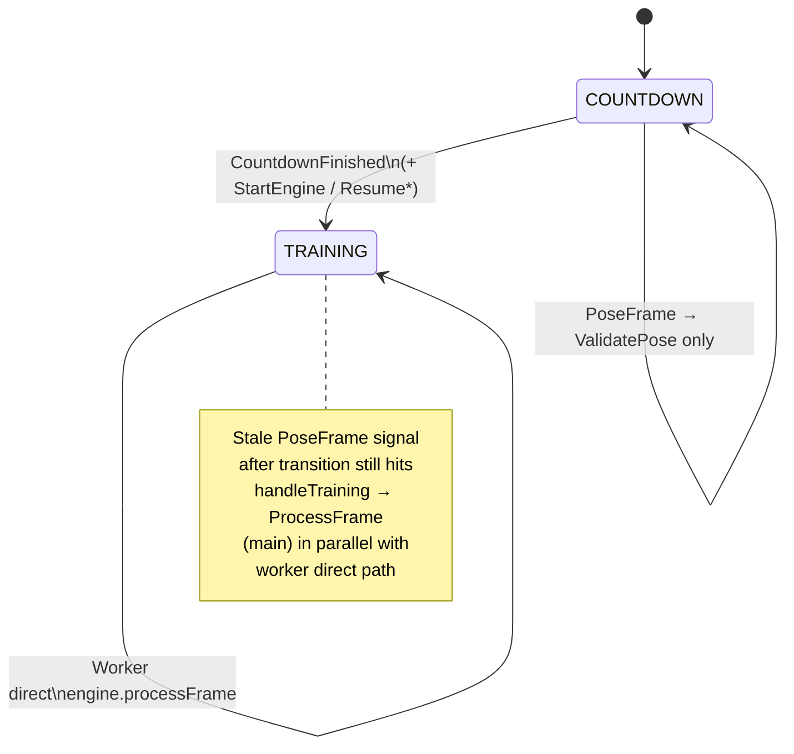
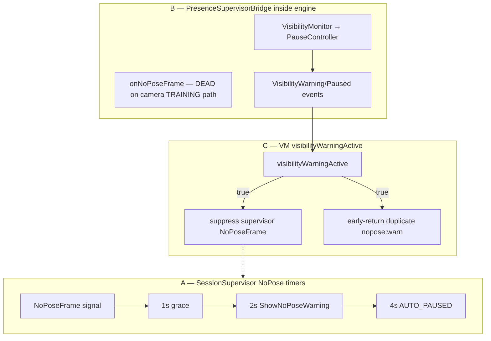

# Track C — Ingress, Threading & Concurrency

> **Scope**: Frame ingress into `MovitTrainingEngine`, dual-path `processFrame`, supervisor/worker threading, CONFLATED backpressure, Compose debug state writes, presence-layer interaction.
> **Mode**: READ-ONLY review (no source changes).
> **Date**: 2026-07-10
> **Note**: Brief §6 line numbers are stale vs current tree; all citations below use **verified current** `file:line`.

---

## 1. Executive summary

The highest-risk issue is **real**: at `COUNTDOWN`/`RESUME_COUNTDOWN` → `TRAINING`, the worker can read a pre-transition run state, then call `supervisor.processSignal(PoseFrame)` **after** the supervisor has already moved to `TRAINING`, which emits `SupervisorAction.ProcessFrame` onto **main** while subsequent frames call `engine.processFrame` on **`Dispatchers.Default`**. `FrameIngressGate` is a plain non-volatile `Boolean` and cannot serialize that overlap. Steady-state TRAINING intentionally bypasses the supervisor (direct worker path + `onTrainingPoseFrameProcessed`), so the dual path is a **transition race**, not continuous dual feeding — still enough to corrupt unsynchronized engine `var` state.

Secondary verdicts: **PF-06 CONFIRMED** (conflation never measured), **PF-08 CONFIRMED** (debug-only Compose write off main), **PF-16 CONFIRMED** as architecture/duplication (runtime dual NoPose *warning* on the live camera path is largely prevented because engine NoPose is never fed). Elapsed time freezes when frames stop and can **jump** after lens switch because `lastTrainingTimestampMs` is not cleared on switch.

---

## 2. Diagrams

### 2.1 C1 — Race window at COUNTDOWN → TRAINING

```mermaid
sequenceDiagram
    autonumber
    participant CD as CountdownController<br/>(viewModelScope / Main)
    participant Sup as SessionSupervisor
    participant Act as actions SharedFlow
    participant Main as handleSupervisorAction<br/>(Main)
    participant W as poseFrameWorker<br/>(Dispatchers.Default)
    participant Eng as MovitTrainingEngine

    Note over CD,Eng: State = COUNTDOWN; engine.isRunning = false

    CD->>Sup: CountdownFinished
    Sup->>Sup: transitionTo(TRAINING)
    Sup->>Act: StartEngine
    Act->>Main: StartEngine
    Main->>Eng: start() → isRunning=true

    Note over W: Frame N already past<br/>val runState = COUNTDOWN (stale)

    W->>Sup: PoseFrame (non-TRAINING branch)
    Note over Sup: current state is now TRAINING
    Sup->>Act: ProcessFrame(N)
    Act->>Main: ProcessFrame
    Main->>Eng: processFrame(N) on Main

    W->>W: Frame N+1: runState == TRAINING
    W->>Eng: processFrame(N+1) on Default

    Note over Eng: OVERLAP: Main + Default both inside<br/>processPoseFrame; FrameIngressGate<br/>is plain Boolean — no atomic/visibility
```



### 2.2 C6 — Presence layers when user leaves frame during TRAINING

```mermaid
sequenceDiagram
    autonumber
    participant Cam as Camera / MediaPipe
    participant W as poseFrameWorker
    participant Sup as SessionSupervisor<br/>(layer A)
    participant Eng as MovitTrainingEngine
    participant Bridge as PresenceSupervisorBridge<br/>(layer B)
    participant VM as VM flags / UI<br/>(layer C)

    alt Sudden no-pose (landmarks == null)
        Cam->>W: PoseFrame? / !hasPose
        W->>W: clear landmarks; skip engine
        alt visibilityWarningActive == false
            W->>Sup: NoPoseFrame(ts)
            Note over Sup: 1s grace → 2s ShowNoPoseWarning<br/>→ 4s AUTO_PAUSED + PauseEngine
            Sup-->>VM: ShowNoPoseWarning / ShowAutoPaused
        else visibilityWarningActive == true
            Note over W,Sup: NoPoseFrame SUPPRESSED (VM:447)
        end
        Note over Bridge: onNoPoseFrame NEVER called<br/>(engine not entered)
    else Pose present but joints invisible
        Cam->>W: hasPose frame
        W->>Eng: processFrame (TRAINING direct)
        Eng->>Bridge: mapVisibilityCheck / PauseController
        Bridge-->>VM: VisibilityWarning / VisibilityPaused
        VM->>VM: visibilityWarningActive = true
        Note over VM,Sup: Subsequent NoPoseFrame gated off
    end
```



---

## 3. Answers C1–C8

### C1 — Dual path to `engine.processFrame` (highest risk)

**Verdict: race window EXISTS and is triggerable.**

| Path | When | Thread | Evidence |
|---|---|---|---|
| **Direct** | `supervisor.state == TRAINING` | `Dispatchers.Default` (`poseFrameWorker`) | `TrainingSessionViewModel.kt:434-438`, `:458-466` → `engine?.processFrame(frame)` |
| **Supervisor** | `handleTraining` receives `PoseFrame` → `SupervisorAction.ProcessFrame` | `viewModelScope` default = **Main** | `SessionSupervisor.kt:334-343`; collected at `TrainingSessionViewModel.kt:707`; executed `:982-994` |

Steady-state TRAINING does **not** send `PoseFrame` to the supervisor; it calls `onTrainingPoseFrameProcessed()` instead (`:460`, `SessionSupervisor.kt:154-156`). That matches the intentional bypass comment.

**Concrete trigger (COUNTDOWN → TRAINING):**

1. Worker begins `processPoseFrameOnWorker`, reads `runState = COUNTDOWN` (`:458`).
2. Concurrently, `CountdownController.onFinish` on Main → `SupervisorSignal.CountdownFinished` (`:736-737`) → `transitionTo(TRAINING)` + `StartEngine` (`SessionSupervisor.kt:259-267`).
3. Worker still takes the non-TRAINING branch and calls `processSignal(PoseFrame)` (`:471-478`).
4. Supervisor is now `TRAINING` → emits `ProcessFrame` (`SessionSupervisor.kt:334-343`).
5. Main runs `engine.processFrame` (`:987-994`) while the next conflated frame on the worker hits the direct path (`:463`).

`FrameIngressGate` (`FrameIngressGate.kt:9-21`) uses a non-atomic, non-volatile `Boolean`. Concurrent `tryAcquire` from Main + Default can both observe `processing == false`. Engine fields (`isRunning`, phase machine, counters, etc. in `MovitTrainingEngine.kt:400+`) are ordinary `var`s with no lock.

Same pattern applies to `RESUME_COUNTDOWN` → `TRAINING` (`SessionSupervisor.kt:460-465`).

**Related:** `SessionSupervisor.processSignal` itself is also called from worker and Main without synchronization (countdown finish, UI pause, presence → supervisor signals).

→ Finding **[C-01]**, **[C-02]**; **PF-07 = CONFIRMED**.

---

### C2 — When does Supervisor emit `ProcessFrame`? Is engine running?

| Supervisor state | `PoseFrame` handling | Emits `ProcessFrame`? | Engine typically `isRunning`? |
|---|---|---|---|
| `IDLE` | ignored | No | No |
| `SETUP_POSE` | `ValidatePose` (`:222-225`) | No | No |
| `COUNTDOWN` | `ValidatePose` (`:271-272`) | No | No (StartEngine only on `CountdownFinished`) |
| `TRAINING` | `ProcessFrame` (`:334-343`) | **Yes** | Yes (after `StartEngine` / resume) |
| `PAUSED` | ignored | No | Paused |
| `AUTO_PAUSED` | resume setup / video resume — **no** `ProcessFrame` (`:400-409`) | No | Paused |
| `RESUME_SETUP` | `ValidatePose` (`:437-438`) | No | No |
| `RESUME_COUNTDOWN` | `ValidatePose` (`:468-469`) | No | No until finish |
| `COMPLETED` | ignored | No | Stopped |

`handleSupervisorAction(ValidatePose)` is a no-op (`TrainingSessionViewModel.kt:996`).

**Correction to brief wording:** setup/countdown do **not** emit `ProcessFrame`; they emit `ValidatePose`. `ProcessFrame` is only emitted while state is already `TRAINING`. In the live camera design that happens mainly via the **C1 TOCTOU race** (or any other caller sending `PoseFrame` during `TRAINING`). If `ProcessFrame` arrived while `!isRunning`, `MovitTrainingEngine.processFrame` returns immediately (`:578`) — wasted Main work, no mutation.

→ Finding **[C-03]** (documentation/design clarity; not a user bug by itself).

---

### C3 — CONFLATED channel and NoPose frames

```173:173:kmp-app/feature/training/src/commonMain/kotlin/com/movit/feature/training/TrainingSessionViewModel.kt
  private val poseFrameChannel = Channel<PoseFrame?>(capacity = Channel.CONFLATED)
```

```426:429:kmp-app/feature/training/src/commonMain/kotlin/com/movit/feature/training/TrainingSessionViewModel.kt
  fun onPoseFrame(frame: PoseFrame?) {
    if (!_state.value.requiresCamera()) return
    TrainingPipelineDiagnostics.recordVmIngress(wasConflated = false)
    poseFrameChannel.trySend(frame)
```

- Pose and `null` / no-pose share one CONFLATED slot; the newest value wins; older values are dropped silently.
- NoPose advancement depends on the worker observing `frame == null || !frame.hasPose` (`:445-452`). If a late pose overwrites a pending null before the worker drains, the NoPose timer does not advance for that gap.
- Sustained nulls still progress the timer (each processed null calls `NoPoseFrame`), so total loss-of-pose is not permanently stuck — but **warning latency can stretch** under mixed pose/null bursts.

Silent drop is acceptable for TRAINING angle throughput; it is **weaker** for presence timers that need consecutive absence samples.

→ Finding **[C-04]**; feeds PF-06 measurement gap.

---

### C4 — Cross-thread reads of `_state`

- `onPoseFrame` reads `_state.value.requiresCamera()` on the camera/callback thread (`:427`).
- Worker reads `_state.value.isCameraSwitching` (`:442`).
- `MutableStateFlow.value` reads are atomic/thread-safe; cost is negligible vs pose work.
- TOCTOU remains: a frame can be enqueued while camera is required, then processed after completion/rest (`requiresCamera` false) — worker does not re-check `requiresCamera()`.
- `isCameraSwitching` early-return correctly freezes processing during flip (`:442`, policy at `TrainingCameraSwitchPolicy.kt:5-11`).

**Verdict:** reads are safe; minor stale-enqueue TOCTOU; not P0/P1.

---

### C5 — Compose `frameCounter` from MediaPipe thread

```89:100:kmp-app/feature/training/src/androidMain/kotlin/com/movit/feature/training/TrainingSessionCameraHost.android.kt
        source.setFrameListener { frame ->
            if (onDebugFps != null && isTrainingDebugBuild()) {
                frameCounter++
                ...
            }
            onFrame(frame)
        }
```

- Writes `mutableIntStateOf` off the Compose applicator / Main thread → undefined Snapshot behavior (debug FPS only).
- Release: `isTrainingDebugBuild()` → `MovitGeneratedBuildConfig.DEBUG` (`TrainingDebugBuild.android.kt:5`); routes pass `onDebugFps = null` when not debug (`MovitTrainingRoutes.kt:205-208`). Both gates fail closed → **zero counter work in release**.

→ Finding **[C-05]**; **PF-08 = CONFIRMED** (P3, debug-only).

---

### C6 — Three presence layers (user leaves frame during TRAINING)

| Layer | Mechanism | Active on camera TRAINING leave? |
|---|---|---|
| **A** Supervisor NoPose | `NoPoseFrame` → 1s/2s/4s (`SessionSupervisor.kt:511-536`) | **Yes**, if `!visibilityWarningActive` |
| **B** `PresenceSupervisorBridge` | `onNoPoseFrame` inside `engine.processFrame` when `!hasPose` (`MovitTrainingEngine.kt:580-582`) | **No** — worker never calls engine on no-pose (`TrainingSessionViewModel.kt:445-453`) |
| **B′** Visibility via bridge | `mapVisibilityCheck` / `PauseController` while pose still detected | **Yes** for occlusion / partial leave |
| **C** `visibilityWarningActive` | Set on visibility warn/pause (`:1485`, `:1516`); clears on restore (`:1540`) | Gates A and duplicate warn handlers |

**Step-by-step — full exit (sudden null pose):**  
Camera delivers null → worker clears overlay → `NoPoseFrame` → supervisor grace/warn/pause → `PauseEngine` + `ShowAutoPaused(NO_POSE)`. Engine presence NoPose path idle.

**Step-by-step — walk-out with joints fading first:**  
Pose frames continue → engine visibility warn → `visibilityWarningActive=true` → vignette/feedback → later `VisibilityPaused` → supervisor `AUTO_PAUSED`. Further null frames do **not** feed supervisor NoPose (`:447`). Layers **coordinate via the flag**, not double-pause from NoPose+Visibility simultaneously in the common walk-out path.

**Collision residual:** two code paths submit identical `"nopose:warn"` copy (`:1024-1040` vs `:1519-1535`); same `dedupeKey`. On camera TRAINING, bridge NoPose warn is unreachable, so dual *emission* is unlikely; duplication remains a maintenance hazard.

→ Findings **[C-06]**, **[C-07]**; **PF-16 = CONFIRMED** (architecture/duplication).

---

### C7 — `ShowNoPoseWarning` vs `handlePresenceEvent(NoPoseWarning)`

Identical user-facing signal (`dedupeKey = "nopose:warn"`, same AR/EN strings):

- Supervisor action path: `TrainingSessionViewModel.kt:1024-1040` (setup/training supervisor timers; also gated by `visibilityWarningActive`).
- Presence event path: `:1519-1535` (engine bridge).

**Temporal mutual exclusion on live camera:**

| Phase | Supervisor NoPose warn | Engine `NoPoseWarning` |
|---|---|---|
| SETUP / COUNTDOWN | Setup uses `ShowSetupNoPoseHint`; countdown uses freeze — not this warn | Engine not processing frames |
| TRAINING no-pose | **Active** (layer A) | **Inactive** (engine not called) |
| TRAINING visibility | Suppressed when flag set | Visibility events, not NoPoseWarning |

So for camera TRAINING they are **not** both live; they are **copy-paste twins** for parallel architectures. Video/other callers that feed `processFrame(!hasPose)` could still hit the engine path.

→ Covered by **[C-06]** / PF-16.

---

### C8 — `updateSessionElapsed` correctness

```544:556:kmp-app/feature/training/src/commonMain/kotlin/com/movit/feature/training/TrainingSessionViewModel.kt
  private fun updateSessionElapsed(timestampMs: Long) {
    if (timestampMs > 0L) lastFrameTimestampMs = timestampMs
    ...
      if (lastTrainingTimestampMs > 0L) {
        activeElapsedMs += (timestampMs - lastTrainingTimestampMs).coerceAtLeast(0L)
      }
      lastTrainingTimestampMs = timestampMs
```

- Advances **only when pose frames are processed** in TRAINING (direct `:461` or ProcessFrame `:986`). Null/no-pose returns before elapsed update → **timer freezes** while user is out of frame or camera stalls.
- `lastTrainingTimestampMs = 0L` on Start/Pause/Resume/Stop/Reset engine actions (`:941-977`) prevents huge deltas across those boundaries.
- **Lens switch:** `onCameraSwitchStarted` sets `isCameraSwitching` (worker returns at `:442`) but does **not** clear `lastTrainingTimestampMs`. First pose frame after `onCameraReady` adds `(now - lastPreSwitchTs)` including the whole switch gap → **elapsed jump**.

→ Finding **[C-08]**; related **PF-21** (partial; rest timer is Track G).

---

## 4. Findings

### [C-01] Dual-thread `processFrame` race at countdown→training transition
- **Severity**: P1
- **Type**: Concurrency
- **Status**: CONFIRMED
- **Related-PF**: PF-07
- **Files**: `TrainingSessionViewModel.kt:458-478`, `:707`, `:982-994`; `SessionSupervisor.kt:259-267`, `:334-343`; `MovitTrainingEngine.kt:577-594`; `FrameIngressGate.kt:9-25`
- **Evidence**: Worker snapshots `runState` then may `processSignal(PoseFrame)` after `CountdownFinished` has set `TRAINING`, emitting `ProcessFrame` on Main while the next frame uses direct `engine?.processFrame` on `Dispatchers.Default`. Trigger: any countdown completion while pose frames continue (~30 Hz). Gate is non-atomic Boolean; engine state is unsynchronized `var`.
- **Impact**: Overlapping mutation of phase machine / rep counter / smoother / visibility state; plausible wrong rep or phase glitch at session start / resume; Main-thread hitch if `processPoseFrame` runs on UI thread.
- **Fix-sketch**: Single ingress thread for all `processFrame` calls; or re-read state immediately before supervisor signal and never emit `ProcessFrame` from VM path; delete supervisor `ProcessFrame` if bypass is permanent; make gate atomic + confine engine to one dispatcher.
- **Effort**: M
- **Verified-by**: pending

### [C-02] `FrameIngressGate` non-atomic / no memory visibility
- **Severity**: P1
- **Type**: Concurrency
- **Status**: CONFIRMED
- **Related-PF**: PF-07
- **Files**: `FrameIngressGate.kt:8-25`; `MovitTrainingEngine.kt:586-594`; `FrameIngressGateTest.kt:10-17` (single-threaded only)
- **Evidence**: `private var processing: Boolean = false` with check-then-set in `tryAcquire` and clear in `release`. Comment claims “at most one processFrame”; false under two threads. Unit test never exercises cross-thread acquire.
- **Impact**: Gate fails open under C-01 overlap; droppedFrameCount under-counts true races.
- **Fix-sketch**: `AtomicBoolean.compareAndSet` (or Mutex) + document single-thread contract enforced at call site.
- **Effort**: S
- **Verified-by**: pending

### [C-03] `ProcessFrame` action is TRAINING-only; setup uses dead `ValidatePose` handler
- **Severity**: P3
- **Type**: Architecture
- **Status**: CONFIRMED
- **Related-PF**: PF-07
- **Files**: `SessionSupervisor.kt:222-225`, `:271-272`, `:334-343`; `SupervisorAction.kt:38-47`; `TrainingSessionViewModel.kt:996`
- **Evidence**: Brief implied setup/countdown may emit `ProcessFrame`; code emits `ValidatePose` instead, and VM handles `ValidatePose` as `Unit`. Live pose validation is entirely `SetupReadinessGate` in the worker (`:479-525`).
- **Impact**: Misleading mental model; `ProcessFrame` looks like a second hot path but is only the race/legacy TRAINING signal path. No direct user bug.
- **Fix-sketch**: Remove unused `ValidatePose` action or wire it; document that TRAINING frames must not go through supervisor; delete `ProcessFrame` if unused after fixing C-01.
- **Effort**: S
- **Verified-by**: pending

### [C-04] CONFLATED ingress can delay NoPose detection
- **Severity**: P2
- **Type**: Correctness
- **Status**: CONFIRMED
- **Related-PF**: PF-06
- **Files**: `TrainingSessionViewModel.kt:173`, `:426-429`, `:445-452`; `SessionSupervisor.kt:511-536`
- **Evidence**: Single CONFLATED `Channel<PoseFrame?>`; null and pose compete for one slot. NoPose timer only moves when worker observes absence. Intermittent pose can overwrite pending nulls and stretch 2s/4s thresholds.
- **Impact**: “Step into frame” / auto-pause can lag under flaky detection; usually seconds-scale, not silent forever.
- **Fix-sketch**: Separate presence channel (UNLIMITED/rendezvous with latest absence flag) or sticky `lastAbsenceMs` updated in `onPoseFrame` before conflation.
- **Effort**: M
- **Verified-by**: pending

### [C-05] Debug Compose state written from MediaPipe callback thread
- **Severity**: P3
- **Type**: Concurrency
- **Status**: CONFIRMED
- **Related-PF**: PF-08
- **Files**: `TrainingSessionCameraHost.android.kt:80-99`; `TrainingDebugBuild.android.kt:5`; `MovitTrainingRoutes.kt:205-208`
- **Evidence**: `frameCounter++` on `mutableIntStateOf` inside `setFrameListener` when debug FPS enabled. Release builds: DEBUG false and `onDebugFps == null` → no writes.
- **Impact**: Possible debug-only Snapshot/thread assertions or torn FPS readout; no release hot-path cost.
- **Fix-sketch**: Post counter to Main (`withContext` / `Handler`) or use atomics + poll from composition.
- **Effort**: S
- **Verified-by**: pending

### [C-06] Parallel presence stacks + duplicated NoPose warning handlers
- **Severity**: P2
- **Type**: Architecture
- **Status**: CONFIRMED
- **Related-PF**: PF-16
- **Files**: `SessionSupervisor.kt:39-42`, `:511-536`; `PresenceSupervisorBridge.kt:63-103`; `MovitTrainingEngine.kt:580-582`, `:638`; `TrainingSessionViewModel.kt:445-452`, `:1024-1040`, `:1481-1546`
- **Evidence**: Three mechanisms (supervisor timers, engine bridge, VM flag). Identical `nopose:warn` FeedbackSignal in two handlers. Camera TRAINING no-pose never enters engine, so bridge NoPose is dead there; visibility path sets `visibilityWarningActive` which suppresses supervisor NoPoseFrame.
- **Impact**: Harder reasoning, dead code paths, risk of future double-warn if someone routes no-pose into the engine; walk-out UX mostly coherent via the flag.
- **Fix-sketch**: Single presence owner (engine *or* supervisor); delete duplicate handler; keep one threshold source (`PresenceThresholds` / `TimingPolicy`).
- **Effort**: M
- **Verified-by**: pending

### [C-07] Engine `PresenceSupervisorBridge.onNoPoseFrame` unreachable on camera TRAINING path
- **Severity**: P2
- **Type**: Dead-code
- **Status**: CONFIRMED
- **Related-PF**: PF-16
- **Files**: `TrainingSessionViewModel.kt:445-453`, `:458-466`; `MovitTrainingEngine.kt:580-582`; `PresenceSupervisorBridge.kt:85-103`; `PresenceSupervisorBridge.kt:53-57` (`NoPosePaused` → `SupervisorSignal.NoPoseFrame` with **elapsed** as `timestampMs`)
- **Evidence**: Worker returns before `engine.processFrame` when `!hasPose`. Bridge NoPose warn/pause only run inside engine. Mapping passes `elapsedMs` as `timestampMs` for `NoPoseFrame` — would skew `effectivePresenceNow` if ever wired.
- **Impact**: Dual NoPose policy is illusory on the product camera path; tests of bridge NoPose do not reflect production ingress.
- **Fix-sketch**: Either feed no-pose into engine and delete supervisor timers, or delete bridge NoPose API and keep supervisor-only.
- **Effort**: M
- **Verified-by**: pending

### [C-08] Elapsed freezes without frames; lens switch can jump elapsed
- **Severity**: P2
- **Type**: Correctness
- **Status**: CONFIRMED
- **Related-PF**: PF-21
- **Files**: `TrainingSessionViewModel.kt:442`, `:544-556`, `:586-588`, `:941-977`; `TrainingCameraSwitchPolicy.kt:5-11`
- **Evidence**: Elapsed only accumulates on processed pose timestamps. Camera stall / no-pose → freeze (may be intentional). Switch sets `isCameraSwitching` (drops frames) but does not zero `lastTrainingTimestampMs`; first post-switch pose adds full gap.
- **Impact**: Displayed session time can skip ~switch duration (often 0.5–2s+); freeze during hang misleads if wall-clock duration expected.
- **Fix-sketch**: On switch start (or ready), set `lastTrainingTimestampMs = 0L`; optionally use wall clock while TRAINING for UI elapsed.
- **Effort**: S
- **Verified-by**: pending

### [C-09] `recordVmIngress(wasConflated = false)` always — conflation metric dead
- **Severity**: P3
- **Type**: Performance
- **Status**: CONFIRMED
- **Related-PF**: PF-06
- **Files**: `TrainingSessionViewModel.kt:428-429`; `TrainingPipelineDiagnostics.kt:107-114`, `:202`
- **Evidence**: Literal `false` on every ingress; `trySend` result ignored. `vmConflated` stays 0; backlog derived from ingress/processed counters is misleading under CONFLATED overwrite.
- **Impact**: Debug/perf dashboards cannot see VM drops; may hide real backpressure (Track K).
- **Fix-sketch**: Track pending slot (e.g. atomic “buffered” flag) or use a custom drop counter around `trySend` / channel size probe before send.
- **Effort**: S
- **Verified-by**: pending

### [C-10] Unsynchronized `SessionSupervisor.processSignal` from Main + Default
- **Severity**: P1
- **Type**: Concurrency
- **Status**: CONFIRMED
- **Related-PF**: PF-07
- **Files**: `SessionSupervisor.kt:94-114`, `:69-84`; `TrainingSessionViewModel.kt:451`, `:471-478`, `:518-524`, `:600-602`, `:736-737`, `:1482`
- **Evidence**: Worker invokes `processSignal` for pose/no-pose/validation; Main invokes via countdown finish and UI pause/resume; presence handler may signal from whatever thread ran `processFrame`. Internal fields (`noPoseStartTime`, `countdownFrozen`, `_state`) are plain vars / StateFlow writes without a single-thread confine.
- **Impact**: Lost/double transitions at the same countdown boundary as C-01; corrupted NoPose timers.
- **Fix-sketch**: Confine supervisor to one dispatcher (channel of signals processed serially) or synchronize `processSignal`.
- **Effort**: M
- **Verified-by**: pending

---

## 5. PF verdict table

| PF | Claim | Verdict | Evidence / finding |
|---|---|---|---|
| **PF-06** | `recordVmIngress(wasConflated=false)` always; conflation/backlog misleading | **CONFIRMED** | `TrainingSessionViewModel.kt:428`; [C-09] |
| **PF-07** | Dual thread paths to `processFrame` + non-atomic gate → race on transitions | **CONFIRMED** | Concrete COUNTDOWN→TRAINING TOCTOU; [C-01][C-02][C-10] |
| **PF-08** | Compose `frameCounter` written from MediaPipe thread | **CONFIRMED** | Debug-only; release gated; [C-05] |
| **PF-16** | Three presence layers + duplicated NoPose signal text | **CONFIRMED** | Layers + duplicate handlers exist; runtime dual NoPose *warn* on camera TRAINING largely prevented; [C-06][C-07] |

**Adversarial notes**

- PF-07 is **not** “continuous dual feeding during TRAINING”; steady state is single-threaded worker. Severity remains P1 because the transition race + unsynchronized engine/supervisor state is realistic at every set start/resume.
- PF-16 “two warnings at once” as a user-visible double toast is **not** established for camera TRAINING no-pose; mark that sub-claim **REFUTED**, while the architectural finding stays **CONFIRMED**.

---

## 6. Draft — frame-flow verification notes (→ `01-frame-flow-verified.md`)

### 6.1 Threading table (Android, verified)

| Stage | Thread / dispatcher | Evidence | Notes |
|---|---|---|---|
| CameraX analyze + bitmap prep | `analysisExecutor` (single-thread) | Brief §2–3; Track A owns details | Upstream of VM |
| MediaPipe result → smoother → `frameListener` | MediaPipe callback thread | Host `setFrameListener` | Same thread as debug `frameCounter` |
| `onPoseFrame` / `trySend` | MediaPipe callback (via Host → event) | `TrainingSessionViewModel.kt:426-429` | Reads `requiresCamera()` |
| `processPoseFrameOnWorker` | `Dispatchers.Default` | `:434-438` | CONFLATED consumer |
| `engine.processFrame` (TRAINING steady) | `Dispatchers.Default` | `:463` | Primary hot path |
| `engine.processFrame` (`ProcessFrame` action) | **Main** (`viewModelScope`) | `:707`, `:982-994` | Transition / race path only |
| `SessionSupervisor.processSignal` | **Both** Main and Default | countdown `:736`; worker `:451`, `:471` | Unsynchronized |
| Supervisor `actions` collection | Main | `:707` | `StartEngine`, pauses, UI |
| Engine callbacks (`onPresenceEvent`, reps, …) | Caller of `processFrame` (Default or Main) | `MovitTrainingEngine` → VM lambdas | Then may re-enter supervisor |
| Countdown ticks / finish | Main (`countdown.start(viewModelScope)`) | `:997`, `CountdownController.kt:66` | Drives TRAINING entry |
| Compose UI collect | Main | Routes `collectAsStateWithLifecycle` | Track F |
| Debug FPS counter | MediaPipe callback | Host `:90-98` | Debug only |

### 6.2 Ingress / backpressure layers (VM + engine slice)

| # | Layer | Location | Behavior |
|---|---|---|---|
| 4 | `Channel.CONFLATED` | VM `:173`, `:429` | Keeps latest `PoseFrame?` only |
| 5 | `FrameIngressGate` | Engine `:586-594`, `FrameIngressGate.kt` | Intended single-flight; **not** cross-thread safe |

(Layers 1–3 remain Track A.)

### 6.3 Corrected dual-path note for §2 step [7]

Brief step [7] should read:

- **TRAINING:** worker → `engine.processFrame` on Default; supervisor only `onTrainingPoseFrameProcessed()` (reset NoPose timer).
- **Setup/countdown:** worker → `SupervisorSignal.PoseFrame` → usually `ValidatePose` (VM no-op) + local `SetupReadinessGate`; **not** `ProcessFrame`.
- **Exception:** if `PoseFrame` is signaled while supervisor state is already `TRAINING`, `ProcessFrame` runs on Main — the C1 race.

### 6.4 iOS parity stub (for aggregator)

Same VM/commonMain paths apply; Host differs (`TrainingSessionCameraHost.ios.kt`). `isTrainingDebugBuild()` is `false` on iOS → no debug FPS counter writes. Dual-path race is **commonMain** — affects both platforms.

---

## 7. Coverage list

### Read in depth
- `feature/training/.../TrainingSessionViewModel.kt` — ingress worker `:426-529`, elapsed `:544-556`, `wireSupervisor` `:706-727`, `handleSupervisorAction` `:938-1059`, presence `:1481-1546`, `onCleared` `:1834-1846`, `requiresCamera` `:1951-1955`
- `feature/training/.../TrainingSessionCameraHost.android.kt` — full
- `feature/training/.../TrainingCameraSwitchPolicy.kt` — full
- `feature/training/.../TrainingDebugBuild*.kt`, `MovitTrainingRoutes.kt` (debug FPS wiring)
- `core/training-engine/.../SessionSupervisor.kt` — full
- `core/training-engine/.../FrameIngressGate.kt` — full + `FrameIngressGateTest.kt`
- `core/training-engine/.../PresenceSupervisorBridge.kt` — full
- `core/training-engine/.../SupervisorAction.kt`, `SupervisorSignal.kt` — full
- `core/training-engine/.../PauseController.kt`, `PauseControllerEvent.kt` — full
- `core/training-engine/.../CountdownController.kt` — start/finish threading
- `core/training-engine/.../SessionRunState.kt` — full
- `core/training-engine/.../MovitTrainingEngine.kt` — `start/pause/resume/stop`, `processFrame` `:577-594`, presence emit `:839-840`
- `core/training-engine/.../TrainingPipelineDiagnostics.kt` — `recordVmIngress`

### Skimmed / out of Track C depth
- Full `processPoseFrame` body (Track D)
- iOS Host implementation beyond debug gate
- CameraX/MediaPipe internals (Track A)
- Rest timer loop (Track G / PF-21 remainder)
- FeedbackRouter dedupe implementation details

### Not executed
- Device race reproduction / instrumentation
- `./gradlew` test runs (read-only review; `FrameIngressGateTest` read as evidence of single-thread-only coverage)

---

## 8. Open questions for aggregator

- **OQ-C1**: Is supervisor `ProcessFrame` retained for video mode only? If yes, camera path should hard-disable it.
- **OQ-C2**: Should UI elapsed be pose-time (current) or wall-clock while `TRAINING`?
- **OQ-C3**: Single ownership for NoPose — product intent for supervisor vs engine bridge?
