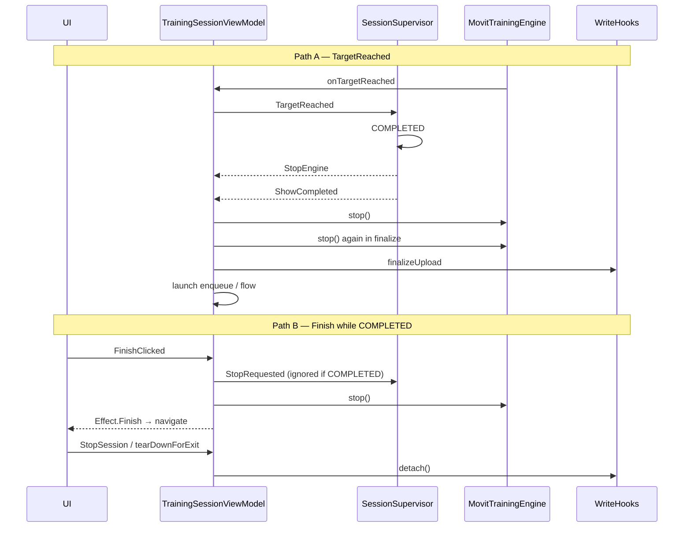
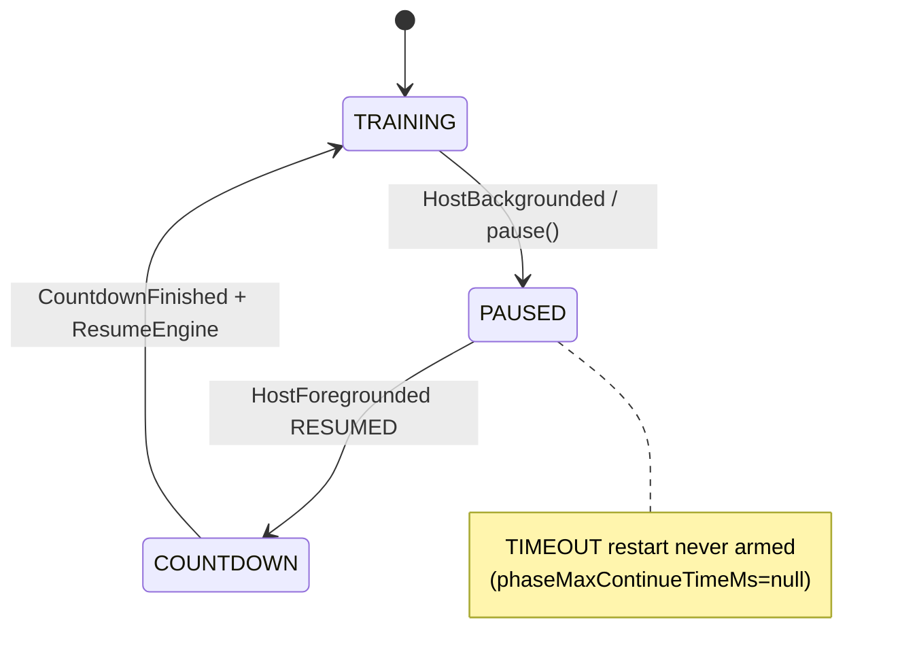

# Track G — Session Lifecycle & Multi-exercise Flow

> **Scope**: `TrainingSessionViewModel` lifecycle/stop/flow paths, `SessionSupervisor`, `TrainingSessionFlowCoordinator`, countdown/setup/pause gates, lifecycle & write policies.  
> **Mode**: READ ONLY. Line numbers are from the tree at review time (brief §6 line refs are stale; evidence uses current lines).  
> **Verified-by**: pending (all P0/P1 findings require adversarial re-check).

---

## Executive summary

Three stop APIs exist; production completion is almost entirely `StopRequested`/`TargetReached` → `StopEngine` + `ShowCompleted` → `finalizeCurrentExercise`. `stopAndFinalize()` has **no callers**. Double `engine.stop()` is real but duration stays non-zero. Higher-impact issues: (1) `isComplete` flips on supervisor `COMPLETED` **before** finalize/upload, so Finish→dispose can `detach()` the journal first; (2) `rebuildEngineIfNeeded` runs on any non-`TRAINING` state, including PAUSED/COUNTDOWN, orphaning the motion journal; (3) background timeout restart is wired but never armed (`phaseMaxContinueTimeMs` always null).

---

## G1 — Three stop paths (call graphs)

### Path A — Target reached / explicit `StopRequested` → finalize (primary)

```
engine.onTargetReached
  → supervisor.processSignal(TargetReached)          SessionSupervisor.kt:357-360
  → transition COMPLETED
  → emit StopEngine
  → emit ShowCompleted
       ↓ (SharedFlow → viewModelScope)
  handleSupervisorAction(StopEngine)                 TrainingSessionViewModel.kt:970-972
    → engine?.stop()
  handleSupervisorAction(ShowCompleted)              :1055-1056
    → finalizeCurrentExercise()                      :1062-1119
         → engine?.stop()                            :1064  (2nd/3rd stop)
         → writeHooks.finalizeUpload(...)            :1065
         → launch { awaitPendingCaptures; enqueue; flow advance }
```

Same pair (`StopEngine` + `ShowCompleted`) from:

| Trigger | Entry | Evidence |
|---|---|---|
| Target reps | `onTargetReached` | ViewModel.kt:806-808 → Supervisor.kt:357-360 |
| `TrainingSessionEvent.Stop` | `stop()` | ViewModel.kt:215,602 → Supervisor.kt:166-172 |
| `stopSession()` / Finish | `StopRequested` then sync `engine?.stop()` | ViewModel.kt:222-224,304-307 |
| Phase restart (bg timeout) | `StopRequested` then `supervisor.reset()` | ViewModel.kt:631-632 — **does not** wait for ShowCompleted; reset clears COMPLETED |

`TrainingSessionEvent.Stop` is wired in `MovitTrainingRoutes.kt:172` but **`onStop` is never invoked from `TrainingSessionScreen`** (parameter declared :66, no call sites in the composable body) — dead UI hook.

### Path B — `stopSession()` (Finish button when `isComplete`)

```
FinishClicked                                         ViewModel.kt:222-224
  → stopSession()                                     :304-307
       → StopRequested (no-op if already COMPLETED)   Supervisor.kt:167
       → return engine?.stop()?.durationMs
  → emit TrainingSessionEffect.Finish
       → onFinish(nav)                                MovitTrainingRoutes.kt:139
  → later DisposableEffect onDispose
       → StopSession → tearDownForExit                Routes.kt:152-153, ViewModel.kt:197-206,357-373
```

Finish UI only when `state.isComplete` (`TrainingSessionScreen.kt:644-663`). `isComplete` is also set from supervisor state when `runState == COMPLETED` (`ViewModel.kt:718-722`) — **before** `ShowCompleted` / upload.

### Path C — Quiet exit (back / save / end) — **no** finalize

```
Back (no confirm) / ExitSaveAndExit / ExitEndWorkout / StopSession(dispose)
  → tearDownForExit(persist, abandon)                 ViewModel.kt:357-373
       → deliberately avoids stopSession              comment :353-355
       → writeHooks.detach(); engine?.stop(); supervisor.reset()
  → NavigateBack / ExitWorkoutJourney
```

`onCleared` (`:1834-1846`) does **not** call `engine.stop()` or `finalize*` — relies on prior `tearDownForExit` / dispose.

### Path D — `stopAndFinalize()` (orphan API)

```
stopAndFinalize()                                     ViewModel.kt:657-668
  → engine?.stop(); finalizeUpload; async cache/enqueue; detach
```

**No production or test callers** in repo (only definition + brief mention).

### Double `engine.stop()` — verdict

**CONFIRMED** on Path A: `StopEngine` stops, then `finalizeCurrentExercise` stops again; `stopSession` may add a third sync stop.

`MovitTrainingEngine.stop()` (`MovitTrainingEngine.kt:547-559`) sets `isRunning=false` and always builds a summary from `session.stop()` → `ExecutionClock.finalizeDurationMs()` (`ExecutionClock.kt:80-89`), which **does not reset** the clock. Second stop returns a similar non-zero duration — **not** a zero-duration summary.

`finalizeUpload` runs once per `ShowCompleted` (not from `StopEngine`). Duplicate upload from double-stop alone: **REFUTED**. Upload loss from Finish/dispose racing finalize: see [G-01].



---

## G2 — `reloadForNextFlowItem` between exercises

Evidence: `TrainingSessionViewModel.kt:1329-1363`.

| Step | Behavior |
|---|---|
| Replace engine | `engine?.stop()` then `engine = buildEngine()` + `wireEngineCallbacks()` |
| Write hooks | `detach()` then `createWriteHooks()` — old journal cleared |
| Frame capture | new `TrainingFrameCaptureCoordinator` |
| Feedback | `feedback.resetAll()` + `feedbackEventRouter.reset()`; `previousHoldState = null` |
| Elapsed | `sessionStartMs` / `activeElapsedMs` / `lastTrainingTimestampMs` zeroed |

**Not reset**:

- `visibilityWarningActive`, `visibilityPauseCount`, `cameraWarningCount` (`:165-167`, used in `resolveSessionQualityMeta` `:1232-1236`)
- `lastRandomMessageCheckMs` (`:168`, `:1551-1552`)

**Callbacks after replace**: old engine is stopped (`isRunning=false` → `processFrame` no-op). Orphan engine may still hold VM lambdas until GC; no further frames should invoke them. Practical leak of “old hooks firing after replace”: **low / effectively REFUTED** for the hot path. Journal re-attach happens on next `StartEngine` (`:940-956`).

**Quality counters**: accumulate across sets/exercises into each exercise’s post-training `SessionQualityMeta` — likely unintentional inflation for later items ([G-04]).

---

## G3 — `wirePreferences` / `rebuildEngineIfNeeded`

```684:693:kmp-app/feature/training/src/commonMain/kotlin/com/movit/feature/training/TrainingSessionViewModel.kt
  private fun wirePreferences() {
    trainingPreferences.state
      .onEach { prefs ->
        ...
        rebuildEngineIfNeeded()
      }
      .launchIn(viewModelScope)
  }
```

```1655:1659:kmp-app/feature/training/src/commonMain/kotlin/com/movit/feature/training/TrainingSessionViewModel.kt
  private fun rebuildEngineIfNeeded() {
    if (supervisor.state.value.isTrainingActive()) return
    engine?.stop()
    engine = buildEngine()
    wireEngineCallbacks()
  }
```

`isTrainingActive()` ≡ `this == TRAINING` only (`SessionRunState.kt:46`).

| Scenario | Rebuild? | Effect |
|---|---|---|
| Init: `buildEngine()` then first prefs emission | **Yes** | Redundant rebuild (PF-20) |
| SETUP / IDLE | Yes | Harmless (engine not started) |
| COUNTDOWN (fresh) | Yes | OK if not yet `start()` |
| PAUSED / AUTO_PAUSED / RESUME_* / COUNTDOWN after reps | **Yes** | Stops engine, **new** instance `isRunning=false`; `writeHooks` still attached to **old** engine (`TrainingMotionSession.attach`); resume actions call `resume()` not `start()` → frames ignored; journal orphaned ([G-02]) |
| TRAINING | No | Intensity change deferred until leave TRAINING |

Settings dialog can change coach intensity mid-session (`MovitTrainingRoutes.kt:184-187`, settings available on live screen).

---

## G4 — Background / foreground traces

Wiring: `ON_STOP` → `HostBackgrounded`, `ON_START` → `HostForegrounded` (`MovitTrainingRoutes.kt:159-160`).

Policy: `TrainingSessionLifecyclePolicy.kt:23-56`. VM always calls `onHostPaused(wasTraining, nowMs)` **without** `phaseMaxContinueTimeMs` / `phaseCanContinue` overrides (`ViewModel.kt:607-610`) → defaults `phaseCanContinue=true`, `phaseMaxContinueTimeMs=null`.

### Scenario 1 — Training → background 5s → foreground

```
ON_STOP
  → onHostBackgrounded
       → phasePauseSnapshot (wasTraining=true)
       → pause() → PauseRequested → PAUSED + PauseEngine
       → lastTrainingTimestampMs = 0                      :958-960
       → persistOpenRunProgress if progress
  (CameraX lifecycle stops frames; activeElapsedMs frozen — no frame deltas)
ON_START (~5s later)
  → onHostForegrounded
       → onHostResumed → RESUMED (maxMs null → never TIMEOUT)
       → resume() → ResumeRequested
       → handlePaused: isResumeCountdown=true, COUNTDOWN, StartCountdown
       → CountdownFinished → ResumeEngine (preserve path via isResumeCountdown)
```

### Scenario 2 — Training → background 2 min → foreground

**Same as 5s.** `PHASE_RESTARTED_TIMEOUT` is tested when `phaseMaxContinueTimeMs` is set (`TrainingSessionLifecyclePolicyTest`), but production never sets it. Comment in policy (`:5-7`) admits item metadata “not yet mapped”.

Restart branch (`ViewModel.kt:628-650`) exists but is **dead in production**.

### Other notes

- Supervisor `ActivityPaused` / `ActivityResumed` (`SessionSupervisor.kt:183-196`) are **never** signaled from the VM (host uses PauseRequested instead).
- `activeElapsedMs` survives pause; only `ResetEngine` zeroes it (`:974-980`).



---

## G5 — Rest timer

`startRestTimer` (`ViewModel.kt:1379-1396`): `delay(1_000L)` loop, `tickRest(1_000L)`, `syncFlowUi`, optional near-end announce.

| Concern | Verdict |
|---|---|
| Cumulative drift | Each loop = 1000ms delay + work → slight lag vs wall clock. Acceptable; P3 |
| Cancel on skip | `skipRest` cancels job + clears `restNearEndAnnounced` (`:285-290`) |
| Cancel on clear | `onCleared` / `tearDownForExit` cancel `restTimerJob` |
| `restNearEndAnnounced` | Reset at each `startRestTimer`; skipRest clears; not left sticky across rests |

---

## G6 — `onCleared` vs live resources

```1834:1846:kmp-app/feature/training/src/commonMain/kotlin/com/movit/feature/training/TrainingSessionViewModel.kt
  override fun onCleared() {
    restTimerJob?.cancel()
    poseFrameChannel.close()
    poseFrameWorker?.cancel()
    TrainingPipelineDiagnostics.reset()
    writeHooks.detach()
    countdown.release()
    resetSetupVoiceState()
    readinessGate.reset()
    supervisor.reset()
    feedback.release()
    super.onCleared()
  }
```

| Resource | onCleared | Notes |
|---|---|---|
| restTimerJob | cancel | OK |
| poseFrameWorker / channel | cancel / close | OK |
| countdown / readiness / voice / supervisor / feedback | release/reset | OK |
| writeHooks | detach | OK |
| **engine.stop()** | **missing** | Intended if `tearDownForExit` / `StopSession` already ran (`Routes` dispose). If VM cleared without that path, engine left running until GC |
| **awaitPendingCaptures** | **missing** | Only in `finalizeCurrentExercise` launch; cancelled with `viewModelScope` on clear |
| frameCaptureCoordinator jobs | not explicitly joined | Pending JPEGs may be dropped on abrupt exit |

---

## G7 — `SessionSupervisor` state machine

States (`SessionRunState.kt`): IDLE → SETUP_POSE → COUNTDOWN → TRAINING → COMPLETED; TRAINING ↔ PAUSED / AUTO_PAUSED → RESUME_SETUP → RESUME_COUNTDOWN → TRAINING.

| Topic | Finding |
|---|---|
| Dead / unused signals (camera app) | `ActivityPaused`/`ActivityResumed` never sent; `PauseVideo`/`ResumeVideo`/`ShowSetupPose`/`ValidatePose` emitted but VM no-ops (`ValidatePose -> Unit`, else branch) |
| `ProcessFrame` | Emitted from `handleTraining` on `PoseFrame` (`Supervisor.kt:334-343`); live camera VM **bypasses** supervisor in TRAINING (`ViewModel.kt:459-466`). Residual risk at COUNTDOWN→TRAINING edge (Track C / PF-07) |
| `droppedActionCount` | `MutableSharedFlow(extraBufferCapacity=64)`, `tryEmit` else increment (`Supervisor.kt:50-54,560-563`). Setup emits `ValidatePose` every pose frame — can fill buffer if collector stalls; dropping `StartCountdown`/`ShowCompleted` would be severe. **NEEDS-DATA** for observed drops |
| `RESUME_SETUP` | Alive (auto-pause recovery) |
| `handleCompleted` | Ignores all signals — OK |

---

## Findings

### [G-01] Finish can navigate/detach before finalize upload completes
- **Severity**: P1
- **Type**: Correctness
- **Status**: CONFIRMED
- **Related-PF**: —
- **Files**: `TrainingSessionViewModel.kt:718-722`, `:1055-1076`, `:222-224`, `:357-373`; `MovitTrainingRoutes.kt:139,152-153`; `TrainingSessionScreen.kt:644-663`
- **Evidence**: Supervisor transition to `COMPLETED` sets `isComplete=true` via `supervisor.state` collector before `ShowCompleted` runs `finalizeCurrentExercise`. Finish button appears; `FinishClicked` emits nav; dispose runs `tearDownForExit` → `writeHooks.detach()` (`motionSession=null`). If that wins the race, `finalizeUpload` returns null and enqueue is skipped. Even when finalize’s sync upload snapshot wins, `viewModelScope.launch` body (`awaitPendingCaptures` + `enqueueUpload`) is cancelled on `onCleared`.
- **Impact**: Realistic fast Finish after target-reached can drop the last exercise upload / report cache.
- **Fix-sketch**: Gate Finish until finalize ack; or finalize synchronously before `isComplete`; or use a scope that outlives VM for upload; block `detach` until finalize done.
- **Effort**: M
- **Verified-by**: adversarial-grok-4.5-xhigh

### [G-02] Preference rebuild replaces engine outside TRAINING and orphans journal
- **Severity**: P1
- **Type**: Correctness
- **Status**: CONFIRMED
- **Related-PF**: PF-20
- **Files**: `TrainingSessionViewModel.kt:684-693,1655-1659`; `SessionRunState.kt:46`; `TrainingMotionSession.kt:51-68`; `MovitTrainingRoutes.kt:184-187`
- **Evidence**: `rebuildEngineIfNeeded` only skips `TRAINING`. Changing coach intensity while PAUSED/COUNTDOWN/RESUME_* calls `engine?.stop(); engine = buildEngine()` without `writeHooks.detach/attach`. Motion callbacks remain on the orphaned engine; `ResumeEngine` does not set `isRunning=true` on the new instance.
- **Impact**: Mid-session settings change after pause can silently stop counting/recording for the rest of the set.
- **Fix-sketch**: Skip rebuild unless IDLE/SETUP (or never-started); if rebuild after start, re-attach journal + `seedCompletedRepCount` + restore `isRunning`/pause.
- **Effort**: M
- **Verified-by**: adversarial-grok-4.5-xhigh

### [G-03] Immediate engine rebuild on first preferences emission
- **Severity**: P2
- **Type**: Performance
- **Status**: CONFIRMED
- **Related-PF**: PF-20
- **Files**: `TrainingSessionViewModel.kt:257-259,684-693,1655-1659`
- **Evidence**: `init` builds engine then `wirePreferences()`; StateFlow `onEach` fires initial value → `rebuildEngineIfNeeded()` while not TRAINING → stop + rebuild + rewire.
- **Impact**: Wasted CPU/alloc at session open; doubles construction cost.
- **Fix-sketch**: Skip first emission, or apply prefs before first `buildEngine()`, or compare `timingPolicy` equality before rebuild.
- **Effort**: S
- **Verified-by**: pending

### [G-04] Session quality counters not reset per exercise/set
- **Severity**: P2
- **Type**: Correctness
- **Status**: CONFIRMED
- **Related-PF**: —
- **Files**: `TrainingSessionViewModel.kt:165-167,1232-1236,1329-1363,1481-1517`
- **Evidence**: `reloadForNextFlowItem` resets feedback/elapsed/engine but not `visibilityPauseCount` / `cameraWarningCount` / `visibilityWarningActive`. Those feed `resolveSessionQualityMeta` per finalize.
- **Impact**: Later sets/exercises inherit inflated pause/warning counts in post-training quality meta.
- **Fix-sketch**: Reset per-exercise counters in `reloadForNextFlowItem` (keep workout-level totals separately if needed).
- **Effort**: S
- **Verified-by**: pending

### [G-05] Background phase-timeout restart never armed in production
- **Severity**: P2
- **Type**: Architecture
- **Status**: CONFIRMED
- **Related-PF**: —
- **Files**: `TrainingSessionLifecyclePolicy.kt:5-7,23-56`; `TrainingSessionViewModel.kt:605-655`
- **Evidence**: VM never passes `phaseMaxContinueTimeMs`; null → always `RESUMED`. 5s and 2min background behave identically (pause → resume countdown). Restart UI/message path is dead code in prod.
- **Impact**: Product expectation of “long background restarts the set” is unmet; policy tests don’t match production wiring.
- **Fix-sketch**: Map planned-item continue limits into `onHostPaused`, or document intentional “always resume” and delete dead restart branch.
- **Effort**: S (doc) / M (wire limits)
- **Verified-by**: pending

### [G-06] Triple stop on completion path; summary duration not zeroed
- **Severity**: P3
- **Type**: Architecture
- **Status**: CONFIRMED
- **Related-PF**: —
- **Files**: `SessionSupervisor.kt:166-172,357-360`; `TrainingSessionViewModel.kt:304-307,970-972,1062-1065`; `ExecutionClock.kt:80-89`
- **Evidence**: `StopEngine` + optional `stopSession` sync stop + `finalizeCurrentExercise` stop. Clock not reset → duration remains coherent; upload not duplicated by stop alone.
- **Impact**: Redundant work; discarded intermediate summaries; confusion for maintainers.
- **Fix-sketch**: Single owner of `stop()` — e.g. only finalize, or StopEngine returns summary via action payload.
- **Effort**: S
- **Verified-by**: pending

### [G-07] `stopAndFinalize()` has zero callers
- **Severity**: P3
- **Type**: Dead-code
- **Status**: CONFIRMED
- **Related-PF**: —
- **Files**: `TrainingSessionViewModel.kt:657-668`
- **Evidence**: Repo-wide search: definition only.
- **Impact**: Parallel stop API drifts from `finalizeCurrentExercise` (no flow advance, no `awaitPendingCaptures`).
- **Fix-sketch**: Delete or route assessment/debug through one finalize API.
- **Effort**: S
- **Verified-by**: pending

### [G-08] `onCleared` omits `engine.stop` and pending capture join
- **Severity**: P2
- **Type**: Memory
- **Status**: CONFIRMED
- **Related-PF**: —
- **Files**: `TrainingSessionViewModel.kt:1834-1846,1068-1071`; `TrainingFrameCaptureCoordinator.kt:154-156`
- **Evidence**: Cleanup list lacks `engine?.stop()` and `awaitPendingCaptures`. Normal route dispose calls `tearDownForExit` (stops engine) but does not await captures; abrupt clear cancels finalize’s await.
- **Impact**: Abrupt exit: possible running engine until GC; in-flight snapshots dropped; incomplete reports.
- **Fix-sketch**: Mirror tearDown stop in `onCleared`; flush captures on a non-cancelled scope before detach.
- **Effort**: S
- **Verified-by**: pending

### [G-09] Supervisor action buffer can drop under ValidatePose spam
- **Severity**: P2
- **Type**: Concurrency
- **Status**: NEEDS-DATA
- **Related-PF**: —
- **Files**: `SessionSupervisor.kt:50-54,222-225,560-563`; `TrainingSessionViewModel.kt:996,1058`
- **Evidence**: Every setup `PoseFrame` → `ValidatePose` via `tryEmit` into capacity 64. VM ignores `ValidatePose`. If main-thread collector stalls, `droppedActionCount` rises; critical actions sharing the same flow could drop.
- **Impact**: Theoretical missed `StartCountdown`/`ShowCompleted` under load; diagnostics already surface `droppedSupervisor`.
- **Fix-sketch**: Don’t emit no-op ValidatePose; use unlimited/conflated channel for UI no-ops; or drop ValidatePose before emit.
- **Effort**: S
- **Verified-by**: pending

### [G-10] Rest timer 1s delay loop drift
- **Severity**: P3
- **Type**: Performance
- **Status**: CONFIRMED
- **Related-PF**: PF-21
- **Files**: `TrainingSessionViewModel.kt:1379-1396`; `TrainingSessionFlowCoordinator.kt:118-126`
- **Evidence**: `delay(1000)` then `tickRest(1000)` — wall time per tick > 1000ms under load.
- **Impact**: Rest ends slightly late; usually imperceptible.
- **Fix-sketch**: Deadline-based remainingMs from wall clock each tick.
- **Effort**: S
- **Verified-by**: pending

### [G-11] Duplicate NoPose warning paths (overlap with Track C / PF-16)
- **Severity**: P2
- **Type**: Duplication
- **Status**: CONFIRMED
- **Related-PF**: PF-16
- **Files**: `TrainingSessionViewModel.kt:1024-1040,1519-1535`; `SessionSupervisor.kt:511-536`
- **Evidence**: Identical `training_session_auto_pause_nopose` / `dedupeKey = "nopose:warn"` in `ShowNoPoseWarning` (supervisor timers) and `PresenceSupervisorEvent.NoPoseWarning` (engine bridge). Both gated by `visibilityWarningActive`. Temporally mostly setup/training-split but same copy/keys — structural duplication; full collision analysis owned by Track C.
- **Impact**: Maintenance hazard; possible double UI update if both fire with gate false.
- **Fix-sketch**: Single NoPose presenter; supervisor OR presence owns warnings.
- **Effort**: M
- **Verified-by**: pending

---

## PF verdicts (Track G ownership)

| ID | Verdict | Notes | Finding |
|---|---|---|---|
| **PF-16** | **CONFIRMED** (overlap with C) | Duplicate NoPose signal text/dedupe in supervisor action handler vs presence handler. Full three-layer presence collision → Track C. | [G-11] |
| **PF-20** | **CONFIRMED** | (a) First prefs emission rebuilds engine after init. (b) Rebuild outside TRAINING orphans journal / breaks resume — stronger than brief’s “callback detach” suspicion. | [G-02], [G-03] |
| **PF-21** | **CONFIRMED** (G half) | Rest: `delay(1000)` loop drift. Elapsed: frame-delta based (`updateSessionElapsed`); freezes when frames stop (bg) — by design after `lastTrainingTimestampMs=0` on pause. Mixed clocks across rest vs training. | [G-10]; elapsed freeze OK |

---

## OQ (lifecycle-related)

| ID | Question | Track G note |
|---|---|---|
| **OQ-G1** (new) | Should long background (`phaseMaxContinueTimeMs`) restart the set, as policy + tests imply, or always resume? | Production never arms timeout; needs product decision. Related to brief OQ gap (not in OQ-01–07). |
| **OQ-05** | Detector/executor kept warm after camera `stop()` | Camera Track A; session VM tearDown stops **engine** but not pose-capture dispose. Cross-link only. |
| **OQ-01** | Fat UiState | Lifecycle touches many `_state.update`s on phase changes; not primary G defect. |

---

## Coverage checklist (G1–G7)

| Q | Covered | Result |
|---|---|---|
| G1 Three stop paths + double stop | Yes | Graphs above; double stop CONFIRMED, zero-duration REFUTED; upload race [G-01] |
| G2 reloadForNextFlowItem | Yes | Engine/hooks replaced; quality counters & random-msg clock not reset [G-04] |
| G3 wirePreferences / rebuild | Yes | Init rebuild + PAUSED rebuild hazard [G-02][G-03] |
| G4 bg/fg 5s & 2min | Yes | Identical RESUMED path; timeout dead [G-05] |
| G5 rest timer | Yes | Cancel OK; drift [G-10] |
| G6 onCleared | Yes | No engine.stop / no await captures [G-08]; depends on prior tearDown |
| G7 SessionSupervisor | Yes | Machine live; video/activity signals unused; drop buffer NEEDS-DATA [G-09] |

### Files read

- `feature/training/.../TrainingSessionViewModel.kt` (stop/lifecycle/flow/prefs/onCleared)
- `feature/training/.../TrainingSessionLifecyclePolicy.kt`
- `feature/training/.../TrainingCameraSwitchPolicy.kt`
- `feature/training/.../TrainingSessionPlannedWritePolicy.kt`
- `feature/training/.../MovitTrainingRoutes.kt` (lifecycle + dispose)
- `feature/training/.../TrainingSessionScreen.kt` (Finish / onStop unused)
- `feature/training/.../TrainingSessionWriteHooks.kt` / `TrainingFrameCaptureCoordinator.kt` (finalize/await)
- `core/training-engine/.../SessionSupervisor.kt`
- `core/training-engine/.../TrainingSessionFlowCoordinator.kt`
- `core/training-engine/.../CountdownController.kt`
- `core/training-engine/.../SetupReadinessGate.kt`
- `core/training-engine/.../SetupVoiceGuidanceGate.kt`
- `core/training-engine/.../PauseController.kt`
- `core/training-engine/.../SessionRunState.kt`, `SupervisorAction.kt`
- `core/training-engine/.../MovitTrainingEngine.kt` (stop/pause/start)
- `core/training-engine/.../ExecutionClock.kt`, `SessionOrchestrator.kt`
- `core/training-engine/.../TrainingMotionSession.kt`

### Not deeply re-validated here

- Full PresenceSupervisorBridge internals (Track C)
- Upload/report builders (Track H)
- iOS host lifecycle parity (assume same VM events)

---

## Planned-write / camera-switch policies (brief file list)

- `TrainingSessionPlannedWritePolicy`: documents single `/complete` endpoint; `shouldEnqueueLegacyReportAfterComplete() == false` — no lifecycle bug.
- `TrainingCameraSwitchPolicy`: sets `isCameraSwitching` + clears landmarks — worker skips frames while switching (`ViewModel.kt:442`); orthogonal to stop paths.
