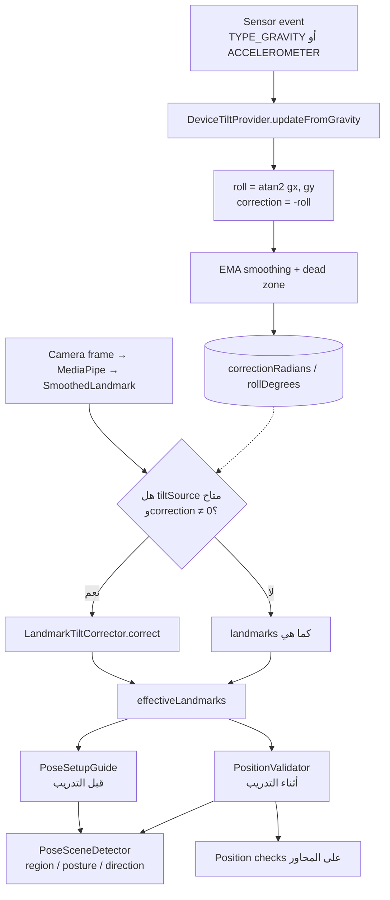

# تصحيح ميلان الجهاز أثناء التدريب (Device Tilt Correction)

| | |
|---|---|
| **Status** | `ACTIVE` |
| **SSOT for** | كيف يتعامل تطبيق Android مع ميلان الموبايل أثناء التدريب (setup + position checks) |
| **Code** | `android-poc/.../sensors/DeviceTiltProvider.kt`, `LandmarkTiltCorrector.kt`, `TiltCorrectionSource.kt`, `PositionValidator.kt`, `PoseSetupGuide.kt`, `TrainingEngine.kt`, `TrainingViewModel.kt`, `PoseApp.kt` |
| **Verified** | 2026-07-11 |

---

## 1. الخلاصة أولاً

**التطبيق لا يستخدم Gyroscope (`TYPE_GYROSCOPE`).**

ما يُستخدم فعلياً هو:

1. **`Sensor.TYPE_GRAVITY`** (المفضّل) — متجه الجاذبية بعد فصل التسارع الخطي.
2. **`Sensor.TYPE_ACCELEROMETER`** (احتياطي) — إن الجهاز لا يعرض gravity sensor افتراضياً.

الهدف ليس معرفة «اتجاه الجهاز في الفضاء ثلاثي الأبعاد» بالكامل، بل قياس **ميل الشاشة في المستوى ثنائي الأبعاد (screen-plane roll)** ثم **تدوير landmarks الصورة** حتى يبقى محور Y في الصورة متوافقاً مع الجاذبية.

هذا التصحيح يُطبَّق فقط على مسارات **position / posture / scene** — وليس على حساب زوايا المفاصل (joint angles)، لأنها أصلاً ثابتة أمام دوران موحّد للصورة.

---

## 2. لماذا نحتاج تصحيح الميلان؟

كثير من فحوصات الوضعية تعتمد (صريحاً أو ضمنياً) على أن:

> **أعلى الشاشة ≈ عكس الجاذبية**  
> **أسفل الشاشة ≈ اتجاه الجاذبية**

أمثلة على ما يتأثر بميل الموبايل بدون تصحيح:

- تمييز standing vs lying (محور الجسم بالنسبة لـ Y).
- فحوصات position checks التي تستخدم محاور VERTICAL / FORWARD نسبةً لصورة الكاميرا.
- مرحلة Setup Pose قبل بدء العدّ.

لو المستخدم وضع الموبايل مائلاً على حامل (مثلاً 15°–30°)، الصورة تبدو «مائلة» والجسم يبدو مائلاً في إحداثيات MediaPipe — فيُرفض وضع صحيح أو تُصدر تحذيرات خاطئة.

**الفكرة:** اقرأ ميل الجهاز من حساس الجاذبية، ثم أدرّ نقاط الجسم في فضاء الصورة عكس هذا الميل، قبل تشغيل كاشفات المشهد وفحوصات الوضعية.

```
موبايل مائل 15° باتجاه عقارب الساعة
        ↓
Gravity: gx, gy → roll = atan2(gx, gy)
        ↓
correction = -roll
        ↓
دوران كل landmark حول مركز الصورة (0.5, 0.5)
        ↓
PositionValidator / PoseSetupGuide يشتغلان كأن الشاشة مستقيمة
```

---

## 3. ما الذي لا يفعله النظام؟

| موضوع | الواقع في الكود |
|--------|------------------|
| Gyroscope | غير مستخدم |
| Full 3D attitude / rotation vector | غير مستخدم |
| تصحيح زوايا المفاصل (elbow, knee, …) | لا — الزوايا invariant لدوران موحّد |
| وضع الفيديو (Video Mode) | لا يُشغَّل الـ sensor في setup (انظر lifecycle) |
| تمارين بلا position checks | الـ engine لا يمرّر `tiltSource` أصلاً |

تعليق الكود في `LandmarkTiltCorrector`:

> Joint angles should keep using the original landmarks because angle geometry is already invariant to a uniform screen rotation.

---

## 4. خريطة الملفات (Code Map)

| ملف | الدور |
|-----|--------|
| `sensors/DeviceTiltProvider.kt` | قراءة Gravity/Accelerometer، حساب roll، smoothing، dead-zone، ref-count lifecycle |
| `training/engine/TiltCorrectionSource.kt` | عقد قراءة فقط + عقد `acquire`/`release` |
| `training/engine/LandmarkTiltCorrector.kt` | تدوير قائمة landmarks حول مركز الصورة |
| `training/engine/PositionValidator.kt` | يطبّق التصحيح قبل scene detection و position checks |
| `ui/training/PoseSetupGuide.kt` | يطبّق التصحيح أثناء Setup Pose |
| `training/TrainingEngine.kt` | يمرّر المصدر ويملك lifecycle أثناء start/pause/resume/stop |
| `ui/training/TrainingViewModel.kt` | يحقن `PoseApp.tiltProvider` ويُدير owner لمرحلة setup |
| `PoseApp.kt` | instance واحد process-wide للـ provider |
| `training/config/AppSettings.kt` | `DeviceTiltSettings` (enabled, rate, smoothing, dead zone) |
| `ui/debug/DebugActivity.kt` | مفتاح يدوي لتجربة التصحيح في شاشة Position |

اختبارات:

- `sensors/DeviceTiltProviderTest.kt`
- `training/engine/LandmarkTiltCorrectorTest.kt`
- `training/engine/PositionValidatorTiltCorrectionTest.kt`

---

## 5. الفكرة الرياضية

### 5.1 قياس الـ Roll من الجاذبية

في وضع portrait تقريباً:

- `+Y` في إحداثيات الحساس ≈ اتجاه أعلى الشاشة.
- مكوّنتا الجاذبية في مستوى الشاشة: `gx`, `gy`.

```kotlin
val rollRadians = atan2(gx, gy)
val rawCorrection = -rollRadians
```

- `atan2(gx, gy)` = زاوية ميل الشاشة (roll).
- الإشارة السالبة = التصحيح المطلوب لإعادة محاذاة محور Y في الصورة مع الجاذبية.

### 5.2 Dead zone

لو الميل أصغر من `deadZoneDegrees` (الافتراضي **1°**)، يُعتبر التصحيح `0` حتى لا يتحرك الـ pipeline بسبب اهتزاز بسيط.

### 5.3 Smoothing (EMA)

تصحيح خام كل حدث حساس يمرّ عبر exponential smoothing بثابت زمني `smoothingTauMs` (افتراضي **120 ms**):

```text
alpha = dt / (tau + dt)
smoothed = previous + alpha * normalize(raw - previous)
```

الهدف: موبايل على حامل ثابت لا يعطي زاوية قافزة، وفي اليد لا يسبب اهتزازاً عنيفاً على كاشفات الوضعية.

### 5.4 تدوير الـ Landmarks

الإحداثيات عند MediaPipe طبيعية في `[0, 1]`. الدوران حول مركز الصورة `(0.5, 0.5)`:

```kotlin
dx = x - 0.5
dy = y - 0.5
x' = 0.5 + dx·cos(θ) - dy·sin(θ)
y' = 0.5 + dx·sin(θ) + dy·cos(θ)
```

حيث `θ = correctionRadians`.

---

## 6. التدفق من الإطار إلى القرار



### 6.1 مرحلة Setup Pose

1. `TrainingViewModel` يبني `PoseSetupGuide(tiltSource = PoseApp.tiltProvider)`.
2. عند دخول حالات setup / countdown (وليس Video Mode): `acquire("setup-pose")`.
3. كل إطار: landmarks → تصحيح ميل → `PoseSceneDetector.detect`.
4. عند الخروج من setup أو إغلاق الـ ViewModel: `release("setup-pose")`.

### 6.2 مرحلة التدريب الفعلي

1. عند `loadExercise` / rebuild: يُمرَّر `tiltSource` إلى `TrainingEngine` **فقط إن** التمرين فيه position checks للـ variant الحالي.
2. `TrainingEngine` يمرّر المصدر إلى `PositionValidator`.
3. `start()` / `resume()` → `acquire(engine:...)`.
4. `pause()` / `stop()` → `release(...)`.
5. داخل `PositionValidator.validate()`: التصحيح يحدث **قبل** scene detection و checks.

زوايا المفاصل في نفس الإطار تبقى على landmarks الأصلية (مسار `JointAngleTracker` / pipeline الزوايا).

---

## 7. Lifecycle وملكية الحساس (Ref-count)

`DeviceTiltProvider` واحد على مستوى العملية (`PoseApp.tiltProvider`). التسجيل مع `SensorManager` لا يعتمد على caller واحد؛ يعتمد على مجموعة owners:

| Owner | من أين | متى |
|-------|--------|-----|
| `"setup-pose"` | `TrainingViewModel` | أثناء setup / countdown (كاميرا فقط) |
| `"engine:..."` | `TrainingEngine` | أثناء training running (غير paused) |
| `"debug"` (أو مفتاح debug) | `DebugActivity` | عند تفعيل switch التصحيح في تبويب Position |

القواعد:

- أول `acquire` ناجح → `registerListener`.
- آخر `release` → `unregisterListener` وإعادة الزوايا لصفر.
- نفس الـ owner مرتين لا يضاعف التسجيل (Set).
- إن `enabled = false` أو لا يوجد حساس → `isAvailable = false` ولا تسجيل.

هذا يسمح لـ setup و engine و debug بالمشاركة بأمان بدون تسريب listener.

---

## 8. الإعدادات (`DeviceTiltSettings`)

معرّفة في `AppSettings.kt`، تُقرأ عبر `SettingsManager.getDeviceTiltSettings()`:

| الحقل | افتراضي | المعنى |
|-------|---------|--------|
| `enabled` | `true` | Kill switch لكل التصحيح |
| `sensorRateMicros` | `200_000` (5 Hz تقريباً) | فترة أخذ العينات؛ حد أدنى عملي في الكود `20_000` |
| `smoothingTauMs` | `120` | ثابت EMA؛ `0` = بدون تنعيم |
| `deadZoneDegrees` | `1.0` | تجاهل الميل الصغير جداً |

`isAvailable` = `settings.enabled && backend.hasSensor`.

---

## 9. العقد البرمجي (`TiltCorrectionSource`)

المحرك لا يعرف Android Sensors مباشرة. يقرأ فقط:

```kotlin
interface TiltCorrectionSource {
    val isAvailable: Boolean
    val correctionRadians: Float
    val rollDegrees: Float
}

interface AcquirableTiltSource : TiltCorrectionSource {
    val isRunning: Boolean
    fun acquire(owner: String)
    fun release(owner: String)
}
```

الفائدة:

- اختبارات بوحدة Fake بدون جهاز.
- فصل lifecycle الحساس عن منطق الوضعية.
- إمكانية استبدال المصدر لاحقاً (مثلاً من IMU مختلف) دون تغيير `PositionValidator`.

---

## 10. أين يُطبَّق التصحيح داخل `PositionValidator`

```kotlin
val effectiveLandmarks = getTiltCorrectedLandmarks(landmarks)
val liveScene = sceneDetector.detect(effectiveLandmarks, isFrontCamera)
// ثم position checks على نفس effectiveLandmarks
```

`getTiltCorrectedLandmarks`:

1. لا مصدر → أعد الأصلي.
2. المصدر غير متاح → أعد الأصلي.
3. `correctionRadians == 0` أو غير finite → أعد الأصلي.
4. وإلا → `LandmarkTiltCorrector.correct(...)`.

نفس المنطق مكرر بشكل متعمد في `PoseSetupGuide` (مساران مستقلان لنفس القاعدة).

---

## 11. علاقة ذلك بـ Scene Detection «Rotation-invariant»

`CameraPositionDetector` يصف إشاراته الأساسية بأنها **rotation-invariant** (مسافات إقليدية + cross-product ثنائي الأبعاد). هذا صحيح لاتجاه الجسم (front/side/back) نسبةً لبعضها.

لكن محاور أخرى — خاصة **posture** (standing vs lying) و **بعض position checks المعتمدة على محور الجاذبية في الصورة** — تحتاج محاذاة مع الجاذبية. لذلك التصحيح يكمّل المشهد: الإشارات النسبية تبقى، والمحاور المطلقة نسبة للجاذبية تُصحَّح عند ميل الجهاز.

مرجع مرتبط: [`pose-scene-detection-how-it-works.md`](pose-scene-detection-how-it-works.md).

---

## 12. Debug

في `DebugActivity` (تبويب Position، وضع كاميرا):

- Switch: تفعيل/إلغاء التصحيح يدوياً.
- يعرض `rollDegrees` في شريط الحالة.
- يمكن رسم landmarks بعد التصحيح للمقارنة البصرية.

هذا لا يغيّر الإنتاج؛ الإنتاج يعتمد على `DeviceTiltSettings.enabled` ووجود position checks.

---

## 13. سيناريوهات سريعة

| السيناريو | السلوك المتوقع |
|-----------|----------------|
| موبايل مستقيم على حامل | correction ≈ 0 (داخل dead zone) |
| موبايل مائل 20° | landmarks تُدار ~−20° قبل فحوصات الوضعية |
| تمرين زوايا فقط بلا position checks | لا يُمرَّر tilt للـ engine |
| Video Mode في setup | لا `acquire` للحساس |
| Pause أثناء التمرين | `release` — يوفر طاقة الحساس |
| Resume | `acquire` من جديد |
| تعطيل `deviceTilt.enabled` | `isAvailable = false`؛ لا تصحيح |

---

## 14. لماذا ليس Gyroscope؟

| الحساس | ماذا يعطي | ملاءمة للمشكلة |
|--------|-----------|----------------|
| **Gyroscope** | سرعة زاوية (rad/s) | يحتاج تكامل زمني؛ ينجرف؛ لا يعطي «أين أعلى الشاشة بالنسبة للجاذبية» مباشرة |
| **Gravity / Accelerometer** | اتجاه الجاذبية اللحظي | يكفي لمعرفة screen-plane roll المطلوب لمحاذاة صورة الوضعية |

التعليق في `DeviceTiltProvider` صريح:

> TYPE_GRAVITY is preferred because PositionValidator needs the gravity-aligned 2D image axes, not full device attitude.

---

## 15. ملخص للمطوّر

1. المشكلة: ميل الموبايل يكسر افتراض «Y الصورة = الجاذبية» في فحوصات الوضعية.
2. الحل: Gravity (أو Accelerometer) → زاوية roll → تدوير landmarks.
3. النطاق: Setup Pose + PositionValidator فقط؛ الزوايا بدون تصحيح.
4. الملكية: provider واحد + ref-count owners.
5. ليس Gyroscope، وليس تصحيح attitude كامل ثلاثي الأبعاد.
