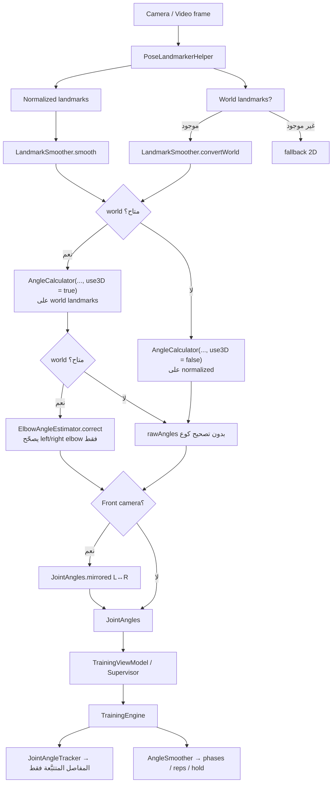

# حساب زوايا المفاصل — 2D أم 3D أم هجين؟

| | |
|---|---|
| **Status** | `ACTIVE` |
| **SSOT for** | كيف يحسب تطبيق Android زوايا المفاصل أثناء التدريب (كاميرا + فيديو) |
| **Code** | `android-poc/.../analysis/AngleCalculator.kt`, `ElbowAngleEstimator.kt`, `LandmarkSmoother.kt`, `ui/train/CameraTrainingInputController.kt`, `ui/training/VideoModeController.kt`, `training/engine/JointAngleTracker.kt`, `training/engine/AngleSmoother.kt`, `pose/PoseLandmarkerHelper.kt` |
| **Related** | [`Device-Tilt-Correction.md`](Device-Tilt-Correction.md) (ميل الجهاز لا يصحّح الزوايا), [`Docs/04-Research/Joint-Angle/`](../../04-Research/Joint-Angle/) (بحث ومستقبل) |
| **Verified** | 2026-07-11 |

---

## 1. الخلاصة أولاً

**النظام هجين — لكنه «3D-first» في الإنتاج.**

| الطبقة | الواقع في الكود |
|--------|------------------|
| المصدر الأساسي للزوايا | **3D** من MediaPipe **World Landmarks** (`use3D = true`) |
| إن لم تتوفر World landmarks | **2D** من Normalized landmarks (`x,y` فقط) |
| الكوع (`left_elbow` / `right_elbow`) | **هجين صريح**: يخلط زاوية 2D + زاوية 3D + إشارات عمق/اتجاه عبر `ElbowAngleEstimator` |
| باقي المفاصل (ركبة، ورك، كتف، …) | تبقى **3D خام** من World (بعد تنعيم النقاط) — بدون مصحح هجين |
| 3D حقيقي (MoCap / كاميرتين / LiDAR) | **غير مستخدم** |

أقرب وصف دقيق:

> **3D تقديري من MediaPipe World، مع تصحيح هجين للكوع فقط، وfallback إلى 2D.**

---

## 2. الفكرة العامة — لماذا ليست 2D نقية ولا 3D موثوقة؟

كاميرا الموبايل صورة واحدة. من صورة واحدة:

- **الزاوية 2D** = إسقاط الجسم على الشاشة → تتأثر بزاوية التصوير وforeshortening (الذراع نحو الكاميرا يُظهر زاوية أصغر من الحقيقة).
- **الزاوية 3D من World** = MediaPipe يقدّر عمقاً (`z`) ويُخرج هيكلاً بالمتر تقريباً حول الحوض → أقرب تشريحياً عندما يكون التقدير جيداً، لكنها **مبالغ فيها** غالباً عند الأطراف عندما يكون `z` صاخباً.

لذلك الإنتاج اختار:

1. احسب كل الزوايا من World بـ 3D (أفضل نقطة بداية لمعظم التمارين الجانبية).
2. للكوع فقط — المعروف بأنه الأسوأ في الخطأ — طبّق مصححاً يختار بين 2D و3D حسب الثقة.
3. إن اختفت World landmarks، انزل لـ 2D حتى لا يتوقف التدريب.

---

## 3. مصدران من MediaPipe في كل إطار

| المصدر | النوع | الإحداثيات | أين يُستخدم |
|--------|-------|------------|-------------|
| **Normalized landmarks** | نقاط الصورة | `x,y ∈ [0,1]` + `z` نسبي ضعيف | الرسم، scene/position، وزاوية 2D داخل مصحح الكوع |
| **World landmarks** | هيكل تقديري | `x,y,z` بالمتر تقريباً (أصل حول الحوض) | حساب الزوايا الأساسي (`use3D = true`) |

التعليق المهم: World landmarks **ليست** قياساً عمقياً من حساس؛ هي تقدير نموذج من صورة واحدة. لذلك «3D» هنا تعني **هندسة ثلاثية الأبعاد على إحداثيات مقدَّرة**، لا ground truth.

الملف الذي يستخرج الاثنين: `PoseLandmarkerHelper.kt`  
التنعيم:

- `LandmarkSmoother.smooth(...)` → normalized
- `LandmarkSmoother.convertWorld(...)` → world بنفس شكل `SmoothedLandmark`

---

## 4. الرياضيات — كيف تُحسب الزاوية؟

ثلاث نقاط: `A → B → C` (مثلاً كتف → كوع → معصم). الزاوية عند المفصل الأوسط `B`.

### 4.1 مسار 2D — `calculateAngleFromCoords`

```text
BA = A - B   (في المستوى x,y فقط)
BC = C - B

angleA = atan2(BA.y, BA.x)
angleC = atan2(BC.y, BC.x)
angle  = |angleA - angleC|   ثم تطبيع إلى [0, 180]
```

الناتج: زاوية في **مستوى الصورة**.

### 4.2 مسار 3D — `calculateAngleFromCoords3D`

```text
BA = A - B   (x,y,z)
BC = C - B

cosθ = (BA · BC) / (|BA| × |BC|)
angle = acos(clamp(cosθ, -1, 1))   بالدرجات
```

الناتج: زاوية بين متجهين في **فضاء 3D تقديري**.

### 4.3 التبديل في الكود

```kotlin
fun calculateAngleSmoothed(..., use3D: Boolean = false): Double? {
    // visibility على النقاط الثلاث ≥ threshold وإلا null
    return if (use3D) calculateAngle3D(a, b, c) else calculateAngle(a, b, c)
}
```

`calculateAllAnglesSmoothed` يمرّر نفس `use3D` لكل المفاصل المعرّفة (كوع، كتف، كتف-cross، ورك، ركبة، كاحل، معصم، رقبة، عمود فقري، …).

---

## 5. التدفق من الإطار إلى المحرك



### 5.1 نقطة الدخول في الإنتاج (كاميرا)

`CameraTrainingInputController.kt`:

```kotlin
val smoothedLandmarks = landmarkSmoother.smooth(result.landmarks, ...)
val worldLandmarks = result.worldLandmarks?.let {
    landmarkSmoother.convertWorld(it, ...)
}

val rawAngles = if (worldLandmarks != null) {
    AngleCalculator.calculateAllAnglesSmoothed(worldLandmarks, use3D = true)
} else {
    AngleCalculator.calculateAllAnglesSmoothed(smoothedLandmarks) // use3D = false
}

val correctedAngles = if (worldLandmarks != null) {
    elbowAngleEstimator.correct(rawAngles, worldLandmarks, smoothedLandmarks, timestampMs)
} else {
    rawAngles
}

val angles = if (result.isFrontCamera) correctedAngles.mirrored() else correctedAngles
viewModel.onPoseFrame(angles, smoothedLandmarks, ...)
```

نفس النمط مكرر في:

- `VideoModeController.kt`
- `MainActivity.kt`
- `DebugActivity.kt`

### 5.2 ماذا يدخل المحرك؟

- **الزوايا** (`JointAngles`) → العدّ، الـ phases، التقييم، Setup Angles.
- **Normalized landmarks** (وليس world) → scene، position checks، الرسم على الشاشة، tilt correction للوضعية.

تصحيح ميل الجهاز يعمل على landmarks الصورة فقط ولا يُعاد تطبيقُه على حساب الزوايا — انظر [`Device-Tilt-Correction.md`](Device-Tilt-Correction.md).

---

## 6. مصحح الكوع الهجين — `ElbowAngleEstimator`

### 6.1 لماذا الكوع فقط؟

تجارب الفريق والأبحاث في `Docs/04-Research/Joint-Angle/` أظهرت:

- من الأمام: 2D تنكمش بشدة، و3D غالباً منفوخة.
- من الجانب: 3D أفضل عادة، لكن ليس دائماً.
- قواعد if/else على كل المفاصل مكلفة ومعقّدة؛ الكوع هو الأكثر حرجاً في تمارين الدفع/السحب.

لذلك المصحح **يعيد كتابة `leftElbow` / `rightElbow` فقط** ويترك باقي `JointAngles` كما جاءت من 3D.

### 6.2 الإشارات المستخدمة لكل جانب

لكل من اليسار/اليمين يحسب:

| الإشارة | المصدر | المعنى |
|---------|--------|--------|
| `ang2D` | normalized (`z=0` في الحساب) | زاوية الشاشة |
| `ang3D` | world | زاوية العالم التقديري |
| `uaDz` / `faDz` | \|Δz\| / طول الجزء | نسبة العمق في العضد والساعد (بعد EMA) |
| `maxDzShare` | `max(uaDz, faDz)` | مؤشر ثقة/عمق |
| `facingRatio` | عرض الكتفين 2D / 3D | قريب من 1 = أمامي، أصغر = جانبي |
| `sideStrength` | مشتق من facing | يقوّي التصحيح في الجانب ويضعفه من الأمام |

### 6.3 استراتيجيات القرار (أول تطابق يفوز)

| الترتيب | الشرط | الاستراتيجية | الناتج تقريباً |
|---------|--------|--------------|----------------|
| 1 | `ang2D > 150°` | `STRAIGHT` | دفع من 2D نحو 180° (يتجنب false positive من 3D منفوخ) |
| 2 | `ang3D ≤ ang2D + 12°` | `TRUST_3D` | اعتمد 3D — العمق متوافق |
| 3 | 3D منفوخ و`maxDz < 0.15` | `TRUST_2D` | عمق قليل → ثق في 2D |
| 4 | 3D منفوخ وعمق متوسط | `MILD_DOWN` | خفّض من 2D بنسبة محدودة × `sideStrength` |
| 5 | 3D منفوخ وعمق عالي | `DEEP_DOWN` / `LOW_CONF` | تصحيح أقوى أو **hold** لآخر قيمة مستقرة (~500 ms) |

بعد القرار: clamp إلى `[0, 180]` ثم EMA خفيف على المخرج (`OUTPUT_SMOOTH = 0.25`).

### 6.4 مبدأ التصميم (من تعليق الكود)

> `maxDzShare` يُعامل كـ **مؤشر ثقة**، لا كمحدّد لاتجاه التصحيح وحده.  
> كل التصحيحات النزولية تُمرَّر عبر `sideStrength` لأن foreshortening ضعيف عند مواجهة الكاميرا.

---

## 7. خريطة المفاصل المحسوبة

`AngleCalculator.calculateAllAnglesSmoothed` يملأ `JointAngles` بهذه الثلاثيات (مختصر):

| الحقل | النقاط (A, B, C) |
|-------|------------------|
| `leftElbow` / `rightElbow` | shoulder → elbow → wrist |
| `leftShoulder` / `rightShoulder` | elbow → shoulder → hip |
| `leftShoulderCross` / `rightShoulderCross` | elbow → shoulder → other shoulder |
| `leftHip` / `rightHip` | shoulder → hip → knee |
| `leftHipCross` / `rightHipCross` | knee → hip → other hip |
| `leftKnee` / `rightKnee` | hip → knee → ankle |
| `leftAnkle` / `rightAnkle` | knee → ankle → foot index |
| `leftWrist` / `rightWrist` | elbow → wrist → index |
| `neckLeft` / `neckRight` / `neckSpine` | متغيرات رقبة مع نقاط افتراضية |
| `spine` | neck → spine → knee (مع fallbacks) |

`JointAngleTracker` لا يعيد الحساب؛ يختار فقط المفاصل المطلوبة من إعداد التمرين (`TrackedJoint`) ويمرّرها للمحرك.

بعد ذلك `AngleSmoother` ينعّم القيم زمنياً داخل الـ engine قبل آلة الحالات والعدّ.

---

## 8. الكاميرا الأمامية والـ mirroring

عند `isFrontCamera = true`:

```kotlin
correctedAngles.mirrored()  // يبادل LEFT ↔ RIGHT في JointAngles
```

السبب: الصورة تُعكس قبل/أثناء الكشف فيوضع المفصل التشريحي الأيسر في جانب الشاشة الأيمن. الـ mirror يعيد الأسماء المنطقية قبل أي منطق تمرين أو bilateral.

هذا **ليس** تحويلاً من 2D إلى 3D؛ هو تصحيح تسمية فقط.

---

## 9. علاقة الزوايا بباقي النظام

| المسار | يعتمد على الزوايا؟ | يعتمد على أي landmarks؟ |
|--------|-------------------|-------------------------|
| Phase state machine / Rep counting / Hold | نعم | قيم `JointAngles` |
| Joint quality / feedback الزاوي | نعم | نفس الزوايا بعد tracker/smoother |
| Setup Pose — مرحلة Angles | نعم | نفس `JointAngles` |
| Pose scene (region/posture/direction) | لا مباشرة | Normalized (+ tilt correction) |
| Position checks | لا مباشرة | Normalized (+ tilt) |
| Skeleton overlay / أقواس الزوايا | يعرض الزوايا | يرسم على normalized |

**خلاصة الفصل:** الزوايا مسار مستقل عن تصحيح الميلان وعن فحوصات الوضعية المكانية.

---

## 10. خريطة الملفات (Code Map)

| ملف | الدور |
|-----|--------|
| `pose/PoseLandmarkerHelper.kt` | MediaPipe → normalized + world |
| `analysis/LandmarkSmoother.kt` | تنعيم النقاط؛ `convertWorld` |
| `analysis/AngleCalculator.kt` | حساب 2D/3D لكل المفاصل → `JointAngles` |
| `analysis/ElbowAngleEstimator.kt` | تصحيح هجين للكوع فقط |
| `ui/train/CameraTrainingInputController.kt` | مسار كاميرا الإنتاج |
| `ui/training/VideoModeController.kt` | مسار الفيديو (نفس منطق الزوايا) |
| `training/engine/JointAngleTracker.kt` | تصفية مفاصل التمرين |
| `training/engine/AngleSmoother.kt` | تنعيم زمني داخل المحرك |
| `ui/debug/DebugActivity.kt` | عرض تشخيصي (2D/3D/strategy للكوع) |

أبحاث ومستقبل (ليست as-built):

- `Docs/04-Research/Joint-Angle/elbow-angle-problem-report.md`
- `Docs/04-Research/Joint-Angle/elbow-correction-mlp-plan.md`
- `Docs/04-Research/Joint-Angle/lifting-model-solution-plan.md`

---

## 11. سيناريوهات سريعة

| السيناريو | السلوك المتوقع |
|-----------|----------------|
| كاميرا جانبية، كوع ظاهر، World متاح | زوايا 3D؛ الكوع غالباً `TRUST_3D` أو تصحيح خفيف |
| كاميرا أمامية، ذراع نحو العدسة | 2D منكمش، 3D منفوخ؛ المصحح يميل لـ `TRUST_2D` / hold / تصحيح حذر |
| ذراع شبه مستقيم | استراتيجية `STRAIGHT` من 2D نحو 180° |
| World landmarks = null | كل الزوايا 2D؛ لا تشغيل لـ ElbowAngleEstimator |
| ركبة / ورك في نفس الإطار | 3D من World بدون مصحح الكوع |
| Front camera | بعد التصحيح: `mirrored()` لـ L/R |
| ميل الموبايل على حامل | الزوايا لا تُدار بـ tilt corrector |

---

## 12. حدود معروفة (صراحة المنتج)

1. **World Z تقديري** — خطأ منهجي محتمل خاصة في الأطراف العلوية.
2. **زاوية التصوير ما زالت مهمة** — تمارين مصمَّمة لزاوية جانبية أدق عملياً من أمامية لنفس المفصل.
3. **لا يوجد ground truth على الجهاز** — لا مقارنة بمنقلة أو IMU في مسار الإنتاج.
4. **المصحح الهجين للكوع فقط** — باقي المفاصل قد ترث أخطاء Z دون طبقة ثقة مماثلة.
5. **خطط MLP / pose lifting** موجودة كبحث (`04-Research`) وليست جزءاً من مسار الإنتاج الحالي.

---

## 13. ملخص للمطوّر

1. السؤال «2D ولا 3D؟» → الجواب: **3D-first + fallback 2D + هجين للكوع**.
2. الحساب الهندسي: ثلاث نقاط؛ 2D بـ `atan2`، 3D بـ `acos(dot)`.
3. الإنتاج يفضّل World landmarks مع `use3D = true`.
4. `ElbowAngleEstimator` يعيد تقييم الكوع بمقارنة 2D/3D والعمق والاتجاه.
5. المحرك يستهلك `JointAngles` جاهزة؛ لا يعيد اختيار 2D/3D داخله.
6. لا تخلط هذا المسار مع Device Tilt — الميلان للوضعية، لا للزوايا.
