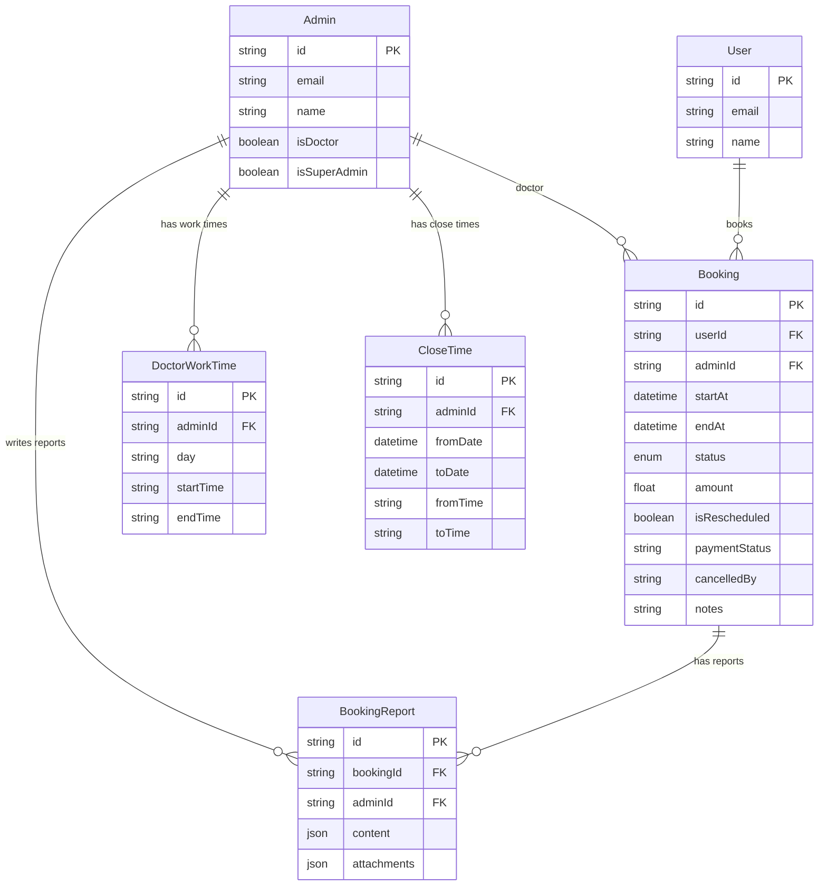
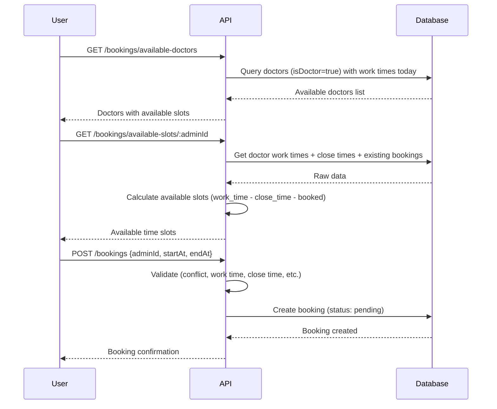
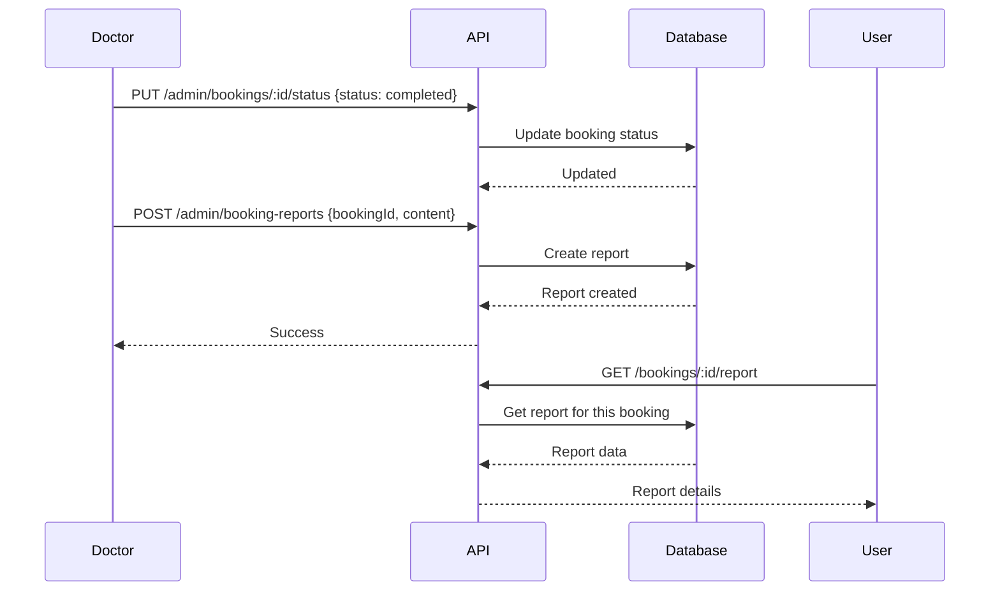

# 📋 Booking Feature Documentation

## Overview

نظام حجز مواعيد بين المرضى (Users) والدكاترة (Admins with `isDoctor = true`).  
اليوزر يقدر يشوف الدكاترة المتاحين ويحجز في الوقت المناسب.  
بعد السيشن (Google Meet / Zoom)، الدكتور يبعت Report ويغير حالة الحجز.

### Actors

| Actor | Description |
|-------|-------------|
| **Admin** | يتحكم في كل حاجة: مواعيد الدكاترة، الإجازات، الحجوزات، الريبورتات |
| **Doctor** | Admin عنده `isDoctor = true` – يشوف حجوزاته بس، يعدل الحالة والنوت |
| **User** | يحجز، يشوف مواعيده، يعيد جدولة، يشوف الريبورت |

---

## Database Schema

### 1. تعديل جدول `admins` (Admin model)

إضافة column جديد:

| Column | Type | Default | Description |
|--------|------|---------|-------------|
| `isDoctor` | `Boolean` | `false` | هل الـ Admin ده دكتور ولا لا |

#### Prisma Changes

```prisma
model Admin {
  // ... existing fields
  isDoctor     Boolean   @default(false)  // ← NEW
  
  // ← NEW Relations
  bookingsAsDoctor  Booking[]         @relation("DoctorBookings")
  workTimes         DoctorWorkTime[]
  closeTimes        CloseTime[]
  bookingReports    BookingReport[]
}
```

---

### 2. تعديل جدول `users` (User model)

إضافة relation:

```prisma
model User {
  // ... existing fields
  bookings  Booking[]  // ← NEW
}
```

---

### 3. تغيير اسم `SystemConfig` → `System`

> [!IMPORTANT]
> تغيير اسم الـ Model من `SystemConfig` إلى `System` وتغيير الـ `@@map` من `"system_config"` إلى `"system"`.

#### إضافة الأعمدة الجديدة

الأعمدة الجديدة هتتضاف كـ key-value في الجدول (نفس النمط الحالي):

| Key | Value Type | Description |
|-----|-----------|-------------|
| `allow_booking` | `"true"` / `"false"` | تفعيل/تعطيل نظام الحجز |
| `booking_duration` | `"30"` (minutes) | مدة السيشن الواحدة بالدقايق |
| `booking_price` | `"500"` | سعر الحجز |
| `booking_currency` | `"EGP"` | عملة سعر الحجز |
| `reschedule_allowed_time` | `"24"` (hours) | قبل الموعد بكام ساعة يقدر اليوزر يعيد الجدولة |
| `max_advance_booking_days` | `"30"` | كام يوم قدام يقدر اليوزر يحجز |

```prisma
model System {
  id        Int      @id @default(autoincrement())
  key       String   @unique
  value     String
  createdAt DateTime @default(now())
  updatedAt DateTime @updatedAt

  @@map("system")
}
```

---

### 4. جدول `booking` (NEW)

| Column | Type | Nullable | Default | Description |
|--------|------|----------|---------|-------------|
| `id` | `String (UUID)` | ❌ | `uuid()` | Primary Key |
| `userId` | `String` | ❌ | - | FK → `users.id` |
| `adminId` | `String` | ❌ | - | FK → `admins.id` (الدكتور) |
| `startAt` | `DateTime` | ❌ | - | بداية الموعد |
| `endAt` | `DateTime` | ❌ | - | نهاية الموعد |
| `status` | `BookingStatus` | ❌ | `pending` | حالة الحجز |
| `amount` | `Float` | ❌ | `0` | المبلغ اللي العميل دفعه |
| `isRescheduled` | `Boolean` | ❌ | `false` | هل تم إعادة الجدولة |
| `paymentStatus` | `String?` | ✅ | `null` | حالة الدفع (`paid`, `unpaid`, `refunded`) |
| `paymentId` | `String?` | ✅ | `null` | ID الدفع من الـ gateway |
| `paymentGateway` | `String?` | ✅ | `null` | اسم بوابة الدفع (`stripe`, `paymob`) |
| `cancelledBy` | `String?` | ✅ | `null` | مين اللي كانسل - User ID أو Admin ID |
| `sessionUrl` | `String?` | ✅ | `null` | رابط السيشن (Zoom/Meet) |
| `sessionMeetingId` | `String?` | ✅ | `null` | ID الاجتماع من الـ API |
| `sessionPlatform` | `String?` | ✅ | `null` | المنصة (zoom, google_meet) |
| `notes` | `String?` | ✅ | `null` | ملاحظات الدكتور |
| `createdAt` | `DateTime` | ❌ | `now()` | - |
| `updatedAt` | `DateTime` | ❌ | `@updatedAt` | - |
| `deletedAt` | `DateTime?` | ✅ | `null` | Soft Delete |

#### Booking Status Enum

```prisma
enum BookingStatus {
  pending
  confirmed
  payment_needed
  completed
  canceled
}
```

#### Prisma Model

```prisma
model Booking {
  id              String        @id @default(uuid())
  userId          String
  adminId         String
  startAt         DateTime
  endAt           DateTime
  status          BookingStatus @default(pending)
  amount          Float         @default(0)
  isRescheduled   Boolean       @default(false)
  paymentStatus   String?
  paymentId       String?
  paymentGateway  String?
  cancelledBy     String?
  sessionUrl      String?
  sessionMeetingId String?
  sessionPlatform String?
  notes           String?
  createdAt       DateTime      @default(now())
  updatedAt       DateTime      @updatedAt
  deletedAt       DateTime?

  user    User    @relation(fields: [userId], references: [id], onDelete: Cascade)
  admin   Admin   @relation("DoctorBookings", fields: [adminId], references: [id])
  reports BookingReport[]

  @@index([userId])
  @@index([adminId])
  @@index([status])
  @@index([startAt])
  @@index([adminId, startAt, endAt])
  @@map("bookings")
}
```

---

### 5. جدول `doctor_work_time` (NEW)

> [!NOTE]
> الدكتور ممكن يكون عنده أكتر من فترة عمل في نفس اليوم (صباحي + مسائي مثلاً).

| Column | Type | Nullable | Default | Description |
|--------|------|----------|---------|-------------|
| `id` | `String (UUID)` | ❌ | `uuid()` | Primary Key |
| `adminId` | `String` | ❌ | - | FK → `admins.id` |
| `day` | `String` | ❌ | - | اسم اليوم (`Saturday`, `Sunday`, ...) |
| `startTime` | `String` | ❌ | - | وقت البداية (HH:mm format) |
| `endTime` | `String` | ❌ | - | وقت النهاية (HH:mm format) |

```prisma
model DoctorWorkTime {
  id        String @id @default(uuid())
  adminId   String
  day       String
  startTime String
  endTime   String

  admin Admin @relation(fields: [adminId], references: [id], onDelete: Cascade)

  @@index([adminId])
  @@index([adminId, day])
  @@map("doctor_work_times")
}
```

---

### 6. جدول `close_time` (NEW)

> [!NOTE]
> لو `adminId = null` → إجازة عامة للنظام كله (كل الدكاترة).  
> المواعيد بتتعامل مع كل يوم على حدة في النطاق المحدد.

| Column | Type | Nullable | Default | Description |
|--------|------|----------|---------|-------------|
| `id` | `String (UUID)` | ❌ | `uuid()` | Primary Key |
| `adminId` | `String?` | ✅ | `null` | FK → `admins.id` (null = إجازة عامة) |
| `fromDate` | `DateTime` | ❌ | - | تاريخ بداية الإجازة |
| `toDate` | `DateTime` | ❌ | - | تاريخ نهاية الإجازة |
| `fromTime` | `String` | ❌ | - | وقت بداية الإجازة (HH:mm) |
| `toTime` | `String` | ❌ | - | وقت نهاية الإجازة (HH:mm) |

**مثال:**
```
fromDate: 2026-03-01, toDate: 2026-03-05, fromTime: "14:00", toTime: "16:00"
```
**النتيجة:**
- يوم 1 مارس من 14:00 لـ 16:00 → مش شغال
- يوم 2 مارس من 14:00 لـ 16:00 → مش شغال
- يوم 3 مارس من 14:00 لـ 16:00 → مش شغال
- ... وهكذا لحد يوم 5

```prisma
model CloseTime {
  id        String   @id @default(uuid())
  adminId   String?
  fromDate  DateTime
  toDate    DateTime
  fromTime  String
  toTime    String

  admin Admin? @relation(fields: [adminId], references: [id], onDelete: Cascade)

  @@index([adminId])
  @@index([fromDate, toDate])
  @@map("close_times")
}
```

---

### 7. جدول `booking_report` (NEW)

| Column | Type | Nullable | Default | Description |
|--------|------|----------|---------|-------------|
| `id` | `String (UUID)` | ❌ | `uuid()` | Primary Key |
| `bookingId` | `String` | ❌ | - | FK → `bookings.id` |
| `adminId` | `String` | ❌ | - | FK → `admins.id` (الدكتور اللي كتب الريبورت) |
| `content` | `Json` | ❌ | - | محتوى الريبورت |
| `attachments` | `Json?` | ✅ | `null` | مرفقات (ملفات، صور) |
| `createdAt` | `DateTime` | ❌ | `now()` | - |
| `updatedAt` | `DateTime` | ❌ | `@updatedAt` | - |

```prisma
model BookingReport {
  id          String   @id @default(uuid())
  bookingId   String
  adminId     String
  content     Json
  attachments Json?
  createdAt   DateTime @default(now())
  updatedAt   DateTime @updatedAt

  booking Booking @relation(fields: [bookingId], references: [id], onDelete: Cascade)
  admin   Admin   @relation(fields: [adminId], references: [id])

  @@index([bookingId])
  @@index([adminId])
  @@map("booking_reports")
}
```

---

## Entity Relationship Diagram



---

## Permissions (CASL Subjects)

### New Subjects to Add

| Subject | Description |
|---------|-------------|
| `DoctorWorkTime` | مواعيد عمل الدكاترة |
| `CloseTime` | مواعيد الإجازات |
| `Booking` | الحجوزات |
| `BookingReport` | ريبورتات الحجوزات |

### Permission Matrix

#### Admin (Full Access via Role)

| Subject | create | read | update | delete |
|---------|--------|------|--------|--------|
| `DoctorWorkTime` | ✅ | ✅ | ✅ | ✅ |
| `CloseTime` | ✅ | ✅ | ✅ | ✅ |
| `Booking` | ✅ | ✅ | ✅ | ✅ |
| `BookingReport` | ✅ | ✅ | ✅ | ✅ |

#### Doctor (`isDoctor = true`) — Hardcoded Guard

| Subject | create | read | update | delete |
|---------|--------|------|--------|--------|
| `DoctorWorkTime` | ❌ | ✅ (own) | ❌ | ❌ |
| `CloseTime` | ❌ | ✅ (own) | ❌ | ❌ |
| `Booking` | ✅* | ✅ (own) | ✅** | ❌ |
| `BookingReport` | ✅ | ✅ (own) | ✅ | ❌ |

> \* الدكتور يقدر يضيف مواعيد لعملاء كان عنده سيشن معاهم قبل كده، ويقدر يجدول أكتر من موعد.  
> \** التعديل محدود: تغيير حالة العميل، النوت بس.

#### User (Mobile App)

| Action | Description |
|--------|-------------|
| View own bookings | يشوف مواعيده |
| Create booking | يحجز عند دكتور |
| Reschedule | يعيد الجدولة (قبل الموعد بـ `reschedule_allowed_time` ساعة) |
| View past bookings | يشوف الحجوزات السابقة |
| View own reports | يشوف الريبورتات بتاعته |

---

## Guard Implementation

### Doctor Guard (Hardcoded)

هنعمل Guard اسمه `DoctorGuard` بـ hardcoded permissions:

```typescript
// Pseudo-code
@Injectable()
export class DoctorGuard implements CanActivate {
  async canActivate(context: ExecutionContext): Promise<boolean> {
    const admin = getAdminFromRequest(context);
    
    if (!admin.isDoctor) return false;
    
    // Doctor can only see/edit their own bookings
    const resourceAdminId = getResourceAdminId(context);
    return resourceAdminId === admin.id;
  }
}
```

---

## Validation Rules

### Booking Creation

1. **التعارض**: لا يمكن حجز موعد عند دكتور في وقت فيه حجز تاني (`adminId + startAt + endAt` overlap check)
2. **أيام العمل**: الموعد لازم يكون في يوم وساعة عمل الدكتور (`doctor_work_times`)
3. **الإجازات**: الموعد مش يكون في وقت إجازة للدكتور أو إجازة عامة (`close_times`)
4. **النظام مفعل**: `system.allow_booking = "true"`
5. **المدة**: مدة الحجز لازم تساوي `system.booking_duration`
6. **الحد الأقصى**: الموعد مش يبعد أكتر من `system.max_advance_booking_days` يوم
7. **الموعد مستقبلي**: `startAt > now()`

### Reschedule

1. **الوقت المسموح**: لازم يكون قبل الموعد الأصلي بـ `system.reschedule_allowed_time` ساعة على الأقل
2. **الموعد الجديد**: لازم يمر بنفس validation الحجز العادي
3. **التحديث**: `isRescheduled = true` + تحديث `startAt` & `endAt`

### Doctor Work Time

1. **أكتر من فترة**: نفس الدكتور ممكن يكون عنده أكتر من فترة عمل في نفس اليوم
2. **عدم التعارض**: الفترات في نفس اليوم ما تتعارضش مع بعض

### Close Time

1. **أكتر من إجازة**: ممكن أكتر من إجازة في نفس اليوم
2. **التطبيق يومي**: النطاق الزمني بيتطبق على كل يوم في نطاق التاريخ بشكل منفصل
3. **`adminId` nullable**: لو null = إجازة عامة لكل الدكاترة

---

## API Endpoints

### Admin Endpoints (Dashboard)

#### Doctor Work Time

| Method | Endpoint | Description | Permission |
|--------|----------|-------------|------------|
| `GET` | `/admin/doctor-work-time` | Get all work times | `read:DoctorWorkTime` |
| `GET` | `/admin/doctor-work-time/:adminId` | Get work times for specific doctor | `read:DoctorWorkTime` |
| `POST` | `/admin/doctor-work-time` | Create work time | `create:DoctorWorkTime` |
| `PUT` | `/admin/doctor-work-time/:id` | Update work time | `update:DoctorWorkTime` |
| `DELETE` | `/admin/doctor-work-time/:id` | Delete work time | `delete:DoctorWorkTime` |

#### Close Time

| Method | Endpoint | Description | Permission |
|--------|----------|-------------|------------|
| `GET` | `/admin/close-time` | Get all close times | `read:CloseTime` |
| `POST` | `/admin/close-time` | Create close time | `create:CloseTime` |
| `PUT` | `/admin/close-time/:id` | Update close time | `update:CloseTime` |
| `DELETE` | `/admin/close-time/:id` | Delete close time | `delete:CloseTime` |

#### Bookings

| Method | Endpoint | Description | Permission |
|--------|----------|-------------|------------|
| `GET` | `/admin/bookings` | List all bookings | `read:Booking` |
| `GET` | `/admin/bookings/:id` | Get booking details | `read:Booking` |
| `POST` | `/admin/bookings` | Create a booking | `create:Booking` |
| `PUT` | `/admin/bookings/:id` | Update booking | `update:Booking` |
| `DELETE` | `/admin/bookings/:id` | Soft delete booking | `delete:Booking` |

#### Booking Reports

| Method | Endpoint | Description | Permission |
|--------|----------|-------------|------------|
| `GET` | `/admin/booking-reports` | List all reports | `read:BookingReport` |
| `GET` | `/admin/booking-reports/:id` | Get report details | `read:BookingReport` |
| `POST` | `/admin/booking-reports` | Create report | `create:BookingReport` |
| `PUT` | `/admin/booking-reports/:id` | Update report | `update:BookingReport` |
| `DELETE` | `/admin/booking-reports/:id` | Delete report | `delete:BookingReport` |

### Doctor Endpoints (Filtered by `DoctorGuard`)

| Method | Endpoint | Description |
|--------|----------|-------------|
| `GET` | `/admin/doctor-work-time/mine` | مواعيد عمل الدكتور (view only) |
| `GET` | `/admin/close-time/mine` | إجازات الدكتور (view only) |
| `GET` | `/admin/bookings/mine` | حجوزات الدكتور بس |
| `PUT` | `/admin/bookings/:id/status` | تغيير حالة الحجز |
| `PUT` | `/admin/bookings/:id/notes` | تعديل النوت |
| `POST` | `/admin/bookings/follow-up` | إضافة موعد متابعة لعميل سابق |
| `GET` | `/admin/booking-reports/mine` | ريبورتات الدكتور |
| `POST` | `/admin/booking-reports` | إنشاء ريبورت |
| `PUT` | `/admin/booking-reports/:id` | تعديل ريبورت |

### User Endpoints (Mobile App)

| Method | Endpoint | Description |
|--------|----------|-------------|
| `GET` | `/bookings/available-doctors` | الدكاترة المتاحين اليوم |
| `GET` | `/bookings/available-slots/:adminId` | المواعيد المتاحة لدكتور معين |
| `GET` | `/bookings/my` | حجوزاتي (القادمة والحالية) |
| `GET` | `/bookings/history` | الحجوزات السابقة |
| `POST` | `/bookings` | عمل حجز جديد |
| `PUT` | `/bookings/:id/reschedule` | إعادة جدولة |
| `PUT` | `/bookings/:id/cancel` | إلغاء حجز |
| `GET` | `/bookings/:id/report` | مشاهدة الريبورت |

---

## Business Logic Flows

### Flow 1: User Books an Appointment



### Flow 2: Doctor Completes Session & Sends Report



### Flow 3: Available Slots Calculation

```
Available Slots = Doctor Work Time - Close Times - Existing Bookings

مثال:
  Doctor Work Time: Saturday 09:00-13:00, 17:00-21:00
  Close Time: Saturday 10:00-11:00
  Existing Bookings: Saturday 09:00-09:30, 17:00-17:30
  Booking Duration: 30 min

  Available = [09:30, 11:00, 11:30, 12:00, 12:30, 17:30, 18:00, 18:30, ...]
```

---

## Files to Create/Modify

### New Files

| File | Description |
|------|-------------|
| `src/modules/booking/booking.module.ts` | Booking module |
| `src/modules/booking/booking.controller.ts` | Admin booking endpoints |
| `src/modules/booking/booking.service.ts` | Booking business logic |
| `src/modules/booking/booking.types.ts` | DTOs & types |
| `src/modules/booking/user-booking.controller.ts` | User (mobile) booking endpoints |
| `src/modules/doctor-work-time/doctor-work-time.module.ts` | Module |
| `src/modules/doctor-work-time/doctor-work-time.controller.ts` | Controller |
| `src/modules/doctor-work-time/doctor-work-time.service.ts` | Service |
| `src/modules/close-time/close-time.module.ts` | Module |
| `src/modules/close-time/close-time.controller.ts` | Controller |
| `src/modules/close-time/close-time.service.ts` | Service |
| `src/modules/booking-report/booking-report.module.ts` | Module |
| `src/modules/booking-report/booking-report.controller.ts` | Controller |
| `src/modules/booking-report/booking-report.service.ts` | Service |
| `src/lib/guards/doctor.guard.ts` | Doctor hardcoded guard |

### Modified Files

| File | Change |
|------|--------|
| `prisma/schema.prisma` | Add new models, enum, relations, rename System |
| `src/lib/casl/casl.types.ts` | Add new Subjects |
| `src/app.module.ts` | Import new modules |

---

## Seed Data

### Permissions to Seed

```typescript
const bookingPermissions = [
  // DoctorWorkTime
  { subject: 'DoctorWorkTime', action: 'create' },
  { subject: 'DoctorWorkTime', action: 'read' },
  { subject: 'DoctorWorkTime', action: 'update' },
  { subject: 'DoctorWorkTime', action: 'delete' },
  // CloseTime
  { subject: 'CloseTime', action: 'create' },
  { subject: 'CloseTime', action: 'read' },
  { subject: 'CloseTime', action: 'update' },
  { subject: 'CloseTime', action: 'delete' },
  // Booking
  { subject: 'Booking', action: 'create' },
  { subject: 'Booking', action: 'read' },
  { subject: 'Booking', action: 'update' },
  { subject: 'Booking', action: 'delete' },
  // BookingReport
  { subject: 'BookingReport', action: 'create' },
  { subject: 'BookingReport', action: 'read' },
  { subject: 'BookingReport', action: 'update' },
  { subject: 'BookingReport', action: 'delete' },
];
```

### System Config Seed

```typescript
const systemBookingConfig = [
  { key: 'allow_booking', value: 'true' },
  { key: 'booking_duration', value: '30' },
  { key: 'booking_price', value: '500' },
  { key: 'booking_currency', value: 'EGP' },
  { key: 'reschedule_allowed_time', value: '24' },
  { key: 'max_advance_booking_days', value: '30' },
];
```
