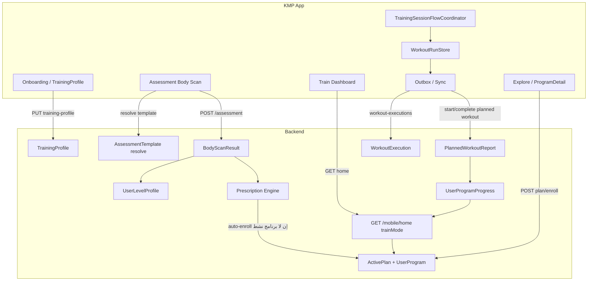

# مراجعة مسار البرامج الرياضية · التقدم · الاختبارات · التسكين

تاريخ المراجعة: 2026-07-11

النطاق:
- `backend/` — NestJS + Prisma/PostgreSQL
- `kmp-app/` — Kotlin Multiplatform (Train / Explore / Library / Account / Training Engine)

ملفات مرتبطة (مكملة وليست بديلاً):
- `Main-Screens-Flow-Audit.md` — توحيد مسار التدريب UI/navigation (Explore/Train → Workout → Report)
- `REVIEW_PROGRAM_ASSESSMENT_LEVEL_PROGRAM_MAP.md` — خريطة البرامج والمستويات في Admin (أقدم، 2026-06-07)
- `Training-Metrics-Audit.md` — مقاييس الجلسة والتقارير

> **ملاحظة اصطلاحية:** لا يوجد في الكود مصطلح `tisken` ولا module باسم `placement`. **التسكين** = سلسلة Onboarding → Assessment (Body Scan) → Level Profile → Prescription → Auto-enroll / Manual enroll → ActivePlan.

---

## 1. النتيجة التنفيذية

النظام مبني حول **قالب برنامج** (`Program`) و**تسجيل مستخدم** (`UserProgram` + `ActivePlan`)، مع تقدم متعدد الطبقات، وتقييم Body Scan يغذي محرك توصية (`prescription`) قد يُسجّل المستخدم تلقائياً في برنامج عند أول تقييم.

| المحور | الحكم الحالي |
|--------|--------------|
| هيكل البرامج (weeks/days/planned workouts) | متماسك في Prisma + Admin + Mobile export |
| التسكين بعد التقييم | موجود على **Backend** (`assessment.create` → `prescription.recommend` → `enrollProgram` إن لم يوجد برنامج نشط) |
| استهلاك التسكين في KMP | **ناقص**: العميل لا يقرأ `autoPrescription` من رد التقييم، ولا يستدعي `prescription/recommend`، ويوجّه المستخدم لـ Explore/Home |
| تقدم الجلسة (workout run) | قوي محلياً (`WorkoutRunStore` + coordinator + outbox) |
| تقدم البرنامج (أيام/أسابيع) | مصدر الحقيقة = `UserProgramProgress` + `home.trainMode` |
| الاختبارات / Assessment | مسار Body Scan كامل؛ قوالب عبر `resolve`; إعادة تقييم عبر `reassessment` |
| تسمية مربكة | `Plan` (اشتراك SaaS) ≠ `ActivePlan` (خطة تدريب) |

**الحكم:** البنية الخلفية جاهزة لمسار تسكين → برنامج → تقدم. الفجوة الأكبر بين Backend وKMP هي أن **التعيين التلقائي يحدث على الخادم لكن تجربة الموبايل لا تستهلكه صراحة**، فيبدو للمستخدم أن التسكين يدوي عبر Browse Programs.

---

## 2. نظرة معمارية شاملة



### وحدات NestJS ذات الصلة

| وحدة | الدور |
|------|------|
| `programs` | قالب البرنامج + mobile catalog + user-programs |
| `active-plan` | الخطة النشطة، today، enroll، complete |
| `workout-executions` | تنفيذ تمرين + تقارير planned workout |
| `assessment` | رفع Body Scan + hook التسكين |
| `assessment-templates` | قوالب التقييم Admin + resolve Mobile |
| `assessments` | مطابقة القالب (`matchInitial` / `matchProgression`) |
| `prescription` | محرك التوصية والتعيين |
| `level-profile` | تحويل التقييم → مستوى 1–5 |
| `reassessment` | جدولة إعادة التقييم |
| `training-profile` | ملف onboarding |
| `progression` | تقدم الحمل (sets/reps/weight) بعد الجلسة |
| `effective-plan` | قالب اليوم + overrides + progression state |
| `mobile-sync` | `/mobile/home` + `/mobile/sync` |
| `plan` | **اشتراكات SaaS** — ليس خطة التدريب |
| `analytics` | تقارير تقدم البرامج والتقييمات للإدارة |

### طبقات KMP ذات الصلة

| طبقة | الدور |
|------|------|
| `feature/train` | لوحة اليوم من `home.trainMode` |
| `feature/explore` | اكتشاف البرامج |
| `feature/library` | ProgramDetail، WorkoutSession، WorkoutRunStore، Launch |
| `feature/training` | الجلسة الحية |
| `feature/account` | Onboarding، Assessment، Level |
| `feature/reports` | تقارير ما بعد التدريب |
| `feature/shell` | `MovitInnerRoute` + تنسيق التنقل والـ sync |
| `core/data` | Repositories، SQLDelight، journal، outbox |
| `core/network` | `MovitMobileApi` + DTOs |
| `core/training-engine` | محرك الزوايا، coordinator، تقارير الجلسة |

---

## 3. نماذج البيانات (Prisma) — الهيكل والعلاقات

### 3.1 قالب البرنامج

```
Program
├── ProgramAttribute[]          (domain, goal, equipment, focus…)
├── ProgramWeek[]
│   └── ProgramDay[]
│       ├── ProgramDayAttribute[]   (عضلات مستهدفة)
│       └── PlannedWorkout[]
│           ├── WorkoutTemplate
│           └── PlannedWorkoutItem[]  (exercise | rest | …)
├── levelMinId / levelMaxId
├── nextProgramId / prerequisiteProgramId
├── autoAssignable, prescriptionPriority
└── programType: SYSTEM | COACH | CUSTOM
```

حقول مهمة في `Program`:
- `durationWeeks`, `isPublished`, `weeklyWorkoutTarget`, `estimatedWorkoutMinutes`
- `autoAssignable` — هل يدخل محرك التعيين التلقائي
- سلسلة البرامج عبر `nextProgramId` / `prerequisiteProgramId`

### 3.2 تسجيل المستخدم والخطة

```
User
├── TrainingProfile (1:1)
├── UserProgram[]
│   ├── assignmentReason (JSON)
│   ├── UserProgramProgress[]
│   ├── UserProgramOverride[]
│   ├── UserProgramExerciseProgressionState[]
│   └── ActivePlanProgram slots
└── ActivePlan (1:1)
    └── ActivePlanProgram[]  (status: active | upcoming | completed)
```

- `UserProgram.assignmentReason` يخزّن مصدر التعيين:
  - `selection_algorithm` | `fallback_selection` | `manual_selection` | `admin_assignment`
- `ActivePlan` = قائمة مرتبة من البرامج للمستخدم (الطابور الفعلي).

### 3.3 التقدم والجلسات

| النموذج | المفتاح / الغرض |
|---------|-----------------|
| `UserProgramProgress` | `(userProgramId, weekNumber, dayNumber, plannedWorkoutId)` — حالة يوم/جلسة. Sentinel: `plannedWorkoutId = "__day__"` = إكمال اليوم كاملاً |
| `PlannedWorkoutReport` | جلسة workout فعلية: مدة، reps، form، RPE، JSON report، `idempotencyKey` |
| `WorkoutExecution` | تنفيذ تمرين واحد + metrics؛ `context`: `free \| program \| assessment \| explore_workout \| quick_start` |

حالات `UserProgramProgress.status`: `pending | in_progress | completed | skipped`  
حالات `PlannedWorkoutReport.status`: `in_progress | completed | abandoned`

### 3.4 التقييم والمستوى

```
AssessmentTemplate
├── AssessmentAttribute[]
├── AssessmentTemplateExercise[]
└── BodyScanResult[]

BodyScanResult
├── bodyScore, mobilityScore, controlScore, symmetryScore, safetyScore
├── regions (JSON), templateId, levelId, type
└── UserLevelProfile (1:1 عبر assessmentId)

UserLevelProfile
├── overallLevel (1–5)
├── domainLevels, regionLevels, limitingFactors
```

أنواع التقييم (`AssessmentType`): `initial | periodic | post_program | progression | level_specific`

### 3.5 إعادة التقييم

`ReassessmentSchedule` — أسباب شائعة: `program_complete`, `periodic` (كل ~6 أسابيع), `manual`, `progression_trigger`

---

## 4. خريطة الملفات — Backend

### البرامج — `backend/src/modules/programs/`

| الملف | الوظيفة |
|-------|---------|
| `programs.controller.ts` | Admin CRUD + weeks/days/planned-workouts/items |
| `mobile-programs.controller.ts` | كتالوج منشور + enroll |
| `mobile-user-programs.controller.ts` | enrollments، progress-metrics، overrides، effective-plan |
| `programs.service.ts` | منطق البرنامج الكامل (~1900 سطر) |
| `program-assignment.ts` | جاهزية auto-assignment + `buildAssignmentReason` |
| `program-progress.service.ts` | مقاييس أسبوعية (volume, RPE, form) |
| `program-completion.service.ts` | قرار ما بعد إكمال البرنامج |
| `program-catchup.ts` | catch-up بعد غياب |
| `program-graph-validation.ts` | سلسلة next/prerequisite + `assertEnrollableProgram` |
| `calendar-program-structure.ts` | تحقق هيكل التقويم |
| `programs.validation.ts` / `programs.types.ts` | تحقق وأنواع |

### الخطة والتقدم

| المسار | الوظيفة |
|--------|---------|
| `active-plan/active-plan.service.ts` | enroll، today، complete |
| `active-plan/plan-position.ts` | موضع الأسبوع/اليوم + catch-up snap |
| `workout-executions/workout-executions.service.ts` | start/complete planned + تحديث progress |
| `effective-plan/effective-plan.service.ts` | خطة يوم فعّالة |
| `progression/progression.service.ts` | تقييم الحمل بعد الجلسة |

### التقييم والتسكين

| المسار | الوظيفة |
|--------|---------|
| `assessment/assessment.service.ts` | create → level → prescription → auto-enroll |
| `assessment-templates/*` | CRUD + `resolveForUser` |
| `assessments/assessment-matching.service.ts` | `matchInitial` / `matchProgression` |
| `prescription/prescription.service.ts` | `recommend`, `rankAndPick` |
| `level-profile/level-profile.service.ts` | `calculateFromAssessment` |
| `reassessment/*` | جدولة وإكمال إعادة التقييم |
| `training-profile/*` | onboarding profile |
| `lib/attribute-matching.ts` | فلترة REQUIRED/OPTIONAL/EXCLUDED |
| `lib/program-domain.ts` | تحويل domain → API string |
| `mobile-sync/mobile-home.controller.ts` | بناء `trainMode` للموبايل |

### اختبارات موثّقة للسلوك

| الملف | ما يثبت |
|-------|---------|
| `program-assignment.spec.ts` | جاهزية auto-assignment |
| `plan-position.spec.ts` | حساب موضع الأسبوع/اليوم |
| `planned-workout-complete.idempotency.spec.ts` | idempotency عند الإكمال |
| `program-graph-validation.spec.ts` | دورات nextProgramId |
| `effective-plan-customizations.spec.ts` | overrides |
| `mobile-user-programs-list.contract.spec.ts` | شكل قائمة user programs |
| `progression-engine.spec.ts` | محرك التقدم بعد التمرين |

---

## 5. خريطة الملفات — KMP

### البرامج والخطة

| الملف | الدور |
|-------|------|
| `feature/library/ProgramDetailScreen.kt` | UI تفاصيل البرنامج |
| `feature/library/ProgramDetailViewModel.kt` | تحميل، enrollment، offline week pack |
| `feature/library/ProgramDetailApiMapper.kt` | أسابيع/أيام من export + home |
| `feature/library/WorkoutRunModels.kt` | `WorkoutRunStore` — تقدم الجلسة |
| `feature/library/WorkoutLaunchRequest.kt` | عقد إطلاق موحّد |
| `core/data/repository/PlanSyncRepository.kt` | `POST plan/enroll` |
| `core/data/repository/ProgramFlowSyncRepository.kt` | program + progress-metrics |
| `core/data/repository/UserProgramEnrollmentLocalStore.kt` | كاش enrollments |
| `core/network/dto/ProgramExportDto.kt` | هيكل البرنامج الكامل |
| `core/network/dto/HomeDto.kt` | `TrainModeDto` وحالات Train |

### التقييم والتسكين على العميل

| الملف | الدور |
|-------|------|
| `feature/account/MovitAssessmentScreen.kt` | PAR-Q → Body Scan → Results |
| `feature/account/MovitAssessmentViewModel.kt` | تدفق التقييم + رفع |
| `feature/account/AssessmentBodyScanEngine.kt` | حساب الدرجات محلياً |
| `feature/account/SharedAssessmentRepository.kt` | → `MovitData.account` |
| `feature/account/MovitOnboardingScreen.kt` | onboarding |
| `feature/account/MovitLevelScreen.kt` | Level + recommended CTA |
| `core/data/repository/AccountSyncRepository.kt` | assessment + level + training profile |
| `core/network/dto/AssessmentDto.kt` | upload / template / progress DTOs |

### التقدم على الجهاز

| الملف | الدور |
|-------|------|
| `core/training-engine/.../TrainingSessionFlowCoordinator.kt` | تدفق الجلسة الحية |
| `core/training-engine/.../WorkoutFlowProgress.kt` | نسبة إكمال workout |
| `core/data/journal/SessionJournalStore.kt` | checkpoint تمرين solo |
| `core/data/repository/TrainingSessionWriteCoordinator.kt` | journal + outbox |
| `core/data/outbox/OutboxPayloads.kt` | start/complete / executions |
| `feature/library/WorkoutRunProgress.kt` | **Deprecated** — النظام القديم |

---

## 6. كتالوج API (بادئة `/api`)

### 6.1 Mobile — برامج وخطة

| Method | Path | الغرض |
|--------|------|-------|
| GET | `/mobile/programs` | كتالوج منشور |
| GET | `/mobile/programs/:id` | export كامل |
| GET | `/mobile/programs/:id/preview` | معاينة |
| POST | `/mobile/programs/:id/enroll` | تسجيل يدوي (مسار قديم/موازٍ) |
| GET | `/mobile/user-programs` | قائمة enrollments |
| GET | `/mobile/user-programs/:id/progress-metrics` | volume/RPE أسبوعياً |
| GET | `/mobile/user-programs/:id/effective-plan` | خطة يوم + overrides |
| GET/POST/DELETE | `/mobile/user-programs/:id/overrides` | تخصيصات |
| GET | `/mobile/plan` | الخطة + slots |
| GET | `/mobile/plan/today` | اليوم: workouts، rest، reassessment، catch-up |
| GET | `/mobile/plan/enrollment-check` | هل يستبدل برنامجاً نشطاً |
| POST | `/mobile/plan/enroll` | `{ programId }` — المسار الأساسي من KMP |
| POST | `/mobile/plan/complete` | إكمال البرنامج النشط + قرار الانتقال |

### 6.2 Mobile — جلسات وتقدم

| Method | Path | الغرض |
|--------|------|-------|
| POST | `/mobile/planned-workouts/:id/start` | بدء `PlannedWorkoutReport` |
| POST | `/mobile/planned-workouts/:id/complete` | إكمال + progress + progression |
| POST | `/mobile/workout-executions` | رفع تنفيذ تمرين |
| POST | `/mobile/workout-executions/explore` | workout حر متعدد التمارين |
| GET | `/mobile/workout-executions` | history |
| GET | `/mobile/workout-executions/stats` | إحصائيات |
| GET | `/mobile/home` | Home + **`trainMode`** (محرّك UI لـ Train) |
| GET | `/mobile/sync` | catalog + userPrograms + ملخصات |

### 6.3 Assessment / Placement / Onboarding

| Method | Path | الغرض |
|--------|------|-------|
| GET | `/mobile/assessment-templates/resolve?mode=` | قالب initial أو progression |
| POST | `/assessment` | رفع Body Scan (+ auto-enroll على الخادم) |
| GET | `/assessment/latest` | آخر تقييم |
| GET | `/assessment/history` | السجل |
| GET | `/assessment/progress` | مقارنة آخر اثنين |
| POST | `/mobile/prescription/recommend` | توصية بدون enroll إجباري |
| GET/PUT | `/mobile/training-profile` | onboarding |
| GET | `/mobile/level-profile` | المستوى الحالي |
| GET | `/mobile/level-profile/history` | سجل المستويات |
| GET | `/mobile/reassessment/upcoming` | إعادة تقييم معلقة |
| POST | `/mobile/reassessment/request` | طلب يدوي |

### 6.4 حالات `trainMode.status` (من `mobile-home.controller.ts`)

| status | المعنى |
|--------|--------|
| `no_assessment` | لم يُجرَ Body Scan |
| `no_plan` | تقييم موجود ولا برنامج نشط |
| `active` | برنامج نشط (اليوم تدريب أو مكتمل حسب `todayWorkout`) |
| `rest_day` | يوم راحة / active recovery |
| `reassessment_due` | إعادة تقييم مستحقة |
| `program_complete` | البرنامج اكتمل وينتظر قراراً |

KMP يترجمها في `TrainApiMapper.resolveStatus()`.

---

## 7. التدفقات الأساسية خطوة بخطوة

### 7.1 Onboarding → اختبار → تسكين → برنامج

```
1. ProfileOnboarding (KMP)
   PUT /mobile/training-profile
   └── TrainingProfile + هدف التدريب

2. إن trainMode.status == no_assessment
   Assessment(mode=initial)
   GET /mobile/assessment-templates/resolve?mode=initial
   └── assessmentMatchingService.matchInitial()
       (يتطلب TrainingProfile + attribute matching)

3. العميل ينفّذ حركات Body Scan محلياً
   AssessmentBodyScanEngine → درجات + regions

4. POST /assessment
   assessmentService.create():
     a. BodyScanResult.create
     b. levelProfileService.calculateFromAssessment()
     c. reassessmentService.markCompleted()
     d. prescriptionService.recommend()
     e. إن لا يوجد ActivePlanProgram نشط:
        activePlanService.enrollProgram(..., assignmentReason)
        → يرجع autoPrescription { enrolled: true }
     f. وإلا يرجع recommendation { enrolled: false }

5. KMP الحالي بعد النجاح:
   - Browse Programs → Explore
   - Go Home → Home
   - لا يقرأ autoPrescription ولا يحدّث Train فوراً
   - يعتمد على sync/home لاحق لظهور active plan
```

### 7.2 تسجيل يدوي في برنامج

```
ProgramDetail → Start
  PlanSyncRepository.enrollProgram(programId)
  POST /mobile/plan/enroll
  └── assertEnrollableProgram()
  └── transaction: UserProgram + ActivePlan slot + assignmentReason=manual_selection
  └── hydrate userPrograms + setActiveUserProgramId + home.sync()
```

### 7.3 جلسة تدريب داخل برنامج + تحديث التقدم

```
Train / ProgramDetail
  → WorkoutSessionRoute (session key = program:week:day:plannedWorkoutId)
  → Start → WorkoutRunStore.start(runId)
  → ExercisePrepare → TrainingSession

على الشبكة (outbox):
  POST planned-workouts/:id/start
  POST workout-executions (context=program)  [لكل تمرين]
  POST planned-workouts/:id/complete
    └── finalizePlannedWorkoutReport():
        ├── CAS: in_progress → completed (idempotent)
        ├── UserProgramProgress upsert
        ├── إن اكتملت كل جلسات اليوم → plannedWorkoutId="__day__"
        └── progressionService.evaluateAfterPlannedWorkout()

بعدها:
  ReportDetail (يستبدل stack التدريب)
  home sync → تحديث trainMode / weekCalendars
```

### 7.4 إكمال البرنامج والانتقال

```
POST /mobile/plan/complete
  programCompletionService.evaluate():
    1. reassess? → ReassessmentSchedule + nextAction=reassess
    2. nextProgramId? → enroll تلقائي (program_chain)
    3. auto-prescribed path? → prescription.recommend() (level_up_auto)
    4. else → journey_summary (يدوي)
```

---

## 8. آليات تتبع التقدم — تفصيل

### 8.1 أربع طبقات على الخادم

| الطبقة | الجدول / الخدمة | الاستخدام |
|--------|-----------------|-----------|
| موضع البرنامج | `UserProgramProgress` + `plan-position.ts` | أي يوم/أسبوع الآن؛ catch-up بعد غياب >2 يوم |
| يوميات الجلسة | `PlannedWorkoutReport` | مدة، reps، form، RPE، JSON |
| سجل التمرين | `WorkoutExecution` + RepMetrics | كل تمرين على حدة |
| تقدم الحمل | `UserProgramExerciseProgressionState` | وزن/sets/reps الحالية |
| تحليلات أسبوعية | `programProgressService` | تجميع من reports مكتملة |

### 8.2 حساب الموضع (`plan-position.ts`)

1. يبني قائمة أيام التدريب (يستثني rest / active_recovery).
2. يعد الأيام المكتملة حيث `plannedWorkoutId = "__day__"`.
3. **Catch-up:** غياب طويل → snap بناءً على `lastWorkoutCompletedAt`.
4. `trainingWeekdays` من الملف الشخصي: أيام off للمستخدم لا تُحسب تدريب يومي، لكن موضع البرنامج يتقدم وفق منطق الخطة.

### 8.3 ثلاث طبقات على الجهاز (KMP)

| الطبقة | النطاق | التخزين |
|--------|--------|---------|
| Program progress | أيام/أسابيع | `home.trainMode` + `progress-metrics` API |
| Workout run | محاولة واحدة لـ workout | `WorkoutRunStore` (ذاكرة + JSON sidecar) |
| Exercise session | تمرين واحد | `SessionJournalStore` (SQLDelight) + coordinator |

`WorkoutFlowProgress.percentComplete()` يستثني أدوار WARMUP / ACTIVATION / COOLDOWN من نسبة UI.

### 8.4 Effective Plan

`effectivePlanService.getEffectivePlan()` = قالب اليوم + progression state + `UserProgramOverride` + substitutions.  
KMP يستهلكه عبر `WorkoutSessionSyncRepository` عند تجهيز جلسة برنامج.

---

## 9. التقييم والاختبارات والتسكين — تفصيل المنطق

### 9.1 مطابقة قالب التقييم

`assessment-matching.service.ts`:
- **`matchInitial`**: يتطلب `TrainingProfile`؛ يفلتر قوالب `type=initial` المنشورة بـ attributes؛ `pickBestTemplate()` أو legacy fallback.
- **`matchProgression`**: يفلتر بـ `targetLevel.number === currentLevel`.

### 9.2 تصنيف المستوى

`level-profile.service.ts`:
- `scoreToLevel()` على كل domain.
- `limitingFactors` للمناطق/المجالات المتأخرة.
- يُخزَّن في `UserLevelProfile` مرتبط بـ `assessmentId`.

### 9.3 محرك التعيين (Prescription = التسكين)

`prescription.service.ts`:
1. `deriveUserAttributeHintsFromAssessment()` → تصنيف (CORRECTION_NEED, IMBALANCE, WEAKNESS, NORMAL).
2. فلترة برامج بـ level range + domain attribute + جاهزية `isProgramEligibleForAutoAssignment`.
3. `rankAndPick()` + fallback بنفس المستوى.
4. `assignmentReason.source`: `selection_algorithm` | `fallback_selection`.

جاهزية البرنامج (`program-assignment.ts`):
- منشور + (SYSTEM أو COACH+autoAssignable)
- `levelMin` + `levelMax`
- domain REQUIRED في attributes
- إن domain=TRAINING → goal REQUIRED أيضاً

### 9.4 متى يحدث Auto-enroll؟

فقط داخل `assessmentService.create()` عندما:
- `prescription.recommendedProgram` موجود، **و**
- لا يوجد `ActivePlanProgram` نشط حالياً.

إن وُجد برنامج نشط مسبقاً: يُرجع `recommendation` بدون enroll.

### 9.5 ما يفعله KMP فعلياً

| الخطوة | Backend | KMP |
|--------|---------|-----|
| Onboarding profile | نعم | نعم (`PUT training-profile`) |
| Resolve template | نعم | نعم |
| رفع Body Scan | نعم + prescription + ربما enroll | نعم الرفع؛ **يتجاهل** `autoPrescription` |
| عرض مستوى | نعم | نعم (`LevelProfile`) |
| `prescription/recommend` مستقل | نعم | **غير مُنفَّذ** (مؤجل في contract registry) |
| enroll يدوي | نعم | نعم (`plan/enroll` من ProgramDetail) |
| `assessment/progress` | نعم | موجود في repository **بلا UI** |
| `enrollment-check` قبل الاستبدال | نعم | **مؤجل** |

---

## 10. مسار التنقل في KMP (ملخص)

```
Auth
 → ProfileOnboarding (إن لزم)
 → Home / Train
     ├─ no_assessment → Assessment(initial)
     │                    → Results → Explore | Home
     ├─ no_plan → Explore / ProgramList
     ├─ reassessment_due → Assessment(progression) من Level
     └─ active → اليوم: WorkoutSession → Prepare → Training → Report
                   ReturnTarget: Train | Explore | ProgramDetail

Explore / ProgramList → ProgramDetail
 → enroll إن لزم → WorkoutLaunchCoordinator
 → نفس مسار الجلسة أعلاه
```

عقد الإطلاق الموحّد (`WorkoutLaunchRequest`):
- `source`, `workoutRef`, `returnTarget`, `requestedStart`
- `LaunchReadiness` يتحكم في CTA Start دون إخفاء الشاشة

تفاصيل UX/navigation الأعمق: راجع `Main-Screens-Flow-Audit.md`.

---

## 11. تدفق البيانات — ملخص End-to-End

### تسكين أول مرة

```
TrainingProfile ──► Template resolve ──► BodyScan (device)
                                              │
                                              ▼
                                         POST /assessment
                                              │
                    ┌─────────────────────────┼─────────────────────────┐
                    ▼                         ▼                         ▼
              BodyScanResult           UserLevelProfile          Prescription
                                                                      │
                                                         ┌────────────┴────────────┐
                                                         ▼                         ▼
                                              enroll (لا برنامج نشط)      recommendation فقط
                                                         │
                                                         ▼
                                              ActivePlan + UserProgram
                                                         │
                                                         ▼
                                              GET /mobile/home → trainMode.active
```

### تقدم يوم تدريب

```
WorkoutRunStore (local)
        │
        ├─► outbox: start planned workout ──► PlannedWorkoutReport(in_progress)
        ├─► outbox: workout-executions ─────► WorkoutExecution[]
        └─► outbox: complete planned ───────► Report(completed)
                                                    │
                                                    ├─► UserProgramProgress
                                                    ├─► ProgressionState
                                                    └─► home.trainMode refresh
```

---

## 12. الفجوات والمخاطر والتناقضات

| # | المشكلة | الأثر |
|---|---------|-------|
| 1 | KMP لا يستهلك `autoPrescription` بعد التقييم | المستخدم قد يُسجَّل على الخادم لكن UI يوجّهه لـ Explore كأنه لا خطة؛ أو يبقى `NoAssessment` حتى sync |
| 2 | `prescription/recommend` غير wired في KMP | لا معاينة توصية مستقلة قبل/بعد التقييم |
| 3 | مساران لـ enroll | `/mobile/programs/:id/enroll` و `/mobile/plan/enroll` |
| 4 | مساران لـ complete | `user-programs/:id/complete` (deprecated) و `plan/complete` |
| 5 | `Plan` vs `ActivePlan` | تسمية مربكة للمطورين الجدد |
| 6 | `WorkoutRunProgressStore` deprecated بجانب `WorkoutRunStore` | خطر caller قديم |
| 7 | فشل تحديث progress يُبتلع أحياناً بـ `console.warn` في finalize | تقدم صامت ناقص |
| 8 | `programProgressService` يربط بـ `programId` لا `userProgramId` | خلط محتمل بين enrollments |
| 9 | Assessment فشل الرفع: نتائج محلية بلا outbox واضح لإعادة الرفع | فقدان تسكين إن لم يُعد المحاولة |
| 10 | `enrollment-check` غير مستخدم في KMP | استبدال برنامج نشط بلا حوار تأكيد موحّد |
| 11 | `fetchAssessmentProgress` بلا consumer UI | مقارنة التقدم بين تقييمين غير معروضة |
| 12 | عند `nextAction=reassess` لا يُفعَّل next program حتى إعادة التقييم | سلوك صحيح لكن يجب أن يكون واضحاً في UI |
| 13 | معظم controllers تستخدم `body: any` | ضعف تحقق عقود |
| 14 | Analytics completion heuristic تقريبي | أرقام إكمال برامج غير دقيقة للإدارة |
| 15 | فقدان بيانات في mapper الـ workout (مذكور في Main-Screens audit) | يؤثر على التقدم والتدريب |

---

## 13. مراجع الكود الرئيسية

### Backend

| الموضوع | المسار / الرمز |
|---------|----------------|
| Auto-enroll بعد التقييم | `assessment/assessment.service.ts` → `create` |
| توصية البرنامج | `prescription/prescription.service.ts` → `recommend` |
| جاهزية التعيين | `programs/program-assignment.ts` |
| مطابقة قالب التقييم | `assessments/assessment-matching.service.ts` |
| موضع اليوم | `active-plan/plan-position.ts` |
| إكمال جلسة + progress | `workout-executions/workout-executions.service.ts` → `finalizePlannedWorkoutReport` |
| إكمال برنامج | `programs/program-completion.service.ts` → `evaluate` |
| trainMode | `mobile-sync/mobile-home.controller.ts` → `buildTrainMode` |
| Schema | `backend/prisma/schema.prisma` |

### KMP

| الموضوع | المسار |
|---------|--------|
| Routes | `feature/shell/.../MovitInnerRoute.kt` |
| Assessment VM | `feature/account/.../MovitAssessmentViewModel.kt` |
| Enroll | `core/data/.../PlanSyncRepository.kt` |
| Program weeks UI | `feature/library/.../ProgramDetailApiMapper.kt` |
| Run progress | `feature/library/.../WorkoutRunModels.kt` |
| Session writes | `core/data/.../TrainingSessionWriteCoordinator.kt` |
| Train status | `feature/train/.../TrainApiMapper.kt` |
| API contract | `core/network/.../MobileApiContractRegistry.kt` |

---

## 14. ملخص العلاقات (Program ↔ Workout ↔ Progress ↔ Assessment)

```
Program (template)
  └── PlannedWorkout → WorkoutTemplate → Exercise (via phases/items)

UserProgram (enrollment) ──assignmentReason──► Prescription / Manual / Chain
  ├── UserProgramProgress ◄── completePlannedWorkoutReport
  ├── PlannedWorkoutReport (userId + plannedWorkoutId)
  ├── UserProgramOverride → EffectivePlan
  └── UserProgramExerciseProgressionState ◄── Progression Engine

BodyScanResult ◄── AssessmentTemplate (resolve)
  └── UserLevelProfile ──► prescription.recommend() ──► Program / ActivePlan

WorkoutExecution (per exercise)
  └── لا يحدّث UserProgramProgress مباشرة؛ الربط عبر PlannedWorkoutReport
```

---

## 15. أولويات مقترحة للمتابعة (ليست تنفيذاً)

1. **P0 — جسر التسكين في KMP:** قراءة `autoPrescription` من رد `POST /assessment`، تحديث home فوراً، وتوجيه المستخدم لـ Train/ProgramDetail بدل Explore الأعمى.
2. **P0 — Refresh بعد التقييم:** ضمان انتقال `trainMode` من `no_assessment` دون انتظار sync عشوائي.
3. **P1 — توحيد enroll/complete** على مسار `/mobile/plan/*` فقط في العميل.
4. **P1 — إزالة أو عزل `WorkoutRunProgressStore` deprecated.**
5. **P2 — UI لـ assessment progress + enrollment-check قبل استبدال برنامج.**
6. **P2 — Wire أو حذف صريح لـ `prescription/recommend` من contract registry.**

---

*أُعدّ هذا الملف بمراجعة استكشافية لـ Backend وKMP بتاريخ 2026-07-11. لا يغيّر سلوك النظام؛ يوثّق الوضع الحالي للمراجعة والتخطيط.*
